<link rel="stylesheet" href="imagens/style.css">

<h2 id="inicio">Construções Geométricas</h2>

Esta página contém os procedimentos para as construções geométricas usadas na disciplina de Desenho Geométrico.

A apostila está disponível no link: <a href="basico/Apostila_DG2_2022.pdf" target="_blank">apostila de Desenho Geométrico 2</a>

Uso dos materiais básicos de Desenho

	

		<iframe width="100%" src="https://www.youtube.com/embed/1_cC5J2Xwcw" frameborder="0" allow="accelerometer; clipboard-write; encrypted-media; gyroscope; picture-in-picture" allowfullscreen></iframe>
	

	
Veja o passo a passo das construções básicas mostradas no vídeo:

	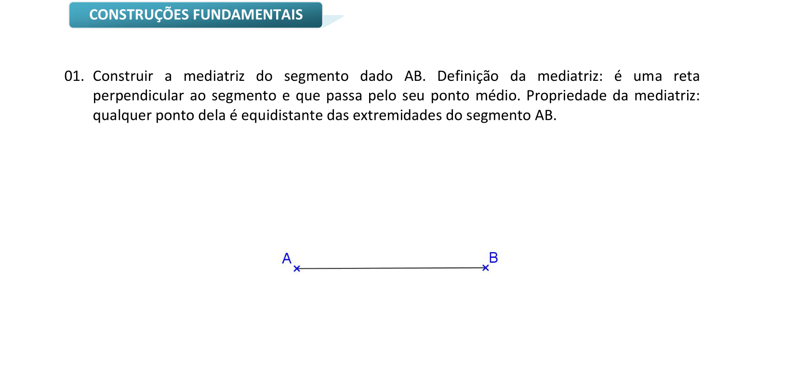
	

&#x1f4cf; &#x1f4d0; Resolução

	
 Vamos utilizar a régua e o compasso para resolver este exercício. Clique nos botões do passo a passo para fazer a construção na sua apostila.

	  <ul class="slider">
		  <li>
			   <input type="radio" id="1" name="sl" checked>
			   <label for="1"></label>
			   
			   <figcaption>Com a ponta seca em <b>A</b>, desenhe um arco com raio maior do que a metade de <b>AB</b>.</figcaption>
		   </li>
		   <li>
			   <input type="radio" id="2" name="sl">
			   <label for="2"></label>
			   
			   <figcaption>Com a ponta seca em <b>B</b>, desenhe um arco com o mesmo raio usado no passo anterior.</figcaption>
		   </li>
		   <li>
			   <input type="radio" id="3" name="sl">
			   <label for="3"></label>
			   
			   <figcaption>Os pontos de interseção dos arcos são <b>P</b> e <b>Q</b>.</figcaption>
		   </li>
		   <li>
			   <input type="radio" id="4" name="sl">
			   <label for="4"></label>
			   
			   <figcaption>Desenhe a reta que passa pelos pontos de interseção dos arcos.</figcaption>
		   </li>
		   <li>
			   <input type="radio" id="5" name="sl">
			   <label for="5"></label>
			   
			   <figcaption>Pronto! A mediatriz do segmento <b>AB</b> está construída. Note que a figura <b>PAQB</b> é um losango e, portanto, suas diagonais são perpendiculares e se encontram no ponto médio das mesmas.</figcaption>
		   </li>
		</ul>
		
  

  
<a href="#basico" class="topo">voltar ao topo</a>

  
  

&#x1f4cf; &#x1f4d0; Resolução com esquadros

  
Podemos utilizar a régua e um dos esquadros ou a régua e o compasso para resolver este exercício. Primeiro, veja como é a construção com a régua e o esquadro de 45&deg;.

  <ul class="slider">
      <li>
           <input type="radio" id="12" name="sl">
           <label for="12"></label>
           
           <figcaption>Alinhe um dos catetos do esquadro com a reta <b>r</b>.</figcaption>
       </li>
       <li>
           <input type="radio" id="13" name="sl">
           <label for="13"></label>
           
           <figcaption>Coloque a régua como apoio na hipotenusa do esquadro. A régua ficará fixa.</figcaption>
       </li>
       <li>
           <input type="radio" id="14" name="sl">
           <label for="14"></label>
           
           <figcaption>Deslize o esquadro até chegar na posição do ponto <b>P</b>. Lembre-se de não mover a régua.</figcaption>
       </li>
       <li>
           <input type="radio" id="15" name="sl">
           <label for="15"></label>
           
           <figcaption>Desenhe a reta que passa pelo ponto <b>P</b> com o cateto do esquadro.</figcaption>
       </li>
       <li>
           <input type="radio" id="16" name="sl">
           <label for="16"></label>
           
           <figcaption>Pronto! A reta paralela <b>s // r</b> está construída.</figcaption>
       </li>
    </ul>
    
  

  
<a href="#basico" class="topo">voltar ao topo</a>

  
  

&#x1f4cf; &#x1f4d0; Resolução com esquadros

  
 Vamos utilizar a régua e um dos esquadros para resolver este exercício. Clique nos botões do passo a passo para fazer a construção na sua apostila.

  <ul class="slider">
      <li>
           <input type="radio" id="22" name="sl">
           <label for="22"></label>
           
           <figcaption>Alinhe um dos catetos do esquadro com a reta <b>r</b>.</figcaption>
       </li>
       <li>
           <input type="radio" id="23" name="sl">
           <label for="23"></label>
           
           <figcaption>Coloque a régua como apoio na hipotenusa do esquadro. A régua ficará fixa.</figcaption>
       </li>
       <li>
           <input type="radio" id="24" name="sl">
           <label for="24"></label>
           
           <figcaption>Deslize o esquadro até o cateto vertical chegar na posição do ponto <b>P</b>. Lembre-se de não mover a régua.</figcaption>
       </li>
       <li>
           <input type="radio" id="25" name="sl">
           <label for="25"></label>
           
           <figcaption>Desenhe a reta que passa pelo ponto <b>P</b>.</figcaption>
       </li>
       <li>
           <input type="radio" id="26" name="sl">
           <label for="26"></label>
           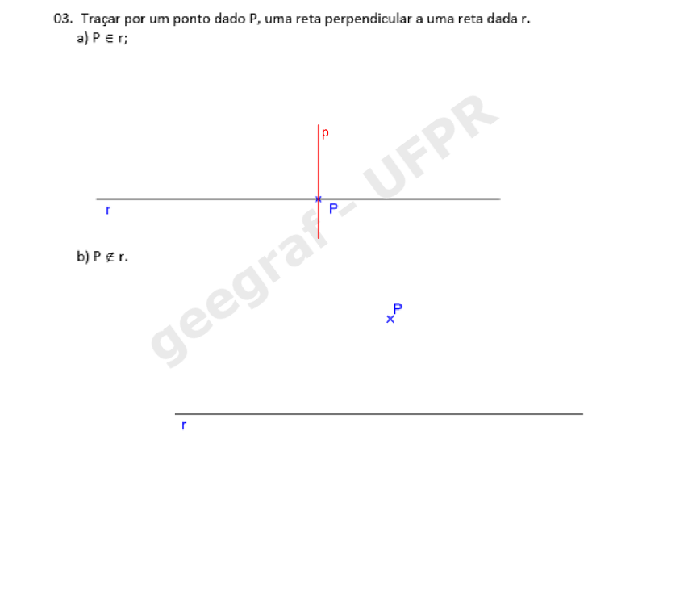
           <figcaption>Pronto! A reta perpendicular <b>p</b> está construída.</figcaption>
       </li>
       <li>
           <input type="radio" id="27" name="sl">
           <label for="27"></label>
           
           <figcaption>Alinhe um dos catetos do esquadro com a reta <b>r</b>.</figcaption>
       </li>
       <li>
           <input type="radio" id="28" name="sl">
           <label for="28"></label>
           
           <figcaption>Coloque a régua como apoio na hipotenusa do esquadro. A régua ficará fixa.</figcaption>
       </li>
       <li>
           <input type="radio" id="29" name="sl">
           <label for="29"></label>
           
           <figcaption>Deslize o esquadro até o cateto vertical chegar na posição do ponto <b>P</b>. Lembre-se de não mover a régua.</figcaption>
       </li>
       <li>
           <input type="radio" id="30" name="sl">
           <label for="30"></label>
           
           <figcaption>Desenhe a reta que passa pelo ponto <b>P</b>.</figcaption>
       </li>
       <li>
           <input type="radio" id="31" name="sl">
           <label for="31"></label>
           
           <figcaption>Pronto! A reta perpendicular <b>p</b> está construída.</figcaption>
       </li>
    </ul>
    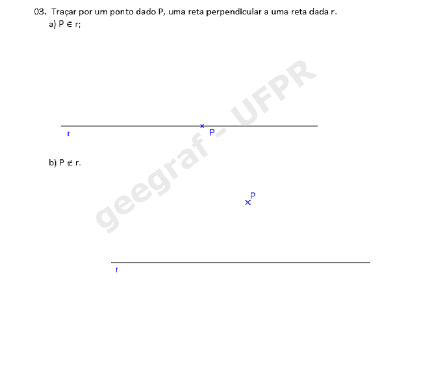
  

  
<a href="#basico" class="topo">voltar ao topo</a>

  
  

&#x1f4cf; &#x1f4d0; Resolução

  
 Vamos utilizar a régua e o compasso para resolver este exercício. Clique nos botões do passo a passo para fazer a construção na sua apostila.

  <ul class="slider">
      <li>
           <input type="radio" id="40" name="sl">
           <label for="40"></label>
           
           <figcaption>Com a ponta seca no vértice <b>O</b> do ângulo desenhe um arco obtendo os pontos <b>P</b> e <b>Q</b>, cada um em um lado do ângulo.</figcaption>
       </li>
       <li>
           <input type="radio" id="41" name="sl">
           <label for="41"></label>
           
           <figcaption>Com a ponta seca no ponto <b>P</b> desenhe um arco.</figcaption>
       </li>
	   <li>
           <input type="radio" id="41a" name="sl">
           <label for="41a"></label>
           
           <figcaption>Com a ponta seca em <b>Q</b> desenhe um arco com o mesmo raio do passo anterior, obtendo o ponto <b>R</b>.</figcaption>
       </li>
       <li>
           <input type="radio" id="42" name="sl">
           <label for="42"></label>
           
           <figcaption>Desenhe a reta <b>OR</b> que é a bissetriz do ângulo dado.</figcaption>
       </li>
       <li>
           <input type="radio" id="43" name="sl">
           <label for="43"></label>
           
           <figcaption>Note que construímos dois triângulos: um verde e outro laranja.</figcaption>
       </li>
       <li>
           <input type="radio" id="44" name="sl">
           <label for="44"></label>
           
           <figcaption>Esses triângulos são congruentes (iguais) e por isso os ângulos <b>&alpha;</b> e <b>&beta;</b> são também congruentes.</figcaption>
       </li>
    </ul>
    
  

  
<a href="#basico" class="topo">voltar ao topo</a>

1. Simetria Axial, Arcos e Ovais

  
Material da página 1 até a página 11.

   
   

&#x1f4d1; Propriedades

	
Dados os pontos <b>A</b>, <b>B</b> e <b>C</b>, os simétricos destes pontos são obtidos da seguinte maneira:

	  <ul class="slider">
		  <li>
			   <input type="radio" id="001" name="sl" checked>
			   <label for="001"></label>
			   
			   <figcaption>Construímos as retas perpendiculares ao eixo <b>e</b> que passam pelos pontos <b>A</b>, <b>B</b> e <b>C</b>.</figcaption>
		   </li>
		   <li>
			   <input type="radio" id="002" name="sl">
			   <label for="002"></label>
			   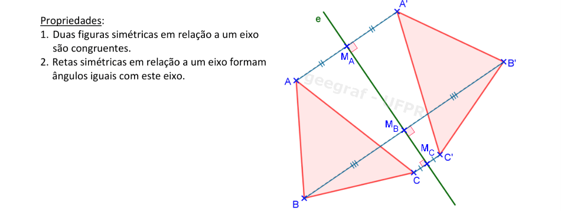
			   <figcaption>Depois, basta definir os homólogos <b>A'</b>, <b>B'</b> e <b>C'</b> pertencentes às respectivas perpendiculares e equidistantes ao eixo, ou seja, <b>AMA = A'MA</b>, <b>BMB = B'MB</b> e <b>CMC = C'MC</b>.</figcaption>
		   </li>
		</ul>
		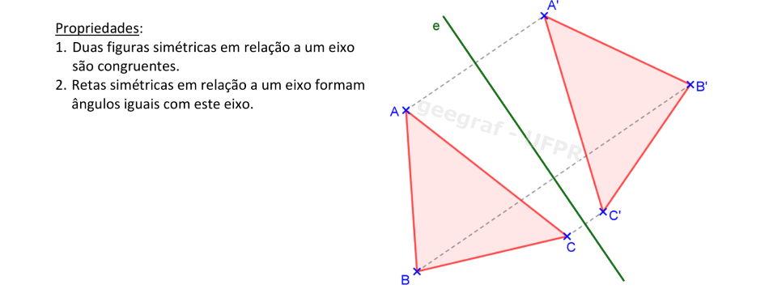
  

  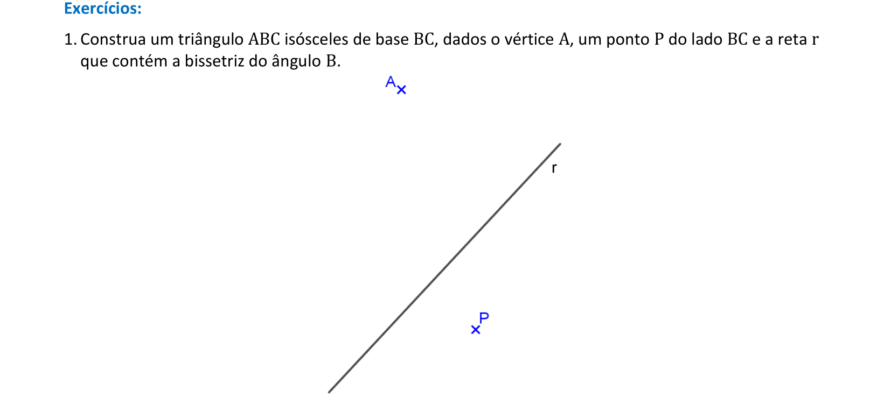
  

&#x1f4cf; &#x1f4d0; Resolução

	
Em um triângulo, a bissetriz de um ângulo serve como eixo de simetria para os pontos dos lados adjacentes a este ângulo.

	  <ul class="slider">
		  <li>
			   <input type="radio" id="003" name="sl" checked>
			   <label for="003"></label>
			   
			   <figcaption>A reta <b>r</b> é um eixo de simetria dos pontos <b>P</b> e <b>P'</b>. Logo, podemos construir uma reta perpendicular a <b>r</b> que passa por <b>P</b>.</figcaption>
		   </li>
		   <li>
			   <input type="radio" id="004" name="sl">
			   <label for="004"></label>
			   
			   <figcaption>Alinhando um catedo do esquadro de 45&deg; com a reta <b>r</b> e deixando o outro esquadro ou a régua como apoio na hipotenusa, podemos deslizar o esquadro de 45&deg; para construir com o outro cateto a reta perpendicular a <b>r</b>.</figcaption>
		   </li>
		   <li>
			   <input type="radio" id="005" name="sl">
			   <label for="005"></label>
			   
			   <figcaption>Depois, basta construir com o compasso os segmentos congruentes das distâncias de <b>P</b>...</figcaption>
		   </li>
		   <li>
			   <input type="radio" id="006" name="sl">
			   <label for="006"></label>
			   
			   <figcaption>... e de <b>P'</b> à reta <b>r</b>.</figcaption>
		   </li>
		   <li>
			   <input type="radio" id="007" name="sl">
			   <label for="007"></label>
			   
			   <figcaption>Unindo os pontos <b>A</b> e <b>P'</b>, encontramos <b>B</b> na interseção com a reta <b>r</b>.</figcaption>
		   </li>
		   <li>
			   <input type="radio" id="008" name="sl">
			   <label for="008"></label>
			   
			   <figcaption>Como o triângulo isósceles tem base <b>BC</b>, temos que <b>AB = AC</b>. Usando o compasso com a ponta seca em <b>A</b> e raio <b>AB</b>...</figcaption>
		   </li>
		   <li>
			   <input type="radio" id="009" name="sl">
			   <label for="009"></label>
			   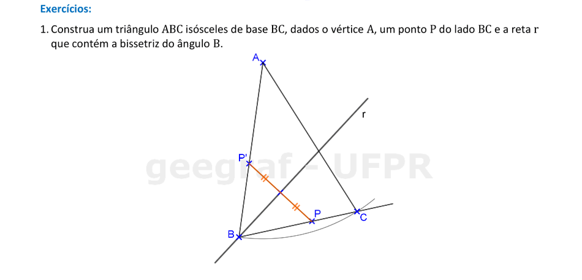
			   <figcaption>... encontramos o vértice <b>C</b> na reta suporte <b>BP</b>.</figcaption>
		   </li>
		</ul>
		
  

   
<a href="#modulo1" class="topo">voltar ao topo</a>

   
   

&#x1f4cf; &#x1f4d0; Resolução

	
Em um triângulo, a bissetriz de um ângulo serve como eixo de simetria para os pontos dos lados adjacentes a este ângulo.

	  <ul class="slider">
		  <li>
			   <input type="radio" id="010" name="sl" checked>
			   <label for="010"></label>
			   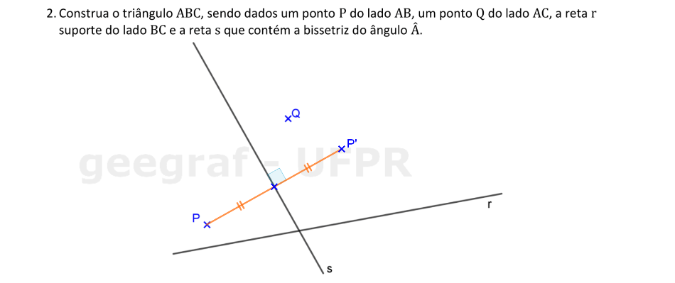
			   <figcaption>A reta <b>s</b> é um eixo de simetria dos pontos <b>P</b> e <b>P'</b> que pertencem aos lados <b>AB</b> e <b>AC</b>.</figcaption>
		   </li>
		   <li>
			   <input type="radio" id="011" name="sl">
			   <label for="011"></label>
			   
			   <figcaption>A reta <b>s</b> é também um eixo de simetria dos pontos <b>Q</b> e <b>Q'</b> que pertencem aos lados <b>AC</b> e <b>AB</b>.</figcaption>
		   </li>
		   <li>
			   <input type="radio" id="012" name="sl">
			   <label for="012"></label>
			   
			   <figcaption>Determinando as retas <b>PQ'</b> e <b>P'Q</b>, encontramos os vértices do triângulo nas retas <b>r</b> e <b>s</b>.</figcaption>
		   </li>
		</ul>
		
  

   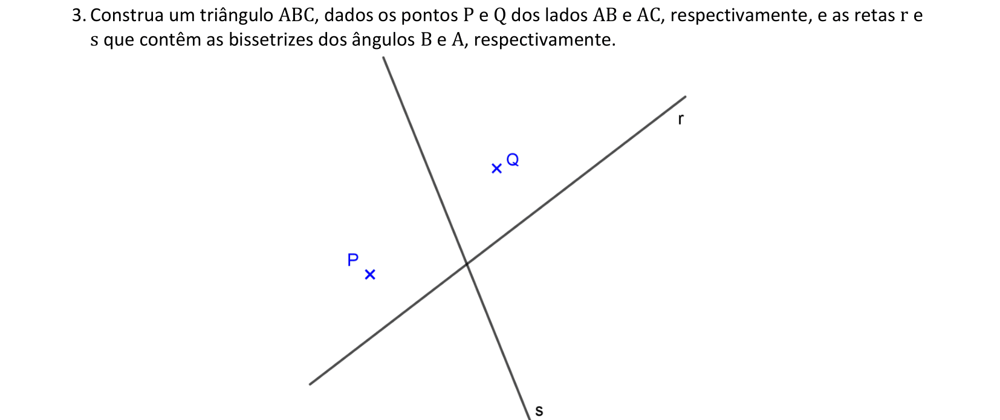
   

&#x1f4cf; &#x1f4d0; Resolução

	
Em um triângulo, a bissetriz de um ângulo serve como eixo de simetria para os pontos dos lados adjacentes a este ângulo.

	  <ul class="slider">
		  <li>
			   <input type="radio" id="013" name="sl" checked>
			   <label for="013"></label>
			   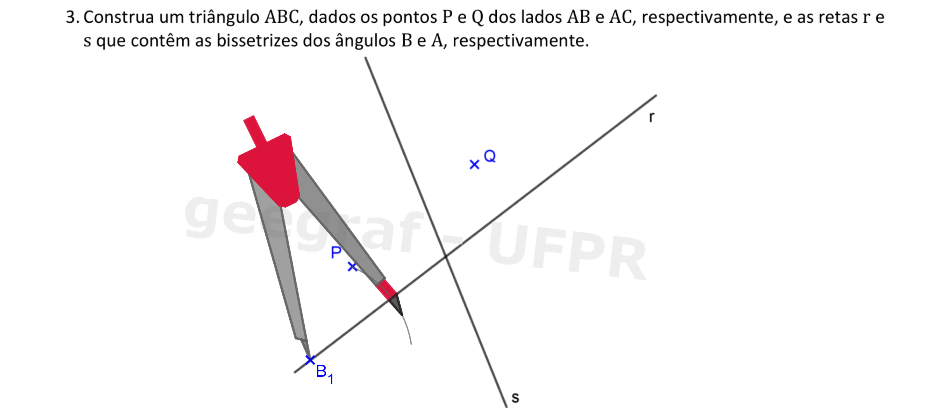
			   <figcaption>A reta <b>r</b> é um eixo de simetria dos pontos <b>P</b> e <b>P'</b> que pertencem aos lados <b>AB</b> e <b>BC</b>. Se construirmos um arco de circunferência com centro em um ponto <b>B1</b> sobre <b>r</b>, que passe por <b>P</b>...</figcaption>
		   </li>
		   <li>
			   <input type="radio" id="014" name="sl">
			   <label for="014"></label>
			   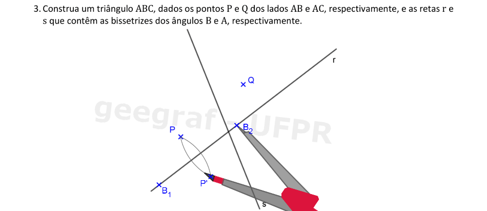
			   <figcaption>... e outro arco com centro em um ponto <b>B2</b> sobre <b>r</b>, que passe por <b>P</b>, encontramos <b>P'</b> simétrico de <b>P</b> em relação a <b>r</b> (pois os triângulos <b>&#9651;PB1B2</b> e <b>&#9651;P'B1B2</b> são congruentes).</figcaption>
		   </li>
		   <li>
			   <input type="radio" id="015" name="sl">
			   <label for="015"></label>
			   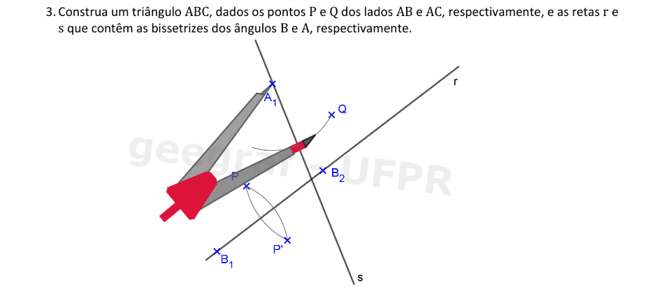
			   <figcaption>Construindo da mesma forma, o arco de circunferência com centro em um ponto qualquer <b>A1</b> de <b>s</b> e raio <b>QA1</b>...</figcaption>
		   </li>
		   <li>
			   <input type="radio" id="016" name="sl" checked>
			   <label for="016"></label>
			   
			   <figcaption>... e o arco de centro em <b>A2</b> de <b>s</b> com raio <b>QA2</b> encontramos o simétrico de <b>Q</b> em relação a <b>s</b>.</figcaption>
		   </li>
		   <li>
			   <input type="radio" id="017" name="sl">
			   <label for="017"></label>
			   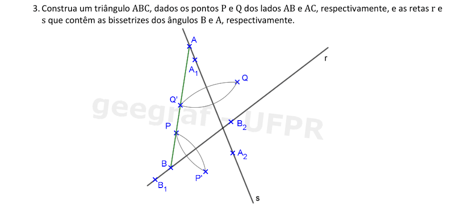
			   <figcaption>A reta <b>PQ'</b> determina os vértices <b>A</b> e <b>B</b> nas retas <b>r</b> e <b>s</b>.</figcaption>
		   </li>
		   <li>
			   <input type="radio" id="018" name="sl">
			   <label for="018"></label>
			   
			   <figcaption>As retas <b>AQ</b> e <b>BP'</b> determinam o vértice <b>C</b>.</figcaption>
		   </li>
		</ul>
		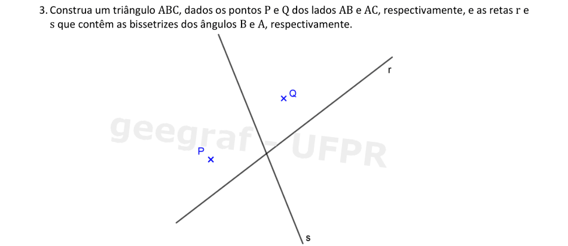
  

   
   
&#x1f4cf; &#x1f4d0; Exercício proposto 1.1

   
<a href="#modulo1" class="topo">voltar ao topo</a>

   
   

&#x1f4cf; &#x1f4d0; Resolução

	
Em um triângulo isósceles, a mediatriz da base serve como eixo de simetria para os pontos das laterais deste triângulo.

	  <ul class="slider">
		  <li>
			   <input type="radio" id="019" name="sl" checked>
			   <label for="019"></label>
			   
			   <figcaption>A reta <b>r</b> é um eixo de simetria dos pontos <b>P</b> e <b>P'</b> que pertencem aos lados <b>AB</b> e <b>AC</b>. Construa o simétrico de <b>P</b> em relação à reta <b>r</b>.</figcaption>
		   </li>
		   <li>
			   <input type="radio" id="020" name="sl">
			   <label for="020"></label>
			   
			   <figcaption>A reta <b>r</b> é também um eixo de simetria dos pontos <b>Q</b> e <b>Q'</b> que pertencem aos lados <b>AC</b> e <b>AB</b>. Construa o simétrico de <b>Q</b> em relação à reta <b>r</b>.</figcaption>
		   </li>
		   <li>
			   <input type="radio" id="021" name="sl">
			   <label for="021"></label>
			   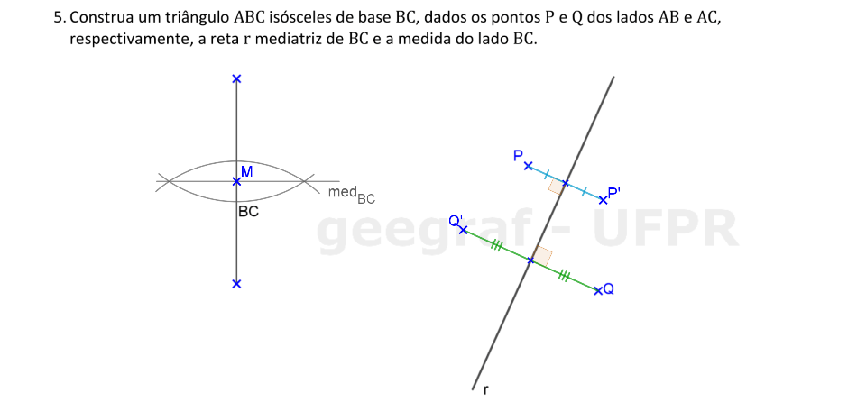
			   <figcaption>Vamos encontrar a metade da medida da base construindo a mediatriz de <b>BC</b>.</figcaption>
		   </li>
		   <li>
			   <input type="radio" id="022" name="sl" checked>
			   <label for="022"></label>
			   
			   <figcaption>Escolhendo um ponto qualquer <b>R</b> da reta <b>r</b>, construa os segmentos <b>RB'</b> e <b>RC'</b> perpendiculares a <b>r</b> com medidas iguais a $\mathsf{BC \over 2}$.</figcaption>
		   </li>
		   <li>
			   <input type="radio" id="023" name="sl">
			   <label for="023"></label>
			   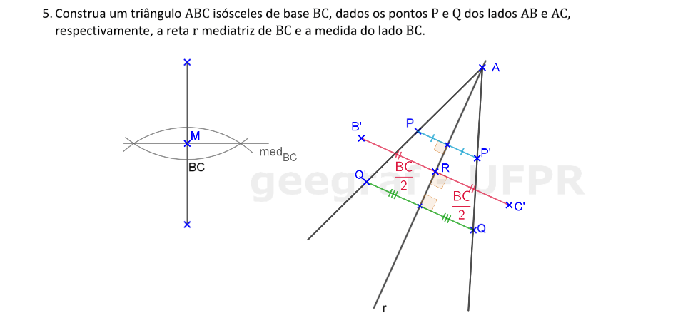
			   <figcaption>Os pontos <b>B</b> e <b>C</b> pertencem às retas <b>AQ'</b> e <b>AP'</b>.</figcaption>
		   </li>
		   <li>
			   <input type="radio" id="024" name="sl">
			   <label for="024"></label>
			   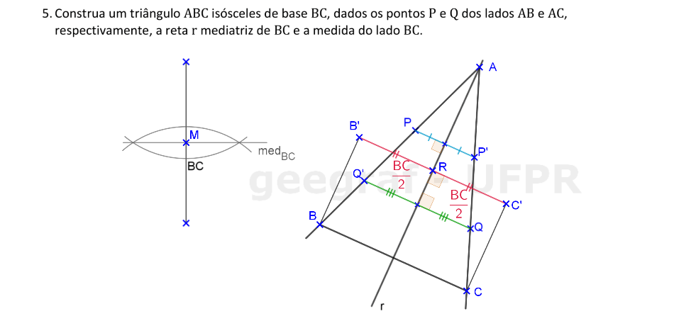
			   <figcaption>Outro lugar geométrico dos pontos <b>B</b> e <b>C</b> é o par de retas paralelas à reta <b>r</b> que passam por <b>B'</b> e <b>C'</b>.</figcaption>
		   </li>
		</ul>
		
  

   
   

&#x1f4cf; &#x1f4d0; Resolução

	
Neste problema, vamos usar o conceito da menor distância entre dois pontos de um plano.

	  <ul class="slider">
		  <li>
			   <input type="radio" id="025" name="sl" checked>
			   <label for="025"></label>
			   
			   <figcaption>Quando <b>A</b> e <b>B</b> estão em semi-planos opostos em relação à reta <b>r</b>, basta encontrar a menor distância entre <b>A</b> e <b>B</b> definida pelo segmento de reta <b>AB</b>.</figcaption>
		   </li>
		   <li>
			   <input type="radio" id="026" name="sl">
			   <label for="026"></label>
			   
			   <figcaption>Usando o conceito anterior, se construirmos o simétrico de um dos pontos (<b>B</b>) em relação à reta <b>r</b>, a menor distância entre o outro ponto (<b>A</b>) e o simétrico encontrado (<b>B'</b>) será o segmento de reta (<b>AB'</b>).</figcaption>
		   </li>
		   <li>
			   <input type="radio" id="027" name="sl">
			   <label for="027"></label>
			   
			   <figcaption>Logo, temos que <b>BX = B'X</b>, e a trajetória mínima será <b>AX + XB</b>.</figcaption>
		   </li>
		</ul>
		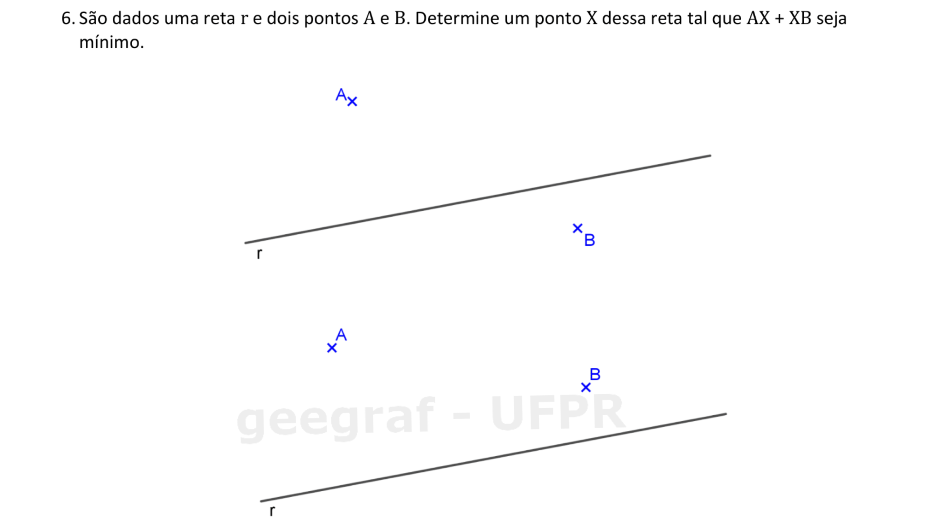
  

   
<a href="#modulo1" class="topo">voltar ao topo</a>

   
   

&#x1f4cf; &#x1f4d0; Resolução

	
Neste problema, vamos usar o conceito dos ângulos de incidência e reflexão nas tabelas da mesa de bilhar.

	  <ul class="slider">
		  <li>
			   <input type="radio" id="028" name="sl" checked>
			   <label for="028"></label>
			   
			   <figcaption>Se construirmos o simétrico de <b>Q</b> em relação à ultima tabela <b>BC</b>, teremos o ângulo de incidência igual ao ângulo de reflexão nesta tabela.</figcaption>
		   </li>
		   <li>
			   <input type="radio" id="029" name="sl">
			   <label for="029"></label>
			   
			   <figcaption>Usando o mesmo raciocínio, se construirmos o simétrico de <b>Q'</b> em relação à primeira tabela <b>AB</b>, teremos o ângulo de incidência igual ao ângulo de reflexão nesta tabela.</figcaption>
		   </li>
		   <li>
			   <input type="radio" id="030" name="sl">
			   <label for="030"></label>
			   
			   <figcaption>Unindo os pontos <b>P</b> e <b>Q''</b>, temos o ponto <b>X1</b> da trajetória que a bola fará ao sair da posição <b>P</b> com tabela <b>AB</b>.</figcaption>
		   </li>
		   <li>
			   <input type="radio" id="031" name="sl">
			   <label for="031"></label>
			   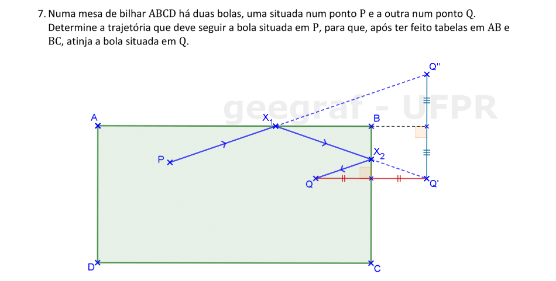
			   <figcaption>Unindo os pontos <b>X1</b> com <b>Q'</b> temos o ponto <b>X2</b> da trajetória que a bola fará ao sair da posição <b>X1</b> com tabela <b>BC</b>. Como o ângulo de incidência é igual ao ângulo de reflexão de cada tabela, a bola que estava na posição <b>P</b> atinge a bola que está na posição <b>Q</b> depois de fazer as tabelas <b>AB</b> e <b>BC</b> solicitadas.</figcaption>
		   </li>
		</ul>
		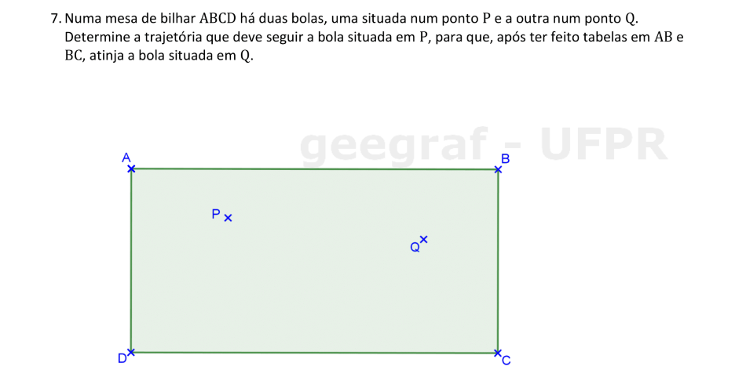
  

   
   
&#x1f4cf; &#x1f4d0; Exercício proposto 1.2

   
<a href="#modulo1" class="topo">voltar ao topo</a>

   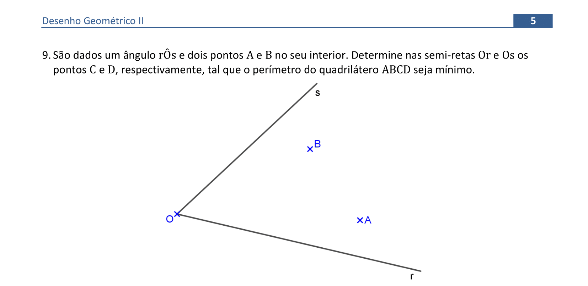
   

&#x1f4cf; &#x1f4d0; Solução

	
Usando o conceito de distância mínima entre dois pontos, podemos encontrar os simétricos dos vértices <b>A</b> e <b>B</b> em relação aos lados do ângulo.

	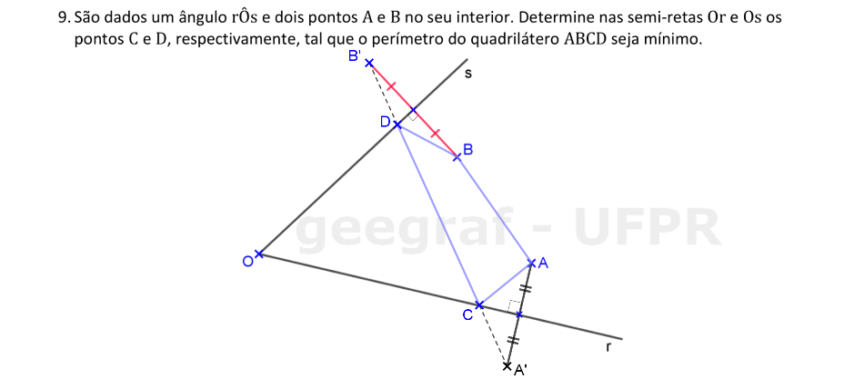
	<figcaption>Desta forma, temos que as distâncias <b>BD</b> e <b>AC</b> são mínimas. Logo, o quadrilátero <b>ABCD</b> tem perímetro mínimo.</figcaption>
  

   
   

&#x1f4cf; &#x1f4d0; Solução

	
Usando o conceito de distância mínima entre dois pontos, podemos encontrar os simétricos do vértice <b>A</b> em relação aos lados do ângulo.

	
	<figcaption>Desta forma, temos que as distâncias <b>AB</b> e <b>AC</b> são mínimas. Logo, o triângulo <b>ABC</b> tem perímetro mínimo.</figcaption>
  

   
   

&#x1f4cf; &#x1f4d0; Solução

	
Usando o conceito de ângulos de incidência e reflexão, podemos encontrar os simétricos do foco <b>F</b> e do objeto <b>O</b> em relação aos espelhos planos <b>r</b> e <b>s</b>.

	
	<figcaption>Desta forma, temos que a trajetória da fonte de luz saindo de <b>F</b>, atingindo o espelho <b>r</b> em <b>X2</b>, depois atingindo o espelho <b>s</b> em <b>X1</b> para finalmente atingir o objeto em <b>O</b>.</figcaption>
  

   
<a href="#modulo1" class="topo">voltar ao topo</a>

   
   

&#x1f4d1; Propriedades

	
Considere o arco de ferradura mostrado nesta página. Vamos analisar quais são os elementos de um arco arquitetônico.

	  <ul class="slider">
		  <li>
			   <input type="radio" id="032" name="sl" checked>
			   <label for="032"></label>
			   
			   <figcaption>Os pontos <b>A</b> e <b>B</b> definem o começo do arco e são chamados de pontos de nascença.</figcaption>
		   </li>
		   <li>
			   <input type="radio" id="033" name="sl">
			   <label for="033"></label>
			   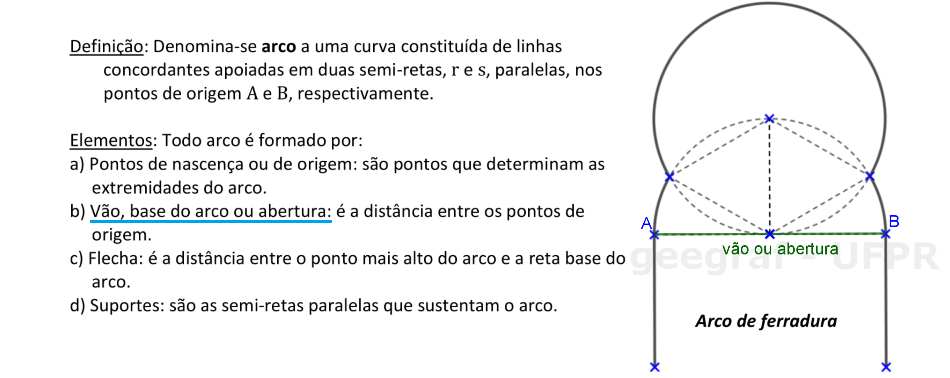
			   <figcaption>A distância entre os pontos de nascença <b>AB</b> é chamada de vão ou abertura do arco. O segmento <b>AB</b> pode ser considerado também como a base do arco.</figcaption>
		   </li>
		   <li>
			   <input type="radio" id="034" name="sl">
			   <label for="034"></label>
			   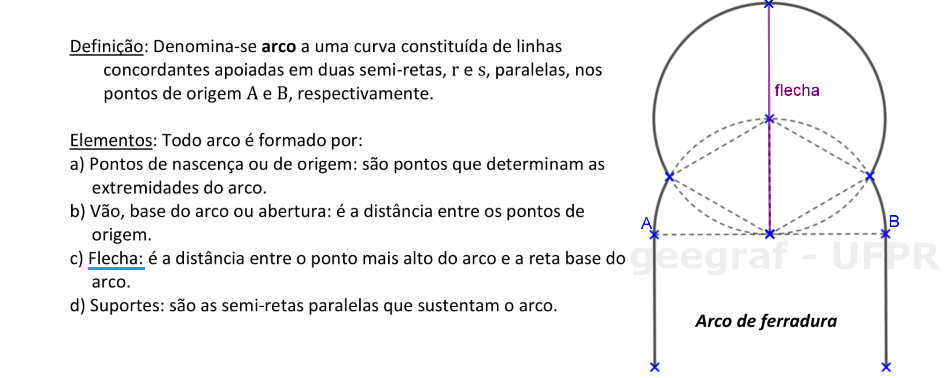
			   <figcaption>A distância entre o ponto mais alto do arco e a base é chamada de flecha do arco.</figcaption>
		   </li>
		   <li>
			   <input type="radio" id="035" name="sl">
			   <label for="035"></label>
			   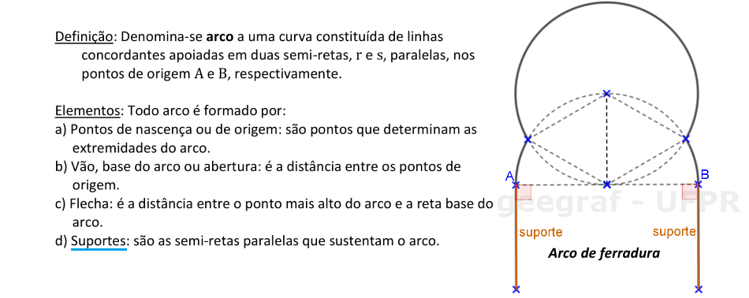
			   <figcaption>As semi-retas perpendiculares ao vão, que geralmente passam pelas extremidades deste segmento, são chamadas de suportes do arco. São as semi-retas que sustentam o arco arquitetônico.</figcaption>
		   </li>
		</ul>
		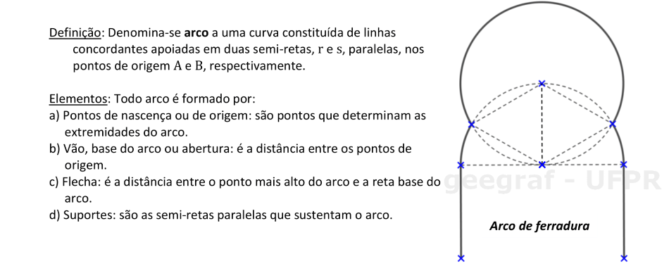
  

   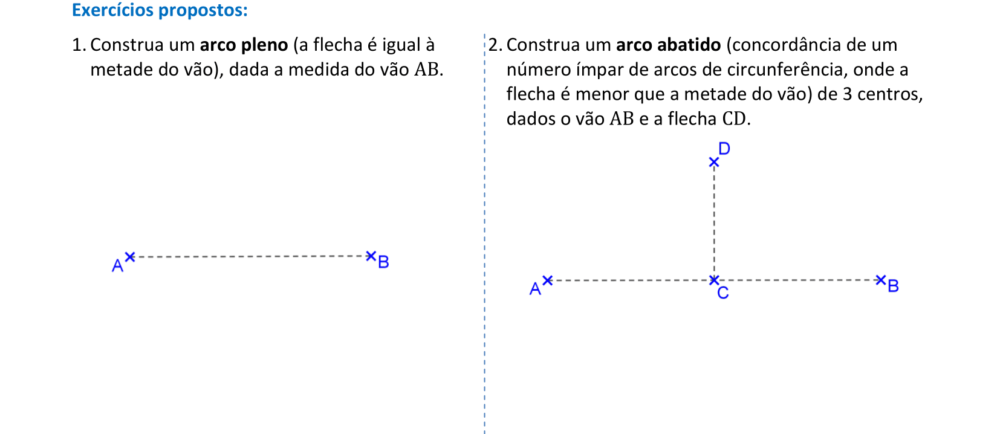
   

&#x1f4cf; &#x1f4d0; Resolução: 1&ordf; parte

	
O arco pleno tem o centro na metade do vão.

	  <ul class="slider">
		  <li>
			   <input type="radio" id="036" name="sl" checked>
			   <label for="036"></label>
			   
			   <figcaption>Vamos construir a mediatriz do vão <b>AB</b>. Usando um arco de abertura maior do que a metade do vão, com centro em <b>A</b>...</figcaption>
		   </li>
		   <li>
			   <input type="radio" id="037" name="sl">
			   <label for="037"></label>
			   
			   <figcaption>... e outro arco de mesmo raio com centro em <b>B</b>...</figcaption>
		   </li>
		   <li>
			   <input type="radio" id="038" name="sl">
			   <label for="038"></label>
			   
			   <figcaption>... definimos a <b>medAB</b> e o centro <b>C</b> do arco pleno.</figcaption>
		   </li>
		   <li>
			   <input type="radio" id="039" name="sl">
			   <label for="039"></label>
			   
			   <figcaption>Alinhando um cateto de um dos esquadros com o vão e apoiando a hipotenusa com outro esquadro ou com a régua, podemos deslizar o esquadro alinhado...</figcaption>
		   </li>
		   <li>
			   <input type="radio" id="040" name="sl">
			   <label for="040"></label>
			   
			   <figcaption>... até passar pela extremidade <b>B</b> do vão, definindo um dos suportes. Construindo o arco de centro em <b>C</b> e raio <b>CA = CB</b>, temos o arco pleno...</figcaption>
		   </li>
		   <li>
			   <input type="radio" id="041" name="sl">
			   <label for="041"></label>
			   
			   <figcaption>.. e deslizando o esquadro até passar pela extremidade <b>A</b> do vão, encontramos o outro suporte do arco.</figcaption>
		   </li>
		   <li>
			   <input type="radio" id="042" name="sl">
			   <label for="042"></label>
			   
			   <figcaption>Este é o arco pleno, um dos mais simples de construir.</figcaption>
		   </li>
		</ul>
		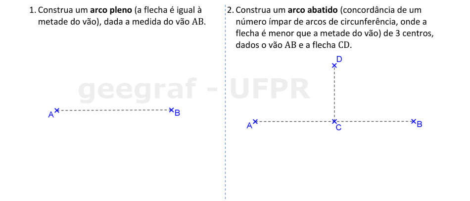
  

  

&#x1f4cf; &#x1f4d0; Resolução: 2&ordf; parte

	
Agora vamos construir o arco abatido, com o uso de 3 centros. A flecha está definida pelo segmento <b>CD</b>, que contém o ponto mais alto deste arco.

	  <ul class="slider">
		  <li>
			   <input type="radio" id="043" name="sl" checked>
			   <label for="043"></label>
			   
			   <figcaption>Com o compasso, vamos usar a medida da flecha <b>CD</b>.</figcaption>
		   </li>
		   <li>
			   <input type="radio" id="044" name="sl">
			   <label for="044"></label>
			   
			   <figcaption>Construa a semi-circunferência com centro em <b>C</b> e raio igual à flecha <b>CD</b>, determinando no vão os pontos <b>E</b> e <b>F</b>.</figcaption>
		   </li>
		   <li>
			   <input type="radio" id="046" name="sl">
			   <label for="046"></label>
			   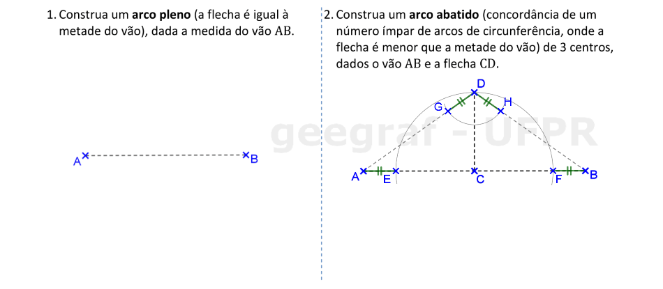
			   <figcaption>Com o compasso, construa os segmentos <b>DG = AE = BF</b> e <b>DH = AE = BF</b> nos segmentos <b>AD</b> e <b>BD</b>.</figcaption>
		   </li>
		   <li>
			   <input type="radio" id="048" name="sl">
			   <label for="048"></label>
			   
			   <figcaption>Encontre as mediatrizes dos segmentos <b>AG</b> e <b>BH</b> e o ponto de interseção <b>I</b> destas mediatrizes: este é um dos centros do arco abatido.</figcaption>
		   </li>
		   <li>
			   <input type="radio" id="049" name="sl">
			   <label for="049"></label>
			   
			   <figcaption>Com centro em <b>I</b> e raio <b>ID</b> a primeira parte do arco que começa na mediatriz de <b>AG</b> e termina na mediatriz de <b>BH</b>.</figcaption>
		   </li>
		   <li>
			   <input type="radio" id="050" name="sl">
			   <label for="050"></label>
			   
			   <figcaption>Os outros centros são <b>K</b> e <b>J</b>: as outras partes do arco abatido têm raios <b>AJ</b> e <b>BK</b>. Para finalizar o arco, alinhamos um dos esquadros para construir as semi-retas perpendiculares ao vão <b>AB</b>...</figcaption>
		   </li>
		   <li>
			   <input type="radio" id="051" name="sl">
			   <label for="051"></label>
			   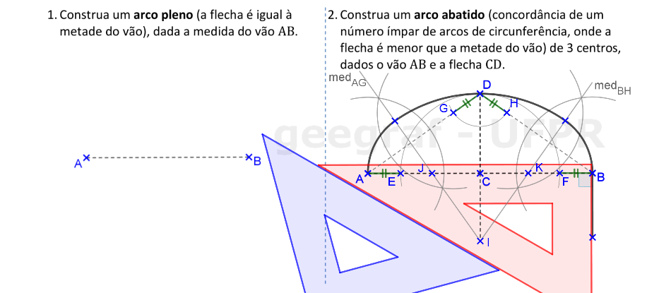
			   <figcaption>... que passam por <b>B</b>...</figcaption>
		   </li>
		   <li>
			   <input type="radio" id="052" name="sl">
			   <label for="052"></label>
			   
			   <figcaption>... e pelo ponto <b>A</b>.</figcaption>
		   </li>
		   <li>
			   <input type="radio" id="053" name="sl">
			   <label for="053"></label>
			   
			   <figcaption>Este é um arco abatido com 3 centros: <b>I</b>, <b>J</b> e <b>K</b>.</figcaption>
		   </li>
		</ul>
		
  

   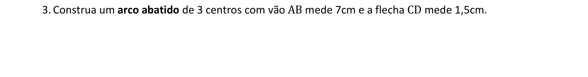
   
&#x1f4cf; &#x1f4d0; Exercício proposto 1.3

   
<a href="#modulo1" class="topo">voltar ao topo</a>

   
   

&#x1f4cf; &#x1f4d0; Solução

	
Quando a medida da flecha não for considerada, podemos definir a mediatriz do vão <b>AB</b> como eixo de simetria e escolher um centro <b>E</b> qualquer da mediatriz.

	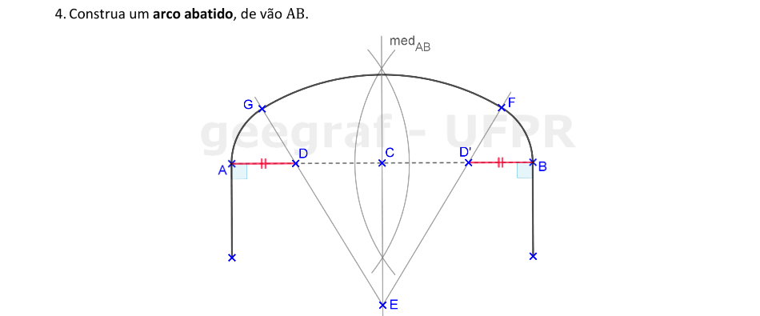
	<figcaption>Definindo o centro <b>D</b> qualquer sobre o vão, temos o terceiro centro <b>D'</b> simétrico de <b>D</b> em relação à mediatriz. As retas <b>ED</b> e <b>ED'</b> são usadas como limites para os três arcos que formam o arco abatido.</figcaption>
  

  
   

&#x1f4cf; &#x1f4d0; Resolução

	
Vamos começar construindo os centros do arco maior com um retângulo de lados iguais ao vão <b>AB</b> e a flecha <b>CD</b>.

	  <ul class="slider">
		  <li>
			   <input type="radio" id="054" name="sl" checked>
			   <label for="054"></label>
			   
			   <figcaption>Alinhe a hipotenusa de um dos esquadros com o vão <b>AB</b>, deixando um cateto apoiado com o outro esquadro ou com a régua.</figcaption>
		   </li>
		   <li>
			   <input type="radio" id="055" name="sl">
			   <label for="055"></label>
			   
			   <figcaption>Deslize o esquadro alinhado, construindo a reta paralela ao vão que passa por <b>D</b>.</figcaption>
		   </li>
		   <li>
			   <input type="radio" id="056" name="sl">
			   <label for="056"></label>
			   
			   <figcaption>Construa da mesma forma as paralelas à flecha <b>CD</b> que passam pelas extremidades do vão <b>A</b> e <b>B</b>. Temos o retângulo <b>AEFB</b>.</figcaption>
		   </li>
		   <li>
			   <input type="radio" id="058" name="sl">
			   <label for="058"></label>
			   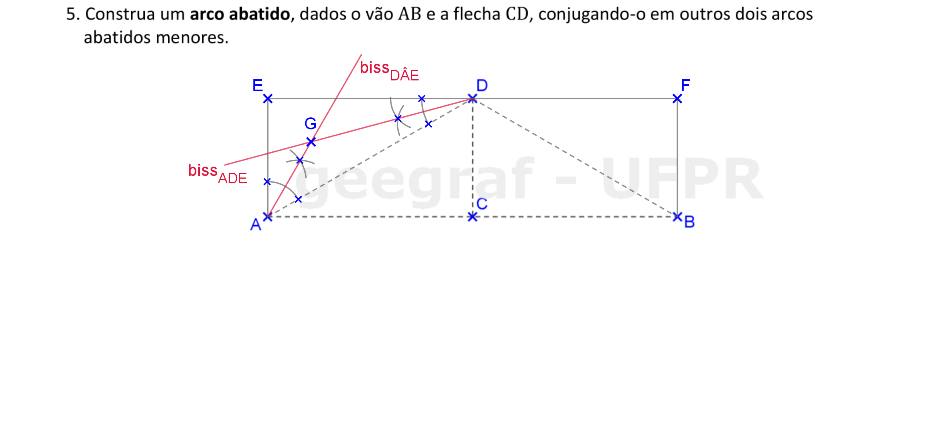
			   <figcaption>Construa as bissetrizes dos ângulos <b>DÂE</b> e <b>ADE</b>, definindo o incentro <b>G</b> do <b>&#9651;ADE</b>.</figcaption>
		   </li>
		   <li>
			   <input type="radio" id="059" name="sl">
			   <label for="059"></label>
			   
			   <figcaption>A reta <b>HG &perp; AD</b> define os centros <b>I</b> e <b>H</b> do arco abatido maior.</figcaption>
		   </li>
		   <li>
			   <input type="radio" id="060" name="sl">
			   <label for="060"></label>
			   
			   <figcaption>Construa os segmentos sobre o vão do arco: <b>CJ = AI = CK = BL</b>. Note que os pontos <b>I</b> e <b>L</b> são simétricos em relação à flecha <b>CD</b>. O mesmo acontece com os pontos <b>J</b> e <b>K</b>.</figcaption>
		   </li>
		   <li>
			   <input type="radio" id="061" name="sl">
			   <label for="061"></label>
			   
			   <figcaption>Os centros <b>I</b> e <b>L</b> definem as duas partes simétricas do arco maior até as retas <b>HG</b> e <b>HL</b>.</figcaption>
		   </li>
		   <li>
			   <input type="radio" id="062" name="sl">
			   <label for="062"></label>
			   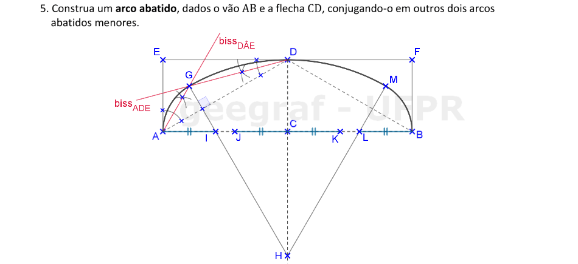
			   <figcaption>A parte mais alta do arco maior tem centro em <b>H</b> e raio <b>HD</b>.</figcaption>
		   </li>
		   <li>
			   <input type="radio" id="063" name="sl">
			   <label for="063"></label>
			   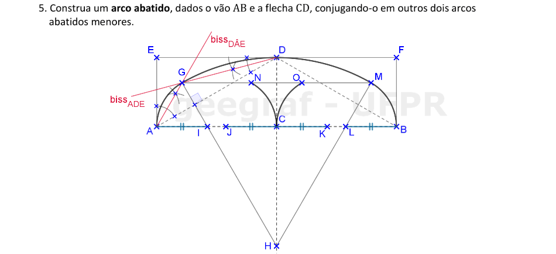
			   <figcaption>A reta <b>GM</b> serve como limite dos arcos menores. Logo, podemos construir os arcos com centros em <b>J</b> e <b>K</b> e raios iguais a <b>CJ</b> até intersectar a reta <b>GM</b>.</figcaption>
		   </li>
		   <li>
			   <input type="radio" id="064" name="sl">
			   <label for="064"></label>
			   
			   <figcaption>Agora precisamos encontrar os centros dos arcos abatidos menores. As retas <b>NJ</b> e <b>OK</b> intersectam as retas <b>HG</b> e <b>HL</b> nos centros <b>P</b> e <b>Q</b>.</figcaption>
		   </li>
		   <li>
			   <input type="radio" id="065" name="sl">
			   <label for="065"></label>
			   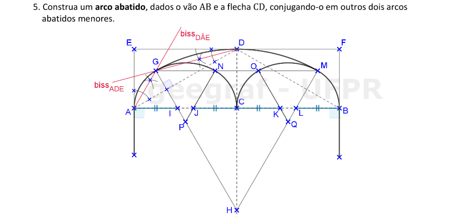
			   <figcaption>Construindo os arcos de centros <b>P</b> e <b>Q</b> e os suportes, temos o arco abatido conjugado em dois arcos abatidos menores.</figcaption>
		   </li>
		</ul>
		
  

  
   
   

&#x1f4cf; &#x1f4d0; Resolução

	
Vamos construir o arco ogival de duas formas: considerando a flecha com tamanho fixo e com a flecha dependente da medida do vão <b>AB</b>.

	  <ul class="slider">
		  <li>
			   <input type="radio" id="066" name="sl" checked>
			   <label for="066"></label>
			   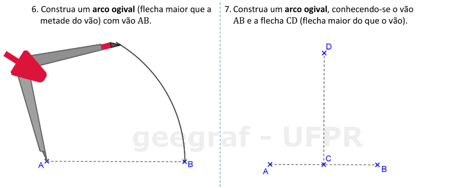
			   <figcaption>Neste primeiro caso, vamos considerar a flecha com a medida que depende da medida do vão <b>AB</b>. Construa o arco de circunferência com a medida do raio igual a <b>AB</b>.</figcaption>
		   </li>
		   <li>
			   <input type="radio" id="067" name="sl">
			   <label for="067"></label>
			   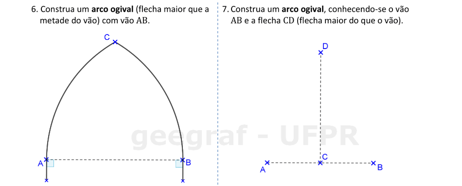
			   <figcaption>Fazendo o mesmo no ponto <b>B</b>, temos um arco ogival.</figcaption>
		   </li>
		   <li>
			   <input type="radio" id="068" name="sl">
			   <label for="068"></label>
			   
			   <figcaption>Considerando a medida fixa da flecha <b>CD</b>, vamos encontrar o centro do arco que passa por <b>B</b> e <b>D</b> usando a mediatriz de <b>BD</b>. O ponto <b>E</b> pertencente ao prolongamento do vão é o centro do primeiro arco.</figcaption>
		   </li>
		   <li>
			   <input type="radio" id="069" name="sl">
			   <label for="069"></label>
			   
			   <figcaption>O ponto <b>F</b>, centro do segundo arco, está na interseção da mediatriz de <b>AD</b> com o prolongamento do vão <b>AB</b>.</figcaption>
		   </li>
		   <li>
			   <input type="radio" id="070" name="sl">
			   <label for="070"></label>
			   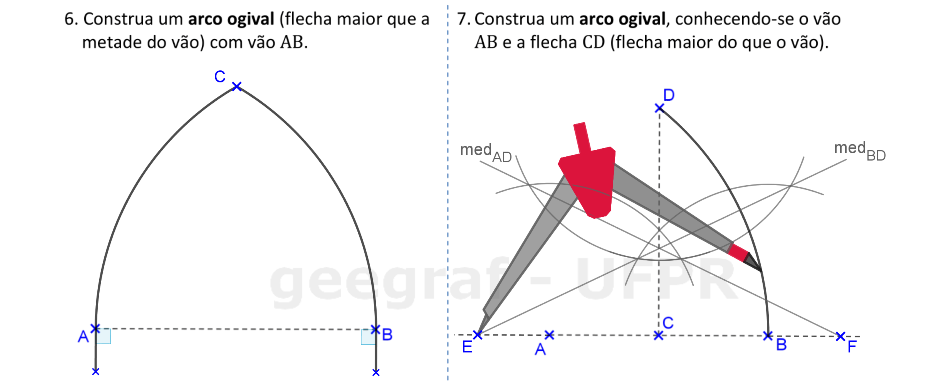
			   <figcaption>Construa o primeiro arco, com centro em <b>E</b> e raio com medida <b>EB</b>.</figcaption>
		   </li>
		   <li>
			   <input type="radio" id="071" name="sl">
			   <label for="071"></label>
			   
			   <figcaption>O segundo arco tem centro <b>F</b> e raio com medida <b>AF</b>.</figcaption>
		   </li>
		</ul>
		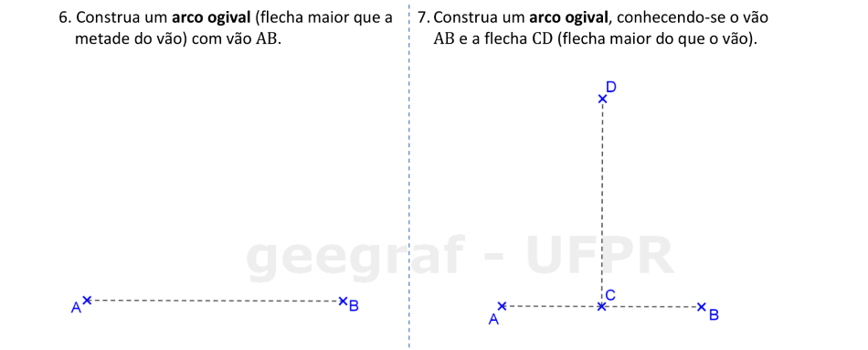
  

  
   
<a href="#modulo1" class="topo">voltar ao topo</a>

   
   

&#x1f4cf; &#x1f4d0; Resolução

	
Vamos construir um arco ogival com a flecha com tamanho menor do que o vão e um arco gótico.

	  <ul class="slider">
		  <li>
			   <input type="radio" id="072" name="sl" checked>
			   <label for="072"></label>
			   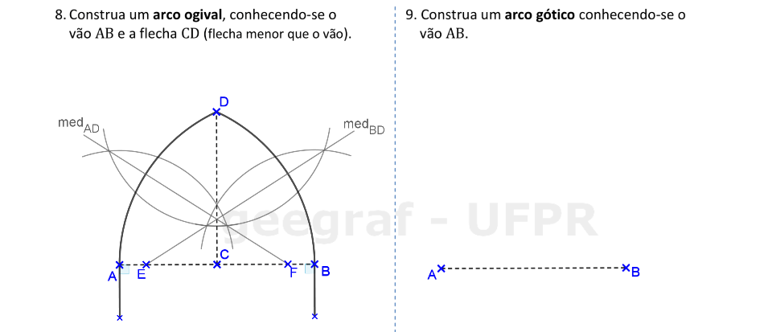
			   <figcaption>A construção fica parecida com o exercício anterior, porém, os centros <b>E</b> e <b>F</b> ficam entre as extremidades do vão.</figcaption>
		   </li>
		   <li>
			   <input type="radio" id="073" name="sl">
			   <label for="073"></label>
			   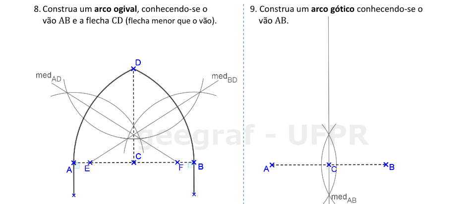
			   <figcaption>Para construir o arco gótico, começamos com  a mediatriz do vão <b>AB</b>.</figcaption>
		   </li>
		   <li>
			   <input type="radio" id="074" name="sl">
			   <label for="074"></label>
			   
			   <figcaption>A metade do vão é usada para encontrar <b>CD</b> na mediatriz de <b>AB</b>.</figcaption>
		   </li>
		   <li>
			   <input type="radio" id="075" name="sl">
			   <label for="075"></label>
			   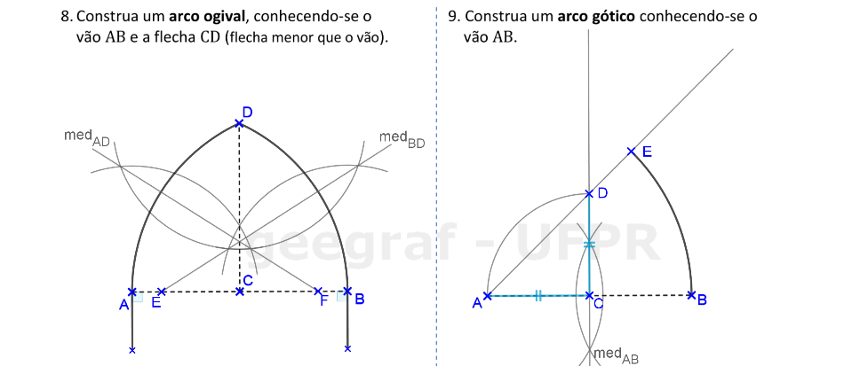
			   <figcaption>Uma parte do arco gótico tem centro em <b>A</b>, raio <b>AB</b>, começando em <b>B</b> até o prolongamento da semi-reta <b>AD</b>.</figcaption>
		   </li>
		   <li>
			   <input type="radio" id="076" name="sl">
			   <label for="076"></label>
			   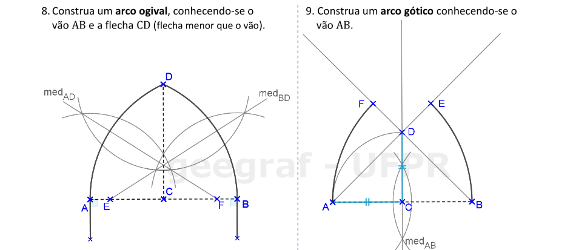
			   <figcaption>O arco simétrico, com centro em <b>B</b> e raio com medida <b>AB</b> começa em <b>A</b> e vai até o prolongamento de <b>BD</b>.</figcaption>
		   </li>
		   <li>
			   <input type="radio" id="077" name="sl">
			   <label for="077"></label>
			   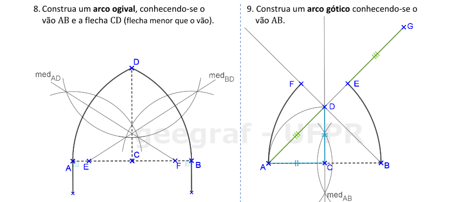
			   <figcaption>Determine os segmentos <b>EG = AD</b> no prolongamento de <b>AD</b>...</figcaption>
		   </li>
		   <li>
			   <input type="radio" id="078" name="sl">
			   <label for="078"></label>
			   
			   <figcaption>... e <b>HF = AD</b> no prolongamento de <b>BF</b>.</figcaption>
		   </li>
		   <li>
			   <input type="radio" id="079" name="sl">
			   <label for="079"></label>
			   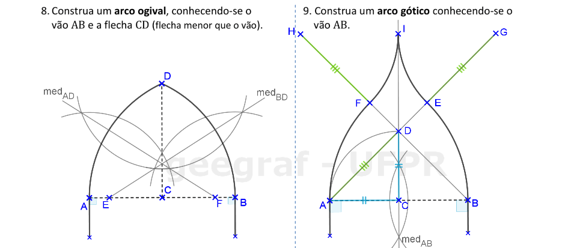
			   <figcaption>Os arcos com centros em <b>H</b> e <b>G</b> e raios iguais a <b>EG = HF</b> determinam o ponto mais alto do arco gótico.</figcaption>
		   </li>
		</ul>
		
  

 
   
   

&#x1f4cf; &#x1f4d0; Resolução

	
Vamos construir os arcos gótico flamejante e otomano.

	  <ul class="slider">
		  <li>
			   <input type="radio" id="080" name="sl" checked>
			   <label for="080"></label>
			   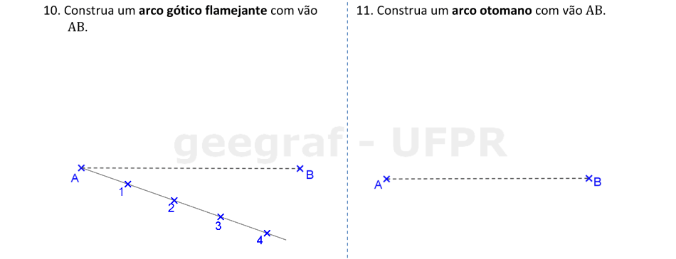
			   <figcaption>No arco gótico flamejante, começamos dividindo o vão <b>AB</b> em 4 partes iguais usando o teorema de Tales.</figcaption>
		   </li>
		   <li>
			   <input type="radio" id="081" name="sl">
			   <label for="081"></label>
			   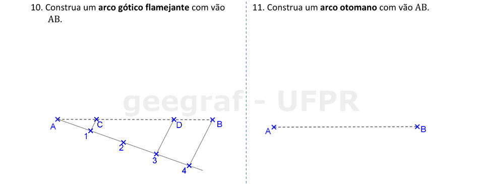
			   <figcaption>Encontre os pontos <b>C</b> e <b>D</b> correspondentes a $\mathsf{ {1 \over 4}}$ e $\mathsf{ {3 \over 4}}$ do vão.</figcaption>
		   </li>
		   <li>
			   <input type="radio" id="082" name="sl">
			   <label for="082"></label>
			   
			   <figcaption>Construa as semi-retas perpendiculares ao vão que passam por <b>C</b> e <b>D</b>.</figcaption>
		   </li>
		   <li>
			   <input type="radio" id="083" name="sl">
			   <label for="083"></label>
			   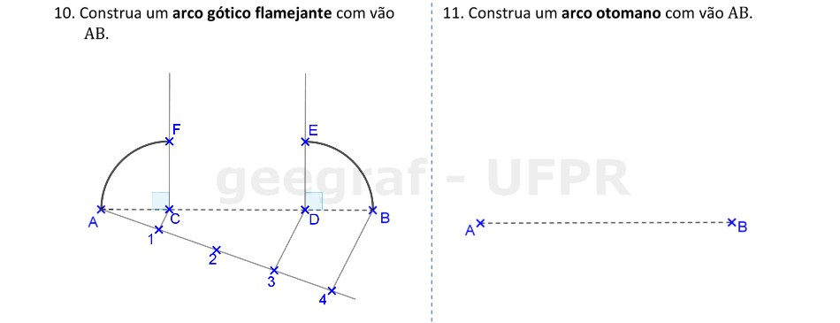
			   <figcaption>Uma parte do arco gótico flamejante tem centro em <b>C</b>, raio <b>AC</b> e amplitude de 90&deg;. O arco simétrico tem centro em <b>D</b> e raio <b>BD</b>.</figcaption>
		   </li>
		   <li>
			   <input type="radio" id="084" name="sl">
			   <label for="084"></label>
			   
			   <figcaption>Determine os pontos <b>G</b> e <b>H</b> nos prolongamentos de <b>CF</b> e de <b>DE</b>, tais que <b>FG = CF = ED = HE</b>.</figcaption>
		   </li>
		   <li>
			   <input type="radio" id="085" name="sl">
			   <label for="085"></label>
			   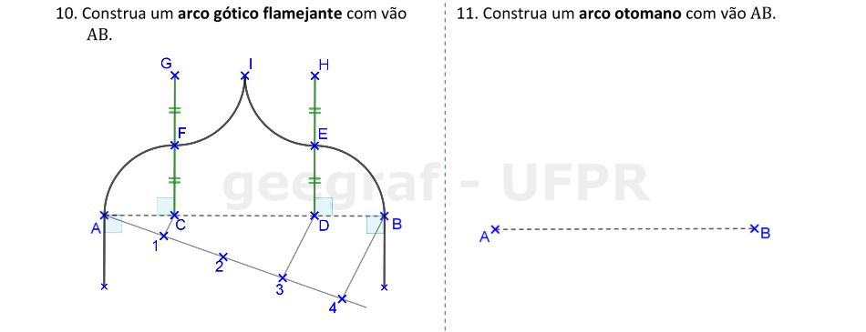
			   <figcaption>Os arcos com centros em <b>H</b> e <b>G</b> e raios iguais a <b>FG = HE</b> determinam o ponto mais alto do árco gótico flamejante.</figcaption>
		   </li>
		   <li>
			   <input type="radio" id="086" name="sl">
			   <label for="086"></label>
			   
			   <figcaption>Para começar o arco otomando, vamos dividir o vão <b>AB</b> em 8 partes iguais usando o teorema de Tales.</figcaption>
		   </li>
		   <li>
			   <input type="radio" id="087" name="sl">
			   <label for="087"></label>
			   
			   <figcaption>Determine os pontos <b>C</b> e <b>D</b> correspondentes a $\mathsf{ {3 \over 8}}$ e $\mathsf{ {5 \over 8}}$ do vão.</figcaption>
		   </li>
		   <li>
			   <input type="radio" id="088" name="sl">
			   <label for="088"></label>
			   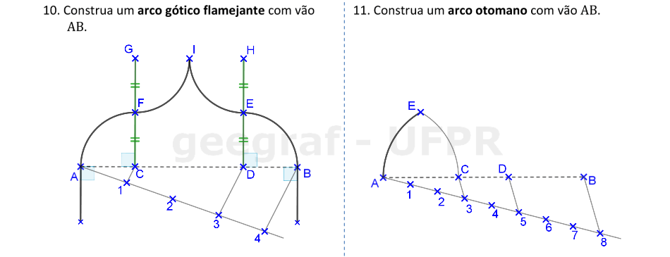
			   <figcaption>Construa o <b>&#9651;ACE</b> equilátero: uma parte do arco otomano tem centro em <b>C</b>, raio igual a <b>CA</b> e amplitude de 60&deg;.</figcaption>
		   </li>
		   <li>
			   <input type="radio" id="089" name="sl">
			   <label for="089"></label>
			   
			   <figcaption>O arco simétrico tem centro em <b>D</b> e raio <b>DB</b>. Construa os segmentos <b>EC</b> e <b>DF</b>.</figcaption>
		   </li>
		   <li>
			   <input type="radio" id="090" name="sl">
			   <label for="090"></label>
			   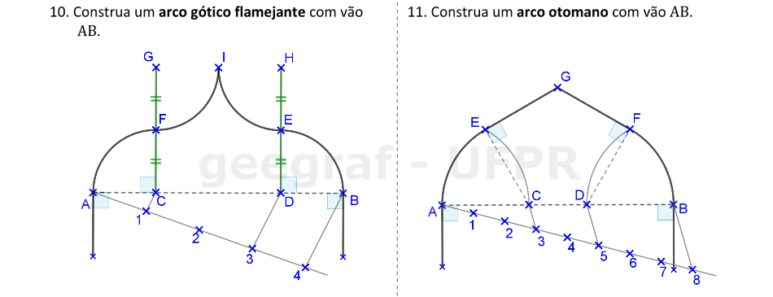
			   <figcaption>O ponto mais alto do arco otomano é determinado pelos segmentos tangentes aos arcos construídos nos pontos <b>E</b> e <b>F</b>.</figcaption>
		   </li>
		</ul>
		
  

 
   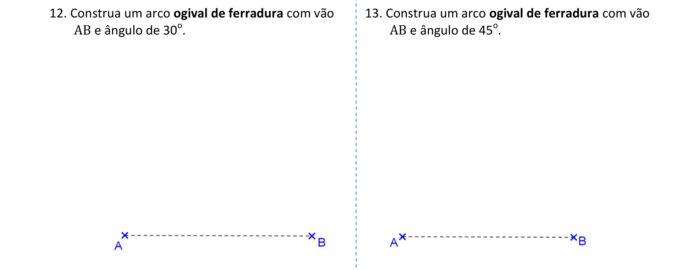
   

&#x1f4cf; &#x1f4d0; Resolução

	
Vamos construir os arcos ogivais de ferradura com ângulos centrais de 30&deg; e 45&deg;.

	  <ul class="slider">
		  <li>
			   <input type="radio" id="091" name="sl" checked>
			   <label for="091"></label>
			   
			   <figcaption>Começamos dividindo o vão na metade com a mediatriz de <b>AB</b>.</figcaption>
		   </li>
		   <li>
			   <input type="radio" id="092" name="sl">
			   <label for="092"></label>
			   
			   <figcaption>Posicione o esquadro de 60&deg; com o cateto maior alinhado com o vão.</figcaption>
		   </li>
		   <li>
			   <input type="radio" id="093" name="sl">
			   <label for="093"></label>
			   
			   <figcaption>Deslize o esquadro de 60&deg; com o outro esquadro apoiado no cateto menor até o ponto <b>C</b>. Logo, temos o ângulo central construído com medida de 30&deg;.</figcaption>
		   </li>
		   <li>
			   <input type="radio" id="094" name="sl">
			   <label for="094"></label>
			   
			   <figcaption>Faça o mesmo do outro lado para construirmos os arcos simétricos em relação à mediatriz do vão com centro em <b>C</b>, raios <b>AC = BC</b> e amplitude de 30&deg;.</figcaption>
		   </li>
		   <li>
			   <input type="radio" id="095" name="sl">
			   <label for="095"></label>
			   
			   <figcaption>Determine o ponto <b>D</b> na mediatriz tal que <b>CD = AC</b>.</figcaption>
		   </li>
		   <li>
			   <input type="radio" id="096" name="sl">
			   <label for="096"></label>
			   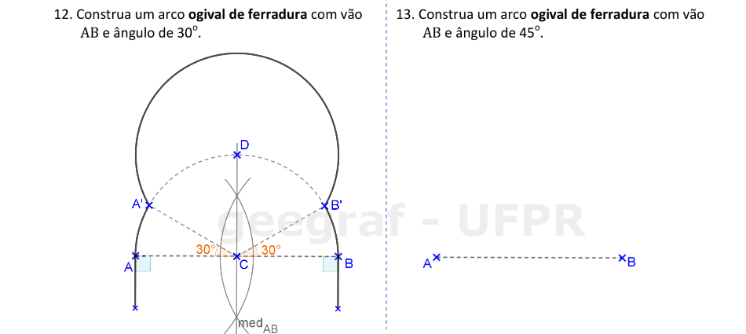
			   <figcaption>O arco ogival de ferradura tem o terceiro arco com centro em <b>D</b> e raio <b>DA' = DB'</b>.</figcaption>
		   </li>
		   <li>
			   <input type="radio" id="097" name="sl">
			   <label for="097"></label>
			   
			   <figcaption>A construção do arco ogival de ferradura com ângulo central de 45&deg; é feita da mesma forma apresentada com 30&deg;.</figcaption>
		   </li>
		</ul>
		
  

 
   
<a href="#modulo1" class="topo">voltar ao topo</a>

   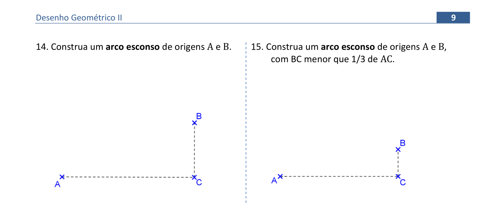
   

&#x1f4cf; &#x1f4d0; Resolução

	
Vamos construir os arcos assimétricos denominados esconsos.

	  <ul class="slider">
		  <li>
			   <input type="radio" id="098" name="sl" checked>
			   <label for="098"></label>
			   
			   <figcaption>Começamos encontrando o ponto <b>D</b> no prolongamento de <b>AC</b>, tal que <b>CD = BC</b>.</figcaption>
		   </li>
		   <li>
			   <input type="radio" id="099" name="sl">
			   <label for="099"></label>
			   
			   <figcaption>Encontre a mediatriz de <b>AD</b>.</figcaption>
		   </li>
		   <li>
			   <input type="radio" id="100" name="sl">
			   <label for="100"></label>
			   
			   <figcaption>O primeiro arco tem centro em <b>E</b>, raio <b>AE</b> e amplitude de 90&deg;.</figcaption>
		   </li>
		   <li>
			   <input type="radio" id="101" name="sl">
			   <label for="101"></label>
			   
			   <figcaption>O centro do segundo arco está na mediatriz de <b>AD</b>, tal que <b>BG // AC</b> e o raio mede <b>BG</b>.</figcaption>
		   </li>
		   <li>
			   <input type="radio" id="102" name="sl">
			   <label for="102"></label>
			   
			   <figcaption>O arco esconso com a medida <b>BC</b> menor do que $\mathsf{ {AC \over 3}}$ pode ser feita de maneira similar.</figcaption>
		   </li>
		</ul>
		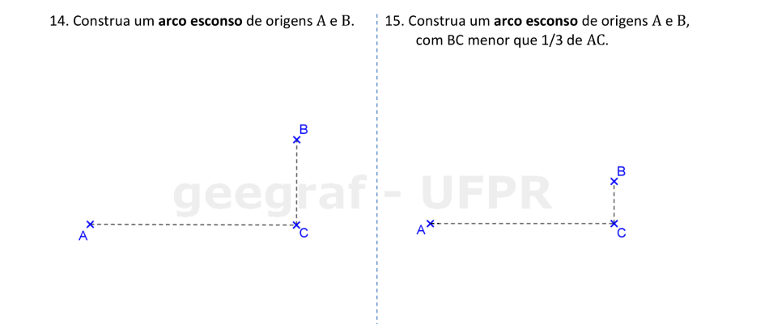
  

   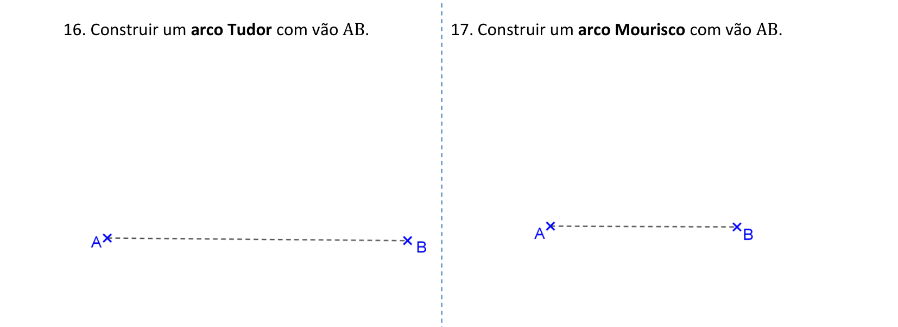
   

&#x1f4cf; &#x1f4d0; Resolução

	
Vamos construir os arcos Tudor e Mourisco.

	  <ul class="slider">
		  <li>
			   <input type="radio" id="103" name="sl" checked>
			   <label for="103"></label>
			   
			   <figcaption>Começamos dividindo o vão <b>AB</b> em 3 partes iguais usando o teorema de Tales.</figcaption>
		   </li>
		   <li>
			   <input type="radio" id="104" name="sl">
			   <label for="104"></label>
			   
			   <figcaption>Encontre a mediatriz do vão <b>AB</b>.</figcaption>
		   </li>
		   <li>
			   <input type="radio" id="105" name="sl">
			   <label for="105"></label>
			   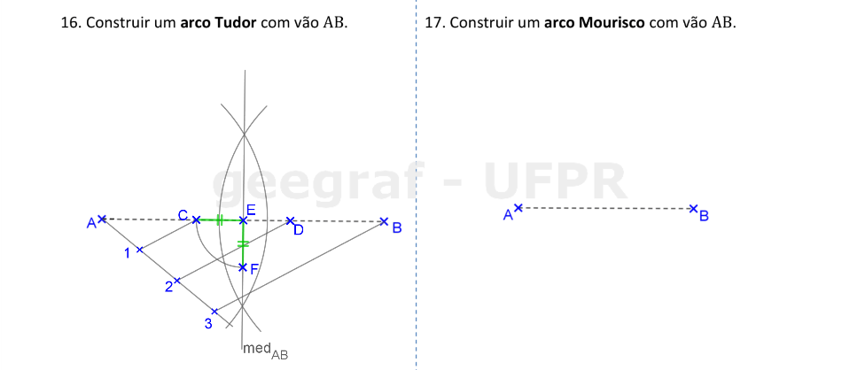
			   <figcaption>Encontre o ponto <b>F</b> na mediatriz do vão, tal que <b>EF = EC = ED</b>.</figcaption>
		   </li>
		   <li>
			   <input type="radio" id="106" name="sl">
			   <label for="106"></label>
			   
			   <figcaption>Construa o quadrado de lado <b>CD</b>.</figcaption>
		   </li>
		   <li>
			   <input type="radio" id="107" name="sl">
			   <label for="107"></label>
			   
			   <figcaption>As semi-retas <b>HC</b> e <b>GF</b> serão usadas para delimitar o arco Tudor.</figcaption>
		   </li>
		   <li>
			   <input type="radio" id="108" name="sl">
			   <label for="108"></label>
			   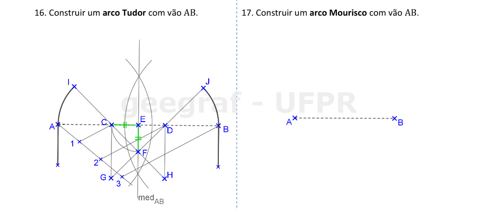
			   <figcaption>Construa os arcos simétricos em relação à mediatriz do vão: centros em <b>C</b> e <b>D</b>, raios iguais a <b>AC = BD</b>.</figcaption>
		   </li>
		   <li>
			   <input type="radio" id="109" name="sl">
			   <label for="109"></label>
			   
			   <figcaption>Com centros em <b>H</b> e <b>G</b> e raio <b>HI = GJ</b>, construa os arcos que determinam o ponto mais alto do arco Tudor.</figcaption>
		   </li>
		   <li>
			   <input type="radio" id="110" name="sl">
			   <label for="110"></label>
			   
			   <figcaption>No arco Mourisco, determine os arcos com centros em <b>A</b> e <b>B</b> e raios iguais a <b>AB</b>. Assim encontramos o ponto mais alto deste arco arquitetônico.</figcaption>
		   </li>
		   <li>
			   <input type="radio" id="111" name="sl">
			   <label for="111"></label>
			   
			   <figcaption>Determine os segmentos perpendiculares <b>AC</b> e <b>AD</b>. Construa um segmento <b>DE</b> com medida qualquer no prolongamento de <b>AD</b>.</figcaption>
		   </li>
		   <li>
			   <input type="radio" id="112" name="sl">
			   <label for="112"></label>
			   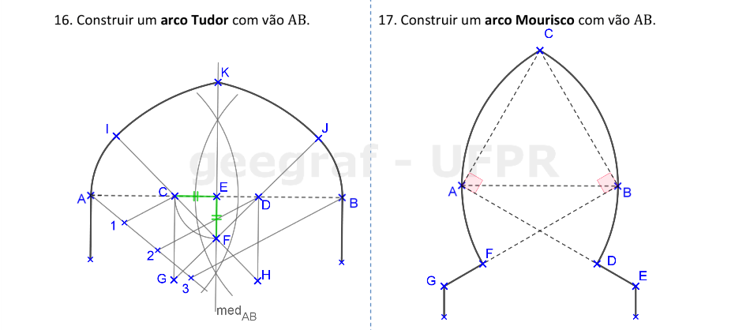
			   <figcaption>Para finalizar o arco Mourisco, determine o segmento <b>FG</b> simétrico de <b>DE</b> em relação à mediatriz do vão <b>AB</b>.</figcaption>
		   </li>
		</ul>
		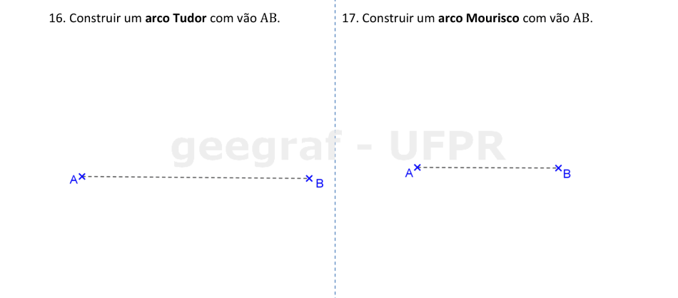
  

   
   

&#x1f4cf; &#x1f4d0; Resolução

	
Vamos construir os arcos geminado e trilobado.

	  <ul class="slider">
		  <li>
			   <input type="radio" id="113" name="sl" checked>
			   <label for="113"></label>
			   
			   <figcaption>Começamos dividindo o vão <b>AB</b> na metade. A mediatriz funciona como eixo de simetria deste arco.</figcaption>
		   </li>
		   <li>
			   <input type="radio" id="114" name="sl">
			   <label for="114"></label>
			   
			   <figcaption>Podemos começar com o centro <b>C</b>, raio <b>CA</b>, com arco começando em <b>A</b> até o segmento <b>CD</b>.</figcaption>
		   </li>
		   <li>
			   <input type="radio" id="115" name="sl">
			   <label for="115"></label>
			   
			   <figcaption>O próximo arco tem centro <b>D</b>, começa no segmento <b>CD</b> e termina no próximo segmento <b>ED</b>.</figcaption>
		   </li>
		   <li>
			   <input type="radio" id="116" name="sl">
			   <label for="116"></label>
			   
			   <figcaption>Para finalizar a parte esquerda do arco geminado, construa o arco com centro <b>E</b>, que começa em <b>ED</b> e termina na mediatriz do vão.</figcaption>
		   </li>
		   <li>
			   <input type="radio" id="117" name="sl">
			   <label for="117"></label>
			   
			   <figcaption>Determine os centros simétricos em relação à mediatriz do vão: <b>C'</b>, <b>D'</b> e <b>E'</b>.</figcaption>
		   </li>
		   <li>
			   <input type="radio" id="118" name="sl">
			   <label for="118"></label>
			   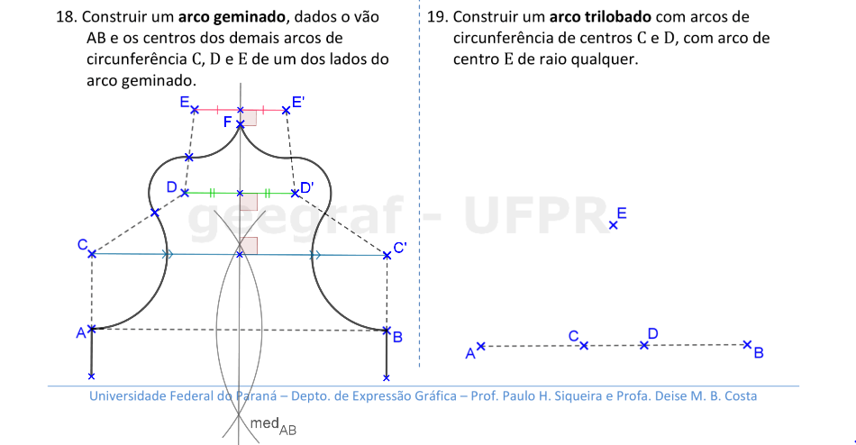
			   <figcaption>Construa os arcos simétricos em relação à mediatriz da mesma forma mostrada nos arcos da parte esquerda deste arco.</figcaption>
		   </li>
		   <li>
			   <input type="radio" id="119" name="sl">
			   <label for="119"></label>
			   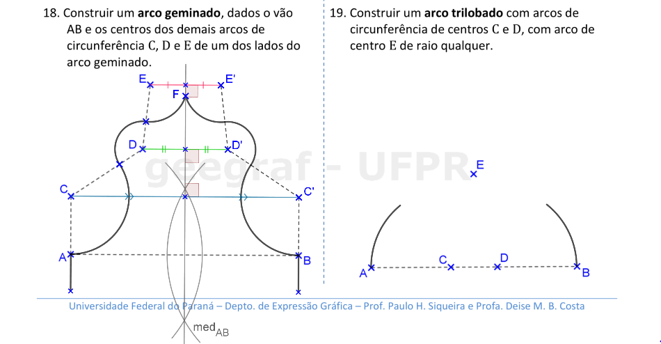
			   <figcaption>O arco trilobado é parecido com o ogival de ferradura. Porém os centros <b>C</b>, <b>D</b> e <b>E</b> são de arcos com raios iguais. Note que o ponto <b>E</b> deve estar na mediatriz do vão para que este arco tenha simetria em relação a esta reta.</figcaption>
		   </li>
		   <li>
			   <input type="radio" id="120" name="sl">
			   <label for="120"></label>
			   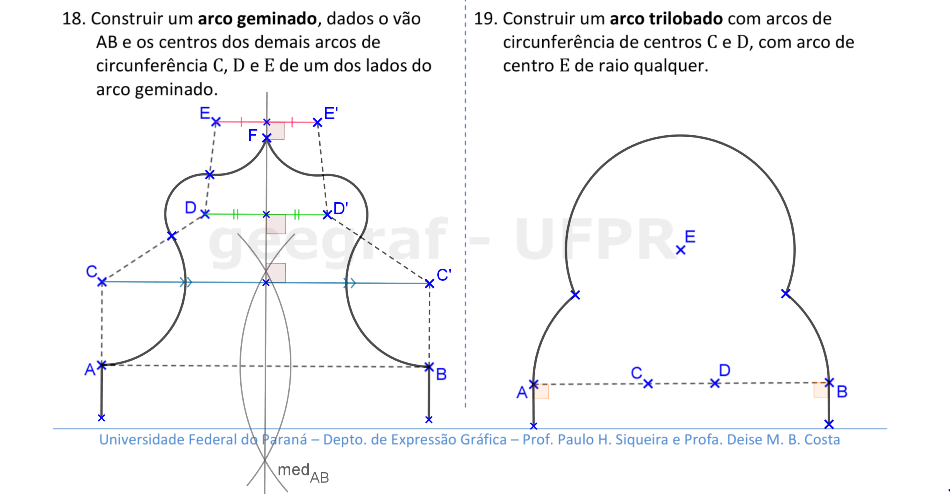
			   <figcaption>Construa os arcos com centros em <b>C</b>, <b>D</b> e <b>E</b> e raios iguais a <b>AC</b>.</figcaption>
		   </li>
		</ul>
		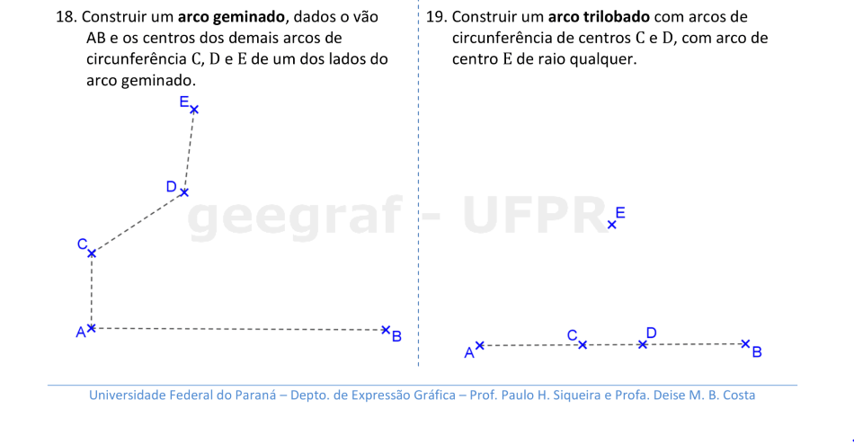
  

   
<a href="#modulo1" class="topo">voltar ao topo</a>

   
   

&#x1f4cf; &#x1f4d0; Resolução

	
Vamos construir os arcos parabólico e bulbiforme.

	  <ul class="slider">
		  <li>
			   <input type="radio" id="121" name="sl" checked>
			   <label for="121"></label>
			   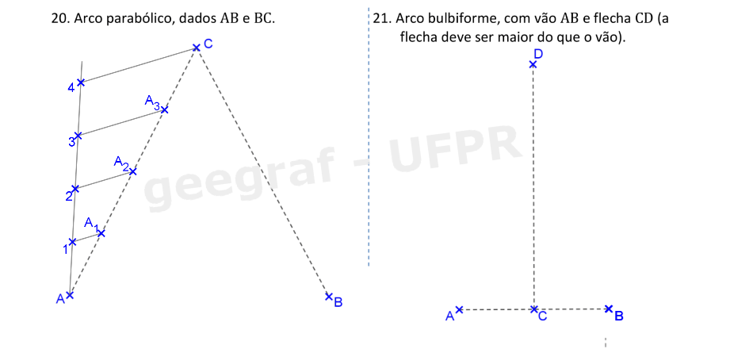
			   <figcaption>No arco parabólico, podemos dividir os segmentos <b>AB</b> e <b>CD</b> em um número qualquer de partes iguais.</figcaption>
		   </li>
		   <li>
			   <input type="radio" id="122" name="sl">
			   <label for="122"></label>
			   
			   <figcaption>Usando o teorema de Tales, divida <b>AB</b> e <b>CD</b> em 4 partes iguais.</figcaption>
		   </li>
		   <li>
			   <input type="radio" id="123" name="sl">
			   <label for="123"></label>
			   
			   <figcaption>Determine os segmentos <b>AB3</b>, <b>A1B2</b>, <b>A2B1</b> e <b>A3B</b>.</figcaption>
		   </li>
		   <li>
			   <input type="radio" id="124" name="sl">
			   <label for="124"></label>
			   
			   <figcaption>Os pontos do arco parabólico são as extremidades <b>A</b> e <b>B</b> e os pontos de interseção: <b>P1 = AB3 &cap; A1B2</b>, <b>P2 = A2B1 &cap; A1B2</b> e <b>P3 = A2B1 &cap; A3B</b>.</figcaption>
		   </li>
		   <li>
			   <input type="radio" id="125" name="sl">
			   <label for="125"></label>
			   
			   <figcaption>No arco bulbiforme, determine o ponto <b>E &isin; CD</b> tal que <b>CE = AC = BC</b>.</figcaption>
		   </li>
		   <li>
			   <input type="radio" id="126" name="sl">
			   <label for="126"></label>
			   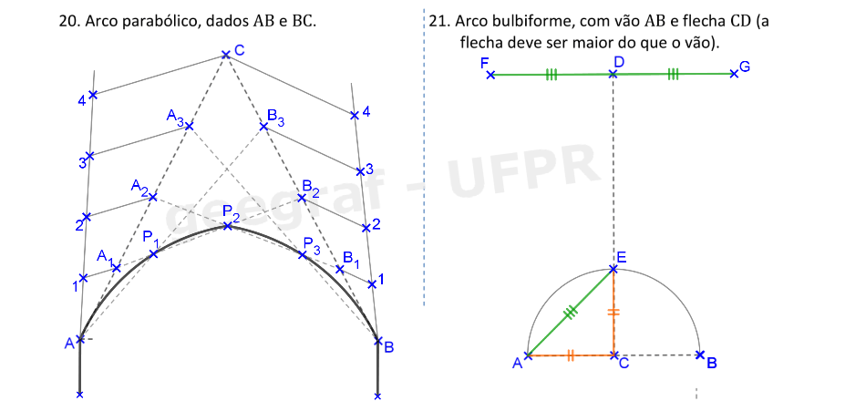
			   <figcaption>Construa a reta <b>FG // AB</b> e os segmentos <b>DF = DG = AE</b>.</figcaption>
		   </li>
		   <li>
			   <input type="radio" id="127" name="sl">
			   <label for="127"></label>
			   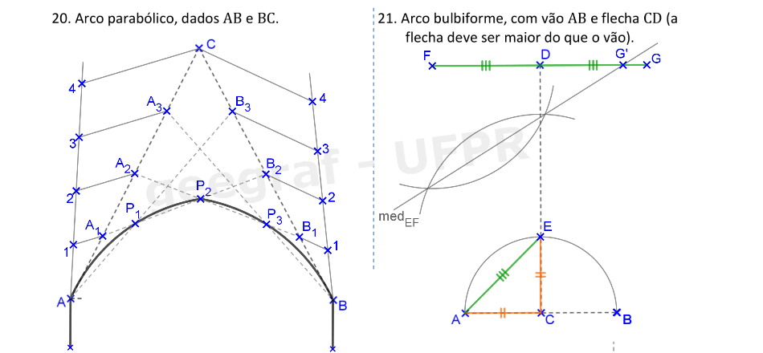
			   <figcaption>A mediatriz de <b>EF</b> determina o ponto <b>G'</b> que é o centro de um dos arcos.</figcaption>
		   </li>
		   <li>
			   <input type="radio" id="128" name="sl">
			   <label for="128"></label>
			   
			   <figcaption>Determine o ponto <b>F'</b> simétrico de <b>G'</b> em relação ao segmento <b>CD</b>. Construa o arco com centro em <b>E</b> e raio <b>AE</b>.</figcaption>
		   </li>
		   <li>
			   <input type="radio" id="129" name="sl">
			   <label for="129"></label>
			   
			   <figcaption>Os segmentos <b>EF'</b> e <b>EG'</b> determinam os pontos de tangência no arco de centro <b>E</b>.</figcaption>
		   </li>
		   <li>
			   <input type="radio" id="130" name="sl">
			   <label for="130"></label>
			   
			   <figcaption>Com centros em <b>F'</b> e <b>G'</b>, construa os arcos tangentes ao arco de centro em <b>E</b>.</figcaption>
		   </li>
		</ul>
		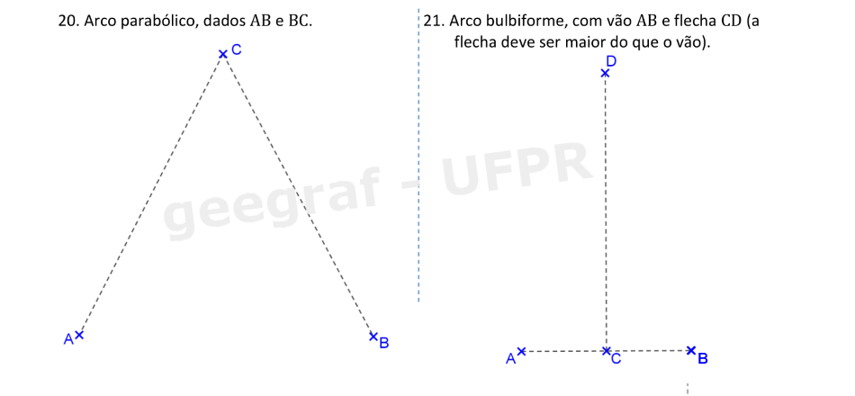
  

   
   

&#x1f4d1; Propriedades

	
Vamos acompanhar algumas definições de elementos das curvas chamadas ovais ou falsas elipses.

	  <ul class="slider">
		  <li>
			   <input type="radio" id="131" name="sl" checked>
			   <label for="131"></label>
			   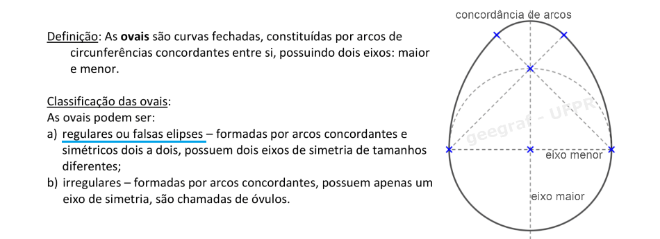
			   <figcaption>As ovais possuem sempre eixos com duas medidas: o eixo maior e o eixo menor. As ovais regulares têm os dois eixos de simetria.</figcaption>
		   </li>
		   <li>
			   <input type="radio" id="132" name="sl">
			   <label for="132"></label>
			   
			   <figcaption>As ovais irregulares têm apenas um eixo de simetria. Assim como fizemos nos arcos arquitetônicos, os arcos de concordância são utilizados para construções das falsas elipses.</figcaption>
		   </li>
		</ul>
		
  

   
   

&#x1f4cf; &#x1f4d0; Resolução

	
Vamos construir ovais irregulares. Nestes casos, temos apenas um eixo de simetria nestas curvas.

	  <ul class="slider">
		  <li>
			   <input type="radio" id="133" name="sl" checked>
			   <label for="133"></label>
			   
			   <figcaption>A mediatriz do eixo menor será o eixo de simetria da oval irregular de 4 centros.</figcaption>
		   </li>
		   <li>
			   <input type="radio" id="134" name="sl">
			   <label for="134"></label>
			   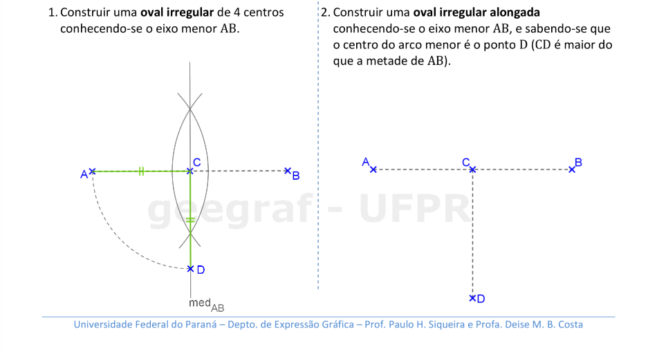
			   <figcaption>Encontre o ponto <b>D</b> pertencente à mediatriz tal que <b>CD = AC = BC</b>.</figcaption>
		   </li>
		   <li>
			   <input type="radio" id="135" name="sl">
			   <label for="135"></label>
			   
			   <figcaption>O ponto médio de <b>AB</b> é o primeiro centro desta oval. As semi-retas <b>AD</b> e <b>BD</b> serão limites dos outros arcos desta curva.</figcaption>
		   </li>
		   <li>
			   <input type="radio" id="136" name="sl">
			   <label for="136"></label>
			   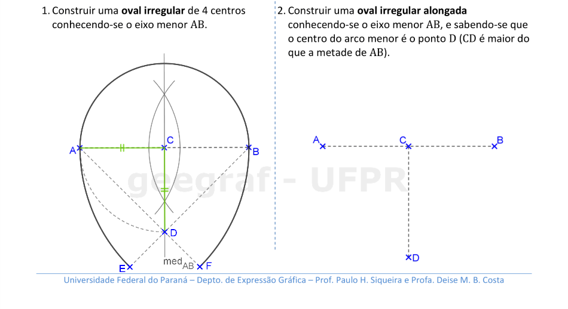
			   <figcaption>Construa os arcos com centros em <b>A</b> e <b>B</b> e raios iguais a <b>AB</b> até as semi-retas limites.</figcaption>
		   </li>
		   <li>
			   <input type="radio" id="137" name="sl">
			   <label for="137"></label>
			   
			   <figcaption>O quarto centro desta oval é o ponto <b>D</b>, que define o arco de raio com medida <b>DE = DF</b>.</figcaption>
		   </li>
		   <li>
			   <input type="radio" id="138" name="sl">
			   <label for="138"></label>
			   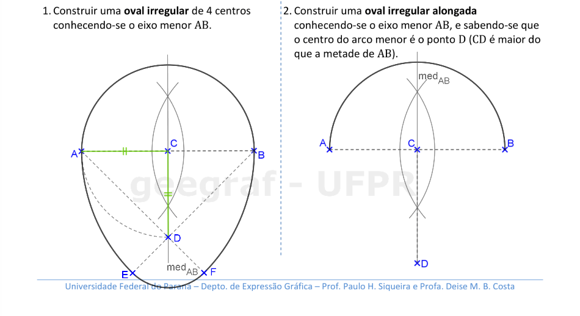
			   <figcaption>Na oval alongada, o segmento <b>CD</b> está contido na mediatriz e tem medida maior do que a metade de <b>AB</b>. O primeiro arco tem centro em <b>C</b> e raio de medida <b>AC = BC</b>.</figcaption>
		   </li>
		   <li>
			   <input type="radio" id="139" name="sl">
			   <label for="139"></label>
			   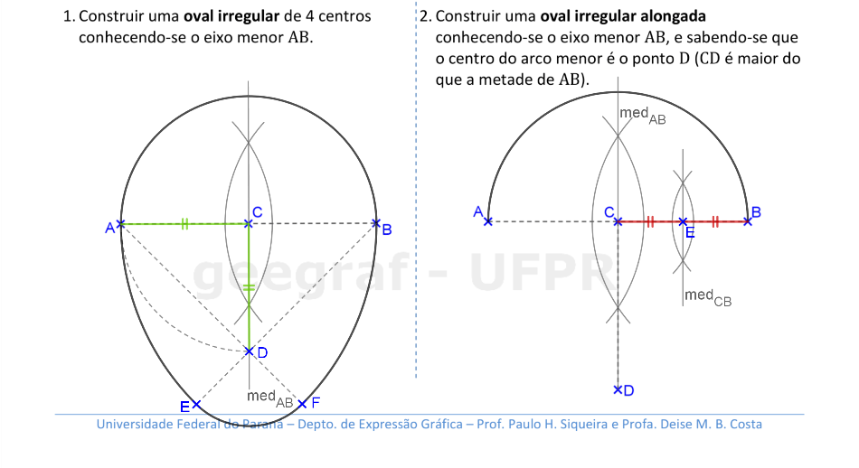
			   <figcaption>Encontre o ponto médio de <b>BC</b>...</figcaption>
		   </li>
		   <li>
			   <input type="radio" id="140" name="sl">
			   <label for="140"></label>
			   
			   <figcaption>... e determine os pontos <b>F</b> e <b>F'</b> nos prolongamentos de <b>AB</b> tais que <b>BF = AF' = BE = EC</b>. Encontre também o ponto <b>G &isin; CD</b> tal que <b>CG = EC = BE</b>. As semi-retas <b>FG</b> e <b>F'G</b> serão limites de dois arcos da curva.</figcaption>
		   </li>
		   <li>
			   <input type="radio" id="141" name="sl">
			   <label for="141"></label>
			   
			   <figcaption>Construa os arcos com centros <b>F'</b> e <b>F</b> e raios com medidas iguais a <b>F'B = FA</b>.</figcaption>
		   </li>
		   <li>
			   <input type="radio" id="142" name="sl">
			   <label for="142"></label>
			   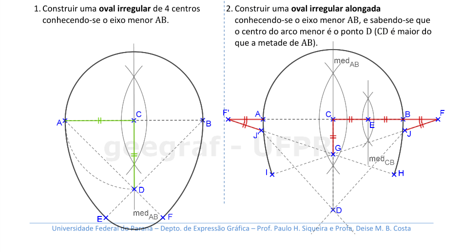
			   <figcaption>As semi-retas <b>JD</b> e <b>J'D</b> serão limites de dois arcos da curva.</figcaption>
		   </li>
		   <li>
			   <input type="radio" id="143" name="sl">
			   <label for="143"></label>
			   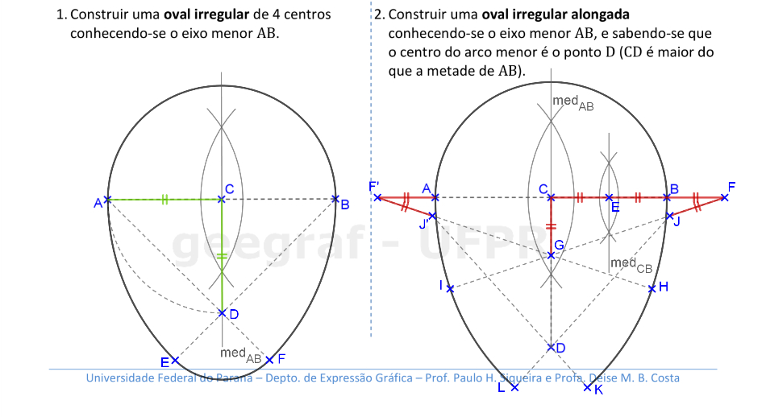
			   <figcaption>Construa os arcos com centros <b>J'</b> e <b>J</b> e raios com medidas iguais a <b>J'H = JI</b>.</figcaption>
		   </li>
		   <li>
			   <input type="radio" id="144" name="sl">
			   <label for="144"></label>
			   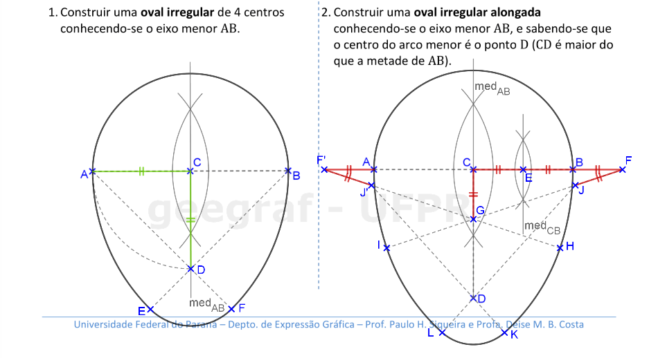
			   <figcaption>Para finalizar, basta construir o arco de centro <b>D</b> e raio com medida <b>DK = DL</b>.</figcaption>
		   </li>
		</ul>
		
  

   
<a href="#modulo1" class="topo">voltar ao topo</a>

   
   

&#x1f4cf; &#x1f4d0; Resolução

	
Vamos construir uma oval irregular encurtada e uma oval regular. Os diâmetros das ovais regulares são eixos de simetria das curvas.

	  <ul class="slider">
		  <li>
			   <input type="radio" id="145" name="sl" checked>
			   <label for="145"></label>
			   
			   <figcaption>A oval irregular encurtada tem a medida de  <b>CD</b> menor do que a metade de <b>AB</b>. A construção fica similar à da oval alongada.</figcaption>
		   </li>
		   <li>
			   <input type="radio" id="146" name="sl">
			   <label for="146"></label>
			   
			   <figcaption>No caso da oval regular, vamos construir a mediatriz do diâmetro menor, que funciona como eixo de simetria da curva. Neste caso, o eixo maior não está definido e depende das construções feitas com a medida do eixo menor.</figcaption>
		   </li>
		   <li>
			   <input type="radio" id="147" name="sl">
			   <label for="147"></label>
			   
			   <figcaption>Encontre a metade de <b>BC</b> e o ponto simétrico de <b>D</b> em relação à mediatriz de <b>AB</b>.</figcaption>
		   </li>
		   <li>
			   <input type="radio" id="148" name="sl">
			   <label for="148"></label>
			   
			   <figcaption>As semi-retas <b>DE</b>, <b>DE'</b>, <b>D'E</b> e <b>D'E'</b> serão os limites dos arcos da oval regular.</figcaption>
		   </li>
		   <li>
			   <input type="radio" id="149" name="sl">
			   <label for="149"></label>
			   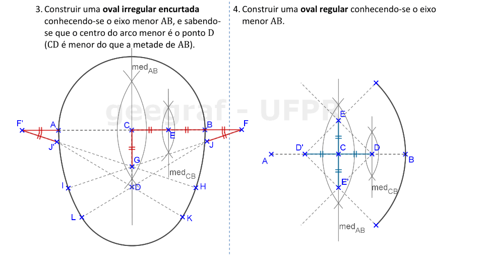
			   <figcaption>Construa o arco com centro em <b>D'</b> com raio <b>D'B</b> até as semi-retas limites.</figcaption>
		   </li>
		   <li>
			   <input type="radio" id="150" name="sl">
			   <label for="150"></label>
			   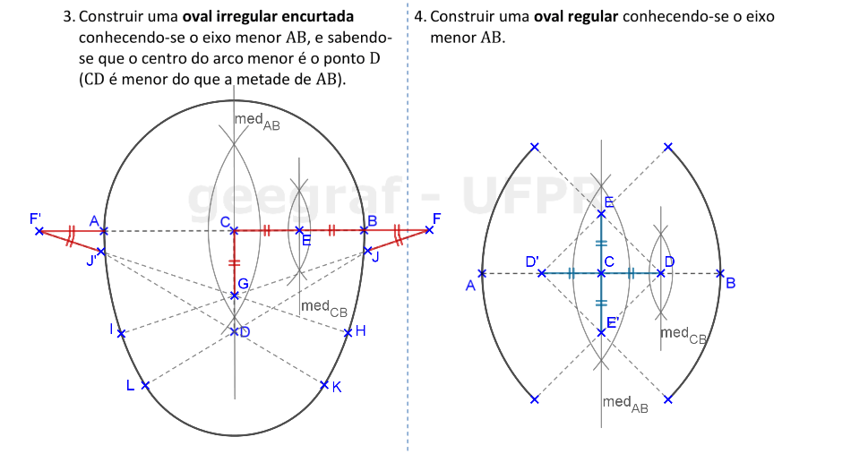
			   <figcaption>Construa o arco simétrico com centro em <b>D</b> com raio <b>DA</b> até as semi-retas limites correspondentes.</figcaption>
		   </li>
		   <li>
			   <input type="radio" id="151" name="sl">
			   <label for="151"></label>
			   
			   <figcaption>Para finalizar, basta construir os arcos de centros <b>E</b> e <b>E'</b> da oval regular.</figcaption>
		   </li>
		</ul>
		
  

   
   

&#x1f4cf; &#x1f4d0; Resolução

	
Vamos construir ovais regulares: uma com apenas a medida do eixo maior e a outra com as medidas dos dois eixos.

	  <ul class="slider">
		  <li>
			   <input type="radio" id="152" name="sl" checked>
			   <label for="152"></label>
			   
			   <figcaption>Vamos construir a mediatriz do diâmetro maior, que funciona como eixo de simetria da curva.</figcaption>
		   </li>
		   <li>
			   <input type="radio" id="153" name="sl">
			   <label for="153"></label>
			   
			   <figcaption>Encontre a metade de <b>BC</b> e o ponto simétrico de <b>D</b> em relação à mediatriz de <b>AB</b>.</figcaption>
		   </li>
		   <li>
			   <input type="radio" id="154" name="sl">
			   <label for="154"></label>
			   
			   <figcaption>As semi-retas <b>DE</b>, <b>DE'</b>, <b>D'E</b> e <b>D'E'</b> serão os limites dos arcos da oval regular.</figcaption>
		   </li>
		   <li>
			   <input type="radio" id="155" name="sl">
			   <label for="155"></label>
			   
			   <figcaption>Construa o arco com centro em <b>D'</b> com raio <b>D'A</b> até as semi-retas limites. Construa o arco com centro em <b>D</b> com raio <b>DB</b> até as semi-retas limites correspondentes.</figcaption>
		   </li>
		   <li>
			   <input type="radio" id="156" name="sl">
			   <label for="156"></label>
			   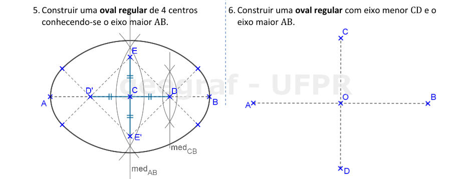
			   <figcaption>Para finalizar, basta construir os arcos de centros <b>E</b> e <b>E'</b> da oval regular.</figcaption>
		   </li>
		   <li>
			   <input type="radio" id="157" name="sl">
			   <label for="157"></label>
			   
			   <figcaption>Considerando as medidas fixas dos eixos de uma oval regular, começamos a construção com a diferença entre as medidas dos eixos: <b>AE = AB - CD</b>.</figcaption>
		   </li>
		   <li>
			   <input type="radio" id="158" name="sl">
			   <label for="158"></label>
			   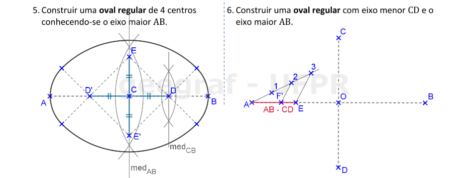
			   <figcaption>Divida o segmento <b>AE</b> em 3 partes iguais e encontre o ponto <b>F'</b> tal que <b>AF' = </b>$\mathsf{ {2 \over 3}}$<b>AE</b>.</figcaption>
		   </li>
		   <li>
			   <input type="radio" id="159" name="sl">
			   <label for="159"></label>
			   
			   <figcaption>Encontre os pontos <b>F</b> e <b>G</b> no diâmetro maior, tais que <b>OF = OG = AF'</b>.</figcaption>
		   </li>
		   <li>
			   <input type="radio" id="160" name="sl">
			   <label for="160"></label>
			   
			   <figcaption>Construa a circunferência de centro <b>F</b> e raio <b>FG</b>, determinando os pontos <b>H</b> e <b>I</b> no diâmetro menor.</figcaption>
		   </li>
		   <li>
			   <input type="radio" id="161" name="sl">
			   <label for="161"></label>
			   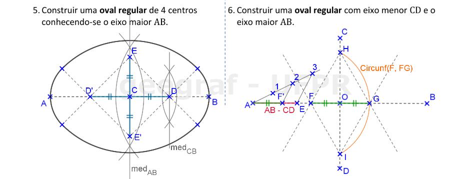
			   <figcaption>As semi-retas <b>HF</b>, <b>HG</b>, <b>IF</b> e <b>IG</b> serão os limites dos arcos da oval regular.</figcaption>
		   </li>
		   <li>
			   <input type="radio" id="162" name="sl">
			   <label for="162"></label>
			   
			   <figcaption>Construa o arco de centro <b>G</b> e raio <b>GB</b> até as retas limites.</figcaption>
		   </li>
		   <li>
			   <input type="radio" id="163" name="sl">
			   <label for="163"></label>
			   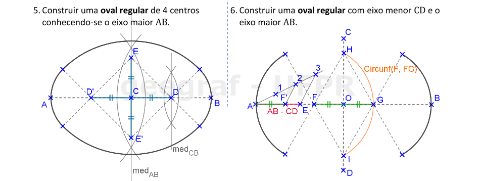
			   <figcaption>Construa o arco simétrico de centro <b>F</b> e raio <b>FA</b> até as retas limites correspondentes.</figcaption>
		   </li>
		   <li>
			   <input type="radio" id="164" name="sl">
			   <label for="164"></label>
			   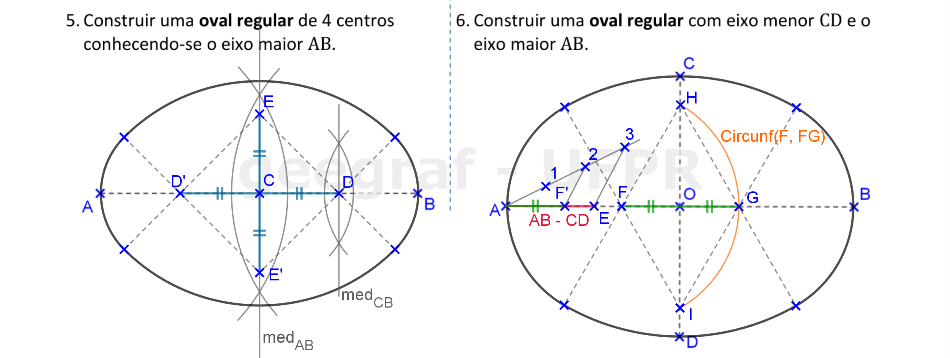
			   <figcaption>Para finalizar, basta construir os arcos de centros <b>H</b> e <b>I</b> da oval regular.</figcaption>
		   </li>
		</ul>
		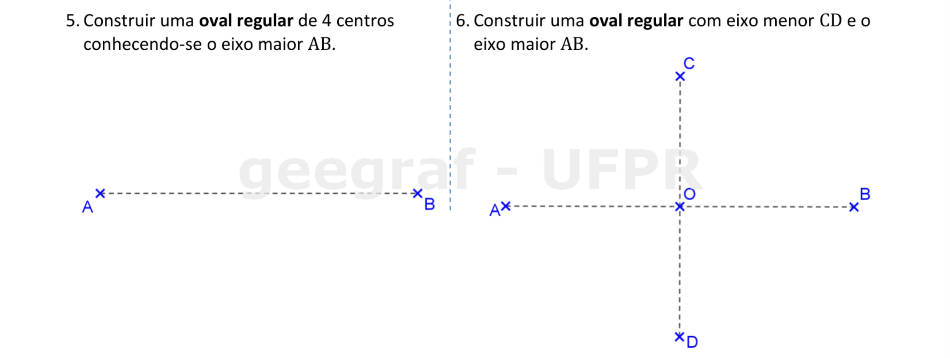
  

   
   

&#x1f4cf; &#x1f4d0; Resolução

	
Vamos construir uma oval com as medidas dos dois eixos dadas. O método do retângulo foi usado para construirmos um arco abatido.

	  <ul class="slider">
		  <li>
			   <input type="radio" id="165" name="sl" checked>
			   <label for="165"></label>
			   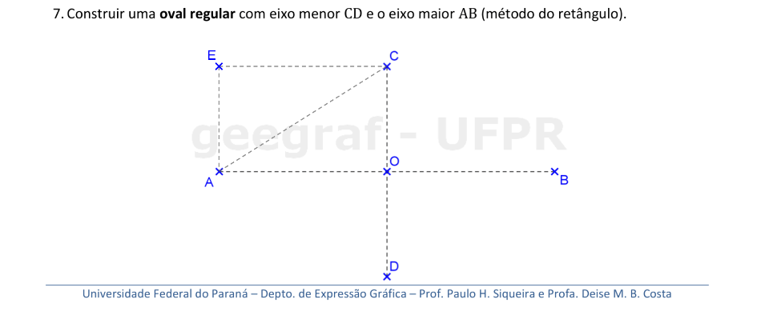
			   <figcaption>Construa o retângulo <b>AOCE</b>.</figcaption>
		   </li>
		   <li>
			   <input type="radio" id="166" name="sl">
			   <label for="166"></label>
			   
			   <figcaption>Determine o incentro <b>F</b> do <b>&#9651;ACE</b>.</figcaption>
		   </li>
		   <li>
			   <input type="radio" id="167" name="sl">
			   <label for="167"></label>
			   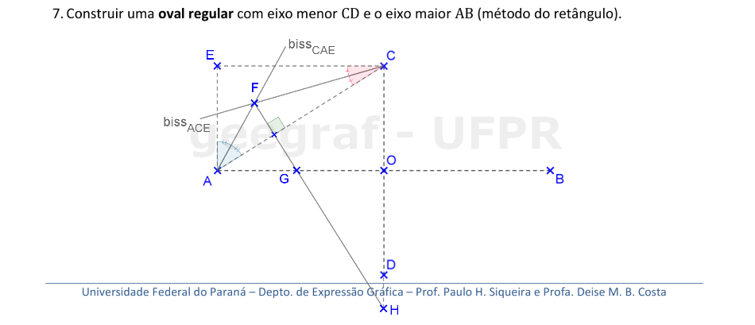
			   <figcaption>Construa o segmento <b>HF &perp; AC</b>, determinando <b>G</b> sobre o diâmetro maior da oval regular.</figcaption>
		   </li>
		   <li>
			   <input type="radio" id="168" name="sl">
			   <label for="168"></label>
			   
			   <figcaption>Encontre o simétrico de <b>G</b> em relação ao eixo menor e a reta <b>F'F // AB</b>. As semi-retas <b>HF</b> e <b>HF'</b> serão usadas como limites de arcos da curva.</figcaption>
		   </li>
		   <li>
			   <input type="radio" id="169" name="sl">
			   <label for="169"></label>
			   
			   <figcaption>Encontre os pontos simétricos de <b>F</b>, de <b>H</b> e de <b>F'</b> em relação ao diâmetro <b>AB</b>.</figcaption>
		   </li>
		   <li>
			   <input type="radio" id="170" name="sl">
			   <label for="170"></label>
			   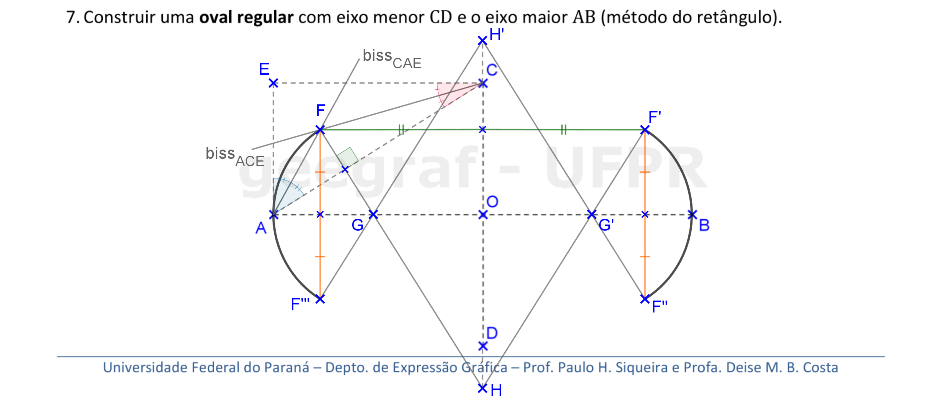
			   <figcaption>Construa os arcos de centros <b>G</b> e <b>G'</b> até as respectivas semi-retas limites.</figcaption>
		   </li>
		   <li>
			   <input type="radio" id="171" name="sl">
			   <label for="171"></label>
			   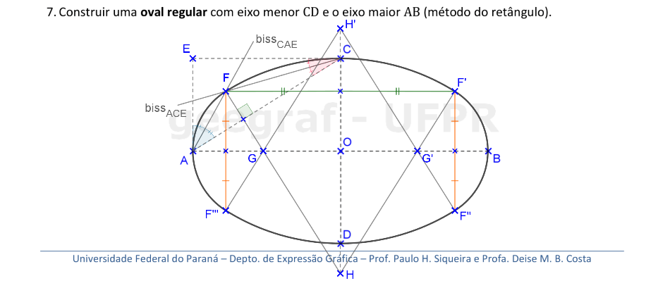
			   <figcaption>Para finalizar, construa os arcos de centros <b>H</b> e <b>H'</b> até as respectivas semi-retas limites.</figcaption>
		   </li>
		</ul>
		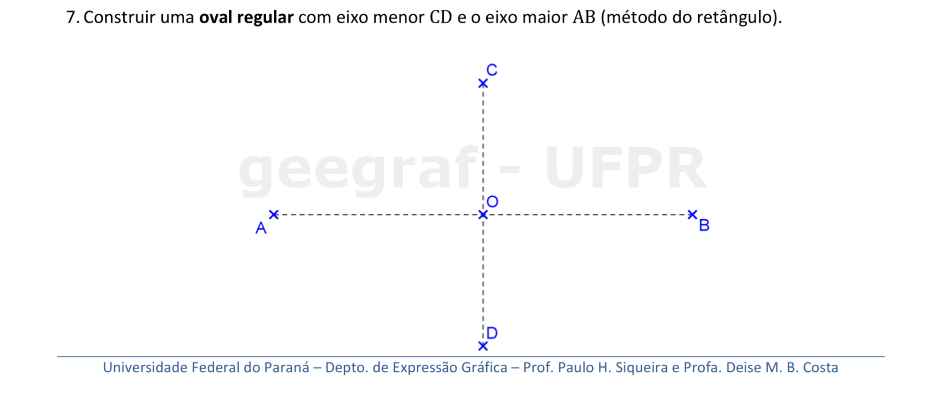
  

   
<a href="#modulo1" class="topo">voltar ao topo</a>

2. Espirais e elipses

  
Material da página 12 até a página 25.

   
   

&#x1f4d1; Propriedades

	
Veremos agora as definições usadas nas construções das espirais. Estas curvas podem ser construídas por pontos auxiliares e construídas à mão livre, ou construídas com arcos de concordâncias.

	  <ul class="slider">
		  <li>
			   <input type="radio" id="172" name="sl" checked>
			   <label for="172"></label>
			   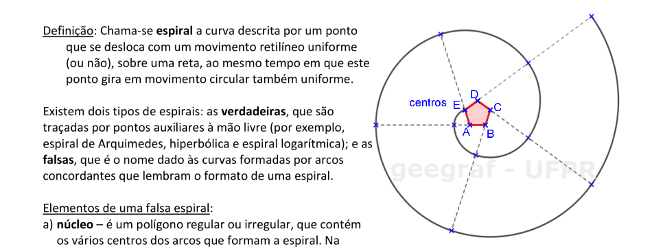
			   <figcaption>O núcleo é o polígono que contém os centros dos arcos da falsa espiral.</figcaption>
		   </li>
		   <li>
			   <input type="radio" id="173" name="sl">
			   <label for="173"></label>
			   
			   <figcaption>Na espiral verdadeira, o núcleo é substituído por um ponto denominado pólo.</figcaption>
		   </li>
		   <li>
			   <input type="radio" id="174" name="sl">
			   <label for="174"></label>
			   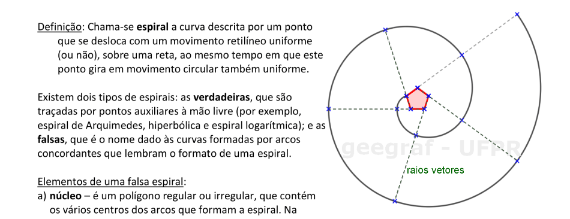
			   <figcaption>Os raios vetores são os prolongamentos dos lados do núcleo.</figcaption>
		   </li>
		   <li>
			   <input type="radio" id="175" name="sl">
			   <label for="175"></label>
			   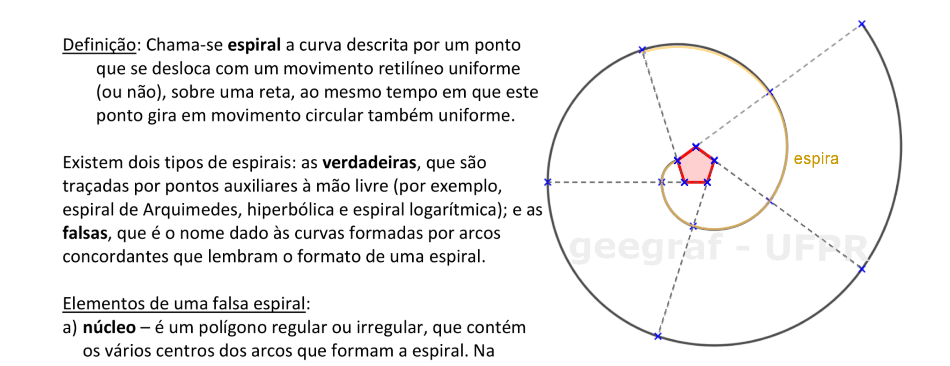
			   <figcaption>A evolução completa da espiral é chamada de espira.</figcaption>
		   </li>
		   <li>
			   <input type="radio" id="176" name="sl">
			   <label for="176"></label>
			   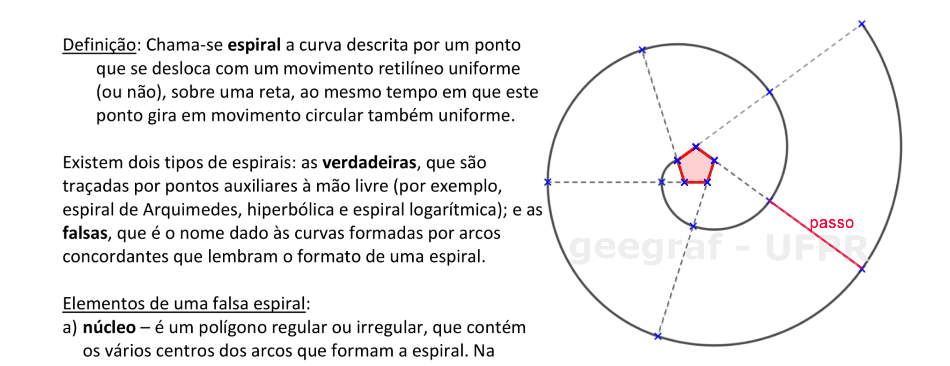
			   <figcaption>O passo é a distância entre duas espiras.</figcaption>
		   </li>
		</ul>
		
  

   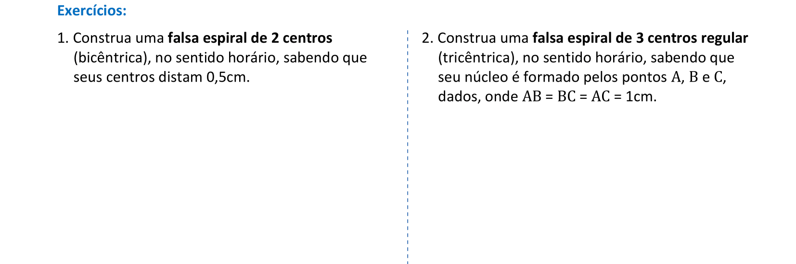
   

&#x1f4cf; &#x1f4d0; Resolução

	
Vamos construir falsas espirais com 2 e com 3 centros.

	  <ul class="slider">
		  <li>
			   <input type="radio" id="177" name="sl" checked>
			   <label for="177"></label>
			   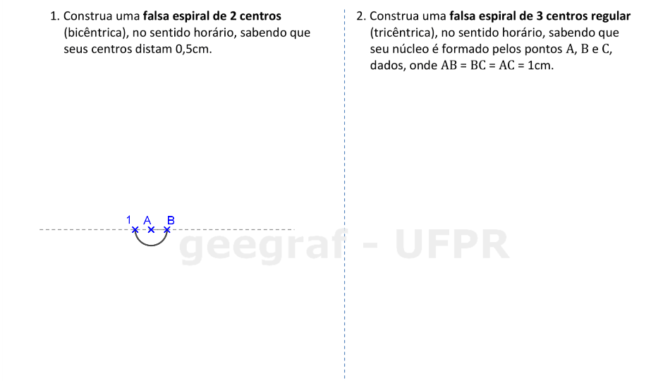
			   <figcaption>Determine o segmento <b>AB</b> que define os dois centros da falsa espiral. Prolongue o lado <b>AB</b> nos dois sentidos. Usando o centro <b>A</b>, determine o arco de circunferência com amplitude de 180&deg; com raio <b>AB</b>.</figcaption>
		   </li>
		   <li>
			   <input type="radio" id="178" name="sl">
			   <label for="178"></label>
			   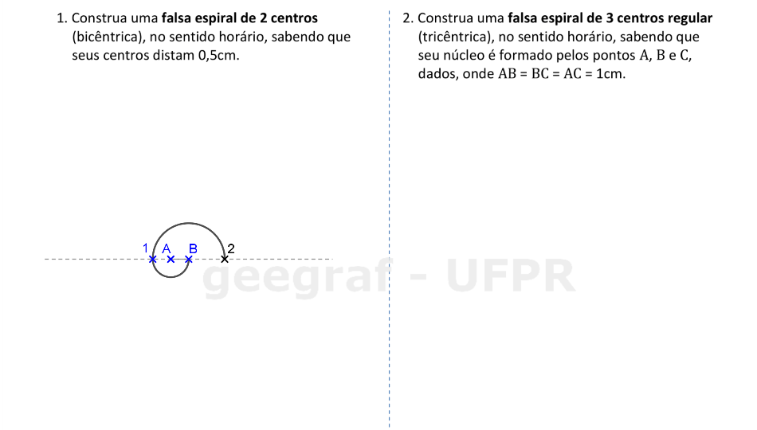
			   <figcaption>Agora vamos usar o centro <b>B</b>, com raio <b>B1</b> e as amplitudes sempre iguais a 180&deg;. Neste caso, completamos uma volta e temos uma espira.</figcaption>
		   </li>
		   <li>
			   <input type="radio" id="179" name="sl">
			   <label for="179"></label>
			   
			   <figcaption>Voltamos ao ponto <b>A</b> e o próximo raio tem medida <b>A2</b>.</figcaption>
		   </li>
		   <li>
			   <input type="radio" id="180" name="sl">
			   <label for="180"></label>
			   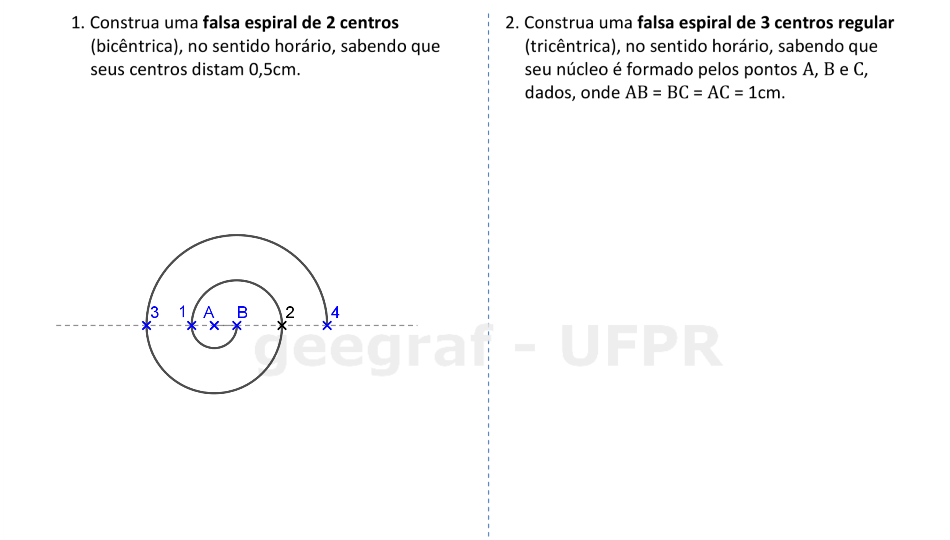
			   <figcaption>Voltamos ao ponto <b>B</b> e o próximo raio tem medida <b>B3</b>.</figcaption>
		   </li>
		   <li>
			   <input type="radio" id="181" name="sl">
			   <label for="181"></label>
			   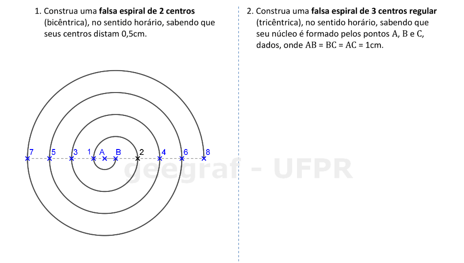
			   <figcaption>Prosseguimos com a alternância entre os centros e temos a construção da espiral de 2 centros com 4 espiras.</figcaption>
		   </li>
		   <li>
			   <input type="radio" id="182" name="sl">
			   <label for="182"></label>
			   
			   <figcaption>Construa o <b>&#9651;ABC</b> equilátero com as medidas dos lados iguais a 1cm. Defina as semi-retas <b>AC</b>, <b>BA</b> e <b>CB</b>.</figcaption>
		   </li>
		   <li>
			   <input type="radio" id="183" name="sl">
			   <label for="183"></label>
			   
			   <figcaption>Começando pelo centro <b>A</b>, defina o arco de amplitude 120&deg; e raio <b>AC</b> até a semi-reta limite <b>BA</b>.</figcaption>
		   </li>
		   <li>
			   <input type="radio" id="184" name="sl">
			   <label for="184"></label>
			   
			   <figcaption>Agora com centro <b>B</b>, defina o arco de amplitude 120&deg; e raio <b>B1</b> até a semi-reta limite <b>CB</b>. O próximo centro será <b>C</b>, com raio <b>C2</b>.</figcaption>
		   </li>
		   <li>
			   <input type="radio" id="185" name="sl">
			   <label for="185"></label>
			   
			   <figcaption>Prosseguimos com o rodízio dos centros e temos a construção da espiral regular de 3 centros.</figcaption>
		   </li>
		</ul>
		
  

   
<a href="#modulo2" class="topo">voltar ao topo</a>

   
   

&#x1f4cf; &#x1f4d0; Resolução

	
Vamos construir falsas espirais com 3 e com 4 centros.

	  <ul class="slider">
		  <li>
			   <input type="radio" id="186" name="sl" checked>
			   <label for="186"></label>
			   
			   <figcaption>Construa o <b>&#9651;ABC</b> com as medidas indicadas dos lados. Defina as semi-retas <b>AB</b>, <b>BC</b> e <b>CA</b>.</figcaption>
		   </li>
		   <li>
			   <input type="radio" id="187" name="sl">
			   <label for="187"></label>
			   
			   <figcaption>Começando com o centro <b>A</b> e fazendo o rodízio de centros, temos a construção similar à que fizemos com o triângulo equilátero.</figcaption>
		   </li>
		   <li>
			   <input type="radio" id="188" name="sl">
			   <label for="188"></label>
			   
			   <figcaption>Construa o quadrado <b>ABCD</b> com lado de medida 0,5cm. Defina as semi-retas <b>BA</b>, <b>AD</b>, <b>DC</b> e <b>CB</b>.</figcaption>
		   </li>
		   <li>
			   <input type="radio" id="189" name="sl">
			   <label for="189"></label>
			   
			   <figcaption>Começando com o centro <b>A</b>, o primeiro arco tem raio <b>AD</b>, amplitude de 90&deg; e termina na semi-reta limite <b>BA</b>.</figcaption>
		   </li>
		   <li>
			   <input type="radio" id="190" name="sl">
			   <label for="190"></label>
			   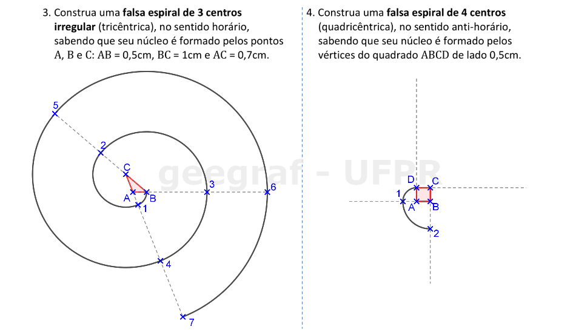
			   <figcaption>Agora vamos usar o centro <b>B</b>, com raio <b>B1</b>, terminando na semi-reta <b>CB</b>, com amplitudes sempre iguais a 90&deg;.</figcaption>
		   </li>
		   <li>
			   <input type="radio" id="191" name="sl">
			   <label for="191"></label>
			   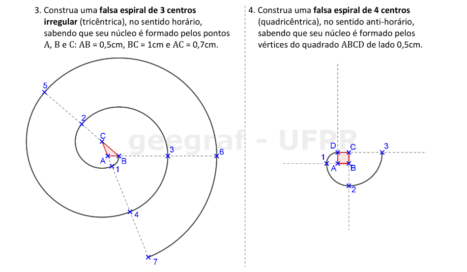
			   <figcaption>Agora vamos usar o centro <b>C</b>, com raio <b>C2</b>, terminando na semi-reta <b>DC</b>.</figcaption>
		   </li>
		   <li>
			   <input type="radio" id="192" name="sl">
			   <label for="192"></label>
			   
			   <figcaption>Prosseguimos com o rodízio dos centros e temos a construção da espiral regular de 4 centros.</figcaption>
		   </li>
		</ul>
		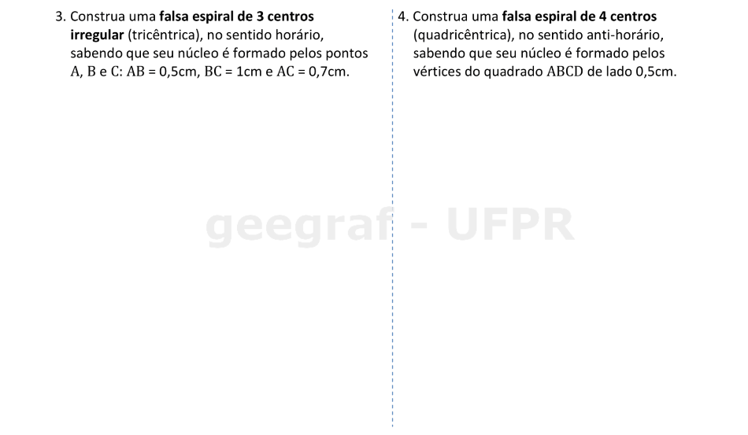
  

   
   

&#x1f4cf; &#x1f4d0; Solução

	
Usando o mesmo raciocínio do exercício anterior, podemos construir a espiral ovalada com o núcleo representado pelo retângulo de medidas indicadas.

	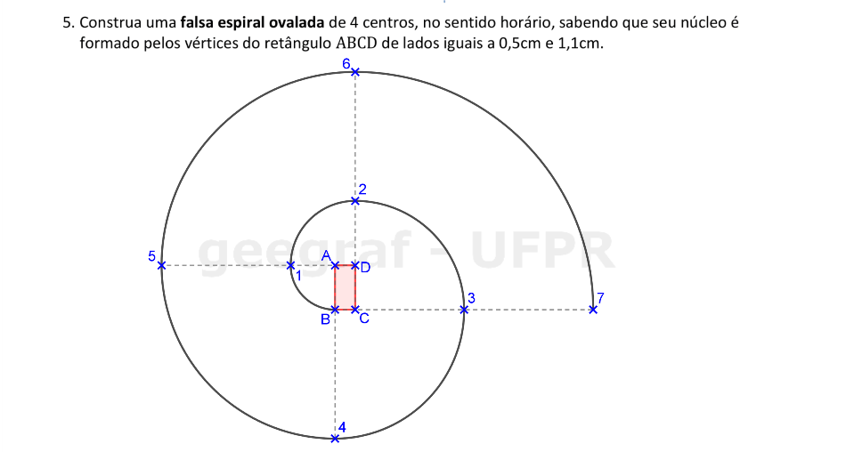
	<figcaption>Utilize os prolongamentos dos lados do retângulo como retas limites e as amplitudes dos arcos todas com 90&deg;.</figcaption>
  

   
<a href="#modulo2" class="topo">voltar ao topo</a>

   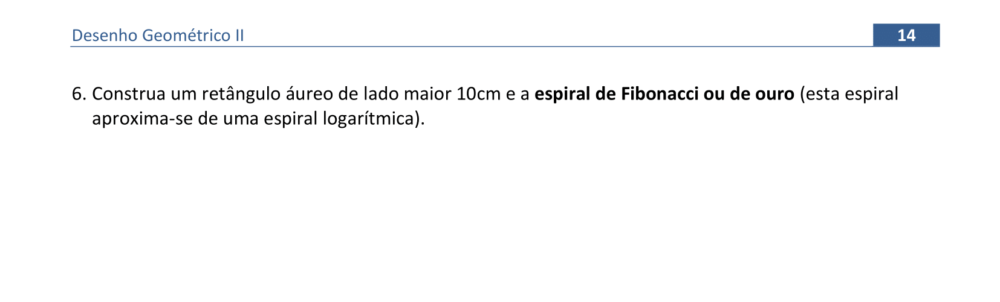
   

&#x1f4cf; &#x1f4d0; Resolução

	
Vamos construir a espiral de ouro começando pela construção do retângulo áureo.

	  <ul class="slider">
		  <li>
			   <input type="radio" id="193" name="sl" checked>
			   <label for="193"></label>
			   
			   <figcaption>Construa a mediatriz de <b>AB</b>.</figcaption>
		   </li>
		   <li>
			   <input type="radio" id="194" name="sl">
			   <label for="194"></label>
			   
			   <figcaption>No segmento <b>BC &perp; AB</b>, encontre o ponto <b>E</b> tal que <b>BE = BM = AM</b>.</figcaption>
		   </li>
		   <li>
			   <input type="radio" id="195" name="sl">
			   <label for="195"></label>
			   
			   <figcaption>Construa o arco de circunferência com centro em <b>E</b> e raio <b>EA</b>. O segmento <b>BC</b> é áureo de <b>AB</b>.</figcaption>
		   </li>
		   <li>
			   <input type="radio" id="196" name="sl">
			   <label for="196"></label>
			   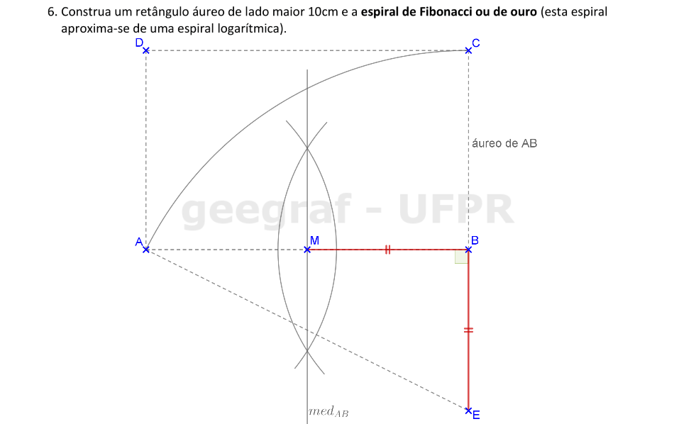
			   <figcaption>Construa os lados <b>CD // AB</b> e <b>AD // BC</b> do retângulo áureo.</figcaption>
		   </li>
		   <li>
			   <input type="radio" id="197" name="sl">
			   <label for="197"></label>
			   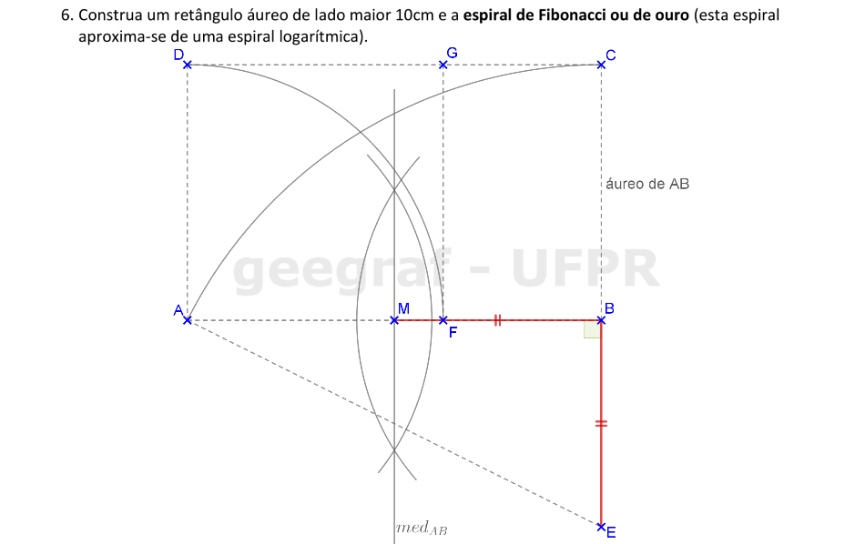
			   <figcaption>Defina o ponto <b>F &isin; AB</b> tal que <b>AF = AD</b>.</figcaption>
		   </li>
		   <li>
			   <input type="radio" id="198" name="sl">
			   <label for="198"></label>
			   
			   <figcaption>O primeiro arco da espiral de ouro tem centro <b>F</b> e raio <b>AF</b>.</figcaption>
		   </li>
		   <li>
			   <input type="radio" id="199" name="sl">
			   <label for="199"></label>
			   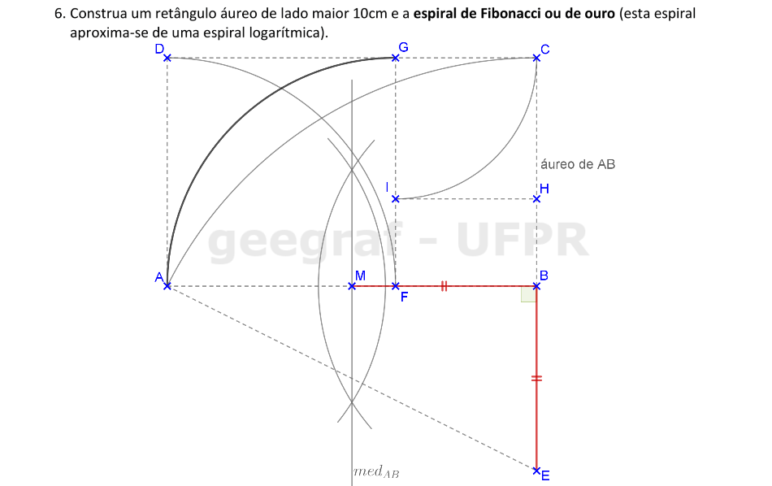
			   <figcaption>Defina o ponto <b>I &isin; FG</b> tal que <b>GI = CG</b>.</figcaption>
		   </li>
		   <li>
			   <input type="radio" id="200" name="sl">
			   <label for="200"></label>
			   
			   <figcaption>O segundo arco da espiral de ouro tem centro <b>I</b> e raio <b>IG</b>.</figcaption>
		   </li>
		   <li>
			   <input type="radio" id="201" name="sl">
			   <label for="201"></label>
			   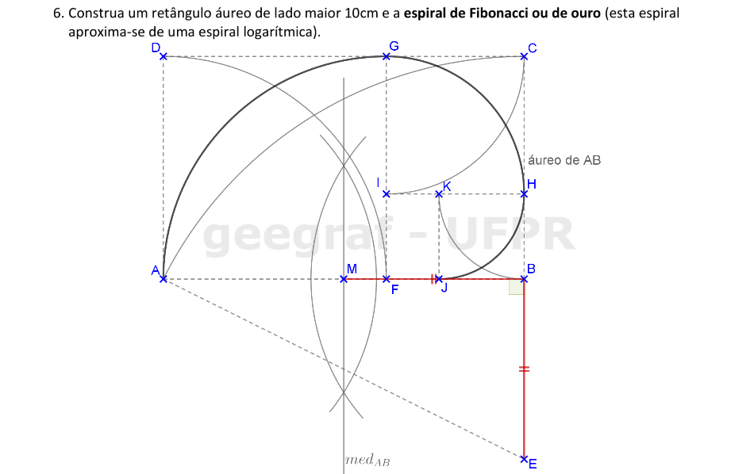
			   <figcaption>Defina o ponto <b>K &isin; IH</b> tal que <b>HK = HB</b>. O terceiro arco da espiral de ouro tem centro <b>K</b> e raio <b>HK</b>.</figcaption>
		   </li>
		   <li>
			   <input type="radio" id="202" name="sl">
			   <label for="202"></label>
			   
			   <figcaption>Defina o ponto <b>L &isin; JK</b> tal que <b>LJ = LM</b>. O quarto arco da espiral de ouro tem centro <b>L</b> e raio <b>LJ</b>.</figcaption>
		   </li>
		   <li>
			   <input type="radio" id="203" name="sl">
			   <label for="203"></label>
			   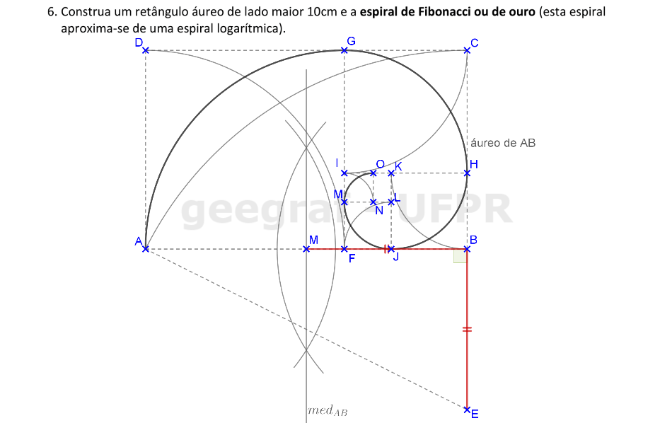
			   <figcaption>Defina o ponto <b>N &isin; LM</b> tal que <b>MN = NO</b>. O quinto arco da espiral de ouro tem centro <b>N</b> e raio <b>MN</b>. Prosseguindo com o mesmo raciocínio, podemos encontrar outros arcos que definem a espiral de ouro.</figcaption>
		   </li>
		</ul>
		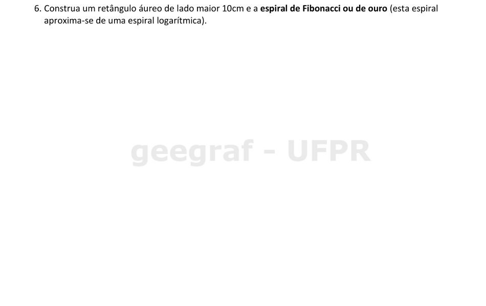
  

   
   

&#x1f4cf; &#x1f4d0; Resolução

	
Vamos construir a espiral de ouro começando pela construção do triângulo áureo.

	  <ul class="slider">
		   <li>
			   <input type="radio" id="206" name="sl">
			   <label for="206"></label>
			   
			   <figcaption>Construa o segmento áureo <b>EB</b> de <b>AB</b>.</figcaption>
		   </li>
		   <li>
			   <input type="radio" id="207" name="sl">
			   <label for="207"></label>
			   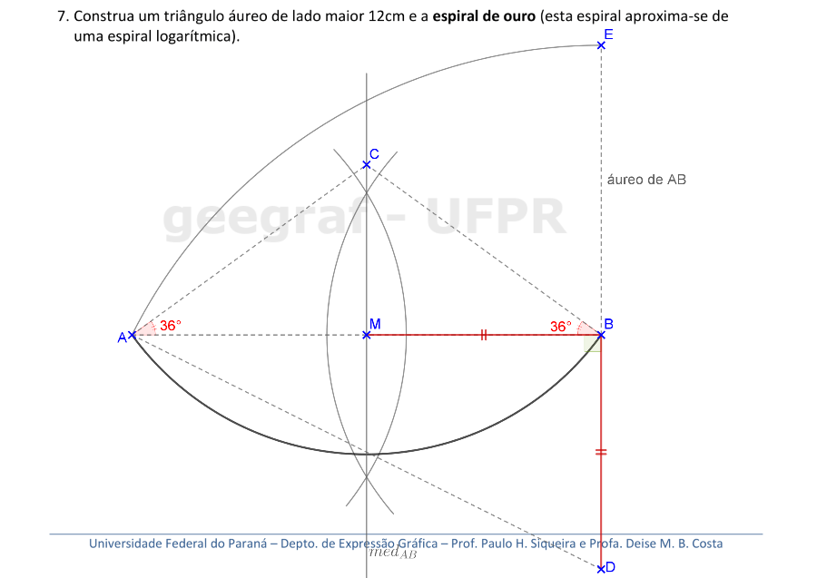
			   <figcaption>Construa os lados <b>BC = AC = BE</b> do triângulo áureo. Os ângulos da base deste triângulo isósceles medem 36&deg; e o arco com centro <b>C</b> e raio <b>AC</b> é o primeiro arco da espiral áurea.</figcaption>
		   </li>
		   <li>
			   <input type="radio" id="208" name="sl">
			   <label for="208"></label>
			   
			   <figcaption>Defina o ponto <b>F</b> tal que <b>AF = AC</b> e <b>CAF = 36&deg;</b>.</figcaption>
		   </li>
		   <li>
			   <input type="radio" id="209" name="sl">
			   <label for="209"></label>
			   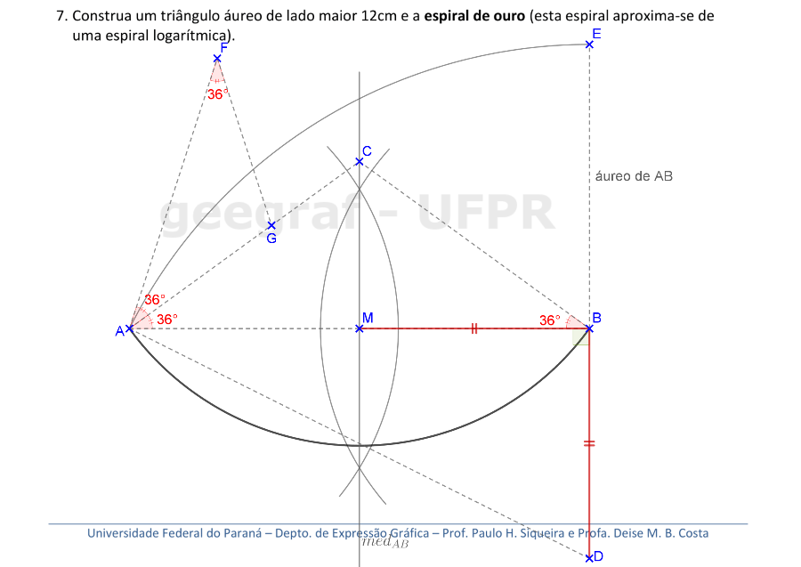
			   <figcaption>Construa <b>AFG = 36&deg;</b>, definindo o <b>&#9651;AGF</b> áureo.</figcaption>
		   </li>
		   <li>
			   <input type="radio" id="210" name="sl">
			   <label for="210"></label>
			   
			   <figcaption>O arco com centro <b>G</b> e raio <b>GF</b> é o segundo arco da espiral áurea.</figcaption>
		   </li>
		   <li>
			   <input type="radio" id="211" name="sl">
			   <label for="211"></label>
			   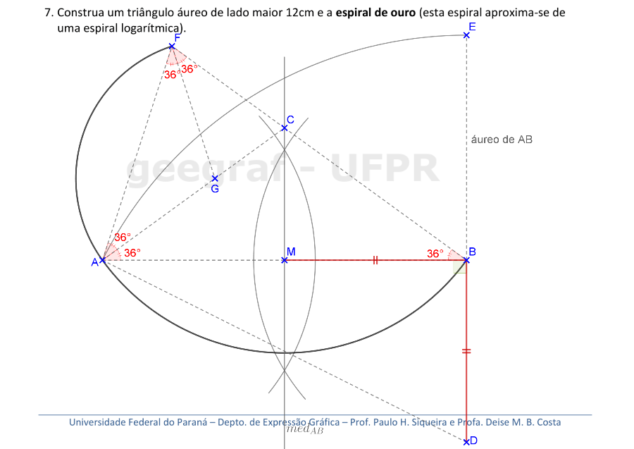
			   <figcaption>Defina o ponto <b>C'</b> tal que <b>FG = FC'</b> e <b>GFC' = 36&deg;</b>.</figcaption>
		   </li>
		   <li>
			   <input type="radio" id="212" name="sl">
			   <label for="212"></label>
			   
			   <figcaption>Construa <b>HCF = 36&deg;</b>, definindo o <b>&#9651;HCF</b> áureo. O arco com centro <b>H</b> e raio <b>HF</b> é o terceiro arco da espiral áurea.</figcaption>
		   </li>
		   <li>
			   <input type="radio" id="213" name="sl">
			   <label for="213"></label>
			   
			   <figcaption>Defina o ponto <b>G'</b> tal que <b>CG' = HC</b> e <b>HCG' = 36&deg;</b>. Construa <b>CGI = 36&deg;</b>, definindo o <b>&#9651;IGC</b> áureo. O arco com centro <b>I</b> e raio <b>IG</b> é o quarto arco da espiral áurea. Prosseguindo com o mesmo raciocínio, podemos encontrar outros arcos que definem a espiral de ouro.</figcaption>
		   </li>
		</ul>
		
  

   
<a href="#modulo2" class="topo">voltar ao topo</a>

   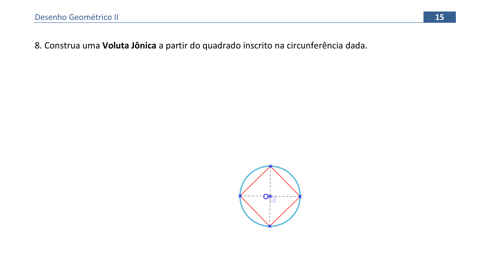
   
<a href="#modulo2" class="topo">voltar ao topo</a>

   
   
<a href="#modulo2" class="topo">voltar ao topo</a>

   
   
<a href="#modulo2" class="topo">voltar ao topo</a>

   
   
<a href="#modulo2" class="topo">voltar ao topo</a>

   
   
<a href="#modulo2" class="topo">voltar ao topo</a>

   
   
<a href="#modulo2" class="topo">voltar ao topo</a>

   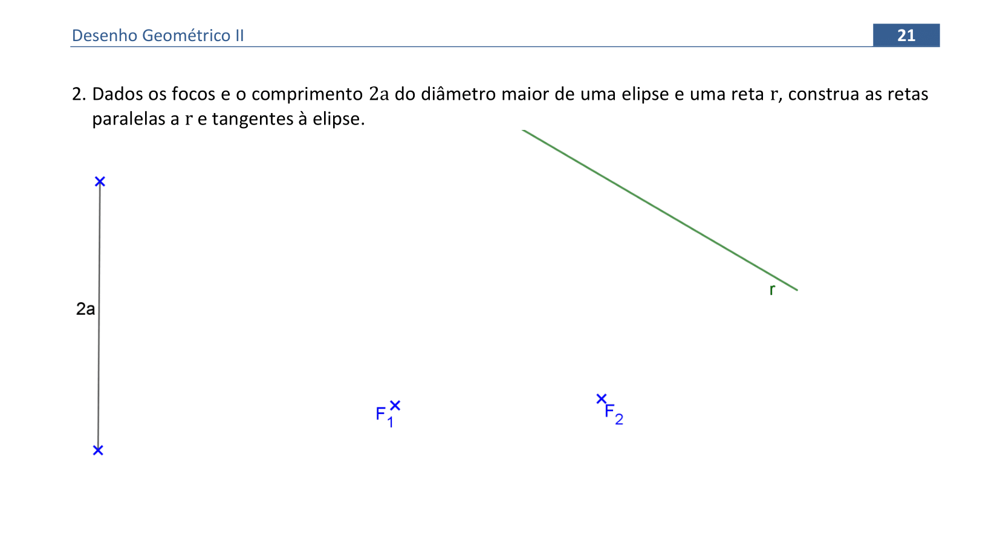
   
<a href="#modulo2" class="topo">voltar ao topo</a>

   
   
<a href="#modulo2" class="topo">voltar ao topo</a>

   
   
<a href="#modulo2" class="topo">voltar ao topo</a>

   
   
<a href="#modulo2" class="topo">voltar ao topo</a>

   
   
<a href="#modulo2" class="topo">voltar ao topo</a>

3. Hipérboles e parábolas

  
Material da página 26 até a página 41.

   
   
<a href="#modulo3" class="topo">voltar ao topo</a>

   
   
<a href="#modulo3" class="topo">voltar ao topo</a>

   
   
<a href="#modulo3" class="topo">voltar ao topo</a>

   
   
<a href="#modulo3" class="topo">voltar ao topo</a>

   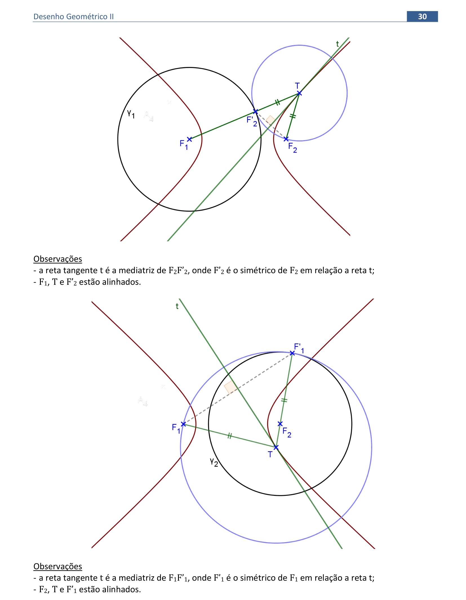
   
<a href="#modulo3" class="topo">voltar ao topo</a>

   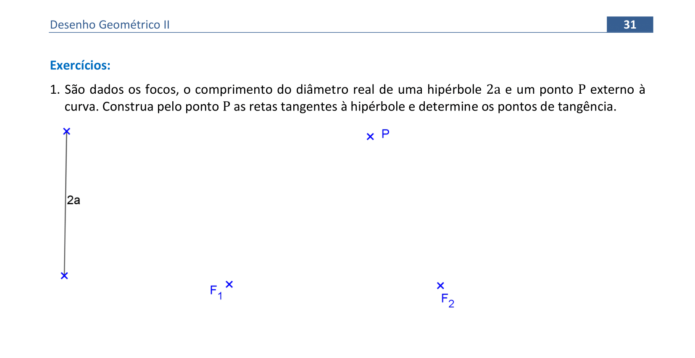
   
<a href="#modulo3" class="topo">voltar ao topo</a>

   
   
<a href="#modulo3" class="topo">voltar ao topo</a>

   
   
<a href="#modulo3" class="topo">voltar ao topo</a>

   
   
<a href="#modulo3" class="topo">voltar ao topo</a>

   
   
<a href="#modulo3" class="topo">voltar ao topo</a>

   
   
<a href="#modulo3" class="topo">voltar ao topo</a>

   
   
<a href="#modulo3" class="topo">voltar ao topo</a>

   
   
<a href="#modulo3" class="topo">voltar ao topo</a>

   
   
<a href="#modulo3" class="topo">voltar ao topo</a>

   
   
<a href="#modulo3" class="topo">voltar ao topo</a>

   
   
<a href="#modulo3" class="topo">voltar ao topo</a>

4. Homotetia, Rotação e curvas

  
Material da página 42 até a página 52.

   
   
<a href="#modulo4" class="topo">voltar ao topo</a>

   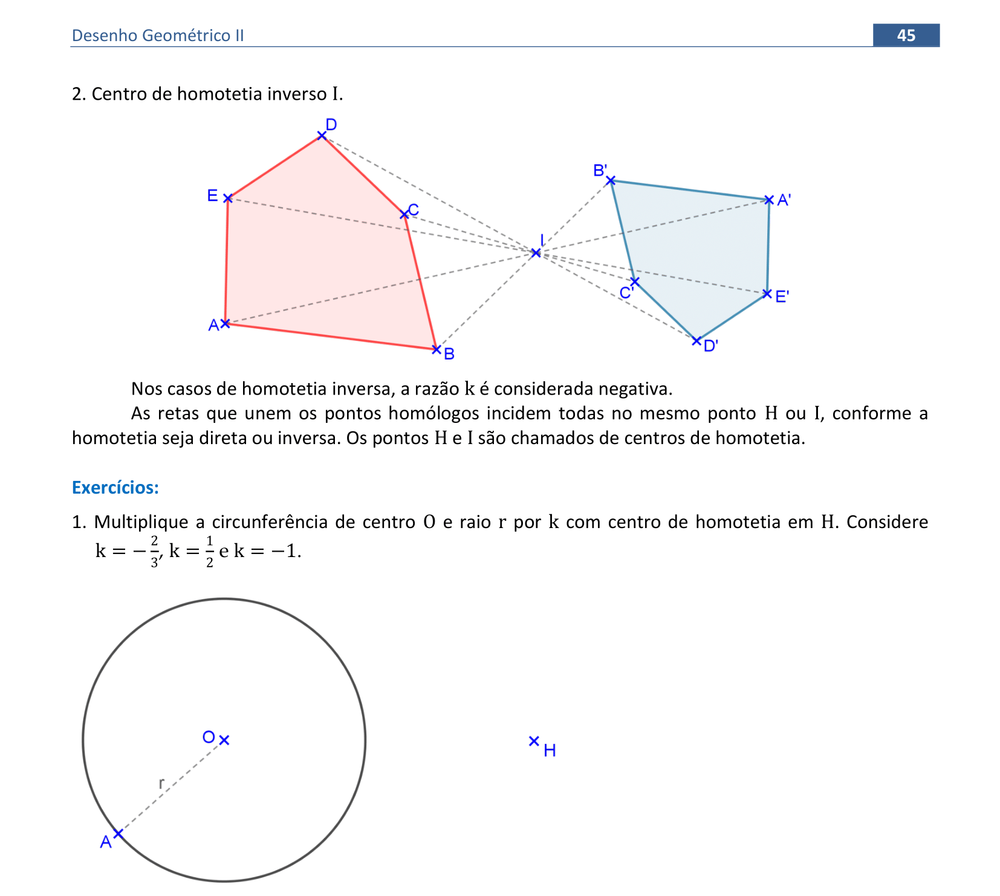
   
<a href="#modulo4" class="topo">voltar ao topo</a>

   
   
<a href="#modulo4" class="topo">voltar ao topo</a>

   
   
<a href="#modulo4" class="topo">voltar ao topo</a>

   
   
<a href="#modulo4" class="topo">voltar ao topo</a>

   
   
<a href="#modulo4" class="topo">voltar ao topo</a>

   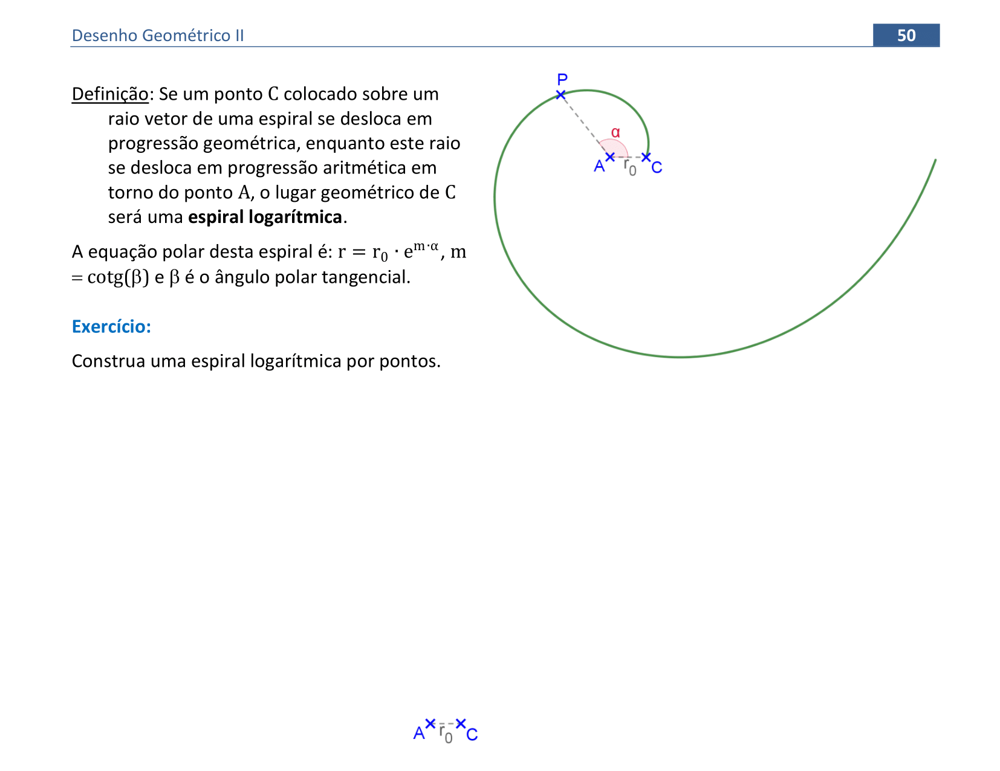
   
<a href="#modulo4" class="topo">voltar ao topo</a>

   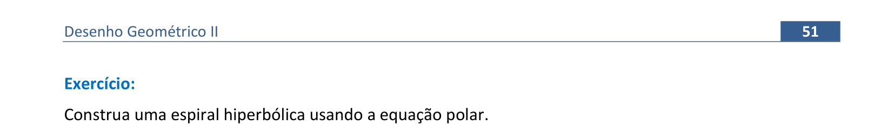
   
<a href="#modulo4" class="topo">voltar ao topo</a>

   
   
<a href="#modulo4" class="topo">voltar ao topo</a>

   
   
<a href="#modulo4" class="topo">voltar ao topo</a>

   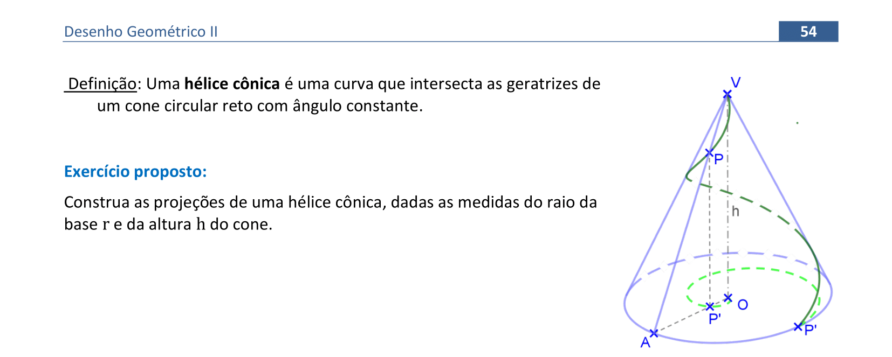
   
<a href="#modulo4" class="topo">voltar ao topo</a>

5. Translação, Inversão e curvas

  
Material da página 52 até a página 65.

   
   
<a href="#modulo5" class="topo">voltar ao topo</a>

   
   
<a href="#modulo5" class="topo">voltar ao topo</a>

   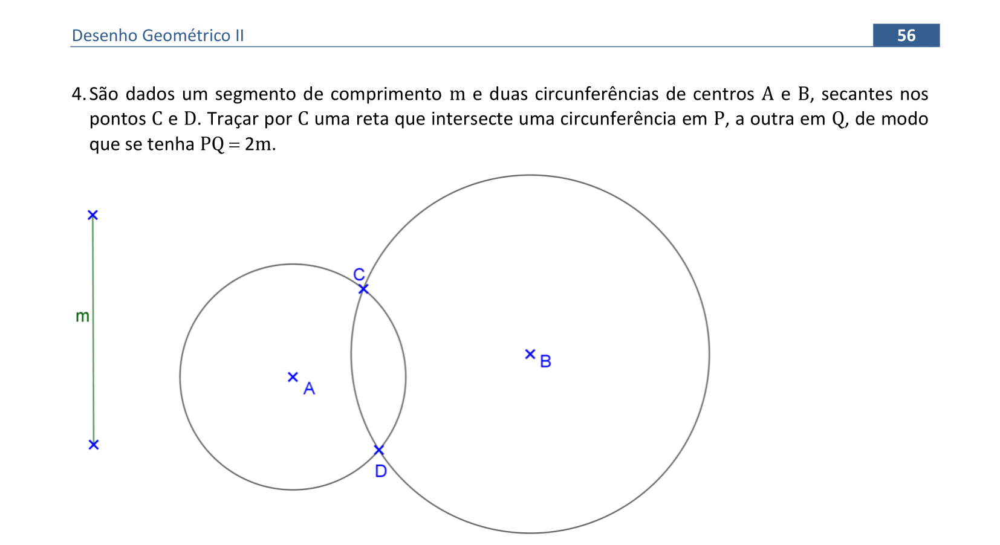
   
<a href="#modulo5" class="topo">voltar ao topo</a>

   
   
<a href="#modulo5" class="topo">voltar ao topo</a>

   
   
<a href="#modulo5" class="topo">voltar ao topo</a>

   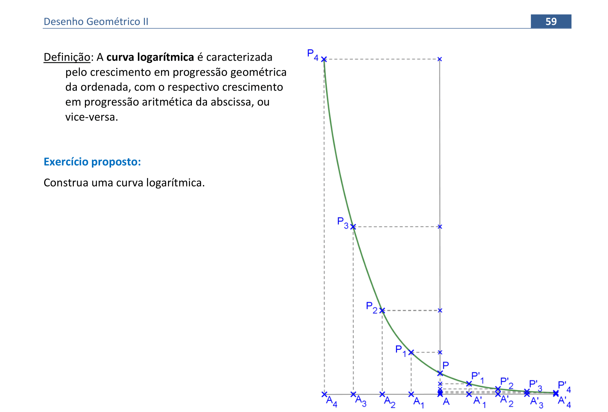
   
<a href="#modulo5" class="topo">voltar ao topo</a>

   
   
<a href="#modulo5" class="topo">voltar ao topo</a>

   
   
<a href="#modulo5" class="topo">voltar ao topo</a>

   
   
<a href="#modulo5" class="topo">voltar ao topo</a>

   
   
<a href="#modulo5" class="topo">voltar ao topo</a>

   
   
<a href="#modulo5" class="topo">voltar ao topo</a>

   
   
<a href="#modulo5" class="topo">voltar ao topo</a>

   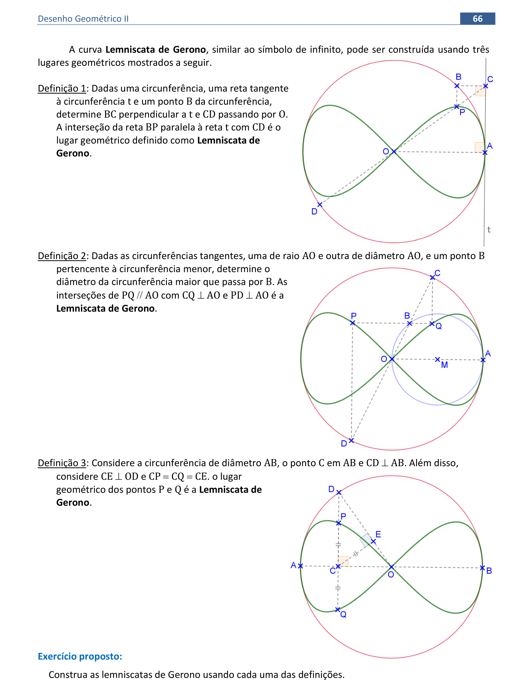
   
<a href="#modulo5" class="topo">voltar ao topo</a>

   
   
<a href="#modulo5" class="topo">voltar ao topo</a>

6. Curvas paramétricas

  
Material da página 66 até a página 77.

   
   
<a href="#modulo6" class="topo">voltar ao topo</a>

   
   
<a href="#modulo6" class="topo">voltar ao topo</a>

   
   
<a href="#modulo6" class="topo">voltar ao topo</a>

   
   
<a href="#modulo6" class="topo">voltar ao topo</a>

   
   
<a href="#modulo6" class="topo">voltar ao topo</a>

   
   
<a href="#modulo6" class="topo">voltar ao topo</a>

   
   
<a href="#modulo6" class="topo">voltar ao topo</a>

   
   
<a href="#modulo6" class="topo">voltar ao topo</a>

   
   
<a href="#modulo6" class="topo">voltar ao topo</a>

   
   
<a href="#modulo6" class="topo">voltar ao topo</a>

   
   
<a href="#modulo6" class="topo">voltar ao topo</a>

   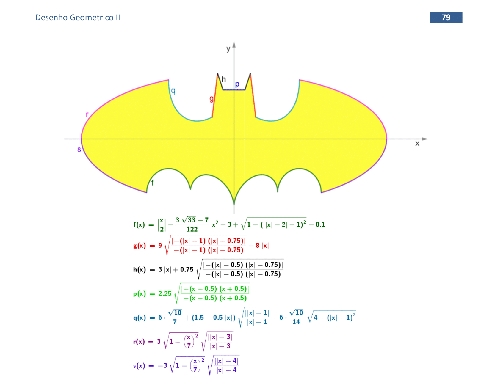
   
<a href="#modulo6" class="topo">voltar ao topo</a>

<h4>página desenvolvida por:</h4> 

Paulo Henrique Siqueira
  

<b>contato:</b> paulohscwb@gmail.com 

<h4>O desenvolvimento deste material de construções geométricas faz parte do Grupo de Estudos em Expressão Gráfica (GEEGRAF) da Universidade Federal do Paraná (UFPR)</h4>  

 Desenho Geométrico 2 de <a xmlns:cc="http://creativecommons.org/ns#" href="https://paulohscwb.github.io/desenho-geometrico2/" property="cc:attributionName" rel="cc:attributionURL">Paulo Henrique Siqueira</a> está licenciado com uma Licença <a rel="license" href="http://creativecommons.org/licenses/by-nc-nd/4.0/">Creative Commons Atribuição-NãoComercial-SemDerivações 4.0 Internacional</a>.

<h4>Como citar este trabalho:</h4> 

Siqueira, P.H., "Desenho Geométrico 2". Disponível em: <https://paulohscwb.github.io/desenho-geometrico2/>, Dezembro de 2022.

<h4>Referências:</h4>
<ol>
	<li>Carvalho, B.A. Desenho Geométrico. Imperial Novo Milênio, 2008.</li>
	<li>Rezende, E.Q.F.; Queiroz, M.L.B. Geometria Euclidiana plana e construções geométricas. Editora da Unicamp, 2008.</li>
	<li>Marmo, C.M.B. Curso de Desenho, vol. 1 a 4. Editora Moderna, 1967.</li>
	<li>Braga, T.B. Desenho Linear Geométrico. Editora Cone, 1997.</li>
	<li>Braga, T.B. Problemas de Desenho Linear Geométrico. Cultura Brasileira, 1962.</li>
	<li>Candido Gomes, M.E. Desenho Geométrico. Editora I.T.E.C., 1950.</li>
	<li>Giovanny, J.R. Desenho Geométrico, vol.4. Editora FTD, 1996.</li>
	<li>Putnoki, J.C. Elementos de Geometria e Desenho Geométrico. v. 1-3. Scipione, 1993.</li>
	<li>Siqueira, P.H.; Costa, D.M.B. Apostila de Desenho Geométrico 2. UFPR, 2022.</li>
<ol>
