<link rel="stylesheet" href="imagens/style.css">

<h2 id="inicio">Construções Geométricas</h2>

Esta página contém os procedimentos para as construções geométricas usadas na disciplina de Desenho Geométrico.

A apostila está disponível no link: <a href="basico/Apostila_DG2_2022.pdf" target="_blank">apostila de Desenho Geométrico 2</a>

Uso dos materiais básicos de Desenho

	

		<iframe width="100%" src="https://www.youtube.com/embed/1_cC5J2Xwcw" frameborder="0" allow="accelerometer; clipboard-write; encrypted-media; gyroscope; picture-in-picture" allowfullscreen></iframe>
	

	
Veja o passo a passo das construções básicas mostradas no vídeo:

	
	

&#x1f4cf; &#x1f4d0; Resolução

	
 Vamos utilizar a régua e o compasso para resolver este exercício. Clique nos botões do passo a passo para fazer a construção na sua apostila.

	  <ul class="slider">
		  <li>
			   <input type="radio" id="1" name="sl" checked>
			   <label for="1"></label>
			   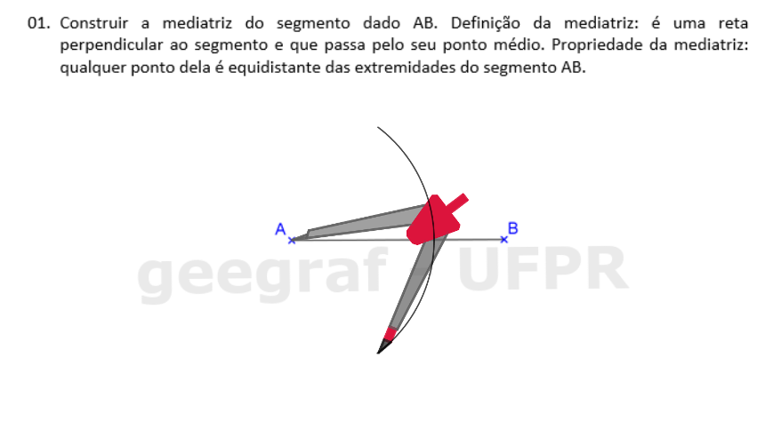
			   <figcaption>Com a ponta seca em <b>A</b>, desenhe um arco com raio maior do que a metade de <b>AB</b>.</figcaption>
		   </li>
		   <li>
			   <input type="radio" id="2" name="sl">
			   <label for="2"></label>
			   
			   <figcaption>Com a ponta seca em <b>B</b>, desenhe um arco com o mesmo raio usado no passo anterior.</figcaption>
		   </li>
		   <li>
			   <input type="radio" id="3" name="sl">
			   <label for="3"></label>
			   
			   <figcaption>Os pontos de interseção dos arcos são <b>P</b> e <b>Q</b>.</figcaption>
		   </li>
		   <li>
			   <input type="radio" id="4" name="sl">
			   <label for="4"></label>
			   
			   <figcaption>Desenhe a reta que passa pelos pontos de interseção dos arcos.</figcaption>
		   </li>
		   <li>
			   <input type="radio" id="5" name="sl">
			   <label for="5"></label>
			   
			   <figcaption>Pronto! A mediatriz do segmento <b>AB</b> está construída. Note que a figura <b>PAQB</b> é um losango e, portanto, suas diagonais são perpendiculares e se encontram no ponto médio das mesmas.</figcaption>
		   </li>
		</ul>
		
  

  
<a href="#basico" class="topo">voltar ao topo</a>

  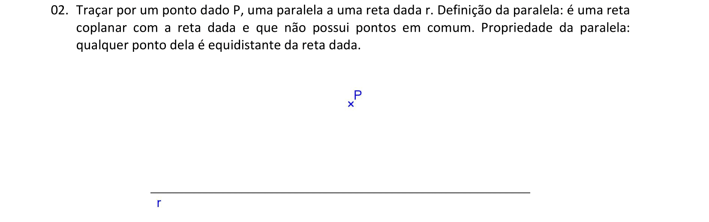
  

&#x1f4cf; &#x1f4d0; Resolução com esquadros

  
Podemos utilizar a régua e um dos esquadros ou a régua e o compasso para resolver este exercício. Primeiro, veja como é a construção com a régua e o esquadro de 45&deg;.

  <ul class="slider">
      <li>
           <input type="radio" id="12" name="sl">
           <label for="12"></label>
           
           <figcaption>Alinhe um dos catetos do esquadro com a reta <b>r</b>.</figcaption>
       </li>
       <li>
           <input type="radio" id="13" name="sl">
           <label for="13"></label>
           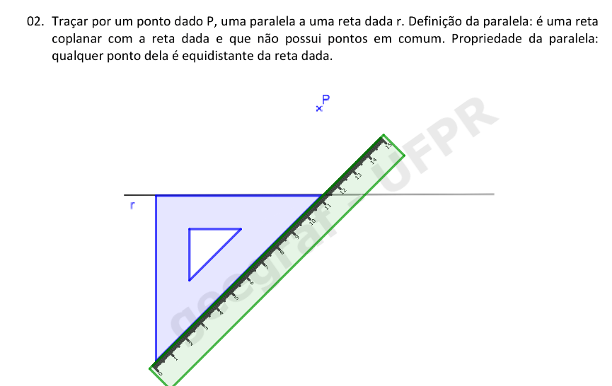
           <figcaption>Coloque a régua como apoio na hipotenusa do esquadro. A régua ficará fixa.</figcaption>
       </li>
       <li>
           <input type="radio" id="14" name="sl">
           <label for="14"></label>
           
           <figcaption>Deslize o esquadro até chegar na posição do ponto <b>P</b>. Lembre-se de não mover a régua.</figcaption>
       </li>
       <li>
           <input type="radio" id="15" name="sl">
           <label for="15"></label>
           
           <figcaption>Desenhe a reta que passa pelo ponto <b>P</b> com o cateto do esquadro.</figcaption>
       </li>
       <li>
           <input type="radio" id="16" name="sl">
           <label for="16"></label>
           
           <figcaption>Pronto! A reta paralela <b>s // r</b> está construída.</figcaption>
       </li>
    </ul>
    
  

  
<a href="#basico" class="topo">voltar ao topo</a>

  
  

&#x1f4cf; &#x1f4d0; Resolução com esquadros

  
 Vamos utilizar a régua e um dos esquadros para resolver este exercício. Clique nos botões do passo a passo para fazer a construção na sua apostila.

  <ul class="slider">
      <li>
           <input type="radio" id="22" name="sl">
           <label for="22"></label>
           
           <figcaption>Alinhe um dos catetos do esquadro com a reta <b>r</b>.</figcaption>
       </li>
       <li>
           <input type="radio" id="23" name="sl">
           <label for="23"></label>
           
           <figcaption>Coloque a régua como apoio na hipotenusa do esquadro. A régua ficará fixa.</figcaption>
       </li>
       <li>
           <input type="radio" id="24" name="sl">
           <label for="24"></label>
           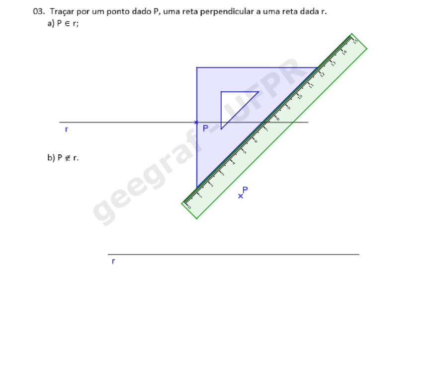
           <figcaption>Deslize o esquadro até o cateto vertical chegar na posição do ponto <b>P</b>. Lembre-se de não mover a régua.</figcaption>
       </li>
       <li>
           <input type="radio" id="25" name="sl">
           <label for="25"></label>
           
           <figcaption>Desenhe a reta que passa pelo ponto <b>P</b>.</figcaption>
       </li>
       <li>
           <input type="radio" id="26" name="sl">
           <label for="26"></label>
           
           <figcaption>Pronto! A reta perpendicular <b>p</b> está construída.</figcaption>
       </li>
       <li>
           <input type="radio" id="27" name="sl">
           <label for="27"></label>
           
           <figcaption>Alinhe um dos catetos do esquadro com a reta <b>r</b>.</figcaption>
       </li>
       <li>
           <input type="radio" id="28" name="sl">
           <label for="28"></label>
           
           <figcaption>Coloque a régua como apoio na hipotenusa do esquadro. A régua ficará fixa.</figcaption>
       </li>
       <li>
           <input type="radio" id="29" name="sl">
           <label for="29"></label>
           
           <figcaption>Deslize o esquadro até o cateto vertical chegar na posição do ponto <b>P</b>. Lembre-se de não mover a régua.</figcaption>
       </li>
       <li>
           <input type="radio" id="30" name="sl">
           <label for="30"></label>
           
           <figcaption>Desenhe a reta que passa pelo ponto <b>P</b>.</figcaption>
       </li>
       <li>
           <input type="radio" id="31" name="sl">
           <label for="31"></label>
           
           <figcaption>Pronto! A reta perpendicular <b>p</b> está construída.</figcaption>
       </li>
    </ul>
    
  

  
<a href="#basico" class="topo">voltar ao topo</a>

  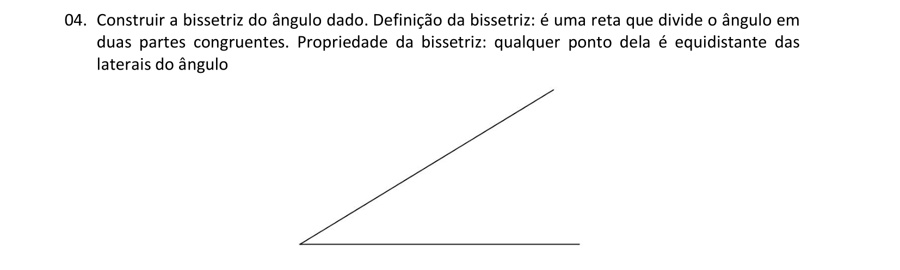
  

&#x1f4cf; &#x1f4d0; Resolução

  
 Vamos utilizar a régua e o compasso para resolver este exercício. Clique nos botões do passo a passo para fazer a construção na sua apostila.

  <ul class="slider">
      <li>
           <input type="radio" id="40" name="sl">
           <label for="40"></label>
           
           <figcaption>Com a ponta seca no vértice <b>O</b> do ângulo desenhe um arco obtendo os pontos <b>P</b> e <b>Q</b>, cada um em um lado do ângulo.</figcaption>
       </li>
       <li>
           <input type="radio" id="41" name="sl">
           <label for="41"></label>
           
           <figcaption>Com a ponta seca no ponto <b>P</b> desenhe um arco.</figcaption>
       </li>
	   <li>
           <input type="radio" id="41a" name="sl">
           <label for="41a"></label>
           
           <figcaption>Com a ponta seca em <b>Q</b> desenhe um arco com o mesmo raio do passo anterior, obtendo o ponto <b>R</b>.</figcaption>
       </li>
       <li>
           <input type="radio" id="42" name="sl">
           <label for="42"></label>
           
           <figcaption>Desenhe a reta <b>OR</b> que é a bissetriz do ângulo dado.</figcaption>
       </li>
       <li>
           <input type="radio" id="43" name="sl">
           <label for="43"></label>
           
           <figcaption>Note que construímos dois triângulos: um verde e outro laranja.</figcaption>
       </li>
       <li>
           <input type="radio" id="44" name="sl">
           <label for="44"></label>
           
           <figcaption>Esses triângulos são congruentes (iguais) e por isso os ângulos <b>&alpha;</b> e <b>&beta;</b> são também congruentes.</figcaption>
       </li>
    </ul>
    
  

  
<a href="#basico" class="topo">voltar ao topo</a>

1. Simetria Axial, Arcos e Ovais

  
Material da página 1 até a página 11.

   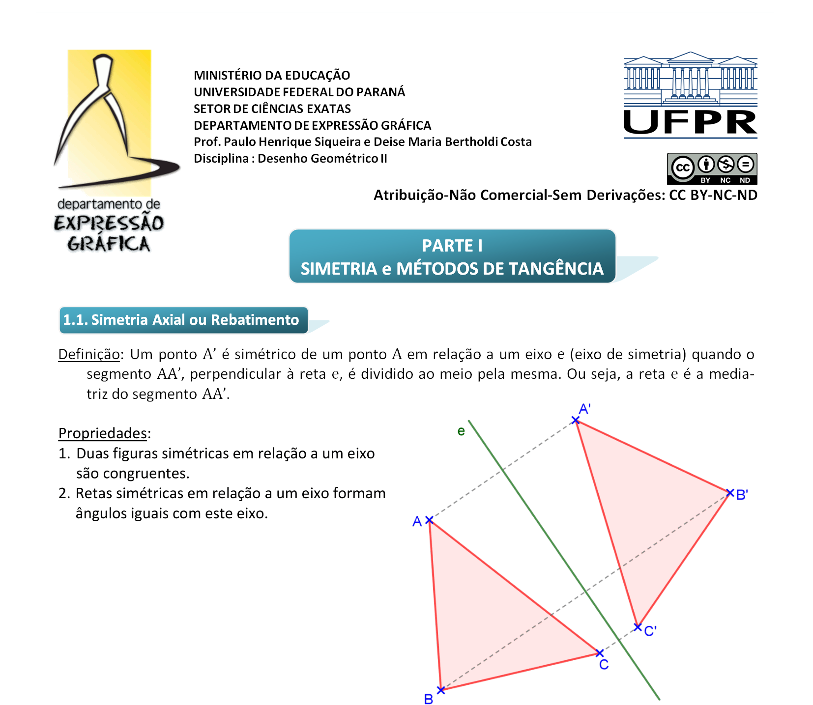
   

&#x1f4d1; Propriedades

	
Dados os pontos <b>A</b>, <b>B</b> e <b>C</b>, os simétricos destes pontos são obtidos da seguinte maneira:

	  <ul class="slider">
		  <li>
			   <input type="radio" id="001" name="sl" checked>
			   <label for="001"></label>
			   
			   <figcaption>Construímos as retas perpendiculares ao eixo <b>e</b> que passam pelos pontos <b>A</b>, <b>B</b> e <b>C</b>.</figcaption>
		   </li>
		   <li>
			   <input type="radio" id="002" name="sl">
			   <label for="002"></label>
			   
			   <figcaption>Depois, basta definir os homólogos <b>A'</b>, <b>B'</b> e <b>C'</b> pertencentes às respectivas perpendiculares e equidistantes ao eixo, ou seja, <b>AMA = A'MA</b>, <b>BMB = B'MB</b> e <b>CMC = C'MC</b>.</figcaption>
		   </li>
		</ul>
		
  

  
  

&#x1f4cf; &#x1f4d0; Resolução

	
Em um triângulo, a bissetriz de um ângulo serve como eixo de simetria para os pontos dos lados adjacentes a este ângulo.

	  <ul class="slider">
		  <li>
			   <input type="radio" id="003" name="sl" checked>
			   <label for="003"></label>
			   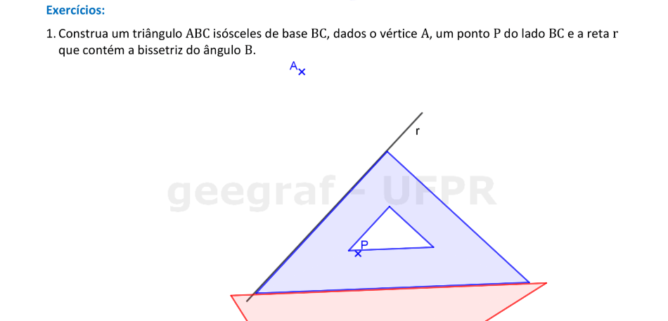
			   <figcaption>A reta <b>r</b> é um eixo de simetria dos pontos <b>P</b> e <b>P'</b>. Logo, podemos construir uma reta perpendicular a <b>r</b> que passa por <b>P</b>.</figcaption>
		   </li>
		   <li>
			   <input type="radio" id="004" name="sl">
			   <label for="004"></label>
			   
			   <figcaption>Alinhando um catedo do esquadro de 45&deg; com a reta <b>r</b> e deixando o outro esquadro ou a régua como apoio na hipotenusa, podemos deslizar o esquadro de 45&deg; para construir com o outro cateto a reta perpendicular a <b>r</b>.</figcaption>
		   </li>
		   <li>
			   <input type="radio" id="005" name="sl">
			   <label for="005"></label>
			   
			   <figcaption>Depois, basta construir com o compasso os segmentos congruentes das distâncias de <b>P</b>...</figcaption>
		   </li>
		   <li>
			   <input type="radio" id="006" name="sl">
			   <label for="006"></label>
			   
			   <figcaption>... e de <b>P'</b> à reta <b>r</b>.</figcaption>
		   </li>
		   <li>
			   <input type="radio" id="007" name="sl">
			   <label for="007"></label>
			   
			   <figcaption>Unindo os pontos <b>A</b> e <b>P'</b>, encontramos <b>B</b> na interseção com a reta <b>r</b>.</figcaption>
		   </li>
		   <li>
			   <input type="radio" id="008" name="sl">
			   <label for="008"></label>
			   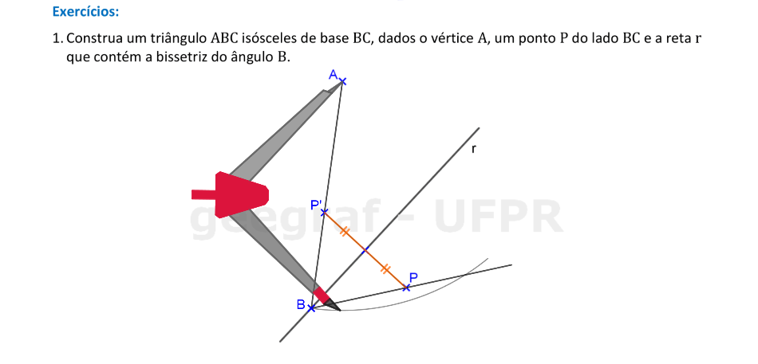
			   <figcaption>Como o triângulo isósceles tem base <b>BC</b>, temos que <b>AB = AC</b>. Usando o compasso com a ponta seca em <b>A</b> e raio <b>AB</b>...</figcaption>
		   </li>
		   <li>
			   <input type="radio" id="009" name="sl">
			   <label for="009"></label>
			   
			   <figcaption>... encontramos o vértice <b>C</b> na reta suporte <b>BP</b>.</figcaption>
		   </li>
		</ul>
		
  

   
<a href="#modulo1" class="topo">voltar ao topo</a>

   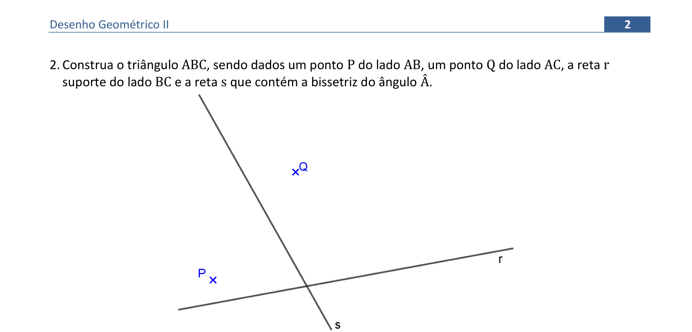
   
<a href="#modulo1" class="topo">voltar ao topo</a>

   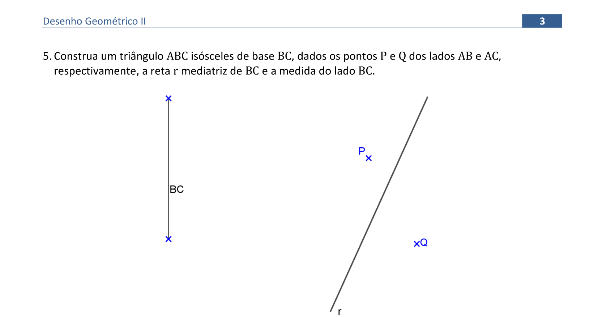
   
<a href="#modulo1" class="topo">voltar ao topo</a>

   
   
<a href="#modulo1" class="topo">voltar ao topo</a>

   
   
<a href="#modulo1" class="topo">voltar ao topo</a>

   
   
<a href="#modulo1" class="topo">voltar ao topo</a>

   
   
<a href="#modulo1" class="topo">voltar ao topo</a>

   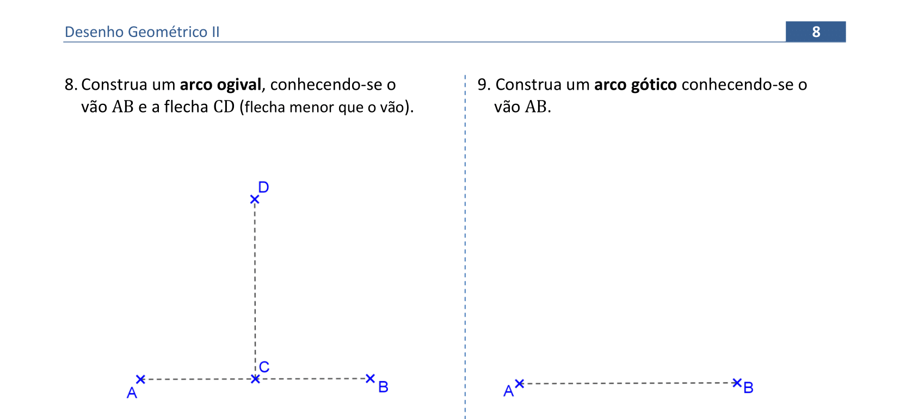
   
<a href="#modulo1" class="topo">voltar ao topo</a>

   
   
<a href="#modulo1" class="topo">voltar ao topo</a>

   
   
<a href="#modulo1" class="topo">voltar ao topo</a>

   
   
<a href="#modulo1" class="topo">voltar ao topo</a>

2. Espirais e elipses

  
Material da página 12 até a página 25.

   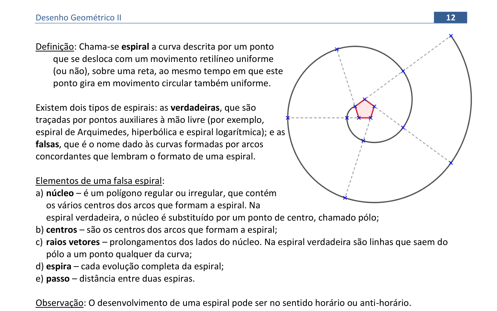
   
<a href="#modulo2" class="topo">voltar ao topo</a>

   
   
<a href="#modulo2" class="topo">voltar ao topo</a>

   
   
<a href="#modulo2" class="topo">voltar ao topo</a>

   
   
<a href="#modulo2" class="topo">voltar ao topo</a>

   
   
<a href="#modulo2" class="topo">voltar ao topo</a>

   
   
<a href="#modulo2" class="topo">voltar ao topo</a>

   
   
<a href="#modulo2" class="topo">voltar ao topo</a>

   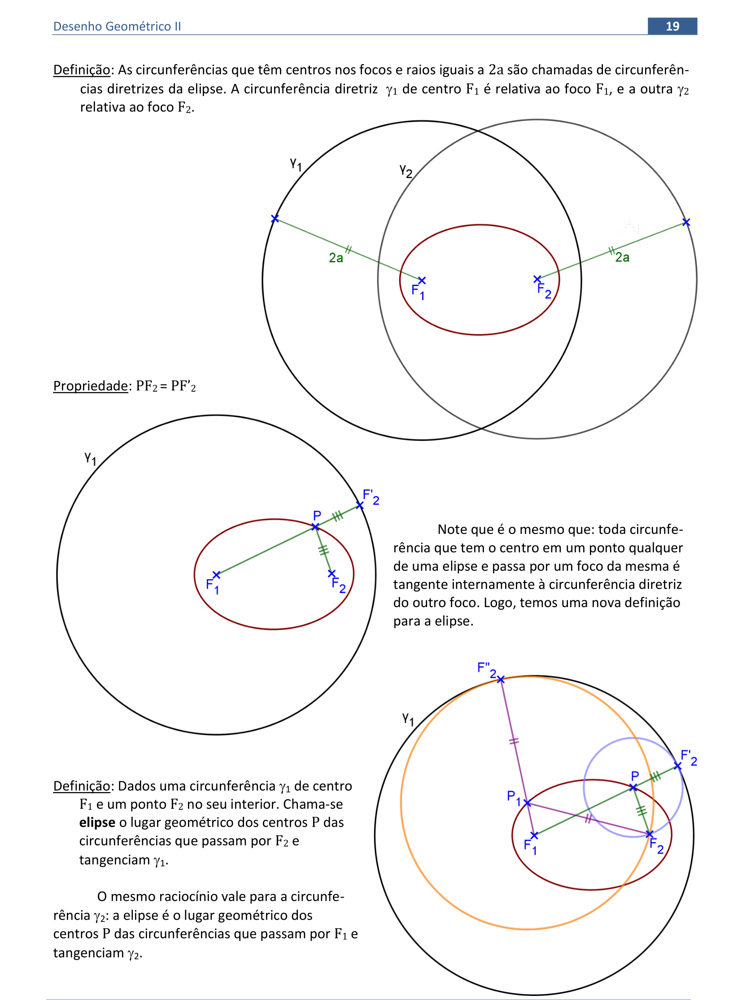
   
<a href="#modulo2" class="topo">voltar ao topo</a>

   
   
<a href="#modulo2" class="topo">voltar ao topo</a>

   
   
<a href="#modulo2" class="topo">voltar ao topo</a>

   
   
<a href="#modulo2" class="topo">voltar ao topo</a>

   
   
<a href="#modulo2" class="topo">voltar ao topo</a>

   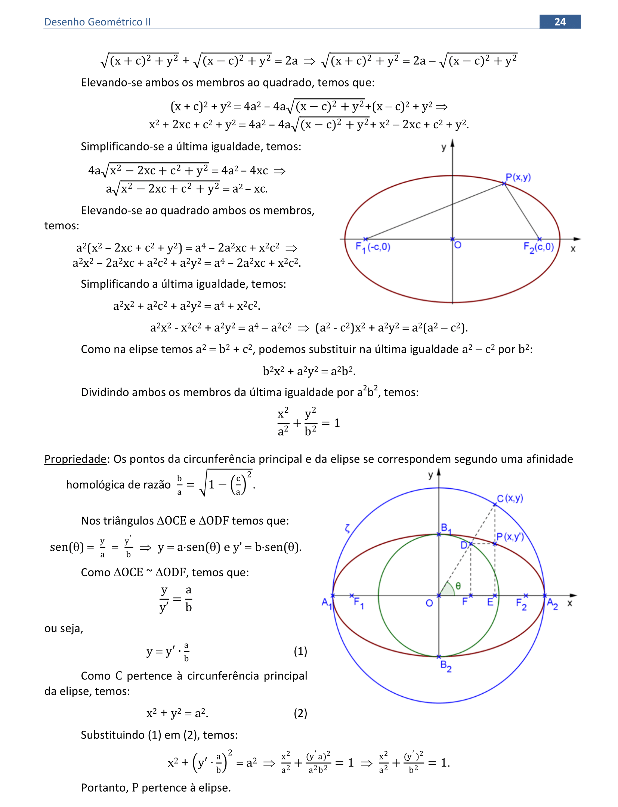
   
<a href="#modulo2" class="topo">voltar ao topo</a>

   
   
<a href="#modulo2" class="topo">voltar ao topo</a>

3. Hipérboles e parábolas

  
Material da página 26 até a página 41.

   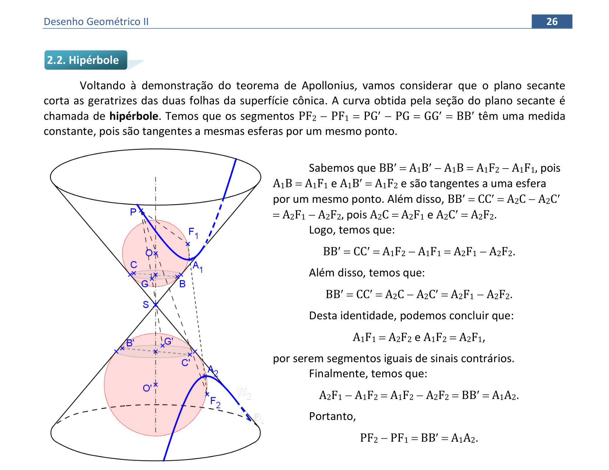
   
<a href="#modulo3" class="topo">voltar ao topo</a>

   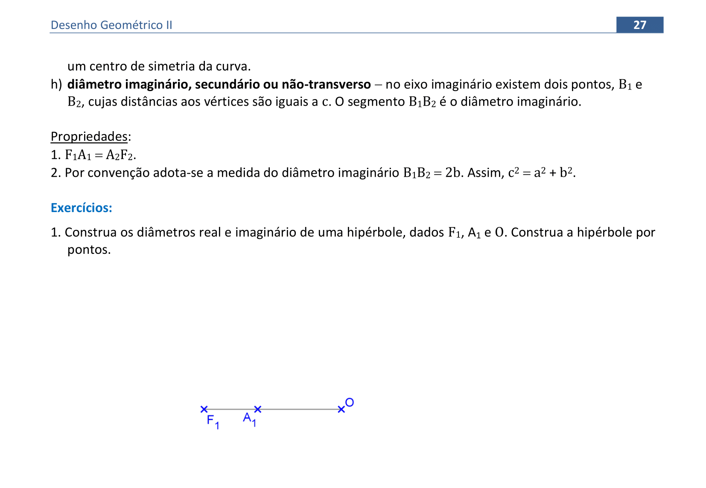
   
<a href="#modulo3" class="topo">voltar ao topo</a>

   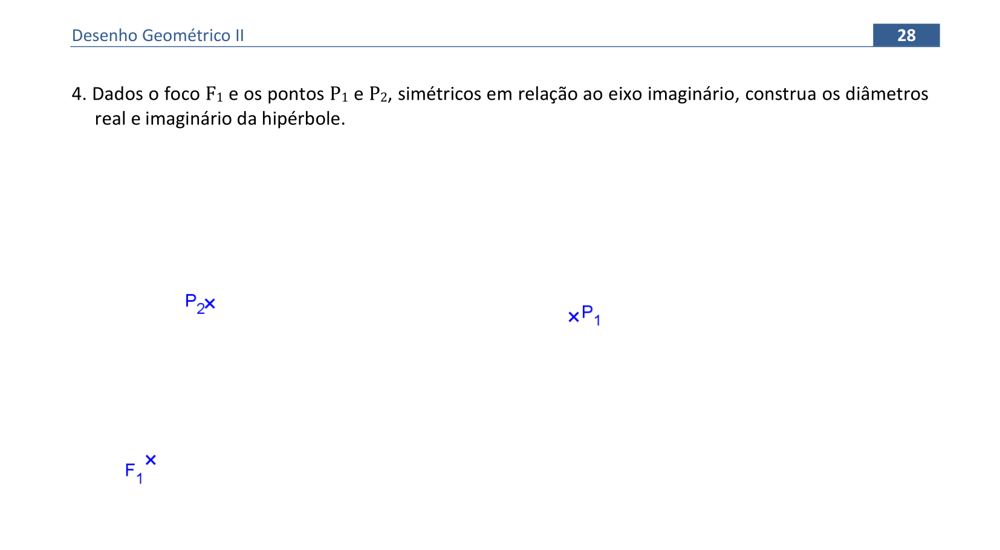
   
<a href="#modulo3" class="topo">voltar ao topo</a>

   
   
<a href="#modulo3" class="topo">voltar ao topo</a>

   
   
<a href="#modulo3" class="topo">voltar ao topo</a>

   
   
<a href="#modulo3" class="topo">voltar ao topo</a>

   
   
<a href="#modulo3" class="topo">voltar ao topo</a>

   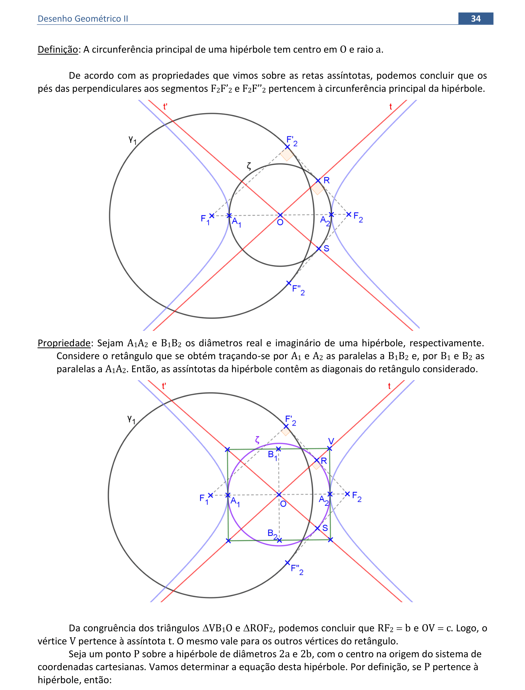
   
<a href="#modulo3" class="topo">voltar ao topo</a>

   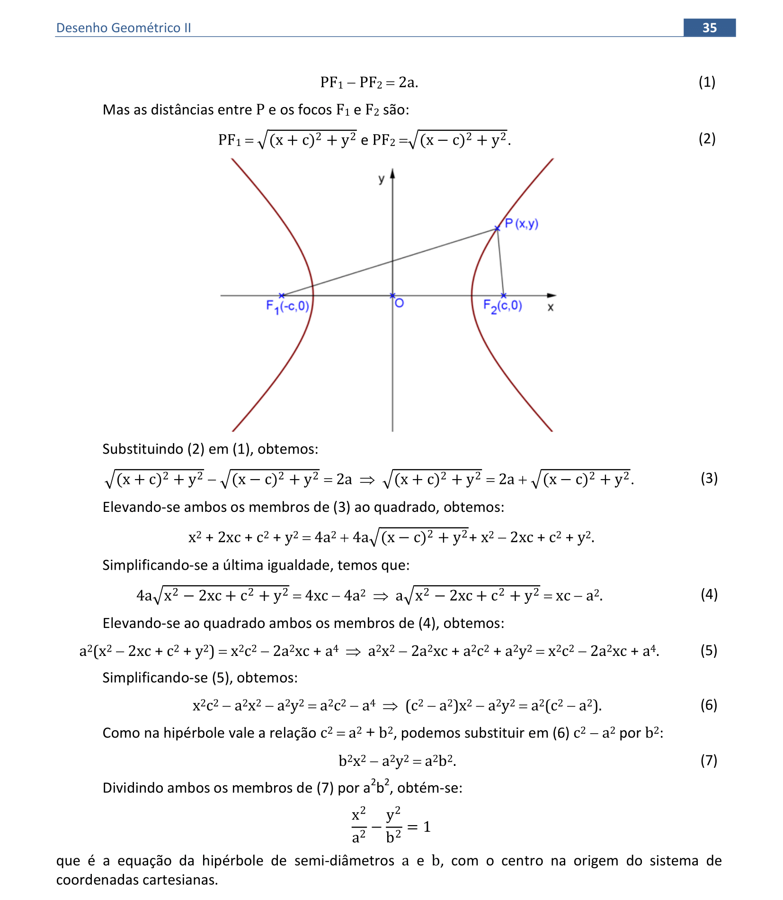
   
<a href="#modulo3" class="topo">voltar ao topo</a>

   
   
<a href="#modulo3" class="topo">voltar ao topo</a>

   
   
<a href="#modulo3" class="topo">voltar ao topo</a>

   
   
<a href="#modulo3" class="topo">voltar ao topo</a>

   
   
<a href="#modulo3" class="topo">voltar ao topo</a>

   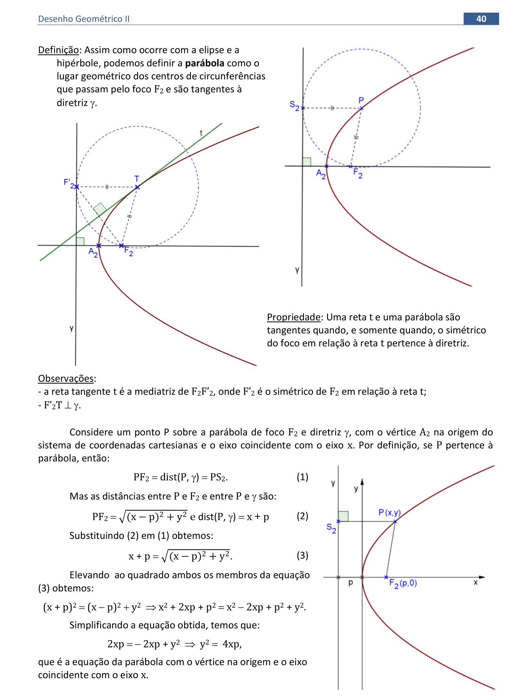
   
<a href="#modulo3" class="topo">voltar ao topo</a>

   
   
<a href="#modulo3" class="topo">voltar ao topo</a>

   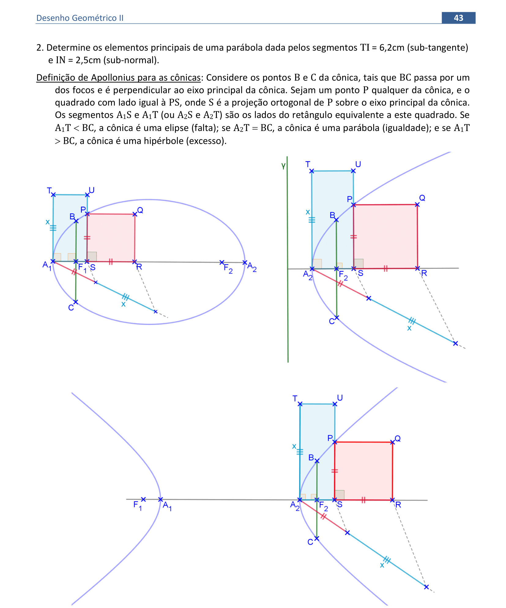
   
<a href="#modulo3" class="topo">voltar ao topo</a>

4. Homotetia, Rotação e curvas

  
Material da página 42 até a página 52.

   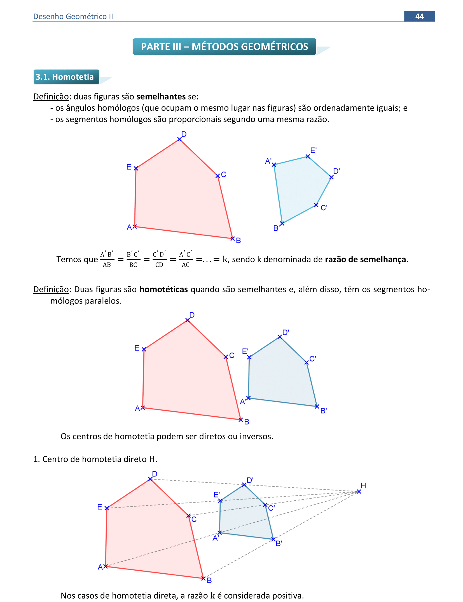
   
<a href="#modulo4" class="topo">voltar ao topo</a>

   
   
<a href="#modulo4" class="topo">voltar ao topo</a>

   
   
<a href="#modulo4" class="topo">voltar ao topo</a>

   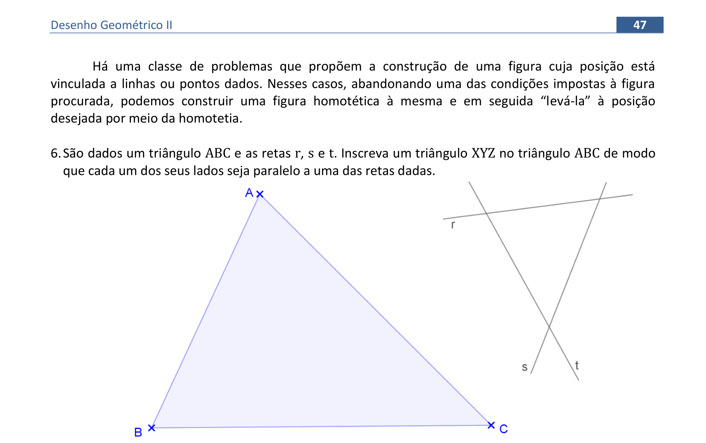
   
<a href="#modulo4" class="topo">voltar ao topo</a>

   
   
<a href="#modulo4" class="topo">voltar ao topo</a>

   
   
<a href="#modulo4" class="topo">voltar ao topo</a>

   
   
<a href="#modulo4" class="topo">voltar ao topo</a>

   
   
<a href="#modulo4" class="topo">voltar ao topo</a>

   
   
<a href="#modulo4" class="topo">voltar ao topo</a>

   
   
<a href="#modulo4" class="topo">voltar ao topo</a>

   
   
<a href="#modulo4" class="topo">voltar ao topo</a>

5. Translação, Inversão e curvas

  
Material da página 52 até a página 65.

   
   
<a href="#modulo5" class="topo">voltar ao topo</a>

   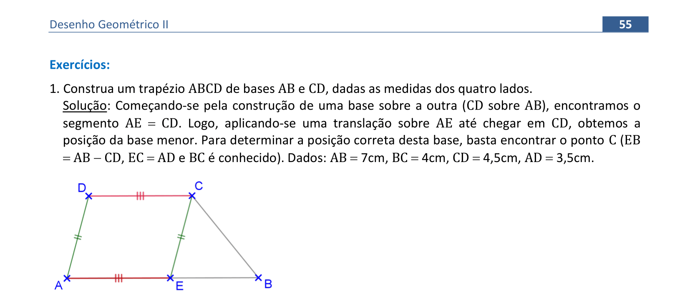
   
<a href="#modulo5" class="topo">voltar ao topo</a>

   
   
<a href="#modulo5" class="topo">voltar ao topo</a>

   
   
<a href="#modulo5" class="topo">voltar ao topo</a>

   
   
<a href="#modulo5" class="topo">voltar ao topo</a>

   
   
<a href="#modulo5" class="topo">voltar ao topo</a>

   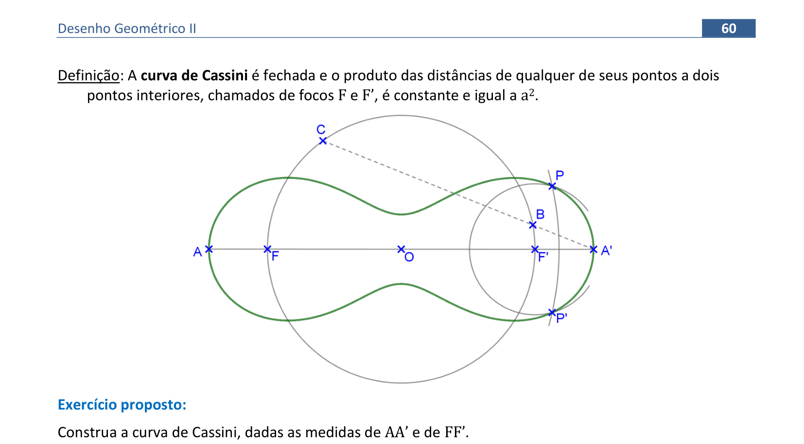
   
<a href="#modulo5" class="topo">voltar ao topo</a>

   
   
<a href="#modulo5" class="topo">voltar ao topo</a>

   
   
<a href="#modulo5" class="topo">voltar ao topo</a>

   
   
<a href="#modulo5" class="topo">voltar ao topo</a>

   
   
<a href="#modulo5" class="topo">voltar ao topo</a>

   
   
<a href="#modulo5" class="topo">voltar ao topo</a>

   
   
<a href="#modulo5" class="topo">voltar ao topo</a>

   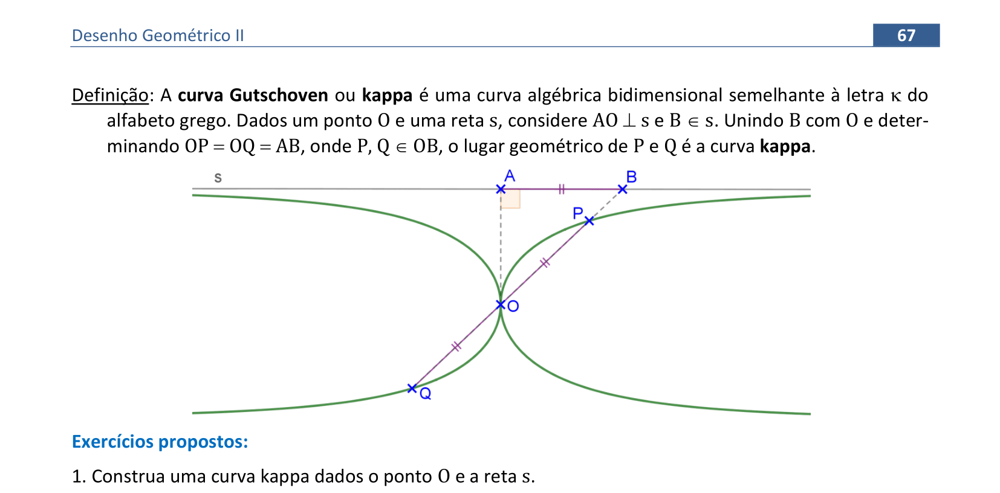
   
<a href="#modulo5" class="topo">voltar ao topo</a>

6. Curvas paramétricas

  
Material da página 66 até a página 77.

   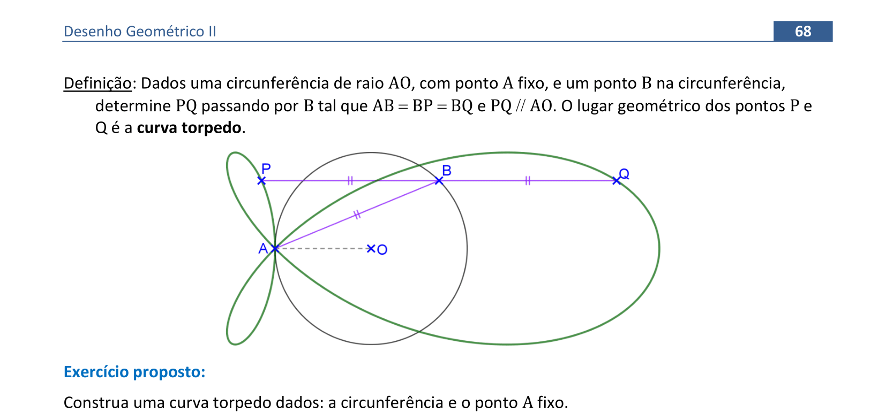
   
<a href="#modulo6" class="topo">voltar ao topo</a>

   
   
<a href="#modulo6" class="topo">voltar ao topo</a>

   
   
<a href="#modulo6" class="topo">voltar ao topo</a>

   
   
<a href="#modulo6" class="topo">voltar ao topo</a>

   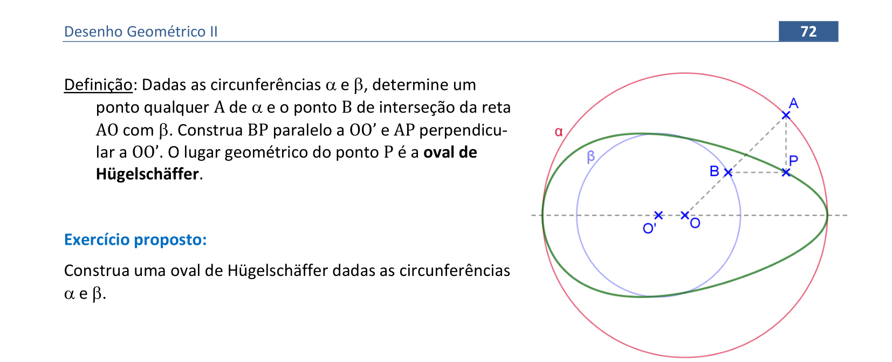
   
<a href="#modulo6" class="topo">voltar ao topo</a>

   
   
<a href="#modulo6" class="topo">voltar ao topo</a>

   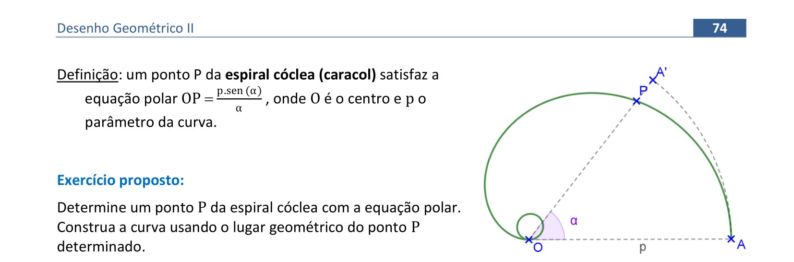
   
<a href="#modulo6" class="topo">voltar ao topo</a>

   
   
<a href="#modulo6" class="topo">voltar ao topo</a>

   
   
<a href="#modulo6" class="topo">voltar ao topo</a>

   
   
<a href="#modulo6" class="topo">voltar ao topo</a>

   
   
<a href="#modulo6" class="topo">voltar ao topo</a>

   
   
<a href="#modulo6" class="topo">voltar ao topo</a>

<h4>página desenvolvida por:</h4> 

Paulo Henrique Siqueira
  

<b>contato:</b> paulohscwb@gmail.com 

<h4>O desenvolvimento deste material de construções geométricas faz parte do Grupo de Estudos em Expressão Gráfica (GEEGRAF) da Universidade Federal do Paraná (UFPR)</h4>  

 Desenho Geométrico 2 de <a xmlns:cc="http://creativecommons.org/ns#" href="https://paulohscwb.github.io/desenho-geometrico2/" property="cc:attributionName" rel="cc:attributionURL">Paulo Henrique Siqueira</a> está licenciado com uma Licença <a rel="license" href="http://creativecommons.org/licenses/by-nc-nd/4.0/">Creative Commons Atribuição-NãoComercial-SemDerivações 4.0 Internacional</a>.

<h4>Como citar este trabalho:</h4> 

Siqueira, P.H., "Desenho Geométrico 2". Disponível em: <https://paulohscwb.github.io/desenho-geometrico2/>, Dezembro de 2022.

<h4>Referências:</h4>
<ol>
	<li>Carvalho, B.A. Desenho Geométrico. Imperial Novo Milênio, 2008.</li>
	<li>Rezende, E.Q.F.; Queiroz, M.L.B. Geometria Euclidiana plana e construções geométricas. Editora da Unicamp, 2008.</li>
	<li>Marmo, C.M.B. Curso de Desenho, vol. 1 a 4. Editora Moderna, 1967.</li>
	<li>Braga, T.B. Desenho Linear Geométrico. Editora Cone, 1997.</li>
	<li>Braga, T.B. Problemas de Desenho Linear Geométrico. Cultura Brasileira, 1962.</li>
	<li>Candido Gomes, M.E. Desenho Geométrico. Editora I.T.E.C., 1950.</li>
	<li>Giovanny, J.R. Desenho Geométrico, vol.4. Editora FTD, 1996.</li>
	<li>Putnoki, J.C. Elementos de Geometria e Desenho Geométrico. v. 1-3. Scipione, 1993.</li>
	<li>Siqueira, P.H.; Costa, D.M.B. Apostila de Desenho Geométrico 2. UFPR, 2022.</li>
<ol>
