<!--<link rel="stylesheet" href="imagens/style.css">-->


<h2 id="inicio">Construções Geométricas</h2>

Esta página contém os procedimentos para as construções geométricas usadas na disciplina de Desenho Geométrico.

A apostila está disponível no link: <a href="basico/Apostila_DG2_2022.pdf" target="_blank">apostila de Desenho Geométrico 2</a>

Uso dos materiais básicos de Desenho

	

		<iframe width="100%" src="https://www.youtube.com/embed/1_cC5J2Xwcw" frameborder="0" allow="accelerometer; clipboard-write; encrypted-media; gyroscope; picture-in-picture" allowfullscreen></iframe>
	

	
Veja o passo a passo das construções básicas mostradas no vídeo:

	
	

&#x1f4cf; &#x1f4d0; Resolução

	
 Vamos utilizar a régua e o compasso para resolver este exercício. Clique nos botões do passo a passo para fazer a construção na sua apostila.

	  <ul class="slider">
		  <li>
			   <input type="radio" id="1" name="sl" checked>
			   <label for="1"></label>
			   
			   <figcaption>Com a ponta seca em <b>A</b>, desenhe um arco com raio maior do que a metade de <b>AB</b>.</figcaption>
		   </li>
		   <li>
			   <input type="radio" id="2" name="sl">
			   <label for="2"></label>
			   
			   <figcaption>Com a ponta seca em <b>B</b>, desenhe um arco com o mesmo raio usado no passo anterior.</figcaption>
		   </li>
		   <li>
			   <input type="radio" id="3" name="sl">
			   <label for="3"></label>
			   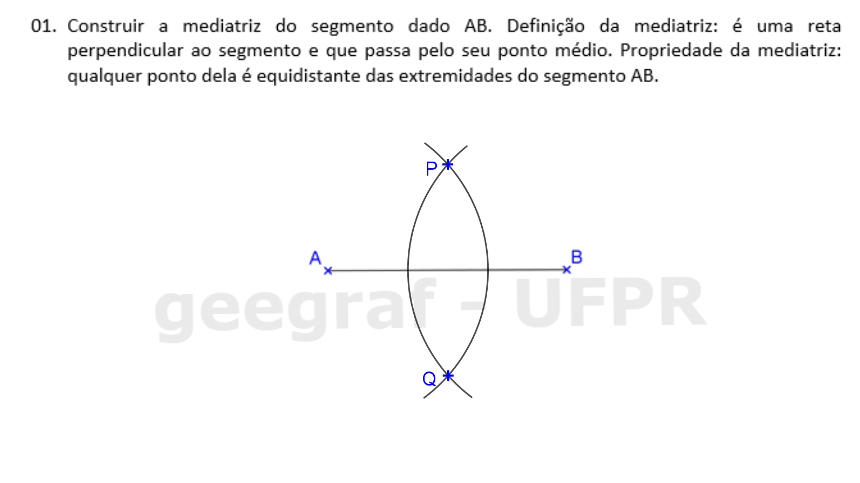
			   <figcaption>Os pontos de interseção dos arcos são <b>P</b> e <b>Q</b>.</figcaption>
		   </li>
		   <li>
			   <input type="radio" id="4" name="sl">
			   <label for="4"></label>
			   
			   <figcaption>Desenhe a reta que passa pelos pontos de interseção dos arcos.</figcaption>
		   </li>
		   <li>
			   <input type="radio" id="5" name="sl">
			   <label for="5"></label>
			   
			   <figcaption>Pronto! A mediatriz do segmento <b>AB</b> está construída. Note que a figura <b>PAQB</b> é um losango e, portanto, suas diagonais são perpendiculares e se encontram no ponto médio das mesmas.</figcaption>
		   </li>
		</ul>
		
  

  
<a href="#basico" class="topo">voltar ao topo</a>

  
  

&#x1f4cf; &#x1f4d0; Resolução com esquadros

  
Podemos utilizar a régua e um dos esquadros ou a régua e o compasso para resolver este exercício. Primeiro, veja como é a construção com a régua e o esquadro de 45&deg;.

  <ul class="slider">
      <li>
           <input type="radio" id="12" name="sl">
           <label for="12"></label>
           
           <figcaption>Alinhe um dos catetos do esquadro com a reta <b>r</b>.</figcaption>
       </li>
       <li>
           <input type="radio" id="13" name="sl">
           <label for="13"></label>
           
           <figcaption>Coloque a régua como apoio na hipotenusa do esquadro. A régua ficará fixa.</figcaption>
       </li>
       <li>
           <input type="radio" id="14" name="sl">
           <label for="14"></label>
           
           <figcaption>Deslize o esquadro até chegar na posição do ponto <b>P</b>. Lembre-se de não mover a régua.</figcaption>
       </li>
       <li>
           <input type="radio" id="15" name="sl">
           <label for="15"></label>
           
           <figcaption>Desenhe a reta que passa pelo ponto <b>P</b> com o cateto do esquadro.</figcaption>
       </li>
       <li>
           <input type="radio" id="16" name="sl">
           <label for="16"></label>
           
           <figcaption>Pronto! A reta paralela <b>s // r</b> está construída.</figcaption>
       </li>
    </ul>
    
  

  
<a href="#basico" class="topo">voltar ao topo</a>

  
  

&#x1f4cf; &#x1f4d0; Resolução com esquadros

  
 Vamos utilizar a régua e um dos esquadros para resolver este exercício. Clique nos botões do passo a passo para fazer a construção na sua apostila.

  <ul class="slider">
      <li>
           <input type="radio" id="22" name="sl">
           <label for="22"></label>
           
           <figcaption>Alinhe um dos catetos do esquadro com a reta <b>r</b>.</figcaption>
       </li>
       <li>
           <input type="radio" id="23" name="sl">
           <label for="23"></label>
           
           <figcaption>Coloque a régua como apoio na hipotenusa do esquadro. A régua ficará fixa.</figcaption>
       </li>
       <li>
           <input type="radio" id="24" name="sl">
           <label for="24"></label>
           
           <figcaption>Deslize o esquadro até o cateto vertical chegar na posição do ponto <b>P</b>. Lembre-se de não mover a régua.</figcaption>
       </li>
       <li>
           <input type="radio" id="25" name="sl">
           <label for="25"></label>
           
           <figcaption>Desenhe a reta que passa pelo ponto <b>P</b>.</figcaption>
       </li>
       <li>
           <input type="radio" id="26" name="sl">
           <label for="26"></label>
           
           <figcaption>Pronto! A reta perpendicular <b>p</b> está construída.</figcaption>
       </li>
       <li>
           <input type="radio" id="27" name="sl">
           <label for="27"></label>
           
           <figcaption>Alinhe um dos catetos do esquadro com a reta <b>r</b>.</figcaption>
       </li>
       <li>
           <input type="radio" id="28" name="sl">
           <label for="28"></label>
           
           <figcaption>Coloque a régua como apoio na hipotenusa do esquadro. A régua ficará fixa.</figcaption>
       </li>
       <li>
           <input type="radio" id="29" name="sl">
           <label for="29"></label>
           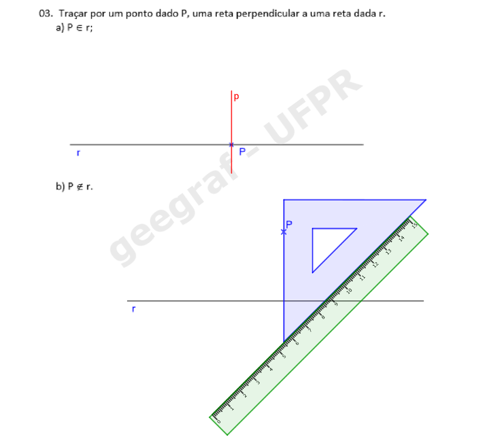
           <figcaption>Deslize o esquadro até o cateto vertical chegar na posição do ponto <b>P</b>. Lembre-se de não mover a régua.</figcaption>
       </li>
       <li>
           <input type="radio" id="30" name="sl">
           <label for="30"></label>
           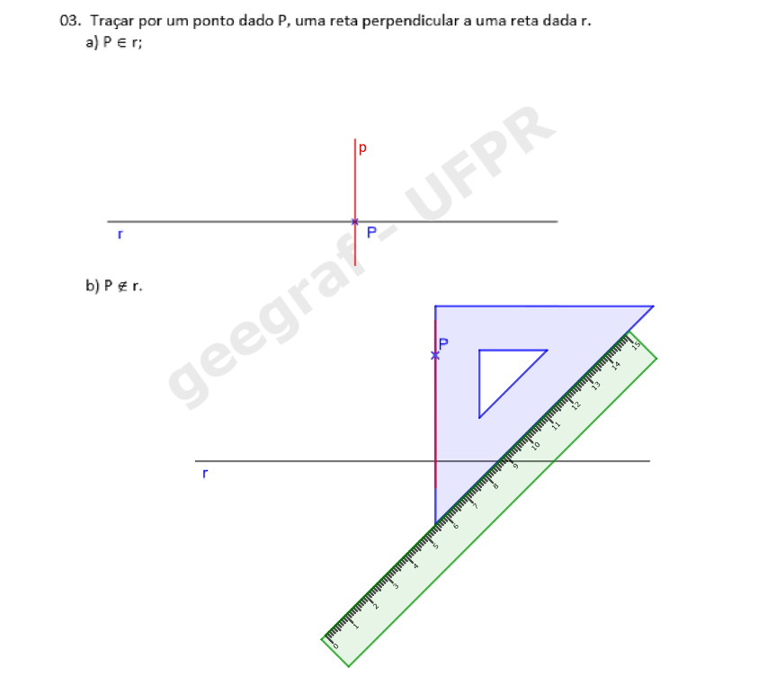
           <figcaption>Desenhe a reta que passa pelo ponto <b>P</b>.</figcaption>
       </li>
       <li>
           <input type="radio" id="31" name="sl">
           <label for="31"></label>
           
           <figcaption>Pronto! A reta perpendicular <b>p</b> está construída.</figcaption>
       </li>
    </ul>
    
  

  
<a href="#basico" class="topo">voltar ao topo</a>

  
  

&#x1f4cf; &#x1f4d0; Resolução

  
 Vamos utilizar a régua e o compasso para resolver este exercício. Clique nos botões do passo a passo para fazer a construção na sua apostila.

  <ul class="slider">
      <li>
           <input type="radio" id="40" name="sl">
           <label for="40"></label>
           
           <figcaption>Com a ponta seca no vértice <b>O</b> do ângulo desenhe um arco obtendo os pontos <b>P</b> e <b>Q</b>, cada um em um lado do ângulo.</figcaption>
       </li>
       <li>
           <input type="radio" id="41" name="sl">
           <label for="41"></label>
           
           <figcaption>Com a ponta seca no ponto <b>P</b> desenhe um arco.</figcaption>
       </li>
	   <li>
           <input type="radio" id="41a" name="sl">
           <label for="41a"></label>
           
           <figcaption>Com a ponta seca em <b>Q</b> desenhe um arco com o mesmo raio do passo anterior, obtendo o ponto <b>R</b>.</figcaption>
       </li>
       <li>
           <input type="radio" id="42" name="sl">
           <label for="42"></label>
           
           <figcaption>Desenhe a reta <b>OR</b> que é a bissetriz do ângulo dado.</figcaption>
       </li>
       <li>
           <input type="radio" id="43" name="sl">
           <label for="43"></label>
           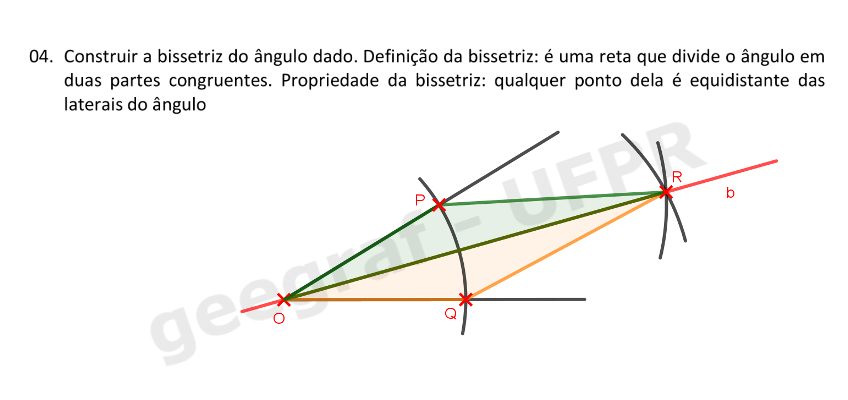
           <figcaption>Note que construímos dois triângulos: um verde e outro laranja.</figcaption>
       </li>
       <li>
           <input type="radio" id="44" name="sl">
           <label for="44"></label>
           
           <figcaption>Esses triângulos são congruentes (iguais) e por isso os ângulos <b>&alpha;</b> e <b>&beta;</b> são também congruentes.</figcaption>
       </li>
    </ul>
    
  

  
<a href="#basico" class="topo">voltar ao topo</a>

1. Simetria Axial, Arcos e Ovais

  
Material da página 1 até a página 11.

   
   

&#x1f4d1; Propriedades

	
Dados os pontos <b>A</b>, <b>B</b> e <b>C</b>, os simétricos destes pontos são obtidos da seguinte maneira:

	  <ul class="slider">
		  <li>
			   <input type="radio" id="001" name="sl" checked>
			   <label for="001"></label>
			   
			   <figcaption>Construímos as retas perpendiculares ao eixo <b>e</b> que passam pelos pontos <b>A</b>, <b>B</b> e <b>C</b>.</figcaption>
		   </li>
		   <li>
			   <input type="radio" id="002" name="sl">
			   <label for="002"></label>
			   
			   <figcaption>Depois, basta definir os homólogos <b>A'</b>, <b>B'</b> e <b>C'</b> pertencentes às respectivas perpendiculares e equidistantes ao eixo, ou seja, <b>AMA = A'MA</b>, <b>BMB = B'MB</b> e <b>CMC = C'MC</b>.</figcaption>
		   </li>
		</ul>
		
  

  
  

&#x1f4cf; &#x1f4d0; Resolução

	
Em um triângulo, a bissetriz de um ângulo serve como eixo de simetria para os pontos dos lados adjacentes a este ângulo.

	  <ul class="slider">
		  <li>
			   <input type="radio" id="003" name="sl" checked>
			   <label for="003"></label>
			   
			   <figcaption>A reta <b>r</b> é um eixo de simetria dos pontos <b>P</b> e <b>P'</b>. Logo, podemos construir uma reta perpendicular a <b>r</b> que passa por <b>P</b>.</figcaption>
		   </li>
		   <li>
			   <input type="radio" id="004" name="sl">
			   <label for="004"></label>
			   
			   <figcaption>Alinhando um catedo do esquadro de 45&deg; com a reta <b>r</b> e deixando o outro esquadro ou a régua como apoio na hipotenusa, podemos deslizar o esquadro de 45&deg; para construir com o outro cateto a reta perpendicular a <b>r</b>.</figcaption>
		   </li>
		   <li>
			   <input type="radio" id="005" name="sl">
			   <label for="005"></label>
			   
			   <figcaption>Depois, basta construir com o compasso os segmentos congruentes das distâncias de <b>P</b>...</figcaption>
		   </li>
		   <li>
			   <input type="radio" id="006" name="sl">
			   <label for="006"></label>
			   
			   <figcaption>... e de <b>P'</b> à reta <b>r</b>.</figcaption>
		   </li>
		   <li>
			   <input type="radio" id="007" name="sl">
			   <label for="007"></label>
			   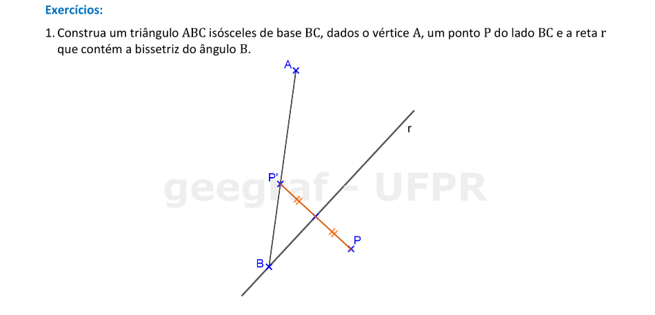
			   <figcaption>Unindo os pontos <b>A</b> e <b>P'</b>, encontramos <b>B</b> na interseção com a reta <b>r</b>.</figcaption>
		   </li>
		   <li>
			   <input type="radio" id="008" name="sl">
			   <label for="008"></label>
			   
			   <figcaption>Como o triângulo isósceles tem base <b>BC</b>, temos que <b>AB = AC</b>. Usando o compasso com a ponta seca em <b>A</b> e raio <b>AB</b>...</figcaption>
		   </li>
		   <li>
			   <input type="radio" id="009" name="sl">
			   <label for="009"></label>
			   
			   <figcaption>... encontramos o vértice <b>C</b> na reta suporte <b>BP</b>.</figcaption>
		   </li>
		</ul>
		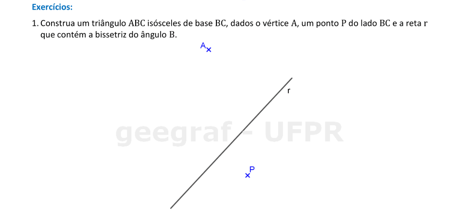
  

   
<a href="#modulo1" class="topo">voltar ao topo</a>

   
   

&#x1f4cf; &#x1f4d0; Resolução

	
Em um triângulo, a bissetriz de um ângulo serve como eixo de simetria para os pontos dos lados adjacentes a este ângulo.

	  <ul class="slider">
		  <li>
			   <input type="radio" id="010" name="sl" checked>
			   <label for="010"></label>
			   
			   <figcaption>A reta <b>s</b> é um eixo de simetria dos pontos <b>P</b> e <b>P'</b> que pertencem aos lados <b>AB</b> e <b>AC</b>.</figcaption>
		   </li>
		   <li>
			   <input type="radio" id="011" name="sl">
			   <label for="011"></label>
			   
			   <figcaption>A reta <b>s</b> é também um eixo de simetria dos pontos <b>Q</b> e <b>Q'</b> que pertencem aos lados <b>AC</b> e <b>AB</b>.</figcaption>
		   </li>
		   <li>
			   <input type="radio" id="012" name="sl">
			   <label for="012"></label>
			   
			   <figcaption>Determinando as retas <b>PQ'</b> e <b>P'Q</b>, encontramos os vértices do triângulo nas retas <b>r</b> e <b>s</b>.</figcaption>
		   </li>
		</ul>
		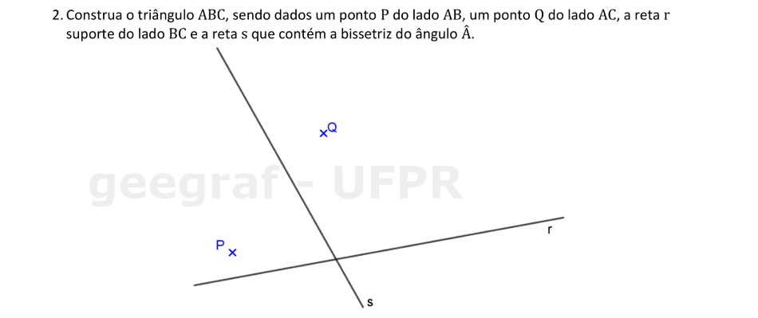
  

   
   

&#x1f4cf; &#x1f4d0; Resolução

	
Em um triângulo, a bissetriz de um ângulo serve como eixo de simetria para os pontos dos lados adjacentes a este ângulo.

	  <ul class="slider">
		  <li>
			   <input type="radio" id="013" name="sl" checked>
			   <label for="013"></label>
			   
			   <figcaption>A reta <b>r</b> é um eixo de simetria dos pontos <b>P</b> e <b>P'</b> que pertencem aos lados <b>AB</b> e <b>BC</b>. Se construirmos um arco de circunferência com centro em um ponto <b>B1</b> sobre <b>r</b>, que passe por <b>P</b>...</figcaption>
		   </li>
		   <li>
			   <input type="radio" id="014" name="sl">
			   <label for="014"></label>
			   
			   <figcaption>... e outro arco com centro em um ponto <b>B2</b> sobre <b>r</b>, que passe por <b>P</b>, encontramos <b>P'</b> simétrico de <b>P</b> em relação a <b>r</b> (pois os triângulos <b>&#9651;PB1B2</b> e <b>&#9651;P'B1B2</b> são congruentes).</figcaption>
		   </li>
		   <li>
			   <input type="radio" id="015" name="sl">
			   <label for="015"></label>
			   
			   <figcaption>Construindo da mesma forma, o arco de circunferência com centro em um ponto qualquer <b>A1</b> de <b>s</b> e raio <b>QA1</b>...</figcaption>
		   </li>
		   <li>
			   <input type="radio" id="016" name="sl" checked>
			   <label for="016"></label>
			   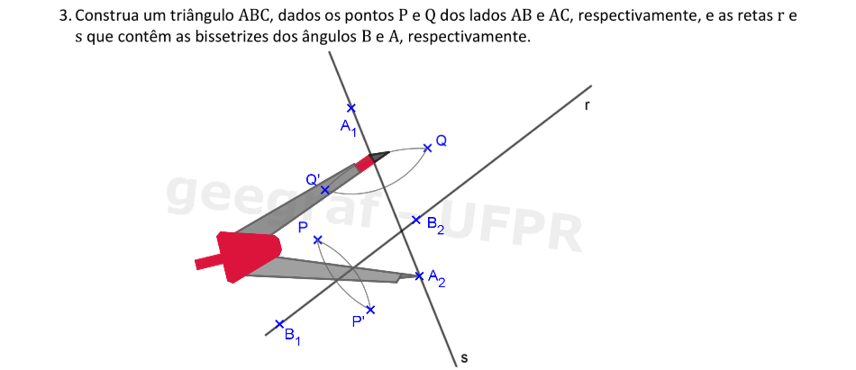
			   <figcaption>... e o arco de centro em <b>A2</b> de <b>s</b> com raio <b>QA2</b> encontramos o simétrico de <b>Q</b> em relação a <b>s</b>.</figcaption>
		   </li>
		   <li>
			   <input type="radio" id="017" name="sl">
			   <label for="017"></label>
			   
			   <figcaption>A reta <b>PQ'</b> determina os vértices <b>A</b> e <b>B</b> nas retas <b>r</b> e <b>s</b>.</figcaption>
		   </li>
		   <li>
			   <input type="radio" id="018" name="sl">
			   <label for="018"></label>
			   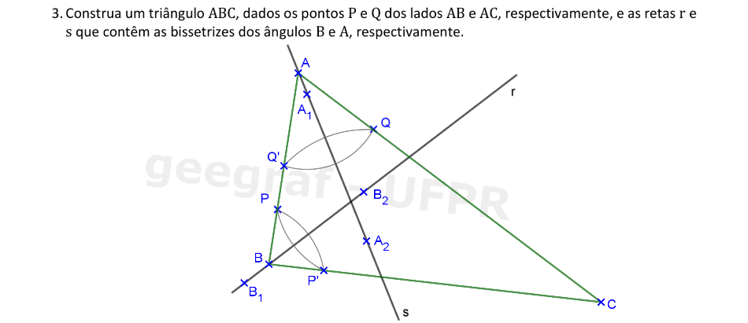
			   <figcaption>As retas <b>AQ</b> e <b>BP'</b> determinam o vértice <b>C</b>.</figcaption>
		   </li>
		</ul>
		
  

   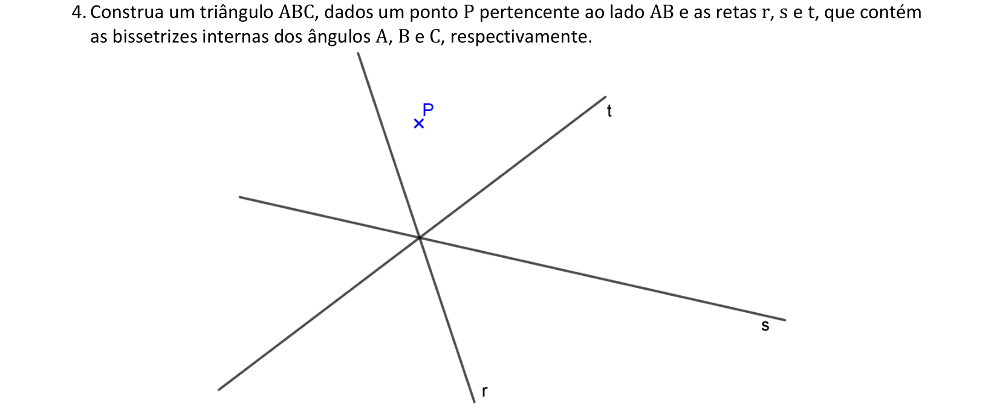
   
&#x1f4cf; &#x1f4d0; Exercício proposto 1.1

   
<a href="#modulo1" class="topo">voltar ao topo</a>

   
   

&#x1f4cf; &#x1f4d0; Resolução

	
Em um triângulo isósceles, a mediatriz da base serve como eixo de simetria para os pontos das laterais deste triângulo.

	  <ul class="slider">
		  <li>
			   <input type="radio" id="019" name="sl" checked>
			   <label for="019"></label>
			   
			   <figcaption>A reta <b>r</b> é um eixo de simetria dos pontos <b>P</b> e <b>P'</b> que pertencem aos lados <b>AB</b> e <b>AC</b>. Construa o simétrico de <b>P</b> em relação à reta <b>r</b>.</figcaption>
		   </li>
		   <li>
			   <input type="radio" id="020" name="sl">
			   <label for="020"></label>
			   
			   <figcaption>A reta <b>r</b> é também um eixo de simetria dos pontos <b>Q</b> e <b>Q'</b> que pertencem aos lados <b>AC</b> e <b>AB</b>. Construa o simétrico de <b>Q</b> em relação à reta <b>r</b>.</figcaption>
		   </li>
		   <li>
			   <input type="radio" id="021" name="sl">
			   <label for="021"></label>
			   
			   <figcaption>Vamos encontrar a metade da medida da base construindo a mediatriz de <b>BC</b>.</figcaption>
		   </li>
		   <li>
			   <input type="radio" id="022" name="sl" checked>
			   <label for="022"></label>
			   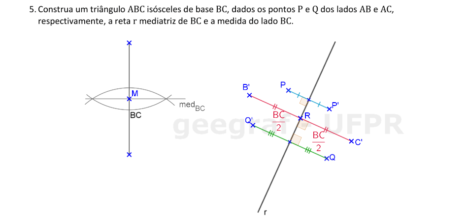
			   <figcaption>Escolhendo um ponto qualquer <b>R</b> da reta <b>r</b>, construa os segmentos <b>RB'</b> e <b>RC'</b> perpendiculares a <b>r</b> com medidas iguais a $\mathsf{BC \over 2}$.</figcaption>
		   </li>
		   <li>
			   <input type="radio" id="023" name="sl">
			   <label for="023"></label>
			   
			   <figcaption>Os pontos <b>B</b> e <b>C</b> pertencem às retas <b>AQ'</b> e <b>AP'</b>.</figcaption>
		   </li>
		   <li>
			   <input type="radio" id="024" name="sl">
			   <label for="024"></label>
			   
			   <figcaption>Outro lugar geométrico dos pontos <b>B</b> e <b>C</b> é o par de retas paralelas à reta <b>r</b> que passam por <b>B'</b> e <b>C'</b>.</figcaption>
		   </li>
		</ul>
		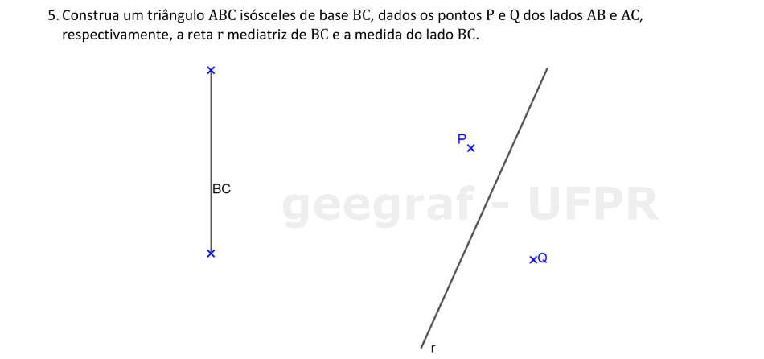
  

   
   

&#x1f4cf; &#x1f4d0; Resolução

	
Neste problema, vamos usar o conceito da menor distância entre dois pontos de um plano.

	  <ul class="slider">
		  <li>
			   <input type="radio" id="025" name="sl" checked>
			   <label for="025"></label>
			   
			   <figcaption>Quando <b>A</b> e <b>B</b> estão em semi-planos opostos em relação à reta <b>r</b>, basta encontrar a menor distância entre <b>A</b> e <b>B</b> definida pelo segmento de reta <b>AB</b>.</figcaption>
		   </li>
		   <li>
			   <input type="radio" id="026" name="sl">
			   <label for="026"></label>
			   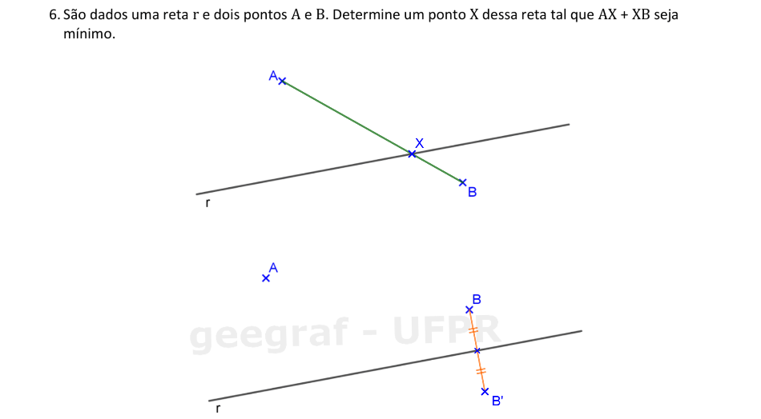
			   <figcaption>Usando o conceito anterior, se construirmos o simétrico de um dos pontos (<b>B</b>) em relação à reta <b>r</b>, a menor distância entre o outro ponto (<b>A</b>) e o simétrico encontrado (<b>B'</b>) será o segmento de reta (<b>AB'</b>).</figcaption>
		   </li>
		   <li>
			   <input type="radio" id="027" name="sl">
			   <label for="027"></label>
			   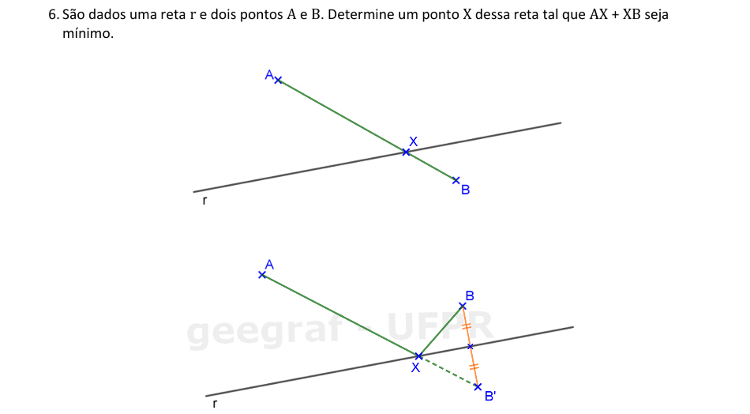
			   <figcaption>Logo, temos que <b>BX = B'X</b>, e a trajetória mínima será <b>AX + XB</b>.</figcaption>
		   </li>
		</ul>
		
  

   
<a href="#modulo1" class="topo">voltar ao topo</a>

   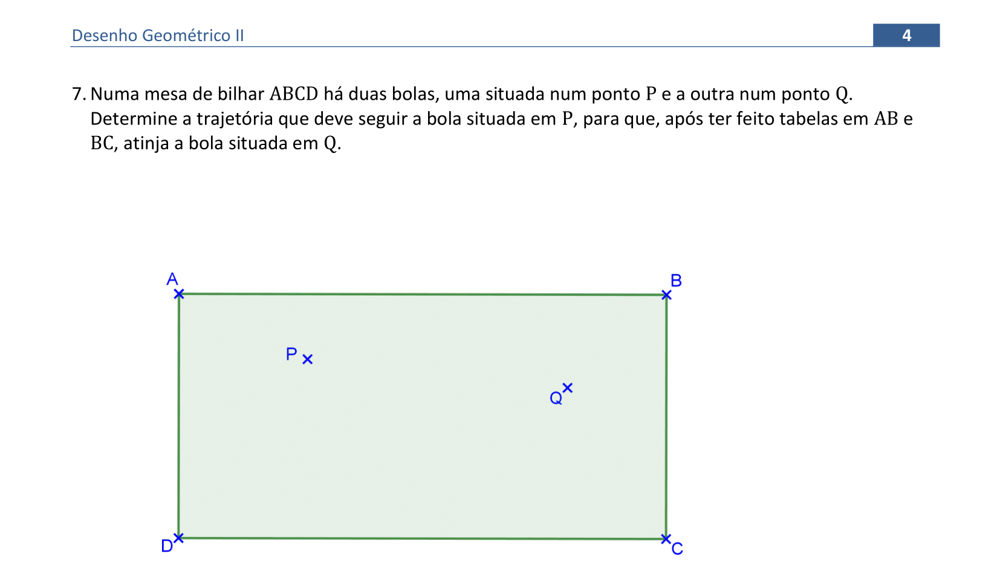
   

&#x1f4cf; &#x1f4d0; Resolução

	
Neste problema, vamos usar o conceito dos ângulos de incidência e reflexão nas tabelas da mesa de bilhar.

	  <ul class="slider">
		  <li>
			   <input type="radio" id="028" name="sl" checked>
			   <label for="028"></label>
			   
			   <figcaption>Se construirmos o simétrico de <b>Q</b> em relação à ultima tabela <b>BC</b>, teremos o ângulo de incidência igual ao ângulo de reflexão nesta tabela.</figcaption>
		   </li>
		   <li>
			   <input type="radio" id="029" name="sl">
			   <label for="029"></label>
			   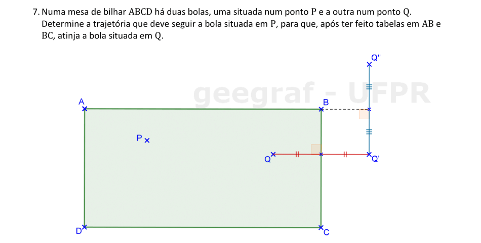
			   <figcaption>Usando o mesmo raciocínio, se construirmos o simétrico de <b>Q'</b> em relação à primeira tabela <b>AB</b>, teremos o ângulo de incidência igual ao ângulo de reflexão nesta tabela.</figcaption>
		   </li>
		   <li>
			   <input type="radio" id="030" name="sl">
			   <label for="030"></label>
			   
			   <figcaption>Unindo os pontos <b>P</b> e <b>Q''</b>, temos o ponto <b>X1</b> da trajetória que a bola fará ao sair da posição <b>P</b> com tabela <b>AB</b>.</figcaption>
		   </li>
		   <li>
			   <input type="radio" id="031" name="sl">
			   <label for="031"></label>
			   
			   <figcaption>Unindo os pontos <b>X1</b> com <b>Q'</b> temos o ponto <b>X2</b> da trajetória que a bola fará ao sair da posição <b>X1</b> com tabela <b>BC</b>. Como o ângulo de incidência é igual ao ângulo de reflexão de cada tabela, a bola que estava na posição <b>P</b> atinge a bola que está na posição <b>Q</b> depois de fazer as tabelas <b>AB</b> e <b>BC</b> solicitadas.</figcaption>
		   </li>
		</ul>
		
  

   
   
&#x1f4cf; &#x1f4d0; Exercício proposto 1.2

   
<a href="#modulo1" class="topo">voltar ao topo</a>

   
   

&#x1f4cf; &#x1f4d0; Solução

	
Usando o conceito de distância mínima entre dois pontos, podemos encontrar os simétricos dos vértices <b>A</b> e <b>B</b> em relação aos lados do ângulo.

	
	<figcaption>Desta forma, temos que as distâncias <b>BD</b> e <b>AC</b> são mínimas. Logo, o quadrilátero <b>ABCD</b> tem perímetro mínimo.</figcaption>
  

   
   

&#x1f4cf; &#x1f4d0; Solução

	
Usando o conceito de distância mínima entre dois pontos, podemos encontrar os simétricos do vértice <b>A</b> em relação aos lados do ângulo.

	
	<figcaption>Desta forma, temos que as distâncias <b>AB</b> e <b>AC</b> são mínimas. Logo, o triângulo <b>ABC</b> tem perímetro mínimo.</figcaption>
  

   
   

&#x1f4cf; &#x1f4d0; Solução

	
Usando o conceito de ângulos de incidência e reflexão, podemos encontrar os simétricos do foco <b>F</b> e do objeto <b>O</b> em relação aos espelhos planos <b>r</b> e <b>s</b>.

	
	<figcaption>Desta forma, temos que a trajetória da fonte de luz saindo de <b>F</b>, atingindo o espelho <b>r</b> em <b>X2</b>, depois atingindo o espelho <b>s</b> em <b>X1</b> para finalmente atingir o objeto em <b>O</b>.</figcaption>
  

   
<a href="#modulo1" class="topo">voltar ao topo</a>

   
   

&#x1f4d1; Propriedades

	
Considere o arco de ferradura mostrado nesta página. Vamos analisar quais são os elementos de um arco arquitetônico.

	  <ul class="slider">
		  <li>
			   <input type="radio" id="032" name="sl" checked>
			   <label for="032"></label>
			   
			   <figcaption>Os pontos <b>A</b> e <b>B</b> definem o começo do arco e são chamados de pontos de nascença.</figcaption>
		   </li>
		   <li>
			   <input type="radio" id="033" name="sl">
			   <label for="033"></label>
			   
			   <figcaption>A distância entre os pontos de nascença <b>AB</b> é chamada de vão ou abertura do arco. O segmento <b>AB</b> pode ser considerado também como a base do arco.</figcaption>
		   </li>
		   <li>
			   <input type="radio" id="034" name="sl">
			   <label for="034"></label>
			   
			   <figcaption>A distância entre o ponto mais alto do arco e a base é chamada de flecha do arco.</figcaption>
		   </li>
		   <li>
			   <input type="radio" id="035" name="sl">
			   <label for="035"></label>
			   
			   <figcaption>As semi-retas perpendiculares ao vão, que geralmente passam pelas extremidades deste segmento, são chamadas de suportes do arco. São as semi-retas que sustentam o arco arquitetônico.</figcaption>
		   </li>
		</ul>
		
  

   
   

&#x1f4cf; &#x1f4d0; Resolução: 1&ordf; parte

	
O arco pleno tem o centro na metade do vão.

	  <ul class="slider">
		  <li>
			   <input type="radio" id="036" name="sl" checked>
			   <label for="036"></label>
			   
			   <figcaption>Vamos construir a mediatriz do vão <b>AB</b>. Usando um arco de abertura maior do que a metade do vão, com centro em <b>A</b>...</figcaption>
		   </li>
		   <li>
			   <input type="radio" id="037" name="sl">
			   <label for="037"></label>
			   
			   <figcaption>... e outro arco de mesmo raio com centro em <b>B</b>...</figcaption>
		   </li>
		   <li>
			   <input type="radio" id="038" name="sl">
			   <label for="038"></label>
			   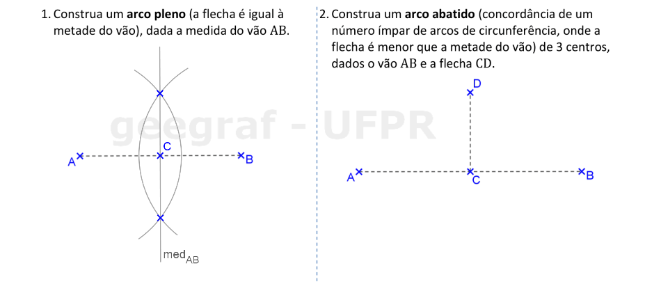
			   <figcaption>... definimos a <b>medAB</b> e o centro <b>C</b> do arco pleno.</figcaption>
		   </li>
		   <li>
			   <input type="radio" id="039" name="sl">
			   <label for="039"></label>
			   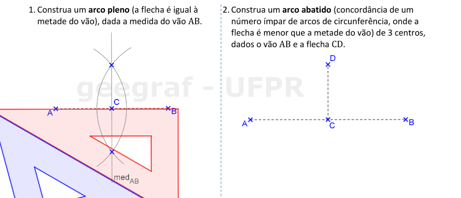
			   <figcaption>Alinhando um cateto de um dos esquadros com o vão e apoiando a hipotenusa com outro esquadro ou com a régua, podemos deslizar o esquadro alinhado...</figcaption>
		   </li>
		   <li>
			   <input type="radio" id="040" name="sl">
			   <label for="040"></label>
			   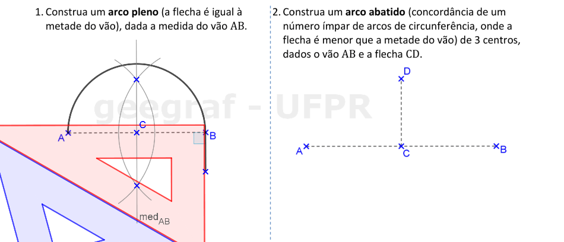
			   <figcaption>... até passar pela extremidade <b>B</b> do vão, definindo um dos suportes. Construindo o arco de centro em <b>C</b> e raio <b>CA = CB</b>, temos o arco pleno...</figcaption>
		   </li>
		   <li>
			   <input type="radio" id="041" name="sl">
			   <label for="041"></label>
			   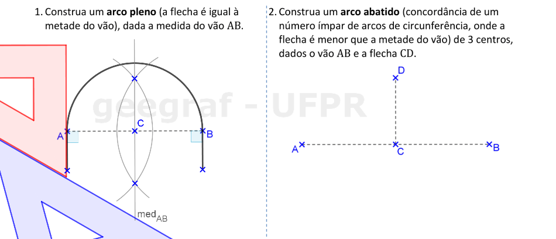
			   <figcaption>.. e deslizando o esquadro até passar pela extremidade <b>A</b> do vão, encontramos o outro suporte do arco.</figcaption>
		   </li>
		   <li>
			   <input type="radio" id="042" name="sl">
			   <label for="042"></label>
			   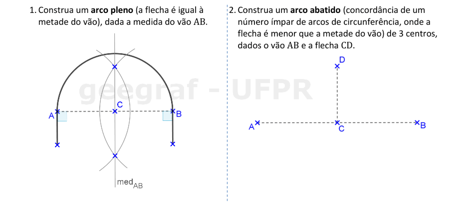
			   <figcaption>Este é o arco pleno, um dos mais simples de construir.</figcaption>
		   </li>
		</ul>
		
  

  

&#x1f4cf; &#x1f4d0; Resolução: 2&ordf; parte

	
Agora vamos construir o arco abatido, com o uso de 3 centros. A flecha está definida pelo segmento <b>CD</b>, que contém o ponto mais alto deste arco.

	  <ul class="slider">
		  <li>
			   <input type="radio" id="043" name="sl" checked>
			   <label for="043"></label>
			   
			   <figcaption>Com o compasso, vamos usar a medida da flecha <b>CD</b>.</figcaption>
		   </li>
		   <li>
			   <input type="radio" id="044" name="sl">
			   <label for="044"></label>
			   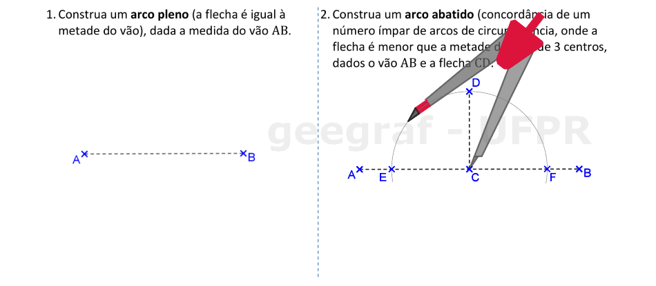
			   <figcaption>Construa a semi-circunferência com centro em <b>C</b> e raio igual à flecha <b>CD</b>, determinando no vão os pontos <b>E</b> e <b>F</b>.</figcaption>
		   </li>
		   <li>
			   <input type="radio" id="046" name="sl">
			   <label for="046"></label>
			   
			   <figcaption>Com o compasso, construa os segmentos <b>DG = AE = BF</b> e <b>DH = AE = BF</b> nos segmentos <b>AD</b> e <b>BD</b>.</figcaption>
		   </li>
		   <li>
			   <input type="radio" id="048" name="sl">
			   <label for="048"></label>
			   
			   <figcaption>Encontre as mediatrizes dos segmentos <b>AG</b> e <b>BH</b> e o ponto de interseção <b>I</b> destas mediatrizes: este é um dos centros do arco abatido.</figcaption>
		   </li>
		   <li>
			   <input type="radio" id="049" name="sl">
			   <label for="049"></label>
			   
			   <figcaption>Com centro em <b>I</b> e raio <b>ID</b> a primeira parte do arco que começa na mediatriz de <b>AG</b> e termina na mediatriz de <b>BH</b>.</figcaption>
		   </li>
		   <li>
			   <input type="radio" id="050" name="sl">
			   <label for="050"></label>
			   
			   <figcaption>Os outros centros são <b>K</b> e <b>J</b>: as outras partes do arco abatido têm raios <b>AJ</b> e <b>BK</b>. Para finalizar o arco, alinhamos um dos esquadros para construir as semi-retas perpendiculares ao vão <b>AB</b>...</figcaption>
		   </li>
		   <li>
			   <input type="radio" id="051" name="sl">
			   <label for="051"></label>
			   
			   <figcaption>... que passam por <b>B</b>...</figcaption>
		   </li>
		   <li>
			   <input type="radio" id="052" name="sl">
			   <label for="052"></label>
			   
			   <figcaption>... e pelo ponto <b>A</b>.</figcaption>
		   </li>
		   <li>
			   <input type="radio" id="053" name="sl">
			   <label for="053"></label>
			   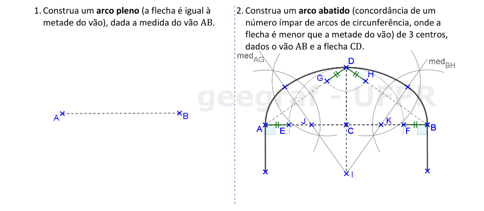
			   <figcaption>Este é um arco abatido com 3 centros: <b>I</b>, <b>J</b> e <b>K</b>.</figcaption>
		   </li>
		</ul>
		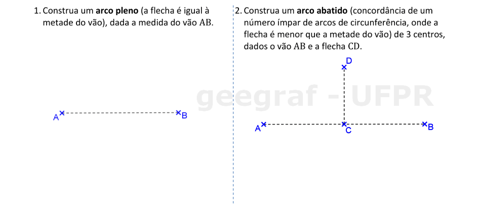
  

   
   
&#x1f4cf; &#x1f4d0; Exercício proposto 1.3

   
<a href="#modulo1" class="topo">voltar ao topo</a>

   
   

&#x1f4cf; &#x1f4d0; Solução

	
Quando a medida da flecha não for considerada, podemos definir a mediatriz do vão <b>AB</b> como eixo de simetria e escolher um centro <b>E</b> qualquer da mediatriz.

	
	<figcaption>Definindo o centro <b>D</b> qualquer sobre o vão, temos o terceiro centro <b>D'</b> simétrico de <b>D</b> em relação à mediatriz. As retas <b>ED</b> e <b>ED'</b> são usadas como limites para os três arcos que formam o arco abatido.</figcaption>
  

  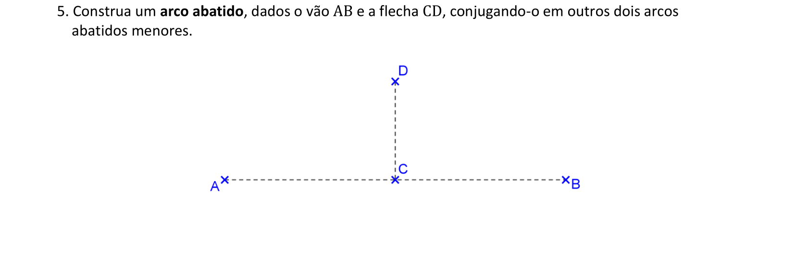
   

&#x1f4cf; &#x1f4d0; Resolução

	
Vamos começar construindo os centros do arco maior com um retângulo de lados iguais ao vão <b>AB</b> e a flecha <b>CD</b>.

	  <ul class="slider">
		  <li>
			   <input type="radio" id="054" name="sl" checked>
			   <label for="054"></label>
			   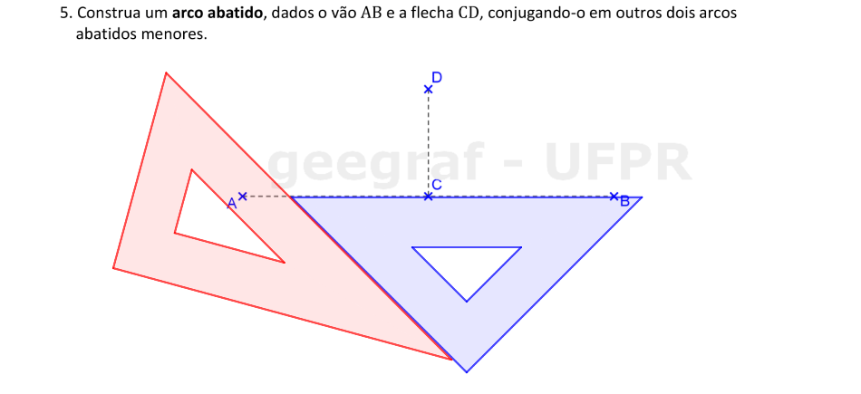
			   <figcaption>Alinhe a hipotenusa de um dos esquadros com o vão <b>AB</b>, deixando um cateto apoiado com o outro esquadro ou com a régua.</figcaption>
		   </li>
		   <li>
			   <input type="radio" id="055" name="sl">
			   <label for="055"></label>
			   
			   <figcaption>Deslize o esquadro alinhado, construindo a reta paralela ao vão que passa por <b>D</b>.</figcaption>
		   </li>
		   <li>
			   <input type="radio" id="056" name="sl">
			   <label for="056"></label>
			   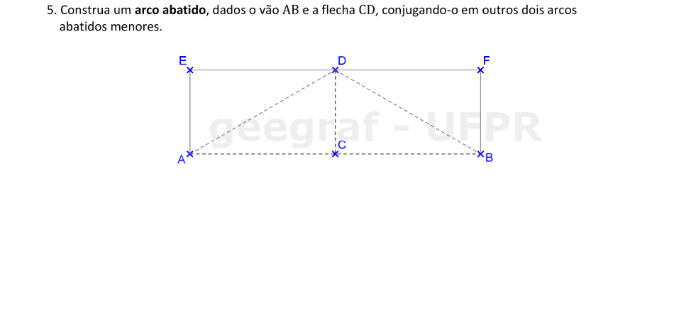
			   <figcaption>Construa da mesma forma as paralelas à flecha <b>CD</b> que passam pelas extremidades do vão <b>A</b> e <b>B</b>. Temos o retângulo <b>AEFB</b>.</figcaption>
		   </li>
		   <li>
			   <input type="radio" id="058" name="sl">
			   <label for="058"></label>
			   
			   <figcaption>Construa as bissetrizes dos ângulos <b>DÂE</b> e <b>ADE</b>, definindo o incentro <b>G</b> do <b>&#9651;ADE</b>.</figcaption>
		   </li>
		   <li>
			   <input type="radio" id="059" name="sl">
			   <label for="059"></label>
			   
			   <figcaption>A reta <b>HG &perp; AD</b> define os centros <b>I</b> e <b>H</b> do arco abatido maior.</figcaption>
		   </li>
		   <li>
			   <input type="radio" id="060" name="sl">
			   <label for="060"></label>
			   
			   <figcaption>Construa os segmentos sobre o vão do arco: <b>CJ = AI = CK = BL</b>. Note que os pontos <b>I</b> e <b>L</b> são simétricos em relação à flecha <b>CD</b>. O mesmo acontece com os pontos <b>J</b> e <b>K</b>.</figcaption>
		   </li>
		   <li>
			   <input type="radio" id="061" name="sl">
			   <label for="061"></label>
			   
			   <figcaption>Os centros <b>I</b> e <b>L</b> definem as duas partes simétricas do arco maior até as retas <b>HG</b> e <b>HL</b>.</figcaption>
		   </li>
		   <li>
			   <input type="radio" id="062" name="sl">
			   <label for="062"></label>
			   
			   <figcaption>A parte mais alta do arco maior tem centro em <b>H</b> e raio <b>HD</b>.</figcaption>
		   </li>
		   <li>
			   <input type="radio" id="063" name="sl">
			   <label for="063"></label>
			   
			   <figcaption>A reta <b>GM</b> serve como limite dos arcos menores. Logo, podemos construir os arcos com centros em <b>J</b> e <b>K</b> e raios iguais a <b>CJ</b> até intersectar a reta <b>GM</b>.</figcaption>
		   </li>
		   <li>
			   <input type="radio" id="064" name="sl">
			   <label for="064"></label>
			   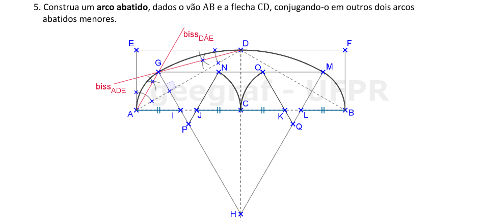
			   <figcaption>Agora precisamos encontrar os centros dos arcos abatidos menores. As retas <b>NJ</b> e <b>OK</b> intersectam as retas <b>HG</b> e <b>HL</b> nos centros <b>P</b> e <b>Q</b>.</figcaption>
		   </li>
		   <li>
			   <input type="radio" id="065" name="sl">
			   <label for="065"></label>
			   
			   <figcaption>Construindo os arcos de centros <b>P</b> e <b>Q</b> e os suportes, temos o arco abatido conjugado em dois arcos abatidos menores.</figcaption>
		   </li>
		</ul>
		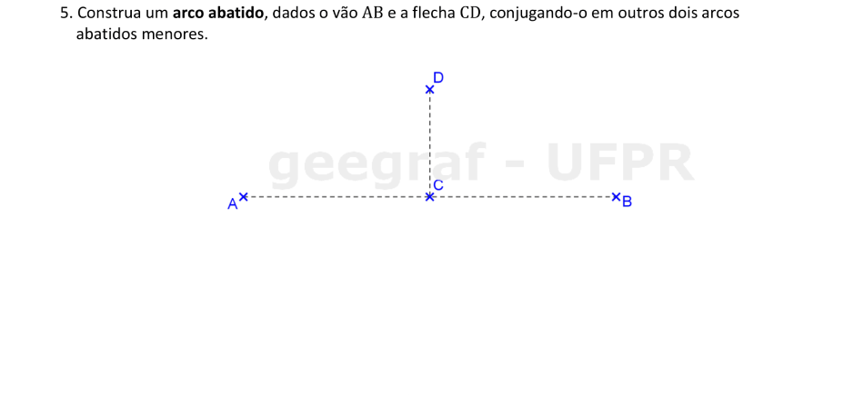
  

  
   
   

&#x1f4cf; &#x1f4d0; Resolução

	
Vamos construir o arco ogival de duas formas: considerando a flecha com tamanho fixo e com a flecha dependente da medida do vão <b>AB</b>.

	  <ul class="slider">
		  <li>
			   <input type="radio" id="066" name="sl" checked>
			   <label for="066"></label>
			   
			   <figcaption>Neste primeiro caso, vamos considerar a flecha com a medida que depende da medida do vão <b>AB</b>. Construa o arco de circunferência com a medida do raio igual a <b>AB</b>.</figcaption>
		   </li>
		   <li>
			   <input type="radio" id="067" name="sl">
			   <label for="067"></label>
			   
			   <figcaption>Fazendo o mesmo no ponto <b>B</b>, temos um arco ogival.</figcaption>
		   </li>
		   <li>
			   <input type="radio" id="068" name="sl">
			   <label for="068"></label>
			   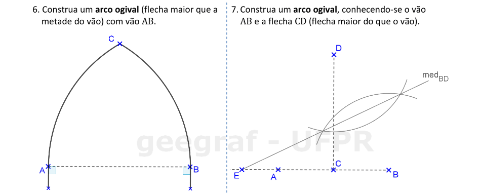
			   <figcaption>Considerando a medida fixa da flecha <b>CD</b>, vamos encontrar o centro do arco que passa por <b>B</b> e <b>D</b> usando a mediatriz de <b>BD</b>. O ponto <b>E</b> pertencente ao prolongamento do vão é o centro do primeiro arco.</figcaption>
		   </li>
		   <li>
			   <input type="radio" id="069" name="sl">
			   <label for="069"></label>
			   
			   <figcaption>O ponto <b>F</b>, centro do segundo arco, está na interseção da mediatriz de <b>AD</b> com o prolongamento do vão <b>AB</b>.</figcaption>
		   </li>
		   <li>
			   <input type="radio" id="070" name="sl">
			   <label for="070"></label>
			   
			   <figcaption>Construa o primeiro arco, com centro em <b>E</b> e raio com medida <b>EB</b>.</figcaption>
		   </li>
		   <li>
			   <input type="radio" id="071" name="sl">
			   <label for="071"></label>
			   
			   <figcaption>O segundo arco tem centro <b>F</b> e raio com medida <b>AF</b>.</figcaption>
		   </li>
		</ul>
		
  

  
   
<a href="#modulo1" class="topo">voltar ao topo</a>

   
   

&#x1f4cf; &#x1f4d0; Resolução

	
Vamos construir um arco ogival com a flecha com tamanho menor do que o vão e um arco gótico.

	  <ul class="slider">
		  <li>
			   <input type="radio" id="072" name="sl" checked>
			   <label for="072"></label>
			   
			   <figcaption>A construção fica parecida com o exercício anterior, porém, os centros <b>E</b> e <b>F</b> ficam entre as extremidades do vão.</figcaption>
		   </li>
		   <li>
			   <input type="radio" id="073" name="sl">
			   <label for="073"></label>
			   
			   <figcaption>Para construir o arco gótico, começamos com  a mediatriz do vão <b>AB</b>.</figcaption>
		   </li>
		   <li>
			   <input type="radio" id="074" name="sl">
			   <label for="074"></label>
			   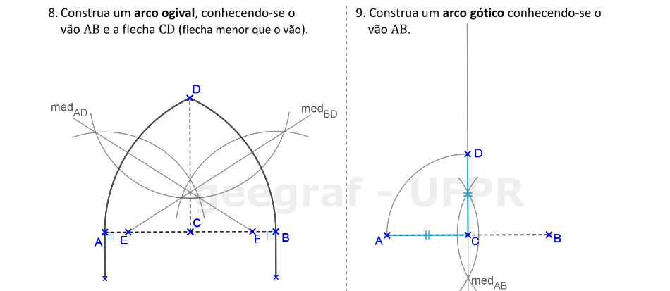
			   <figcaption>A metade do vão é usada para encontrar <b>CD</b> na mediatriz de <b>AB</b>.</figcaption>
		   </li>
		   <li>
			   <input type="radio" id="075" name="sl">
			   <label for="075"></label>
			   
			   <figcaption>Uma parte do arco gótico tem centro em <b>A</b>, raio <b>AB</b>, começando em <b>B</b> até o prolongamento da semi-reta <b>AD</b>.</figcaption>
		   </li>
		   <li>
			   <input type="radio" id="076" name="sl">
			   <label for="076"></label>
			   
			   <figcaption>O arco simétrico, com centro em <b>B</b> e raio com medida <b>AB</b> começa em <b>A</b> e vai até o prolongamento de <b>BD</b>.</figcaption>
		   </li>
		   <li>
			   <input type="radio" id="077" name="sl">
			   <label for="077"></label>
			   
			   <figcaption>Determine os segmentos <b>EG = AD</b> no prolongamento de <b>AD</b>...</figcaption>
		   </li>
		   <li>
			   <input type="radio" id="078" name="sl">
			   <label for="078"></label>
			   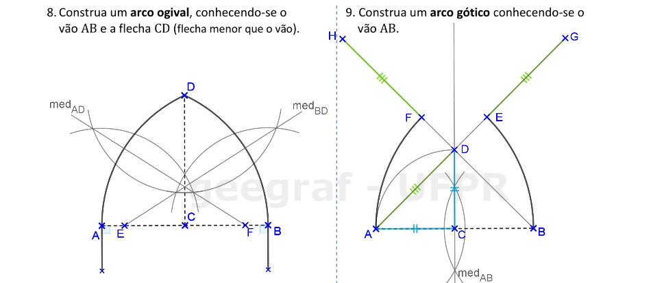
			   <figcaption>... e <b>HF = AD</b> no prolongamento de <b>BF</b>.</figcaption>
		   </li>
		   <li>
			   <input type="radio" id="079" name="sl">
			   <label for="079"></label>
			   
			   <figcaption>Os arcos com centros em <b>H</b> e <b>G</b> e raios iguais a <b>EG = HF</b> determinam o ponto mais alto do arco gótico.</figcaption>
		   </li>
		</ul>
		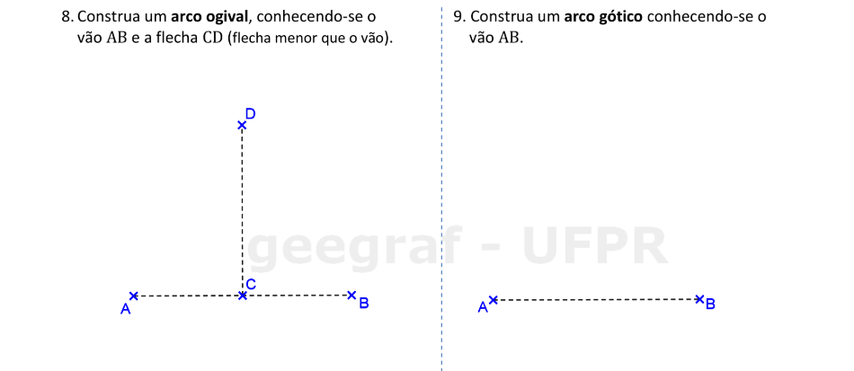
  

 
   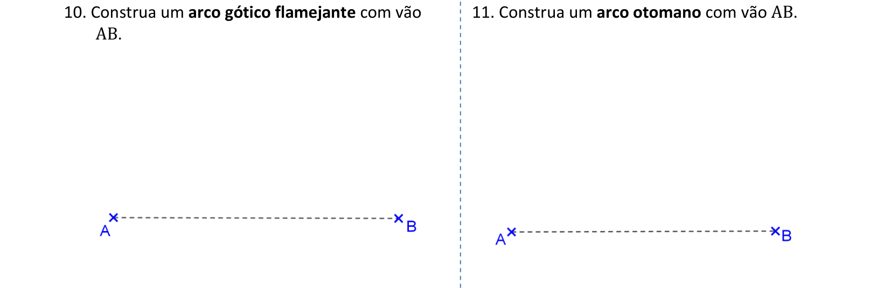
   

&#x1f4cf; &#x1f4d0; Resolução

	
Vamos construir os arcos gótico flamejante e otomano.

	  <ul class="slider">
		  <li>
			   <input type="radio" id="080" name="sl" checked>
			   <label for="080"></label>
			   
			   <figcaption>No arco gótico flamejante, começamos dividindo o vão <b>AB</b> em 4 partes iguais usando o teorema de Tales.</figcaption>
		   </li>
		   <li>
			   <input type="radio" id="081" name="sl">
			   <label for="081"></label>
			   
			   <figcaption>Encontre os pontos <b>C</b> e <b>D</b> correspondentes a $\mathsf{ {1 \over 4}}$ e $\mathsf{ {3 \over 4}}$ do vão.</figcaption>
		   </li>
		   <li>
			   <input type="radio" id="082" name="sl">
			   <label for="082"></label>
			   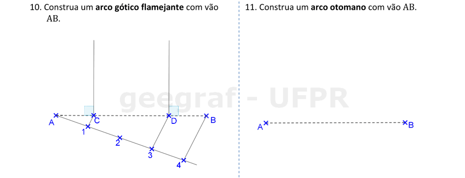
			   <figcaption>Construa as semi-retas perpendiculares ao vão que passam por <b>C</b> e <b>D</b>.</figcaption>
		   </li>
		   <li>
			   <input type="radio" id="083" name="sl">
			   <label for="083"></label>
			   
			   <figcaption>Uma parte do arco gótico flamejante tem centro em <b>C</b>, raio <b>AC</b> e amplitude de 90&deg;. O arco simétrico tem centro em <b>D</b> e raio <b>BD</b>.</figcaption>
		   </li>
		   <li>
			   <input type="radio" id="084" name="sl">
			   <label for="084"></label>
			   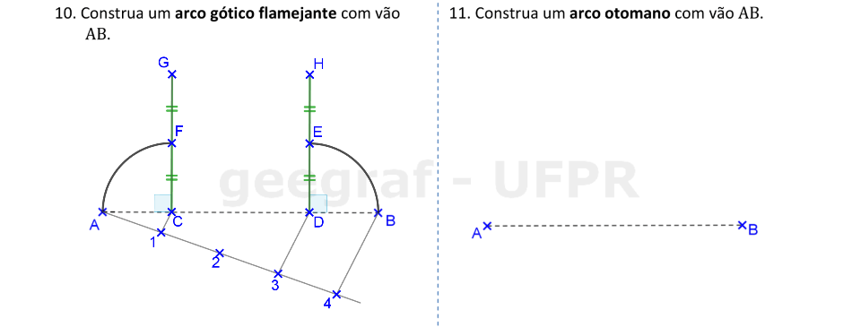
			   <figcaption>Determine os pontos <b>G</b> e <b>H</b> nos prolongamentos de <b>CF</b> e de <b>DE</b>, tais que <b>FG = CF = ED = HE</b>.</figcaption>
		   </li>
		   <li>
			   <input type="radio" id="085" name="sl">
			   <label for="085"></label>
			   
			   <figcaption>Os arcos com centros em <b>H</b> e <b>G</b> e raios iguais a <b>FG = HE</b> determinam o ponto mais alto do árco gótico flamejante.</figcaption>
		   </li>
		   <li>
			   <input type="radio" id="086" name="sl">
			   <label for="086"></label>
			   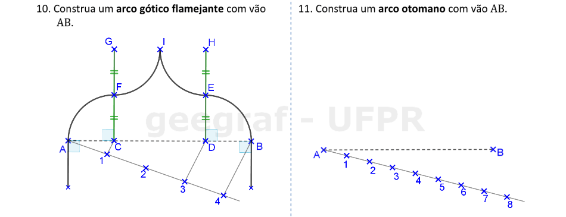
			   <figcaption>Para começar o arco otomando, vamos dividir o vão <b>AB</b> em 8 partes iguais usando o teorema de Tales.</figcaption>
		   </li>
		   <li>
			   <input type="radio" id="087" name="sl">
			   <label for="087"></label>
			   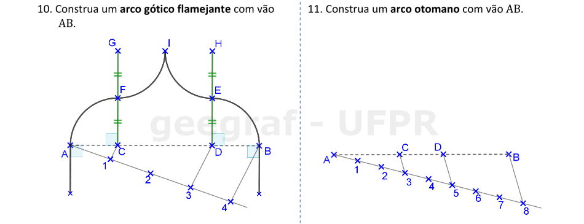
			   <figcaption>Determine os pontos <b>C</b> e <b>D</b> correspondentes a $\mathsf{ {3 \over 8}}$ e $\mathsf{ {5 \over 8}}$ do vão.</figcaption>
		   </li>
		   <li>
			   <input type="radio" id="088" name="sl">
			   <label for="088"></label>
			   
			   <figcaption>Construa o <b>&#9651;ACE</b> equilátero: uma parte do arco otomano tem centro em <b>C</b>, raio igual a <b>CA</b> e amplitude de 60&deg;.</figcaption>
		   </li>
		   <li>
			   <input type="radio" id="089" name="sl">
			   <label for="089"></label>
			   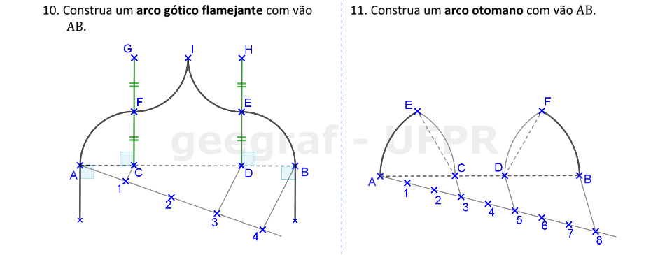
			   <figcaption>O arco simétrico tem centro em <b>D</b> e raio <b>DB</b>. Construa os segmentos <b>EC</b> e <b>DF</b>.</figcaption>
		   </li>
		   <li>
			   <input type="radio" id="090" name="sl">
			   <label for="090"></label>
			   
			   <figcaption>O ponto mais alto do arco otomano é determinado pelos segmentos tangentes aos arcos construídos nos pontos <b>E</b> e <b>F</b>.</figcaption>
		   </li>
		</ul>
		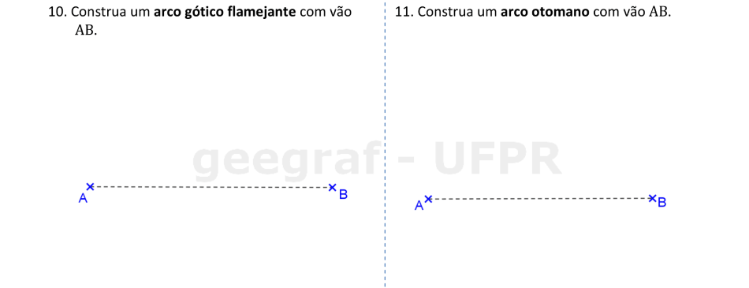
  

 
   
   

&#x1f4cf; &#x1f4d0; Resolução

	
Vamos construir os arcos ogivais de ferradura com ângulos centrais de 30&deg; e 45&deg;.

	  <ul class="slider">
		  <li>
			   <input type="radio" id="091" name="sl" checked>
			   <label for="091"></label>
			   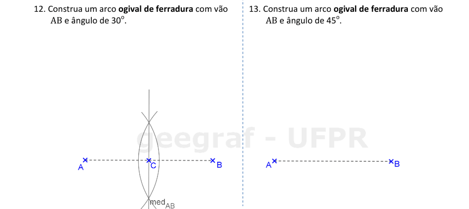
			   <figcaption>Começamos dividindo o vão na metade com a mediatriz de <b>AB</b>.</figcaption>
		   </li>
		   <li>
			   <input type="radio" id="092" name="sl">
			   <label for="092"></label>
			   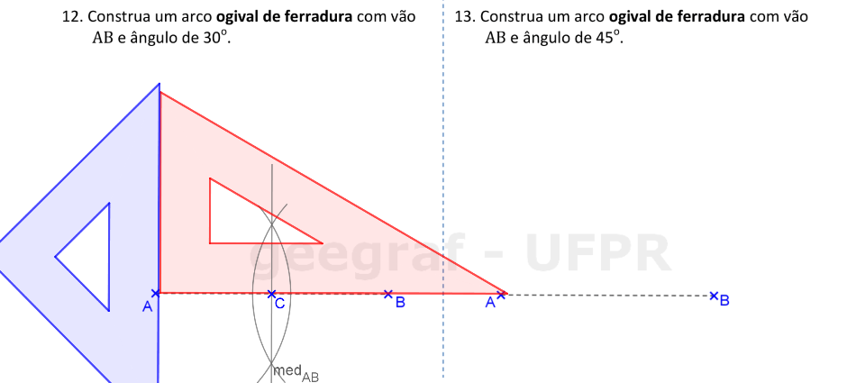
			   <figcaption>Posicione o esquadro de 60&deg; com o cateto maior alinhado com o vão.</figcaption>
		   </li>
		   <li>
			   <input type="radio" id="093" name="sl">
			   <label for="093"></label>
			   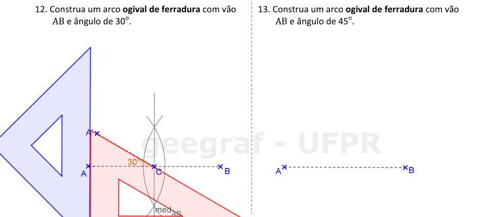
			   <figcaption>Deslize o esquadro de 60&deg; com o outro esquadro apoiado no cateto menor até o ponto <b>C</b>. Logo, temos o ângulo central construído com medida de 30&deg;.</figcaption>
		   </li>
		   <li>
			   <input type="radio" id="094" name="sl">
			   <label for="094"></label>
			   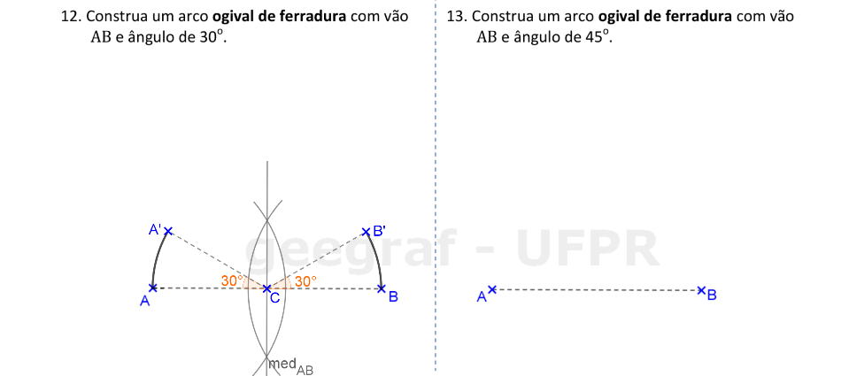
			   <figcaption>Faça o mesmo do outro lado para construirmos os arcos simétricos em relação à mediatriz do vão com centro em <b>C</b>, raios <b>AC = BC</b> e amplitude de 30&deg;.</figcaption>
		   </li>
		   <li>
			   <input type="radio" id="095" name="sl">
			   <label for="095"></label>
			   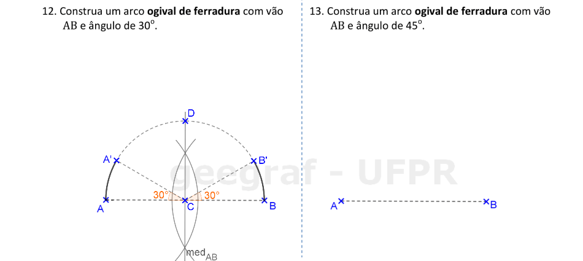
			   <figcaption>Determine o ponto <b>D</b> na mediatriz tal que <b>CD = AC</b>.</figcaption>
		   </li>
		   <li>
			   <input type="radio" id="096" name="sl">
			   <label for="096"></label>
			   
			   <figcaption>O arco ogival de ferradura tem o terceiro arco com centro em <b>D</b> e raio <b>DA' = DB'</b>.</figcaption>
		   </li>
		   <li>
			   <input type="radio" id="097" name="sl">
			   <label for="097"></label>
			   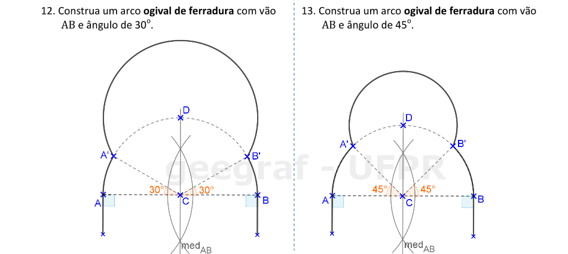
			   <figcaption>A construção do arco ogival de ferradura com ângulo central de 45&deg; é feita da mesma forma apresentada com 30&deg;.</figcaption>
		   </li>
		</ul>
		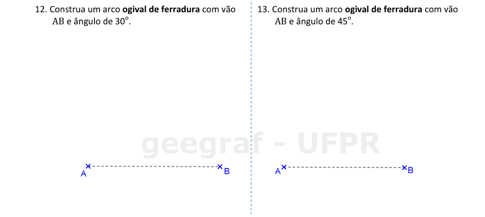
  

 
   
<a href="#modulo1" class="topo">voltar ao topo</a>

   
   

&#x1f4cf; &#x1f4d0; Resolução

	
Vamos construir os arcos assimétricos denominados esconsos.

	  <ul class="slider">
		  <li>
			   <input type="radio" id="098" name="sl" checked>
			   <label for="098"></label>
			   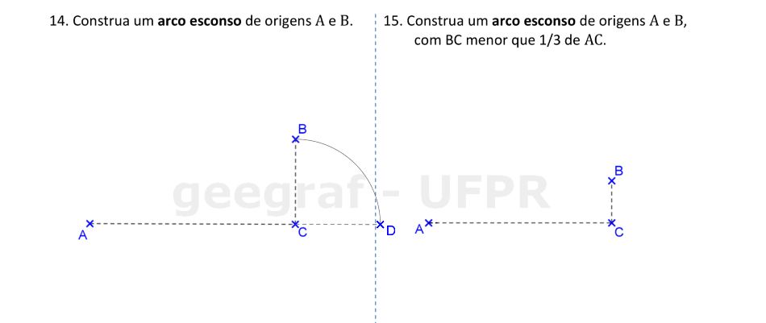
			   <figcaption>Começamos encontrando o ponto <b>D</b> no prolongamento de <b>AC</b>, tal que <b>CD = BC</b>.</figcaption>
		   </li>
		   <li>
			   <input type="radio" id="099" name="sl">
			   <label for="099"></label>
			   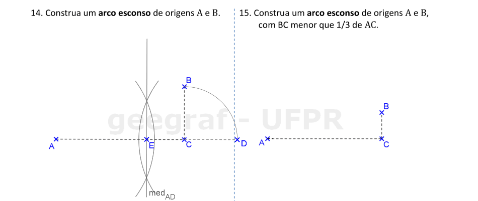
			   <figcaption>Encontre a mediatriz de <b>AD</b>.</figcaption>
		   </li>
		   <li>
			   <input type="radio" id="100" name="sl">
			   <label for="100"></label>
			   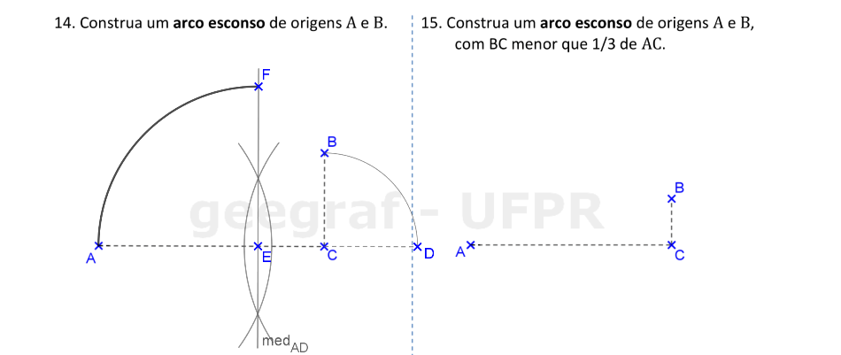
			   <figcaption>O primeiro arco tem centro em <b>E</b>, raio <b>AE</b> e amplitude de 90&deg;.</figcaption>
		   </li>
		   <li>
			   <input type="radio" id="101" name="sl">
			   <label for="101"></label>
			   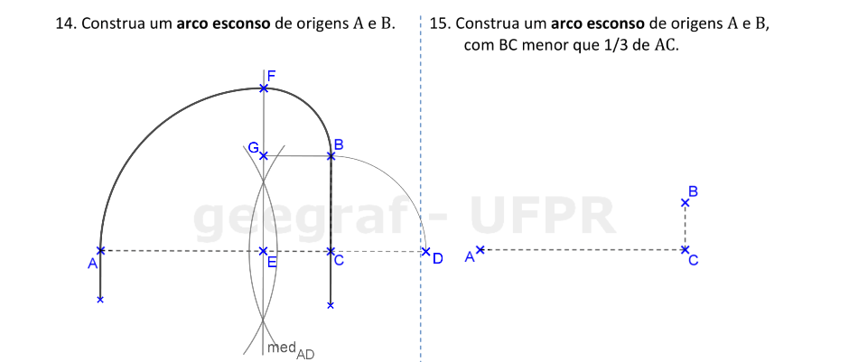
			   <figcaption>O centro do segundo arco está na mediatriz de <b>AD</b>, tal que <b>BG // AC</b> e o raio mede <b>BG</b>.</figcaption>
		   </li>
		   <li>
			   <input type="radio" id="102" name="sl">
			   <label for="102"></label>
			   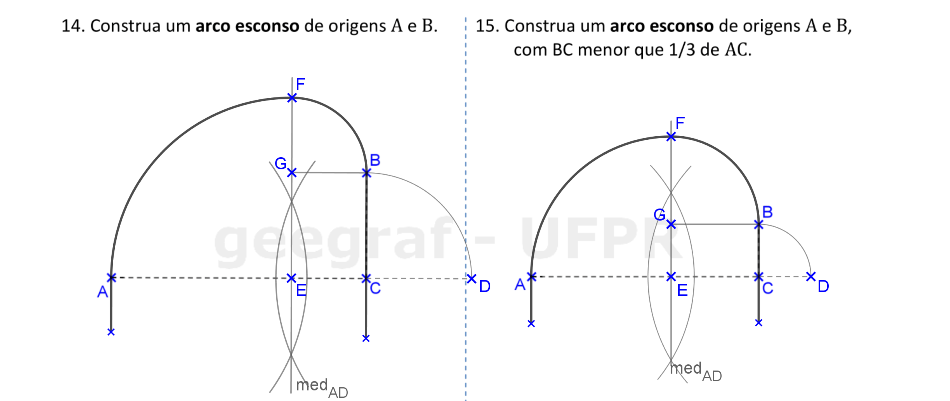
			   <figcaption>O arco esconso com a medida <b>BC</b> menor do que $\mathsf{ {AC \over 3}}$ pode ser feita de maneira similar.</figcaption>
		   </li>
		</ul>
		
  

   
   

&#x1f4cf; &#x1f4d0; Resolução

	
Vamos construir os arcos Tudor e Mourisco.

	  <ul class="slider">
		  <li>
			   <input type="radio" id="103" name="sl" checked>
			   <label for="103"></label>
			   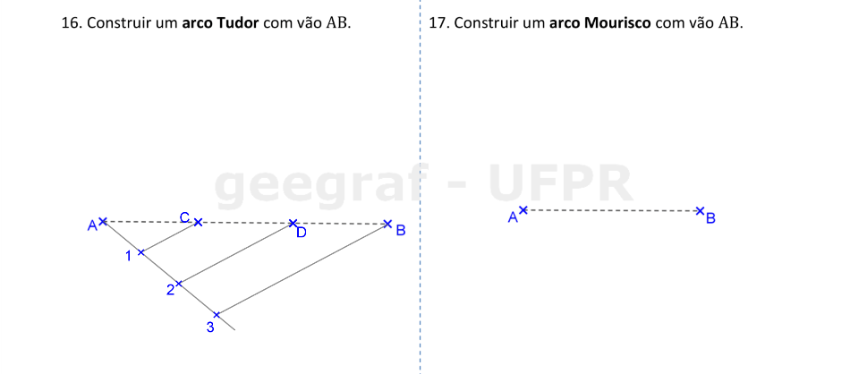
			   <figcaption>Começamos dividindo o vão <b>AB</b> em 3 partes iguais usando o teorema de Tales.</figcaption>
		   </li>
		   <li>
			   <input type="radio" id="104" name="sl">
			   <label for="104"></label>
			   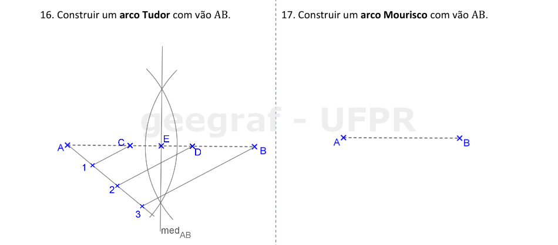
			   <figcaption>Encontre a mediatriz do vão <b>AB</b>.</figcaption>
		   </li>
		   <li>
			   <input type="radio" id="105" name="sl">
			   <label for="105"></label>
			   
			   <figcaption>Encontre o ponto <b>F</b> na mediatriz do vão, tal que <b>EF = EC = ED</b>.</figcaption>
		   </li>
		   <li>
			   <input type="radio" id="106" name="sl">
			   <label for="106"></label>
			   
			   <figcaption>Construa o quadrado de lado <b>CD</b>.</figcaption>
		   </li>
		   <li>
			   <input type="radio" id="107" name="sl">
			   <label for="107"></label>
			   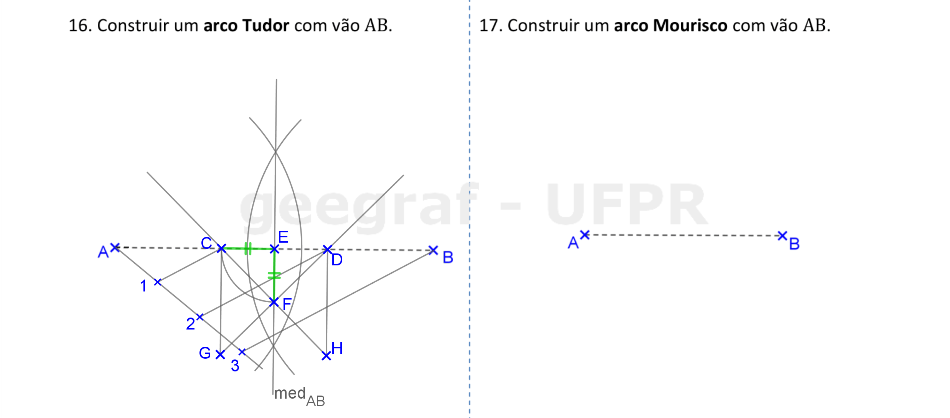
			   <figcaption>As semi-retas <b>HC</b> e <b>GF</b> serão usadas para delimitar o arco Tudor.</figcaption>
		   </li>
		   <li>
			   <input type="radio" id="108" name="sl">
			   <label for="108"></label>
			   
			   <figcaption>Construa os arcos simétricos em relação à mediatriz do vão: centros em <b>C</b> e <b>D</b>, raios iguais a <b>AC = BD</b>.</figcaption>
		   </li>
		   <li>
			   <input type="radio" id="109" name="sl">
			   <label for="109"></label>
			   
			   <figcaption>Com centros em <b>H</b> e <b>G</b> e raio <b>HI = GJ</b>, construa os arcos que determinam o ponto mais alto do arco Tudor.</figcaption>
		   </li>
		   <li>
			   <input type="radio" id="110" name="sl">
			   <label for="110"></label>
			   
			   <figcaption>No arco Mourisco, determine os arcos com centros em <b>A</b> e <b>B</b> e raios iguais a <b>AB</b>. Assim encontramos o ponto mais alto deste arco arquitetônico.</figcaption>
		   </li>
		   <li>
			   <input type="radio" id="111" name="sl">
			   <label for="111"></label>
			   
			   <figcaption>Determine os segmentos perpendiculares <b>AC</b> e <b>AD</b>. Construa um segmento <b>DE</b> com medida qualquer no prolongamento de <b>AD</b>.</figcaption>
		   </li>
		   <li>
			   <input type="radio" id="112" name="sl">
			   <label for="112"></label>
			   
			   <figcaption>Para finalizar o arco Mourisco, determine o segmento <b>FG</b> simétrico de <b>DE</b> em relação à mediatriz do vão <b>AB</b>.</figcaption>
		   </li>
		</ul>
		
  

   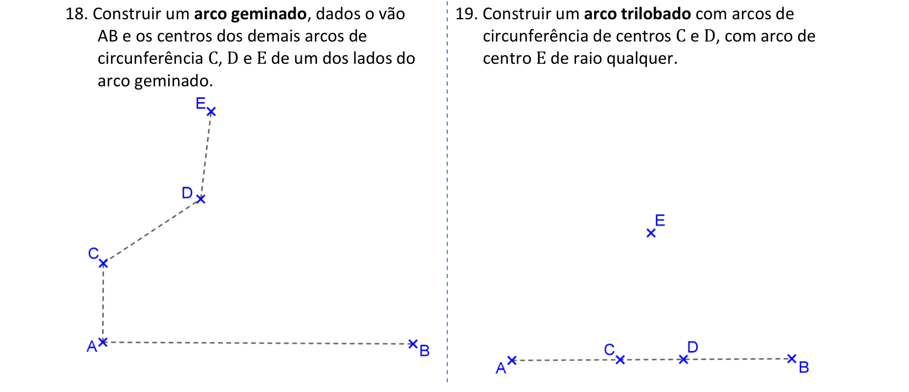
   

&#x1f4cf; &#x1f4d0; Resolução

	
Vamos construir os arcos geminado e trilobado.

	  <ul class="slider">
		  <li>
			   <input type="radio" id="113" name="sl" checked>
			   <label for="113"></label>
			   
			   <figcaption>Começamos dividindo o vão <b>AB</b> na metade. A mediatriz funciona como eixo de simetria deste arco.</figcaption>
		   </li>
		   <li>
			   <input type="radio" id="114" name="sl">
			   <label for="114"></label>
			   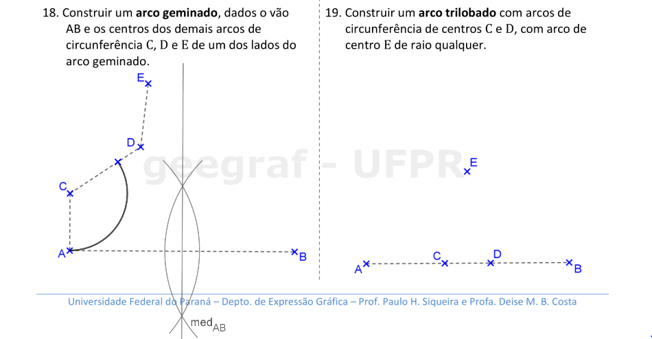
			   <figcaption>Podemos começar com o centro <b>C</b>, raio <b>CA</b>, com arco começando em <b>A</b> até o segmento <b>CD</b>.</figcaption>
		   </li>
		   <li>
			   <input type="radio" id="115" name="sl">
			   <label for="115"></label>
			   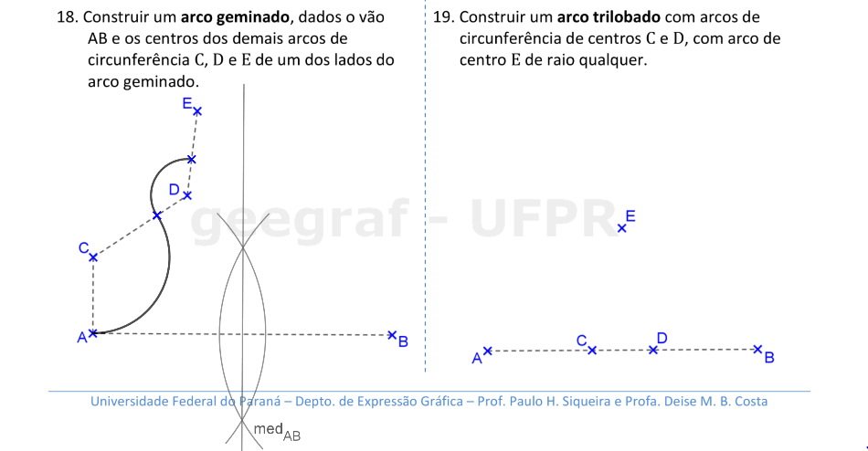
			   <figcaption>O próximo arco tem centro <b>D</b>, começa no segmento <b>CD</b> e termina no próximo segmento <b>ED</b>.</figcaption>
		   </li>
		   <li>
			   <input type="radio" id="116" name="sl">
			   <label for="116"></label>
			   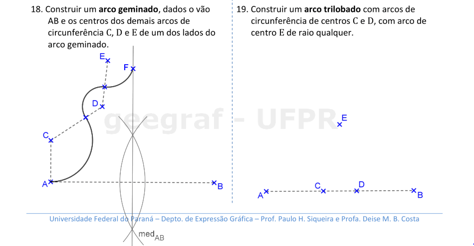
			   <figcaption>Para finalizar a parte esquerda do arco geminado, construa o arco com centro <b>E</b>, que começa em <b>ED</b> e termina na mediatriz do vão.</figcaption>
		   </li>
		   <li>
			   <input type="radio" id="117" name="sl">
			   <label for="117"></label>
			   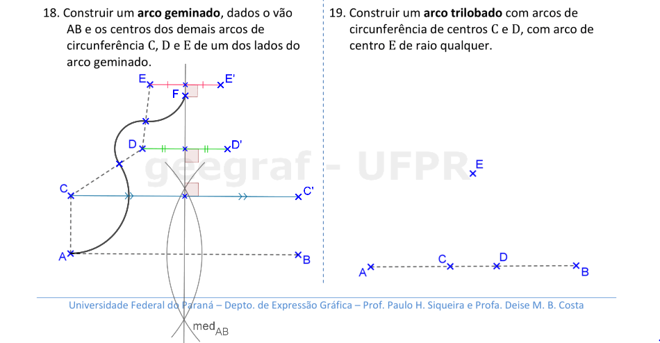
			   <figcaption>Determine os centros simétricos em relação à mediatriz do vão: <b>C'</b>, <b>D'</b> e <b>E'</b>.</figcaption>
		   </li>
		   <li>
			   <input type="radio" id="118" name="sl">
			   <label for="118"></label>
			   
			   <figcaption>Construa os arcos simétricos em relação à mediatriz da mesma forma mostrada nos arcos da parte esquerda deste arco.</figcaption>
		   </li>
		   <li>
			   <input type="radio" id="119" name="sl">
			   <label for="119"></label>
			   
			   <figcaption>O arco trilobado é parecido com o ogival de ferradura. Porém os centros <b>C</b>, <b>D</b> e <b>E</b> são de arcos com raios iguais. Note que o ponto <b>E</b> deve estar na mediatriz do vão para que este arco tenha simetria em relação a esta reta.</figcaption>
		   </li>
		   <li>
			   <input type="radio" id="120" name="sl">
			   <label for="120"></label>
			   
			   <figcaption>Construa os arcos com centros em <b>C</b>, <b>D</b> e <b>E</b> e raios iguais a <b>AC</b>.</figcaption>
		   </li>
		</ul>
		
  

   
<a href="#modulo1" class="topo">voltar ao topo</a>

   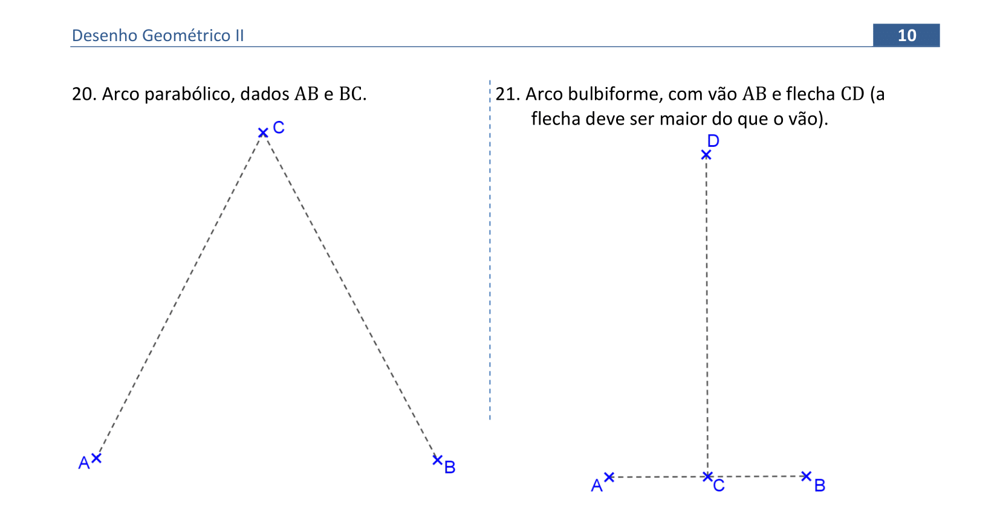
   

&#x1f4cf; &#x1f4d0; Resolução

	
Vamos construir os arcos parabólico e bulbiforme.

	  <ul class="slider">
		  <li>
			   <input type="radio" id="121" name="sl" checked>
			   <label for="121"></label>
			   
			   <figcaption>No arco parabólico, podemos dividir os segmentos <b>AB</b> e <b>CD</b> em um número qualquer de partes iguais.</figcaption>
		   </li>
		   <li>
			   <input type="radio" id="122" name="sl">
			   <label for="122"></label>
			   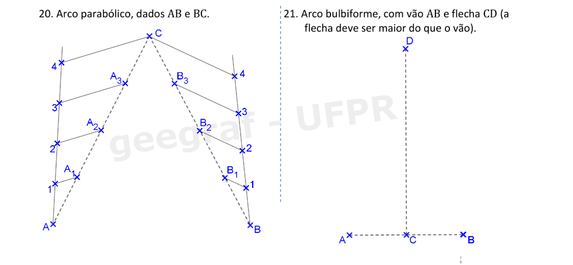
			   <figcaption>Usando o teorema de Tales, divida <b>AB</b> e <b>CD</b> em 4 partes iguais.</figcaption>
		   </li>
		   <li>
			   <input type="radio" id="123" name="sl">
			   <label for="123"></label>
			   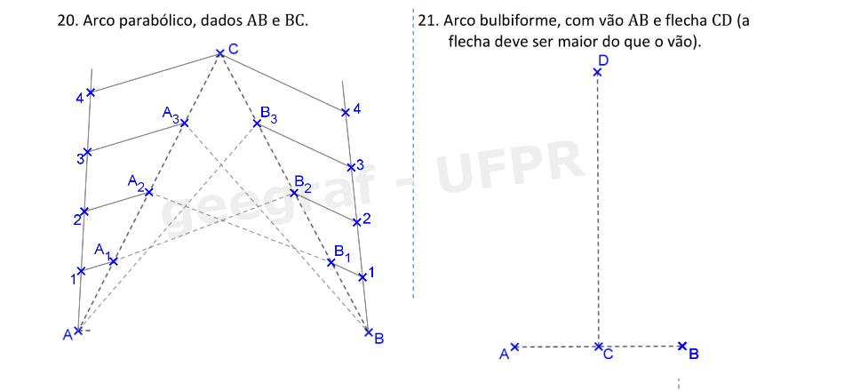
			   <figcaption>Determine os segmentos <b>AB3</b>, <b>A1B2</b>, <b>A2B1</b> e <b>A3B</b>.</figcaption>
		   </li>
		   <li>
			   <input type="radio" id="124" name="sl">
			   <label for="124"></label>
			   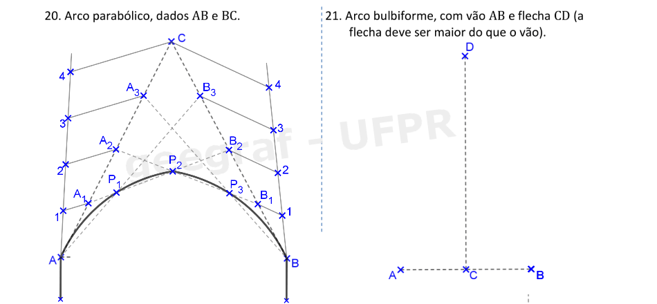
			   <figcaption>Os pontos do arco parabólico são as extremidades <b>A</b> e <b>B</b> e os pontos de interseção: <b>P1 = AB3 &cap; A1B2</b>, <b>P2 = A2B1 &cap; A1B2</b> e <b>P3 = A2B1 &cap; A3B</b>.</figcaption>
		   </li>
		   <li>
			   <input type="radio" id="125" name="sl">
			   <label for="125"></label>
			   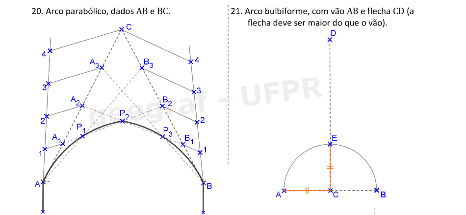
			   <figcaption>No arco bulbiforme, determine o ponto <b>E &isin; CD</b> tal que <b>CE = AC = BC</b>.</figcaption>
		   </li>
		   <li>
			   <input type="radio" id="126" name="sl">
			   <label for="126"></label>
			   
			   <figcaption>Construa a reta <b>FG // AB</b> e os segmentos <b>DF = DG = AE</b>.</figcaption>
		   </li>
		   <li>
			   <input type="radio" id="127" name="sl">
			   <label for="127"></label>
			   
			   <figcaption>A mediatriz de <b>EF</b> determina o ponto <b>G'</b> que é o centro de um dos arcos.</figcaption>
		   </li>
		   <li>
			   <input type="radio" id="128" name="sl">
			   <label for="128"></label>
			   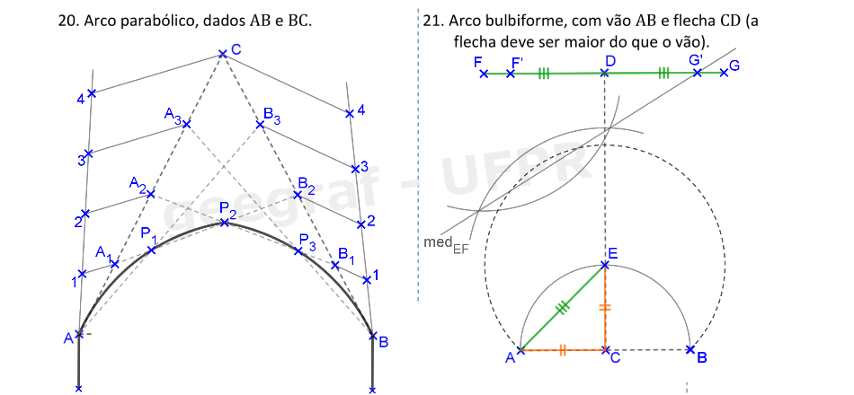
			   <figcaption>Determine o ponto <b>F'</b> simétrico de <b>G'</b> em relação ao segmento <b>CD</b>. Construa o arco com centro em <b>E</b> e raio <b>AE</b>.</figcaption>
		   </li>
		   <li>
			   <input type="radio" id="129" name="sl">
			   <label for="129"></label>
			   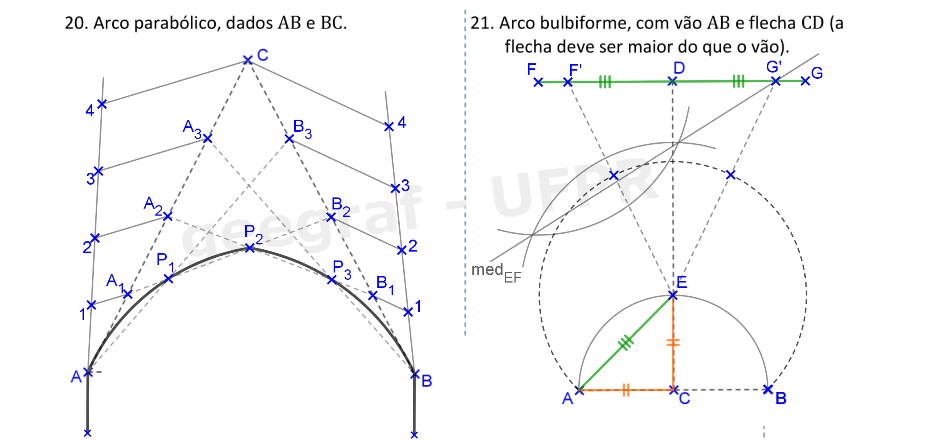
			   <figcaption>Os segmentos <b>EF'</b> e <b>EG'</b> determinam os pontos de tangência no arco de centro <b>E</b>.</figcaption>
		   </li>
		   <li>
			   <input type="radio" id="130" name="sl">
			   <label for="130"></label>
			   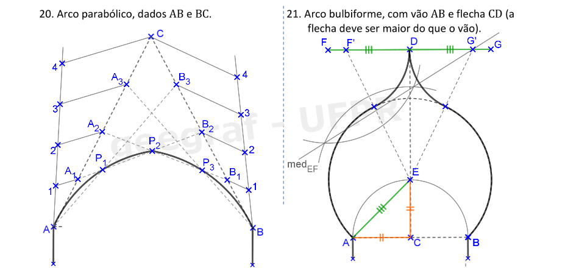
			   <figcaption>Com centros em <b>F'</b> e <b>G'</b>, construa os arcos tangentes ao arco de centro em <b>E</b>.</figcaption>
		   </li>
		</ul>
		
  

   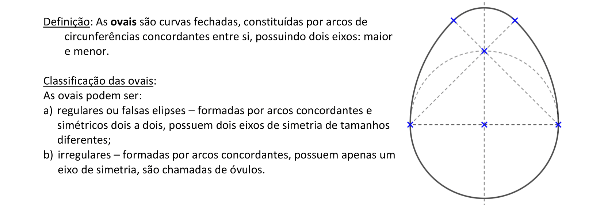
   

&#x1f4d1; Propriedades

	
Vamos acompanhar algumas definições de elementos das curvas chamadas ovais ou falsas elipses.

	  <ul class="slider">
		  <li>
			   <input type="radio" id="131" name="sl" checked>
			   <label for="131"></label>
			   
			   <figcaption>As ovais possuem sempre eixos com duas medidas: o eixo maior e o eixo menor. As ovais regulares têm os dois eixos de simetria.</figcaption>
		   </li>
		   <li>
			   <input type="radio" id="132" name="sl">
			   <label for="132"></label>
			   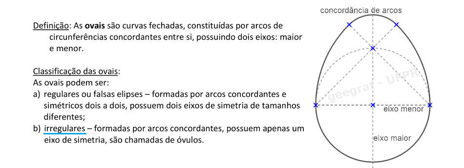
			   <figcaption>As ovais irregulares têm apenas um eixo de simetria. Assim como fizemos nos arcos arquitetônicos, os arcos de concordância são utilizados para construções das falsas elipses.</figcaption>
		   </li>
		</ul>
		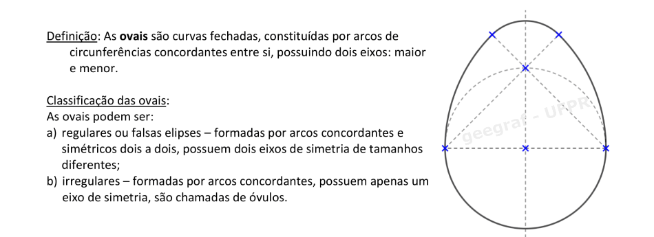
  

   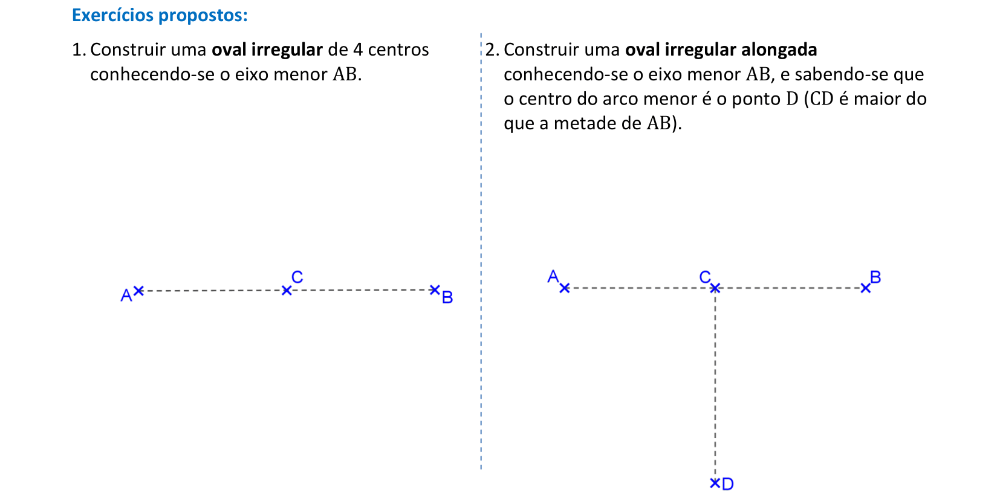
   

&#x1f4cf; &#x1f4d0; Resolução

	
Vamos construir ovais irregulares. Nestes casos, temos apenas um eixo de simetria nestas curvas.

	  <ul class="slider">
		  <li>
			   <input type="radio" id="133" name="sl" checked>
			   <label for="133"></label>
			   
			   <figcaption>A mediatriz do eixo menor será o eixo de simetria da oval irregular de 4 centros.</figcaption>
		   </li>
		   <li>
			   <input type="radio" id="134" name="sl">
			   <label for="134"></label>
			   
			   <figcaption>Encontre o ponto <b>D</b> pertencente à mediatriz tal que <b>CD = AC = BC</b>.</figcaption>
		   </li>
		   <li>
			   <input type="radio" id="135" name="sl">
			   <label for="135"></label>
			   
			   <figcaption>O ponto médio de <b>AB</b> é o primeiro centro desta oval. As semi-retas <b>AD</b> e <b>BD</b> serão limites dos outros arcos desta curva.</figcaption>
		   </li>
		   <li>
			   <input type="radio" id="136" name="sl">
			   <label for="136"></label>
			   
			   <figcaption>Construa os arcos com centros em <b>A</b> e <b>B</b> e raios iguais a <b>AB</b> até as semi-retas limites.</figcaption>
		   </li>
		   <li>
			   <input type="radio" id="137" name="sl">
			   <label for="137"></label>
			   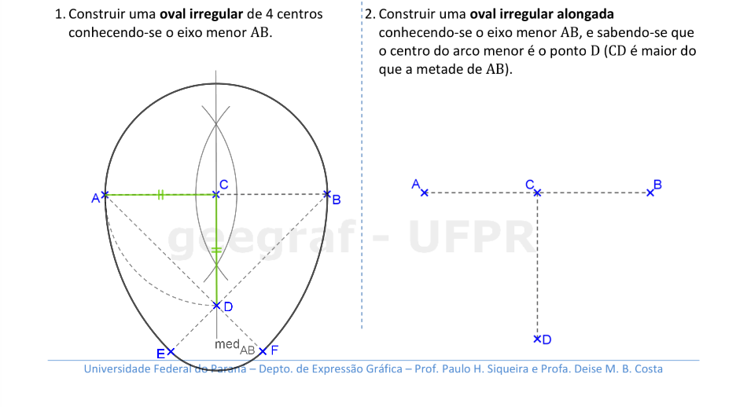
			   <figcaption>O quarto centro desta oval é o ponto <b>D</b>, que define o arco de raio com medida <b>DE = DF</b>.</figcaption>
		   </li>
		   <li>
			   <input type="radio" id="138" name="sl">
			   <label for="138"></label>
			   
			   <figcaption>Na oval alongada, o segmento <b>CD</b> está contido na mediatriz e tem medida maior do que a metade de <b>AB</b>. O primeiro arco tem centro em <b>C</b> e raio de medida <b>AC = BC</b>.</figcaption>
		   </li>
		   <li>
			   <input type="radio" id="139" name="sl">
			   <label for="139"></label>
			   
			   <figcaption>Encontre o ponto médio de <b>BC</b>...</figcaption>
		   </li>
		   <li>
			   <input type="radio" id="140" name="sl">
			   <label for="140"></label>
			   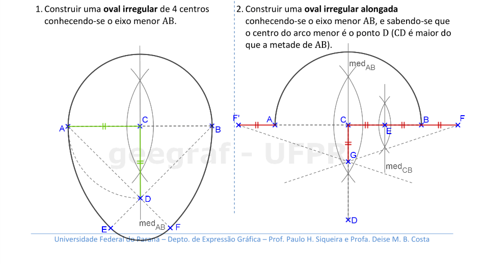
			   <figcaption>... e determine os pontos <b>F</b> e <b>F'</b> nos prolongamentos de <b>AB</b> tais que <b>BF = AF' = BE = EC</b>. Encontre também o ponto <b>G &isin; CD</b> tal que <b>CG = EC = BE</b>. As semi-retas <b>FG</b> e <b>F'G</b> serão limites de dois arcos da curva.</figcaption>
		   </li>
		   <li>
			   <input type="radio" id="141" name="sl">
			   <label for="141"></label>
			   
			   <figcaption>Construa os arcos com centros <b>F'</b> e <b>F</b> e raios com medidas iguais a <b>F'B = FA</b>.</figcaption>
		   </li>
		   <li>
			   <input type="radio" id="142" name="sl">
			   <label for="142"></label>
			   
			   <figcaption>As semi-retas <b>JD</b> e <b>J'D</b> serão limites de dois arcos da curva.</figcaption>
		   </li>
		   <li>
			   <input type="radio" id="143" name="sl">
			   <label for="143"></label>
			   
			   <figcaption>Construa os arcos com centros <b>J'</b> e <b>J</b> e raios com medidas iguais a <b>J'H = JI</b>.</figcaption>
		   </li>
		   <li>
			   <input type="radio" id="144" name="sl">
			   <label for="144"></label>
			   
			   <figcaption>Para finalizar, basta construir o arco de centro <b>D</b> e raio com medida <b>DK = DL</b>.</figcaption>
		   </li>
		</ul>
		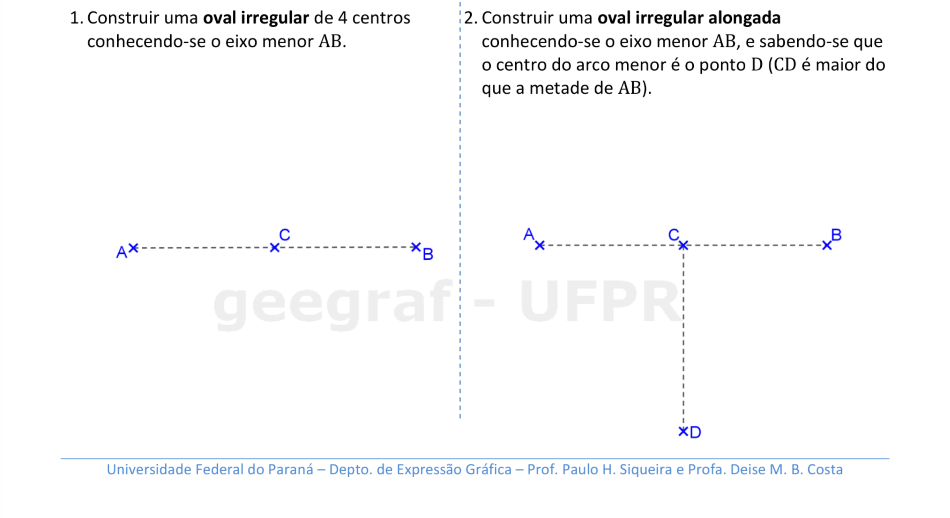
  

   
<a href="#modulo1" class="topo">voltar ao topo</a>

   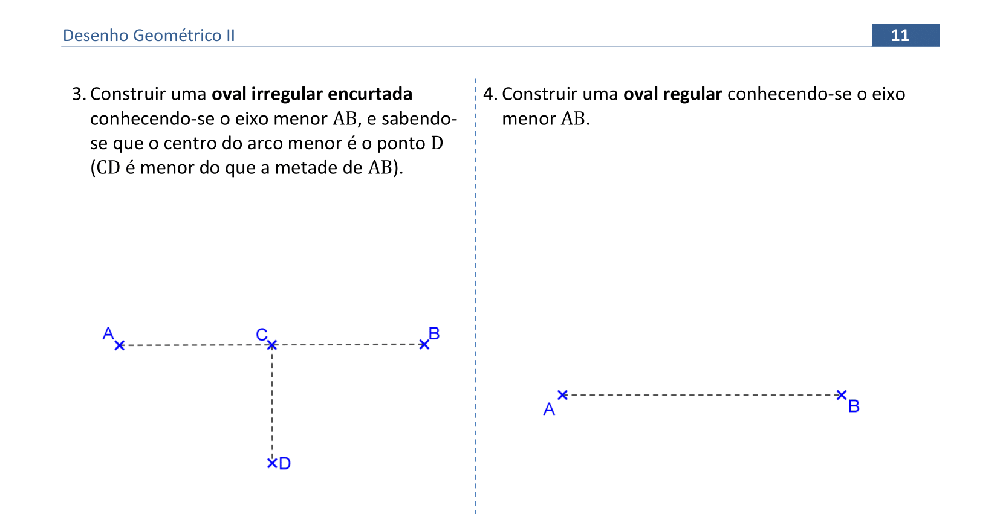
   

&#x1f4cf; &#x1f4d0; Resolução

	
Vamos construir uma oval irregular encurtada e uma oval regular. Os diâmetros das ovais regulares são eixos de simetria das curvas.

	  <ul class="slider">
		  <li>
			   <input type="radio" id="145" name="sl" checked>
			   <label for="145"></label>
			   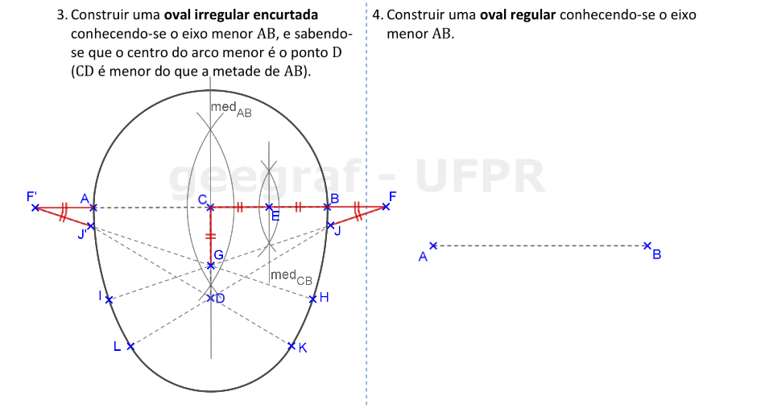
			   <figcaption>A oval irregular encurtada tem a medida de  <b>CD</b> menor do que a metade de <b>AB</b>. A construção fica similar à da oval alongada.</figcaption>
		   </li>
		   <li>
			   <input type="radio" id="146" name="sl">
			   <label for="146"></label>
			   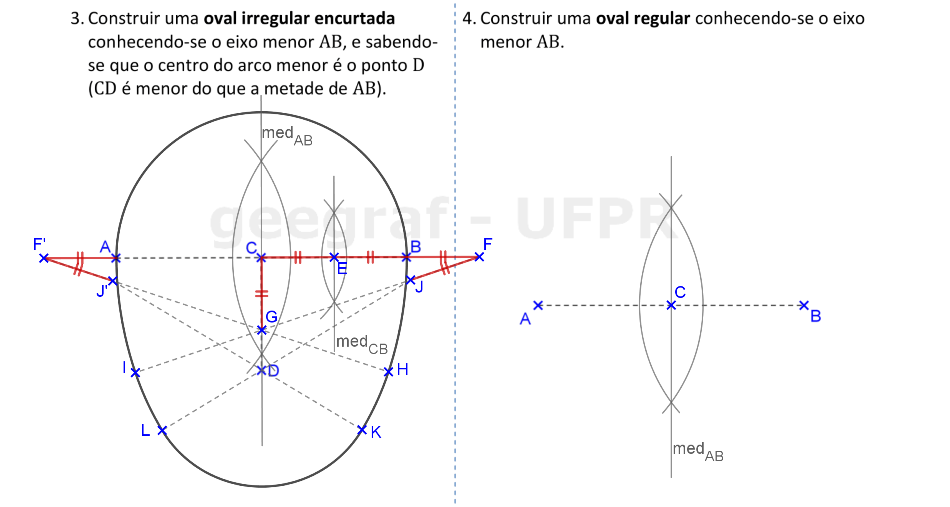
			   <figcaption>No caso da oval regular, vamos construir a mediatriz do diâmetro menor, que funciona como eixo de simetria da curva. Neste caso, o eixo maior não está definido e depende das construções feitas com a medida do eixo menor.</figcaption>
		   </li>
		   <li>
			   <input type="radio" id="147" name="sl">
			   <label for="147"></label>
			   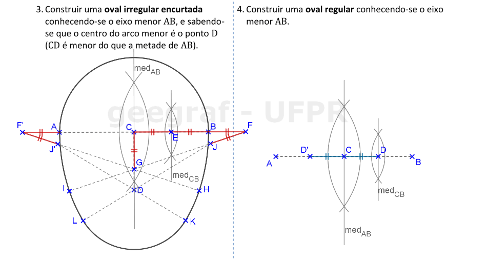
			   <figcaption>Encontre a metade de <b>BC</b> e o ponto simétrico de <b>D</b> em relação à mediatriz de <b>AB</b>.</figcaption>
		   </li>
		   <li>
			   <input type="radio" id="148" name="sl">
			   <label for="148"></label>
			   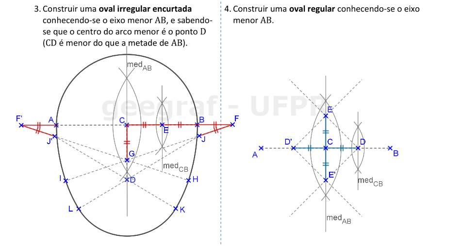
			   <figcaption>As semi-retas <b>DE</b>, <b>DE'</b>, <b>D'E</b> e <b>D'E'</b> serão os limites dos arcos da oval regular.</figcaption>
		   </li>
		   <li>
			   <input type="radio" id="149" name="sl">
			   <label for="149"></label>
			   
			   <figcaption>Construa o arco com centro em <b>D'</b> com raio <b>D'B</b> até as semi-retas limites.</figcaption>
		   </li>
		   <li>
			   <input type="radio" id="150" name="sl">
			   <label for="150"></label>
			   
			   <figcaption>Construa o arco simétrico com centro em <b>D</b> com raio <b>DA</b> até as semi-retas limites correspondentes.</figcaption>
		   </li>
		   <li>
			   <input type="radio" id="151" name="sl">
			   <label for="151"></label>
			   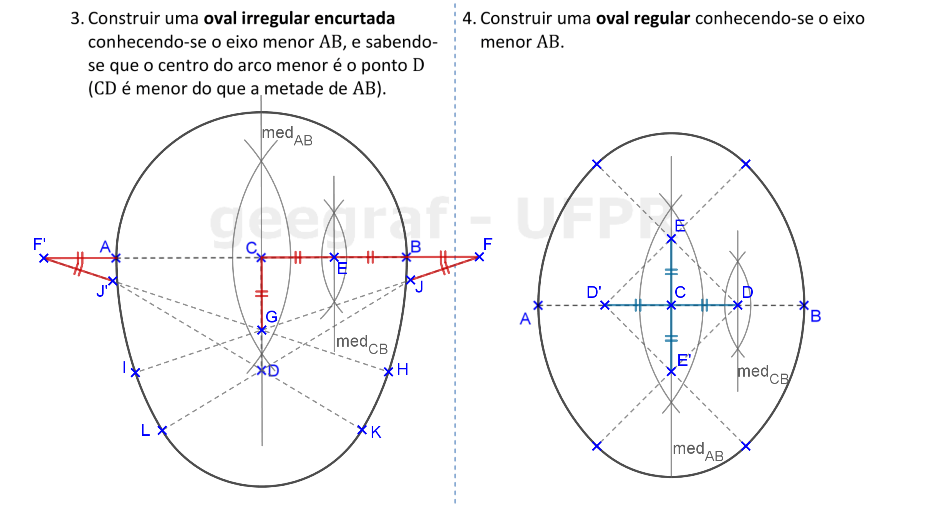
			   <figcaption>Para finalizar, basta construir os arcos de centros <b>E</b> e <b>E'</b> da oval regular.</figcaption>
		   </li>
		</ul>
		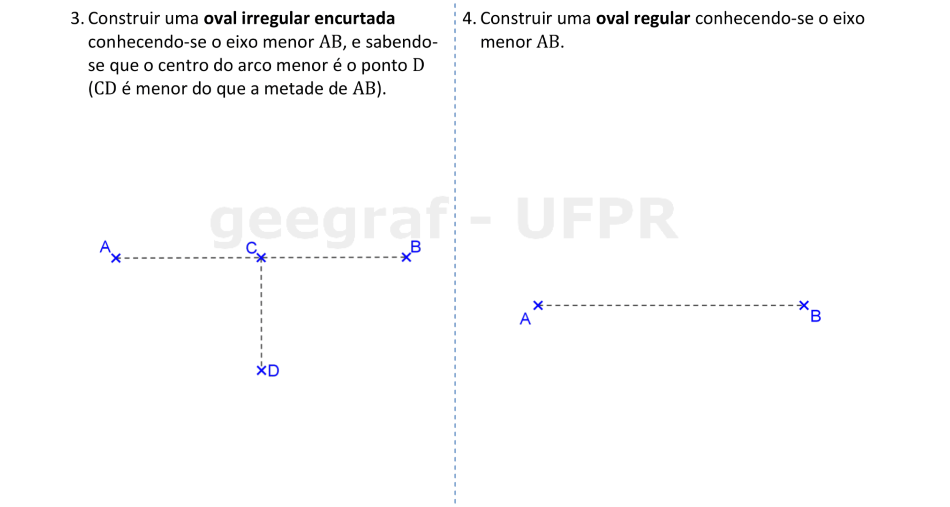
  

   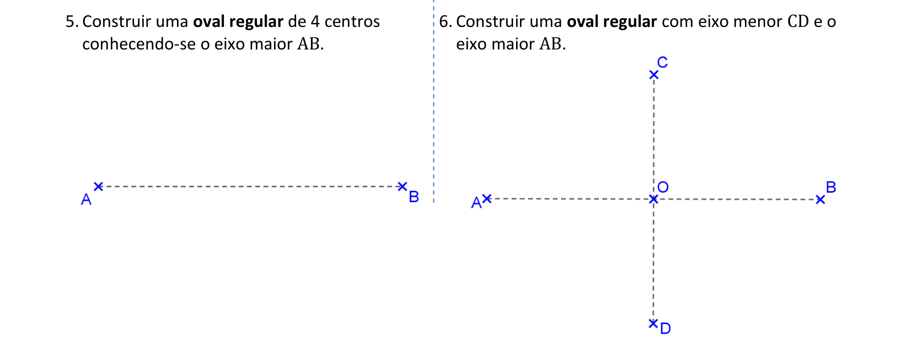
   

&#x1f4cf; &#x1f4d0; Resolução

	
Vamos construir ovais regulares: uma com apenas a medida do eixo maior e a outra com as medidas dos dois eixos.

	  <ul class="slider">
		  <li>
			   <input type="radio" id="152" name="sl" checked>
			   <label for="152"></label>
			   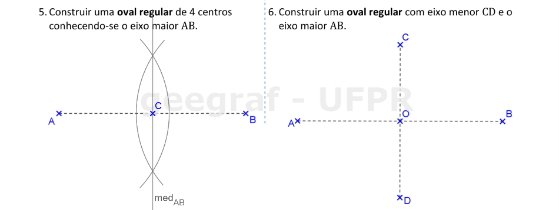
			   <figcaption>Vamos construir a mediatriz do diâmetro maior, que funciona como eixo de simetria da curva.</figcaption>
		   </li>
		   <li>
			   <input type="radio" id="153" name="sl">
			   <label for="153"></label>
			   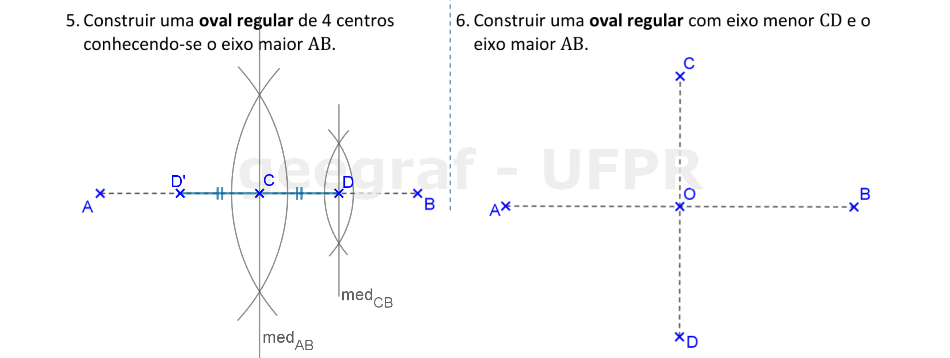
			   <figcaption>Encontre a metade de <b>BC</b> e o ponto simétrico de <b>D</b> em relação à mediatriz de <b>AB</b>.</figcaption>
		   </li>
		   <li>
			   <input type="radio" id="154" name="sl">
			   <label for="154"></label>
			   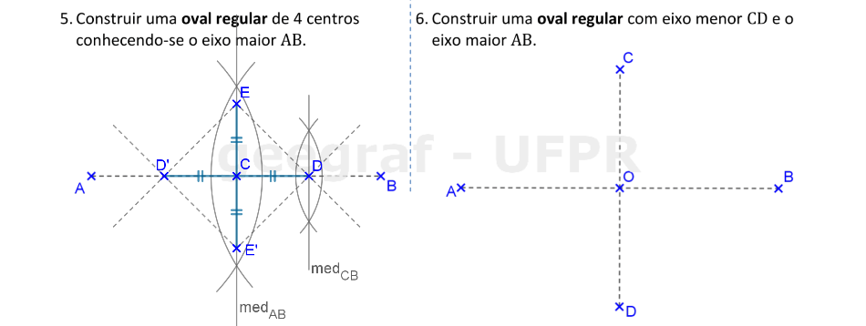
			   <figcaption>As semi-retas <b>DE</b>, <b>DE'</b>, <b>D'E</b> e <b>D'E'</b> serão os limites dos arcos da oval regular.</figcaption>
		   </li>
		   <li>
			   <input type="radio" id="155" name="sl">
			   <label for="155"></label>
			   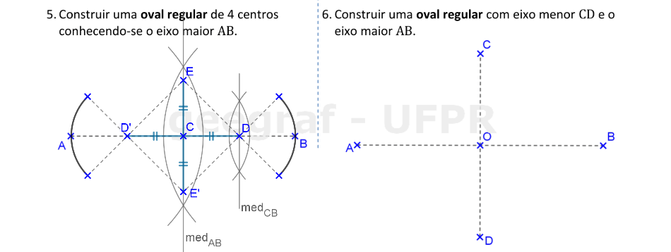
			   <figcaption>Construa o arco com centro em <b>D'</b> com raio <b>D'A</b> até as semi-retas limites. Construa o arco com centro em <b>D</b> com raio <b>DB</b> até as semi-retas limites correspondentes.</figcaption>
		   </li>
		   <li>
			   <input type="radio" id="156" name="sl">
			   <label for="156"></label>
			   
			   <figcaption>Para finalizar, basta construir os arcos de centros <b>E</b> e <b>E'</b> da oval regular.</figcaption>
		   </li>
		   <li>
			   <input type="radio" id="157" name="sl">
			   <label for="157"></label>
			   
			   <figcaption>Considerando as medidas fixas dos eixos de uma oval regular, começamos a construção com a diferença entre as medidas dos eixos: <b>AE = AB - CD</b>.</figcaption>
		   </li>
		   <li>
			   <input type="radio" id="158" name="sl">
			   <label for="158"></label>
			   
			   <figcaption>Divida o segmento <b>AE</b> em 3 partes iguais e encontre o ponto <b>F'</b> tal que <b>AF' = </b>$\mathsf{ {2 \over 3}}$<b>AE</b>.</figcaption>
		   </li>
		   <li>
			   <input type="radio" id="159" name="sl">
			   <label for="159"></label>
			   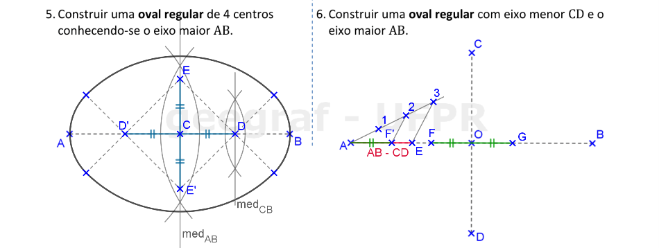
			   <figcaption>Encontre os pontos <b>F</b> e <b>G</b> no diâmetro maior, tais que <b>OF = OG = AF'</b>.</figcaption>
		   </li>
		   <li>
			   <input type="radio" id="160" name="sl">
			   <label for="160"></label>
			   
			   <figcaption>Construa a circunferência de centro <b>F</b> e raio <b>FG</b>, determinando os pontos <b>H</b> e <b>I</b> no diâmetro menor.</figcaption>
		   </li>
		   <li>
			   <input type="radio" id="161" name="sl">
			   <label for="161"></label>
			   
			   <figcaption>As semi-retas <b>HF</b>, <b>HG</b>, <b>IF</b> e <b>IG</b> serão os limites dos arcos da oval regular.</figcaption>
		   </li>
		   <li>
			   <input type="radio" id="162" name="sl">
			   <label for="162"></label>
			   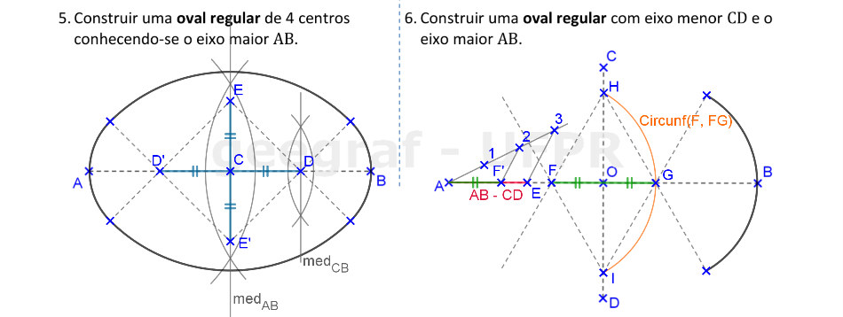
			   <figcaption>Construa o arco de centro <b>G</b> e raio <b>GB</b> até as retas limites.</figcaption>
		   </li>
		   <li>
			   <input type="radio" id="163" name="sl">
			   <label for="163"></label>
			   
			   <figcaption>Construa o arco simétrico de centro <b>F</b> e raio <b>FA</b> até as retas limites correspondentes.</figcaption>
		   </li>
		   <li>
			   <input type="radio" id="164" name="sl">
			   <label for="164"></label>
			   
			   <figcaption>Para finalizar, basta construir os arcos de centros <b>H</b> e <b>I</b> da oval regular.</figcaption>
		   </li>
		</ul>
		
  

   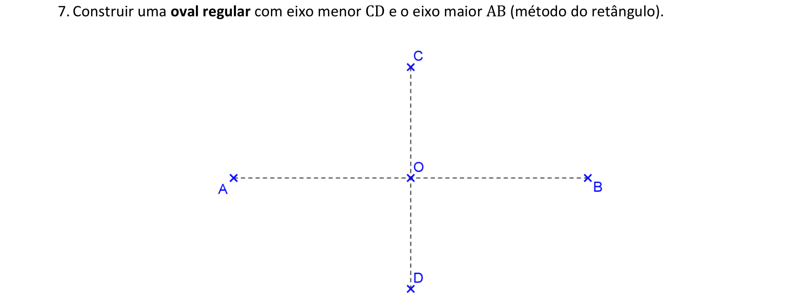
   

&#x1f4cf; &#x1f4d0; Resolução

	
Vamos construir uma oval com as medidas dos dois eixos dadas. O método do retângulo foi usado para construirmos um arco abatido.

	  <ul class="slider">
		  <li>
			   <input type="radio" id="165" name="sl" checked>
			   <label for="165"></label>
			   
			   <figcaption>Construa o retângulo <b>AOCE</b>.</figcaption>
		   </li>
		   <li>
			   <input type="radio" id="166" name="sl">
			   <label for="166"></label>
			   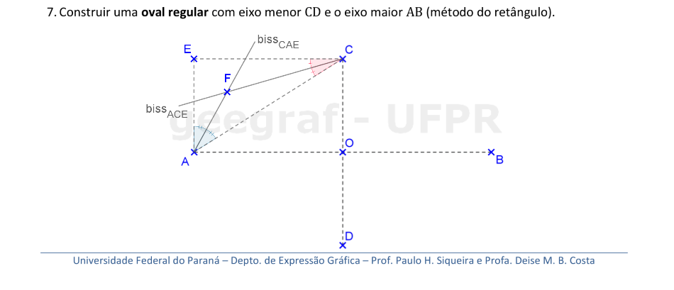
			   <figcaption>Determine o incentro <b>F</b> do <b>&#9651;ACE</b>.</figcaption>
		   </li>
		   <li>
			   <input type="radio" id="167" name="sl">
			   <label for="167"></label>
			   
			   <figcaption>Construa o segmento <b>HF &perp; AC</b>, determinando <b>G</b> sobre o diâmetro maior da oval regular.</figcaption>
		   </li>
		   <li>
			   <input type="radio" id="168" name="sl">
			   <label for="168"></label>
			   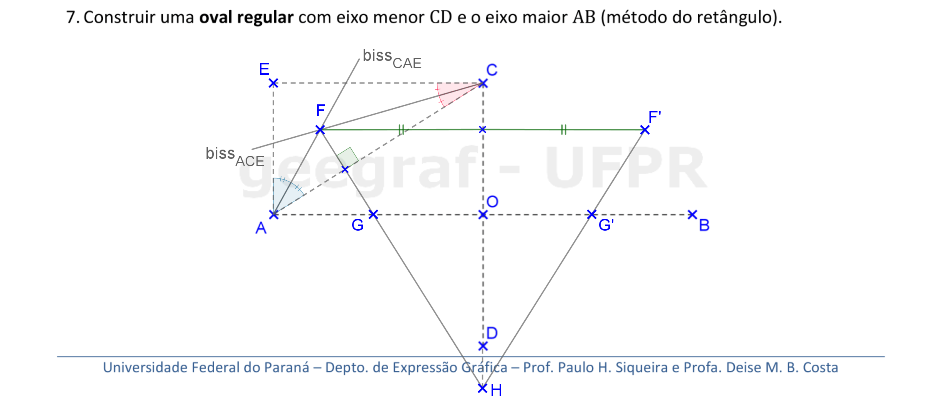
			   <figcaption>Encontre o simétrico de <b>G</b> em relação ao eixo menor e a reta <b>F'F // AB</b>. As semi-retas <b>HF</b> e <b>HF'</b> serão usadas como limites de arcos da curva.</figcaption>
		   </li>
		   <li>
			   <input type="radio" id="169" name="sl">
			   <label for="169"></label>
			   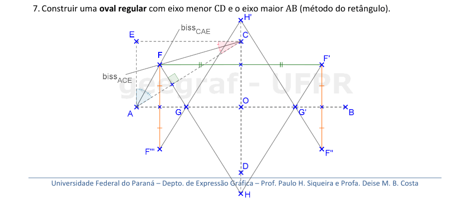
			   <figcaption>Encontre os pontos simétricos de <b>F</b>, de <b>H</b> e de <b>F'</b> em relação ao diâmetro <b>AB</b>.</figcaption>
		   </li>
		   <li>
			   <input type="radio" id="170" name="sl">
			   <label for="170"></label>
			   
			   <figcaption>Construa os arcos de centros <b>G</b> e <b>G'</b> até as respectivas semi-retas limites.</figcaption>
		   </li>
		   <li>
			   <input type="radio" id="171" name="sl">
			   <label for="171"></label>
			   
			   <figcaption>Para finalizar, construa os arcos de centros <b>H</b> e <b>H'</b> até as respectivas semi-retas limites.</figcaption>
		   </li>
		</ul>
		
  

   
<a href="#modulo1" class="topo">voltar ao topo</a>

2. Espirais e elipses

  
Material da página 12 até a página 25.

   
   

&#x1f4d1; Propriedades

	
Veremos agora as definições usadas nas construções das espirais. Estas curvas podem ser construídas por pontos auxiliares e construídas à mão livre, ou construídas com arcos de concordâncias.

	  <ul class="slider">
		  <li>
			   <input type="radio" id="172" name="sl" checked>
			   <label for="172"></label>
			   
			   <figcaption>O núcleo é o polígono que contém os centros dos arcos da falsa espiral.</figcaption>
		   </li>
		   <li>
			   <input type="radio" id="173" name="sl">
			   <label for="173"></label>
			   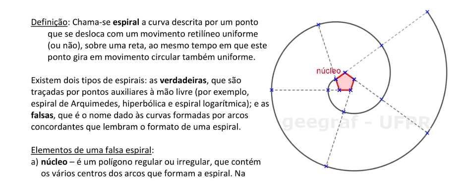
			   <figcaption>Na espiral verdadeira, o núcleo é substituído por um ponto denominado pólo.</figcaption>
		   </li>
		   <li>
			   <input type="radio" id="174" name="sl">
			   <label for="174"></label>
			   
			   <figcaption>Os raios vetores são os prolongamentos dos lados do núcleo.</figcaption>
		   </li>
		   <li>
			   <input type="radio" id="175" name="sl">
			   <label for="175"></label>
			   
			   <figcaption>A evolução completa da espiral é chamada de espira.</figcaption>
		   </li>
		   <li>
			   <input type="radio" id="176" name="sl">
			   <label for="176"></label>
			   
			   <figcaption>O passo é a distância entre duas espiras.</figcaption>
		   </li>
		</ul>
		
  

   
   

&#x1f4cf; &#x1f4d0; Resolução

	
Vamos construir falsas espirais com 2 e com 3 centros.

	  <ul class="slider">
		  <li>
			   <input type="radio" id="177" name="sl" checked>
			   <label for="177"></label>
			   
			   <figcaption>Determine o segmento <b>AB</b> que define os dois centros da falsa espiral. Prolongue o lado <b>AB</b> nos dois sentidos. Usando o centro <b>A</b>, determine o arco de circunferência com amplitude de 180&deg; com raio <b>AB</b>.</figcaption>
		   </li>
		   <li>
			   <input type="radio" id="178" name="sl">
			   <label for="178"></label>
			   
			   <figcaption>Agora vamos usar o centro <b>B</b>, com raio <b>B1</b> e as amplitudes sempre iguais a 180&deg;. Neste caso, completamos uma volta e temos uma espira.</figcaption>
		   </li>
		   <li>
			   <input type="radio" id="179" name="sl">
			   <label for="179"></label>
			   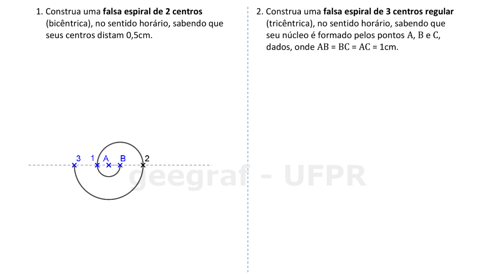
			   <figcaption>Voltamos ao ponto <b>A</b> e o próximo raio tem medida <b>A2</b>.</figcaption>
		   </li>
		   <li>
			   <input type="radio" id="180" name="sl">
			   <label for="180"></label>
			   
			   <figcaption>Voltamos ao ponto <b>B</b> e o próximo raio tem medida <b>B3</b>.</figcaption>
		   </li>
		   <li>
			   <input type="radio" id="181" name="sl">
			   <label for="181"></label>
			   
			   <figcaption>Prosseguimos com a alternância entre os centros e temos a construção da espiral de 2 centros com 4 espiras.</figcaption>
		   </li>
		   <li>
			   <input type="radio" id="182" name="sl">
			   <label for="182"></label>
			   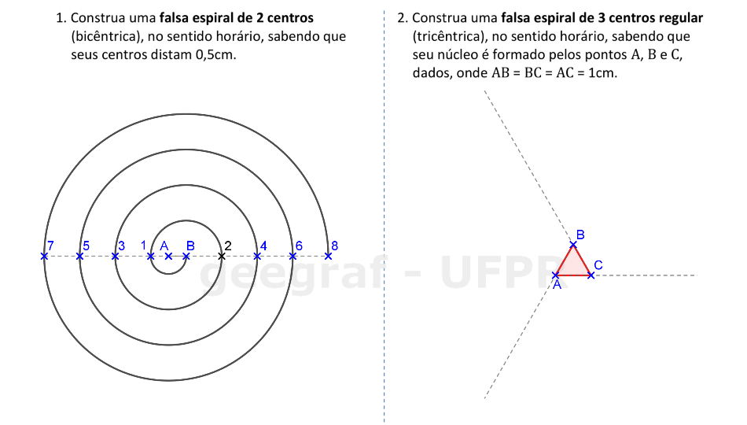
			   <figcaption>Construa o <b>&#9651;ABC</b> equilátero com as medidas dos lados iguais a 1cm. Defina as semi-retas <b>AC</b>, <b>BA</b> e <b>CB</b>.</figcaption>
		   </li>
		   <li>
			   <input type="radio" id="183" name="sl">
			   <label for="183"></label>
			   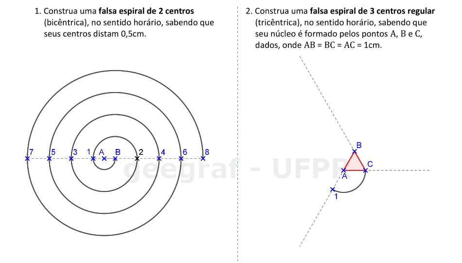
			   <figcaption>Começando pelo centro <b>A</b>, defina o arco de amplitude 120&deg; e raio <b>AC</b> até a semi-reta limite <b>BA</b>.</figcaption>
		   </li>
		   <li>
			   <input type="radio" id="184" name="sl">
			   <label for="184"></label>
			   
			   <figcaption>Agora com centro <b>B</b>, defina o arco de amplitude 120&deg; e raio <b>B1</b> até a semi-reta limite <b>CB</b>. O próximo centro será <b>C</b>, com raio <b>C2</b>.</figcaption>
		   </li>
		   <li>
			   <input type="radio" id="185" name="sl">
			   <label for="185"></label>
			   
			   <figcaption>Prosseguimos com o rodízio dos centros e temos a construção da espiral regular de 3 centros.</figcaption>
		   </li>
		</ul>
		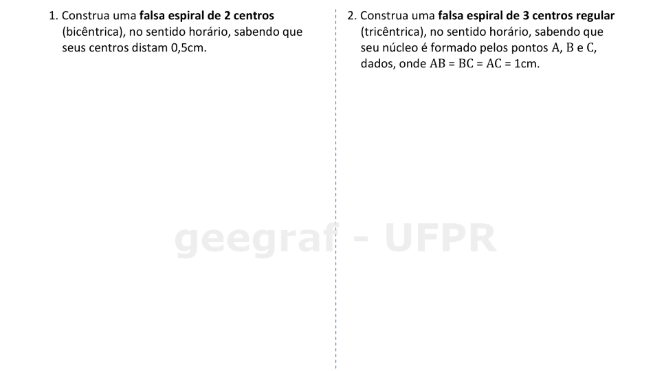
  

   
<a href="#modulo2" class="topo">voltar ao topo</a>

   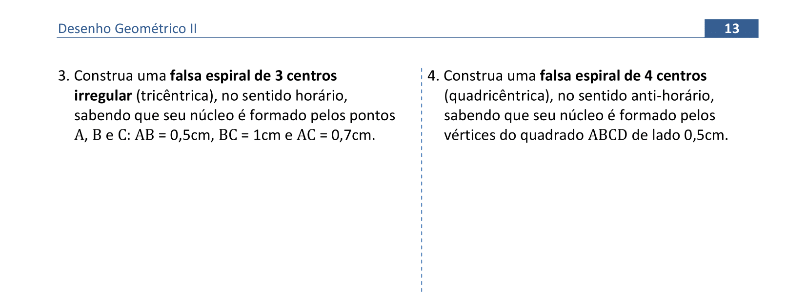
   

&#x1f4cf; &#x1f4d0; Resolução

	
Vamos construir falsas espirais com 3 e com 4 centros.

	  <ul class="slider">
		  <li>
			   <input type="radio" id="186" name="sl" checked>
			   <label for="186"></label>
			   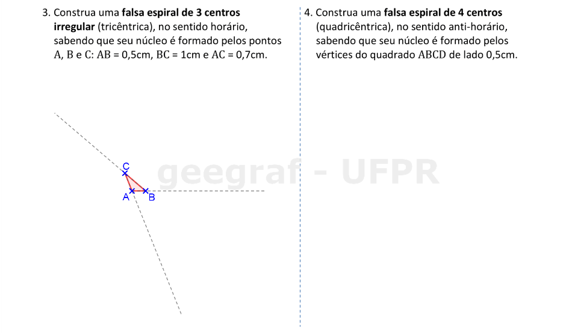
			   <figcaption>Construa o <b>&#9651;ABC</b> com as medidas indicadas dos lados. Defina as semi-retas <b>AB</b>, <b>BC</b> e <b>CA</b>.</figcaption>
		   </li>
		   <li>
			   <input type="radio" id="187" name="sl">
			   <label for="187"></label>
			   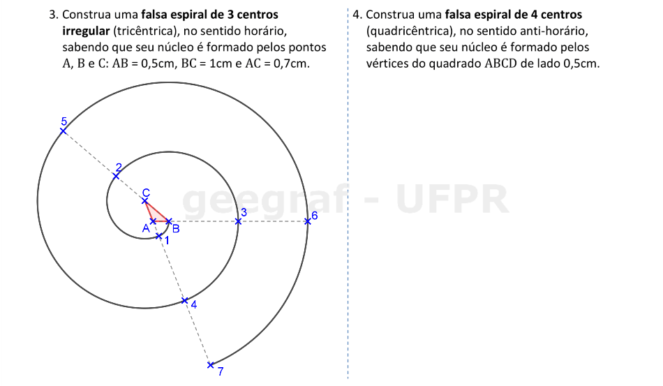
			   <figcaption>Começando com o centro <b>A</b> e fazendo o rodízio de centros, temos a construção similar à que fizemos com o triângulo equilátero.</figcaption>
		   </li>
		   <li>
			   <input type="radio" id="188" name="sl">
			   <label for="188"></label>
			   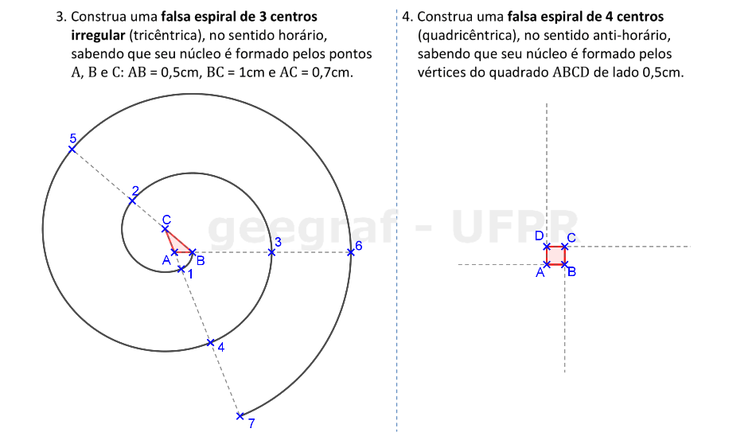
			   <figcaption>Construa o quadrado <b>ABCD</b> com lado de medida 0,5cm. Defina as semi-retas <b>BA</b>, <b>AD</b>, <b>DC</b> e <b>CB</b>.</figcaption>
		   </li>
		   <li>
			   <input type="radio" id="189" name="sl">
			   <label for="189"></label>
			   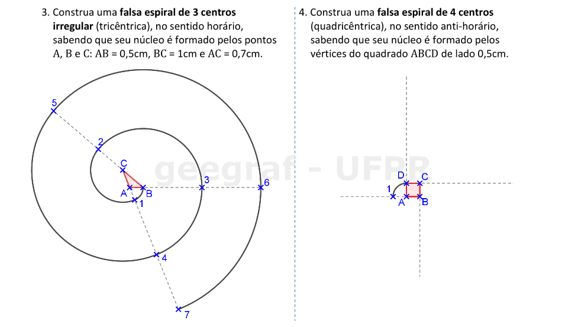
			   <figcaption>Começando com o centro <b>A</b>, o primeiro arco tem raio <b>AD</b>, amplitude de 90&deg; e termina na semi-reta limite <b>BA</b>.</figcaption>
		   </li>
		   <li>
			   <input type="radio" id="190" name="sl">
			   <label for="190"></label>
			   
			   <figcaption>Agora vamos usar o centro <b>B</b>, com raio <b>B1</b>, terminando na semi-reta <b>CB</b>, com amplitudes sempre iguais a 90&deg;.</figcaption>
		   </li>
		   <li>
			   <input type="radio" id="191" name="sl">
			   <label for="191"></label>
			   
			   <figcaption>Agora vamos usar o centro <b>C</b>, com raio <b>C2</b>, terminando na semi-reta <b>DC</b>.</figcaption>
		   </li>
		   <li>
			   <input type="radio" id="192" name="sl">
			   <label for="192"></label>
			   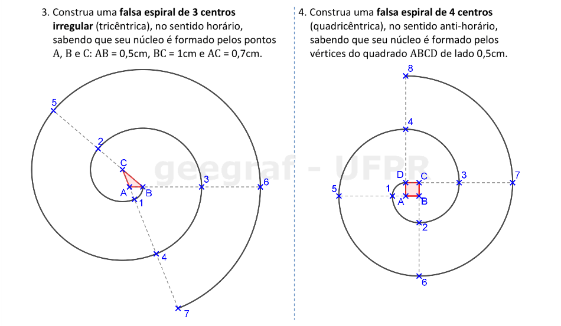
			   <figcaption>Prosseguimos com o rodízio dos centros e temos a construção da espiral regular de 4 centros.</figcaption>
		   </li>
		</ul>
		
  

   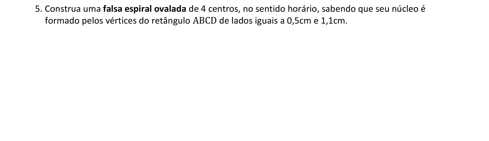
   

&#x1f4cf; &#x1f4d0; Solução

	
Usando o mesmo raciocínio do exercício anterior, podemos construir a espiral ovalada com o núcleo representado pelo retângulo de medidas indicadas.

	
	<figcaption>Utilize os prolongamentos dos lados do retângulo como retas limites e as amplitudes dos arcos todas com 90&deg;.</figcaption>
  

   
<a href="#modulo2" class="topo">voltar ao topo</a>

   
   

&#x1f4cf; &#x1f4d0; Resolução

	
Vamos construir a espiral de ouro começando pela construção do retângulo áureo.

	  <ul class="slider">
		  <li>
			   <input type="radio" id="193" name="sl" checked>
			   <label for="193"></label>
			   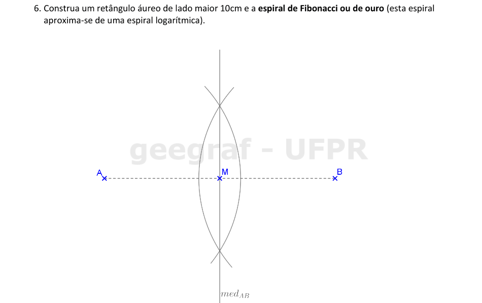
			   <figcaption>Construa a mediatriz de <b>AB</b>.</figcaption>
		   </li>
		   <li>
			   <input type="radio" id="194" name="sl">
			   <label for="194"></label>
			   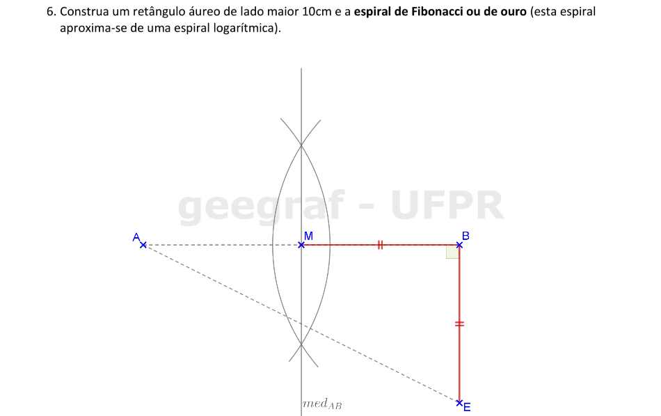
			   <figcaption>No segmento <b>BE &perp; AB</b>, encontre o ponto <b>E</b> tal que <b>BE = BM = AM</b>.</figcaption>
		   </li>
		   <li>
			   <input type="radio" id="195" name="sl">
			   <label for="195"></label>
			   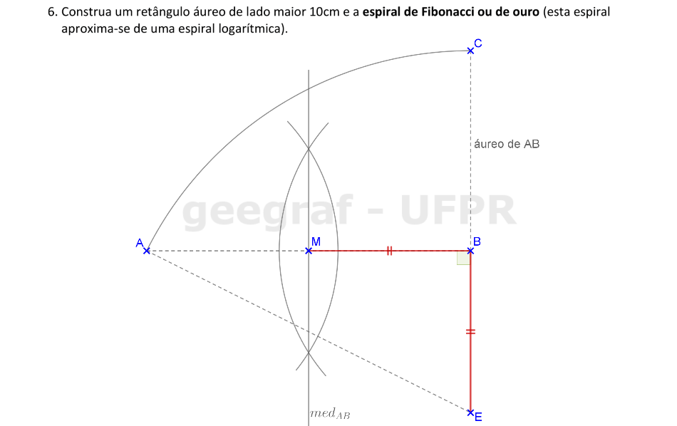
			   <figcaption>Construa o arco de circunferência com centro em <b>E</b> e raio <b>EA</b>. O segmento <b>BC</b> é áureo de <b>AB</b>.</figcaption>
		   </li>
		   <li>
			   <input type="radio" id="196" name="sl">
			   <label for="196"></label>
			   
			   <figcaption>Construa os lados <b>CD // AB</b> e <b>AD // BC</b> do retângulo áureo.</figcaption>
		   </li>
		   <li>
			   <input type="radio" id="197" name="sl">
			   <label for="197"></label>
			   
			   <figcaption>Defina o ponto <b>F &isin; AB</b> tal que <b>AF = AD</b>.</figcaption>
		   </li>
		   <li>
			   <input type="radio" id="198" name="sl">
			   <label for="198"></label>
			   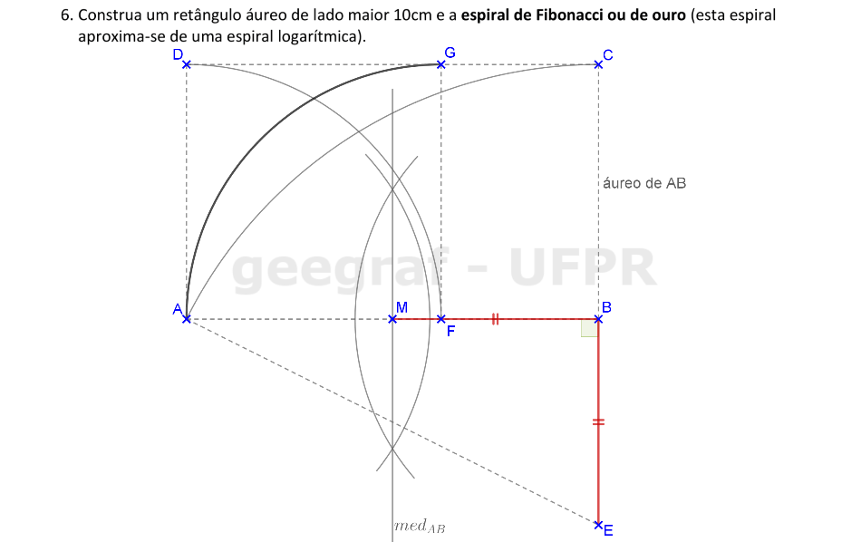
			   <figcaption>O primeiro arco da espiral de ouro tem centro <b>F</b> e raio <b>AF</b>.</figcaption>
		   </li>
		   <li>
			   <input type="radio" id="199" name="sl">
			   <label for="199"></label>
			   
			   <figcaption>Defina o ponto <b>I &isin; FG</b> tal que <b>GI = CG</b>.</figcaption>
		   </li>
		   <li>
			   <input type="radio" id="200" name="sl">
			   <label for="200"></label>
			   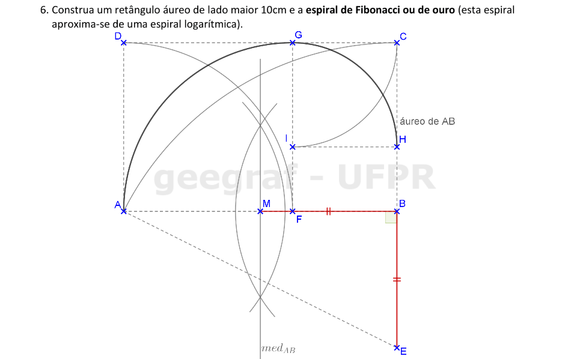
			   <figcaption>O segundo arco da espiral de ouro tem centro <b>I</b> e raio <b>IG</b>.</figcaption>
		   </li>
		   <li>
			   <input type="radio" id="201" name="sl">
			   <label for="201"></label>
			   
			   <figcaption>Defina o ponto <b>K &isin; IH</b> tal que <b>HK = HB</b>. O terceiro arco da espiral de ouro tem centro <b>K</b> e raio <b>HK</b>.</figcaption>
		   </li>
		   <li>
			   <input type="radio" id="202" name="sl">
			   <label for="202"></label>
			   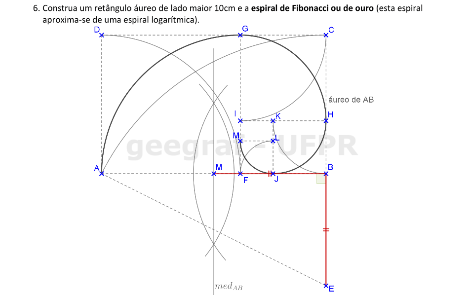
			   <figcaption>Defina o ponto <b>L &isin; JK</b> tal que <b>LJ = LM</b>. O quarto arco da espiral de ouro tem centro <b>L</b> e raio <b>LJ</b>.</figcaption>
		   </li>
		   <li>
			   <input type="radio" id="203" name="sl">
			   <label for="203"></label>
			   
			   <figcaption>Defina o ponto <b>N &isin; LM</b> tal que <b>MN = NO</b>. O quinto arco da espiral de ouro tem centro <b>N</b> e raio <b>MN</b>. Prosseguindo com o mesmo raciocínio, podemos encontrar outros arcos que definem a espiral de ouro.</figcaption>
		   </li>
		</ul>
		
  

   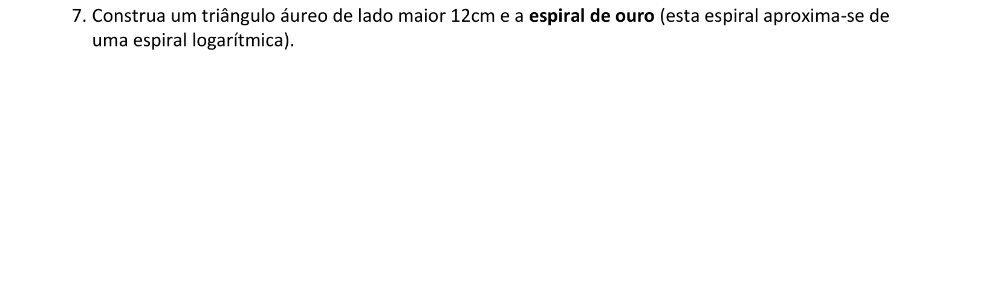
   

&#x1f4cf; &#x1f4d0; Resolução

	
Vamos construir a espiral de ouro começando pela construção do triângulo áureo.

	  <ul class="slider">
		   <li>
			   <input type="radio" id="206" name="sl">
			   <label for="206"></label>
			   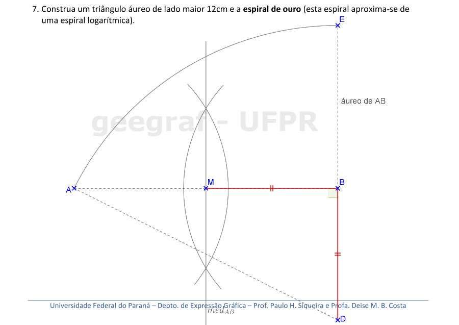
			   <figcaption>Construa o segmento áureo <b>EB</b> de <b>AB</b>.</figcaption>
		   </li>
		   <li>
			   <input type="radio" id="207" name="sl">
			   <label for="207"></label>
			   
			   <figcaption>Construa os lados <b>BC = AC = BE</b> do triângulo áureo. Os ângulos da base deste triângulo isósceles medem 36&deg; e o arco com centro <b>C</b> e raio <b>AC</b> é o primeiro arco da espiral áurea.</figcaption>
		   </li>
		   <li>
			   <input type="radio" id="208" name="sl">
			   <label for="208"></label>
			   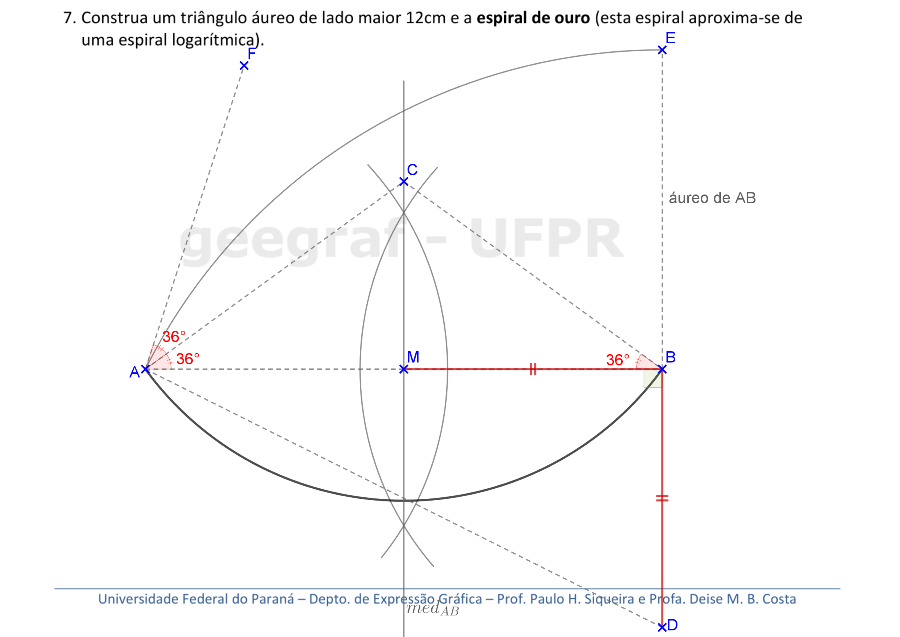
			   <figcaption>Defina o ponto <b>F</b> tal que <b>AF = AC</b> e <b>CAF = 36&deg;</b>.</figcaption>
		   </li>
		   <li>
			   <input type="radio" id="209" name="sl">
			   <label for="209"></label>
			   
			   <figcaption>Construa <b>AFG = 36&deg;</b>, definindo o <b>&#9651;AGF</b> áureo.</figcaption>
		   </li>
		   <li>
			   <input type="radio" id="210" name="sl">
			   <label for="210"></label>
			   
			   <figcaption>O arco com centro <b>G</b> e raio <b>GF</b> é o segundo arco da espiral áurea.</figcaption>
		   </li>
		   <li>
			   <input type="radio" id="211" name="sl">
			   <label for="211"></label>
			   
			   <figcaption>Defina o ponto <b>C'</b> tal que <b>FG = FC'</b> e <b>GFC' = 36&deg;</b>.</figcaption>
		   </li>
		   <li>
			   <input type="radio" id="212" name="sl">
			   <label for="212"></label>
			   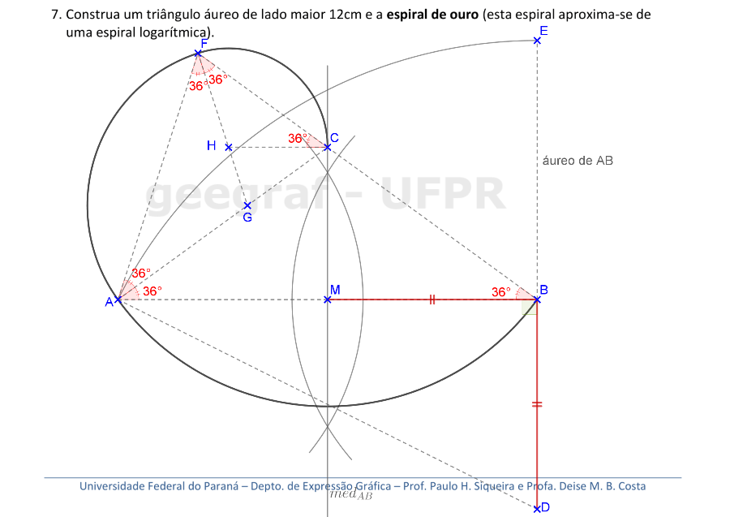
			   <figcaption>Construa <b>HCF = 36&deg;</b>, definindo o <b>&#9651;HCF</b> áureo. O arco com centro <b>H</b> e raio <b>HF</b> é o terceiro arco da espiral áurea.</figcaption>
		   </li>
		   <li>
			   <input type="radio" id="213" name="sl">
			   <label for="213"></label>
			   
			   <figcaption>Defina o ponto <b>G'</b> tal que <b>CG' = HC</b> e <b>HCG' = 36&deg;</b>. Construa <b>CGI = 36&deg;</b>, definindo o <b>&#9651;IGC</b> áureo. O arco com centro <b>I</b> e raio <b>IG</b> é o quarto arco da espiral áurea. Prosseguindo com o mesmo raciocínio, podemos encontrar outros arcos que definem a espiral de ouro.</figcaption>
		   </li>
		</ul>
		
  

   
<a href="#modulo2" class="topo">voltar ao topo</a>

   
   

&#x1f4cf; &#x1f4d0; Resolução

	
Vamos construir a Voluta Jônica começando pela construção dos segmentos perpendiculares aos lados do quadrado.

	  <ul class="slider">
		   <li>
			   <input type="radio" id="214" name="sl">
			   <label for="214"></label>
			   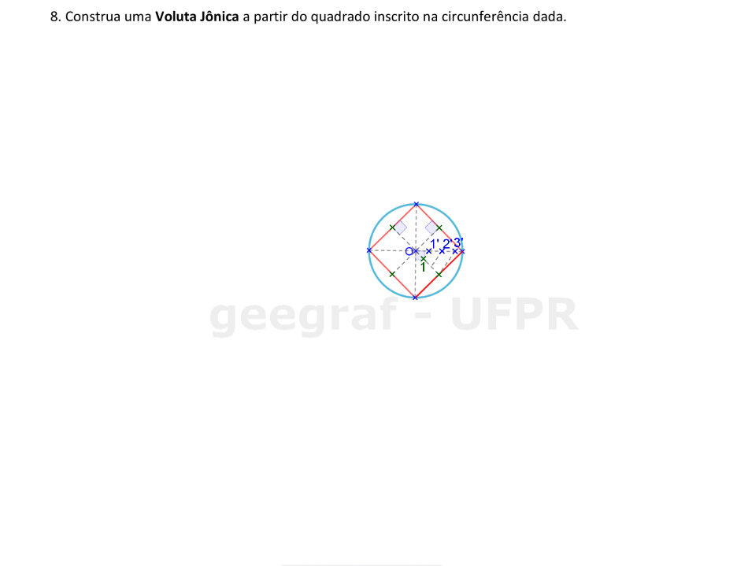
			   <figcaption>Usando o teorema de Tales, divida um dos segmentos perpediculares a um lado do quadrado em 3 partes iguais: o primeiro ponto será chamado de <b>1</b>.</figcaption>
		   </li>
		   <li>
			   <input type="radio" id="215" name="sl">
			   <label for="215"></label>
			   
			   <figcaption>Construa a circunferência de centro <b>O</b> e raio <b>O1</b> para encontrar nos outros segmentos perpendiculares aos lados do quadrado os pontos <b>2</b>, <b>3</b> e <b>4</b>.</figcaption>
		   </li>
		   <li>
			   <input type="radio" id="216" name="sl">
			   <label for="216"></label>
			   
			   <figcaption>Usando a mesma ideia, com a segunda divisão obtida pela construção de Tales, construa a circunferência de centro <b>O</b> e raio <b>O5</b> para encontrar nos outros segmentos perpendiculares aos lados do quadrado os pontos <b>6</b>, <b>7</b> e <b>8</b>. As interseções das perpendiculares aos lados do quadrado são os pontos <b>9</b>, <b>10</b>, <b>11</b> e <b>12</b>.</figcaption>
		   </li>
		   <li>
			   <input type="radio" id="217" name="sl">
			   <label for="217"></label>
			   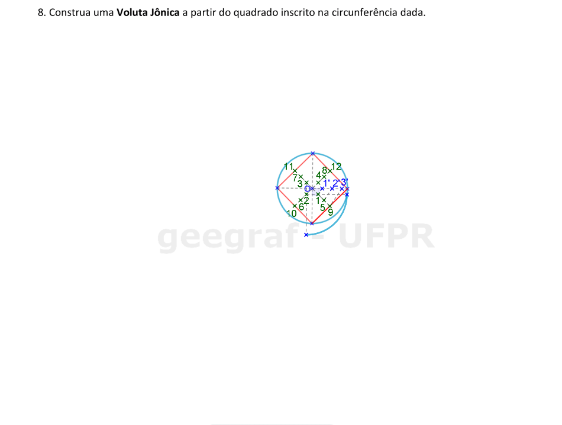
			   <figcaption>Defina as semi-retas limites <b>21</b> e <b>32</b> para construir o primeiro arco da voluta com centro <b>2</b>, começando pela interseção da semi-reta <b>21</b> com a circunferência circunscrita ao quadrado.</figcaption>
		   </li>
		   <li>
			   <input type="radio" id="218" name="sl">
			   <label for="218"></label>
			   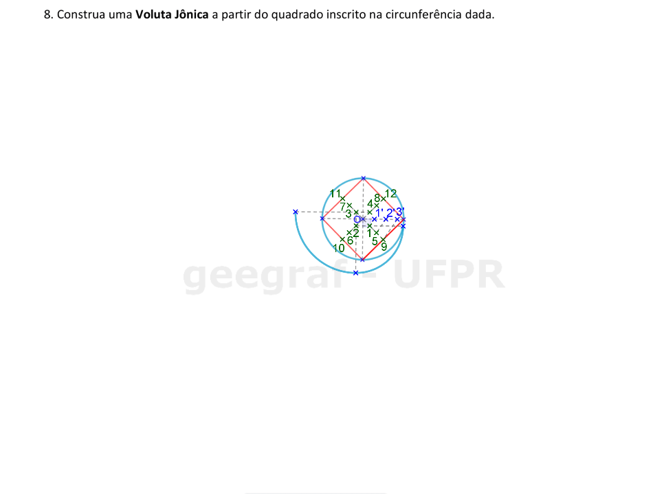
			   <figcaption>Defina a semi-reta limite <b>43</b> para construir o segundo arco da voluta com centro <b>3</b>, começando pela interseção da semi-reta <b>32</b> com o arco anterior da voluta.</figcaption>
		   </li>
		   <li>
			   <input type="radio" id="219" name="sl">
			   <label for="219"></label>
			   
			   <figcaption>Defina a semi-reta limite <b>54</b> para construir o próximo arco da voluta com centro <b>4</b>, começando pela interseção da semi-reta <b>43</b> com o arco anterior da voluta.</figcaption>
		   </li>
		   <li>
			   <input type="radio" id="220" name="sl">
			   <label for="220"></label>
			   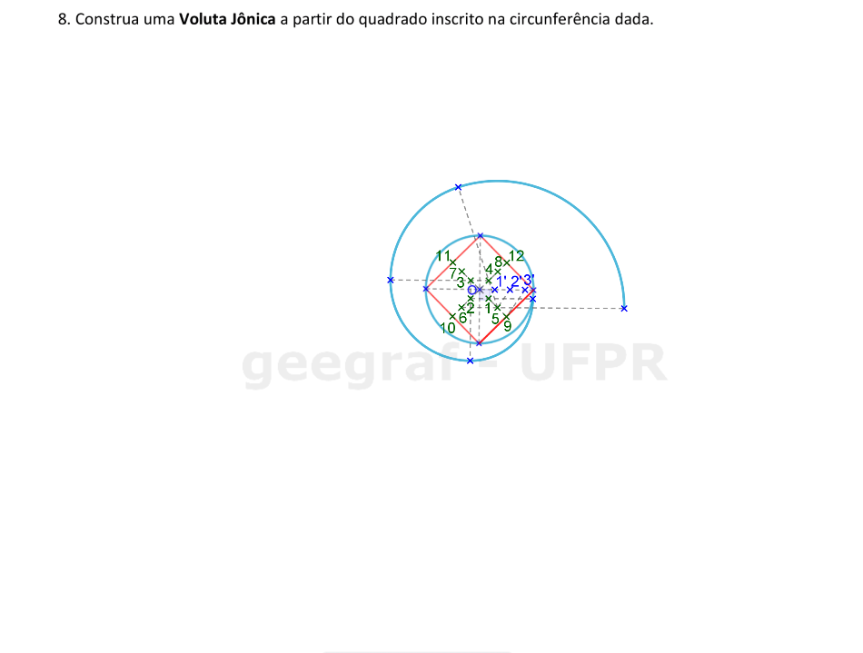
			   <figcaption>Defina a semi-reta limite <b>65</b> para construir o próximo arco da voluta com centro <b>5</b>, começando pela interseção da semi-reta <b>54</b> com o arco anterior da voluta.</figcaption>
		   </li>
		   <li>
			   <input type="radio" id="221" name="sl">
			   <label for="221"></label>
			   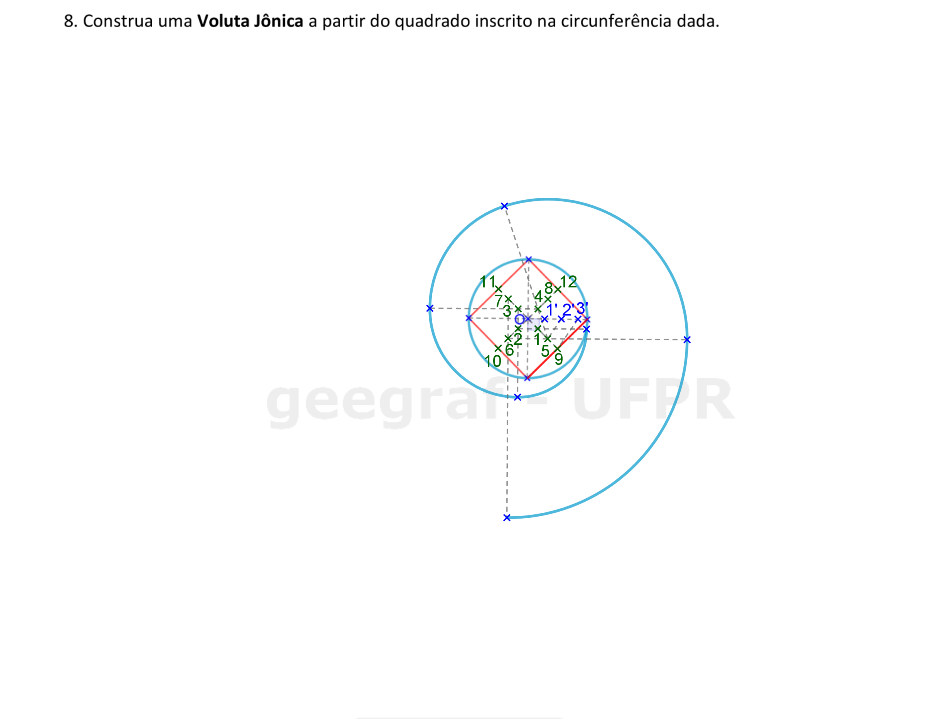
			   <figcaption>Defina a semi-reta limite <b>76</b> para construir o próximo arco da voluta com centro <b>6</b>, começando pela interseção da semi-reta <b>65</b> com o arco anterior da voluta.</figcaption>
		   </li>
		   <li>
			   <input type="radio" id="222" name="sl">
			   <label for="222"></label>
			   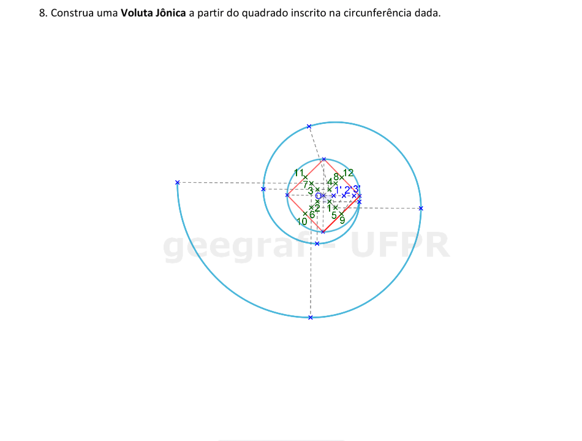
			   <figcaption>Defina a semi-reta limite <b>87</b> para construir o próximo arco da voluta com centro <b>7</b>, começando pela interseção da semi-reta <b>76</b> com o arco anterior da voluta.</figcaption>
		   </li>
		   <li>
			   <input type="radio" id="223" name="sl">
			   <label for="223"></label>
			   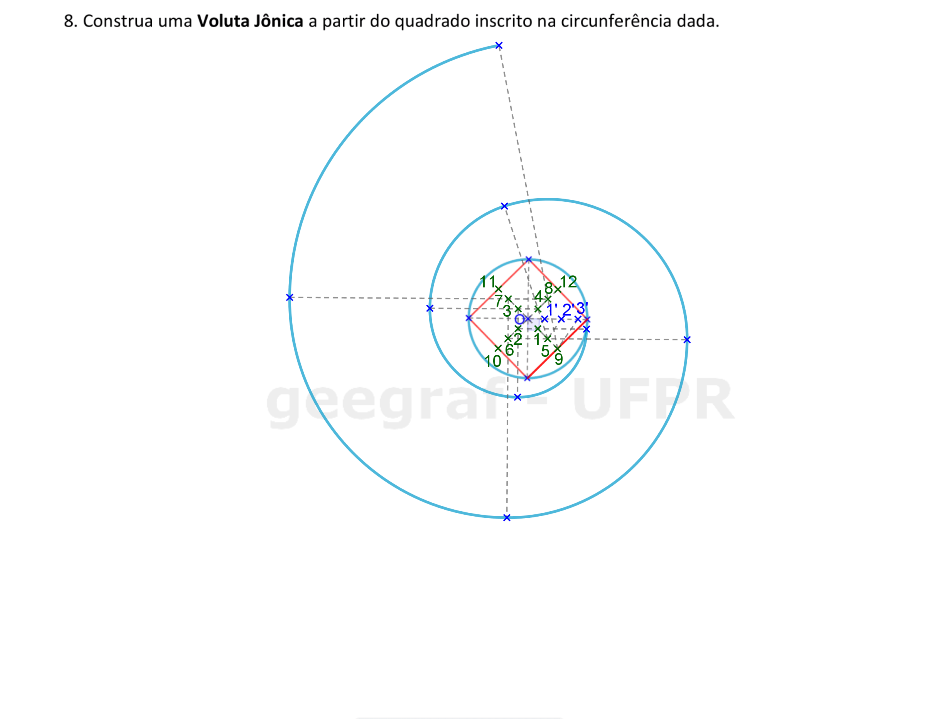
			   <figcaption>Defina a semi-reta limite <b>98</b> para construir o próximo arco da voluta com centro <b>8</b>, começando pela interseção da semi-reta <b>87</b> com o arco anterior da voluta.</figcaption>
		   </li>
		   <li>
			   <input type="radio" id="224" name="sl">
			   <label for="224"></label>
			   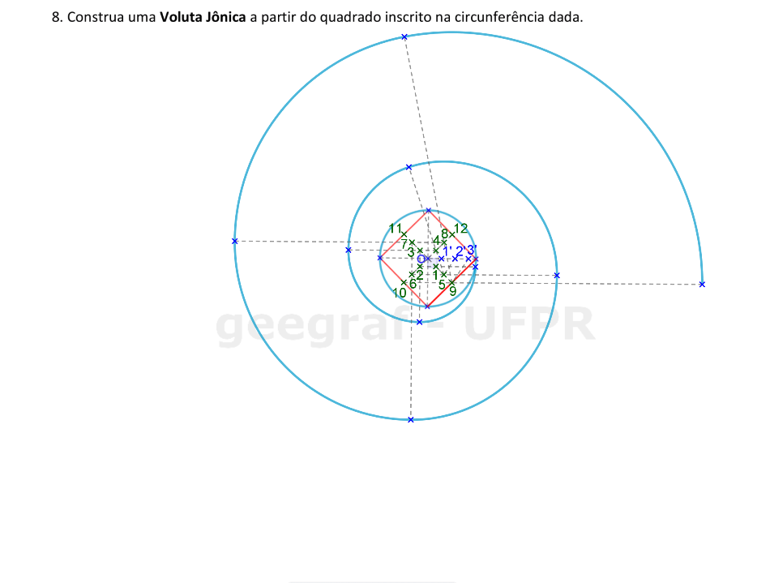
			   <figcaption>Defina a semi-reta limite <b>10-9</b> para construir o próximo arco da voluta com centro <b>9</b>, começando pela interseção da semi-reta <b>98</b> com o arco anterior da voluta.</figcaption>
		   </li>
		   <li>
			   <input type="radio" id="225" name="sl">
			   <label for="225"></label>
			   
			   <figcaption>Defina a semi-reta limite <b>11-10</b> para construir o próximo arco da voluta com centro <b>10</b>, começando pela interseção da semi-reta <b>10-9</b> com o arco anterior da voluta.</figcaption>
		   </li>
		   <li>
			   <input type="radio" id="226" name="sl">
			   <label for="226"></label>
			   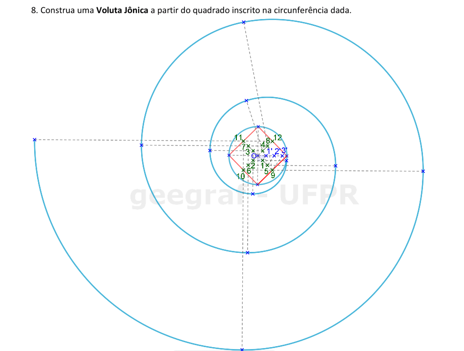
			   <figcaption>Para finalizar a construção, defina a semi-reta limite <b>12-11</b> para construir o próximo arco da voluta com centro <b>11</b>, começando pela interseção da semi-reta <b>11-10</b> com o arco anterior da voluta.</figcaption>
		   </li>
		</ul>
		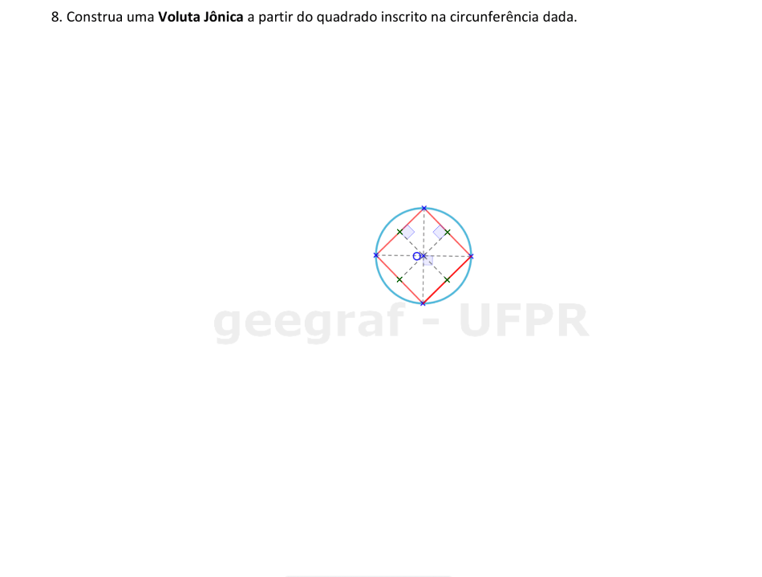
  

   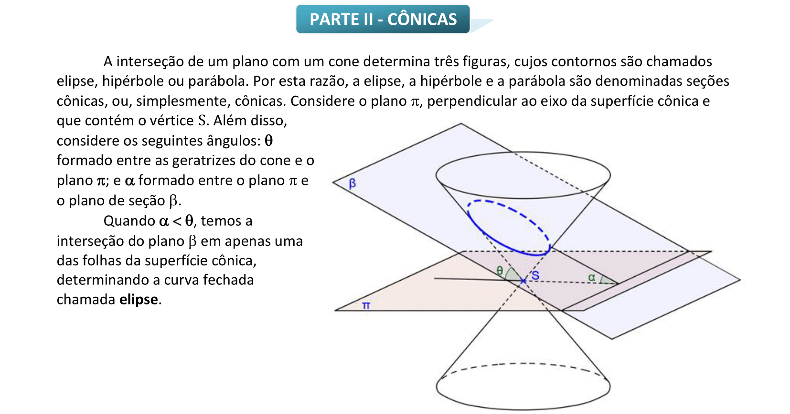
   
<a href="#modulo2" class="topo">voltar ao topo</a>

   
   
<a href="#modulo2" class="topo">voltar ao topo</a>

   
   

&#x1f4d1; Propriedades

	
Vamos acompanhar a demonstração do teorema de Apollonius para o caso de uma elipse. Considere as esferas inscritas na superfície cônica e tangentes ao plano de seção.

	  <ul class="slider">
		   <li>
			   <input type="radio" id="227" name="sl">
			   <label for="227"></label>
			   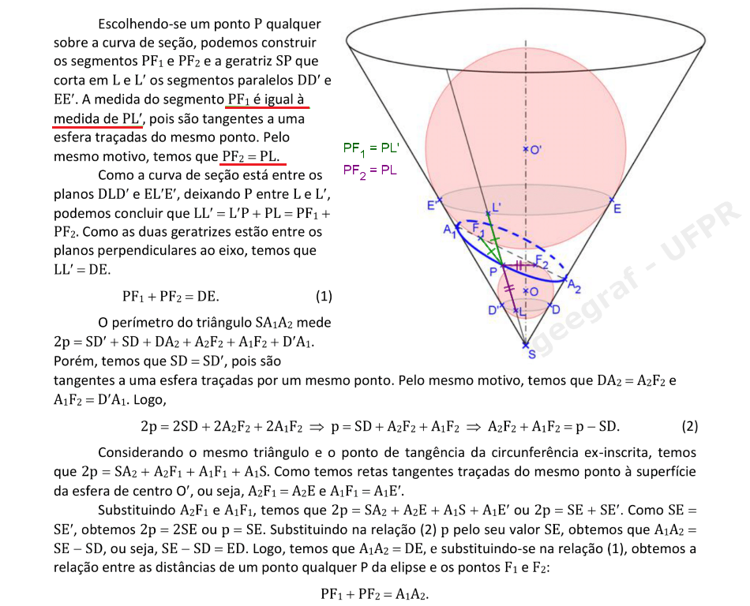
			   <figcaption>Usando o conceito de potência do ponto <b>P</b> em relação às esferas de centros <b>O'</b> e <b>O</b>, encontramos que <b>PF1 = PL'</b> e <b>PF2 = PL</b>.</figcaption>
		   </li>
		   <li>
			   <input type="radio" id="228" name="sl">
			   <label for="228"></label>
			   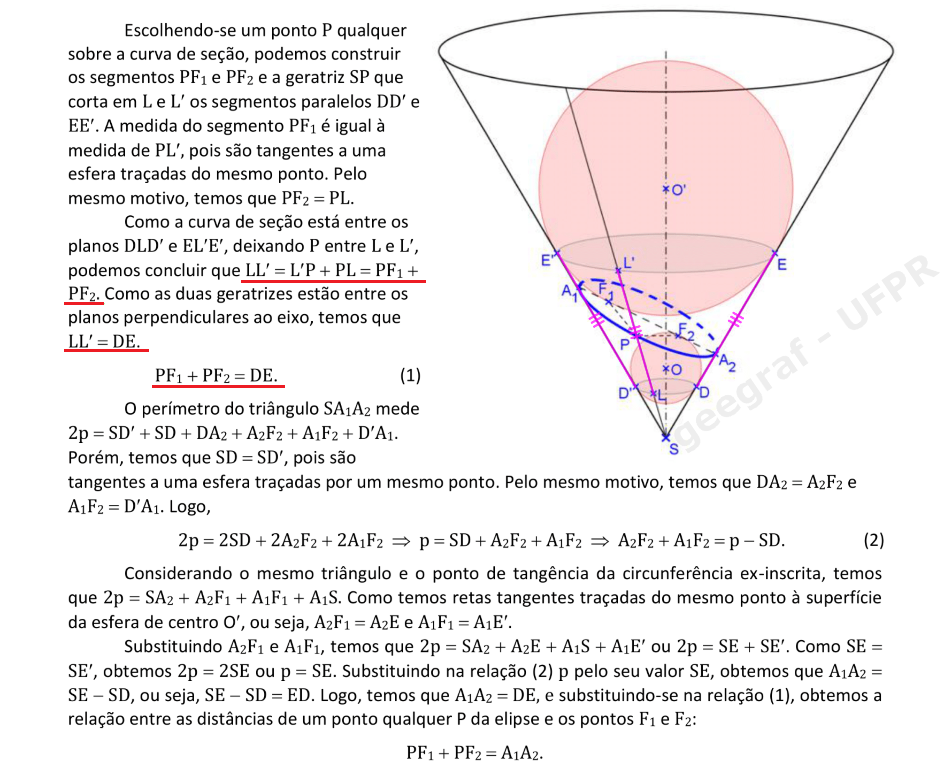
			   <figcaption>Como os planos de seção definidos por <b>E</b> e <b>E'</b> e por <b>D</b> e <b>D'</b> são perpendiculares ao eixo da superfície cônica, temos que <b>DE = D'E' = LL'</b>. Portanto, temos que <b>PF1 + PF2 = LL' = DE</b>.</figcaption>
		   </li>
		   <li>
			   <input type="radio" id="229" name="sl">
			   <label for="229"></label>
			   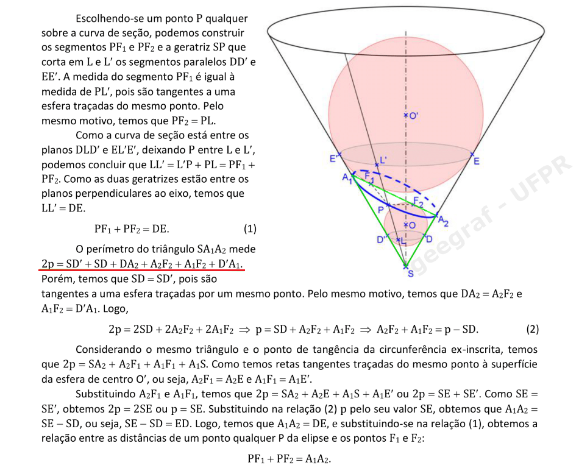
			   <figcaption>Calculando o perímetro do <b>&#9651;SA1A2</b>, encontramos que <b>2p = SD' + SD + DA2 + A2F2 + A1F2 + D'A1</b>.</figcaption>
		   </li>
		   <li>
			   <input type="radio" id="230" name="sl">
			   <label for="230"></label>
			   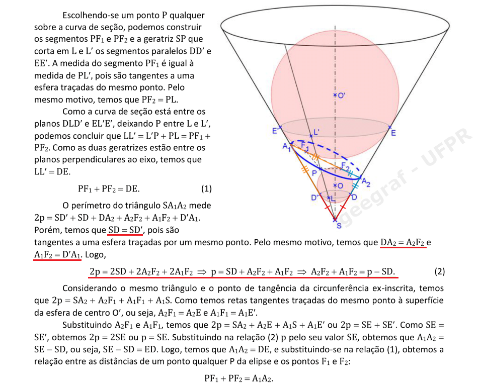
			   <figcaption>Usando a potência dos pontos <b>A1</b> e <b>A2</b> em relação às esferas, encontramos que <b>DA2 = A2F2</b> e <b>A1F2 = D'A1</b>. Substituindo estas medidas no perímetro do <b>&#9651;SA1A2</b>, encontramos que <b>A2F2 + A1F2 = p - SD</b>.</figcaption>
		   </li>
		   <li>
			   <input type="radio" id="231" name="sl">
			   <label for="231"></label>
			   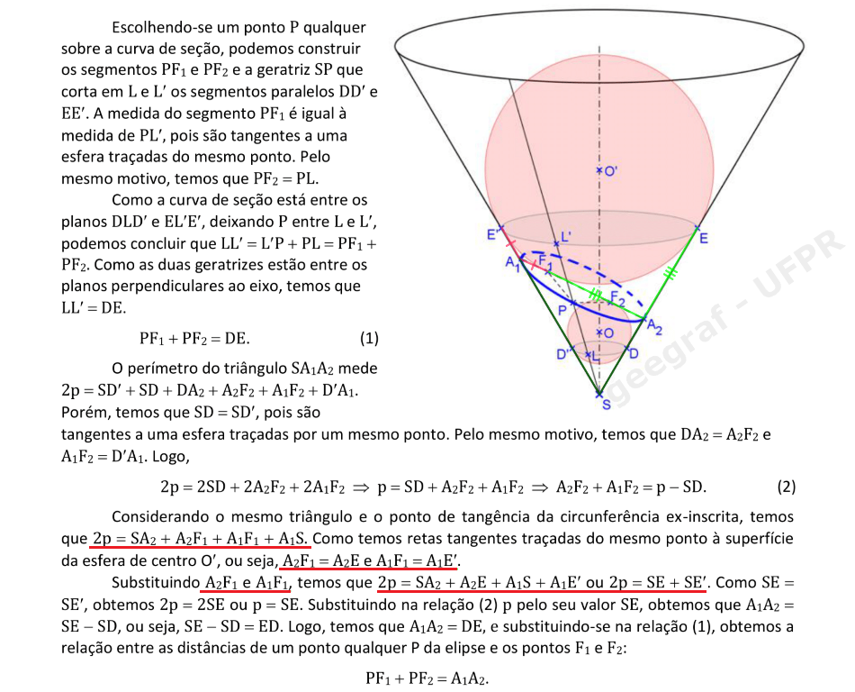
			   <figcaption>Analisando a circunferência ex-inscrita do <b>&#9651;SA1A2</b>, temos que <b>A2F1 = A2E</b> e <b>A1F1 = A1E'</b>. Substituindo estas medidas no perímetro do <b>&#9651;SA1A2</b>, obtemos que <b>2p = SE + SE'</b>.</figcaption>
		   </li>
		   <li>
			   <input type="radio" id="232" name="sl">
			   <label for="232"></label>
			   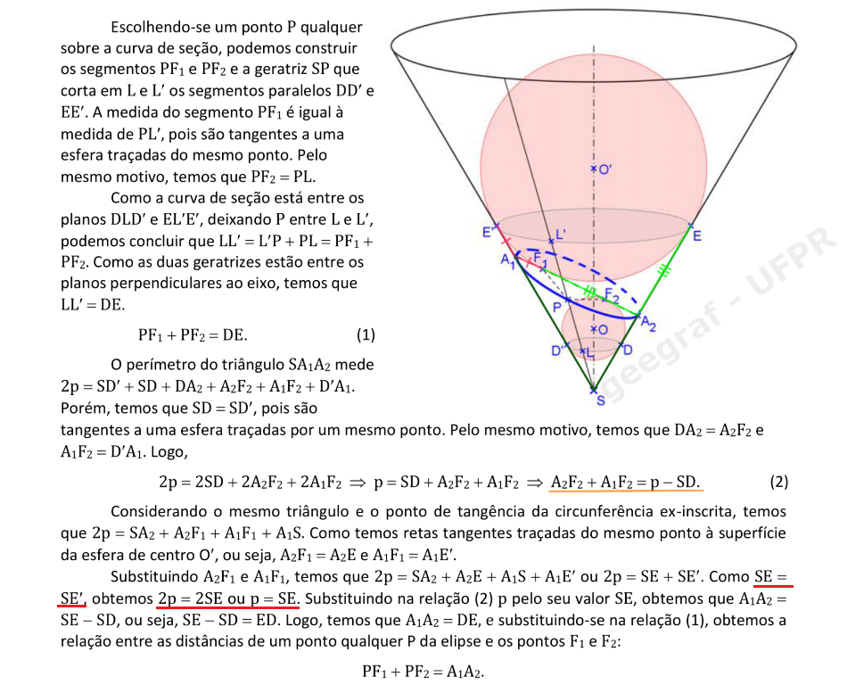
			   <figcaption>Como <b>SE = SE'</b>, temos que <b>p = SE</b>.</figcaption>
		   </li>
		   <li>
			   <input type="radio" id="233" name="sl">
			   <label for="233"></label>
			   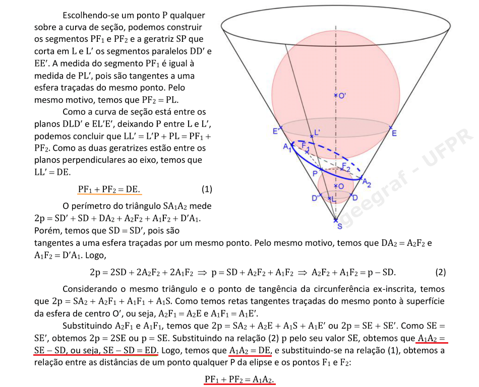
			   <figcaption>Portanto, temos que <b>SE - SD = ED</b> e  <b>A1A2 = DE</b>, ou seja, <b>PF1 + PF2 = DE = A1A2</b>.</figcaption>
		   </li>
		</ul>
		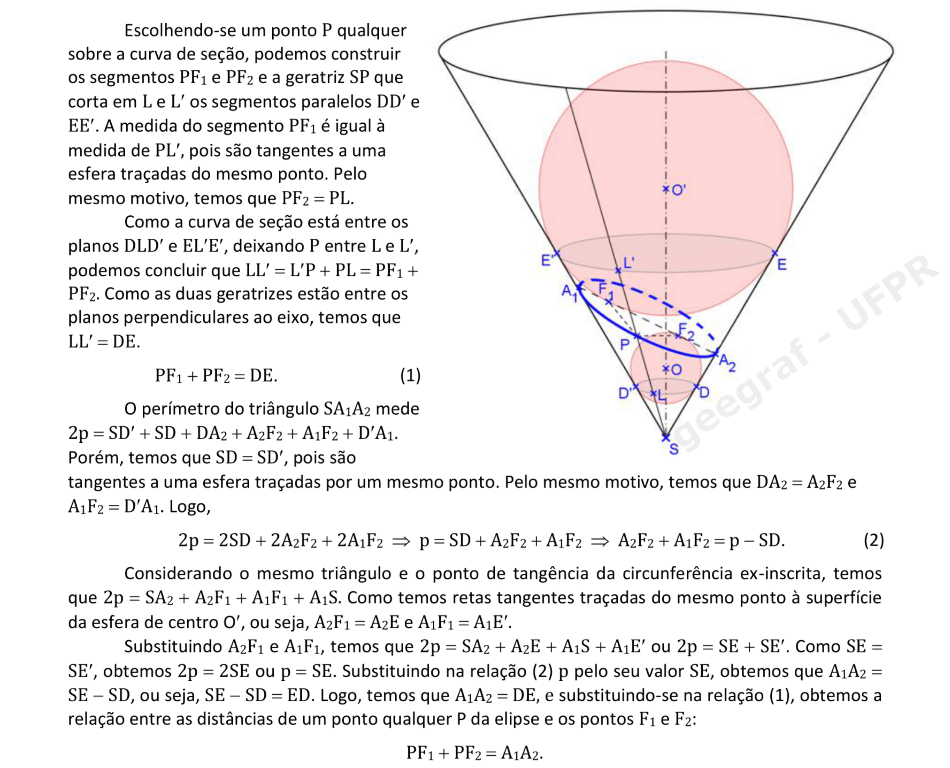
  

   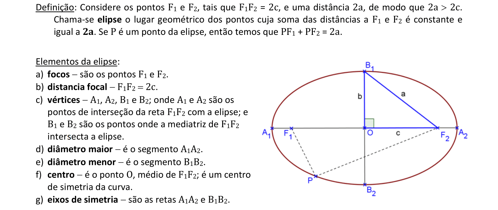
   
<a href="#modulo2" class="topo">voltar ao topo</a>

   
   

&#x1f4cf; &#x1f4d0; Resolução

	
Construiremos uma elipse dados um vértice, o centro e o foco.

	  <ul class="slider">
		   <li>
			   <input type="radio" id="234" name="sl">
			   <label for="234"></label>
			   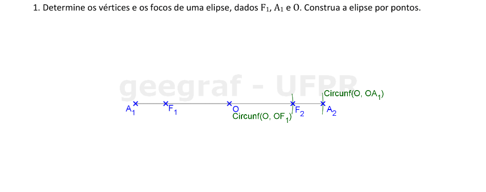
			   <figcaption>Vamos iniciar encontrando os simétricos de <b>A1</b> e de <b>F1</b> em relação ao centro.</figcaption>
		   </li>
		   <li>
			   <input type="radio" id="235" name="sl">
			   <label for="235"></label>
			   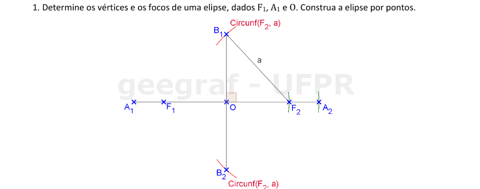
			   <figcaption>A distância entre os focos e os vértices do diâmetro menor é igual ao semi-diâmetro maior <b>a</b>. Logo, para achar <b>B1</b> e <b>B2</b>, basta encontrar a interseção da reta perpendicular ao diâmetro <b>A1A2</b> que passa pelo centro com a <b>Circunf(F2, a)</b>.</figcaption>
		   </li>
		   <li>
			   <input type="radio" id="236" name="sl">
			   <label for="236"></label>
			   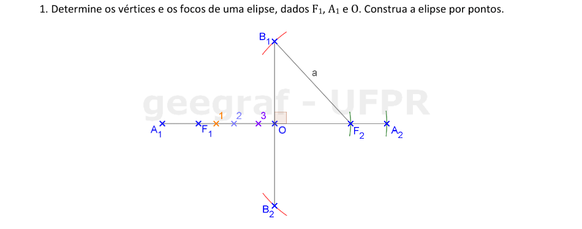
			   <figcaption>Para construir uma elipse por pontos, vamos determinar os pontos <b>1</b>, <b>2</b> e <b>3</b> entre o foco <b>F1</b> e o centro <b>O</b>. Cada ponto determinará 4 pontos da elipse.</figcaption>
		   </li>
		   <li>
			   <input type="radio" id="237" name="sl">
			   <label for="237"></label>
			   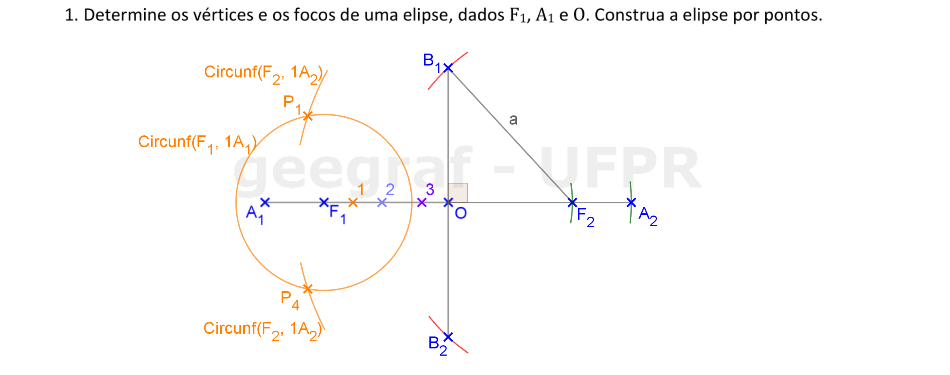
			   <figcaption>Como <b>PF1 + PF2 = 2a</b>, tome os raios com medidas iguais a <b>1A1</b> e <b>1A2</b>. As interseções das circunferências com centros em <b>F1</b> e <b>F2</b> com raios <b>1A1</b> e <b>1A2</b> são dois pontos da elipse.</figcaption>
		   </li>
		   <li>
			   <input type="radio" id="238" name="sl">
			   <label for="238"></label>
			   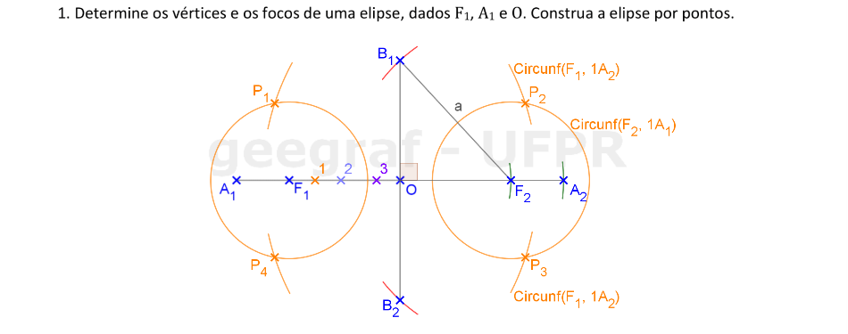
			   <figcaption>Invertendo-se os centros, mas usando as mesmas medidas de raios, obtemos mais dois pontos da cônica: as circunferências com centros em <b>F1</b> e <b>F2</b> com raios <b>1A2</b> e <b>1A1</b> determinam mais dois pontos da elipse.</figcaption>
		   </li>
		   <li>
			   <input type="radio" id="239" name="sl">
			   <label for="239"></label>
			   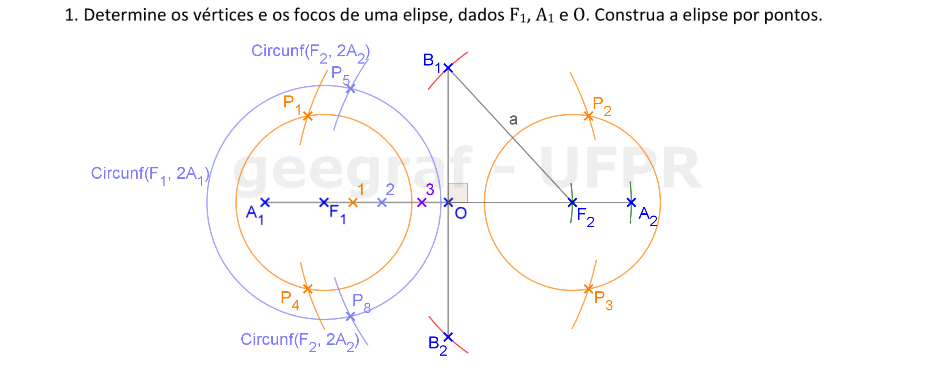
			   <figcaption>Usando o mesmo raciocínio com o ponto <b>2</b>, tomamos os raios com medidas iguais a <b>2A1</b> e <b>2A2</b>. As interseções das circunferências com centros em <b>F1</b> e <b>F2</b> com raios <b>2A1</b> e <b>2A2</b> são dois pontos da elipse.</figcaption>
		   </li>
		   <li>
			   <input type="radio" id="240" name="sl">
			   <label for="240"></label>
			   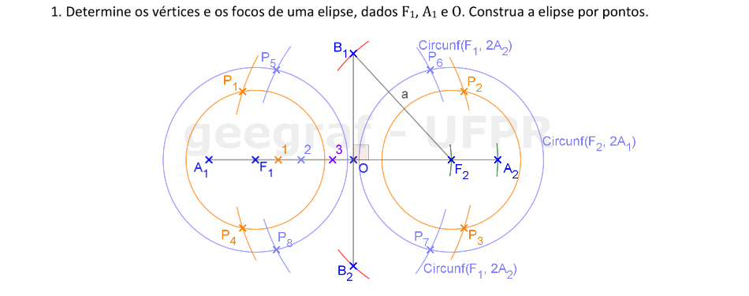
			   <figcaption>Invertendo-se os centros, mas usando as mesmas medidas de raios, obtemos mais dois pontos da cônica: as circunferências com centros em <b>F1</b> e <b>F2</b> com raios <b>2A2</b> e <b>2A1</b> determinam mais dois pontos da elipse.</figcaption>
		   </li>
		   <li>
			   <input type="radio" id="241" name="sl">
			   <label for="241"></label>
			   
			   <figcaption>Usando o mesmo raciocínio com o ponto <b>3</b>, tomamos os raios com medidas iguais a <b>3A1</b> e <b>3A2</b>. As interseções das circunferências com centros em <b>F1</b> e <b>F2</b> com raios <b>3A1</b> e <b>3A2</b> são dois pontos da elipse.</figcaption>
		   </li>
		   <li>
			   <input type="radio" id="242" name="sl">
			   <label for="242"></label>
			   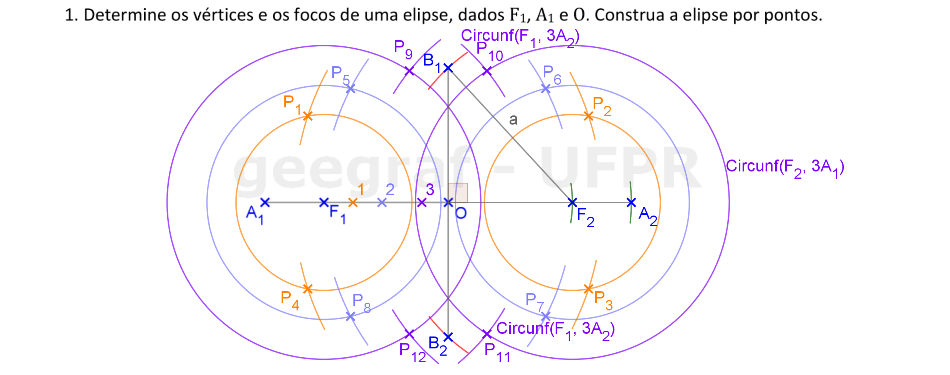
			   <figcaption>Invertendo-se os centros, mas usando as mesmas medidas de raios, obtemos mais dois pontos da cônica: as circunferências com centros em <b>F1</b> e <b>F2</b> com raios <b>3A2</b> e <b>3A1</b> determinam mais dois pontos da elipse.</figcaption>
		   </li>
		   <li>
			   <input type="radio" id="243" name="sl">
			   <label for="243"></label>
			   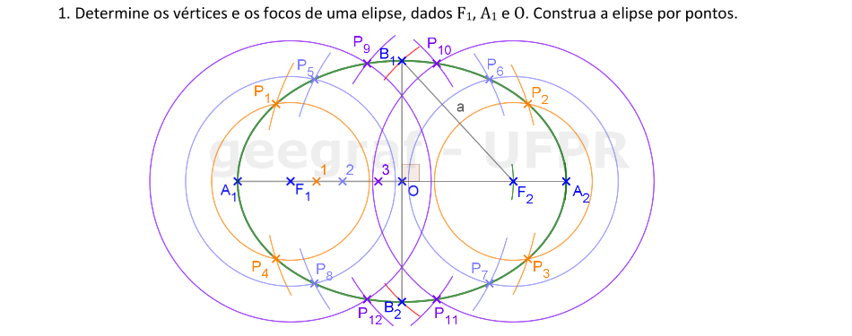
			   <figcaption>Depois, basta traçar a cônica à mão livre usando os pontos encontrados e os vértices.</figcaption>
		   </li>
		</ul>
		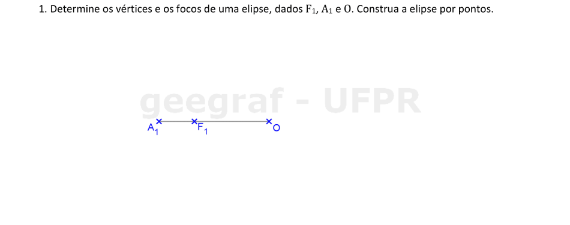
  

   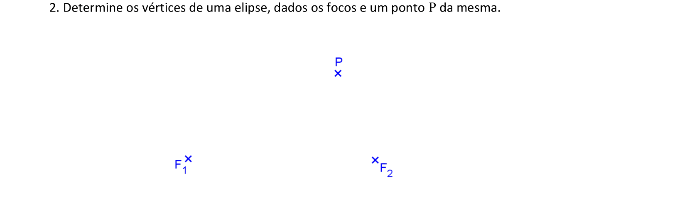
   

&#x1f4cf; &#x1f4d0; Resolução

	
Vamos construir os elementos principais de uma elipse dados os focos e um ponto da cônica.

	  <ul class="slider">
		   <li>
			   <input type="radio" id="244" name="sl">
			   <label for="244"></label>
			   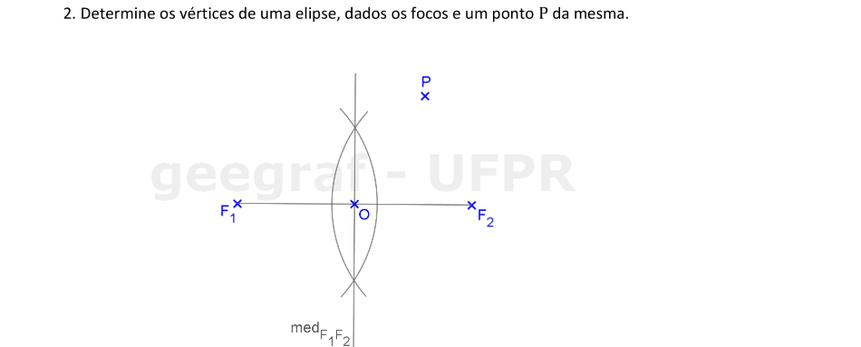
			   <figcaption>Vamos iniciar encontrando o centro da elipse usando a mediatriz de <b>F1F2</b>.</figcaption>
		   </li>
		   <li>
			   <input type="radio" id="245" name="sl">
			   <label for="245"></label>
			   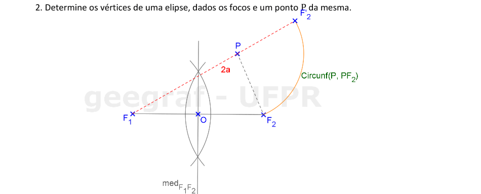
			   <figcaption>Como <b>PF1 + PF2 = 2a</b>, podemos prolongar <b>PF1</b> e marcar a medida <b>PF2</b>, obtendo-se o ponto <b>F'2</b>. Logo, temos que <b>F1F'2 = 2a</b>.</figcaption>
		   </li>
		   <li>
			   <input type="radio" id="246" name="sl">
			   <label for="246"></label>
			   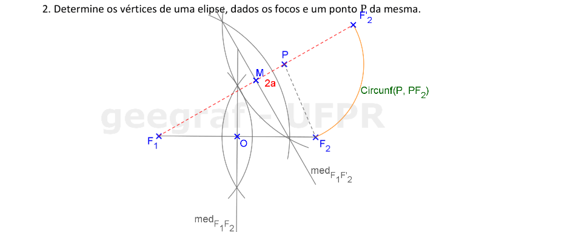
			   <figcaption>Encontre a mediatriz de <b>F1F'2</b> para determinar os vértices do diâmetro maior da elipse.</figcaption>
		   </li>
		   <li>
			   <input type="radio" id="247" name="sl">
			   <label for="247"></label>
			   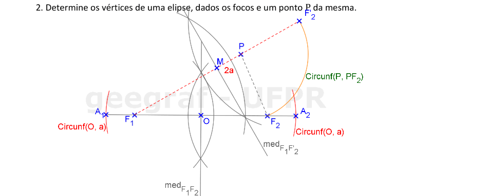
			   <figcaption>Determine <b>OA1 = OA2 = a</b>.</figcaption>
		   </li>
		   <li>
			   <input type="radio" id="248" name="sl">
			   <label for="248"></label>
			   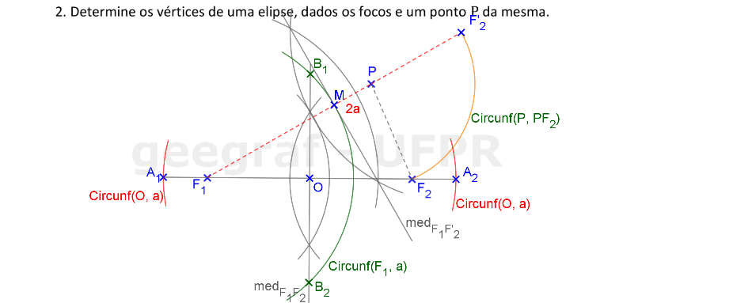
			   <figcaption>Com a circunferência de centro em <b>F1</b> e raio <b>a</b>, encontramos os vértices <b>B1</b> e <b>B2</b> na mediatriz de <b>F1F2</b>.</figcaption>
		   </li>
		   <li>
			   <input type="radio" id="249" name="sl">
			   <label for="249"></label>
			   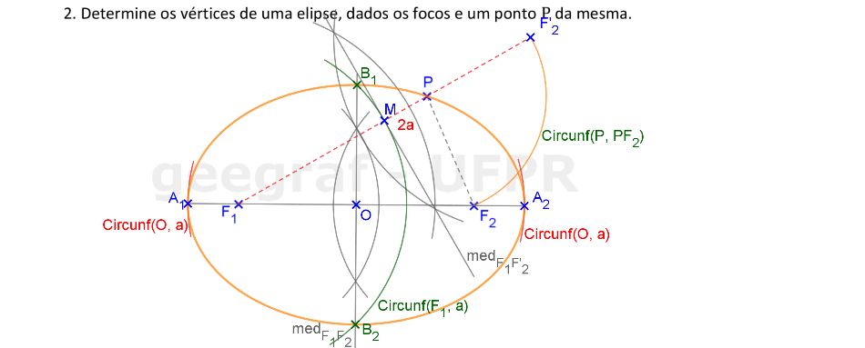
			   <figcaption>Depois, basta construir a elipse à mão livre.</figcaption>
		   </li>
		</ul>
		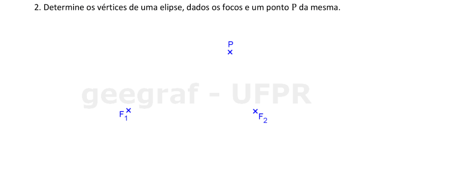
  

   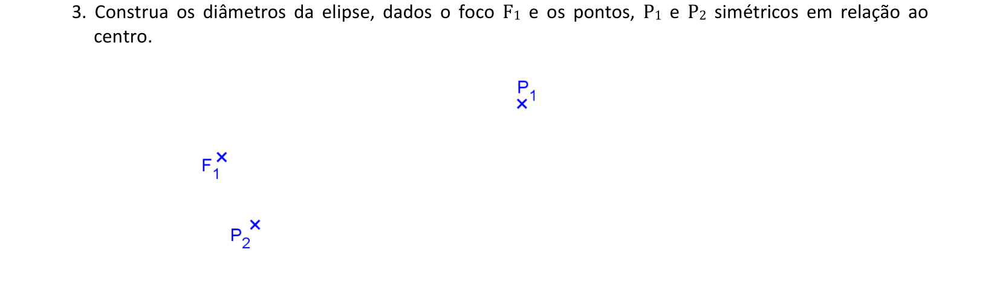
   

&#x1f4cf; &#x1f4d0; Resolução

	
Vamos construir os elementos principais de uma elipse dados os pontos simétricos em relação ao centro e um foco da cônica.

	  <ul class="slider">
		   <li>
			   <input type="radio" id="250" name="sl">
			   <label for="250"></label>
			   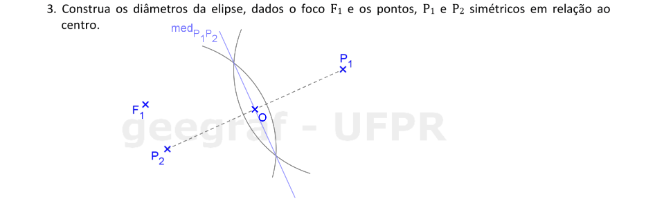
			   <figcaption>Vamos iniciar encontrando o centro da elipse usando a mediatriz de <b>P1P2</b>.</figcaption>
		   </li>
		   <li>
			   <input type="radio" id="251" name="sl">
			   <label for="251"></label>
			   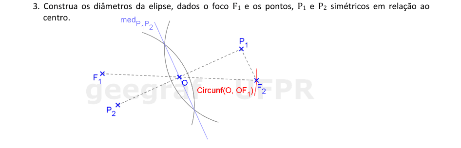
			   <figcaption>Podemos determinar <b>OF1 = OF2</b>.</figcaption>
		   </li>
		   <li>
			   <input type="radio" id="252" name="sl">
			   <label for="252"></label>
			   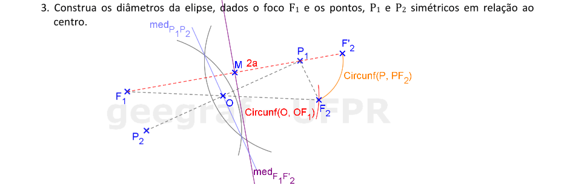
			   <figcaption>Como <b>P1F1 + P1F2 = 2a</b>, podemos prolongar <b>P1F1</b> e marcar a medida <b>P1F2</b>, obtendo-se o ponto <b>F'2</b>. Logo, temos que <b>F1F'2 = 2a</b>. Encontre a mediatriz de <b>F1F'2</b> para determinar os vértices do diâmetro maior da elipse.</figcaption>
		   </li>
		   <li>
			   <input type="radio" id="253" name="sl">
			   <label for="253"></label>
			   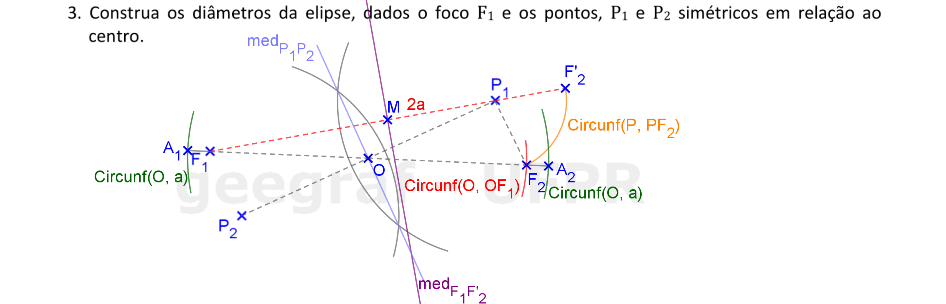
			   <figcaption>Determine <b>OA1 = OA2 = a</b>.</figcaption>
		   </li>
		   <li>
			   <input type="radio" id="254" name="sl">
			   <label for="254"></label>
			   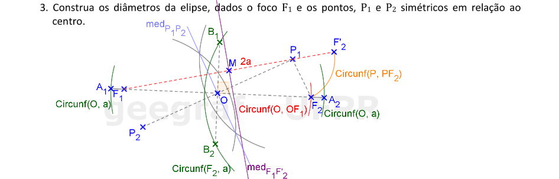
			   <figcaption>Com a circunferência de centro em <b>F2</b> e raio <b>a</b>, encontramos os vértices <b>B1</b> e <b>B2</b> na reta perpendicular ao eixo maior que passa pelo centro.</figcaption>
		   </li>
		   <li>
			   <input type="radio" id="255" name="sl">
			   <label for="255"></label>
			   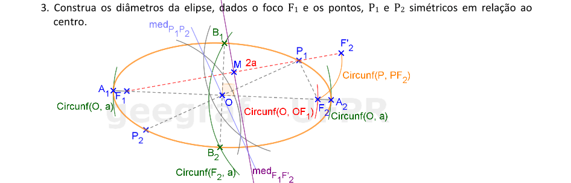
			   <figcaption>Para finalizar, basta construir a elipse à mão livre.</figcaption>
		   </li>
		</ul>
		
  

   
<a href="#modulo2" class="topo">voltar ao topo</a>

   
   
<a href="#modulo2" class="topo">voltar ao topo</a>

   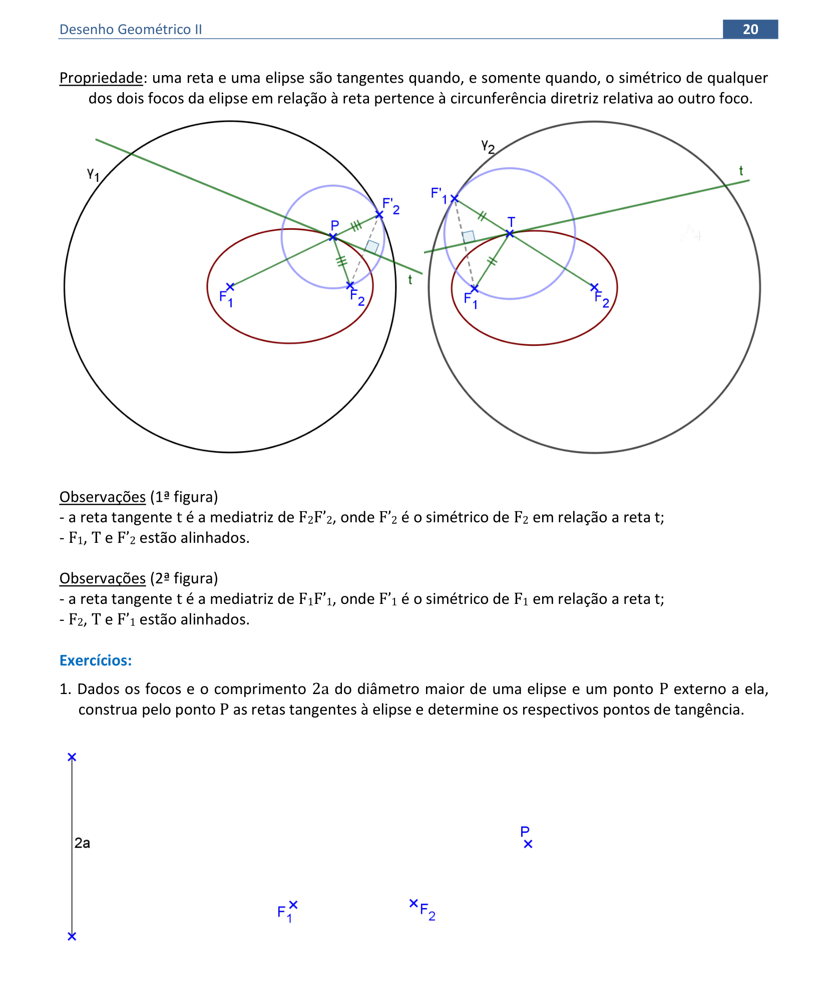
   

&#x1f4cf; &#x1f4d0; Resolução

	
Vamos construir as retas tangentes a uma elipse dada pelos focos, a distância <b>2a</b> e um ponto da cônica.

	  <ul class="slider">
		   <li>
			   <input type="radio" id="256" name="sl">
			   <label for="256"></label>
			   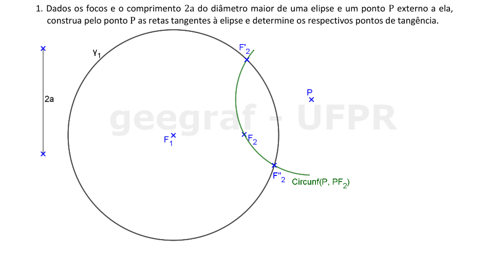
			   <figcaption>Vamos iniciar encontrando a circunferência diretriz <b>&gamma;1</b>, com centro em <b>F1</b> e raio <b>2a</b>. Construindo a <b>Circunf(P, PF2)</b>, determinamos os pontos <b>F'2</b> e <b>F''2</b> na circunferência diretriz.</figcaption>
		   </li>
		   <li>
			   <input type="radio" id="257" name="sl">
			   <label for="257"></label>
			   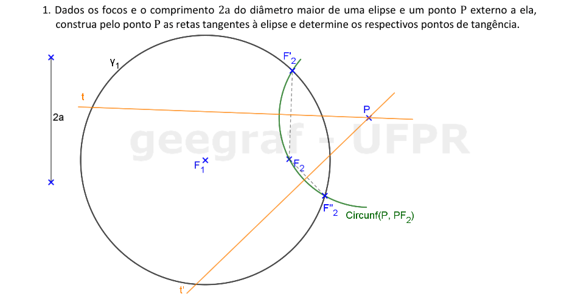
			   <figcaption>As retas tangentes são as mediatrizes de <b>F2F'2</b> e <b>F2F''2</b>.</figcaption>
		   </li>
		   <li>
			   <input type="radio" id="258" name="sl">
			   <label for="258"></label>
			   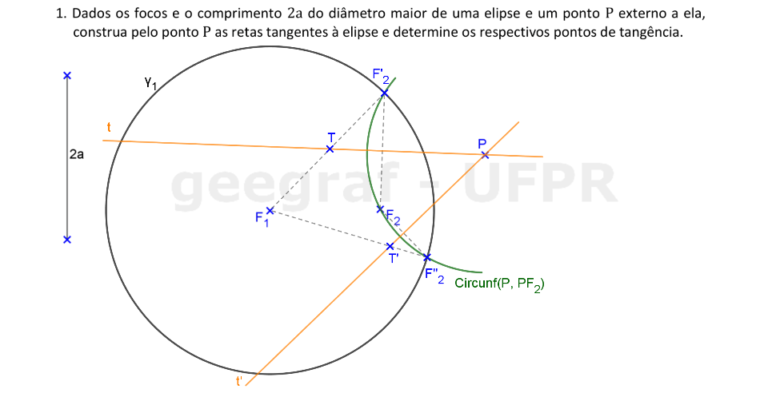
			   <figcaption>Unindo o foco <b>F1</b> com os simétricos de <b>F2</b> em relação às tangentes, determinamos os pontos de tangência nas retas <b>t</b> e <b>t'</b>.</figcaption>
		   </li>
		   <li>
			   <input type="radio" id="259" name="sl">
			   <label for="259"></label>
			   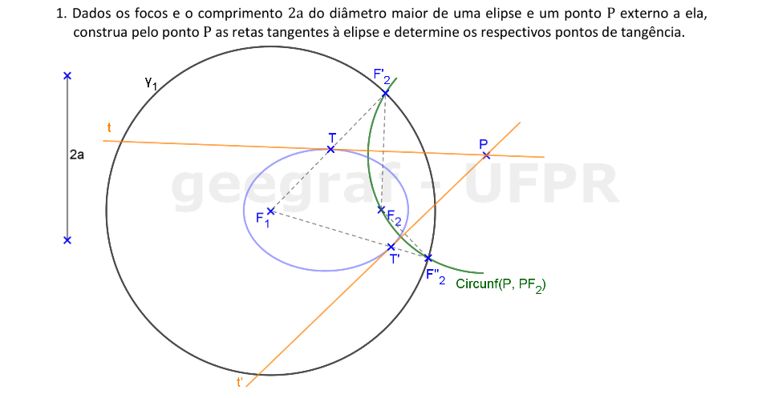
			   <figcaption>Para finalizar, basta construir a elipse à mão livre.</figcaption>
		   </li>
		</ul>
		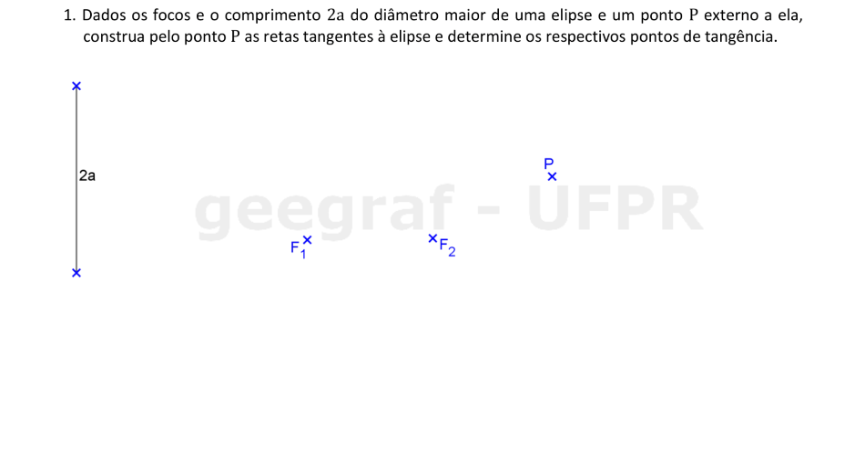
  

   
<a href="#modulo2" class="topo">voltar ao topo</a>

   
   

&#x1f4cf; &#x1f4d0; Resolução

	
Vamos construir as retas tangentes a uma elipse paralelas a uma reta. São dados os focos e a distância <b>2a</b> da cônica.

	  <ul class="slider">
		   <li>
			   <input type="radio" id="260" name="sl">
			   <label for="260"></label>
			   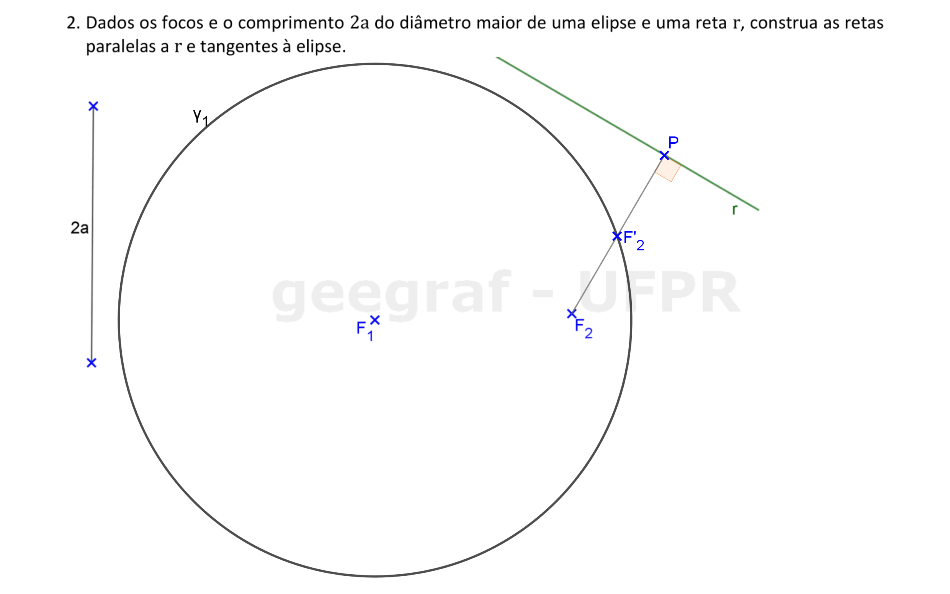
			   <figcaption>Vamos iniciar encontrando a circunferência diretriz <b>&gamma;1</b>, com centro em <b>F1</b> e raio <b>2a</b>. Construindo o segmento <b>PF2 &perp; r</b>, determinamos o ponto <b>F'2</b> na circunferência diretriz.</figcaption>
		   </li>
		   <li>
			   <input type="radio" id="261" name="sl">
			   <label for="261"></label>
			   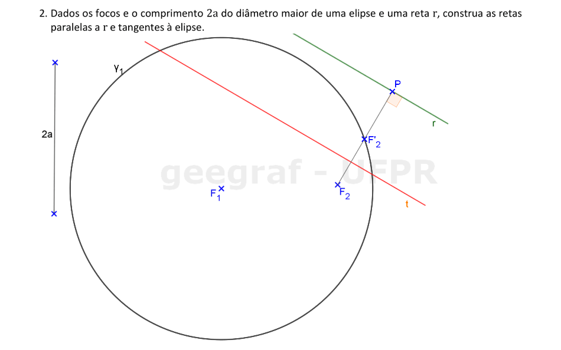
			   <figcaption>Uma das retas tangentes é a mediatriz de <b>F2F'2</b>.</figcaption>
		   </li>
		   <li>
			   <input type="radio" id="262" name="sl">
			   <label for="262"></label>
			   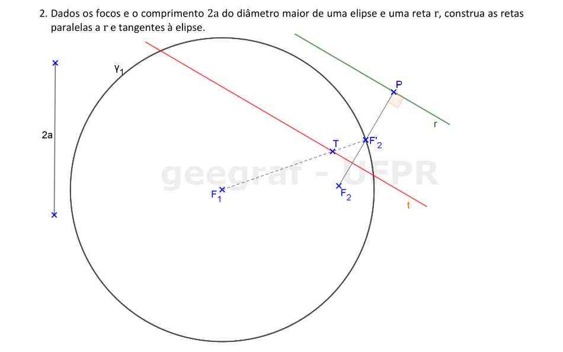
			   <figcaption>Unindo o foco <b>F1</b> com o ponto <b>F'2</b>, determinamos o ponto de tangência <b>T</b>.</figcaption>
		   </li>
		   <li>
			   <input type="radio" id="263" name="sl">
			   <label for="263"></label>
			   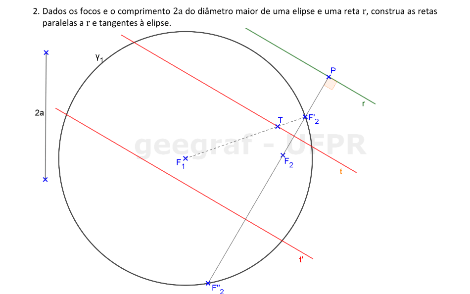
			   <figcaption>Se prolongarmos o segmento <b>PF2</b>, determinamos o ponto <b>F''2</b> na circunferência diretriz. A outra reta tangente é a mediatriz de <b>F2F''2</b>.</figcaption>
		   </li>
		   <li>
			   <input type="radio" id="264" name="sl">
			   <label for="264"></label>
			   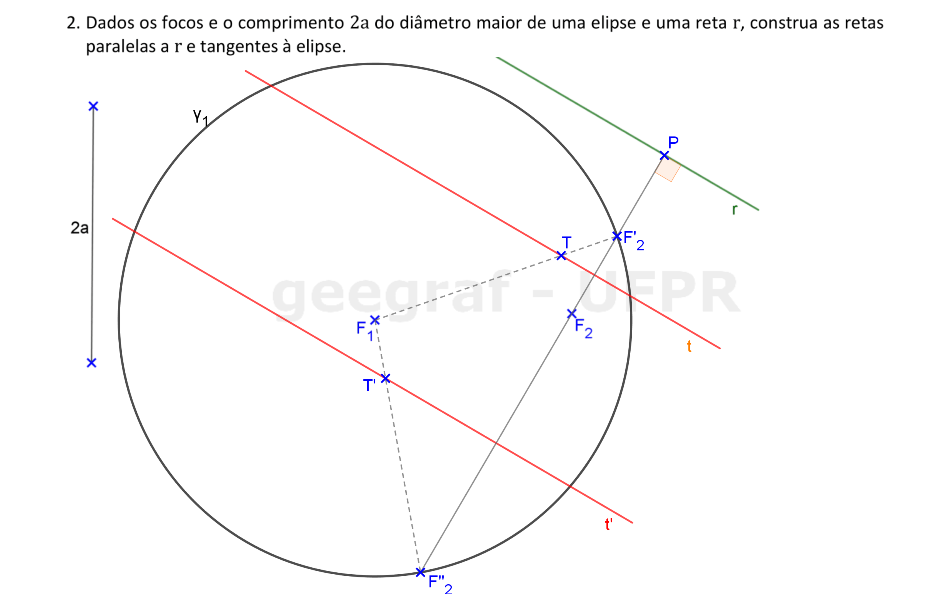
			   <figcaption>Unindo o foco <b>F1</b> com o ponto <b>F''2</b>, determinamos o ponto de tangência <b>T'</b>.</figcaption>
		   </li>
		   <li>
			   <input type="radio" id="265" name="sl">
			   <label for="265"></label>
			   
			   <figcaption>Depois, basta construir a elipse à mão livre.</figcaption>
		   </li>
		</ul>
		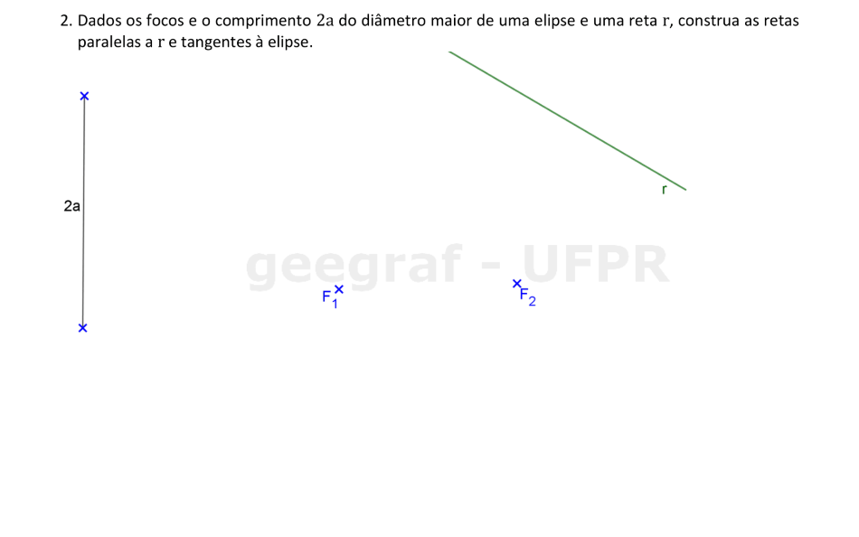
  

   
   
&#x1f4cf; &#x1f4d0; Exercício proposto 2.1

   
<a href="#modulo2" class="topo">voltar ao topo</a>

   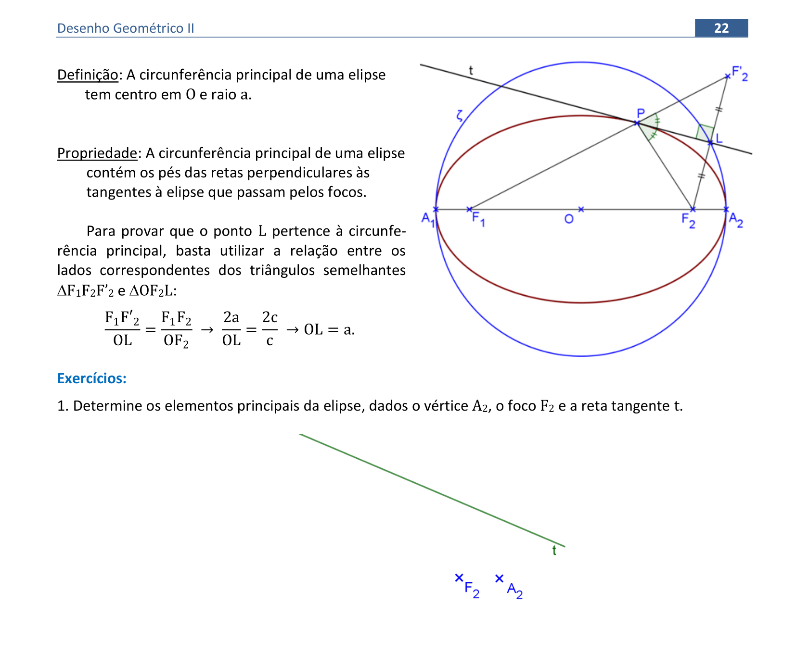
   

&#x1f4cf; &#x1f4d0; Resolução

	
Vamos construir os elementos principais de uma elipse dada por um vértice, um foco e uma reta tangente.

	  <ul class="slider">
		   <li>
			   <input type="radio" id="266" name="sl">
			   <label for="266"></label>
			   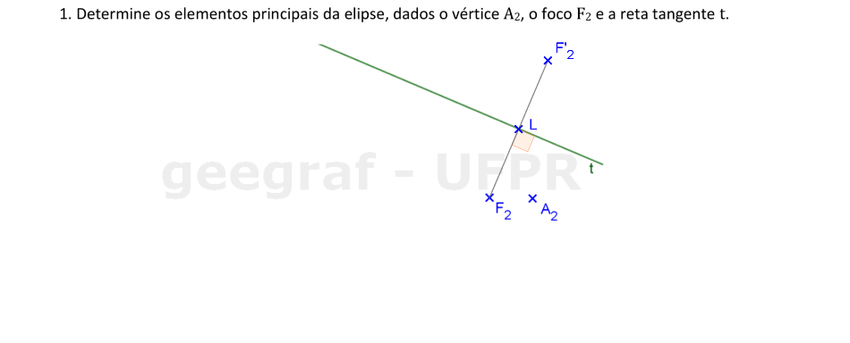
			   <figcaption>Vamos iniciar encontrando o segmento <b>F2F'2 &perp; t</b>. Logo,  determinamos o ponto <b>L &isin; t</b> que pertence à circunferência principal da elipse.</figcaption>
		   </li>
		   <li>
			   <input type="radio" id="267" name="sl">
			   <label for="267"></label>
			   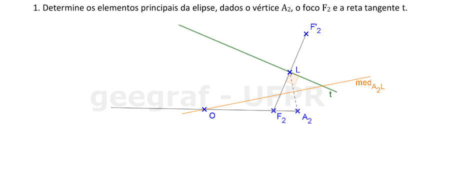
			   <figcaption>Como a circunferência principal passa pelo vértice <b>A2</b> e por <b>L</b>, o centro <b>O</b> estará na interseção do prolongamento de <b>A2F2</b> com a mediatriz de <b>A2L</b>.</figcaption>
		   </li>
		   <li>
			   <input type="radio" id="268" name="sl">
			   <label for="268"></label>
			   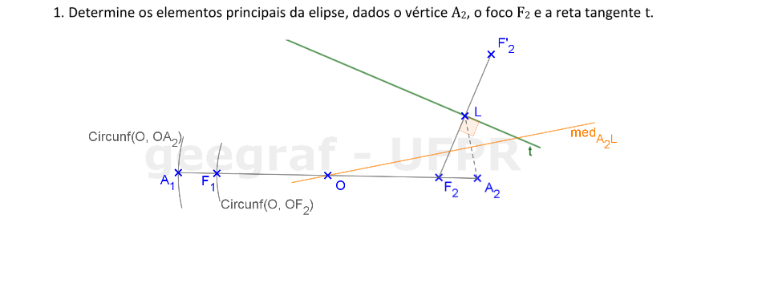
			   <figcaption>Determine os pontos <b>F1</b> e <b>A1</b>, simétricos de <b>F2</b> e de <b>A2</b> em relação ao centro.</figcaption>
		   </li>
		   <li>
			   <input type="radio" id="269" name="sl">
			   <label for="269"></label>
			   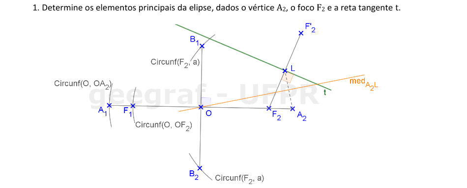
			   <figcaption>Determine os vértices <b>B1</b>  e <b>B2</b>, sabendo-se que <b>B1B2 &perp; F1F2</b> e <b>B1F2 = B2F2 = a</b>.</figcaption>
		   </li>
		   <li>
			   <input type="radio" id="270" name="sl">
			   <label for="270"></label>
			   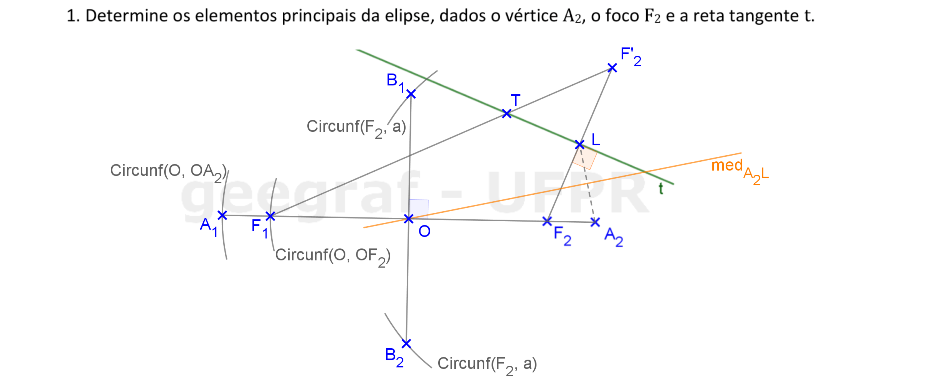
			   <figcaption>Unindo o foco <b>F1</b> com o ponto <b>F'2</b>, determinamos o ponto de tangência <b>T</b>.</figcaption>
		   </li>
		   <li>
			   <input type="radio" id="271" name="sl">
			   <label for="271"></label>
			   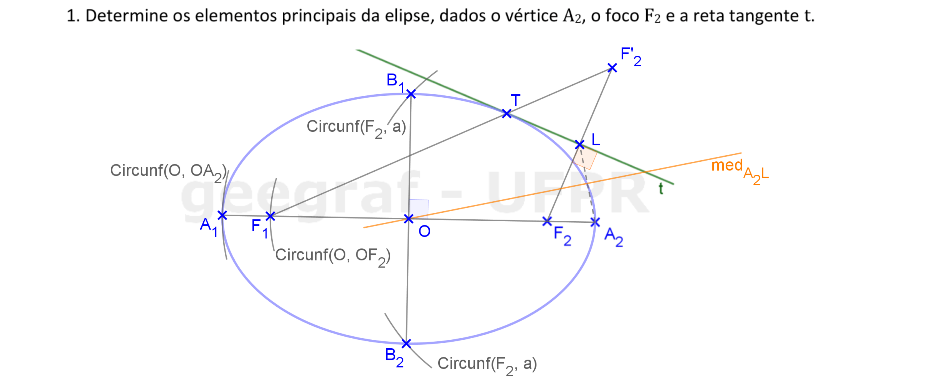
			   <figcaption>Depois, basta construir a elipse à mão livre.</figcaption>
		   </li>
		</ul>
		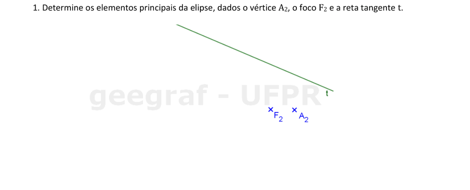
  

   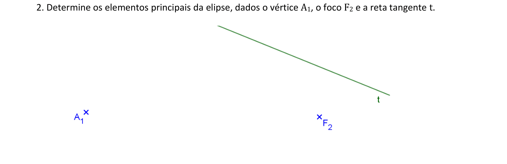
   

&#x1f4cf; &#x1f4d0; Resolução

	
Vamos construir os elementos principais de uma elipse dada por um vértice, um foco e uma reta tangente.

	  <ul class="slider">
		   <li>
			   <input type="radio" id="272" name="sl">
			   <label for="272"></label>
			   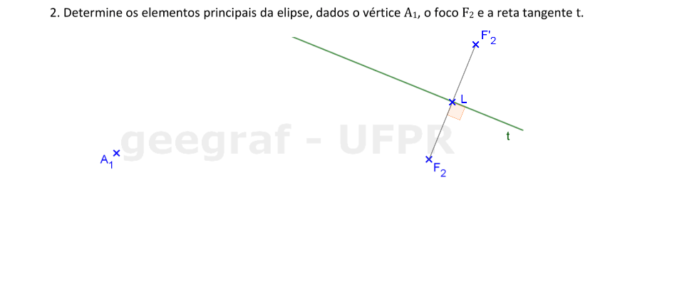
			   <figcaption>Vamos iniciar encontrando o segmento <b>F2F'2 &perp; t</b>. Logo, determinamos o ponto <b>L &isin; t</b> que pertence à circunferência principal da elipse.</figcaption>
		   </li>
		   <li>
			   <input type="radio" id="273" name="sl">
			   <label for="273"></label>
			   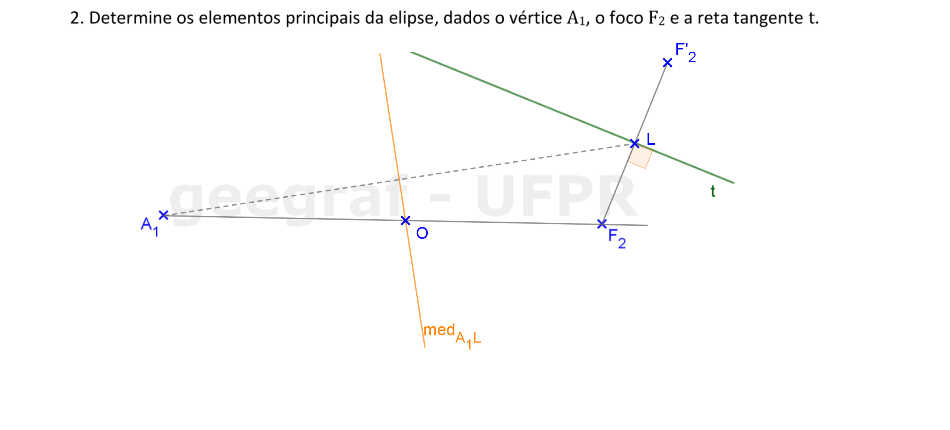
			   <figcaption>Como a circunferência principal passa pelo vértice <b>A1</b> e por <b>L</b>, o centro <b>O</b> estará na interseção do segmento <b>A1F2</b> com a mediatriz de <b>A1L</b>.</figcaption>
		   </li>
		   <li>
			   <input type="radio" id="274" name="sl">
			   <label for="274"></label>
			   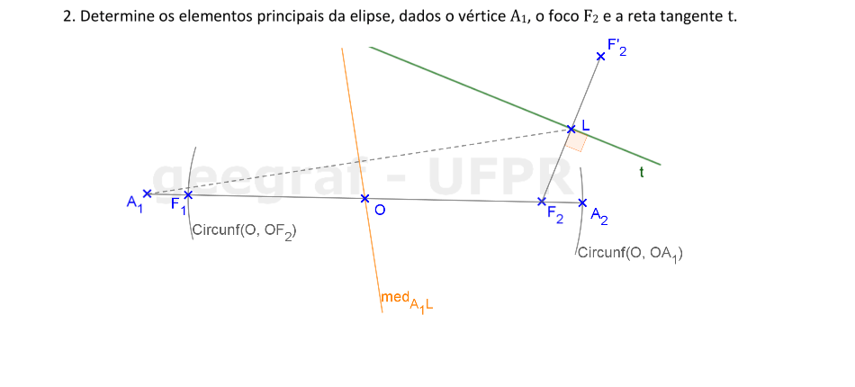
			   <figcaption>Determine os pontos <b>F1</b> e <b>A2</b>, simétricos de <b>F2</b> e de <b>A1</b> em relação ao centro.</figcaption>
		   </li>
		   <li>
			   <input type="radio" id="275" name="sl">
			   <label for="275"></label>
			   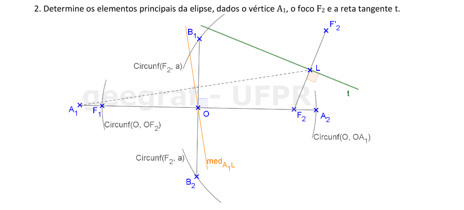
			   <figcaption>Determine os vértices <b>B1</b>  e <b>B2</b>, sabendo-se que <b>B1B2 &perp; F1F2</b> e <b>B1F2 = B2F2= a</b>.</figcaption>
		   </li>
		   <li>
			   <input type="radio" id="276" name="sl">
			   <label for="276"></label>
			   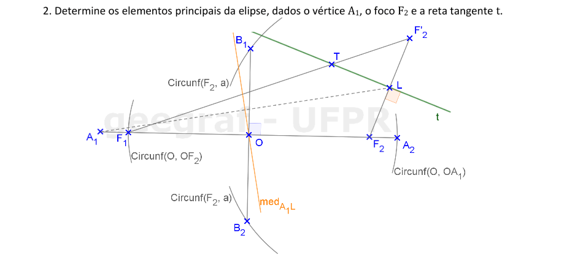
			   <figcaption>Unindo o foco <b>F1</b> com o ponto <b>F'2</b>, determinamos o ponto de tangência <b>T</b>.</figcaption>
		   </li>
		   <li>
			   <input type="radio" id="277" name="sl">
			   <label for="277"></label>
			   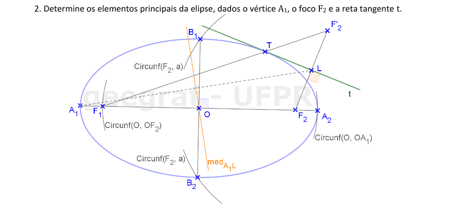
			   <figcaption>Para finalizar, basta construir a elipse à mão livre.</figcaption>
		   </li>
		</ul>
		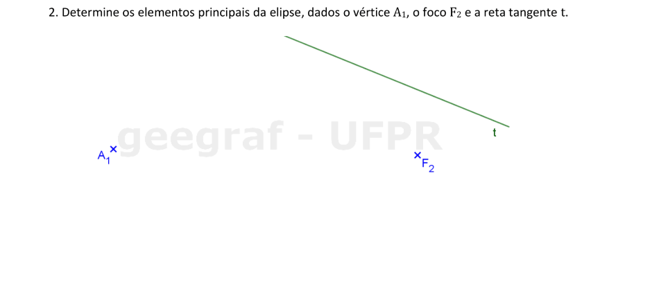
  

   
<a href="#modulo2" class="topo">voltar ao topo</a>

   
   
&#x1f4cf; &#x1f4d0; Exercício proposto 2.2

   
   

&#x1f4cf; &#x1f4d0; Resolução

	
Vamos construir os elementos principais de uma elipse dada por um foco e 3 retas tangentes.

	  <ul class="slider">
		   <li>
			   <input type="radio" id="278" name="sl">
			   <label for="278"></label>
			   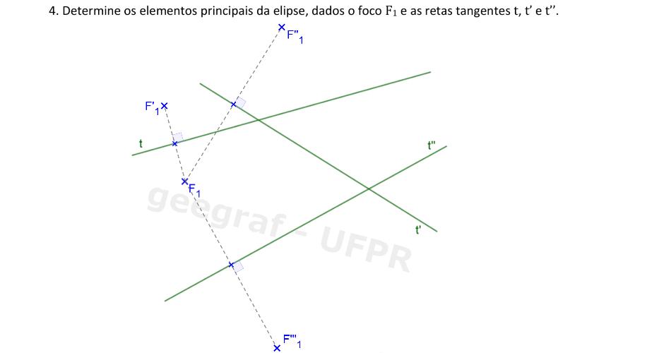
			   <figcaption>Vamos iniciar encontrando os simétricos do foco <b>F1</b> em relação às retas tangentes.</figcaption>
		   </li>
		   <li>
			   <input type="radio" id="279" name="sl">
			   <label for="279"></label>
			   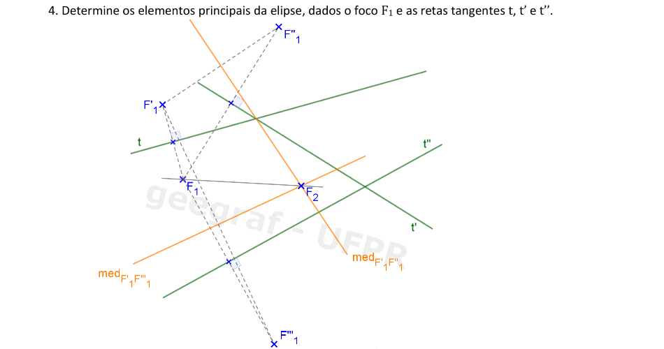
			   <figcaption>Como a circunferência diretriz passa pelos simétricos de um foco em relação às retas tangentes, podemos construir as mediatrizes de <b>F'1F''1</b> e <b>F'1F'''1</b> para encontrar o foco <b>F2</b>.</figcaption>
		   </li>
		   <li>
			   <input type="radio" id="280" name="sl">
			   <label for="280"></label>
			   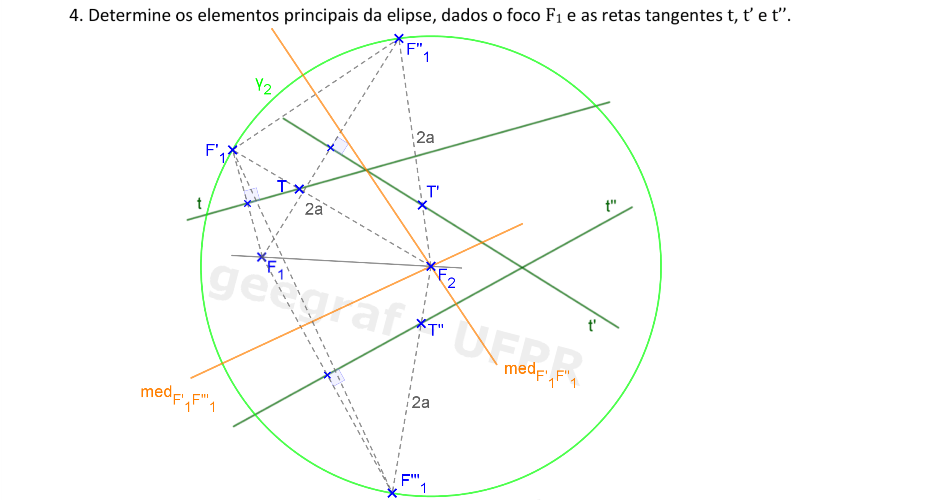
			   <figcaption>A circunferência diretriz <b>&gamma;2</b> tem centro em <b>F2</b> e raio <b>2a</b>. Unindo <b>F2</b> com os simétricos de <b>F1</b> em relação às tangentes, determinamos os pontos de tangência.</figcaption>
		   </li>
		   <li>
			   <input type="radio" id="281" name="sl">
			   <label for="281"></label>
			   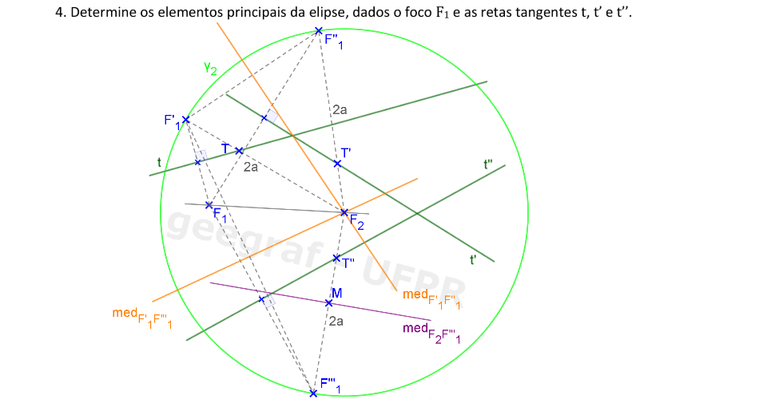
			   <figcaption>Determine a mediatriz de um dos raios da circunferência diretriz: <b>medF2F'''1</b> para encontrarmos a medida <b>a</b>.</figcaption>
		   </li>
		   <li>
			   <input type="radio" id="282" name="sl">
			   <label for="282"></label>
			   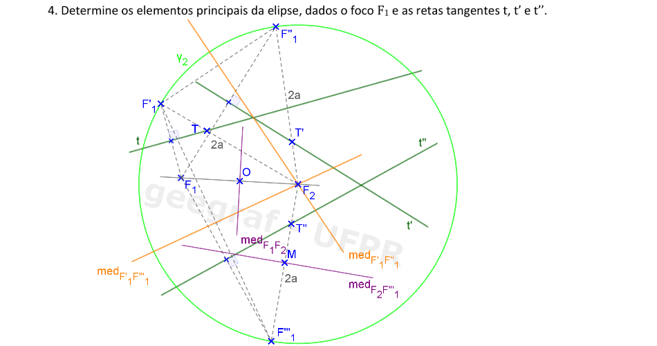
			   <figcaption>Construa a mediatriz de <b>F1F2</b> para encontrar o centro da elipse.</figcaption>
		   </li>
		   <li>
			   <input type="radio" id="283" name="sl">
			   <label for="283"></label>
			   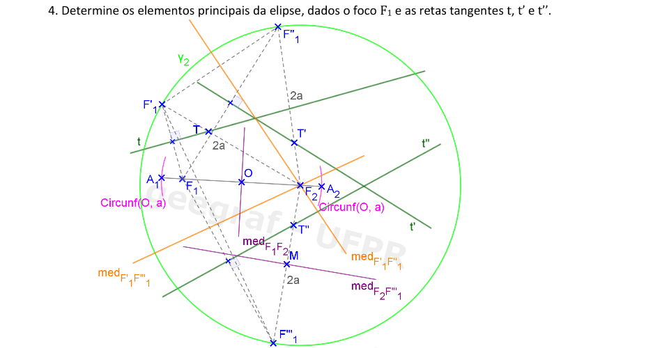
			   <figcaption>Obtenha os vértices <b>A1</b> e <b>A2</b> usando a <b>Circunf(O, a)</b>.</figcaption>
		   </li>
		   <li>
			   <input type="radio" id="284" name="sl">
			   <label for="284"></label>
			   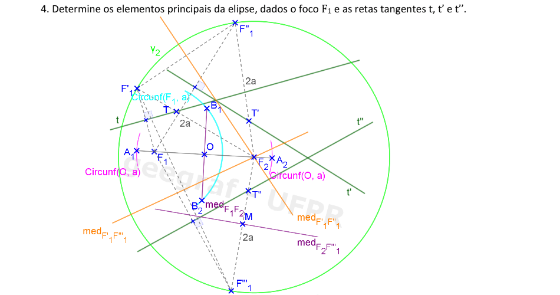
			   <figcaption>Determine os vértices <b>B1</b>  e <b>B2</b>, sabendo-se que <b>B1B2 &perp; F1F2</b> e <b>B1F1 = B2F1= a</b>.</figcaption>
		   </li>
		   <li>
			   <input type="radio" id="285" name="sl">
			   <label for="285"></label>
			   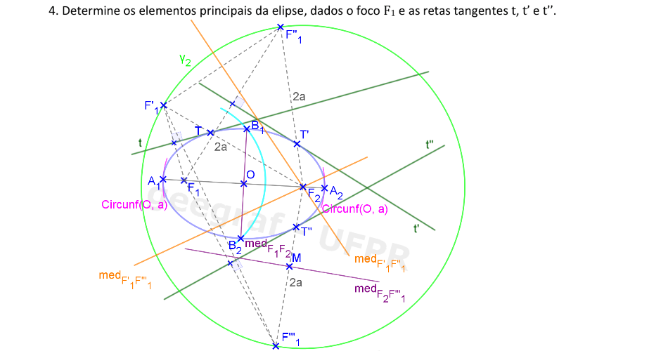
			   <figcaption>Para finalizar, basta construir a elipse à mão livre.</figcaption>
		   </li>
		</ul>
		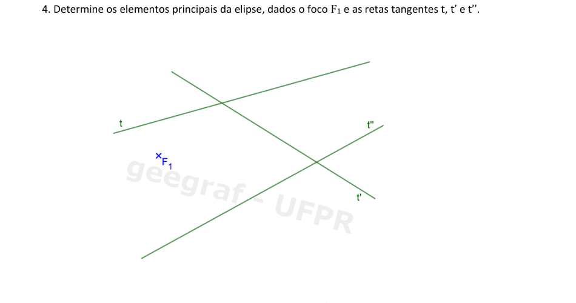
  

   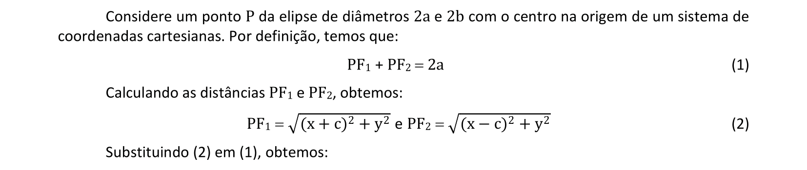
   
<a href="#modulo2" class="topo">voltar ao topo</a>

   
   
<a href="#modulo2" class="topo">voltar ao topo</a>

   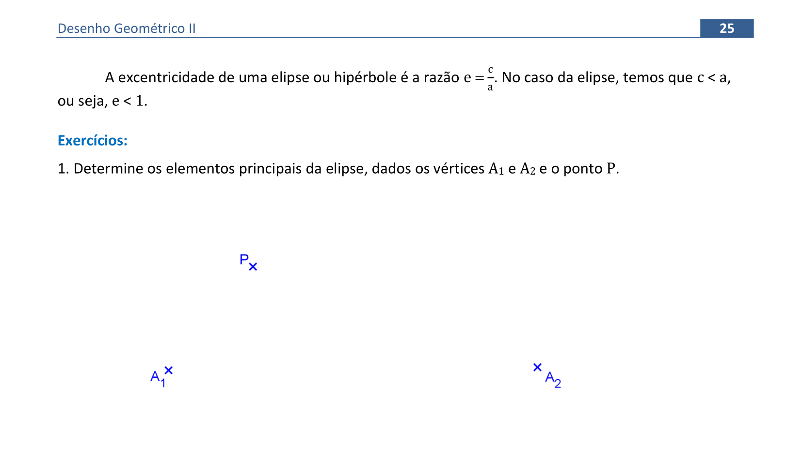
   

&#x1f4cf; &#x1f4d0; Resolução

	
Vamos construir os elementos principais de uma elipse dada pelos vértices do diâmetro principal e um ponto.

	  <ul class="slider">
		   <li>
			   <input type="radio" id="286" name="sl">
			   <label for="286"></label>
			   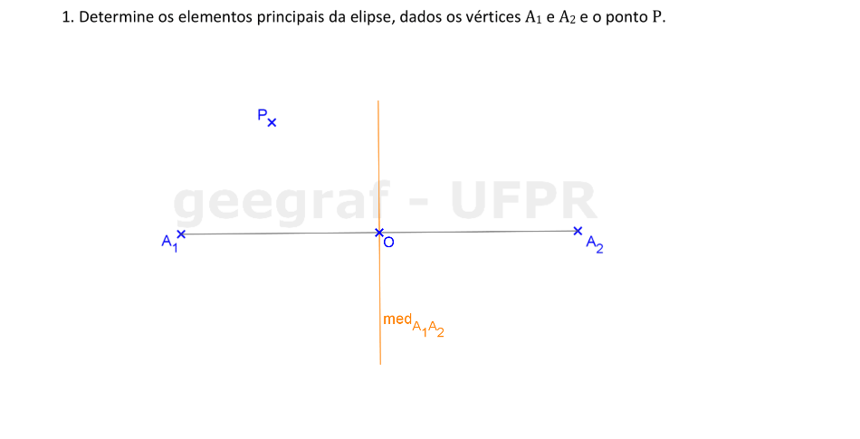
			   <figcaption>Vamos iniciar encontrando o centro da elipse com a <b>medA1A2</b>.</figcaption>
		   </li>
		   <li>
			   <input type="radio" id="287" name="sl">
			   <label for="287"></label>
			   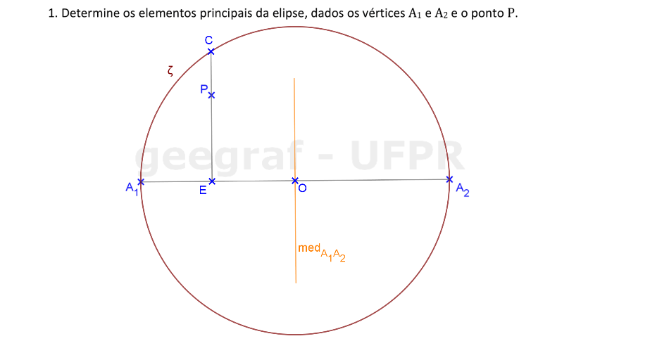
			   <figcaption>Construa a circunferência principal da elipse e o segmento <b>PE &perp; A1A2</b>.</figcaption>
		   </li>
		   <li>
			   <input type="radio" id="288" name="sl">
			   <label for="288"></label>
			   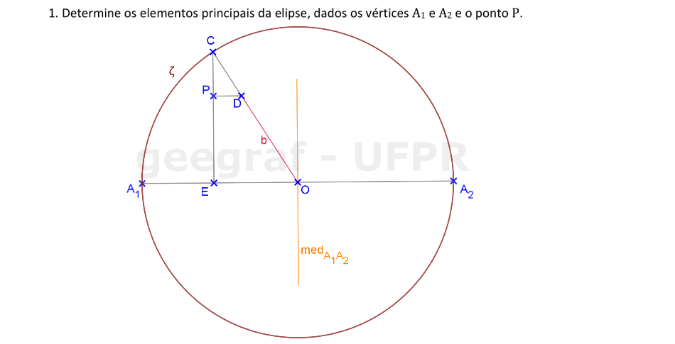
			   <figcaption>De acordo com as propriedades de afinidade homológica, a interseção de <b>OC</b> com o segmento <b>PD // A1A2</b> determina <b>OD = b</b>.</figcaption>
		   </li>
		   <li>
			   <input type="radio" id="289" name="sl">
			   <label for="289"></label>
			   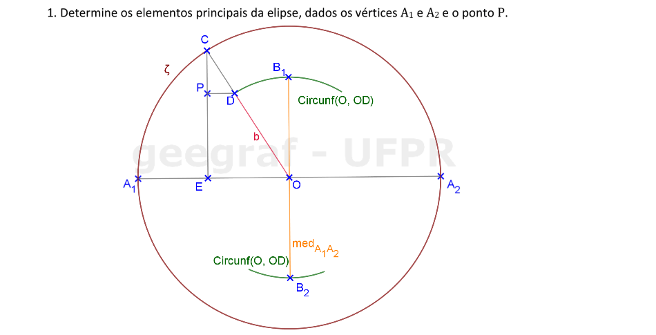
			   <figcaption>A <b>Circunf(O, OD)</b> determina os vértices <b>B1</b> e <b>B2</b> na mediatriz de <b>A1A2</b>.</figcaption>
		   </li>
		   <li>
			   <input type="radio" id="290" name="sl">
			   <label for="290"></label>
			   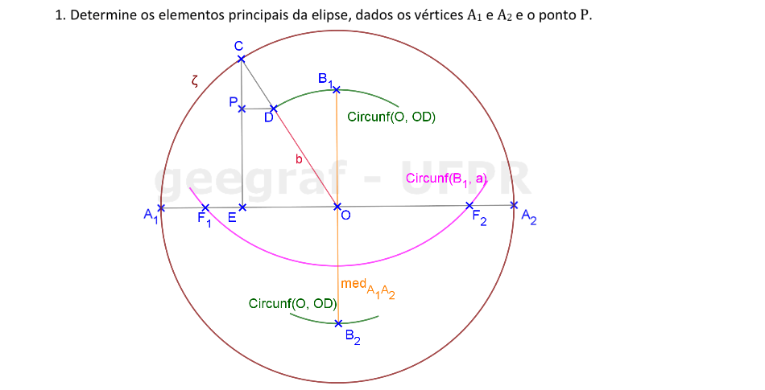
			   <figcaption>Construa a <b>Circunf(B1, a)</b> para encontrar os focos da elipse.</figcaption>
		   </li>
		   <li>
			   <input type="radio" id="291" name="sl">
			   <label for="291"></label>
			   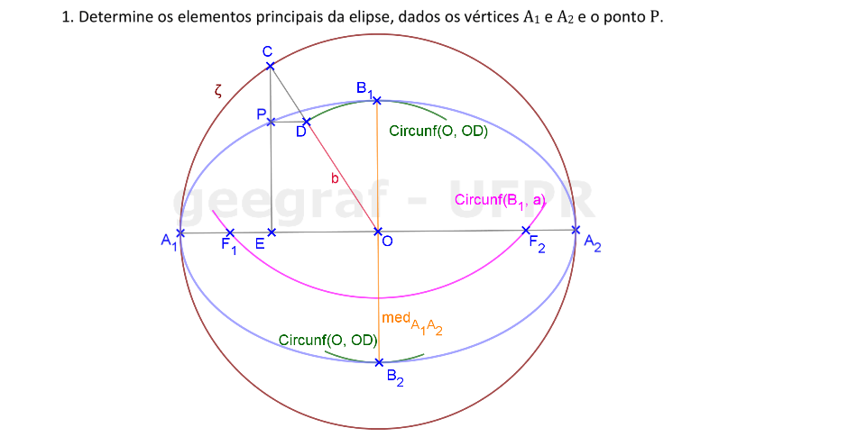
			   <figcaption>Para finalizar, basta construir a elipse à mão livre.</figcaption>
		   </li>
		</ul>
		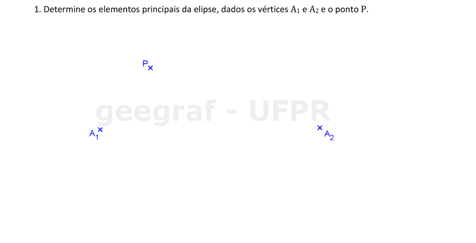
  

   
   

&#x1f4cf; &#x1f4d0; Resolução

	
Vamos construir os elementos principais de uma elipse dada pelo diâmetro <b>2c</b> e pela excentricidade.

	  <ul class="slider">
		   <li>
			   <input type="radio" id="292" name="sl">
			   <label for="292"></label>
			   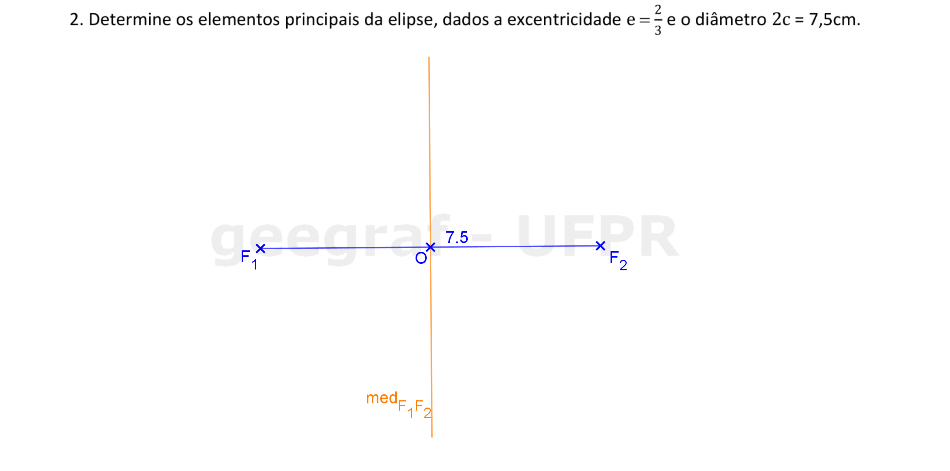
			   <figcaption>Vamos iniciar encontrando o segmento <b>2c</b> e a <b>medF1F2</b>.</figcaption>
		   </li>
		   <li>
			   <input type="radio" id="293" name="sl">
			   <label for="293"></label>
			   
			   <figcaption>Usando o teorema de Tales, determinamos a proporção da excentricidade $\mathsf{ {c \over a} = {2 \over 3}}$ fazendo $\mathsf{ {O2 \over O3} = {2 \over 3}}$. Logo, encontramos o vértice <b>A1</b>.</figcaption>
		   </li>
		   <li>
			   <input type="radio" id="294" name="sl">
			   <label for="294"></label>
			   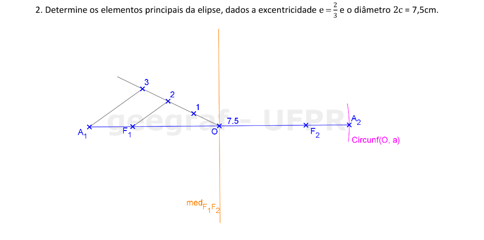
			   <figcaption>Encontre o simétrico de <b>A1</b> em relação ao centro da elipse.</figcaption>
		   </li>
		   <li>
			   <input type="radio" id="295" name="sl">
			   <label for="295"></label>
			   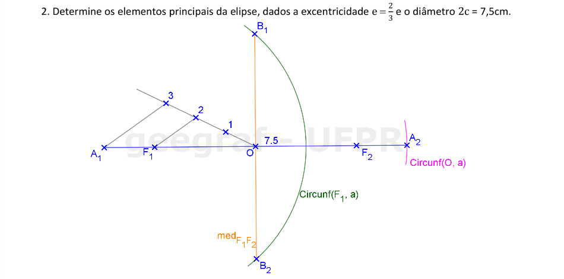
			   <figcaption>A <b>Circunf(F1, a)</b> determina os vértices <b>B1</b> e <b>B2</b> na mediatriz de <b>F1F2</b>.</figcaption>
		   </li>
		   <li>
			   <input type="radio" id="296" name="sl">
			   <label for="296"></label>
			   
			   <figcaption>Para finalizar, basta construir a elipse à mão livre.</figcaption>
		   </li>
		</ul>
		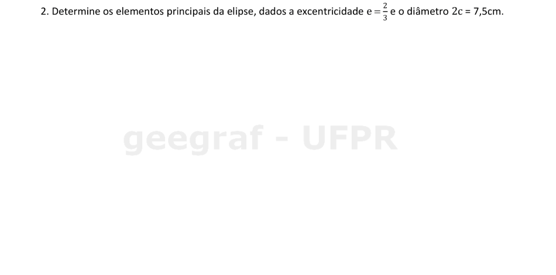
  

   
   
&#x1f4cf; &#x1f4d0; Exercício proposto 2.3

   
   

&#x1f4cf; &#x1f4d0; Resolução

	
Vamos construir os elementos principais de uma elipse dada pelo diâmetro <b>2a</b> e pela excentricidade.

	  <ul class="slider">
		   <li>
			   <input type="radio" id="297" name="sl">
			   <label for="297"></label>
			   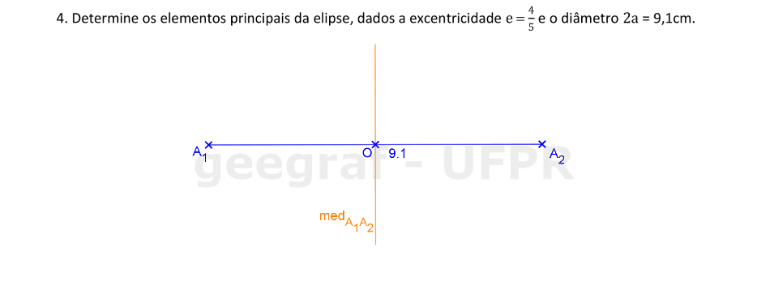
			   <figcaption>Vamos iniciar encontrando o segmento <b>2a</b> e a <b>medA1A2</b>.</figcaption>
		   </li>
		   <li>
			   <input type="radio" id="298" name="sl">
			   <label for="298"></label>
			   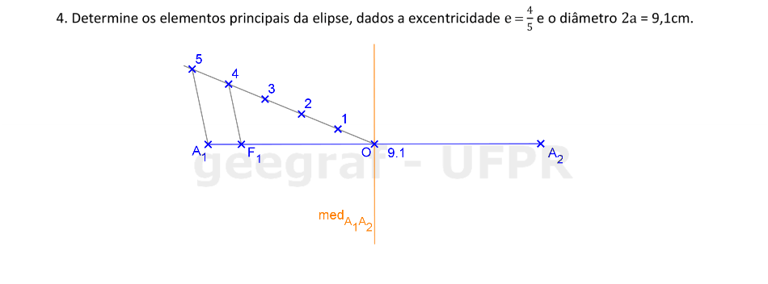
			   <figcaption>Usando o teorema de Tales, determinamos a proporção da excentricidade $\mathsf{ {c \over a} = {4 \over 5}}$ fazendo $\mathsf{ {O4 \over O5} = {4 \over 5}}$. Logo, encontramos o foco <b>F1</b>.</figcaption>
		   </li>
		   <li>
			   <input type="radio" id="299" name="sl">
			   <label for="299"></label>
			   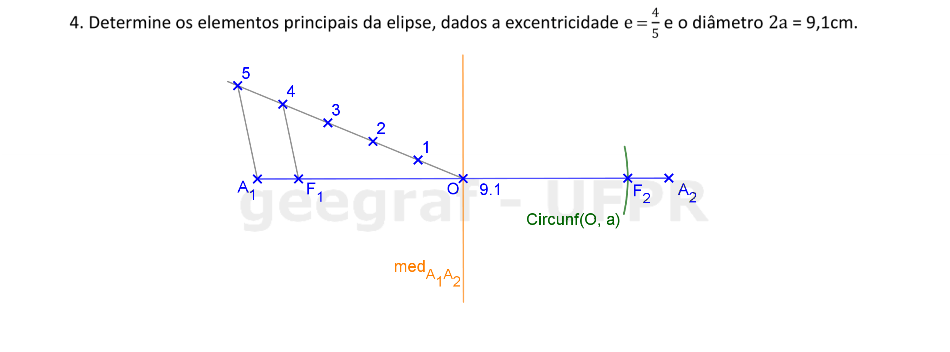
			   <figcaption>Encontre o simétrico de <b>F1</b> em relação ao centro da elipse.</figcaption>
		   </li>
		   <li>
			   <input type="radio" id="300" name="sl">
			   <label for="300"></label>
			   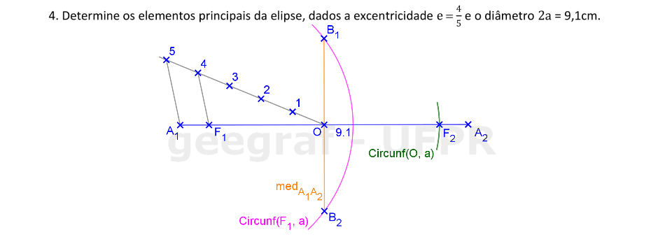
			   <figcaption>A <b>Circunf(F1, a)</b> determina os vértices <b>B1</b> e <b>B2</b> na mediatriz de <b>A1A2</b>.</figcaption>
		   </li>
		   <li>
			   <input type="radio" id="301" name="sl">
			   <label for="301"></label>
			   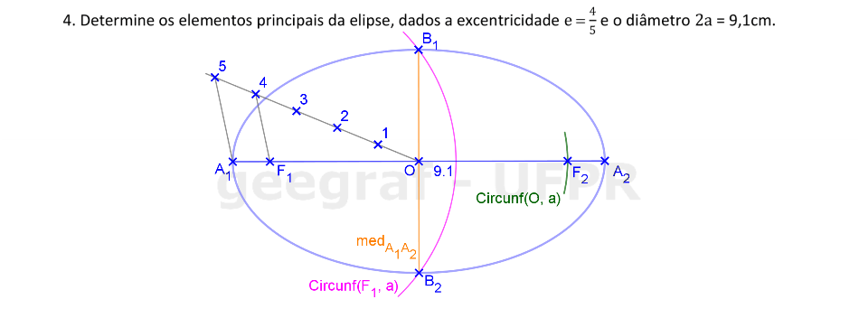
			   <figcaption>Para finalizar, basta construir a elipse à mão livre.</figcaption>
		   </li>
		</ul>
		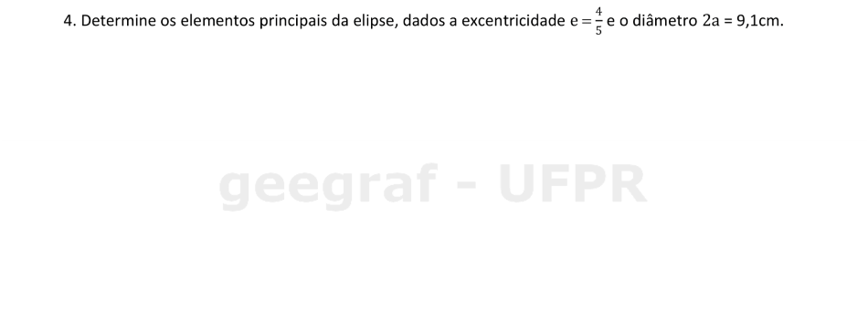
  

   
<a href="#modulo2" class="topo">voltar ao topo</a>

3. Hipérboles e parábolas

  
Material da página 26 até a página 41.

   
   

&#x1f4d1; Propriedades

	
Vamos acompanhar a demonstração do teorema de Apollonius para o caso de uma hipérbole. Considere as esferas inscritas na superfície cônica e tangentes ao plano de seção.

	  <ul class="slider">
		   <li>
			   <input type="radio" id="302" name="sl">
			   <label for="302"></label>
			   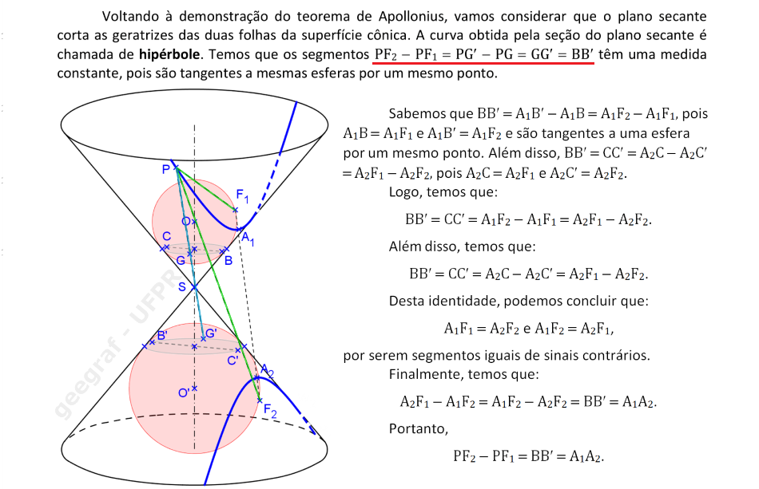
			   <figcaption>Usando o conceito de potência do ponto <b>P</b> em relação às esferas de centros <b>O'</b> e <b>O</b>, encontramos que <b>PF2 = PG'</b> e <b>PF1 = PG</b>. Logo, temos que <b>PF2 - PF1 = PG' - PG = GG' = BB' = CC'</b>.</figcaption>
		   </li>
		   <li>
			   <input type="radio" id="303" name="sl">
			   <label for="303"></label>
			   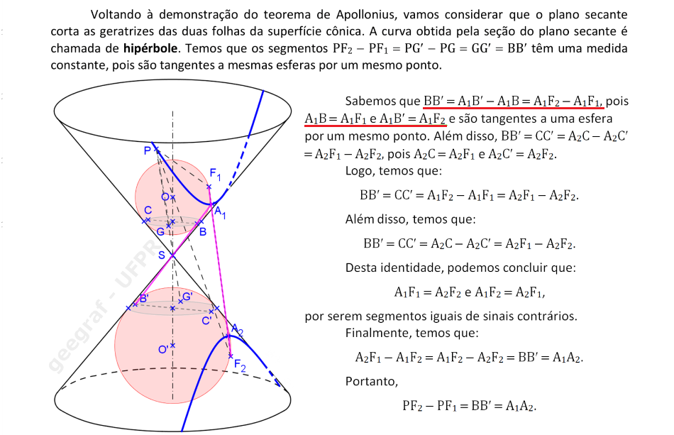
			   <figcaption>Prolongando-se <b>BB'</b>, obtemos o ponto <b>A1</b> e <b>BB' = A1B' - A1B</b>. Pela potência do ponto <b>A1</b> em relação às esferas, temos que <b>A1F1 = A1B</b> e <b>A1B' = A1F2</b>. Logo, temos que <b>BB' = A1B' - A1B = A1F2 - A1F1</b>.</figcaption>
		   </li>
		   <li>
			   <input type="radio" id="304" name="sl">
			   <label for="304"></label>
			   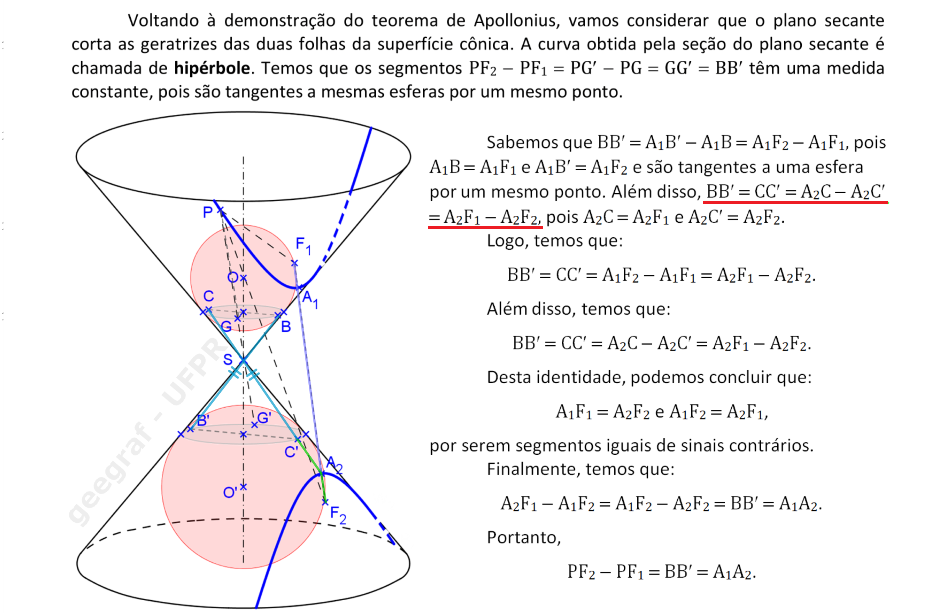
			   <figcaption>Temos também que <b>CC' = BB' = A2C - A2C' = A2F1 - A2F2</b> ...</figcaption>
		   </li>
		   <li>
			   <input type="radio" id="305" name="sl">
			   <label for="305"></label>
			   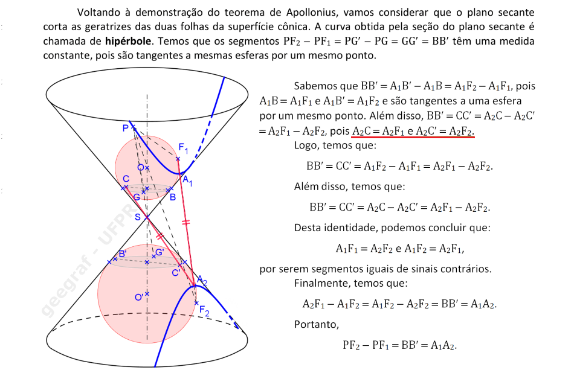
			   <figcaption>... pois pela potência do ponto <b>A2</b> em relação às esferas temos que <b>A2F1 = A2C</b> ...</figcaption>
		   </li>
		   <li>
			   <input type="radio" id="306" name="sl">
			   <label for="306"></label>
			   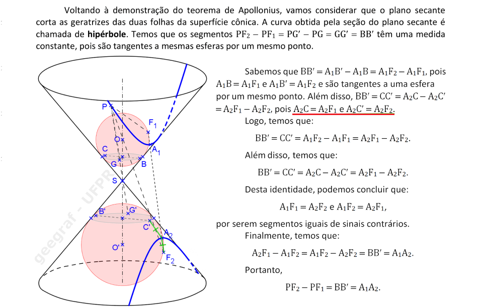
			   <figcaption>... e <b>A2F2 = A2C'</b>.</figcaption>
		   </li>
		   <li>
			   <input type="radio" id="307" name="sl">
			   <label for="307"></label>
			   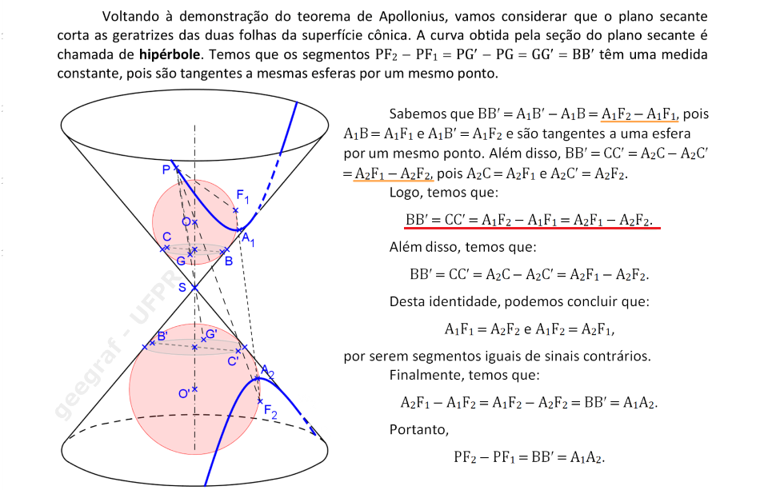
			   <figcaption>Logo, temos que <b>CC' = BB' = A1F2 - A1F1 = A2F1 - A2F2</b>.</figcaption>
		   </li>
		   <li>
			   <input type="radio" id="308" name="sl">
			   <label for="308"></label>
			   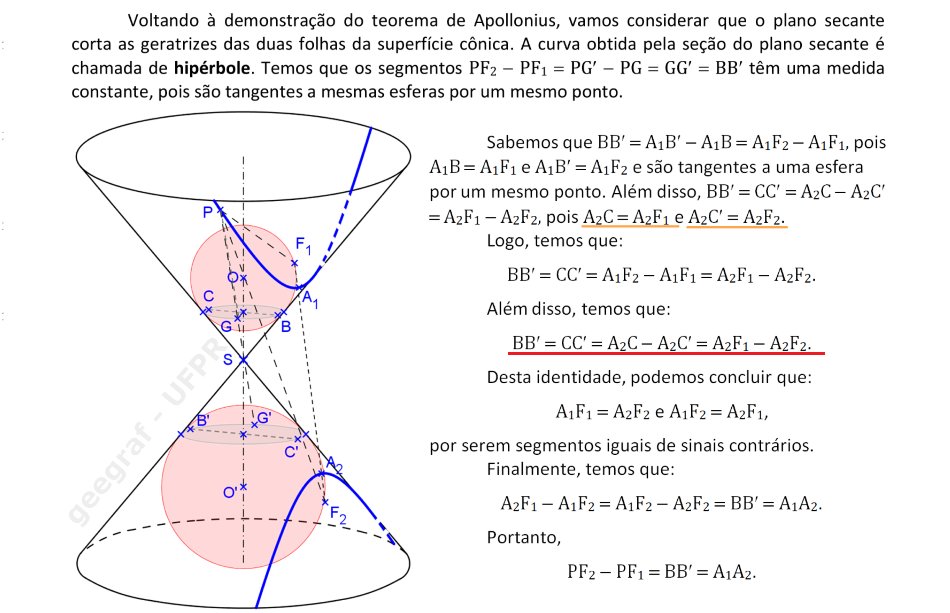
			   <figcaption>Temos também que <b>CC' = BB' = A2C - A2C' = A2F1 - A2F2</b>.</figcaption>
		   </li>
		   <li>
			   <input type="radio" id="309" name="sl">
			   <label for="309"></label>
			   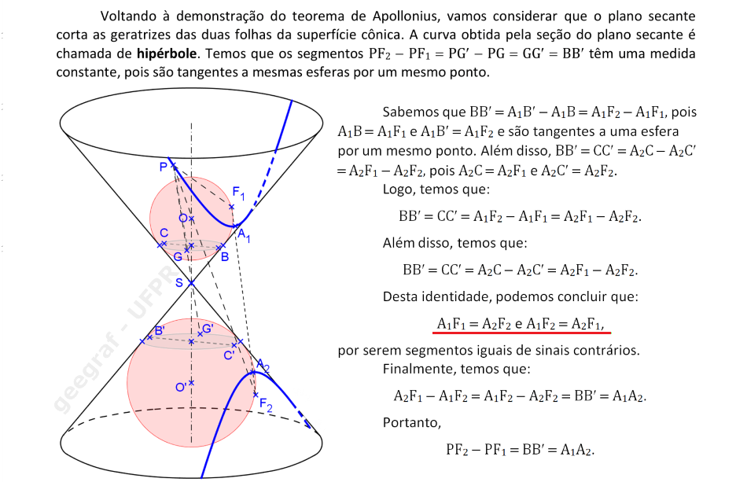
			   <figcaption>Da última igualdade que verificamos, podemos concluir que <b>A1F1 = A2F2</b> e <b>A1F2 = A2F1</b>.</figcaption>
		   </li>
		   <li>
			   <input type="radio" id="310" name="sl">
			   <label for="310"></label>
			   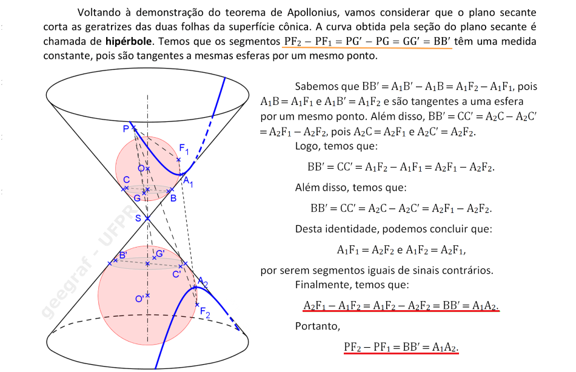
			   <figcaption>Portanto, temos que <b>A2F1 - A1F2 = A1F2 - A2F2 = BB' = A1A2</b>. Logo, <b>PF2 - PF1 = BB' = A1A2</b>.</figcaption>
		   </li>
		</ul>
		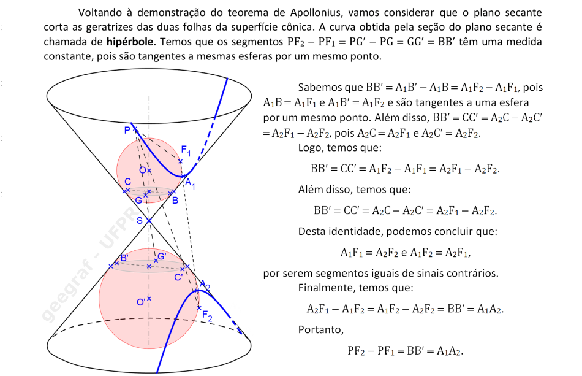
  

   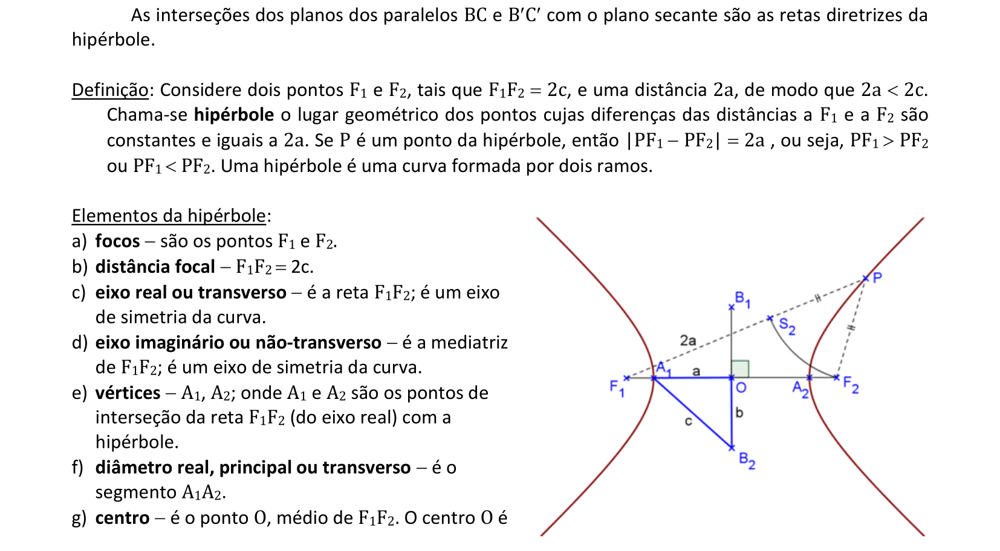
   
<a href="#modulo3" class="topo">voltar ao topo</a>

   
   

&#x1f4cf; &#x1f4d0; Resolução

	
Construiremos uma hipérbole dados um vértice, o centro e um foco.

	  <ul class="slider">
		   <li>
			   <input type="radio" id="311" name="sl">
			   <label for="311"></label>
			   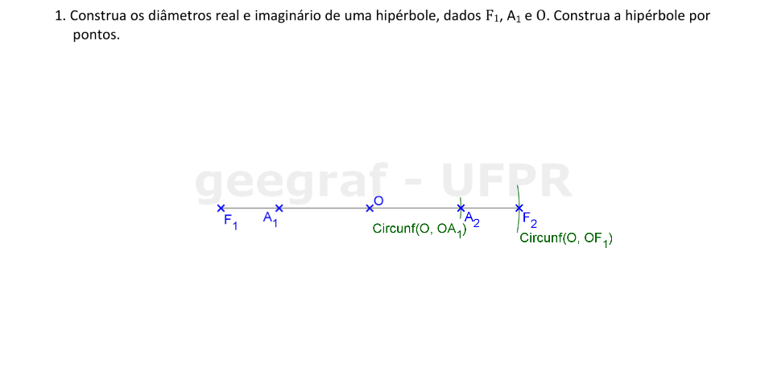
			   <figcaption>Vamos iniciar encontrando os simétricos de <b>A1</b> e de <b>F1</b> em relação ao centro.</figcaption>
		   </li>
		   <li>
			   <input type="radio" id="312" name="sl">
			   <label for="312"></label>
			   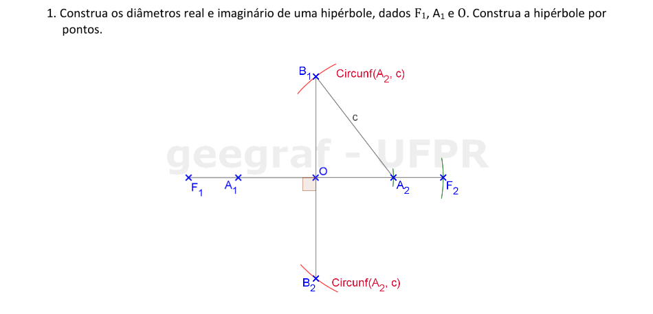
			   <figcaption>A distância entre os focos e os vértices do diâmetro imaginário é igual à metade da distância focal: <b>c</b>. Logo, para achar <b>B1</b> e <b>B2</b>, basta encontrar a interseção da reta perpendicular ao diâmetro <b>A1A2</b> que passa pelo centro com a <b>Circunf(A2, c)</b>.</figcaption>
		   </li>
		   <li>
			   <input type="radio" id="313" name="sl">
			   <label for="313"></label>
			   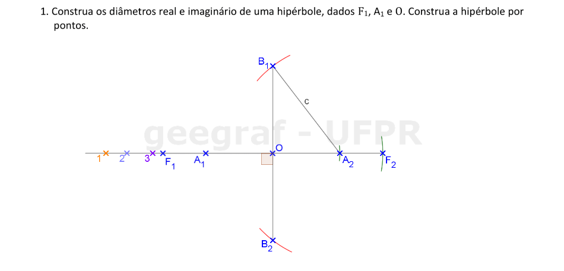
			   <figcaption>Para construir uma hipérbole por pontos, vamos determinar os pontos <b>1</b>, <b>2</b> e <b>3</b> que ficam à esquerda do foco <b>F1</b> na semi-reta de origem <b>F1</b>. Cada ponto determinará 4 pontos da cônica.</figcaption>
		   </li>
		   <li>
			   <input type="radio" id="314" name="sl">
			   <label for="314"></label>
			   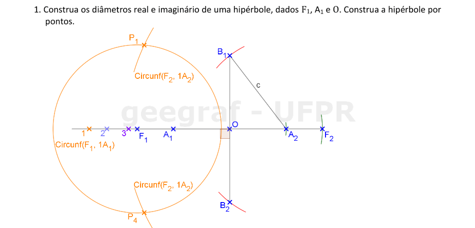
			   <figcaption>Como <b>PF1 - PF2 = 2a</b>, tome os raios com medidas iguais a <b>1A1</b> e <b>1A2</b>. As interseções das circunferências com centros em <b>F1</b> e <b>F2</b> com raios <b>1A1</b> e <b>1A2</b> são dois pontos da hipérbole.</figcaption>
		   </li>
		   <li>
			   <input type="radio" id="315" name="sl">
			   <label for="315"></label>
			   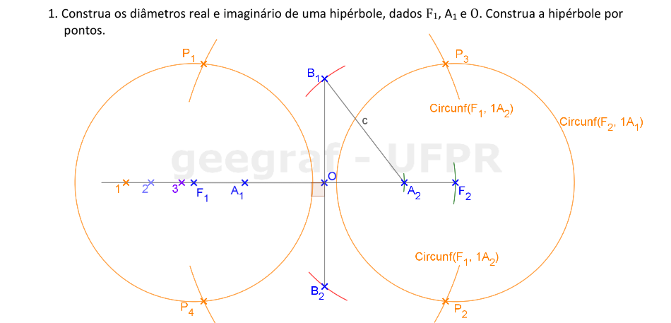
			   <figcaption>Invertendo-se os centros, mas usando as mesmas medidas de raios, obtemos mais dois pontos da cônica: as circunferências com centros em <b>F1</b> e <b>F2</b> com raios <b>1A2</b> e <b>1A1</b> determinam mais dois pontos da hipérbole.</figcaption>
		   </li>
		   <li>
			   <input type="radio" id="316" name="sl">
			   <label for="316"></label>
			   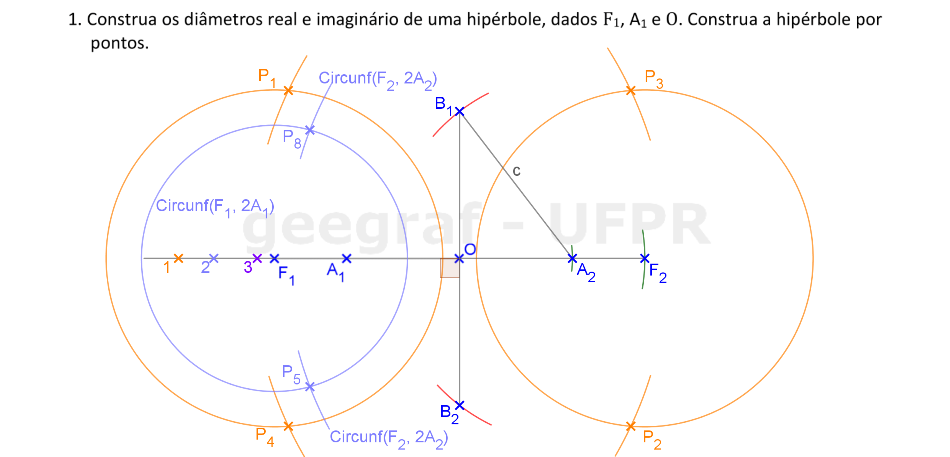
			   <figcaption>Usando o mesmo raciocínio com o ponto <b>2</b>, tomamos os raios com medidas iguais a <b>2A1</b> e <b>2A2</b>. As interseções das circunferências com centros em <b>F1</b> e <b>F2</b> com raios <b>2A1</b> e <b>2A2</b> são dois pontos da hipérbole.</figcaption>
		   </li>
		   <li>
			   <input type="radio" id="317" name="sl">
			   <label for="317"></label>
			   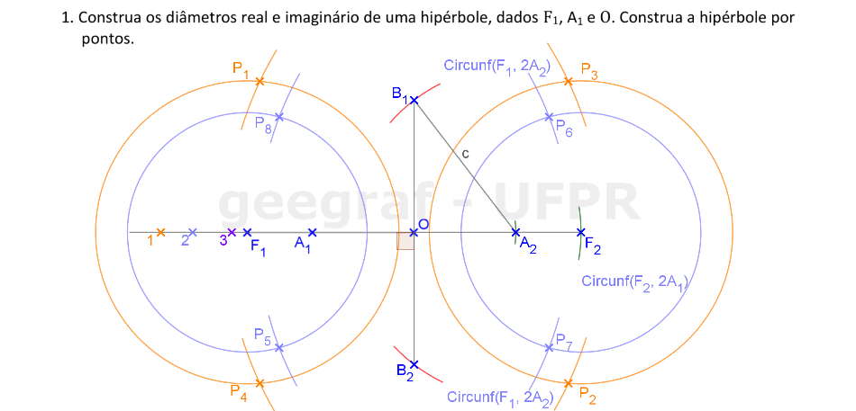
			   <figcaption>Invertendo-se os centros, mas usando as mesmas medidas de raios, obtemos mais dois pontos da cônica: as circunferências com centros em <b>F1</b> e <b>F2</b> com raios <b>2A2</b> e <b>2A1</b> determinam mais dois pontos da hipérbole.</figcaption>
		   </li>
		   <li>
			   <input type="radio" id="318" name="sl">
			   <label for="318"></label>
			   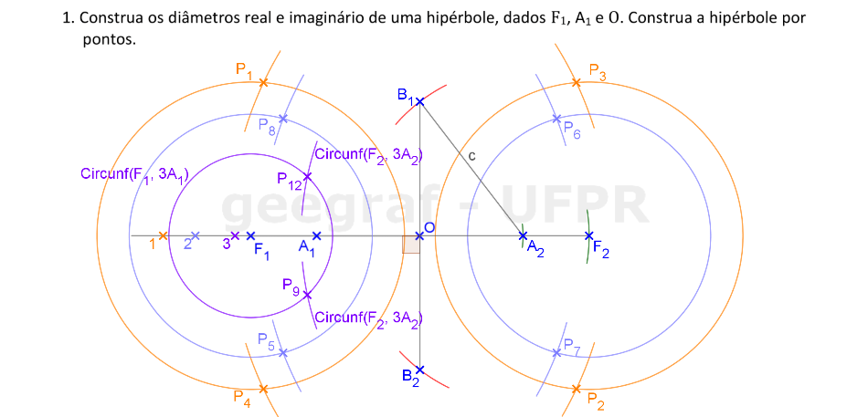
			   <figcaption>Usando o mesmo raciocínio com o ponto <b>3</b>, tomamos os raios com medidas iguais a <b>3A1</b> e <b>3A2</b>. As interseções das circunferências com centros em <b>F1</b> e <b>F2</b> com raios <b>3A1</b> e <b>3A2</b> são dois pontos da hipérbole.</figcaption>
		   </li>
		   <li>
			   <input type="radio" id="319" name="sl">
			   <label for="319"></label>
			   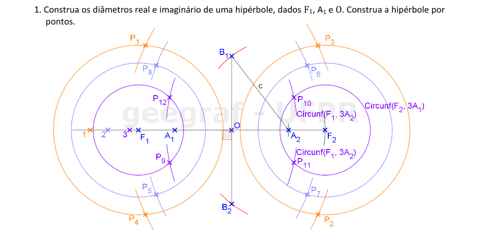
			   <figcaption>Invertendo-se os centros, mas usando as mesmas medidas de raios, obtemos mais dois pontos da cônica: as circunferências com centros em <b>F1</b> e <b>F2</b> com raios <b>3A2</b> e <b>3A1</b> determinam mais dois pontos da hipérbole.</figcaption>
		   </li>
		   <li>
			   <input type="radio" id="320" name="sl">
			   <label for="320"></label>
			   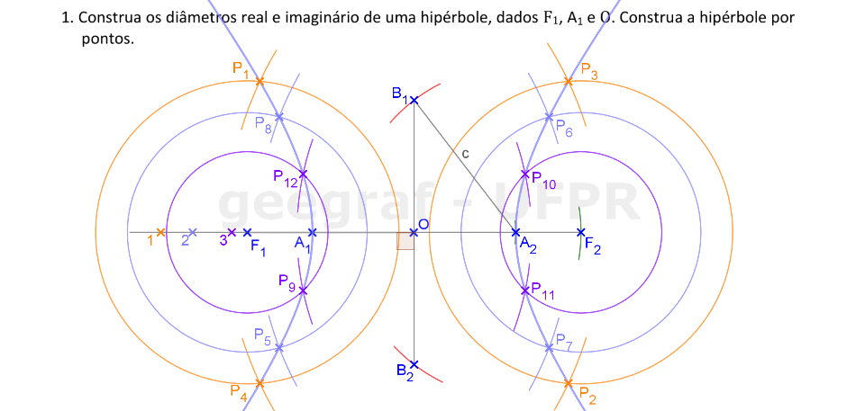
			   <figcaption>Depois, basta traçar a cônica à mão livre usando os pontos encontrados e os vértices do diâmetro real.</figcaption>
		   </li>
		</ul>
		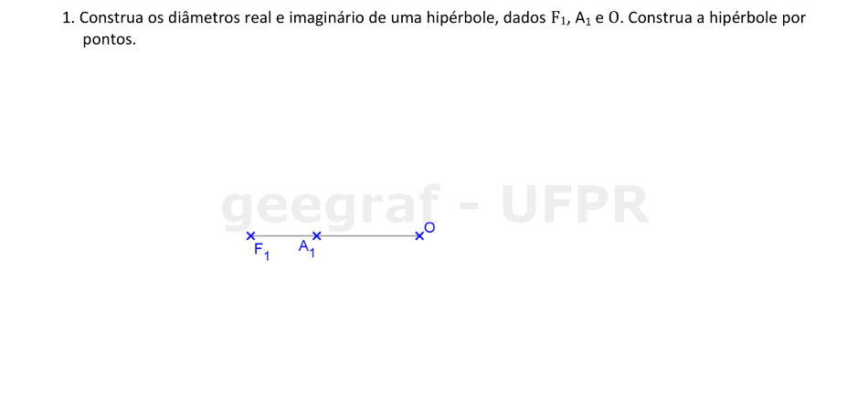
  

   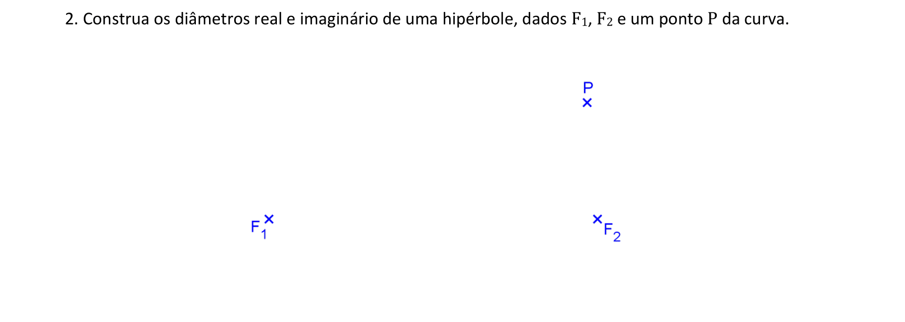
   

&#x1f4cf; &#x1f4d0; Resolução

	
Vamos encontrar os elementos principais de uma hipérbole dados os focos, e um ponto da curva.

	  <ul class="slider">
		   <li>
			   <input type="radio" id="321" name="sl">
			   <label for="321"></label>
			   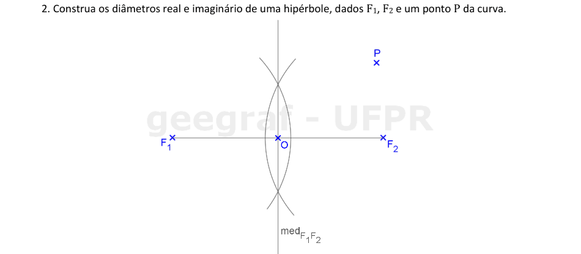
			   <figcaption>Começamos encontrando o centro da hipérbole construindo a mediatriz de <b>F1F2</b>.</figcaption>
		   </li>
		   <li>
			   <input type="radio" id="322" name="sl">
			   <label for="322"></label>
			   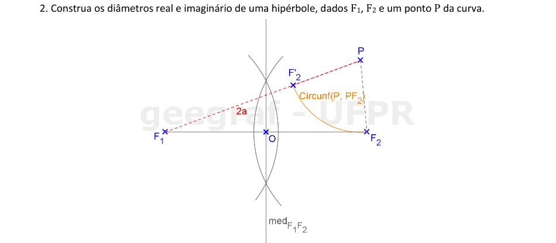
			   <figcaption>Como <b>PF1 - PF2 = 2a</b>, construímos a <b>Circunf(P, PF2)</b> para encontrar <b>PF'2</b> no segmento <b>PF1</b>. Logo, temos que <b>F1F'2 = 2a</b>.</figcaption>
		   </li>
		   <li>
			   <input type="radio" id="323" name="sl">
			   <label for="323"></label>
			   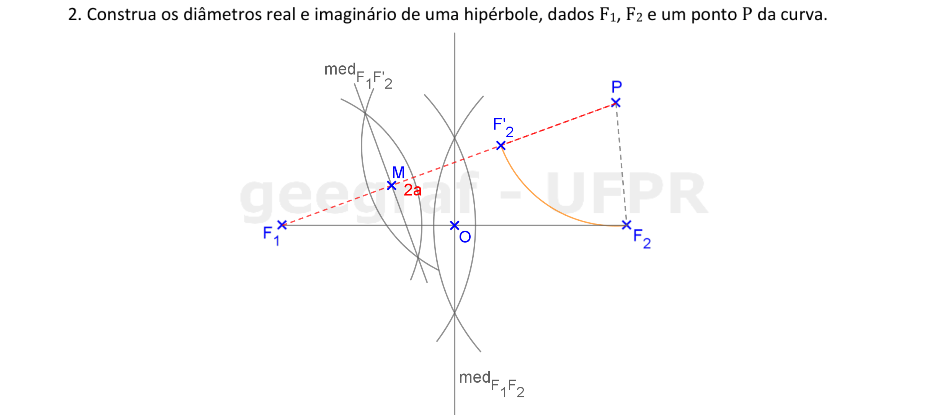
			   <figcaption>Determine a mediatriz de <b>F1F'2</b> para encontrar a medida do segmento <b>a</b>.</figcaption>
		   </li>
		   <li>
			   <input type="radio" id="324" name="sl">
			   <label for="324"></label>
			   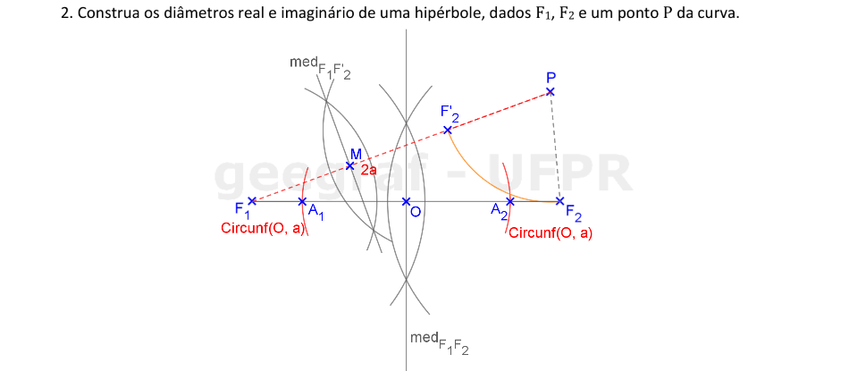
			   <figcaption>Obtenha os vértices <b>A1</b> e <b>A2</b>, simétricos em relação ao centro.</figcaption>
		   </li>
		   <li>
			   <input type="radio" id="325" name="sl">
			   <label for="325"></label>
			   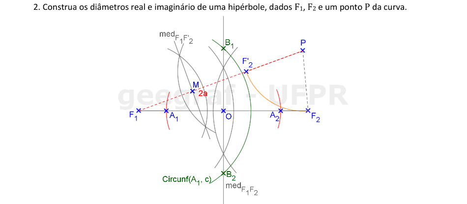
			   <figcaption>A distância entre os focos e os vértices do diâmetro imaginário é igual à metade da distância focal: <b>c</b>. Logo, para achar <b>B1</b> e <b>B2</b>, basta encontrar a interseção da mediatriz de <b>F1F2</b> com a <b>Circunf(A1, c)</b>.</figcaption>
		   </li>
		   <li>
			   <input type="radio" id="326" name="sl">
			   <label for="326"></label>
			   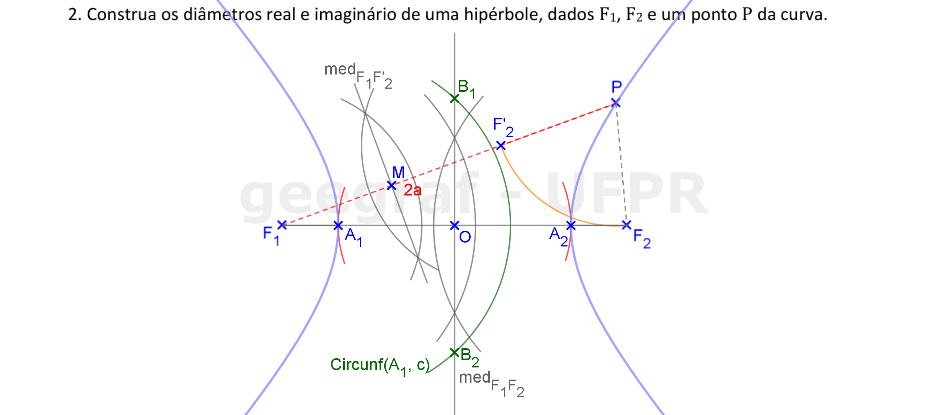
			   <figcaption>Para finalizar, construa a hipérbole à mão livre.</figcaption>
		   </li>
		</ul>
		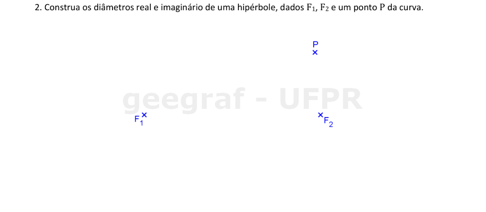
  

   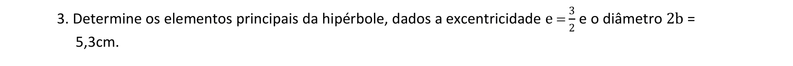
   
&#x1f4cf; &#x1f4d0; Exercício proposto 3.1

   
<a href="#modulo3" class="topo">voltar ao topo</a>

   
   

&#x1f4cf; &#x1f4d0; Resolução

	
Encontraremos os elementos principais de uma hipérbole um foco e os pontos simétricos em relação ao eixo imaginário.

	  <ul class="slider">
		   <li>
			   <input type="radio" id="327" name="sl">
			   <label for="327"></label>
			   
			   <figcaption>Como os pontos <b>P1</b> e <b>P2</b> são simétricos em relação ao eixo imaginário, a mediatriz de <b>P1P2</b> contém os vértices deste eixo.</figcaption>
		   </li>
		   <li>
			   <input type="radio" id="328" name="sl">
			   <label for="328"></label>
			   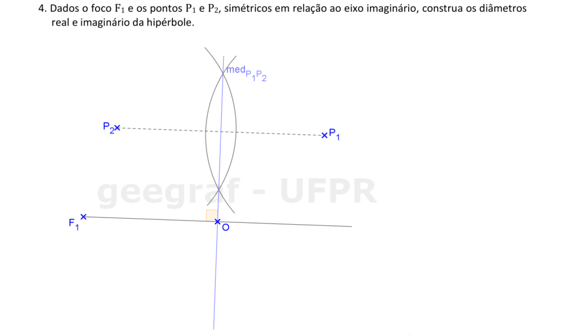
			   <figcaption>Construa a reta perpendicular à <b>medP1P2</b>, determinado o centro da hipérbole.</figcaption>
		   </li>
		   <li>
			   <input type="radio" id="329" name="sl">
			   <label for="329"></label>
			   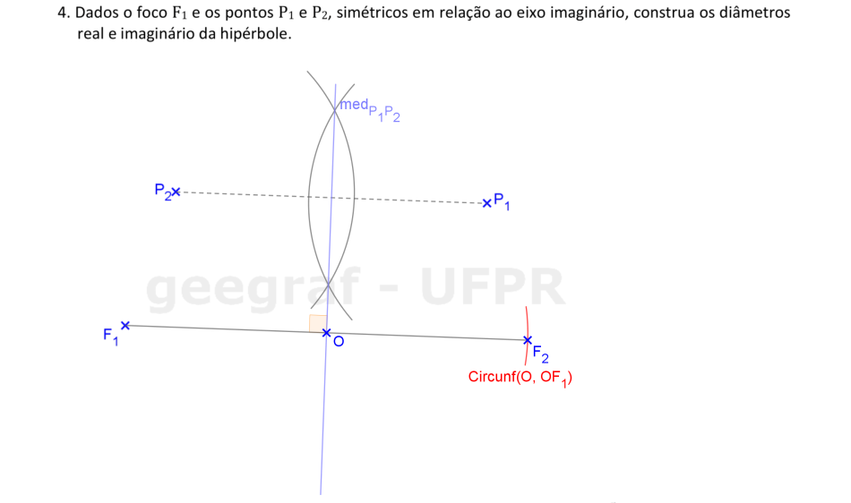
			   <figcaption>Encontre o simétrico de <b>F1</b> em relação ao centro <b>O</b>.</figcaption>
		   </li>
		   <li>
			   <input type="radio" id="330" name="sl">
			   <label for="330"></label>
			   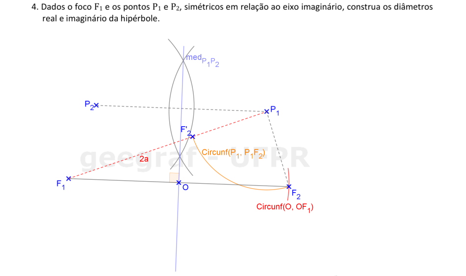
			   <figcaption>Como <b>P1</b> pertence à cônica, podemos unir <b>F1</b> e <b>P1</b> e construir a <b>Circunf(P1, P1F2)</b>, obtendo-se o segmento <b>F1F'2 = 2a</b>.</figcaption>
		   </li>
		   <li>
			   <input type="radio" id="331" name="sl">
			   <label for="331"></label>
			   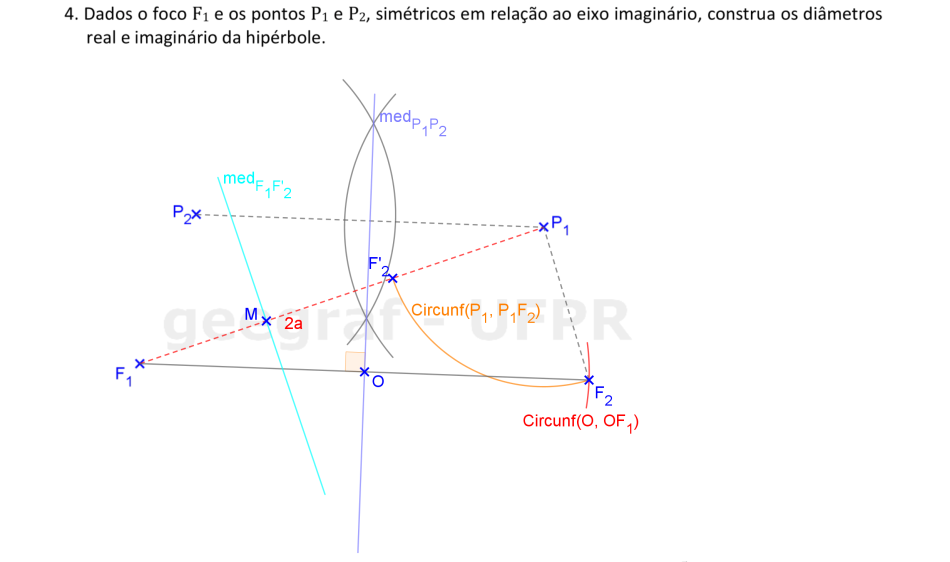
			   <figcaption>Encontre a mediatriz de <b>F1F'2</b> para determinar a medida <b>a</b>.</figcaption>
		   </li>
		   <li>
			   <input type="radio" id="332" name="sl">
			   <label for="332"></label>
			   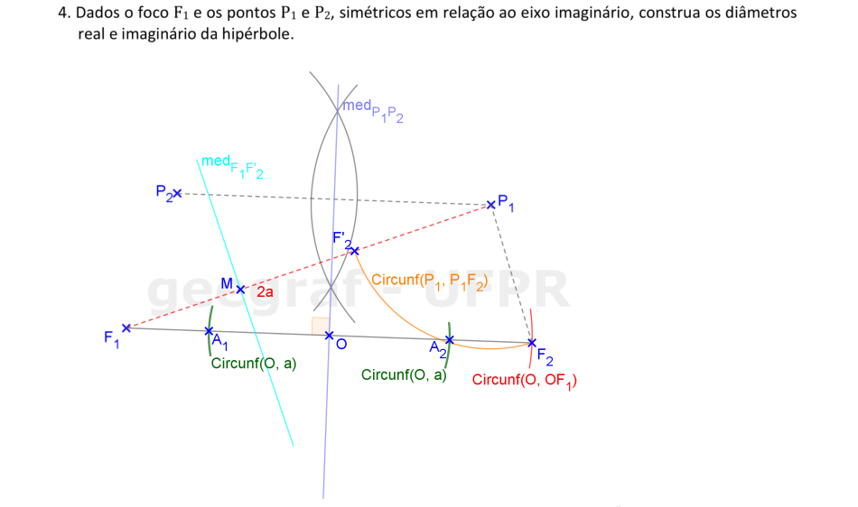
			   <figcaption>Construa os vértices do diâmetro real, simétricos em relaçao ao centro da cônica.</figcaption>
		   </li>
		   <li>
			   <input type="radio" id="333" name="sl">
			   <label for="333"></label>
			   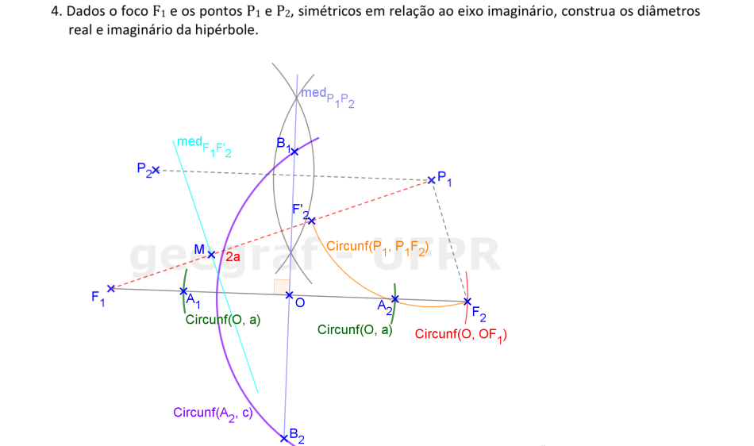
			   <figcaption>Para achar <b>B1</b> e <b>B2</b>, encontre a interseção da mediatriz de <b>P1P2</b> com a <b>Circunf(A2, c)</b>.</figcaption>
		   </li>
		   <li>
			   <input type="radio" id="334" name="sl">
			   <label for="334"></label>
			   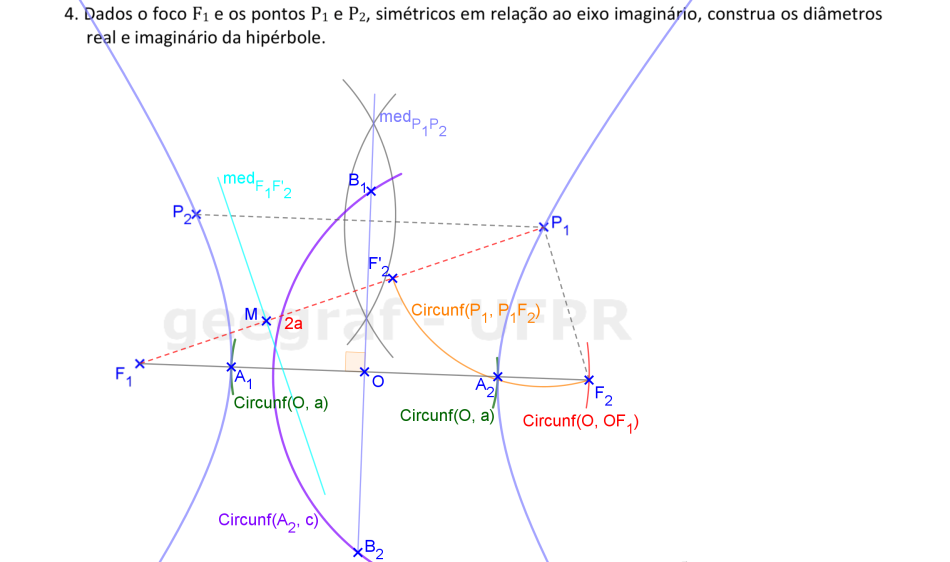
			   <figcaption>Finalizando, construa a hipérbole à mão livre.</figcaption>
		   </li>
		</ul>
		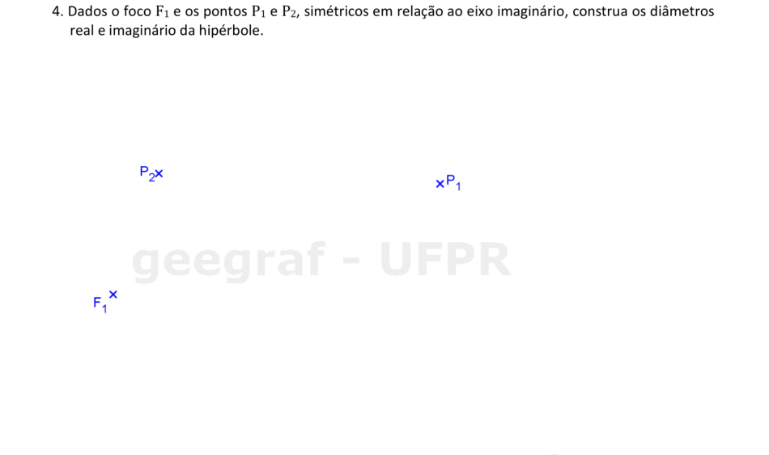
  

   
   

&#x1f4cf; &#x1f4d0; Resolução

	
Vamos construir os elementos principais de uma hipérbole dada pelo diâmetro <b>2a</b> e pela excentricidade.

	  <ul class="slider">
		   <li>
			   <input type="radio" id="335" name="sl">
			   <label for="335"></label>
			   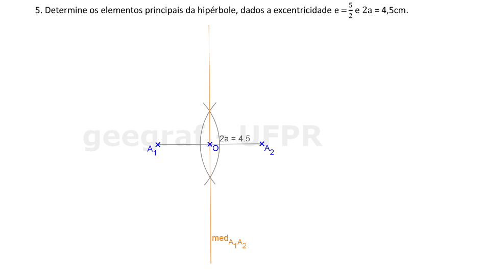
			   <figcaption>Vamos iniciar encontrando o segmento <b>2a</b> e a <b>medA1A2</b>.</figcaption>
		   </li>
		   <li>
			   <input type="radio" id="336" name="sl">
			   <label for="336"></label>
			   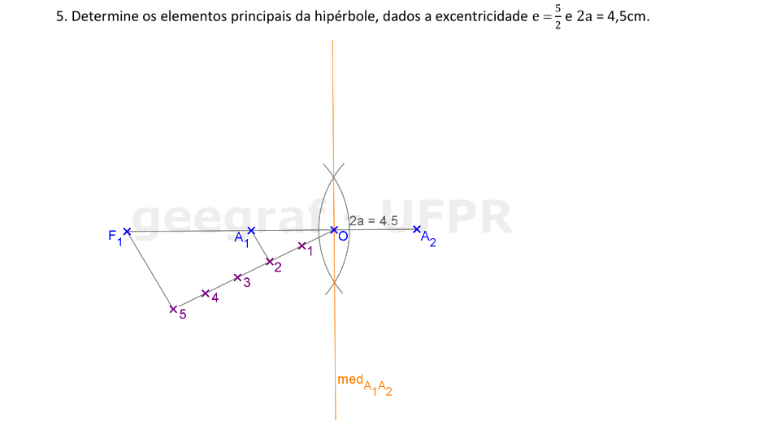
			   <figcaption>Usando o teorema de Tales, determinamos a proporção da excentricidade $\mathsf{ {c \over a} = {5 \over 2}}$ fazendo $\mathsf{ {O5 \over O2} = {5 \over 2}}$. Logo, encontramos o foco <b>F1</b>.</figcaption>
		   </li>
		   <li>
			   <input type="radio" id="337" name="sl">
			   <label for="337"></label>
			   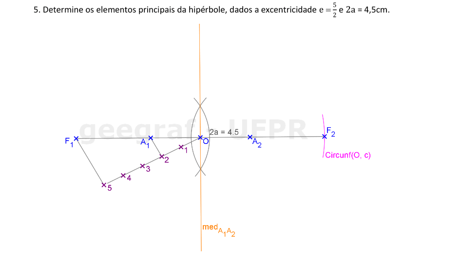
			   <figcaption>Encontre o simétrico de <b>F1</b> em relação ao centro da hipérbole.</figcaption>
		   </li>
		   <li>
			   <input type="radio" id="338" name="sl">
			   <label for="338"></label>
			   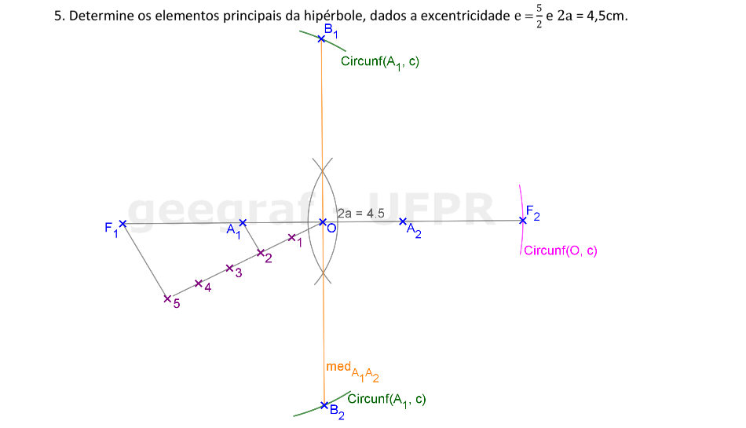
			   <figcaption>A <b>Circunf(A1, c)</b> determina os vértices <b>B1</b> e <b>B2</b> na mediatriz de <b>A1A2</b>.</figcaption>
		   </li>
		   <li>
			   <input type="radio" id="339" name="sl">
			   <label for="339"></label>
			   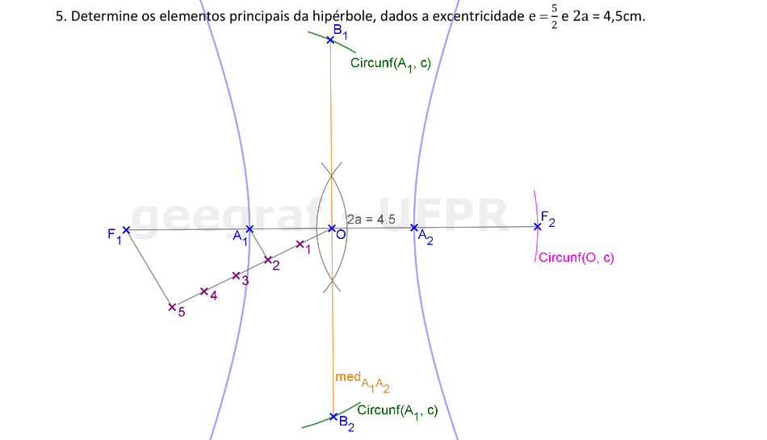
			   <figcaption>Para finalizar, basta construir a hipérbole à mão livre.</figcaption>
		   </li>
		</ul>
		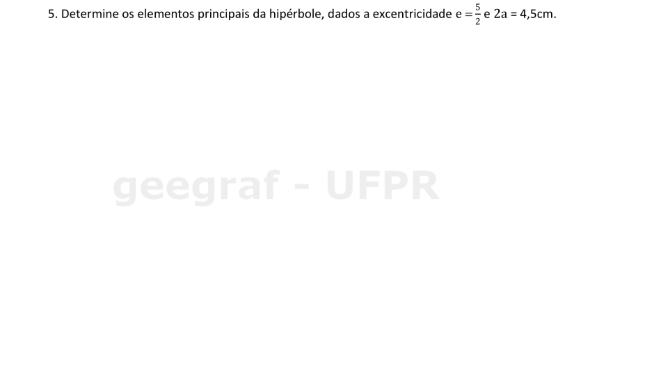
  

   
   

&#x1f4cf; &#x1f4d0; Resolução

	
Vamos construir os elementos principais de uma hipérbole dada pelo diâmetro <b>2c</b> e pela excentricidade.

	  <ul class="slider">
		   <li>
			   <input type="radio" id="340" name="sl">
			   <label for="340"></label>
			   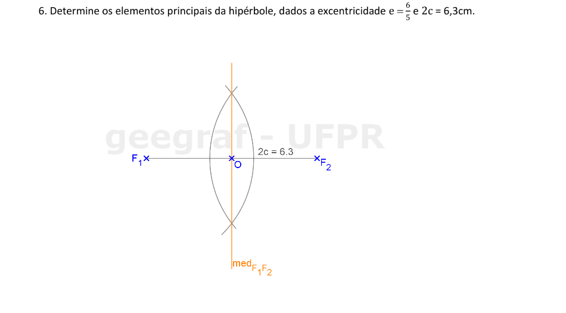
			   <figcaption>Vamos iniciar encontrando o segmento <b>2c</b> e a <b>medF1F2</b>.</figcaption>
		   </li>
		   <li>
			   <input type="radio" id="341" name="sl">
			   <label for="341"></label>
			   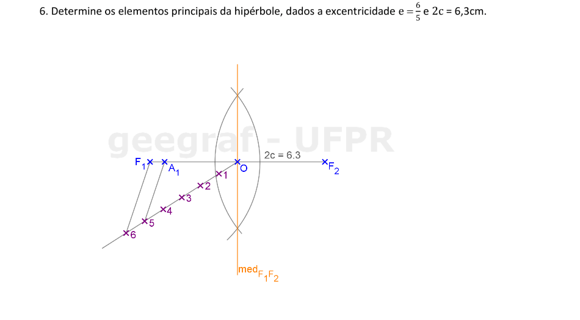
			   <figcaption>Usando o teorema de Tales, determinamos a proporção da excentricidade $\mathsf{ {c \over a} = {6 \over 5}}$ fazendo $\mathsf{ {O6 \over O5} = {6 \over 5}}$. Logo, encontramos o vértice <b>A1</b>.</figcaption>
		   </li>
		   <li>
			   <input type="radio" id="342" name="sl">
			   <label for="342"></label>
			   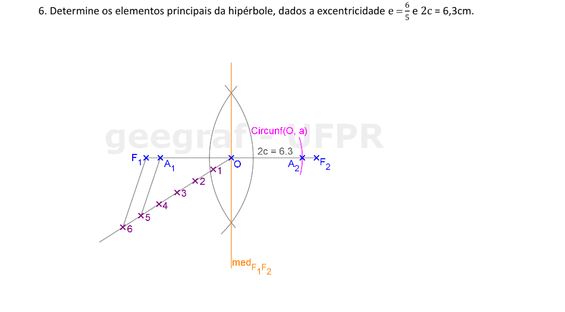
			   <figcaption>Encontre o simétrico de <b>A1</b> em relação ao centro da hipérbole.</figcaption>
		   </li>
		   <li>
			   <input type="radio" id="343" name="sl">
			   <label for="343"></label>
			   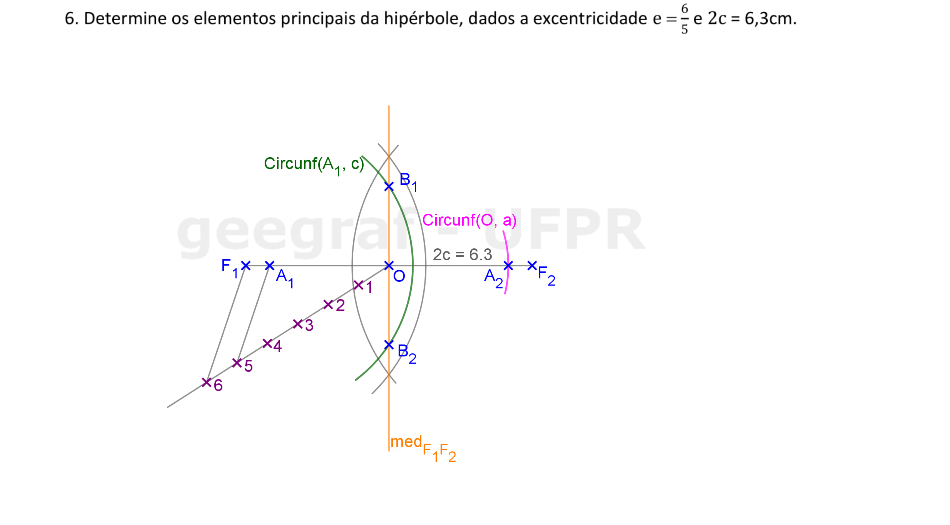
			   <figcaption>A <b>Circunf(A1, c)</b> determina os vértices <b>B1</b> e <b>B2</b> na mediatriz de <b>F1F2</b>.</figcaption>
		   </li>
		   <li>
			   <input type="radio" id="344" name="sl">
			   <label for="344"></label>
			   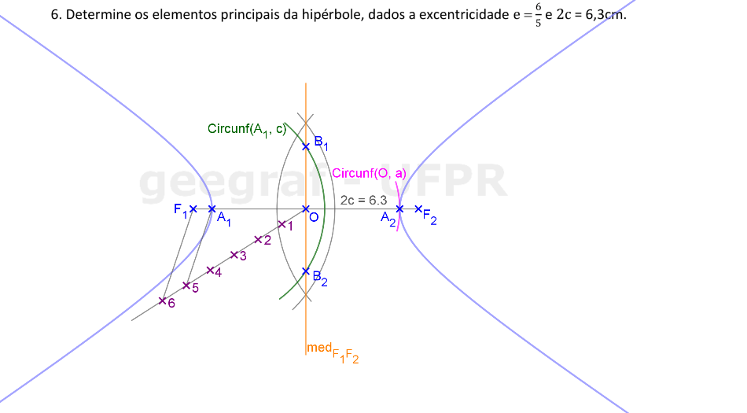
			   <figcaption>Para finalizar, basta construir a hipérbole à mão livre.</figcaption>
		   </li>
		</ul>
		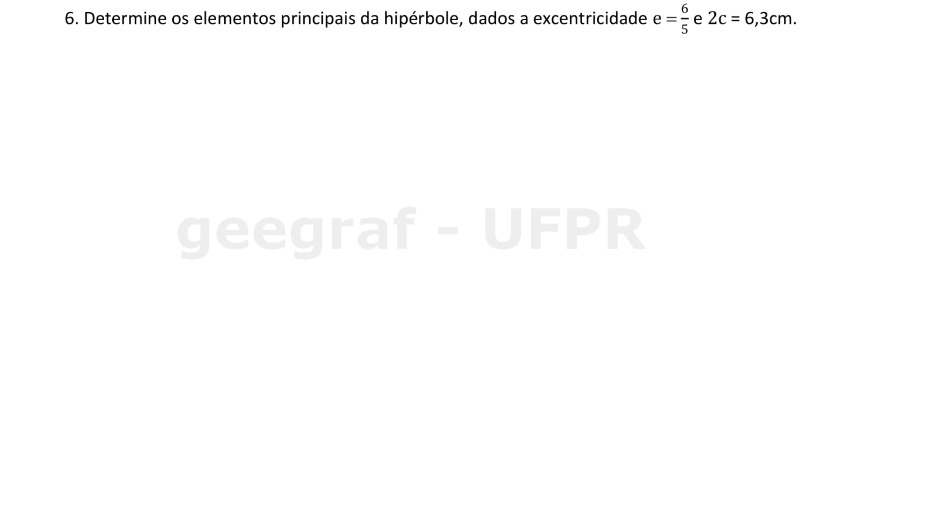
  

   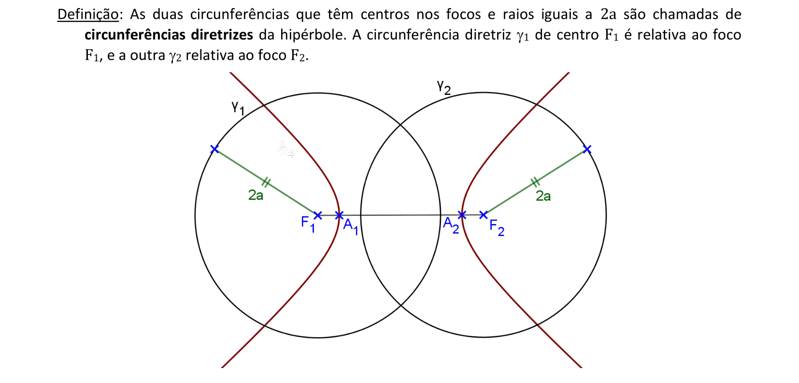
   
<a href="#modulo3" class="topo">voltar ao topo</a>

   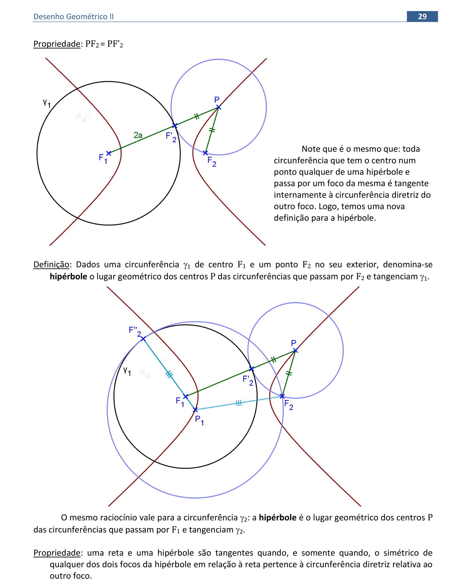
   
<a href="#modulo3" class="topo">voltar ao topo</a>

   
   
<a href="#modulo3" class="topo">voltar ao topo</a>

   
   

&#x1f4cf; &#x1f4d0; Resolução

	
Vamos construir as retas tangentes à hipérbole, dada pelos focos e pela distância <b>2a</b>, que passam pelo ponto <b>P</b>.

	  <ul class="slider">
		   <li>
			   <input type="radio" id="345" name="sl">
			   <label for="345"></label>
			   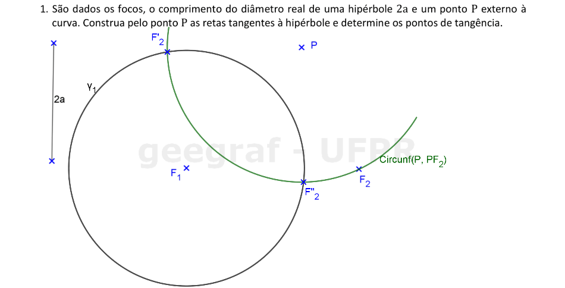
			   <figcaption>Começamos construindo a circunferência diretriz <b>&gamma;1</b> com centro em <b>F1</b> e raio <b>2a</b>. Os simétricos de <b>F2</b> em relação à reta tangente pertencem à circunferência diretriz: logo, construímos a <b>Circunf(P, PF2)</b> para encontrar os dois simétricos de <b>F2</b> em relação às tangentes à hipérbole que passam pelo ponto dado.</figcaption>
		   </li>
		   <li>
			   <input type="radio" id="346" name="sl">
			   <label for="346"></label>
			   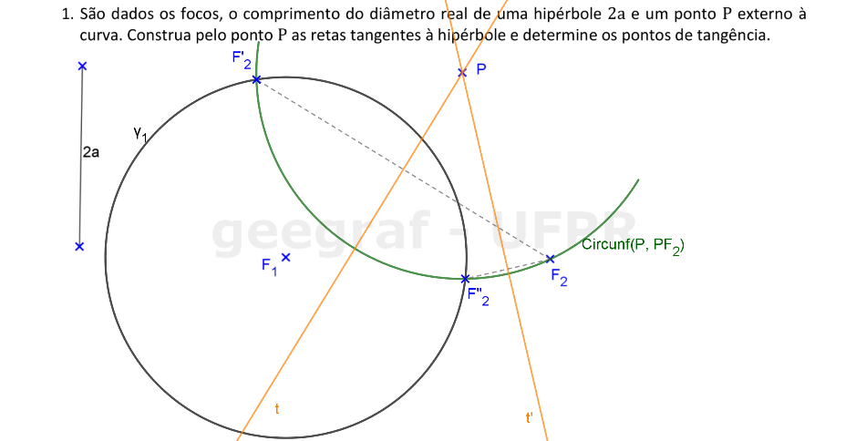
			   <figcaption>Construa as mediatrizes de <b>F2F'2</b> e de <b>F2F''2</b> que são as tangentes à hipérbole que passam por <b>P</b>.</figcaption>
		   </li>
		   <li>
			   <input type="radio" id="347" name="sl">
			   <label for="347"></label>
			   
			   <figcaption>Unindo <b>F1</b> com <b>F'2</b> e com <b>F''2</b>, encontramos os pontos de tangência <b>T</b> e <b>T'</b>.</figcaption>
		   </li>
		   <li>
			   <input type="radio" id="348" name="sl">
			   <label for="348"></label>
			   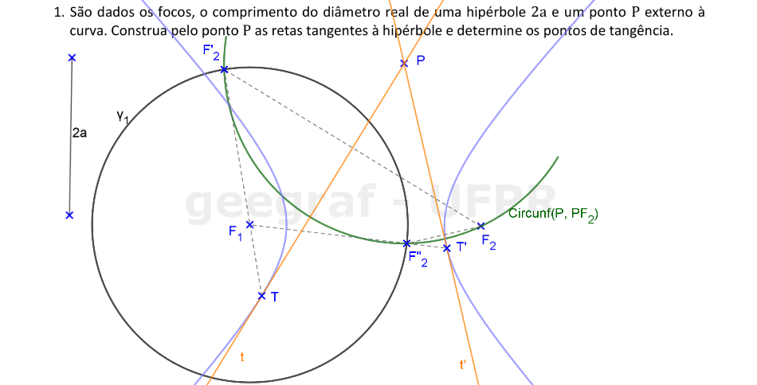
			   <figcaption>Para finalizar, basta construir a hipérbole à mão livre.</figcaption>
		   </li>
		</ul>
		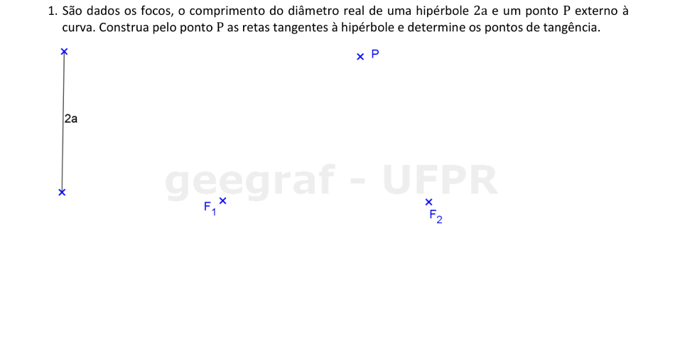
  

   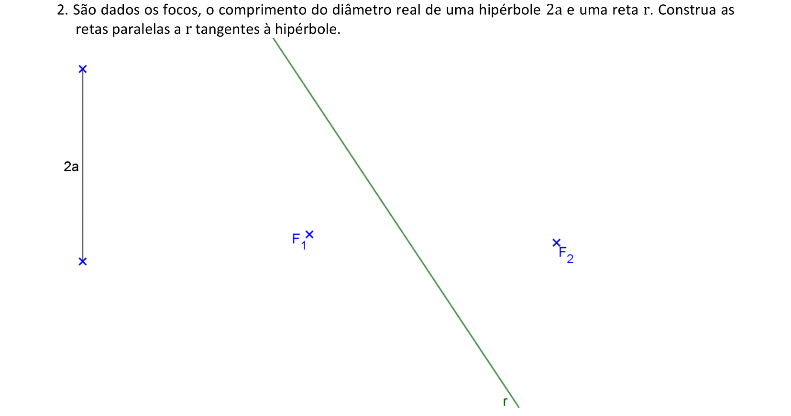
   

&#x1f4cf; &#x1f4d0; Resolução

	
Vamos construir as retas tangentes à hipérbole, dada pelos focos e pela distância <b>2a</b>, que são paralelas à reta <b>r</b>.

	  <ul class="slider">
		   <li>
			   <input type="radio" id="349" name="sl">
			   <label for="349"></label>
			   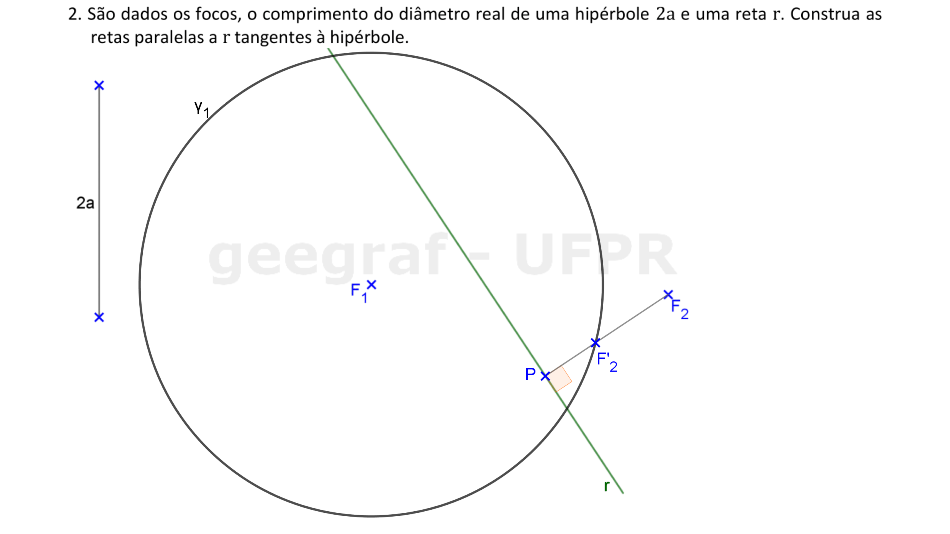
			   <figcaption>Começamos construindo a circunferência diretriz <b>&gamma;1</b> com centro em <b>F1</b> e raio <b>2a</b>. O simétrico de <b>F2</b> em relação à reta tangente pertence à circunferência diretriz: logo, construímos a reta <b>PF2 &perp; r</b> para encontrar o simétrico de <b>F2</b> em relação a uma tangente da hipérbole paralela a <b>r</b>.</figcaption>
		   </li>
		   <li>
			   <input type="radio" id="350" name="sl">
			   <label for="350"></label>
			   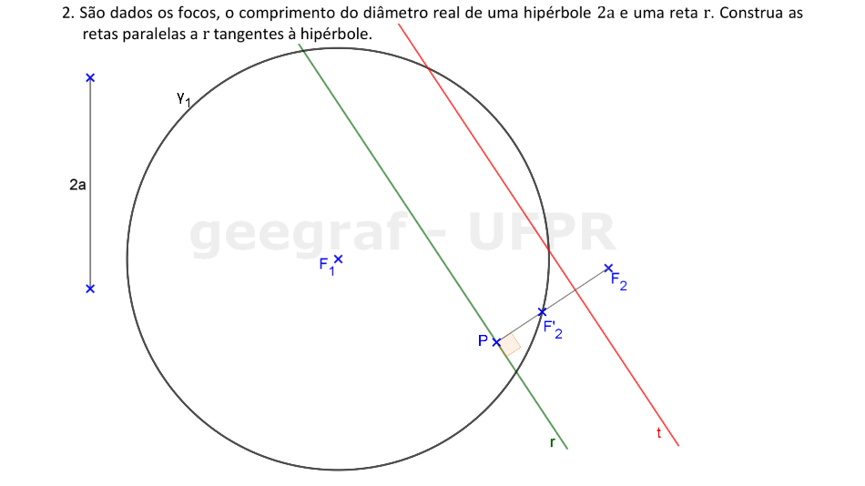
			   <figcaption>Construa a mediatriz de <b>F2F'2</b> que é uma das tangentes à hipérbole paralela à reta <b>r</b>.</figcaption>
		   </li>
		   <li>
			   <input type="radio" id="351" name="sl">
			   <label for="351"></label>
			   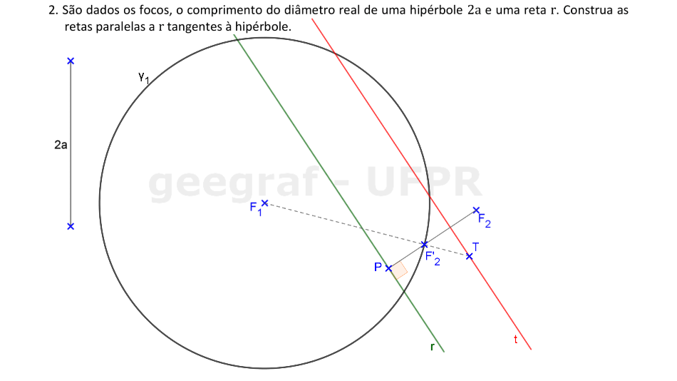
			   <figcaption>Unindo <b>F1</b> com <b>F'2</b>, encontramos o ponto de tangência <b>T</b> na reta <b>t</b>.</figcaption>
		   </li>
		   <li>
			   <input type="radio" id="352" name="sl">
			   <label for="352"></label>
			   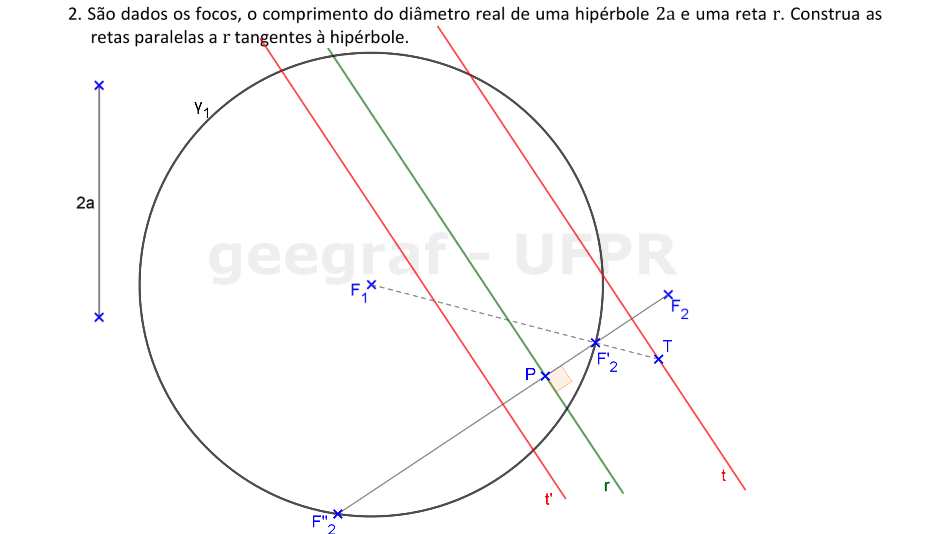
			   <figcaption>Construa o prolongamento de <b>PF2</b> para encontrar o simétrico <b>F''2</b> na circunferência diretriz. Construa a mediatriz de <b>F2F''2</b> que é a segunda tangente à hipérbole paralela à reta <b>r</b>.</figcaption>
		   </li>
		   <li>
			   <input type="radio" id="353" name="sl">
			   <label for="353"></label>
			   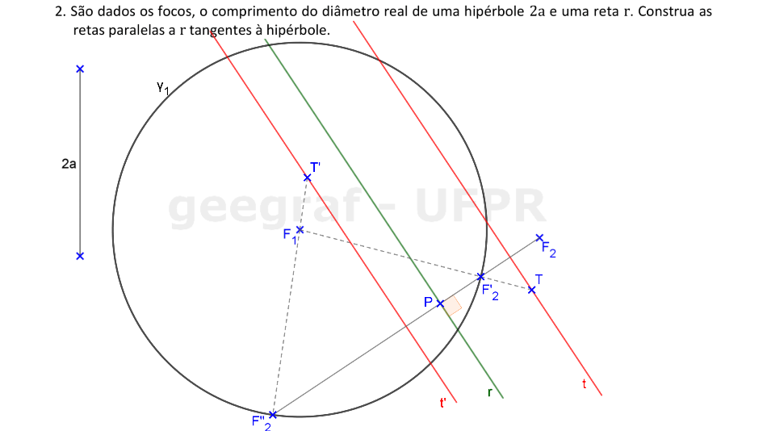
			   <figcaption>Unindo <b>F1</b> com <b>F''2</b>, encontramos o ponto de tangência <b>T'</b> na reta <b>t'</b>.</figcaption>
		   </li>
		   <li>
			   <input type="radio" id="354" name="sl">
			   <label for="354"></label>
			   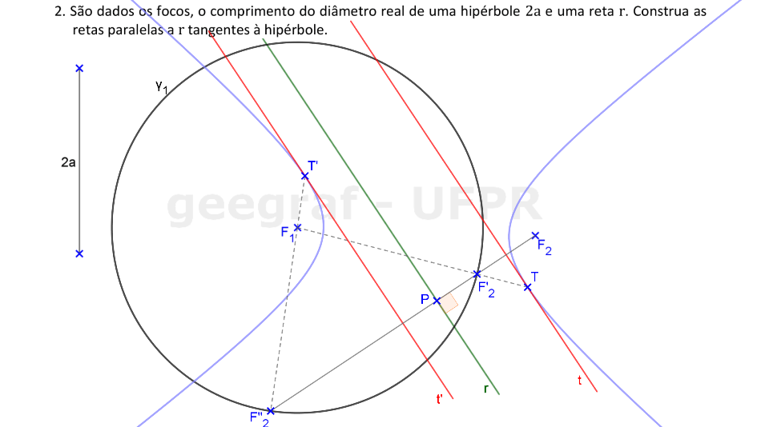
			   <figcaption>Para finalizar, basta construir a hipérbole à mão livre.</figcaption>
		   </li>
		</ul>
		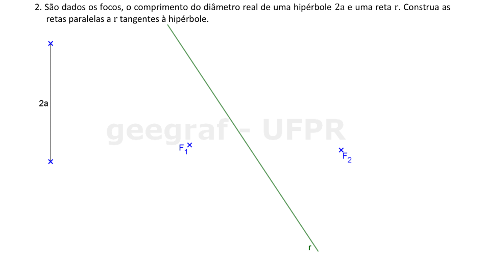
  

   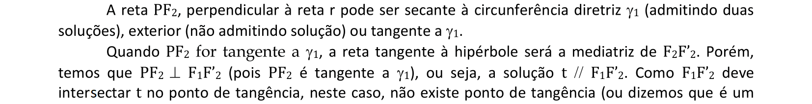
   
<a href="#modulo3" class="topo">voltar ao topo</a>

   
   
<a href="#modulo3" class="topo">voltar ao topo</a>

   
   
<a href="#modulo3" class="topo">voltar ao topo</a>

   
   
<a href="#modulo3" class="topo">voltar ao topo</a>

   
   

&#x1f4cf; &#x1f4d0; Resolução

	
Vamos construir os elementos principais de uma hipérbole dada por um foco, um vértice e uma reta tangente.

	  <ul class="slider">
		   <li>
			   <input type="radio" id="355" name="sl">
			   <label for="355"></label>
			   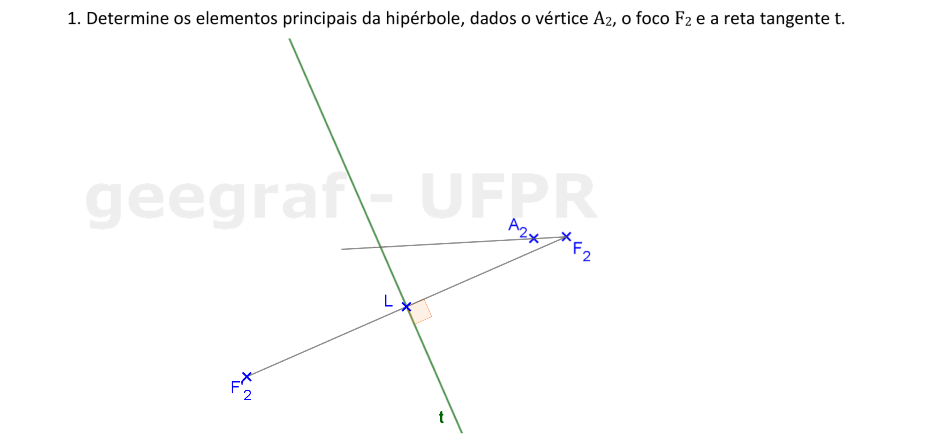
			   <figcaption>Começamos construindo o simétrico do foco <b>F2</b> em relação à reta <b>t</b>, encontrando os pontos <b>L</b> e <b>F'2</b>.</figcaption>
		   </li>
		   <li>
			   <input type="radio" id="356" name="sl">
			   <label for="356"></label>
			   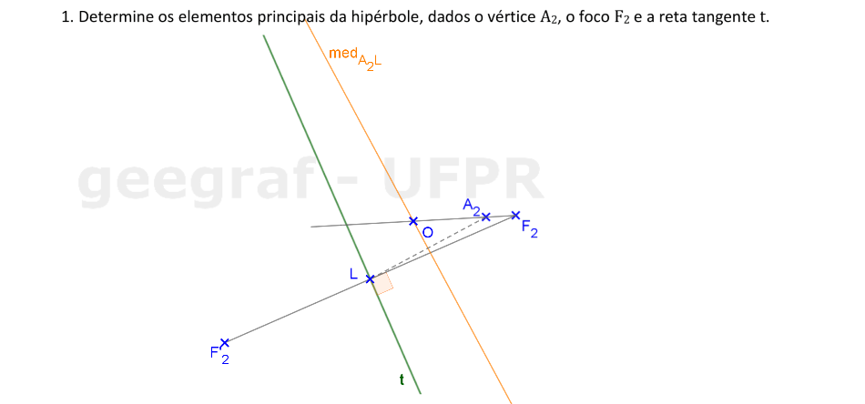
			   <figcaption>A circunferência principal da hipérbole tem centro em <b>O</b> e passa pelo vértice <b>A2</b> e <b>L</b>: logo, para encontrar <b>O</b>, basta construir a mediatriz de <b>A2L</b>.</figcaption>
		   </li>
		   <li>
			   <input type="radio" id="357" name="sl">
			   <label for="357"></label>
			   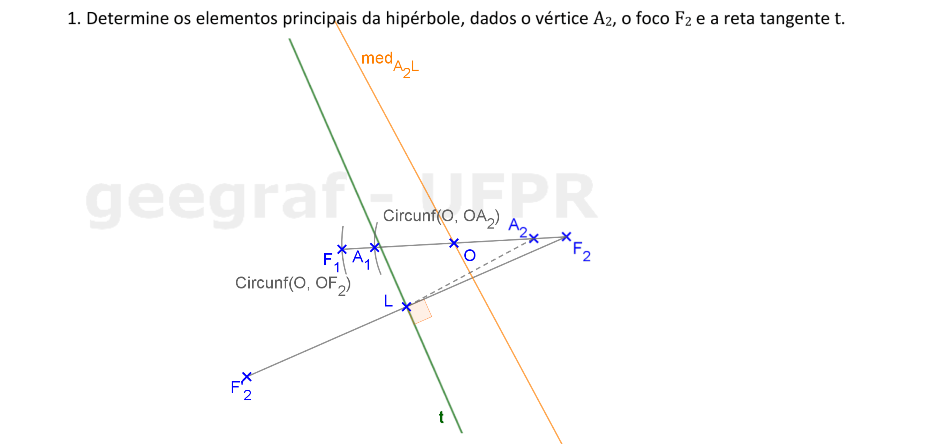
			   <figcaption>Encontre os simétricos de <b>F2</b> e de <b>A2</b> em relação ao centro <b>O</b>.</figcaption>
		   </li>
		   <li>
			   <input type="radio" id="358" name="sl">
			   <label for="358"></label>
			   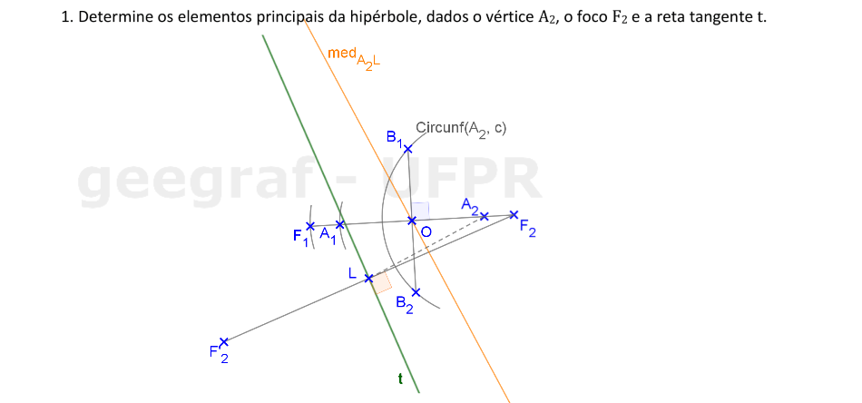
			   <figcaption>A <b>Circunf(A2, c)</b> determina os vértices <b>B1</b> e <b>B2</b> na reta perpendicular ao diâmetro real que passa por <b>O</b>.</figcaption>
		   </li>
		   <li>
			   <input type="radio" id="359" name="sl">
			   <label for="359"></label>
			   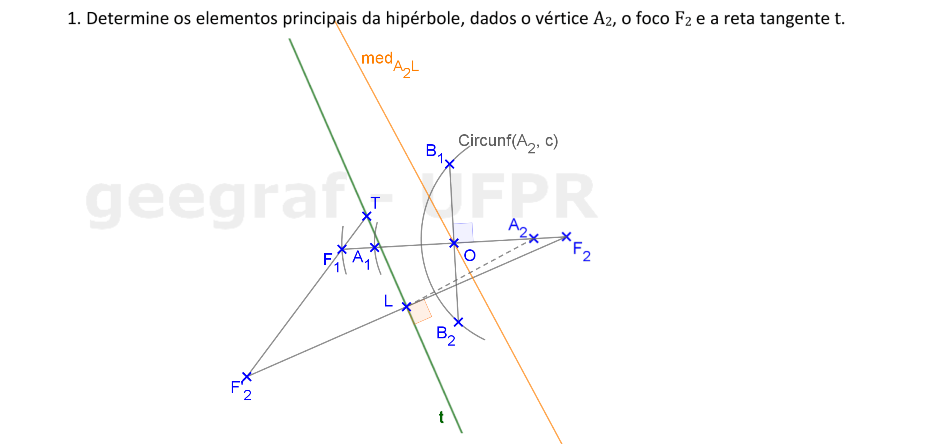
			   <figcaption>Unindo <b>F1</b> com <b>F'2</b>, encontramos o ponto de tangência <b>T</b> na reta <b>t</b>.</figcaption>
		   </li>
		   <li>
			   <input type="radio" id="360" name="sl">
			   <label for="360"></label>
			   
			   <figcaption>Para finalizar, basta construir a hipérbole à mão livre.</figcaption>
		   </li>
		</ul>
		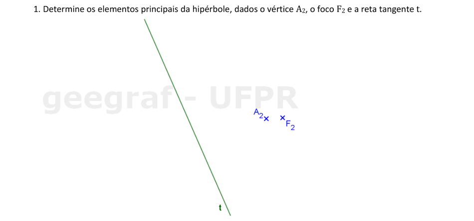
  

   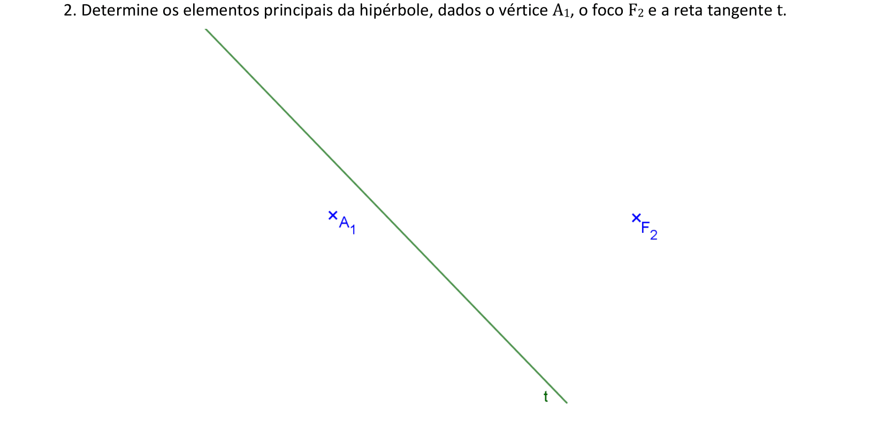
   

&#x1f4cf; &#x1f4d0; Resolução

	
Vamos construir os elementos principais de uma hipérbole dada por um foco, um vértice e uma reta tangente.

	  <ul class="slider">
		   <li>
			   <input type="radio" id="361" name="sl">
			   <label for="361"></label>
			   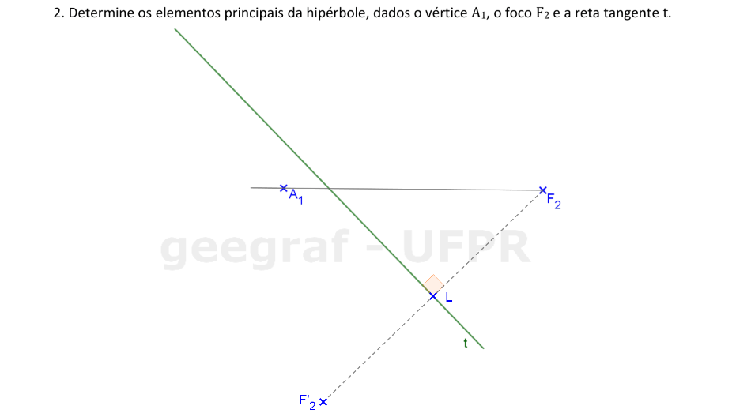
			   <figcaption>Começamos construindo o simétrico do foco <b>F2</b> em relação à reta <b>t</b>, encontrando os pontos <b>L</b> e <b>F'2</b>.</figcaption>
		   </li>
		   <li>
			   <input type="radio" id="362" name="sl">
			   <label for="362"></label>
			   
			   <figcaption>A circunferência principal da hipérbole tem centro em <b>O</b> e passa pelo vértice <b>A1</b> e <b>L</b>: logo, para encontrar <b>O</b>, basta construir a mediatriz de <b>A1L</b>.</figcaption>
		   </li>
		   <li>
			   <input type="radio" id="363" name="sl">
			   <label for="363"></label>
			   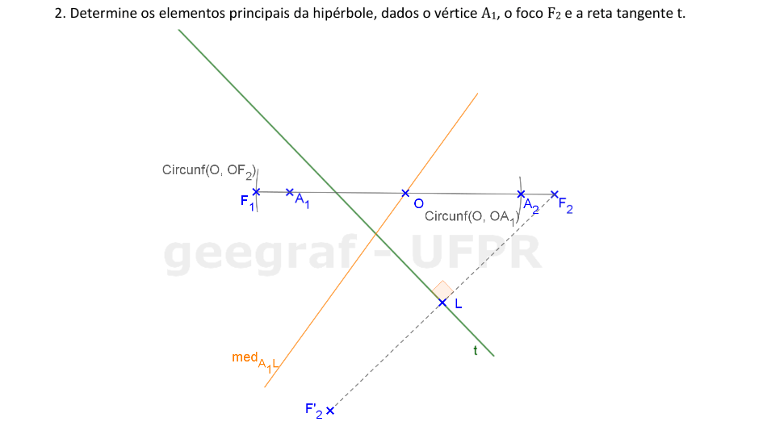
			   <figcaption>Encontre os simétricos de <b>F2</b> e de <b>A1</b> em relação ao centro <b>O</b>.</figcaption>
		   </li>
		   <li>
			   <input type="radio" id="364" name="sl">
			   <label for="364"></label>
			   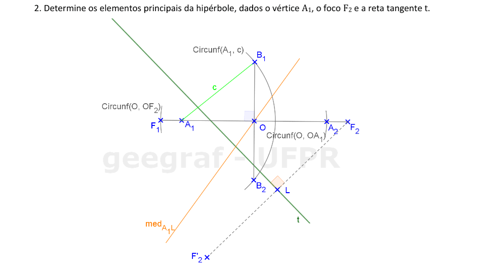
			   <figcaption>A <b>Circunf(A1, c)</b> determina os vértices <b>B1</b> e <b>B2</b> na reta perpendicular ao diâmetro real que passa por <b>O</b>.</figcaption>
		   </li>
		   <li>
			   <input type="radio" id="365" name="sl">
			   <label for="365"></label>
			   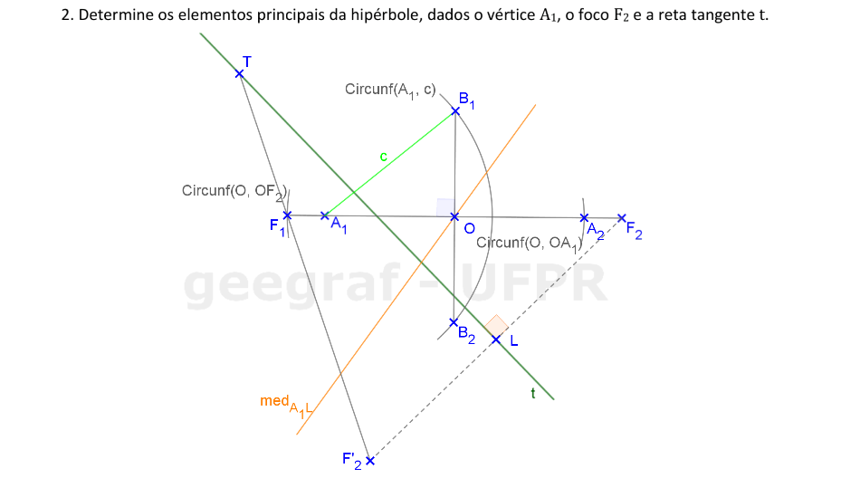
			   <figcaption>Unindo <b>F1</b> com <b>F'2</b>, encontramos o ponto de tangência <b>T</b> na reta <b>t</b>.</figcaption>
		   </li>
		   <li>
			   <input type="radio" id="366" name="sl">
			   <label for="366"></label>
			   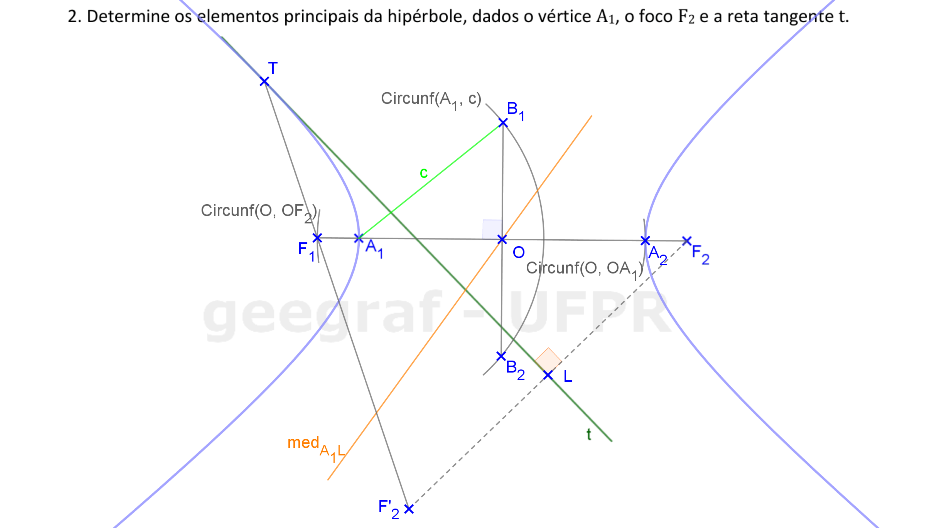
			   <figcaption>Para finalizar, basta construir a hipérbole à mão livre.</figcaption>
		   </li>
		</ul>
		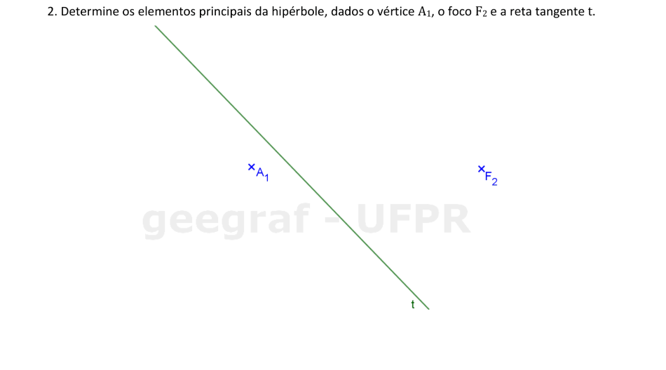
  

   
<a href="#modulo3" class="topo">voltar ao topo</a>

   
   

&#x1f4cf; &#x1f4d0; Resolução

	
Vamos construir os elementos principais de uma hipérbole dada pelo diâmetro real e uma reta tangente.

	  <ul class="slider">
		   <li>
			   <input type="radio" id="367" name="sl">
			   <label for="367"></label>
			   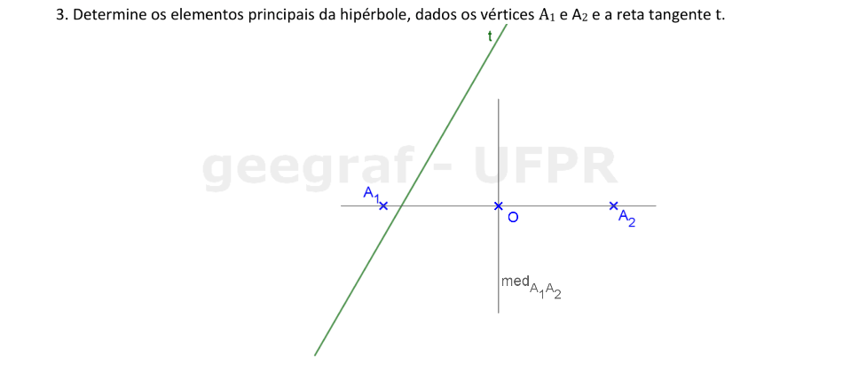
			   <figcaption>Começamos construindo a mediatriz de <b>A1A2</b> para encontrar o centro da hipérbole.</figcaption>
		   </li>
		   <li>
			   <input type="radio" id="368" name="sl">
			   <label for="368"></label>
			   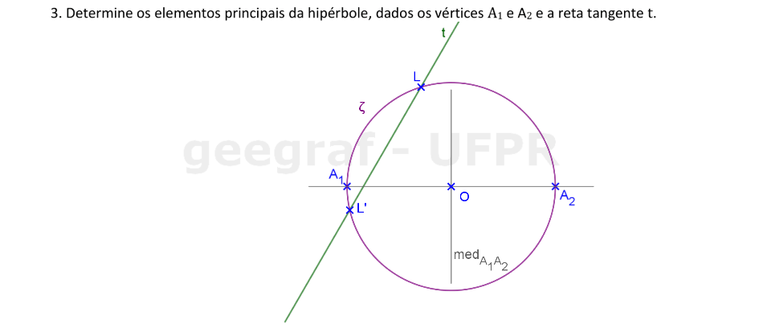
			   <figcaption>A circunferência principal da hipérbole tem centro em <b>O</b> e passa pelos vértices <b>A1</b> e <b>A2</b>, determinando os pontos <b>L</b> e <b>L'</b> na reta <b>t</b>.</figcaption>
		   </li>
		   <li>
			   <input type="radio" id="369" name="sl">
			   <label for="369"></label>
			   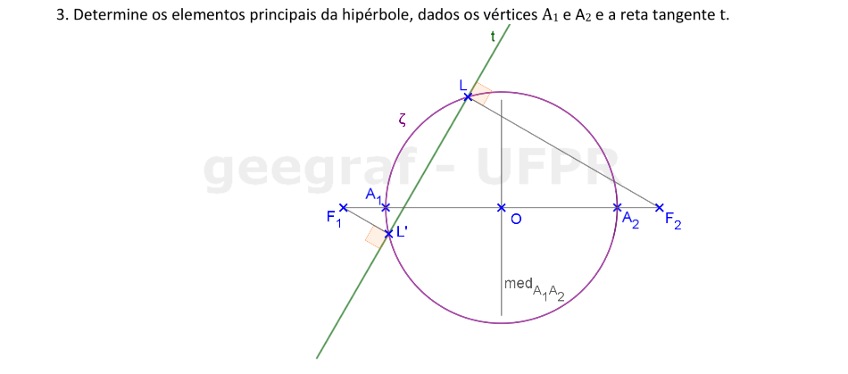
			   <figcaption>As retas perpendiculares à reta <b>t</b> que passam por <b>L</b> e <b>L'</b> determinam os focos nos prolongamentos do diâmetro real.</figcaption>
		   </li>
		   <li>
			   <input type="radio" id="370" name="sl">
			   <label for="370"></label>
			   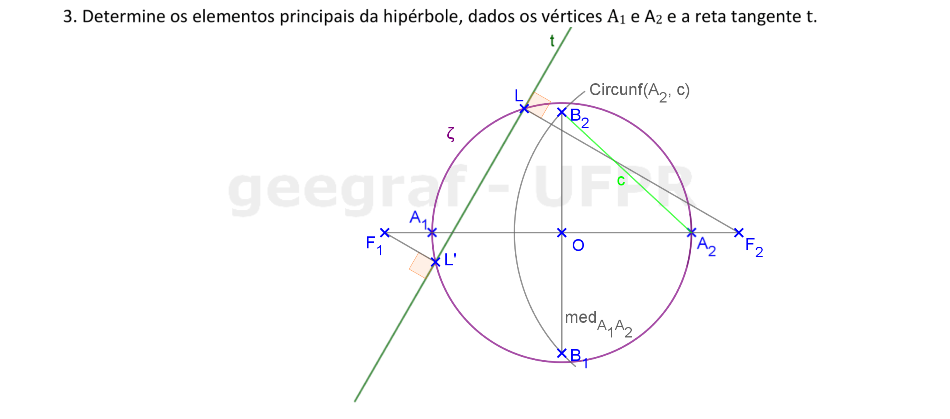
			   <figcaption>A <b>Circunf(A2, c)</b> determina os vértices <b>B1</b> e <b>B2</b> na mediatriz de <b>A1A2</b>.</figcaption>
		   </li>
		   <li>
			   <input type="radio" id="371" name="sl">
			   <label for="371"></label>
			   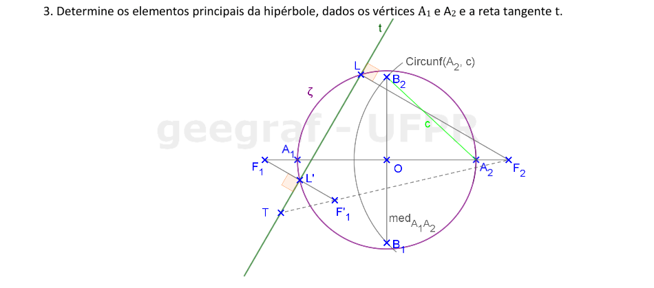
			   <figcaption>Determine o simétrico de <b>F1</b> em relação à reta tangente. Unindo <b>F2</b> com <b>F'1</b>, encontramos o ponto de tangência <b>T</b> na reta <b>t</b>.</figcaption>
		   </li>
		   <li>
			   <input type="radio" id="372" name="sl">
			   <label for="372"></label>
			   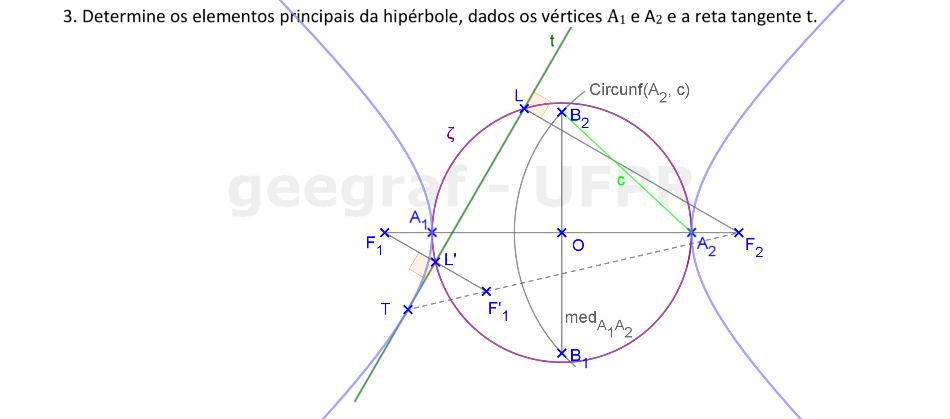
			   <figcaption>Para finalizar, basta construir a hipérbole à mão livre.</figcaption>
		   </li>
		</ul>
		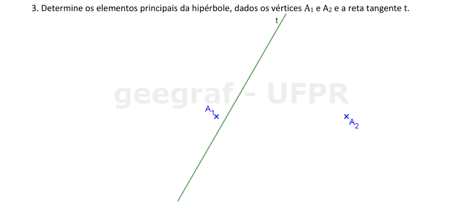
  

   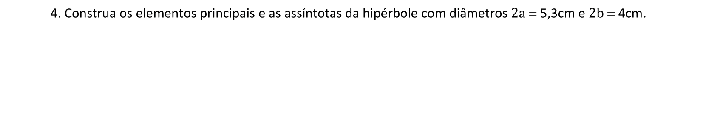
   

&#x1f4cf; &#x1f4d0; Resolução

	
Vamos construir os elementos principais e as assíntotas de uma hipérbole dada pelos diâmetros real e imaginário.

	  <ul class="slider">
		   <li>
			   <input type="radio" id="374" name="sl">
			   <label for="374"></label>
			   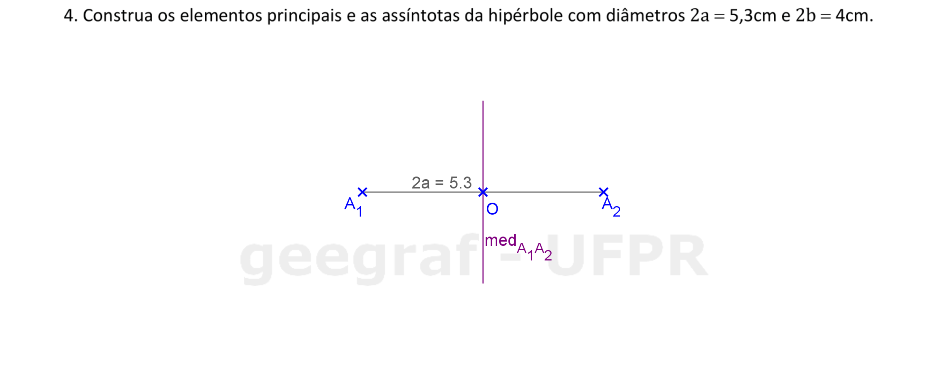
			   <figcaption>Construa a mediatriz de <b>A1A2</b> para encontrar o centro da hipérbole.</figcaption>
		   </li>
		   <li>
			   <input type="radio" id="375" name="sl">
			   <label for="375"></label>
			   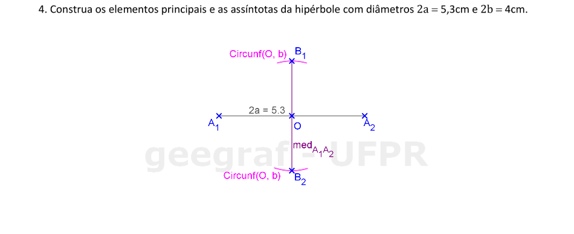
			   <figcaption>Encontre os pontos <b>B1</b> e  <b>B2</b> na mediatriz de <b>A1A2</b>.</figcaption>
		   </li>
		   <li>
			   <input type="radio" id="376" name="sl">
			   <label for="376"></label>
			   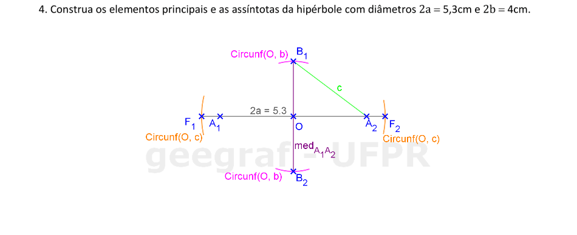
			   <figcaption>A medida <b>B1A2 = c</b>: logo, determine os focos <b>F1</b> e <b>F2</b> nos prolongamentos do diâmetro real.</figcaption>
		   </li>
		   <li>
			   <input type="radio" id="377" name="sl">
			   <label for="377"></label>
			   
			   <figcaption>Construa as retas paralelas ao diâmetro real que passam por <b>B1</b> e por <b>B2</b>.</figcaption>
		   </li>
		   <li>
			   <input type="radio" id="378" name="sl">
			   <label for="378"></label>
			   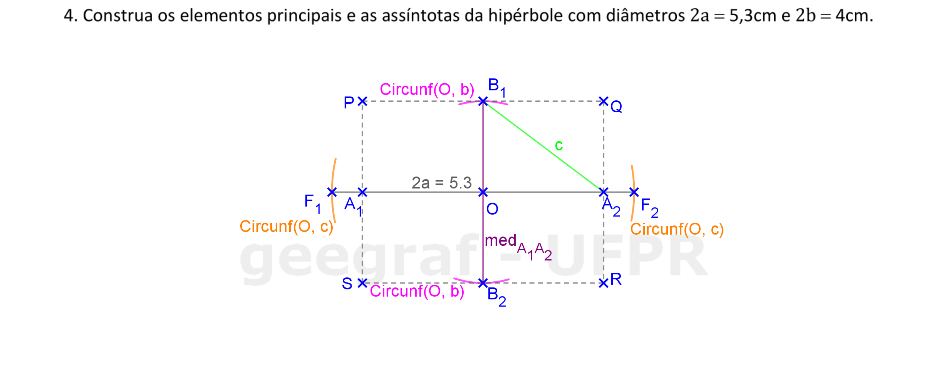
			   <figcaption>Construa as retas paralelas ao diâmetro imaginário que passam por <b>A1</b> e por <b>A2</b>: logo, temos os vértices do retângulo cujas diagonais são as retas suporte das assíntotas.</figcaption>
		   </li>
		   <li>
			   <input type="radio" id="379" name="sl">
			   <label for="379"></label>
			   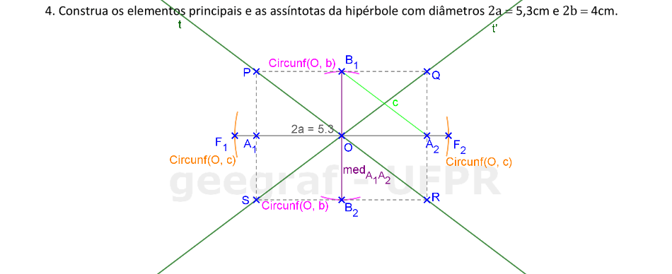
			   <figcaption>Determine as assíntotas <b>SQ</b> e <b>PR</b>.</figcaption>
		   </li>
		   <li>
			   <input type="radio" id="380" name="sl">
			   <label for="380"></label>
			   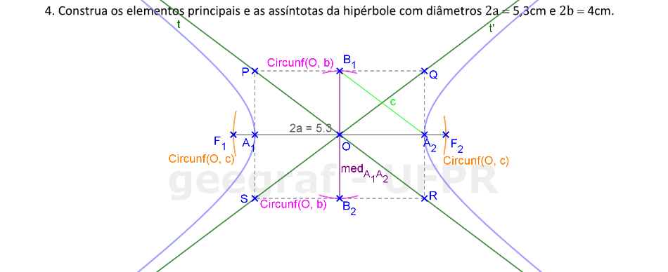
			   <figcaption>Para finalizar, basta construir a hipérbole à mão livre.</figcaption>
		   </li>
		</ul>
		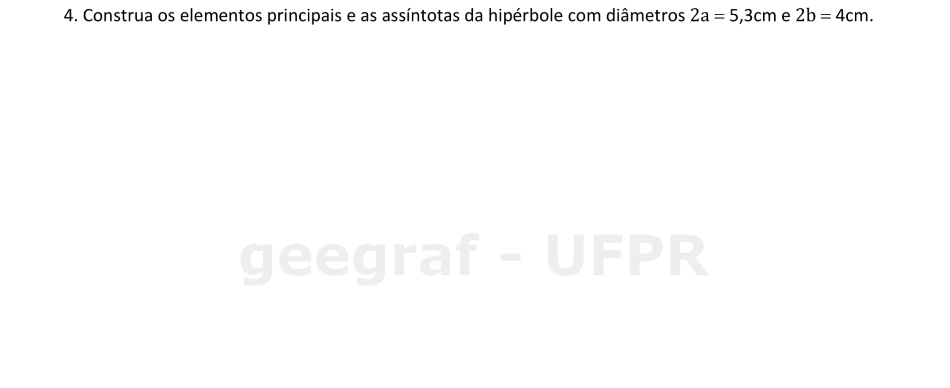
  

   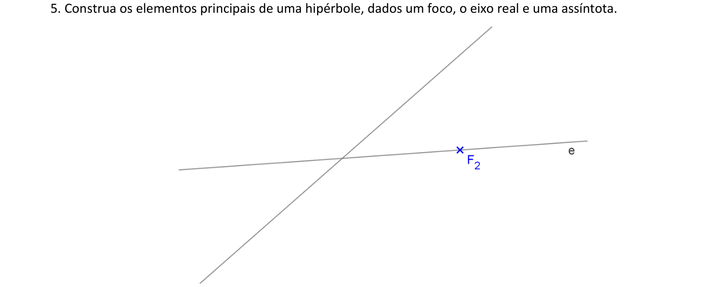
   
&#x1f4cf; &#x1f4d0; Exercício proposto 3.2

   
<a href="#modulo3" class="topo">voltar ao topo</a>

   
   

&#x1f4d1; Propriedades

	
Vamos acompanhar a demonstração do teorema de Apollonius para o caso de uma parábola. Considere a esfera inscrita na superfície cônica e tangente ao plano de seção.

	  <ul class="slider">
		   <li>
			   <input type="radio" id="381" name="sl">
			   <label for="381"></label>
			   
			   <figcaption>Vamos considerar o plano <b>LSL'</b> perpendicular ao plano de seção que determina a parábola. Neste caso teremos que a geratriz <b>SL'</b> será paralela ao plano de seção e o traço deste plano em <b>LSL'</b> é a reta <b>A2F2</b>.</figcaption>
		   </li>
		   <li>
			   <input type="radio" id="382" name="sl">
			   <label for="382"></label>
			   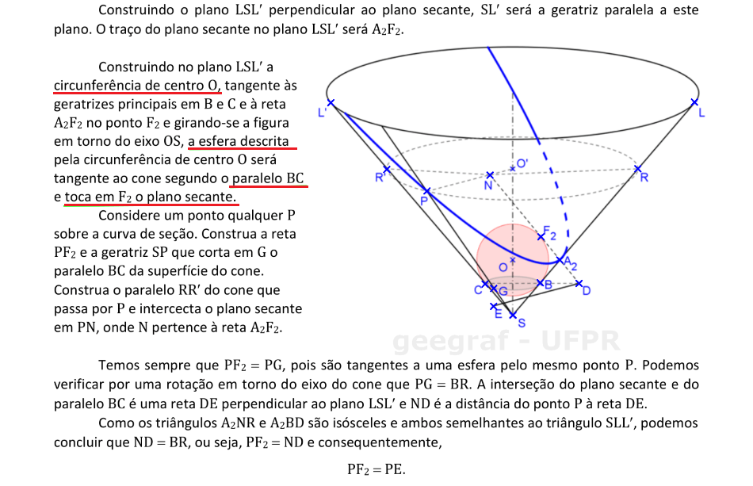
			   <figcaption>Considere a circunferência de centro <b>O</b> tangente às geratrizes <b>SL</b> e <b>SL'</b> em <b>B</b> e <b>C</b> e no segmento <b>DN</b> no ponto <b>F2</b>. Girando esta circunferência com amplitude de 180&deg; em torno de um diâmetro, temos a esfera tangente à superfície cônica.</figcaption>
		   </li>
		   <li>
			   <input type="radio" id="383" name="sl">
			   <label for="383"></label>
			   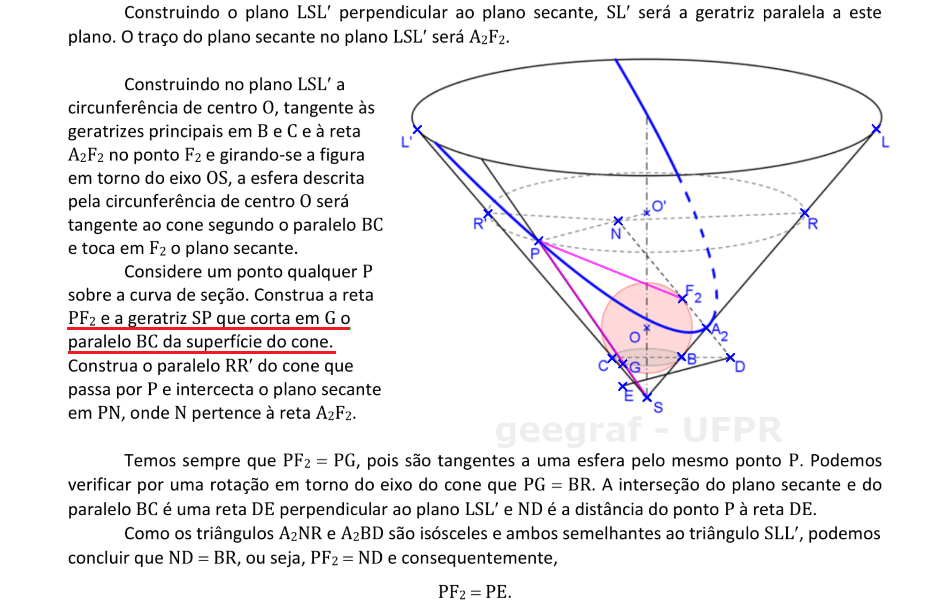
			   <figcaption>Usando a potência do ponto <b>P</b> em relação à esfera, construa os segmentos <b>PF2</b> e <b>PS</b>, obtendo-se o ponto <b>G</b> no plano perpendicular ao eixo do cone que passa pelos pontos <b>B</b> e <b>C</b>.</figcaption>
		   </li>
		   <li>
			   <input type="radio" id="384" name="sl">
			   <label for="384"></label>
			   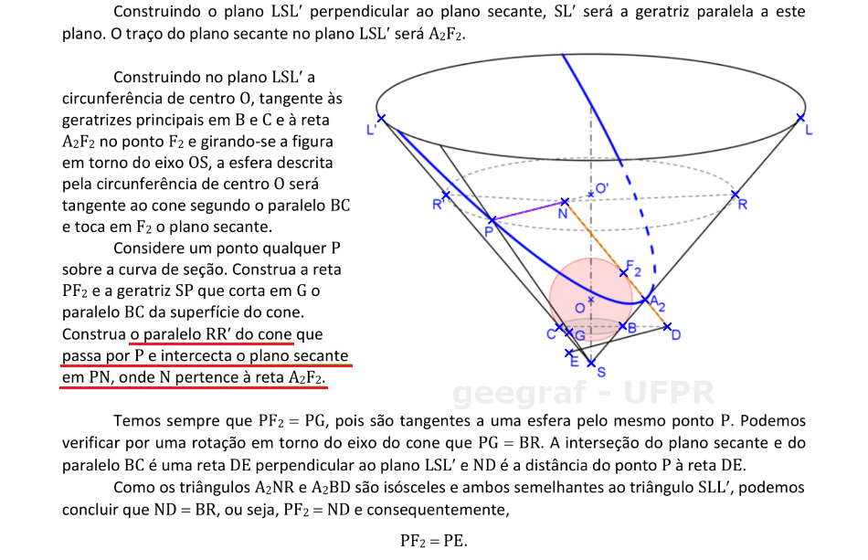
			   <figcaption>Construa o plano paralelo ao plano <b>BCG</b> que passa pelo ponto <b>P</b>, obtendo-se o ponto <b>N &isin; A2F2</b>.</figcaption>
		   </li>
		   <li>
			   <input type="radio" id="385" name="sl">
			   <label for="385"></label>
			   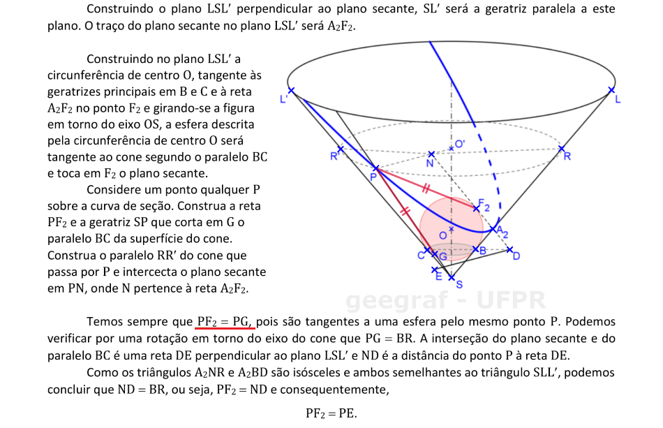
			   <figcaption>Usando a propriedade de potência de ponto, temos que <b>PF2 = PG</b>.</figcaption>
		   </li>
		   <li>
			   <input type="radio" id="386" name="sl">
			   <label for="386"></label>
			   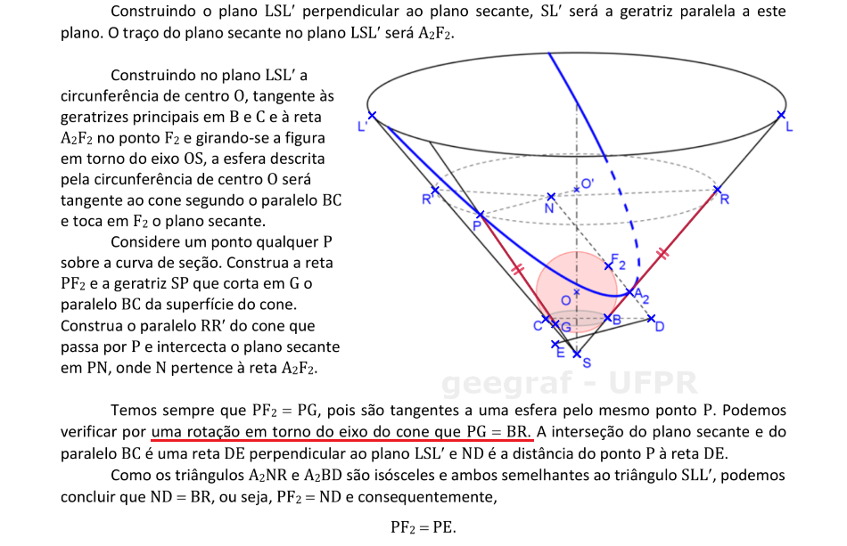
			   <figcaption>Os segmentos <b>PG</b>, <b>BR</b> e <b>CR</b> são iguais, pois são obtidos dos planos perpendiculares ao eixo do cone.</figcaption>
		   </li>
		   <li>
			   <input type="radio" id="387" name="sl">
			   <label for="387"></label>
			   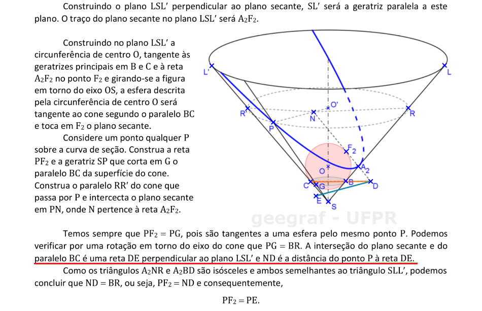
			   <figcaption>A interseção dos planos de seção e <b>BCG</b> é a reta <b>DE</b> perpendicular ao plano <b>LSL'</b>: temos que <b>ND</b> é a distância do ponto <b>P</b> à reta <b>DE</b>.</figcaption>
		   </li>
		   <li>
			   <input type="radio" id="388" name="sl">
			   <label for="388"></label>
			   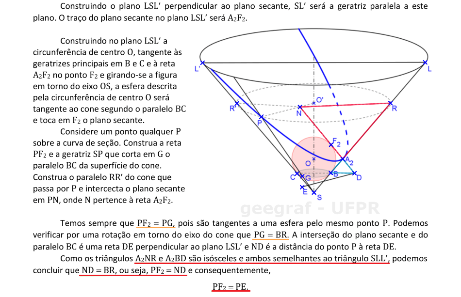
			   <figcaption>Da semelhança dos <b>&#9651;A2NR</b>, <b>&#9651;A2BD</b> e <b>&#9651;SLL'</b>, temos que <b>ND = BR = PF2</b>. Logo, temos que <b>PF2 = PE</b>.</figcaption>
		   </li>
		</ul>
		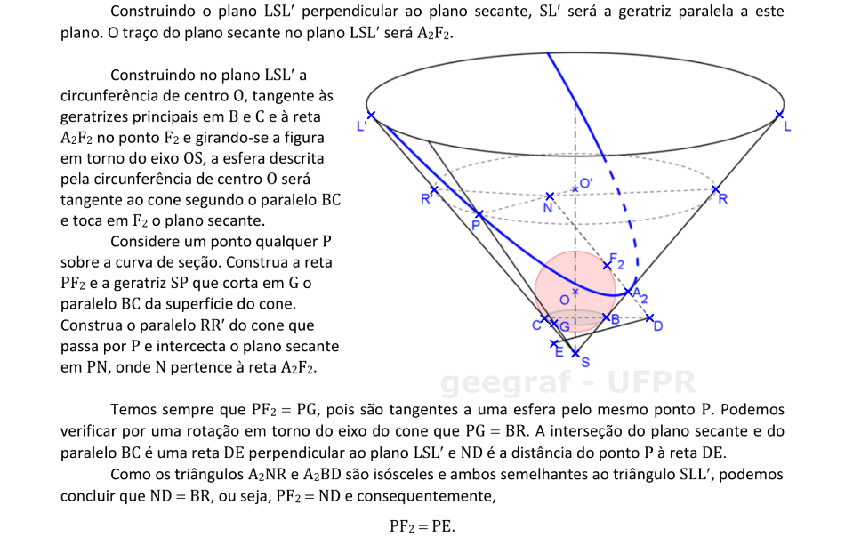
  

   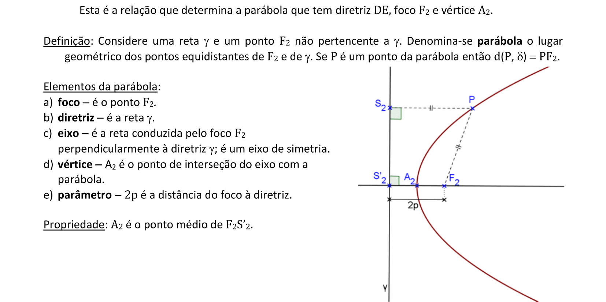
   
<a href="#modulo3" class="topo">voltar ao topo</a>

   
   

&#x1f4cf; &#x1f4d0; Resolução

	
Vamos construir os elementos principais e alguns pontos de uma parábola dada pelo vértice e pelo foco.

	  <ul class="slider">
		   <li>
			   <input type="radio" id="389" name="sl">
			   <label for="389"></label>
			   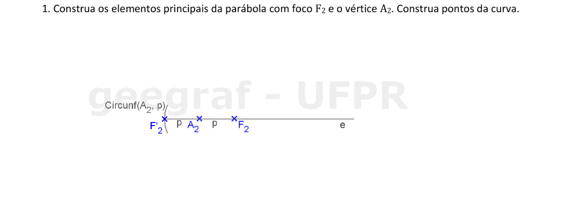
			   <figcaption>A reta definida por <b>A2F2</b> é o eixo da cônica e a distância <b>A2F2 = p</b> é a metade do parâmetro da parábola. Determine o simétrico de <b>F2</b> em relação ao vértice <b>A2</b>.</figcaption>
		   </li>
		   <li>
			   <input type="radio" id="390" name="sl">
			   <label for="390"></label>
			   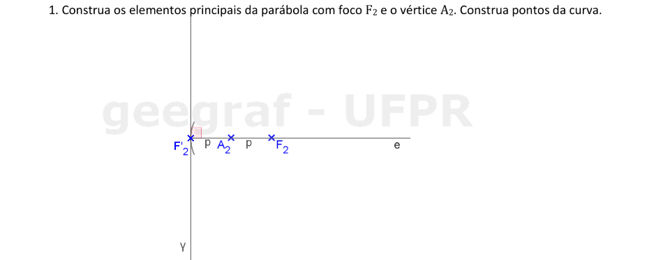
			   <figcaption>A reta <b>&gamma;</b>, perpendicular ao eixo que passa por <b>F'2</b> é a diretriz da parábola.</figcaption>
		   </li>
		   <li>
			   <input type="radio" id="391" name="sl">
			   <label for="391"></label>
			   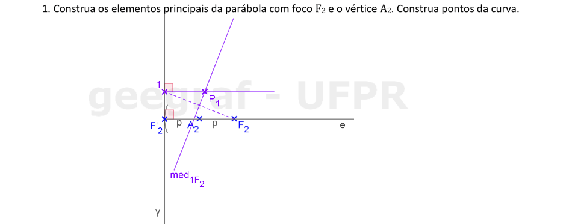
			   <figcaption>Agora vamos determinar pontos da cônica. Escolha um ponto <b>1 &isin; &gamma;</b>: a interseção da mediatriz de <b>1F2</b> com a reta paralela ao eixo que passa por <b>1</b> é um dos pontos da parábola (equidistante da diretriz e do foco).</figcaption>
		   </li>
		   <li>
			   <input type="radio" id="392" name="sl">
			   <label for="392"></label>
			   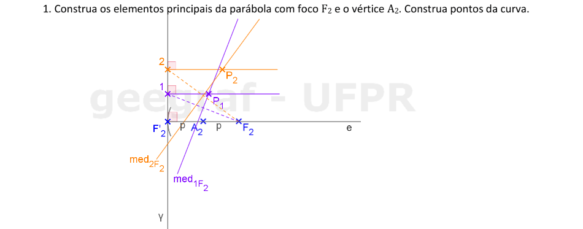
			   <figcaption>Escolha um ponto <b>2 &isin; &gamma;</b>: a interseção da mediatriz de <b>2F2</b> com a reta paralela ao eixo que passa por <b>2</b> é outro ponto da parábola (equidistante da diretriz e do foco).</figcaption>
		   </li>
		   <li>
			   <input type="radio" id="393" name="sl">
			   <label for="393"></label>
			   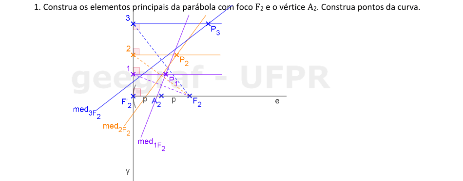
			   <figcaption>Escolha um ponto <b>3 &isin; &gamma;</b>: a interseção da mediatriz de <b>3F2</b> com a reta paralela ao eixo que passa por <b>3</b> é outro ponto da parábola (equidistante da diretriz e do foco).</figcaption>
		   </li>
		   <li>
			   <input type="radio" id="394" name="sl">
			   <label for="394"></label>
			   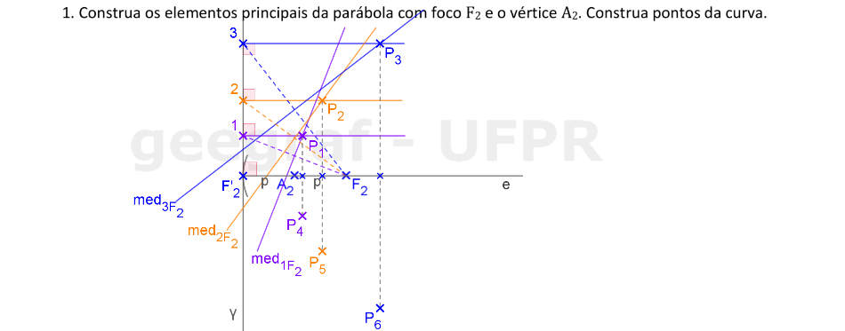
			   <figcaption>Depois, basta encontrar os simétricos de <b>P1</b>, <b>P2</b> e <b>P3</b> em relação ao eixo. Assim, temos 6 pontos da cônica além do vértice <b>A2</b>.</figcaption>
		   </li>
		   <li>
			   <input type="radio" id="395" name="sl">
			   <label for="395"></label>
			   
			   <figcaption>Para concluir, basta construir a parábola à mão livre.</figcaption>
		   </li>
		</ul>
		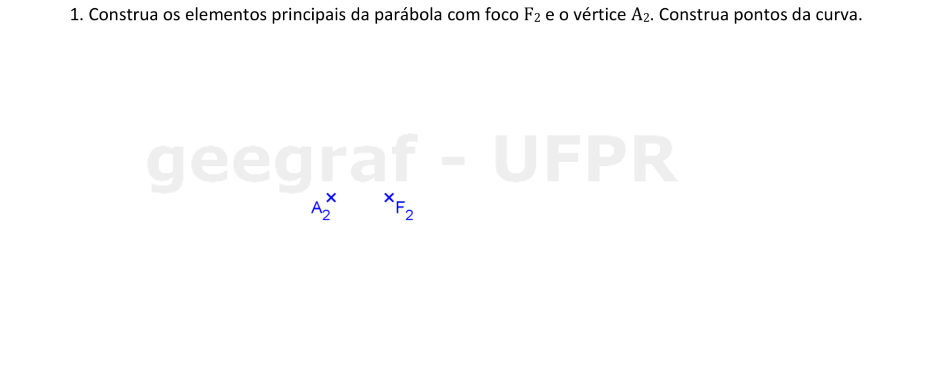
  

   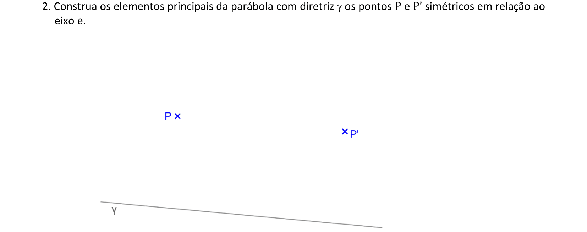
   

&#x1f4cf; &#x1f4d0; Resolução

	
Vamos construir os elementos principais de uma parábola dada pelos pontos simétricos em relação ao eixo e a reta diretriz.

	  <ul class="slider">
		   <li>
			   <input type="radio" id="396" name="sl">
			   <label for="396"></label>
			   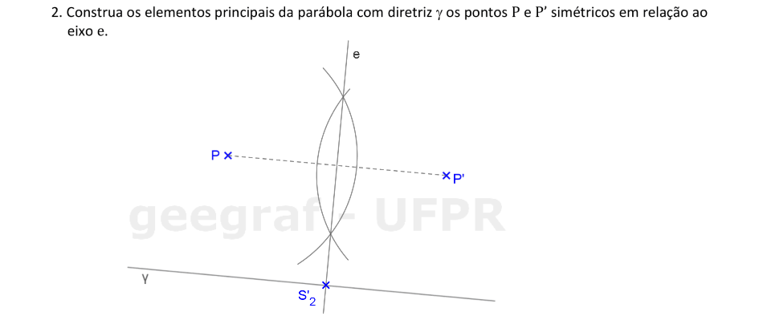
			   <figcaption>A mediatriz de <b>PP'</b> é o eixo da cônica e o ponto de interseção do eixo com a diretriz é o simétrico do foco em relação ao vértice <b>A2</b>.</figcaption>
		   </li>
		   <li>
			   <input type="radio" id="397" name="sl">
			   <label for="397"></label>
			   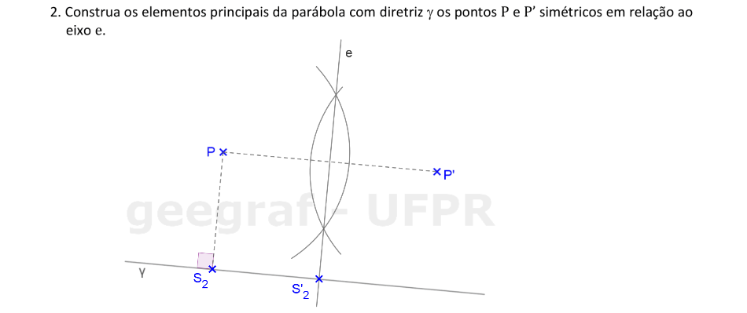
			   <figcaption>Construindo a reta perpendicular à diretriz que passa por <b>P</b>, obtemos o ponto <b>S2 &isin; &gamma;</b>.</figcaption>
		   </li>
		   <li>
			   <input type="radio" id="398" name="sl">
			   <label for="398"></label>
			   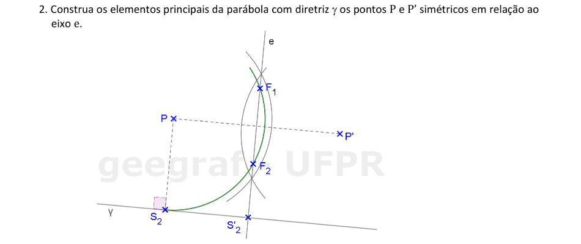
			   <figcaption>A distância de <b>P</b> à diretriz <b>PS2</b> é igual a <b>PF2</b>. Logo, podemos construir a <b>Circunf(P, PS2)</b> para determinar o foco no eixo. Escolha uma das interseções.</figcaption>
		   </li>
		   <li>
			   <input type="radio" id="399" name="sl">
			   <label for="399"></label>
			   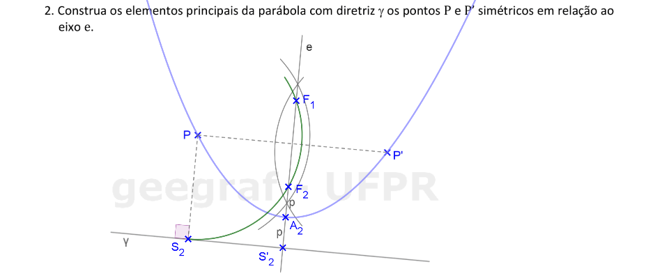
			   <figcaption>Determine o vértice <b>A2</b> por meio da mediatriz de <b>S'2F2</b>. Para concluir, basta construir a parábola à mão livre.</figcaption>
		   </li>
		</ul>
		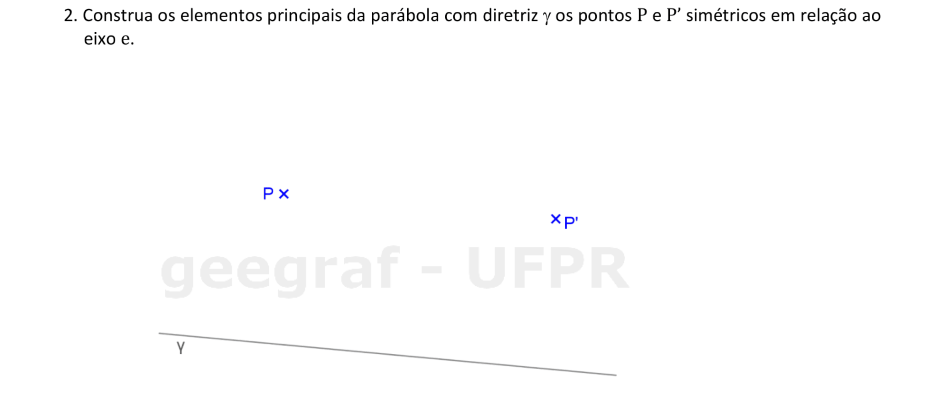
  

   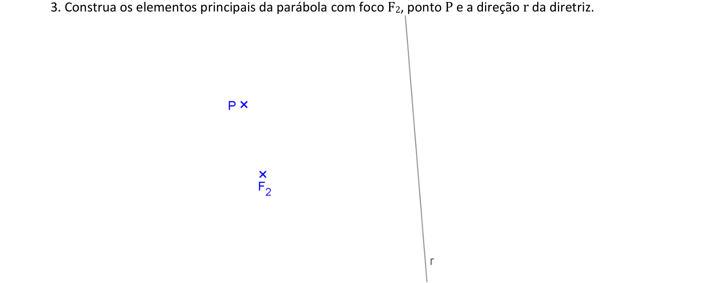
   

&#x1f4cf; &#x1f4d0; Resolução

	
Vamos construir os elementos principais de uma parábola dada pela direção da diretriz, o foco e um ponto da curva.

	  <ul class="slider">
		   <li>
			   <input type="radio" id="400" name="sl">
			   <label for="400"></label>
			   
			   <figcaption>Construindo a reta <b>PS'2 &perp; r</b> e a <b>Circunf(P, PF2)</b>, determinamos o ponto <b>S2 &isin; &gamma;</b>.</figcaption>
		   </li>
		   <li>
			   <input type="radio" id="401" name="sl">
			   <label for="401"></label>
			   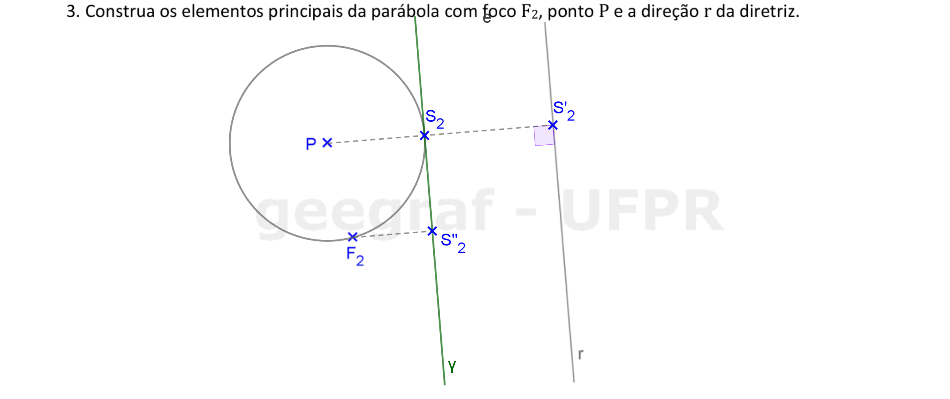
			   <figcaption>Construa a reta diretriz, paralela a <b>r</b> que passa por <b>S2</b>. A reta perpendicular à diretriz que passa pelo foco determina o eixo e o ponto simétrico do foco em relação ao vértice: <b>S''2</b></figcaption>
		   </li>
		   <li>
			   <input type="radio" id="402" name="sl">
			   <label for="402"></label>
			   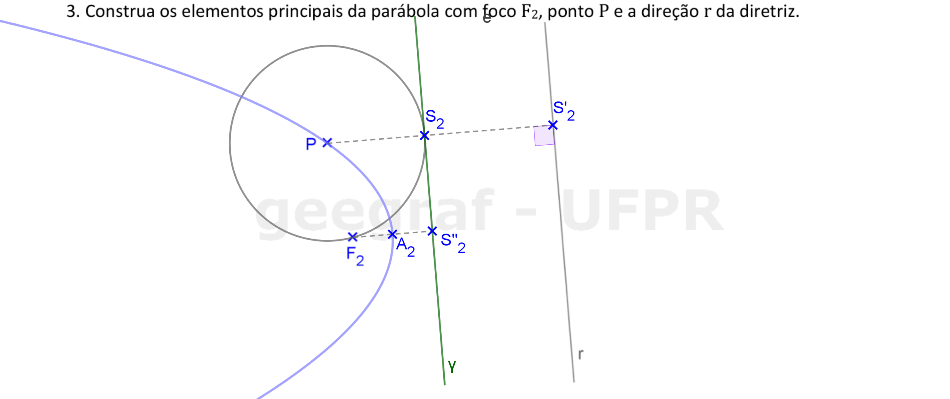
			   <figcaption>Determine o vértice <b>A2</b> por meio da mediatriz de <b>S''2F2</b>. Para concluir, basta construir a parábola à mão livre.</figcaption>
		   </li>
		</ul>
		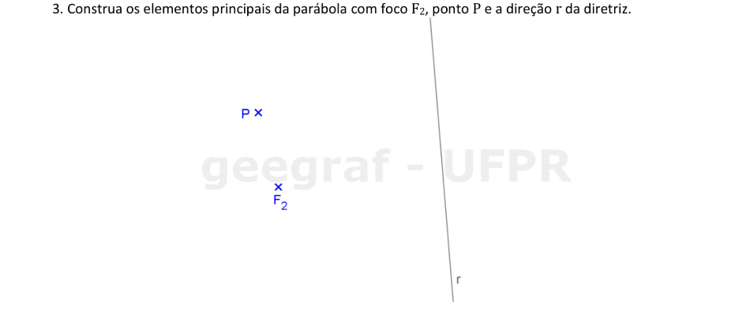
  

   
<a href="#modulo3" class="topo">voltar ao topo</a>

   
   
<a href="#modulo3" class="topo">voltar ao topo</a>

   
   

&#x1f4cf; &#x1f4d0; Resolução

	
Vamos construir as retas tangentes à parábola que passam por um ponto. São dados o foco e a diretriz da cônica.

	  <ul class="slider">
		   <li>
			   <input type="radio" id="403" name="sl">
			   <label for="403"></label>
			   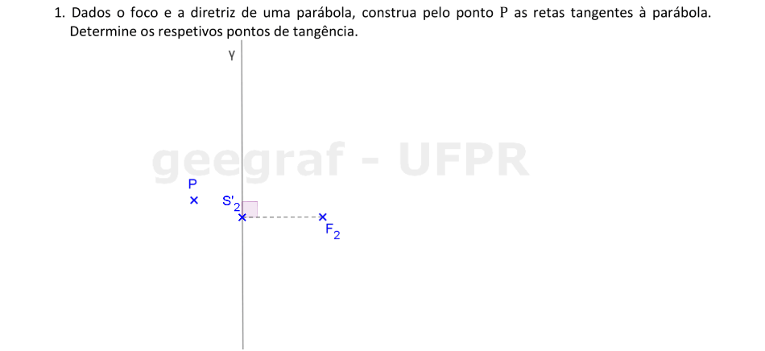
			   <figcaption>A reta <b>F2S'2 &perp; &gamma;</b> determina o eixo da parábola.</figcaption>
		   </li>
		   <li>
			   <input type="radio" id="404" name="sl">
			   <label for="404"></label>
			   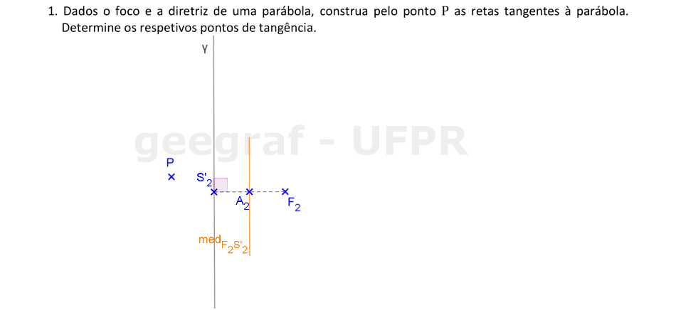
			   <figcaption>Encontre a mediatriz de <b>F2S'2</b> para achar o vértice da parábola.</figcaption>
		   </li>
		   <li>
			   <input type="radio" id="405" name="sl">
			   <label for="405"></label>
			   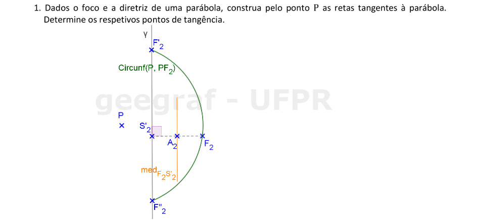
			   <figcaption>A <b>Circunf(P, PF2)</b> determina na diretriz os simétricos do foco em relação às retas tangentes à parábola que passam por <b>P</b>.</figcaption>
		   </li>
		   <li>
			   <input type="radio" id="406" name="sl">
			   <label for="406"></label>
			   
			   <figcaption>Construa as mediatrizes de <b>F2F'2</b> e de <b>F2F''2</b> que são as retas tangentes à parábola que passam por <b>P</b>.</figcaption>
		   </li>
		   <li>
			   <input type="radio" id="407" name="sl">
			   <label for="407"></label>
			   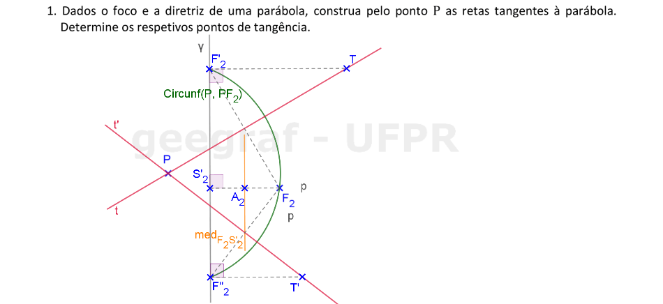
			   <figcaption>Construa as retas paralelas ao eixo que passam por <b>F'2</b> e por <b>F''2</b>. As interseções destas retas com as retas tangentes são os pontos de tangência.</figcaption>
		   </li>
		   <li>
			   <input type="radio" id="408" name="sl">
			   <label for="408"></label>
			   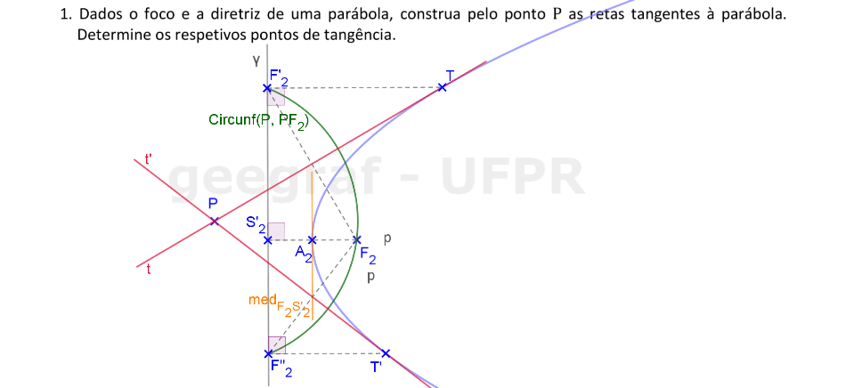
			   <figcaption>Para concluir, basta construir a parábola à mão livre.</figcaption>
		   </li>
		</ul>
		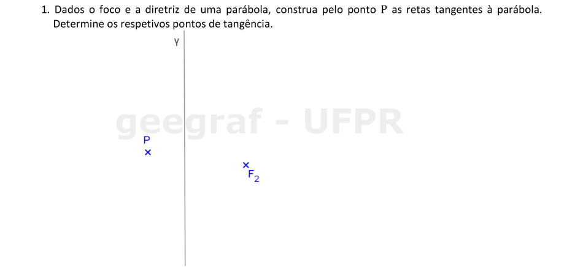
  

   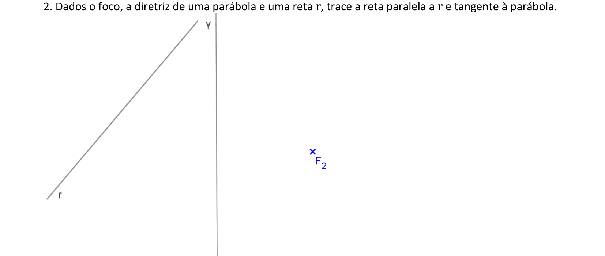
   
&#x1f4cf; &#x1f4d0; Exercício proposto 3.3

   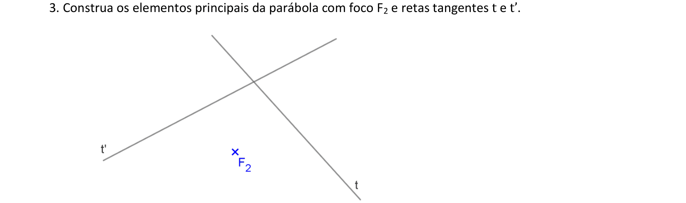
   

&#x1f4cf; &#x1f4d0; Resolução

	
Vamos construir os elementos principais de uma parábola dada por duas retas tangentes e o foco.

	  <ul class="slider">
		   <li>
			   <input type="radio" id="409" name="sl">
			   <label for="409"></label>
			   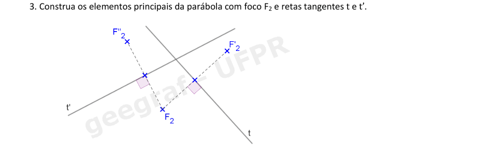
			   <figcaption>Começamos a construção determinando os simétricos do foco em relação às retas tangentes.</figcaption>
		   </li>
		   <li>
			   <input type="radio" id="410" name="sl">
			   <label for="410"></label>
			   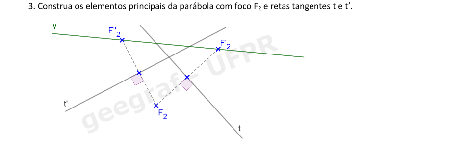
			   <figcaption>A reta que passa por <b>F'2</b> e <b>F''2</b> é a diretriz da parábola.</figcaption>
		   </li>
		   <li>
			   <input type="radio" id="411" name="sl">
			   <label for="411"></label>
			   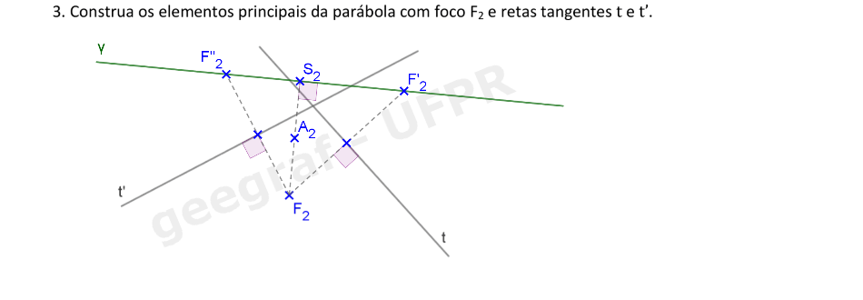
			   <figcaption>A reta <b>F2S2 &perp; &gamma;</b> é o eixo da parábola e o vértice é o ponto médio de <b>F2S2</b>.</figcaption>
		   </li>
		   <li>
			   <input type="radio" id="412" name="sl">
			   <label for="412"></label>
			   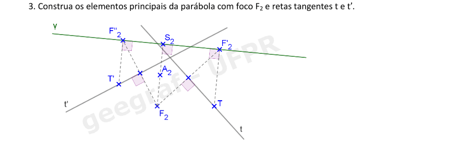
			   <figcaption>Construa as retas paralelas ao eixo que passam por <b>F'2</b> e por <b>F''2</b>. As interseções destas retas com as retas tangentes são os pontos de tangência.</figcaption>
		   </li>
		   <li>
			   <input type="radio" id="413" name="sl">
			   <label for="413"></label>
			   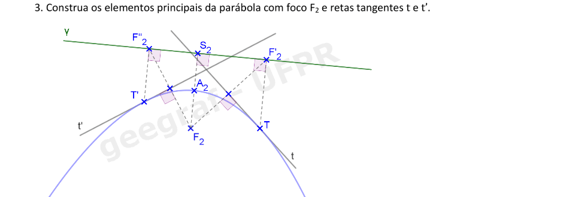
			   <figcaption>Para concluir, basta construir a parábola à mão livre.</figcaption>
		   </li>
		</ul>
		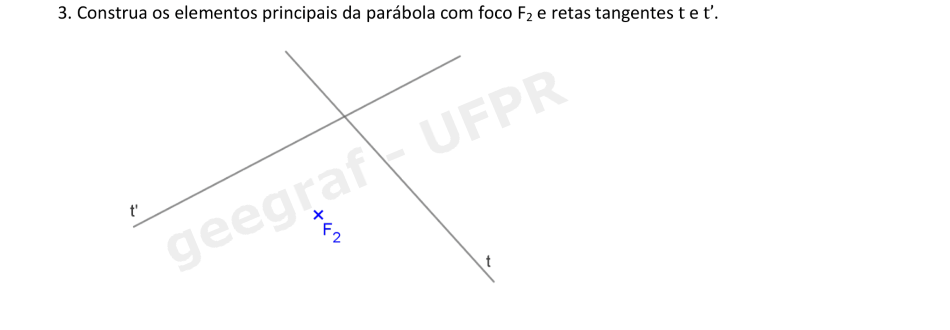
  

   
<a href="#modulo3" class="topo">voltar ao topo</a>

   
   

&#x1f4d1; Propriedades

	
Vamos acompanhar as propriedades que aparecem na definição de Apollonius para as cônicas.

	  <ul class="slider">
		   <li>
			   <input type="radio" id="414" name="sl">
			   <label for="414"></label>
			   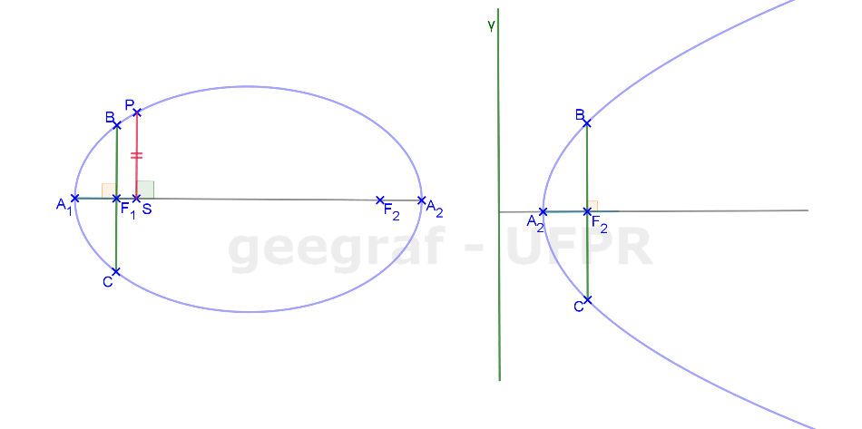
			   <figcaption>Vamos começar com o caso de uma elipse. Considere o segmento <b>BC &perp; A1A2</b>, onde <b>B</b> e <b>C</b> pertencem à elipse. Determine um ponto <b>P</b> da elipse e o segmento <b>PS &perp; A1A2</b>.</figcaption>
		   </li>
		   <li>
			   <input type="radio" id="415" name="sl">
			   <label for="415"></label>
			   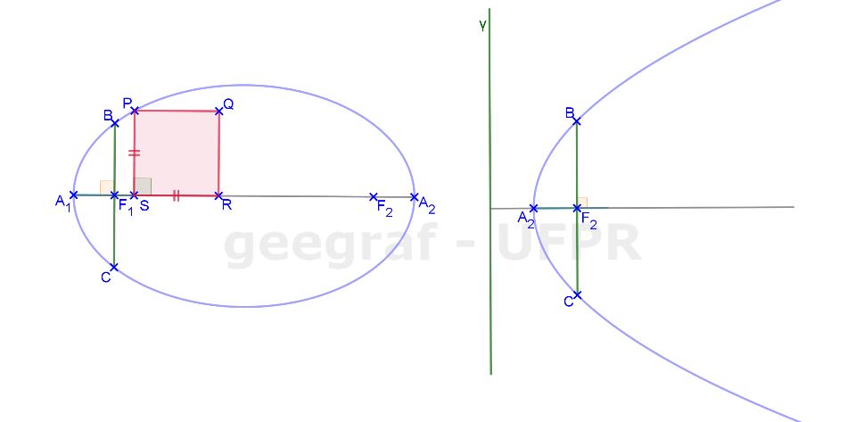
			   <figcaption>Construa o quadrado com a medida do lado igual a <b>PS</b>.</figcaption>
		   </li>
		   <li>
			   <input type="radio" id="416" name="sl">
			   <label for="416"></label>
			   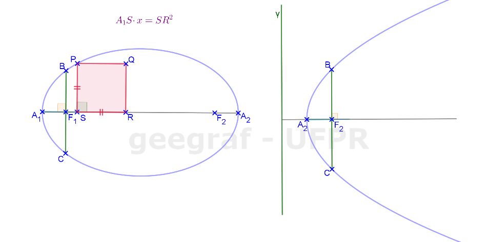
			   <figcaption>Vamos determinar o lado <b>x</b> de um retângulo equivalente ao quadrado de lado <b>PS</b>, sabendo-se que um dos lados mede <b>A1S</b>. Temos que <b>A1S&middot;x = SR&sup2;</b>.</figcaption>
		   </li>
		   <li>
			   <input type="radio" id="417" name="sl">
			   <label for="417"></label>
			   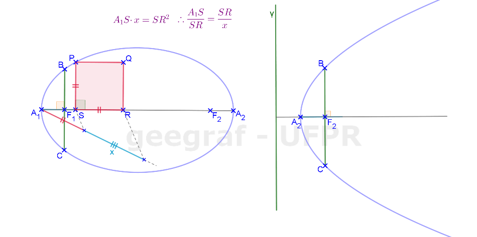
			   <figcaption>Desenvolvendo a relação das áreas, temos que $\mathsf{ {A_1S \over SR} = {SR \over x}}$. Logo, podemos usar o teorema de Tales para determinar o segmento <b>x</b> por uma terceira proporcional.</figcaption>
		   </li>
		   <li>
			   <input type="radio" id="418" name="sl">
			   <label for="418"></label>
			   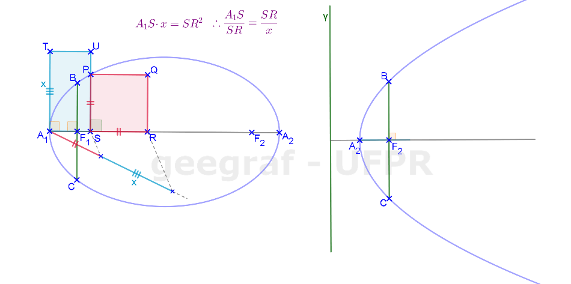
			   <figcaption>Construa o retângulo <b>A1SUT</b> equivalente ao quadrado <b>PQRS</b>.</figcaption>
		   </li>
		   <li>
			   <input type="radio" id="419" name="sl">
			   <label for="419"></label>
			   
			   <figcaption>Podemos observar que temos <b>x &lt; BC</b>, que vem da palavra grega "elleípsis", que significa falta ou insuficiência.</figcaption>
		   </li>
		   <li>
			   <input type="radio" id="420" name="sl">
			   <label for="420"></label>
			   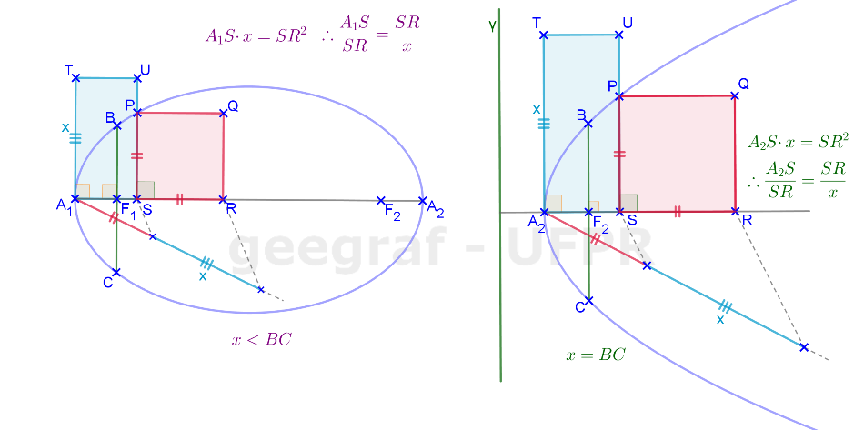
			   <figcaption>Seguindo o mesmo raciocínio no caso da parábola, ao construirmos o retângulo <b>A2SUT</b> equivalente ao quadrado <b>PQRS</b>, obtemos que <b>x = BC</b>. O nome da cônica vem da palavra grega "parabolé", que significa comparação ou igualdade.</figcaption>
		   </li>
		   <li>
			   <input type="radio" id="422" name="sl">
			   <label for="422"></label>
			   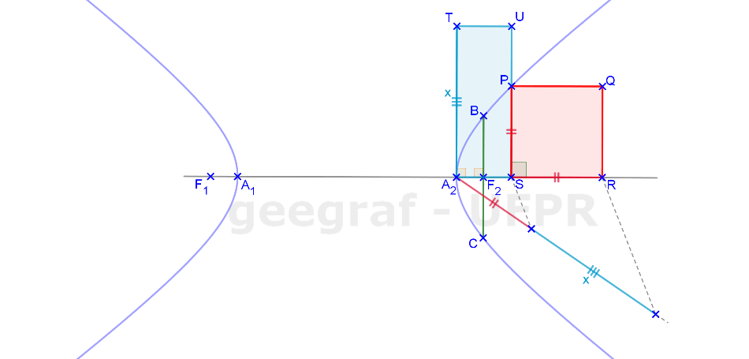
			   <figcaption>Seguindo o mesmo raciocínio no caso da hipérbole, ao construirmos o retângulo <b>A2SUT</b> equivalente ao quadrado <b>PQRS</b>, obtemos que... </figcaption>
		   </li>
		   <li>
			   <input type="radio" id="423" name="sl">
			   <label for="423"></label>
			   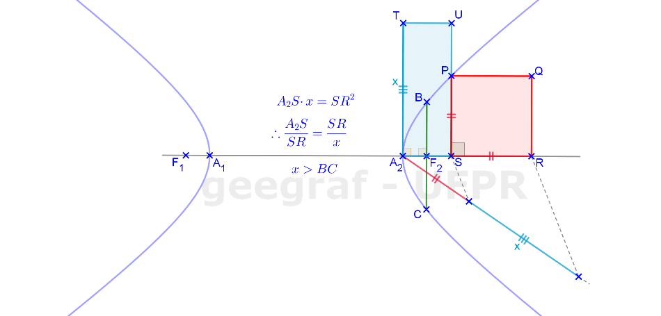
			   <figcaption>... <b>A2S&middot;x = SR&sup2;</b><b> = BC</b> e o segmento <b>x &gt; BC</b>. O nome da cônica vem da palavra grega "hyperbolé", que significa exagero ou excesso.</figcaption>
		   </li>
		</ul>
		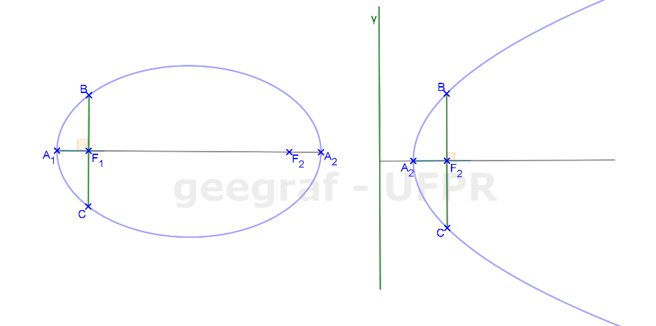
  

   
<a href="#modulo3" class="topo">voltar ao topo</a>

4. Homotetia, Rotação e curvas

  
Material da página 42 até a página 52.

   
   
<a href="#modulo4" class="topo">voltar ao topo</a>

   
   

&#x1f4cf; &#x1f4d0; Resolução

	
Vamos usar a Homotetia para multiplicar uma circunferência, usando o centro de homotetia <b>H</b> e as razões indicadas.

	  <ul class="slider">
		   <li>
			   <input type="radio" id="424" name="sl">
			   <label for="424"></label>
			   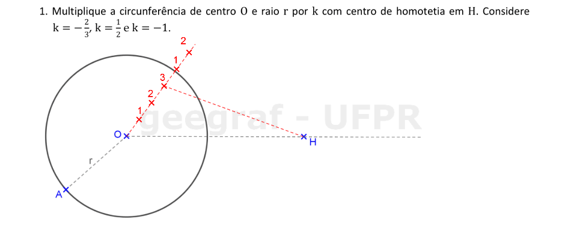
			   <figcaption>Usando o teorema de Tales, vamos encontrar o centro <b>O'</b> com a razão $\mathsf{ {O'H \over OH} = -{2 \over 3}}$.</figcaption>
		   </li>
		   <li>
			   <input type="radio" id="425" name="sl">
			   <label for="425"></label>
			   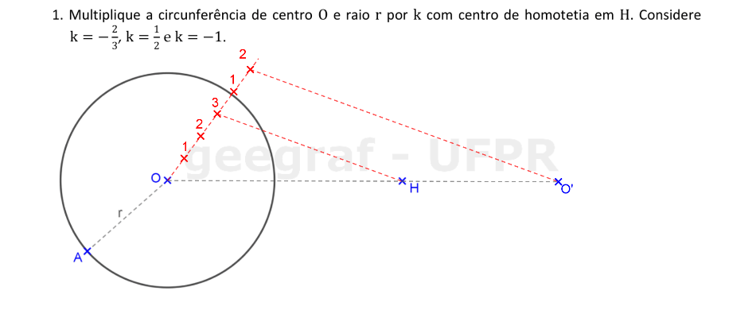
			   <figcaption>Construa o segmento <b>O'2 // H3</b> para determinar o centro <b>O'</b> da circunferência multiplicada pela razão <b>k</b>.</figcaption>
		   </li>
		   <li>
			   <input type="radio" id="426" name="sl">
			   <label for="426"></label>
			   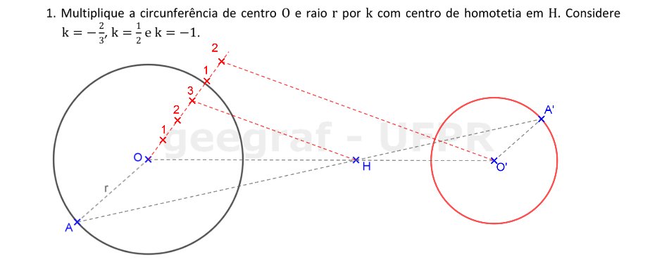
			   <figcaption>O raio <b>O'A'</b> é determinado construindo-se <b>O'A' // OA</b>. O ponto <b>A'</b> pertence à reta <b>AH</b>. </figcaption>
		   </li>
		   <li>
			   <input type="radio" id="427" name="sl">
			   <label for="427"></label>
			   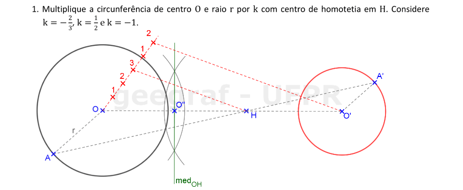
			   <figcaption>Para encontrar a circunferência multiplicada com a razão $\mathsf{ {1 \over 2}}$, podemos encontrar o ponto médio do segmento <b>OH</b>, que define o centro da circunferência multiplicada pela razão <b>k</b>.</figcaption>
		   </li>
		   <li>
			   <input type="radio" id="428" name="sl">
			   <label for="428"></label>
			   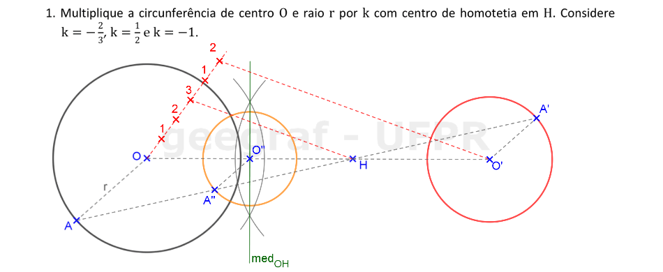
			   <figcaption>O segmento que define o raio <b>O''A''</b> é paralelo a <b>OA</b>, e <b>A'' &isin; AH</b>.</figcaption>
		   </li>
		   <li>
			   <input type="radio" id="429" name="sl">
			   <label for="429"></label>
			   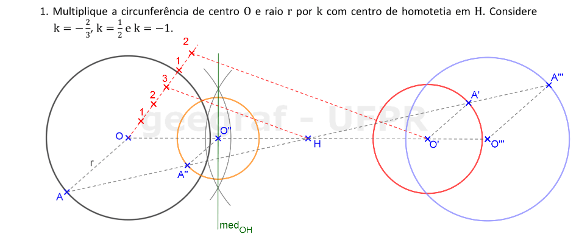
			   <figcaption>A circunferência multiplicada na razão <b>k = -1</b> é simétrica em relação ao centro de homotetia <b>H</b>.</figcaption>
		   </li>
		</ul>
		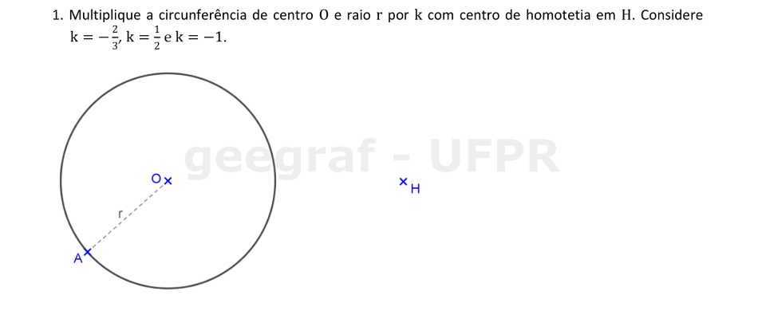
  

   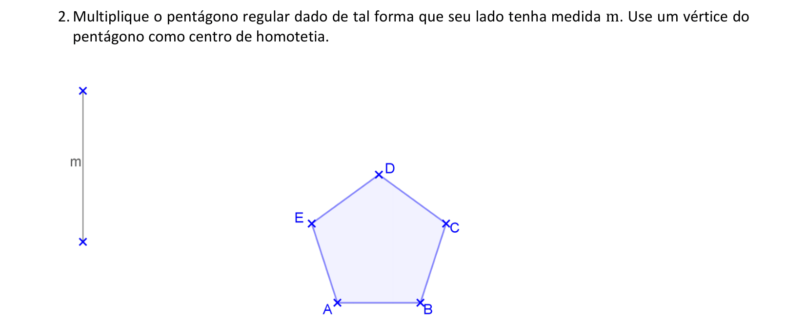
   

&#x1f4cf; &#x1f4d0; Resolução

	
Vamos usar a Homotetia para construir um pentágono regular com medida do lado <b>m</b>.

	  <ul class="slider">
		   <li>
			   <input type="radio" id="429a" name="sl">
			   <label for="429a"></label>
			   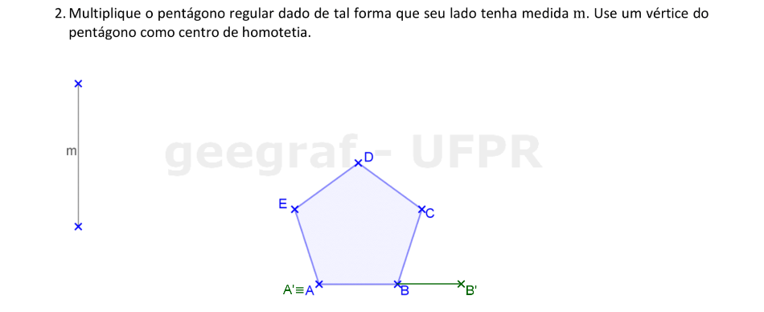
			   <figcaption>Podemos escolher qualquer vértice como centro de homotetia. Considere o ponto <b>A &equiv; A'</b> e determine <b>A'B' = m</b>.</figcaption>
		   </li>
		   <li>
			   <input type="radio" id="430" name="sl">
			   <label for="430"></label>
			   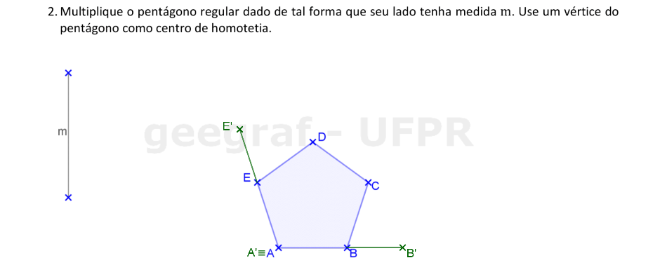
			   <figcaption>Determine o segmento <b>A'E' = m</b>.</figcaption>
		   </li>
		   <li>
			   <input type="radio" id="431" name="sl">
			   <label for="431"></label>
			   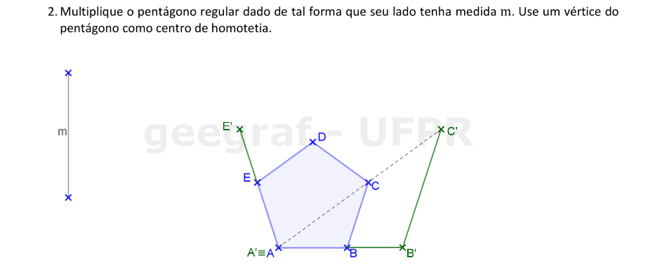
			   <figcaption>Construa o segmento <b>B'C' // BC</b>. Como os triângulos <b>&#9651;ABC</b> e <b>&#9651;A'B'C'</b> são semelhantes, o vértice <b>C' &isin; AC</b>.</figcaption>
		   </li>
		   <li>
			   <input type="radio" id="432" name="sl">
			   <label for="432"></label>
			   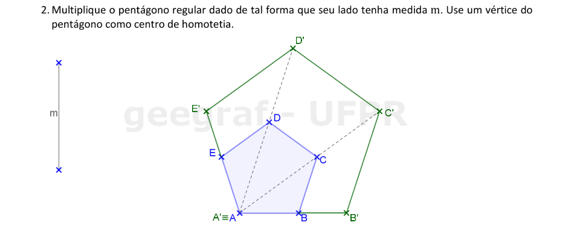
			   <figcaption>Construa o segmento <b>C'D' // CD</b>. Como os triângulos <b>&#9651;ACD</b> e <b>&#9651;A'C'D'</b> são semelhantes, o vértice <b>D' &isin; AD</b>.</figcaption>
		   </li>
		</ul>
		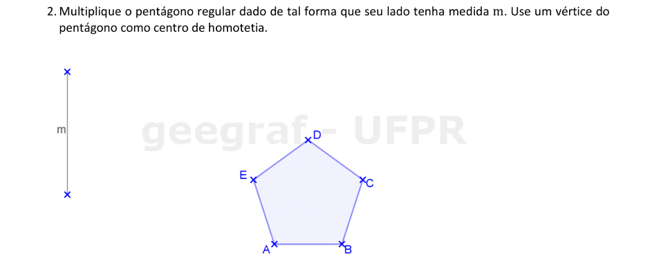
  

   
<a href="#modulo4" class="topo">voltar ao topo</a>

   
   

&#x1f4cf; &#x1f4d0; Resolução

	
Vamos usar a Homotetia para construir um quadrado com a diferença de medidas entre a diagonal e o lado igual a <b>m</b>.

	  <ul class="slider">
		   <li>
			   <input type="radio" id="433" name="sl">
			   <label for="433"></label>
			   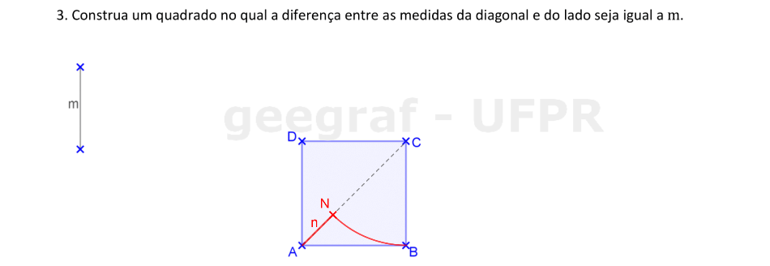
			   <figcaption>Considerando o quadrado construído, defina a diferença entre as medidas da diagonal <b>AC</b> e de um lado <b>AN = n</b>.</figcaption>
		   </li>
		   <li>
			   <input type="radio" id="434" name="sl">
			   <label for="434"></label>
			   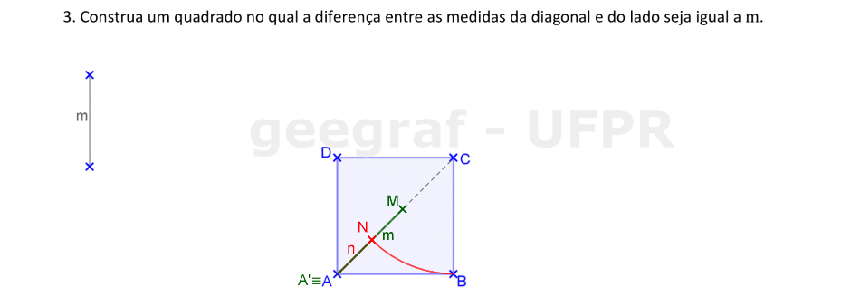
			   <figcaption>Usando o vértice <b>A</b> como centro de homotetia, encontre o ponto <b>M</b> tal que <b>AM = m</b> e <b>M &isin; AC</b>.</figcaption>
		   </li>
		   <li>
			   <input type="radio" id="435" name="sl">
			   <label for="435"></label>
			   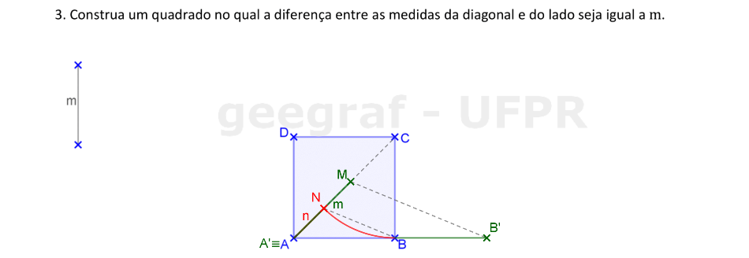
			   <figcaption>Como todos os quadrados são semelhantes entre si, podemos definir os triângulos semelhantes <b>&#9651;ABN</b> e <b>&#9651;AB'M</b>. Logo, definimos o vértice <b>B'</b> do quadrado com o segmento <b>B'M // BN</b>.</figcaption>
		   </li>
		   <li>
			   <input type="radio" id="436" name="sl">
			   <label for="436"></label>
			   
			   <figcaption>Construa o segmento <b>B'C' // BC</b>. Como os triângulos <b>&#9651;ABC</b> e <b>&#9651;AB'C'</b> são semelhantes, o vértice <b>C' &isin; AC</b>.</figcaption>
		   </li>
		   <li>
			   <input type="radio" id="437" name="sl">
			   <label for="437"></label>
			   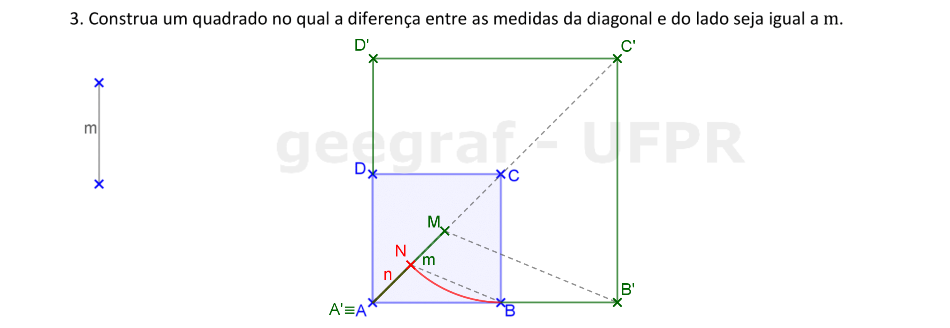
			   <figcaption>Construa o segmento <b>C'D' // CD</b>. O vértice <b>D' &isin; AD</b>.</figcaption>
		   </li>
		</ul>
		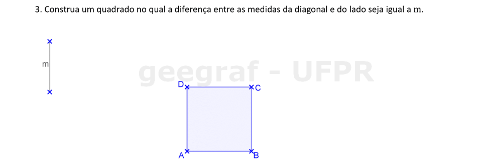
  

   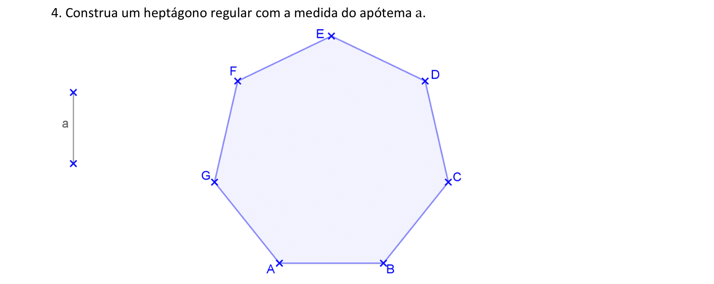
   

&#x1f4cf; &#x1f4d0; Resolução

	
Vamos usar a Homotetia para construir um heptágono regular com a medida do apótema <b>a</b>.

	  <ul class="slider">
		   <li>
			   <input type="radio" id="438" name="sl">
			   <label for="438"></label>
			   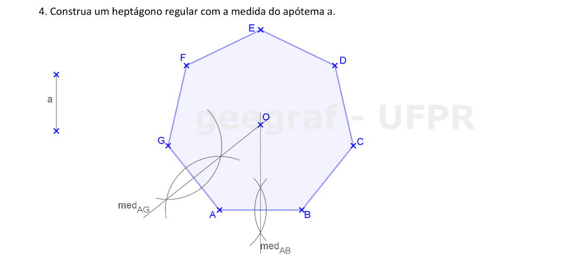
			   <figcaption>Considerando o heptágono dado, vamos construir o apótema. Para determinar o centro do heptágono, construa as mediatrizes de dois lados.</figcaption>
		   </li>
		   <li>
			   <input type="radio" id="439" name="sl">
			   <label for="439"></label>
			   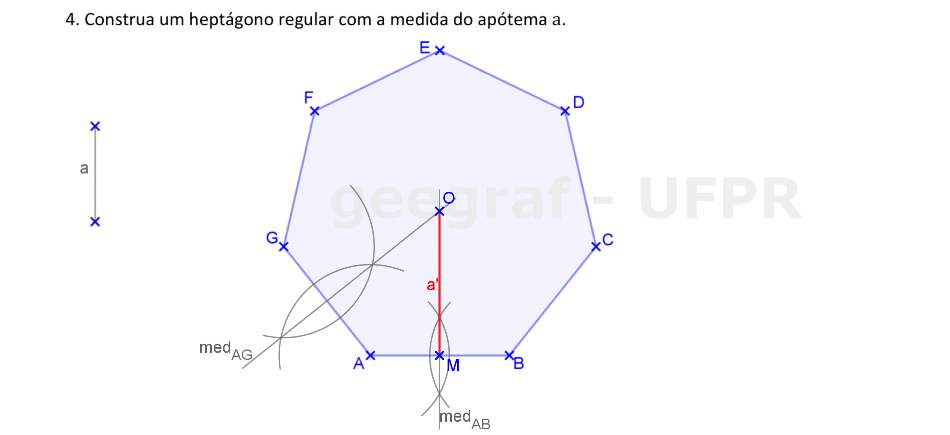
			   <figcaption>O segmento <b>OM = a'</b> é o apótema do heptágono dado.</figcaption>
		   </li>
		   <li>
			   <input type="radio" id="440" name="sl">
			   <label for="440"></label>
			   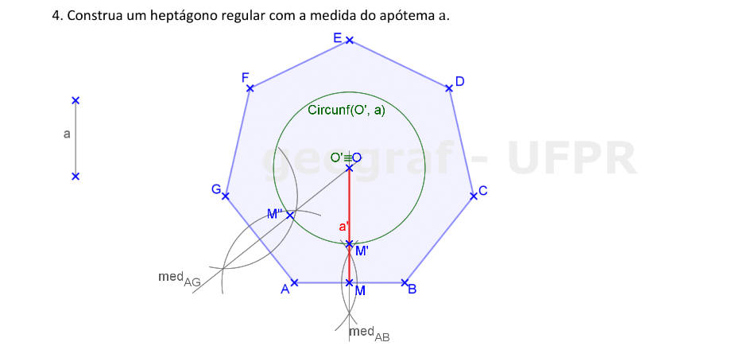
			   <figcaption>Usando o centro de homotetia <b>O' &equiv; O</b>, defina a <b>Circunf(O, a)</b> e os pontos <b>M'</b> e <b>M''</b> nas mediatrizes construídas.</figcaption>
		   </li>
		   <li>
			   <input type="radio" id="441" name="sl">
			   <label for="441"></label>
			   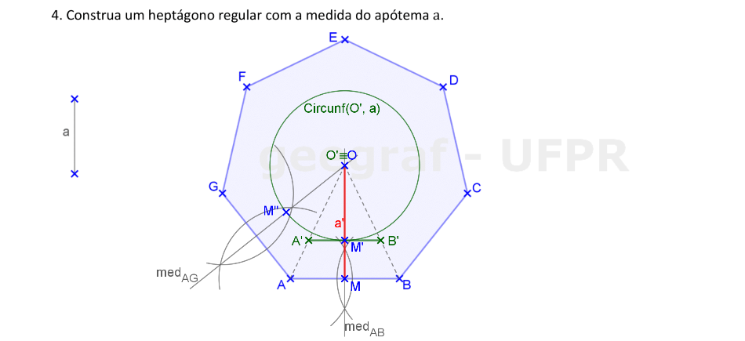
			   <figcaption>Como os triângulos <b>&#9651;ABO</b> e <b>&#9651;A'B'O</b> são semelhantes, os vértices <b>A'</b> e <b>B'</b> pertencem às retas <b>OA</b> e <b>OB</b>, e temos também que <b>A'B' // AB</b>.</figcaption>
		   </li>
		   <li>
			   <input type="radio" id="442" name="sl">
			   <label for="442"></label>
			   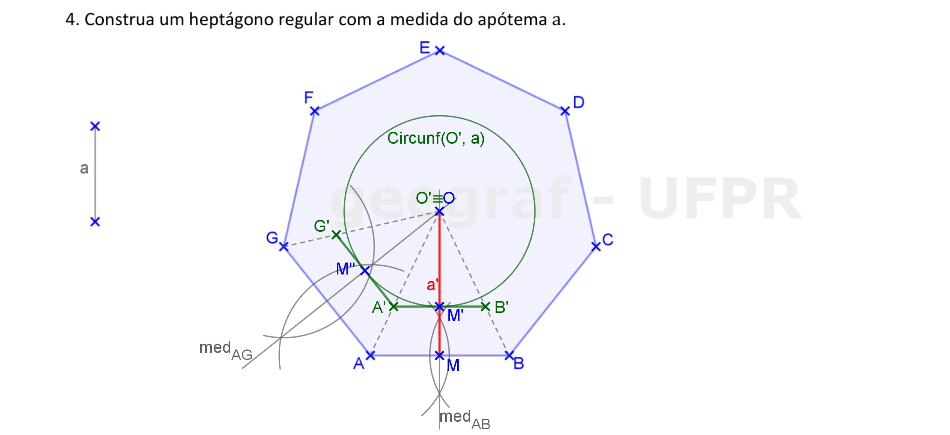
			   <figcaption>Construa o segmento <b>A'G' // AG</b>. O vértice <b>G' &isin; OG</b>.</figcaption>
		   </li>
		   <li>
			   <input type="radio" id="443" name="sl">
			   <label for="443"></label>
			   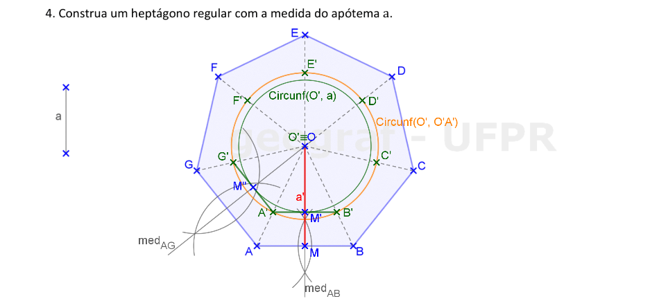
			   <figcaption>Construa a <b>Circunf(O, OA')</b>, definindo os vértices <b>F'</b>, <b>E'</b>, <b>D'</b> e <b>C'</b> nos respectivos raios <b>OF</b>, <b>OE</b>, <b>OD</b> e <b>OC</b>.</figcaption>
		   </li>
		   <li>
			   <input type="radio" id="444" name="sl">
			   <label for="444"></label>
			   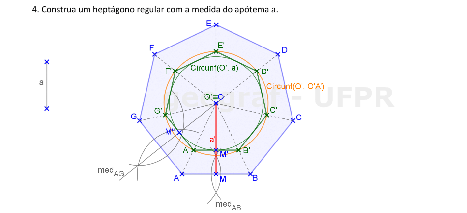
			   <figcaption>Construa os lados do heptágono.</figcaption>
		   </li>
		</ul>
		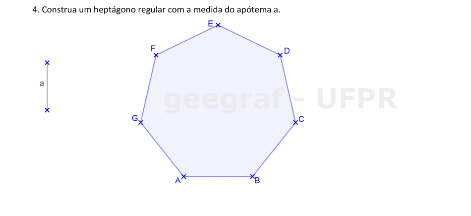
  

   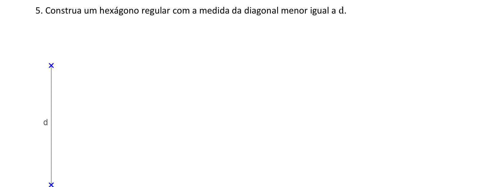
   

&#x1f4cf; &#x1f4d0; Resolução

	
Vamos usar a Homotetia para construir um hexágono regular com a medida da diagonal menor igual a <b>d</b>.

	  <ul class="slider">
		   <li>
			   <input type="radio" id="445" name="sl">
			   <label for="445"></label>
			   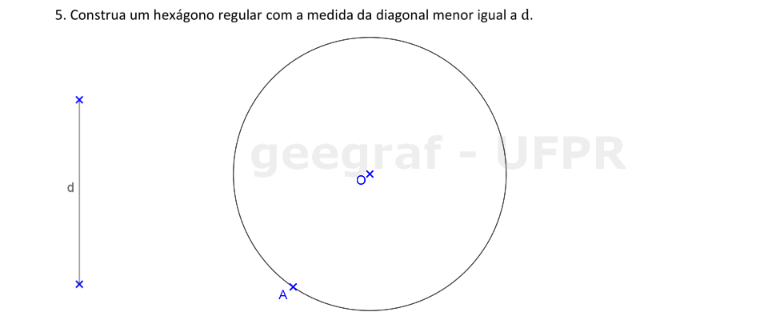
			   <figcaption>Vamos construir um hexágono regular a partir de uma circunferência de raio <b>OA</b> qualquer.</figcaption>
		   </li>
		   <li>
			   <input type="radio" id="446" name="sl">
			   <label for="446"></label>
			   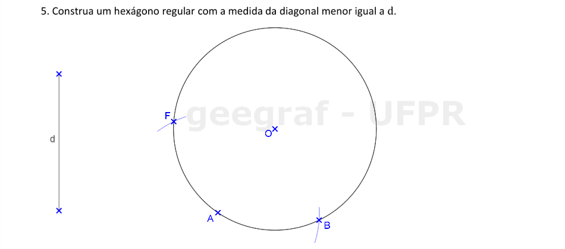
			   <figcaption>A partir do ponto <b>A</b> qualquer, defina os pontos <b>B</b> e <b>C</b> na circunferência, tais que <b>AB = AF = OA</b>.</figcaption>
		   </li>
		   <li>
			   <input type="radio" id="447" name="sl">
			   <label for="447"></label>
			   
			   <figcaption>Usando o mesmo raciocínio, defina os outros vértices do hexágono.</figcaption>
		   </li>
		   <li>
			   <input type="radio" id="448" name="sl">
			   <label for="448"></label>
			   
			   <figcaption>Construa uma diagonal menor <b>d'</b>.</figcaption>
		   </li>
		   <li>
			   <input type="radio" id="449" name="sl">
			   <label for="449"></label>
			   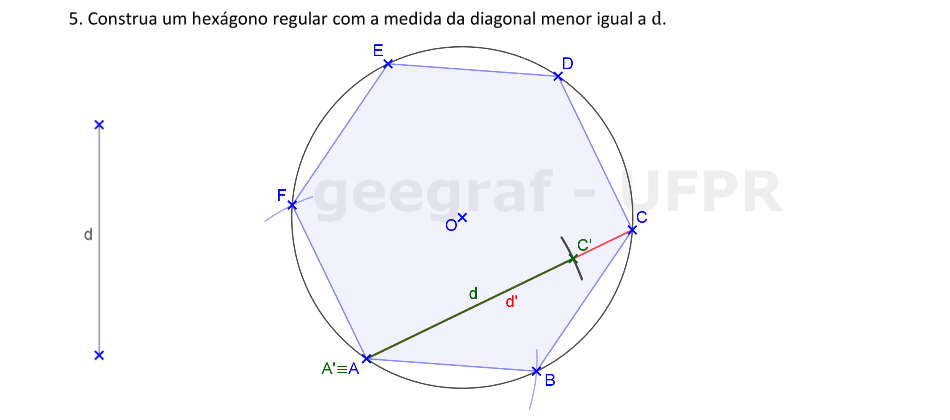
			   <figcaption>Usando um vértice como centro de homotetia, construa o segmento <b>A'C' = d</b>.</figcaption>
		   </li>
		   <li>
			   <input type="radio" id="450" name="sl">
			   <label for="450"></label>
			   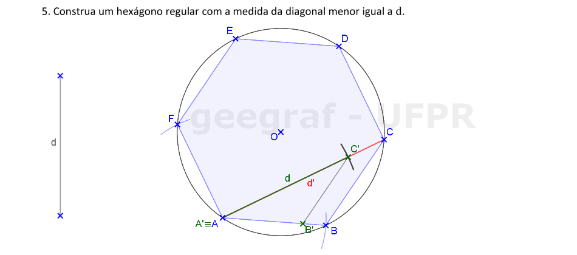
			   <figcaption>Como os triângulos <b>&#9651;AB'C'</b> e <b>&#9651;ABC</b> são semelhantes, defina o vértice <b>B' &isin; AB</b>, tal que <b>B'C' // BC</b>.</figcaption>
		   </li>
		   <li>
			   <input type="radio" id="451" name="sl">
			   <label for="451"></label>
			   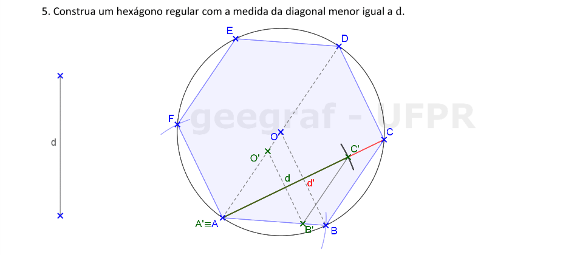
			   <figcaption>Como os triângulos <b>&#9651;O'A'B'</b> e <b>&#9651;OAB</b> são semelhantes, defina o centro <b>O' &isin; OA</b>, tal que <b>O'B' // OB</b></figcaption>
		   </li>
		   <li>
			   <input type="radio" id="452" name="sl">
			   <label for="452"></label>
			   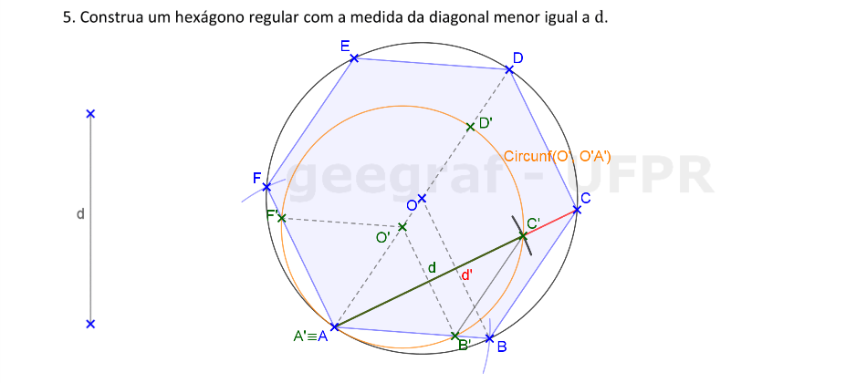
			   <figcaption>Construa a <b>Circunf(O', O'A')</b> e defina os vértices <b>F' &isin; AF</b> e <b>D' &isin; AD</b>.</figcaption>
		   </li>
		   <li>
			   <input type="radio" id="453" name="sl">
			   <label for="453"></label>
			   
			   <figcaption>Prolongando-se o segmento <b>O'B'</b>, definimos o vértice <b>E'</b>. Construa os lados do hexágono.</figcaption>
		   </li>
		</ul>
		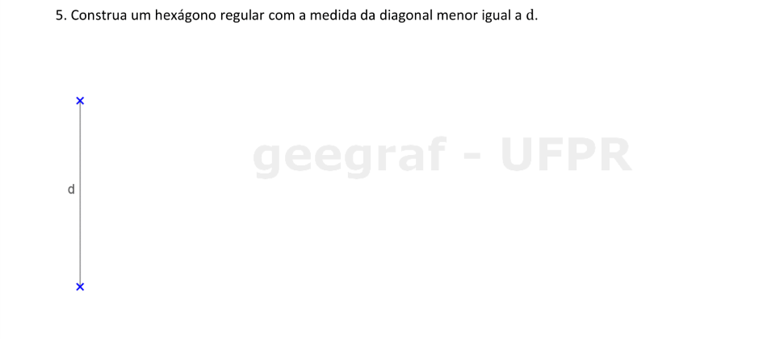
  

   
<a href="#modulo4" class="topo">voltar ao topo</a>

   
   

&#x1f4cf; &#x1f4d0; Resolução

	
Usaremos a Homotetia para construir um triângulo inscrito no triângulo <b>&#9651;ABC</b>.

	  <ul class="slider">
		   <li>
			   <input type="radio" id="454" name="sl">
			   <label for="454"></label>
			   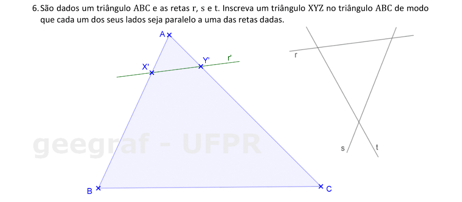
		   </li>
		   <li>
			   <input type="radio" id="455" name="sl">
			   <label for="455"></label>
			   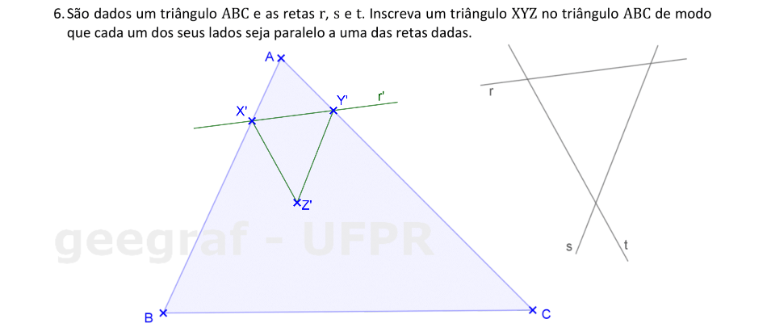
			   <figcaption>Construa o <b>&#9651;X'Y'Z'</b> tal que <b>X'Z' // t</b> e <b>Y'Z' // s</b>. Agora falta inserir o vértice <b>Z'</b> no lado <b>BC</b>.</figcaption>
		   </li>
		   <li>
			   <input type="radio" id="456" name="sl">
			   <label for="456"></label>
			   
			   <figcaption>Usando o centro de homotetia <b>H &equiv; A</b>, defina o ponto <b>Z &isin; AZ'</b> e <b>Z &isin; BC</b>.</figcaption>
		   </li>
		   <li>
			   <input type="radio" id="457" name="sl">
			   <label for="457"></label>
			   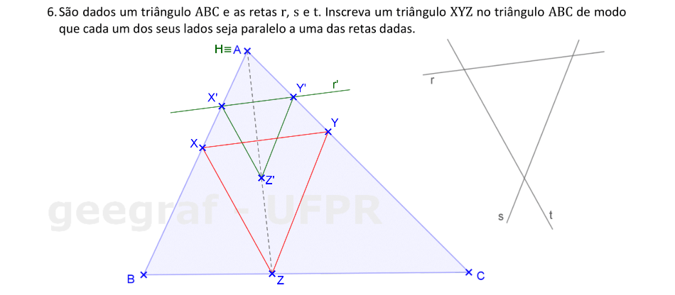
			   <figcaption>Construa o triângulo <b>&#9651;XYZ</b> tal que <b>XZ // X'Z'</b>, <b>XY // X'Y'</b> e <b>YZ // Y'Z'</b>.</figcaption>
		   </li>
		</ul>
		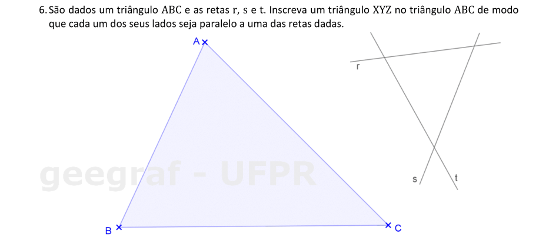
  

   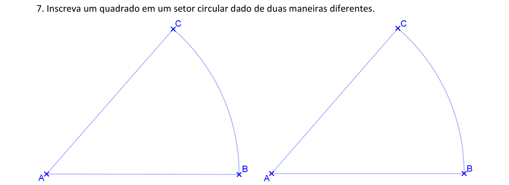
   

&#x1f4cf; &#x1f4d0; Resolução

	
Usaremos a Homotetia para construir um quadrado inscrito em um setor circular.

	  <ul class="slider">
		   <li>
			   <input type="radio" id="458" name="sl">
			   <label for="458"></label>
			   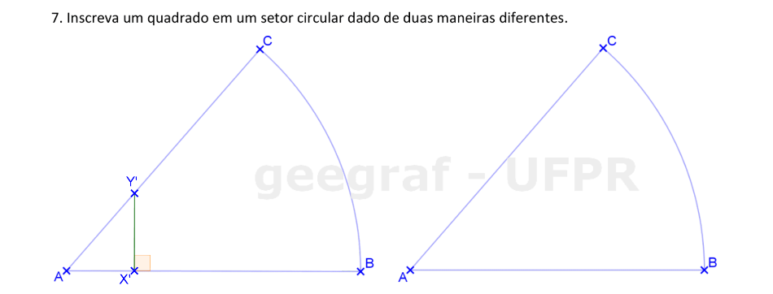
			   <figcaption>No primeiro exemplo, vamos considerar que um dos lados do quadrado pertence a um raio do setor circular. Considere o ponto <b>X' &isin; AB</b> e o vértice <b>Y' &isin; AC</b> tal que <b>X'Y' &perp; AB</b>.</figcaption>
		   </li>
		   <li>
			   <input type="radio" id="459" name="sl">
			   <label for="459"></label>
			   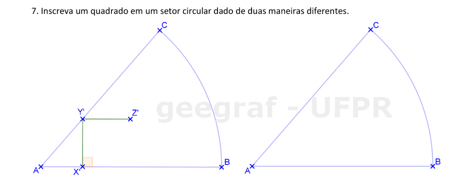
			   <figcaption>Defina o lado <b>Y'Z' // AB</b>...</figcaption>
		   </li>
		   <li>
			   <input type="radio" id="460" name="sl">
			   <label for="460"></label>
			   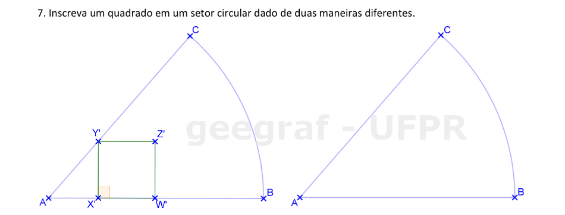
			   <figcaption>... e finalize o quadrado com <b>Z'W' &perp; AB</b>. Falta inserir o vértice <b>Z'</b> no arco do setor circular.</figcaption>
		   </li>
		   <li>
			   <input type="radio" id="461" name="sl">
			   <label for="461"></label>
			   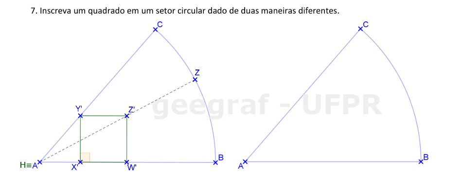
			   <figcaption>Considere o centro de homotetia <b>A &equiv; H</b> e defina o ponto <b>Z &isin; AZ'</b> no arco do setor circular.</figcaption>
		   </li>
		   <li>
			   <input type="radio" id="462" name="sl">
			   <label for="462"></label>
			   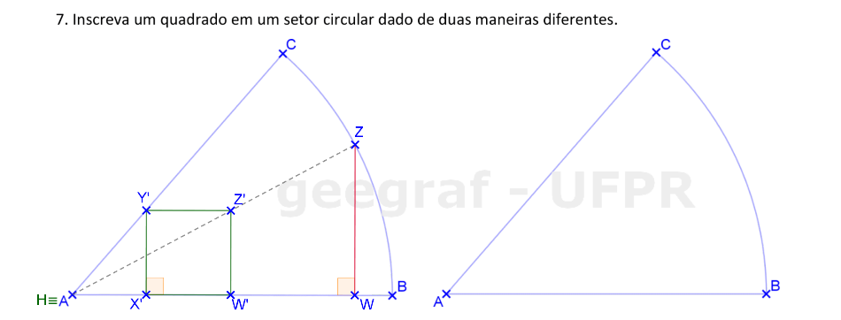
			   <figcaption>Construa o segmento <b>ZW &perp; AB</b>...</figcaption>
		   </li>
		   <li>
			   <input type="radio" id="463" name="sl">
			   <label for="463"></label>
			   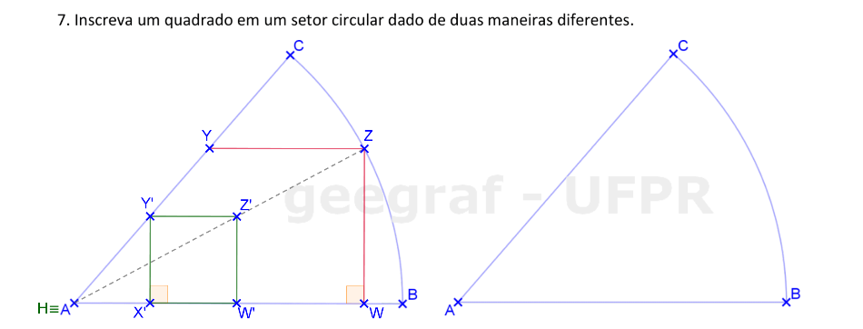
			   <figcaption>... o lado <b>YZ // AB</b>...</figcaption>
		   </li>
		   <li>
			   <input type="radio" id="464" name="sl">
			   <label for="464"></label>
			   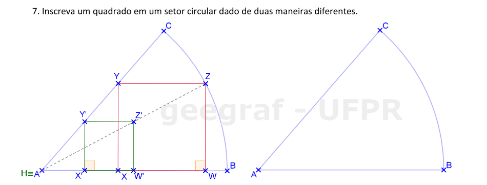
			   <figcaption>... e finalize o quadrado construindo <b>XY // X'Y'</b>.</figcaption>
		   </li>
		   <li>
			   <input type="radio" id="465" name="sl">
			   <label for="465"></label>
			   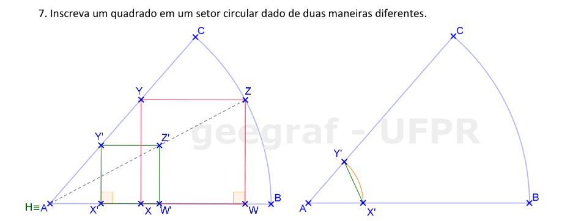
			   <figcaption>No segundo exemplo, vamos considerar que um dos lados do quadrado contém os vértices equidistantes ao vértice do setor circular. Considere os pontos <b>X' &isin; AB</b> e  <b>Y' &isin; AC</b> tais que <b>X'A = Y'A</b>.</figcaption>
		   </li>
		   <li>
			   <input type="radio" id="466" name="sl">
			   <label for="466"></label>
			   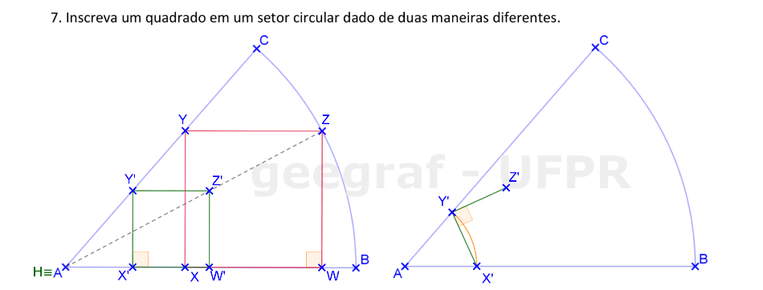
			   <figcaption>Construa o lado <b>Y'Z' &perp; X'Y'</b>...</figcaption>
		   </li>
		   <li>
			   <input type="radio" id="467" name="sl">
			   <label for="467"></label>
			   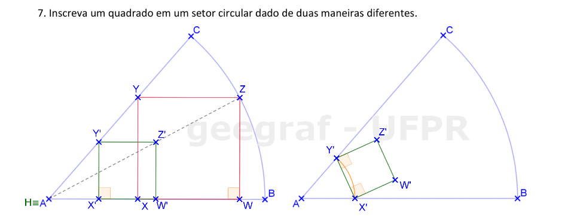
			   <figcaption>... e finalize o quadrado com <b>X'W' // Y'Z'</b> e <b>Z'W' // X'Y'</b>. Falta inserir os vértices <b>Z'</b> e <b>W'</b> no arco do setor circular.</figcaption>
		   </li>
		   <li>
			   <input type="radio" id="468" name="sl">
			   <label for="468"></label>
			   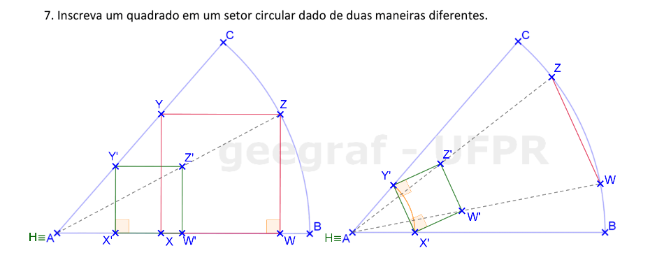
			   <figcaption>Considere o centro de homotetia <b>A &equiv; H</b> e defina os pontos <b>Z &isin; AZ'</b> e <b>W &isin; AW'</b> no arco do setor circular.</figcaption>
		   </li>
		   <li>
			   <input type="radio" id="469" name="sl">
			   <label for="469"></label>
			   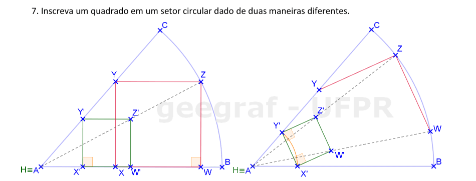
			   <figcaption>Construa o segmento <b>YZ &perp; ZW</b>...</figcaption>
		   </li>
		   <li>
			   <input type="radio" id="470" name="sl">
			   <label for="470"></label>
			   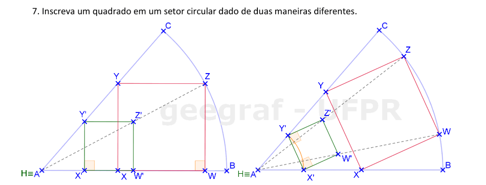
			   <figcaption>... e finalize o quadrado com <b>XY // ZW</b> e <b>XW // YZ</b>.</figcaption>
		   </li>
		</ul>
		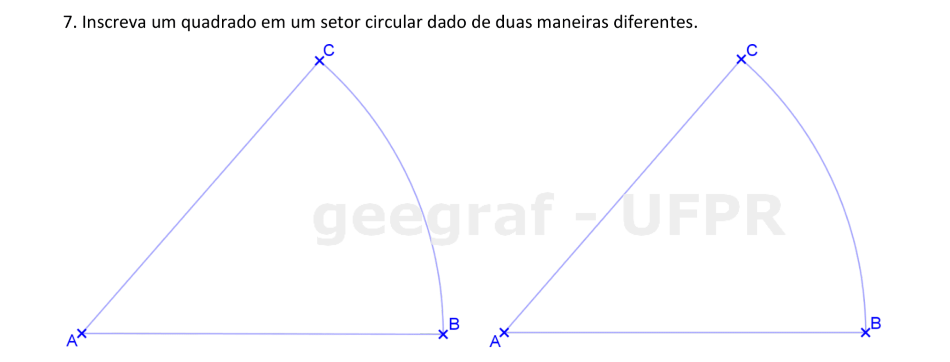
  

   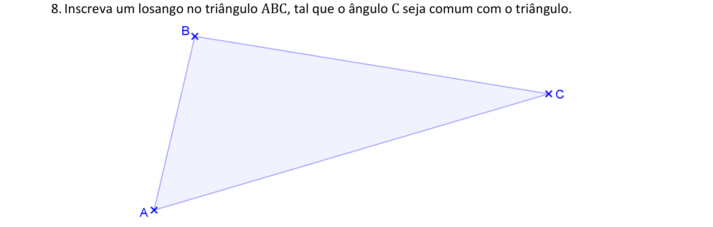
   

&#x1f4cf; &#x1f4d0; Resolução

	
Usaremos a Homotetia para construir um losango inscrito no triângulo <b>&#9651;ABC</b>.

	  <ul class="slider">
		   <li>
			   <input type="radio" id="471" name="sl">
			   <label for="471"></label>
			   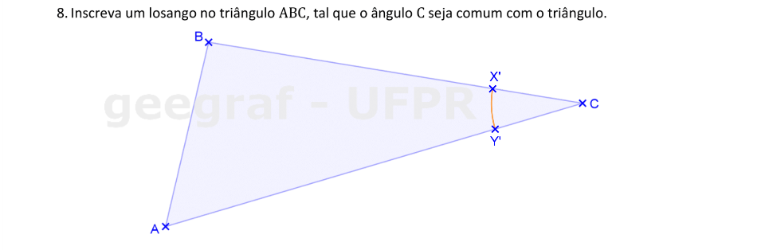
			   <figcaption>Como os lados de um losango são iguais, encontre os pontos <b>X' &isin; BC</b> e <b>Y' &isin; AC</b> tais que <b>CX' = CY'</b>.</figcaption>
		   </li>
		   <li>
			   <input type="radio" id="472" name="sl">
			   <label for="472"></label>
			   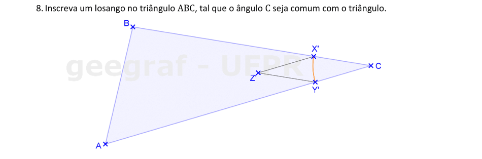
			   <figcaption>Construa os lados do losango: <b>X'Z' // Y'C</b> e <b>Y'Z' // X'C</b>. Agora falta inserir o vértice <b>Z'</b> no lado <b>AB</b>.</figcaption>
		   </li>
		   <li>
			   <input type="radio" id="473" name="sl">
			   <label for="473"></label>
			   
			   <figcaption>Usando o centro de homotetia <b>H &equiv; C</b>, defina o ponto <b>Z &isin; CZ'</b> e <b>Z &isin; AB</b>.</figcaption>
		   </li>
		   <li>
			   <input type="radio" id="474" name="sl">
			   <label for="474"></label>
			   
			   <figcaption>Construa o losango tal que <b>XZ // X'Z'</b> e <b>ZY // Z'Y'</b>.</figcaption>
		   </li>
		</ul>
		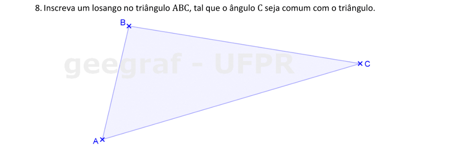
  

   
<a href="#modulo4" class="topo">voltar ao topo</a>

   
   
&#x1f4cf; &#x1f4d0; Exercício proposto 4.1

   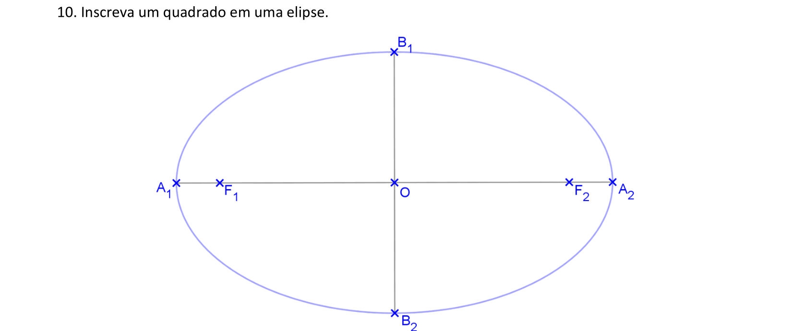
   

&#x1f4cf; &#x1f4d0; Resolução

	
Usaremos a Homotetia para construir um quadrado inscrito em uma elipse.

	  <ul class="slider">
		   <li>
			   <input type="radio" id="475" name="sl">
			   <label for="475"></label>
			   
			   <figcaption>Encontre os pontos <b>X'</b> e <b>Y'</b> nos diâmetros principais da elipse, tais que <b>OX' = OY'</b>.</figcaption>
		   </li>
		   <li>
			   <input type="radio" id="476" name="sl">
			   <label for="476"></label>
			   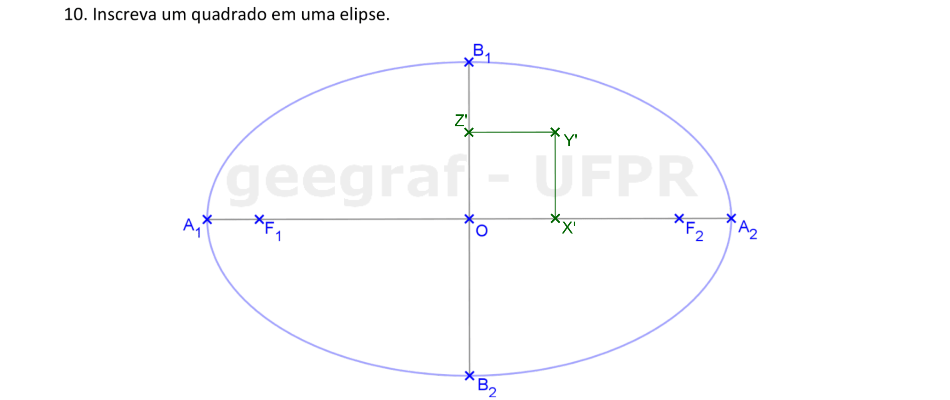
			   <figcaption>Construa os lados do quadrado: <b>X'Y' // OZ'</b> e <b>Y'Z' // OX'</b>. Agora falta inserir o vértice <b>Y'</b> na elipse.</figcaption>
		   </li>
		   <li>
			   <input type="radio" id="477" name="sl">
			   <label for="477"></label>
			   
			   <figcaption>Usando o centro de homotetia <b>H &equiv; O</b>, defina o ponto <b>A &isin; OY'</b> na elipse. Temos o primeiro vértice do quadrado inscrito.</figcaption>
		   </li>
		   <li>
			   <input type="radio" id="478" name="sl">
			   <label for="478"></label>
			   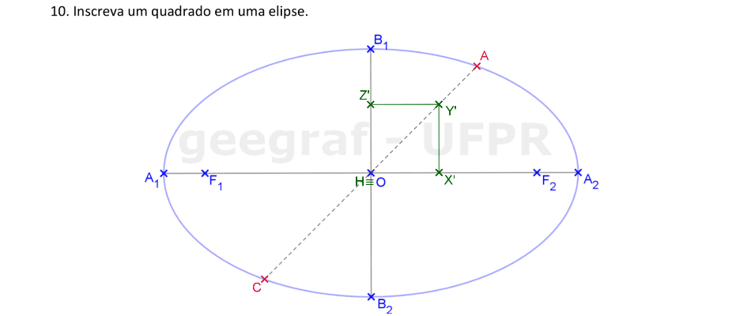
			   <figcaption>Prolongando-se <b>OA</b>, temos o vértice <b>C</b> simétrico de <b>A</b> em relação ao centro da elipse.</figcaption>
		   </li>
		   <li>
			   <input type="radio" id="479" name="sl">
			   <label for="479"></label>
			   
			   <figcaption>Construa o quadrado: <b>AD // Y'Z'</b>, <b>CD // OZ'</b>...</figcaption>
		   </li>
		   <li>
			   <input type="radio" id="480" name="sl">
			   <label for="480"></label>
			   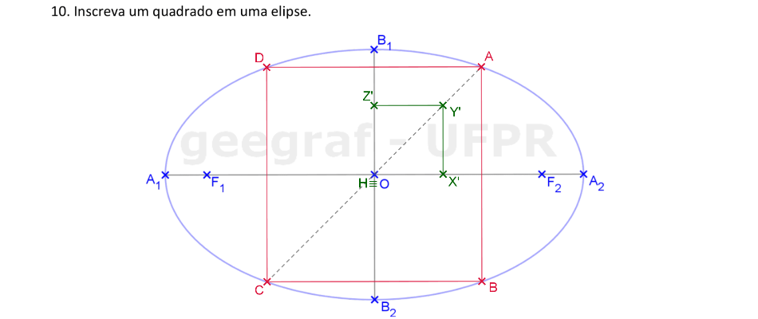
			   <figcaption>... e <b>AB // CD</b>.</figcaption>
		   </li>
		</ul>
		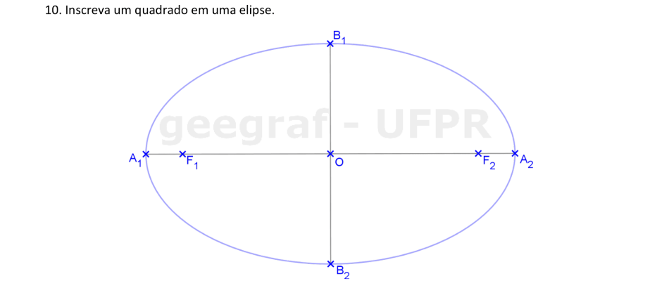
  

   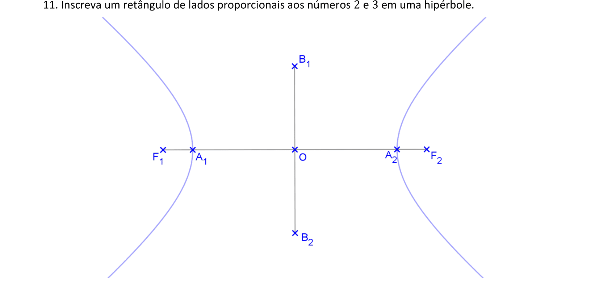
   

&#x1f4cf; &#x1f4d0; Resolução

	
Usaremos a Homotetia para construir um retângulo inscrito em uma hipérbole.

	  <ul class="slider">
		   <li>
			   <input type="radio" id="481" name="sl">
			   <label for="481"></label>
			   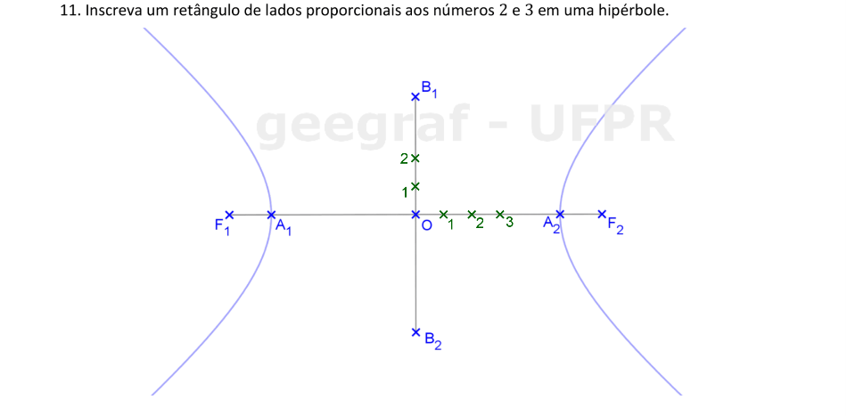
			   <figcaption>Encontre os pontos <b>3</b> e <b>2</b> nos diâmetros principais da hipérbole, tais que $\mathsf{ {O2 \over O3} = {2 \over 3}}$.</figcaption>
		   </li>
		   <li>
			   <input type="radio" id="482" name="sl">
			   <label for="482"></label>
			   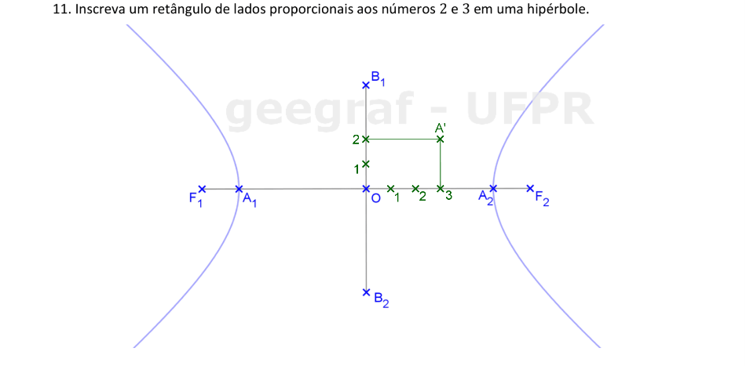
			   <figcaption>Construa os lados do retângulo: <b>A'2 // O3</b> e <b>A'3 // O2</b>. Agora falta inserir o vértice <b>A'</b> na hipérbole.</figcaption>
		   </li>
		   <li>
			   <input type="radio" id="483" name="sl">
			   <label for="483"></label>
			   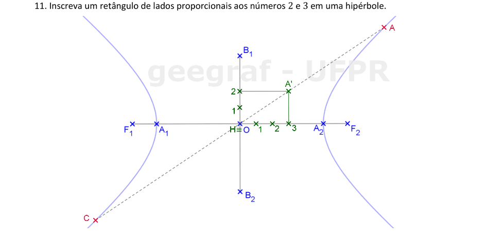
			   <figcaption>Usando o centro de homotetia <b>H &equiv; O</b>, defina o ponto <b>A &isin; OA'</b> na hipérbole. Temos o primeiro vértice do retângulo inscrito. Prolongando-se <b>OA</b>, temos o vértice <b>C</b> simétrico de <b>A</b> em relação ao centro da hipérbole.</figcaption>
		   </li>
		   <li>
			   <input type="radio" id="484" name="sl">
			   <label for="484"></label>
			   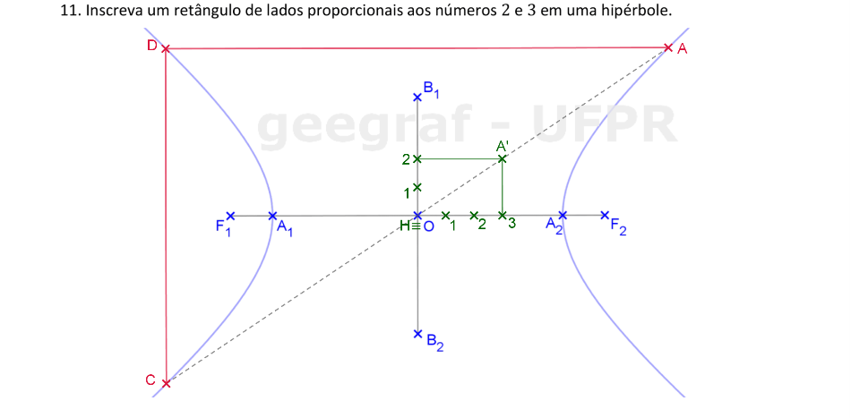
			   <figcaption>Construa o retângulo: <b>AD // A'2</b>, <b>CD // A'3</b>...</figcaption>
		   </li>
		   <li>
			   <input type="radio" id="485" name="sl">
			   <label for="485"></label>
			   
			   <figcaption>... e <b>AB // A'3</b>.</figcaption>
		   </li>
		</ul>
		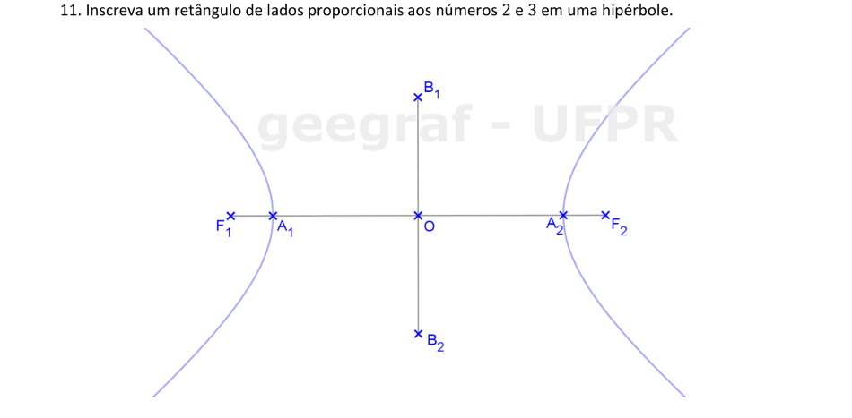
  

   
<a href="#modulo4" class="topo">voltar ao topo</a>

   
   

&#x1f4cf; &#x1f4d0; Resolução

	
Usaremos a Homotetia para construir um triângulo equilátero inscrito em uma parábola.

	  <ul class="slider">
		   <li>
			   <input type="radio" id="486" name="sl">
			   <label for="486"></label>
			   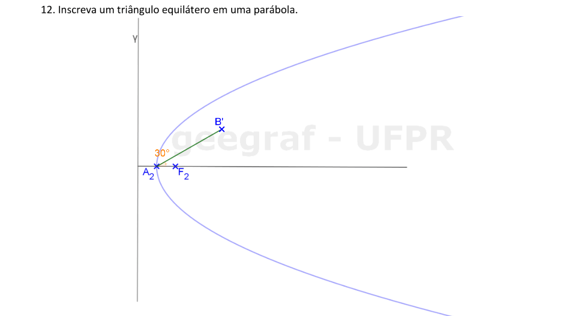
			   <figcaption>Encontre o vértice <b>B'</b> tal que <b>A2B'</b> forme ângulo de 30&deg; com o eixo da parábola.</figcaption>
		   </li>
		   <li>
			   <input type="radio" id="487" name="sl">
			   <label for="487"></label>
			   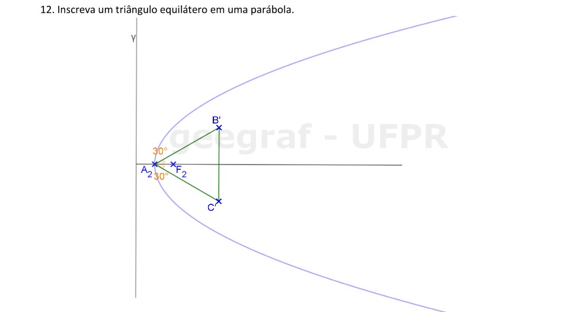
			   <figcaption>Construa os lados do triângulo equilátero: <b>A2C'</b> forma 30&deg; com o eixo e <b>A2C' = A2B'</b>. Agora falta inserir os vértices <b>B'</b> e <b>C'</b> na parábola.</figcaption>
		   </li>
		   <li>
			   <input type="radio" id="488" name="sl">
			   <label for="488"></label>
			   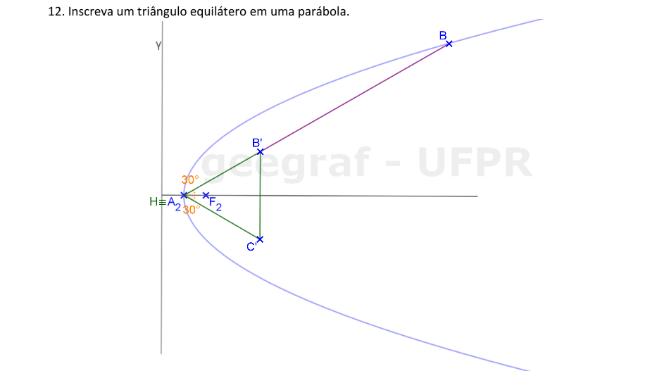
			   <figcaption>Usando o centro de homotetia <b>H &equiv; A2</b>, defina o ponto <b>B &isin; A2B'</b> na parábola. Temos o primeiro vértice do triângulo equilátero inscrito.</figcaption>
		   </li>
		   <li>
			   <input type="radio" id="489" name="sl">
			   <label for="489"></label>
			   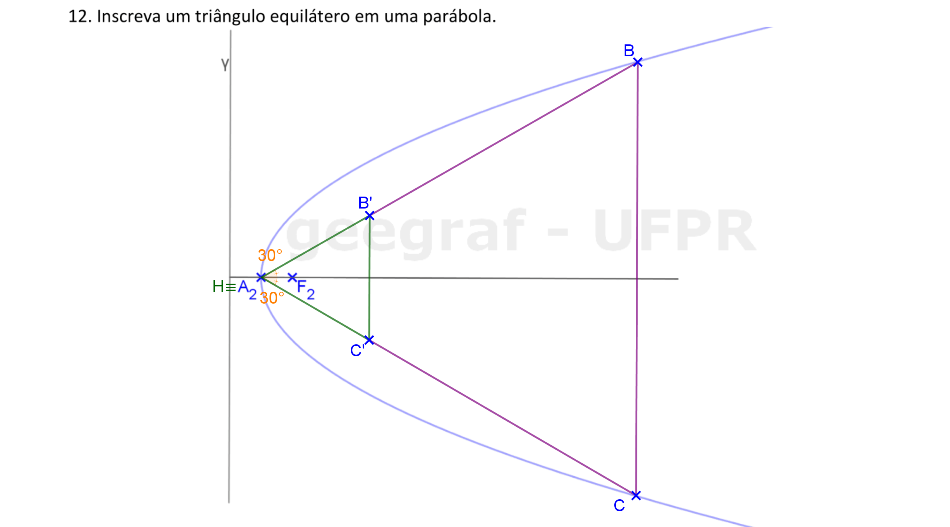
			   <figcaption>Defina o ponto <b>C &isin; A2C'</b> na parábola, determinando o triângulo equilátero inscrito na cônica.</figcaption>
		   </li>
		</ul>
		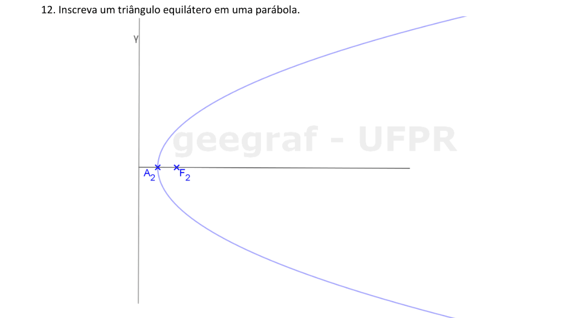
  

   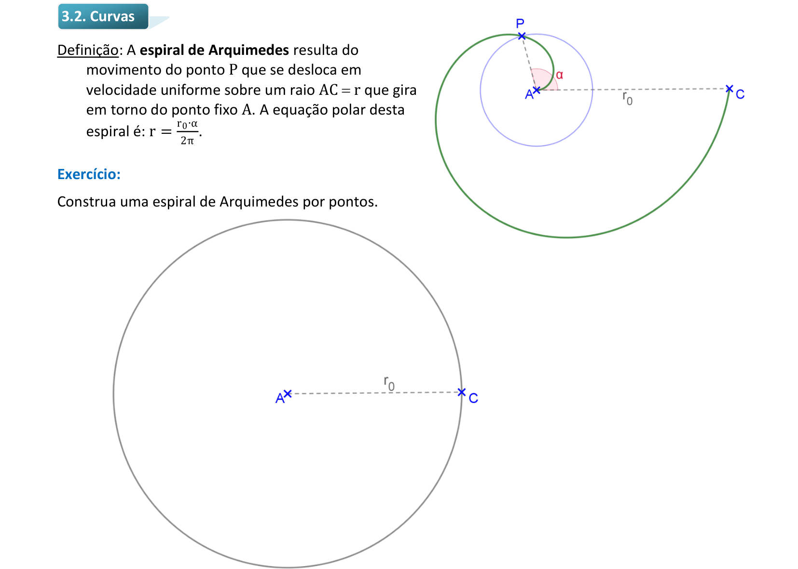
   

&#x1f4cf; &#x1f4d0; Resolução

	
Vamos construir uma espiral de Arquimedes por pontos. Usaremos 8 pontos neste exemplo.

	  <ul class="slider">
		   <li>
			   <input type="radio" id="490" name="sl">
			   <label for="490"></label>
			   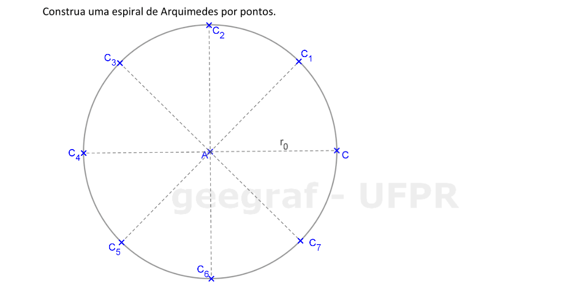
			   <figcaption>Obtenha os vértices de um octógono regular inscrito na circunferência: os ângulos centrais medem 45&deg;.</figcaption>
		   </li>
		   <li>
			   <input type="radio" id="491" name="sl">
			   <label for="491"></label>
			   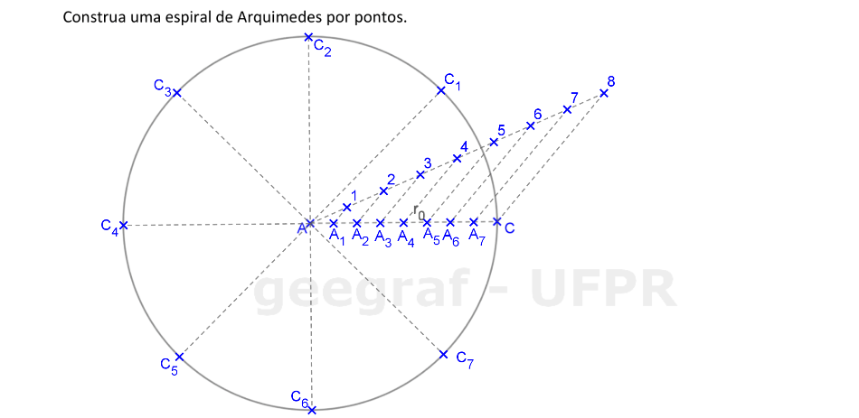
			   <figcaption>Divida um dos raios <b>AC = r0</b> em 8 partes iguais, usando o teorema de Tales. Assim, encontramos os pontos <b>A1</b>, <b>A2</b>, ..., <b>A7</b> no raio <b>AC</b>.</figcaption>
		   </li>
		   <li>
			   <input type="radio" id="492" name="sl">
			   <label for="492"></label>
			   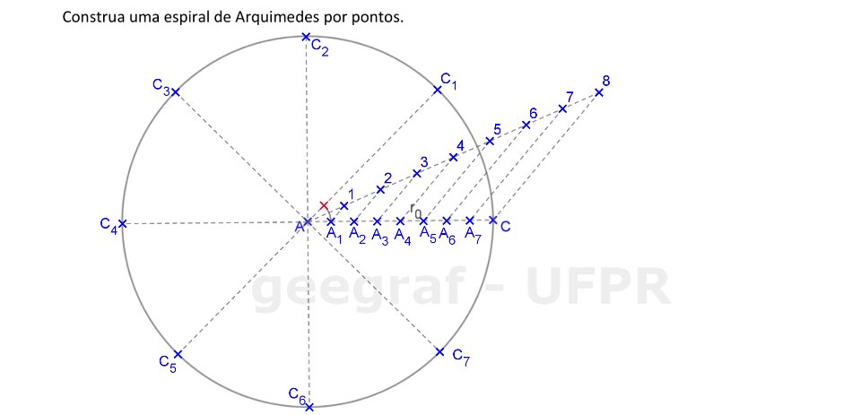
			   <figcaption>Defina o arco com centro em <b>A</b> e raio <b>AA1</b>: a interseção deste arco com o primeiro raio <b>AC1</b> é o primeiro ponto da espiral.</figcaption>
		   </li>
		   <li>
			   <input type="radio" id="493" name="sl">
			   <label for="493"></label>
			   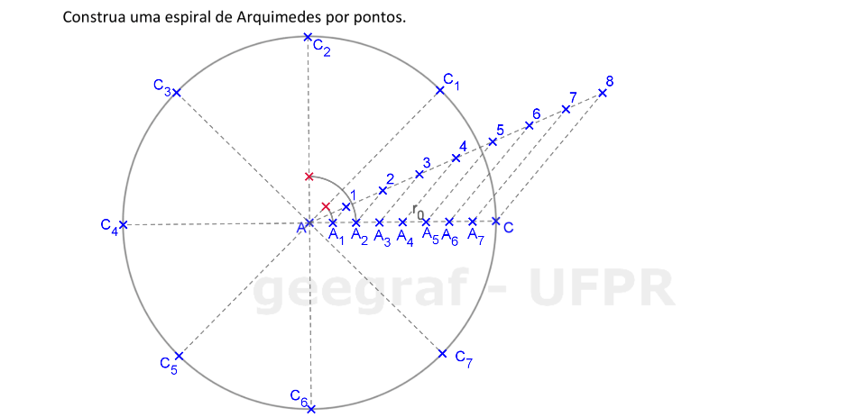
			   <figcaption>Defina o arco com centro em <b>A</b> e raio <b>AA2</b>: a interseção deste arco com o segundo raio <b>AC2</b> é o segundo ponto da espiral.</figcaption>
		   </li>
		   <li>
			   <input type="radio" id="494" name="sl">
			   <label for="494"></label>
			   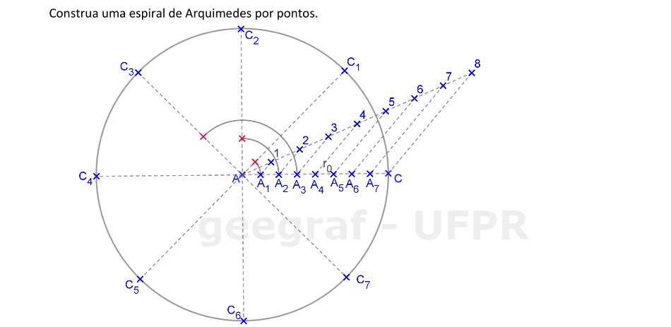
			   <figcaption>Defina o arco com centro em <b>A</b> e raio <b>AA3</b>: a interseção deste arco com o terceiro raio <b>AC3</b> é o terceiro ponto da espiral.</figcaption>
		   </li>
		   <li>
			   <input type="radio" id="495" name="sl">
			   <label for="495"></label>
			   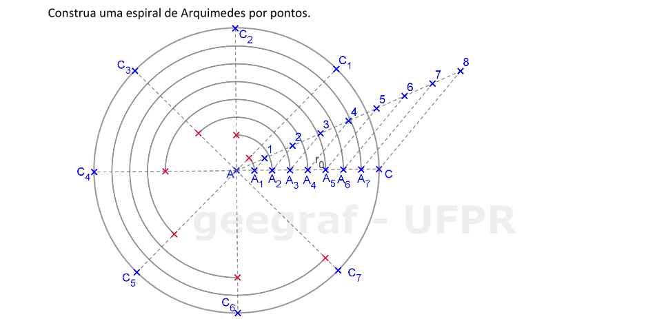
			   <figcaption>Usando o mesmo raciocínio, encontramos os demais pontos da espiral.</figcaption>
		   </li>
		   <li>
			   <input type="radio" id="496" name="sl">
			   <label for="496"></label>
			   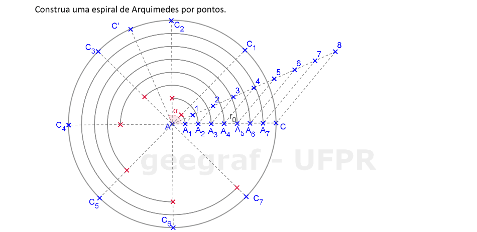
			   <figcaption>A forma paramétrica desta curva pode ser encontrada com um raio qualquer <b>AC'</b> e o ângulo <b>CÂC' = &alpha;</b>.</figcaption>
		   </li>
		   <li>
			   <input type="radio" id="497" name="sl">
			   <label for="497"></label>
			   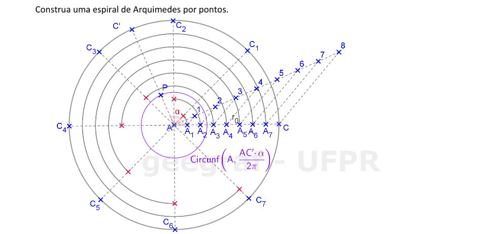
			   <figcaption>Defina a $\mathsf{ Circunf(A, { {AC'\cdot \alpha} \over {2 \pi}}) }$. O ponto <b>P</b> de interseção desta circunferência com o raio <b>AC'</b> determina um ponto da espiral.</figcaption>
		   </li>
		   <li>
			   <input type="radio" id="498" name="sl">
			   <label for="498"></label>
			   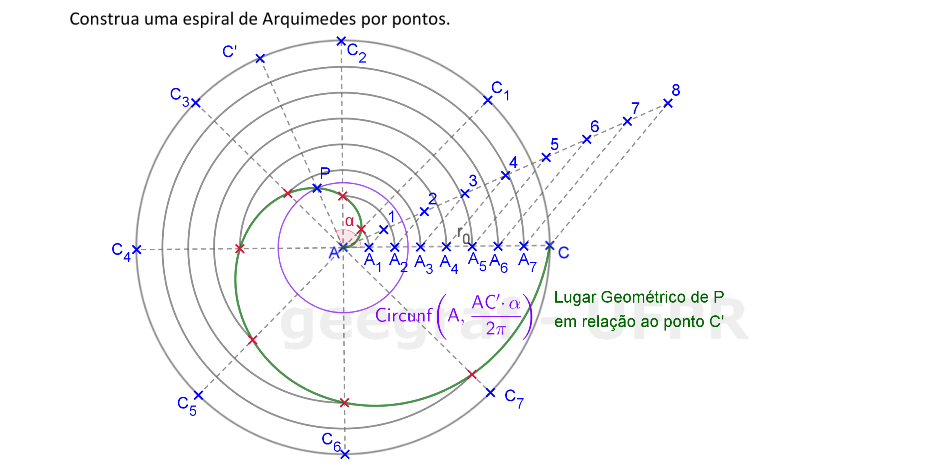
			   <figcaption>O lugar geométrico do ponto <b>P</b> em relação ao ponto <b>C'</b> é a espiral de Arquimedes limitada à circunferência dada.</figcaption>
		   </li>
		</ul>
		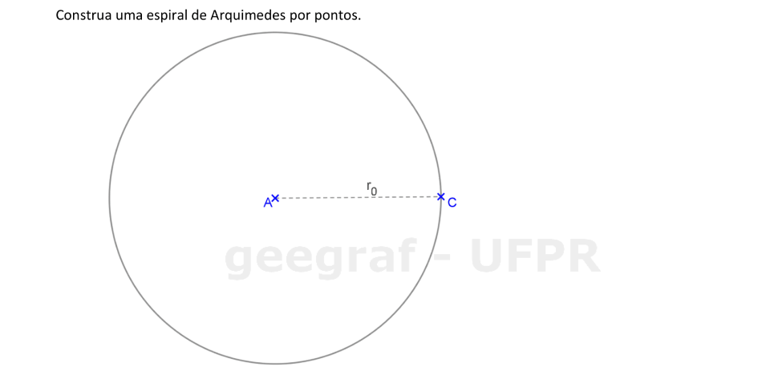
  

   
<a href="#modulo4" class="topo">voltar ao topo</a>

   
   

&#x1f4cf; &#x1f4d0; Resolução

	
Vamos construir uma espiral logarítmica por pontos. Usaremos 8 pontos neste exemplo.

	  <ul class="slider">
		   <li>
			   <input type="radio" id="499" name="sl">
			   <label for="499"></label>
			   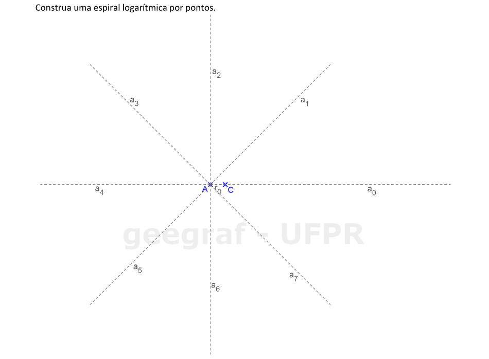
			   <figcaption>Construa as retas que passam por <b>A</b> e formam ângulos de 45&deg; entre si.</figcaption>
		   </li>
		   <li>
			   <input type="radio" id="500" name="sl">
			   <label for="500"></label>
			   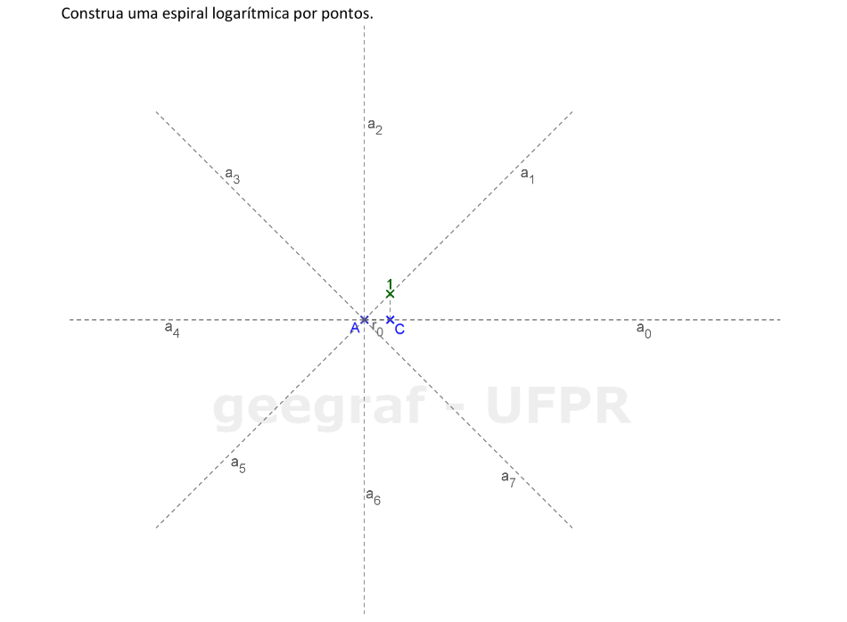
			   <figcaption>Construa o segmento <b>1C &perp; a0</b>, tal que <b>1 &isin; a1</b>.</figcaption>
		   </li>
		   <li>
			   <input type="radio" id="501" name="sl">
			   <label for="501"></label>
			   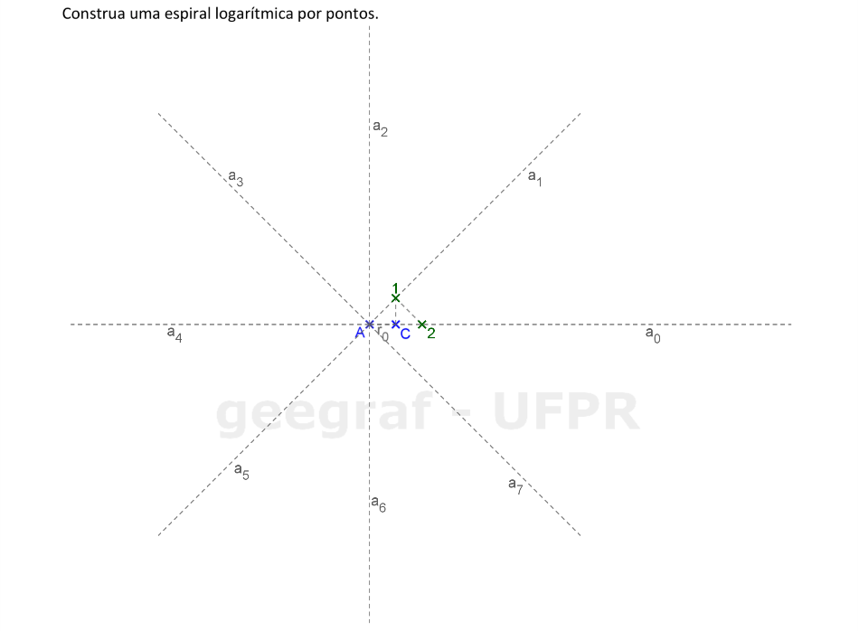
			   <figcaption>Construa o segmento <b>12 &perp; a1</b>, tal que <b>2 &isin; a0</b>.</figcaption>
		   </li>
		   <li>
			   <input type="radio" id="502" name="sl">
			   <label for="502"></label>
			   
			   <figcaption>Construa o segmento <b>23 &perp; a0</b>, tal que <b>3 &isin; a1</b>.</figcaption>
		   </li>
		   <li>
			   <input type="radio" id="503" name="sl">
			   <label for="503"></label>
			   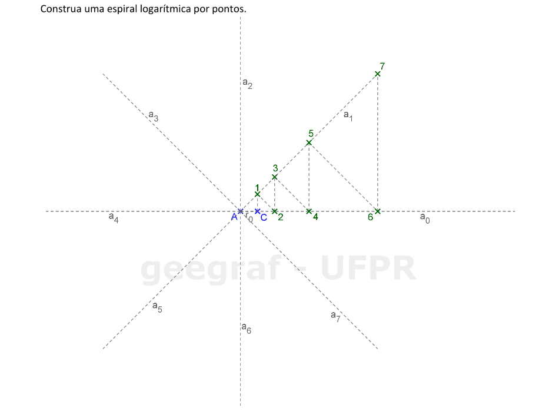
			   <figcaption>Usando o mesmo raciocínio, defina os pontos <b>4</b>, <b>5</b>, <b>6</b> e <b>7</b> que pertencem alternadamente às retas <b>a0</b> e <b>a1</b>.</figcaption>
		   </li>
		   <li>
			   <input type="radio" id="504" name="sl">
			   <label for="504"></label>
			   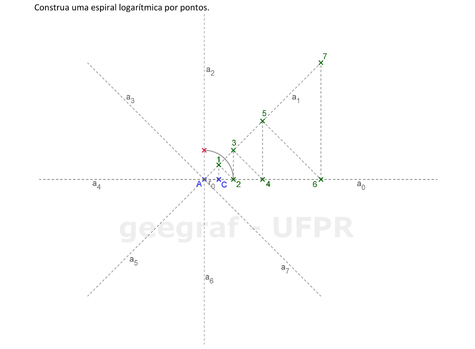
			   <figcaption>Os pontos <b>C</b> e <b>1</b> pertencem à espiral. Defina o arco com centro em <b>A</b> e raio <b>A2</b>: a interseção deste arco com a reta <b>a2</b> é o terceiro ponto da espiral.</figcaption>
		   </li>
		   <li>
			   <input type="radio" id="505" name="sl">
			   <label for="505"></label>
			   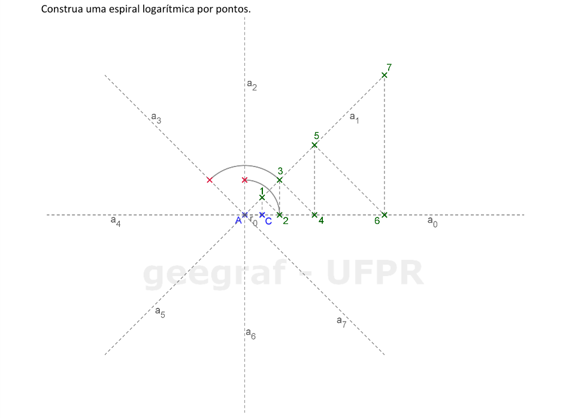
			   <figcaption>Defina o arco com centro em <b>A</b> e raio <b>A3</b>: a interseção deste arco com a reta <b>a3</b> é o quarto ponto da espiral.</figcaption>
		   </li>
		   <li>
			   <input type="radio" id="506" name="sl">
			   <label for="506"></label>
			   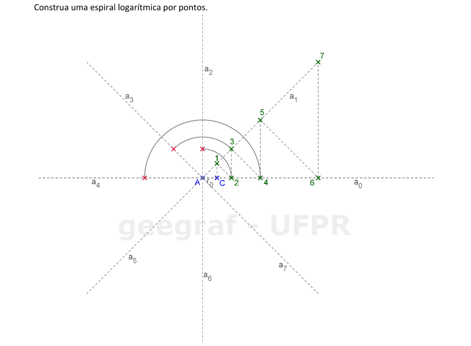
			   <figcaption>Defina o arco com centro em <b>A</b> e raio <b>A4</b>: a interseção deste arco com a reta <b>a4</b> é o quinto ponto da espiral.</figcaption>
		   </li>
		   <li>
			   <input type="radio" id="507" name="sl">
			   <label for="507"></label>
			   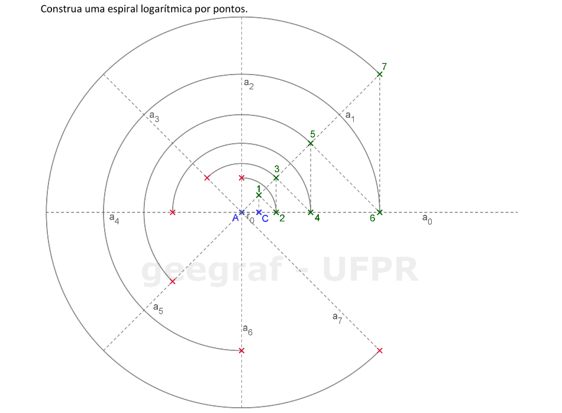
			   <figcaption>Usando o mesmo raciocínio, encontramos os demais pontos da espiral.</figcaption>
		   </li>
		   <li>
			   <input type="radio" id="508" name="sl">
			   <label for="508"></label>
			   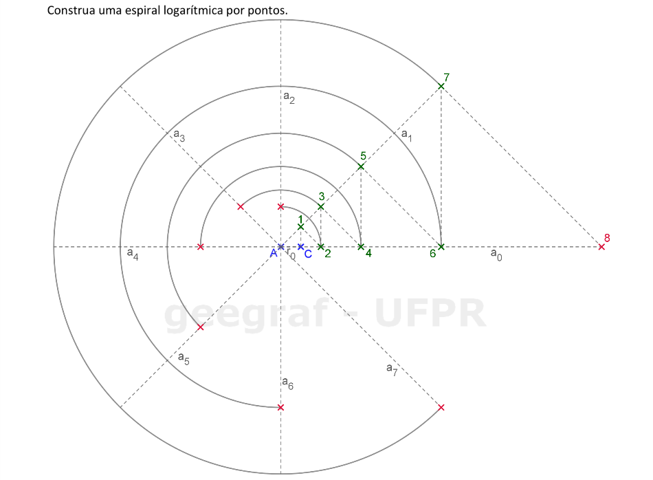
			   <figcaption>Obtenha o ponto <b>8</b> por meio do segmento <b>78 &perp; a1</b>. Este é o último ponto da primeira volta desta espiral.</figcaption>
		   </li>
		   <li>
			   <input type="radio" id="509" name="sl">
			   <label for="509"></label>
			   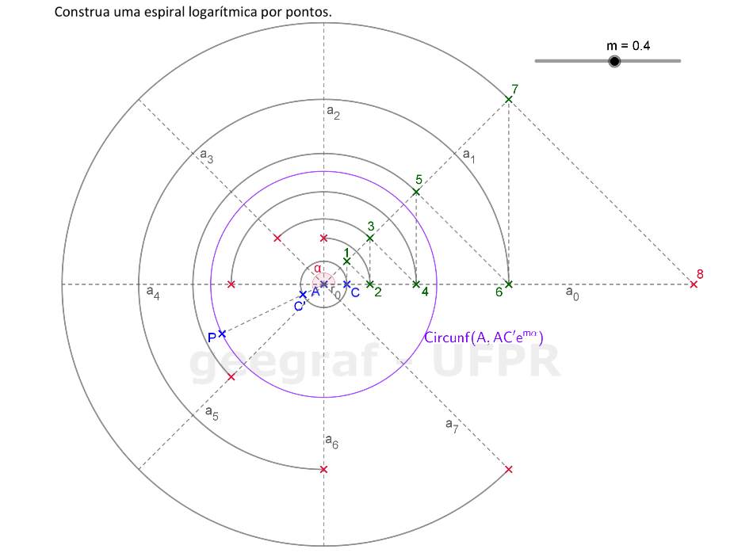
			   <figcaption>A forma paramétrica desta curva pode ser encontrada com um raio qualquer <b>AC'</b> e o ângulo <b>CÂC' = &alpha;</b>. Defina a $\mathsf{ Circunf(A, AC'e ^ {m \alpha}) }$. O ponto <b>P</b> de interseção desta circunferência com o raio <b>AC'</b> determina um ponto da espiral.</figcaption>
		   </li>
		   <li>
			   <input type="radio" id="510" name="sl">
			   <label for="510"></label>
			   
			   <figcaption>O lugar geométrico do ponto <b>P</b> em relação ao ponto <b>C'</b> é a espiral logarítmica. Neste exemplo, temos <b>m = 0.442</b></figcaption>
		   </li>
		</ul>
		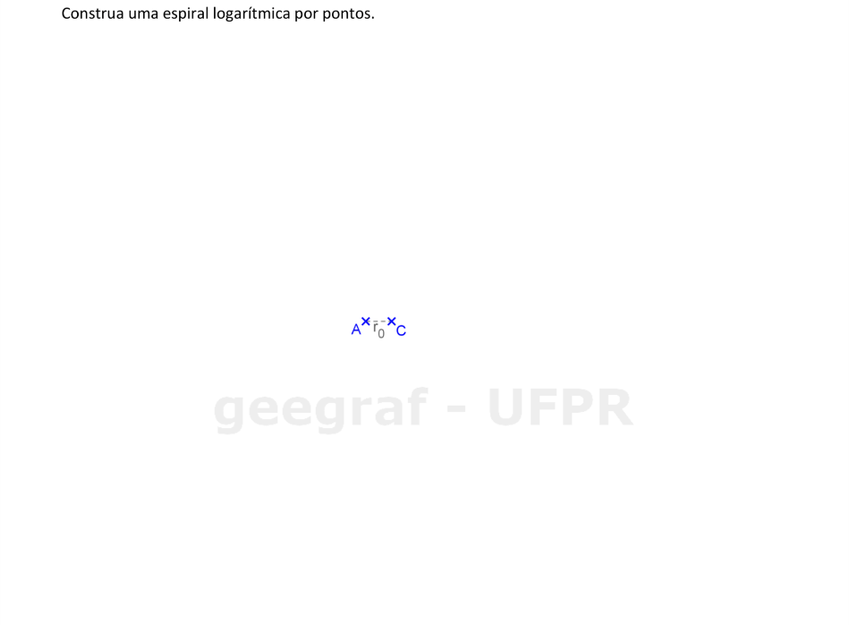
  

   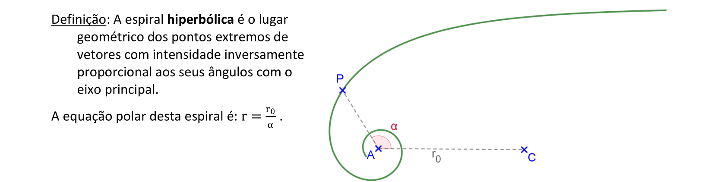
   
<a href="#modulo4" class="topo">voltar ao topo</a>

   
   

&#x1f4cf; &#x1f4d0; Resolução

	
Vamos construir uma espiral hiperbólica usando sua equação polar.

	  <ul class="slider">
		   <li>
			   <input type="radio" id="511" name="sl">
			   <label for="511"></label>
			   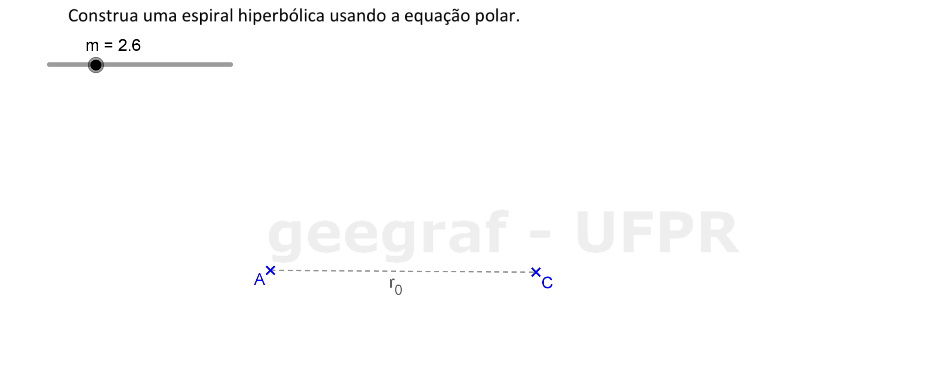
			   <figcaption>Defina o valor <b>m</b> e o raio inicial <b>r0</b>.</figcaption>
		   </li>
		   <li>
			   <input type="radio" id="512" name="sl">
			   <label for="512"></label>
			   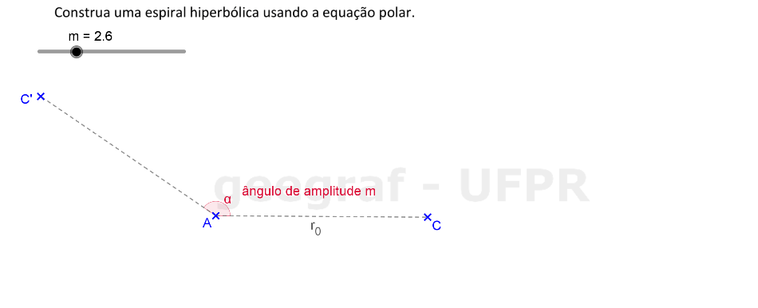
			   <figcaption>Construa o ângulo com amplitude fixa <b>m</b>, com vértice <b>A</b>.</figcaption>
		   </li>
		   <li>
			   <input type="radio" id="513" name="sl">
			   <label for="513"></label>
			   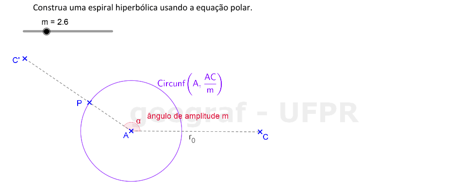
			   <figcaption>Defina a $\mathsf{ Circunf(A, { {AC} \over {m} }) }$. O ponto <b>P</b> de interseção desta circunferência com o raio <b>AC'</b> determina um ponto da espiral.</figcaption>
		   </li>
		   <li>
			   <input type="radio" id="514" name="sl">
			   <label for="514"></label>
			   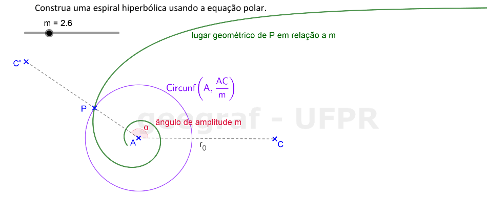
			   <figcaption>O lugar geométrico do ponto <b>P</b> em relação ao valor <b>m</b> é a espiral hiperbólica.</figcaption>
		   </li>
		</ul>
		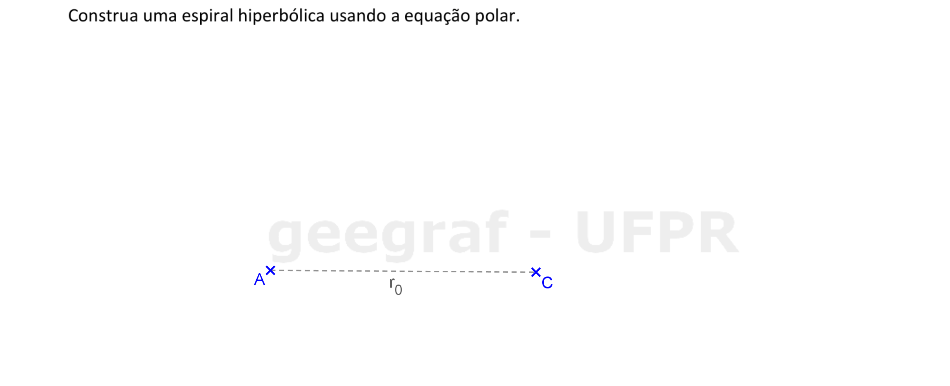
  

   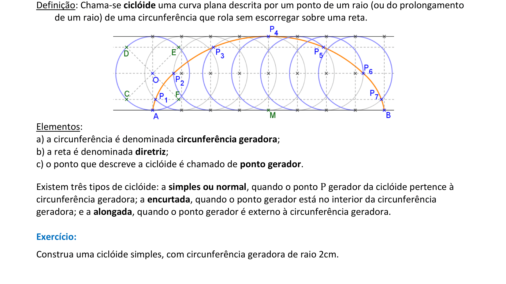
   

&#x1f4cf; &#x1f4d0; Resolução

	
Vamos construir uma ciclóide simples, por pontos, usando uma circunferência geradora com raio de medida igual a 2cm.

	  <ul class="slider">
		   <li>
			   <input type="radio" id="515" name="sl">
			   <label for="515"></label>
			   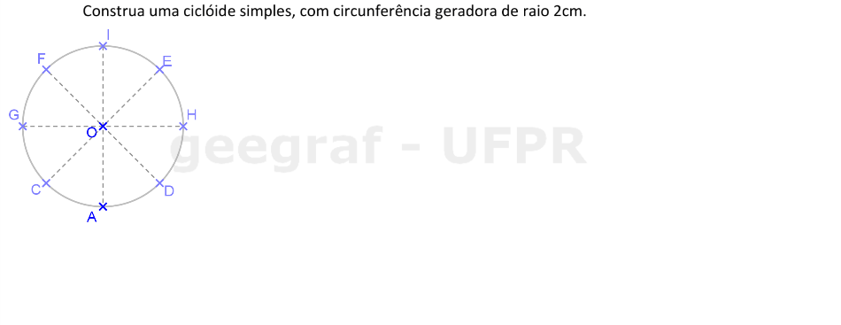
			   <figcaption>Construa a circunferência próxima à margem da folha, e encontre os vértices do octógono inscrito nesta circunferência.</figcaption>
		   </li>
		   <li>
			   <input type="radio" id="516" name="sl">
			   <label for="516"></label>
			   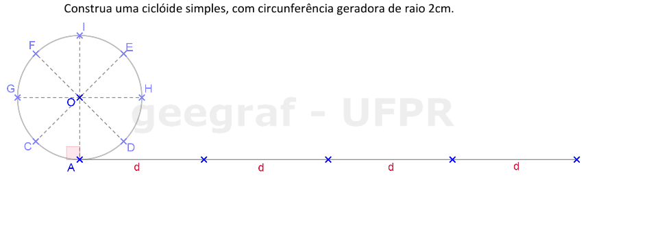
			   <figcaption>Construa a reta tangente à circunferência que passa pelo ponto <b>A</b>, que será o início da ciclóide. Construa quatro segmentos consecutivos com medidas iguais ao diâmetro <b>d</b> da circunferência.</figcaption>
		   </li>
		   <li>
			   <input type="radio" id="517" name="sl">
			   <label for="517"></label>
			   
			   <figcaption>Usando a aproximação de Arquimedes para retificação de circunferências, obtenha $\mathsf{ {1} \over {7} }$ do quarto diâmetro construído. Logo, a distância <b>AB = 3d +</b> $\mathsf{ {d} \over {7} }$ é aproximamente igual ao perímetro da circunferência.</figcaption>
		   </li>
		   <li>
			   <input type="radio" id="518" name="sl">
			   <label for="518"></label>
			   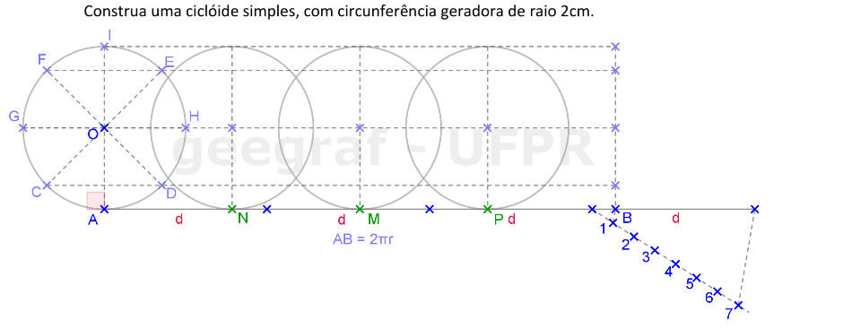
			   <figcaption>Divida o segmento <b>AB</b> em 4 partes iguais. Os pontos <b>N</b>, <b>M</b> e <b>P</b> definem $\mathsf{ {1} \over {4} }$, $\mathsf{ {1} \over {2} }$ e $\mathsf{ {3} \over {4} }$ da trajetória da circunferência.</figcaption>
		   </li>
		   <li>
			   <input type="radio" id="519" name="sl">
			   <label for="519"></label>
			   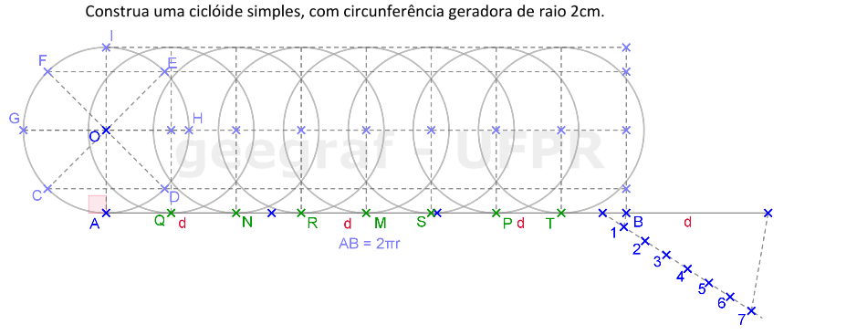
			   <figcaption>Divida os segmentos <b>AN</b>, <b>NM</b>, <b>MP</b> e <b>PB</b> ao meio. Os pontos <b>Q</b>, <b>R</b>, <b>S</b> e <b>T</b> definem $\mathsf{ {1} \over {8} }$, $\mathsf{ {3} \over {8} }$, $\mathsf{ {5} \over {8} }$ e $\mathsf{ {7} \over {8} }$ da trajetória da circunferência.</figcaption>
		   </li>
		   <li>
			   <input type="radio" id="520" name="sl">
			   <label for="520"></label>
			   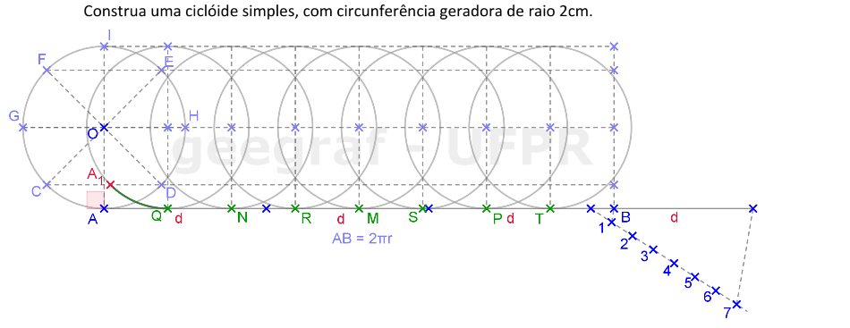
			   <figcaption>As retas <b>CD</b>, <b>GH</b> e <b>EF</b> definem os pontos da trajetória da ciclóide. A interseção da circunferência que passa por <b>Q</b> com a reta <b>CD</b> define o primeiro ponto da curva ciclóide (ângulo de 45&deg; relativo ao ponto <b>C</b>).</figcaption>
		   </li>
		   <li>
			   <input type="radio" id="521" name="sl">
			   <label for="521"></label>
			   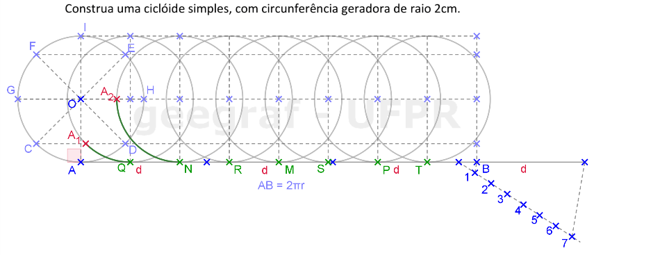
			   <figcaption>A interseção da circunferência que passa por <b>N</b> com a reta <b>GH</b> define o segundo ponto da curva ciclóide (ângulo de 90&deg; relativo ao ponto <b>G</b>).</figcaption>
		   </li>
		   <li>
			   <input type="radio" id="522" name="sl">
			   <label for="522"></label>
			   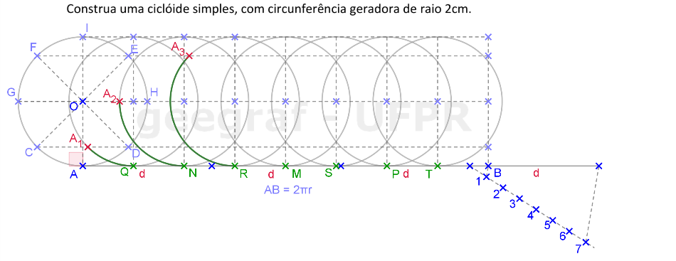
			   <figcaption>A interseção da circunferência que passa por <b>R</b> com a reta <b>EF</b> define o terceiro ponto da ciclóide (ângulo de 135&deg; relativo ao ponto <b>F</b>).</figcaption>
		   </li>
		   <li>
			   <input type="radio" id="523" name="sl">
			   <label for="523"></label>
			   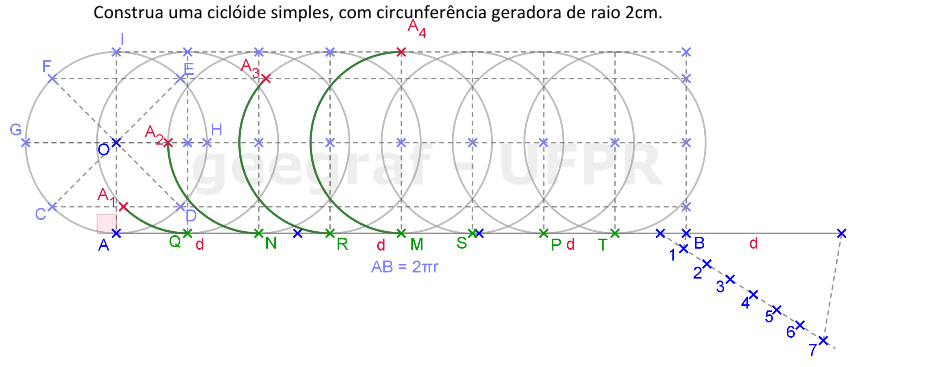
			   <figcaption>O ponto <b>A4</b> corresponde à metade da trajetória (ângulo de 180&deg; relativo ao ponto <b>I</b>).</figcaption>
		   </li>
		   <li>
			   <input type="radio" id="524" name="sl">
			   <label for="524"></label>
			   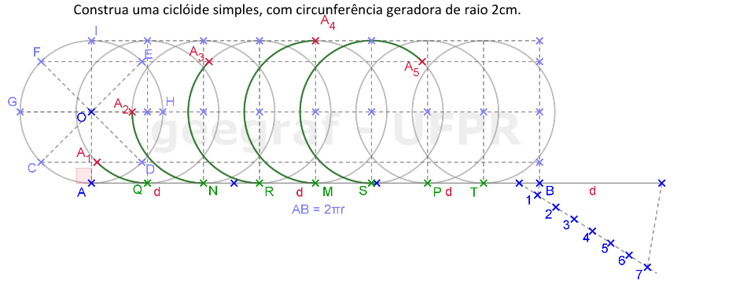
			   <figcaption>A interseção da circunferência que passa por <b>S</b> com a reta <b>EF</b> define o quinto ponto da ciclóide (ângulo de 225&deg; relativo ao ponto <b>E</b>).</figcaption>
		   </li>
		   <li>
			   <input type="radio" id="525" name="sl">
			   <label for="525"></label>
			   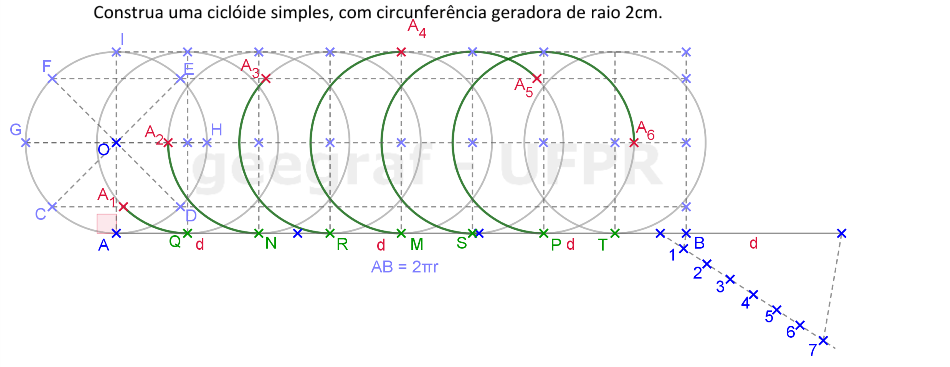
			   <figcaption>A interseção da circunferência que passa por <b>P</b> com a reta <b>GH</b> define o sexto ponto da ciclóide (ângulo de 270&deg; relativo ao ponto <b>H</b>).</figcaption>
		   </li>
		   <li>
			   <input type="radio" id="526" name="sl">
			   <label for="526"></label>
			   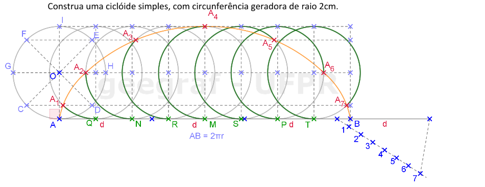
			   <figcaption>A interseção da circunferência que passa por <b>T</b> com a reta <b>CD</b> define o sétimo ponto da ciclóide (ângulo de 315&deg; relativo ao ponto <b>D</b>). O último ponto da ciclóide é <b>B</b>.</figcaption>
		   </li>
		</ul>
		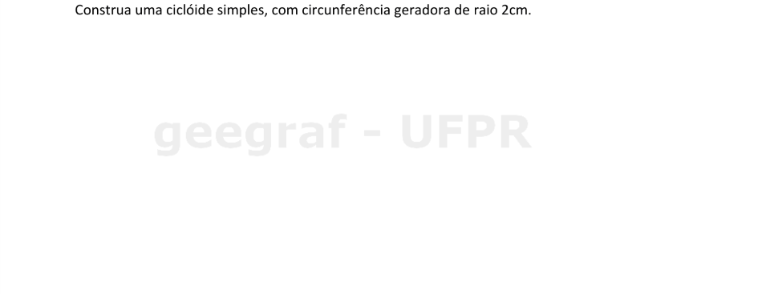
  

   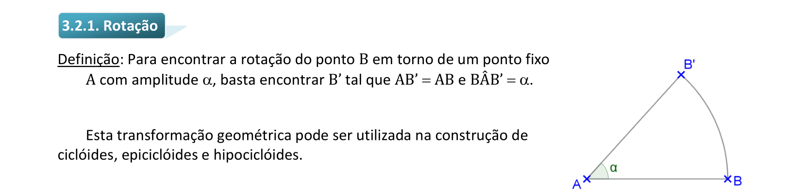
   
<a href="#modulo4" class="topo">voltar ao topo</a>

   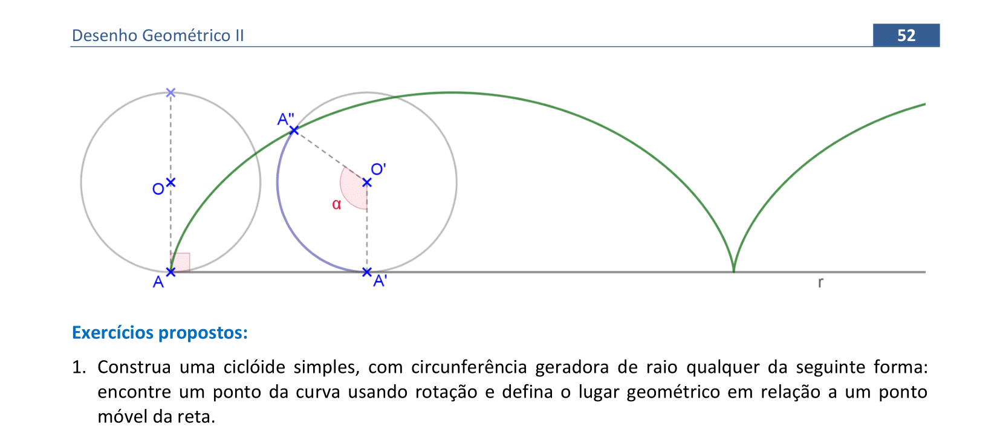
   

&#x1f4cf; &#x1f4d0; Resolução

	
Vamos construir uma ciclóide usando uma rotação.

	  <ul class="slider">
		   <li>
			   <input type="radio" id="527" name="sl">
			   <label for="527"></label>
			   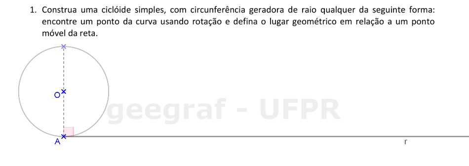
			   <figcaption>Construa uma circunferência de centro <b>O</b> e raio <b>OA</b>. Trace a reta <b>r</b> tangente a esta circunferência pelo ponto <b>A</b>.</figcaption>
		   </li>
		   <li>
			   <input type="radio" id="528" name="sl">
			   <label for="528"></label>
			   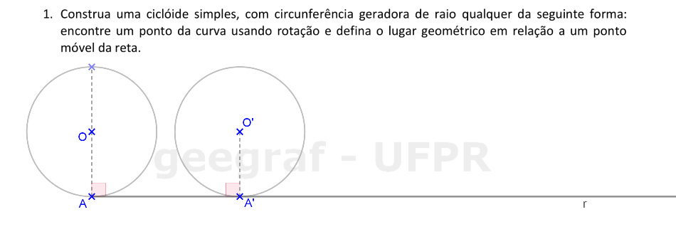
			   <figcaption>Usando um ponto qualquer <b>A' &isin; r</b>, construa a circunferência com raio <b>O'A' = OA</b> tangente à reta <b>r</b>.</figcaption>
		   </li>
		   <li>
			   <input type="radio" id="529" name="sl">
			   <label for="529"></label>
			   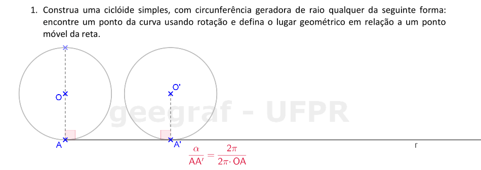
			   <figcaption>A fração da trajetória <b>AA'</b> está em uma correspondência proporcional ao ângulo de 360&deg;. Usando a regra de três, temos que $\mathsf{ { {\alpha} \over {AA'} } = { {2 \pi} \over {2 \pi \cdot OA} } }$.</figcaption>
		   </li>
		   <li>
			   <input type="radio" id="530" name="sl">
			   <label for="530"></label>
			   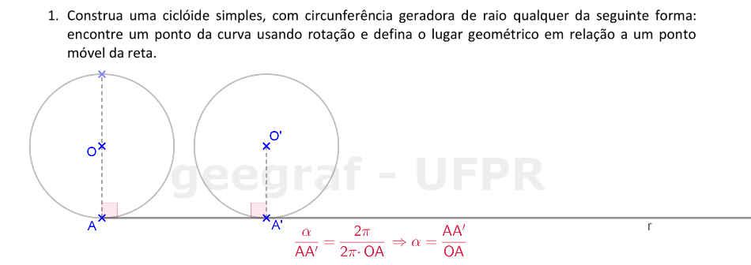
			   <figcaption>Logo, temos que $\mathsf{ \alpha = { {AA'} \over {OA} } }$ .</figcaption>
		   </li>
		   <li>
			   <input type="radio" id="531" name="sl">
			   <label for="531"></label>
			   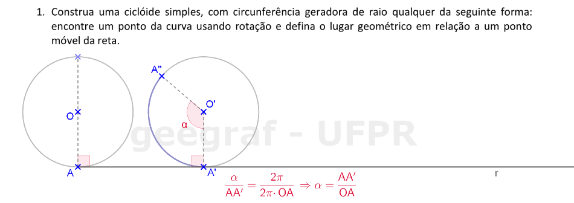
			   <figcaption>Defina a rotação do ponto <b>A'</b> feita por meio do ângulo de amplitude fixa <b>&alpha;</b> e vértice <b>O'</b>.</figcaption>
		   </li>
		   <li>
			   <input type="radio" id="532" name="sl">
			   <label for="532"></label>
			   
			   <figcaption>A ciclóide é o lugar geométrico da extremidade do ângulo <b>&alpha;</b>, ou seja, do ponto <b>A''</b>, em relação ao ponto <b>A'</b>.</figcaption>
		   </li>
		</ul>
		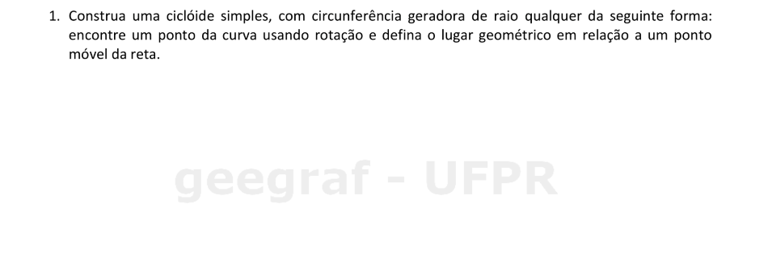
  

   
   

&#x1f4cf; &#x1f4d0; Resolução

	
Vamos construir uma ciclóide encurtada usando uma rotação.

	  <ul class="slider">
		   <li>
			   <input type="radio" id="533" name="sl">
			   <label for="533"></label>
			   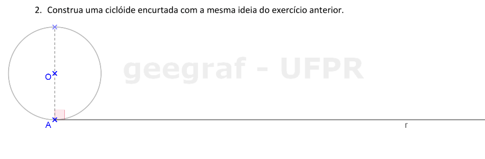
			   <figcaption>Construa uma circunferência de centro <b>O</b> e raio <b>OA</b>. Trace a reta <b>r</b> tangente a esta circunferência pelo ponto <b>A</b>.</figcaption>
		   </li>
		   <li>
			   <input type="radio" id="534" name="sl">
			   <label for="534"></label>
			   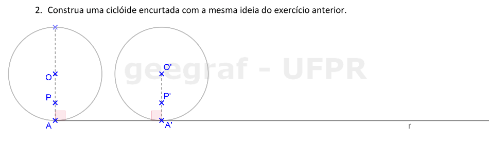
			   <figcaption>Usando um ponto qualquer <b>A' &isin; r</b>, construa a circunferência com raio <b>O'A' = OA</b> tangente à reta <b>r</b>. Defina os pontos <b>P</b> e <b>P'</b> pertencentes aos raios <b>OA</b> e <b>O'A'</b>.</figcaption>
		   </li>
		   <li>
			   <input type="radio" id="535" name="sl">
			   <label for="535"></label>
			   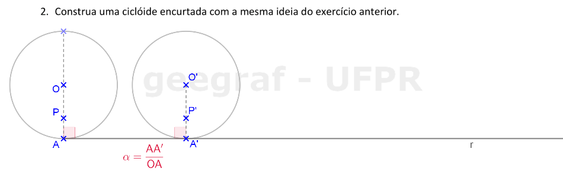
			   <figcaption>Defina o ângulo $\mathsf{ \alpha = { {AA'} \over {OA} } }$ .</figcaption>
		   </li>
		   <li>
			   <input type="radio" id="536" name="sl">
			   <label for="536"></label>
			   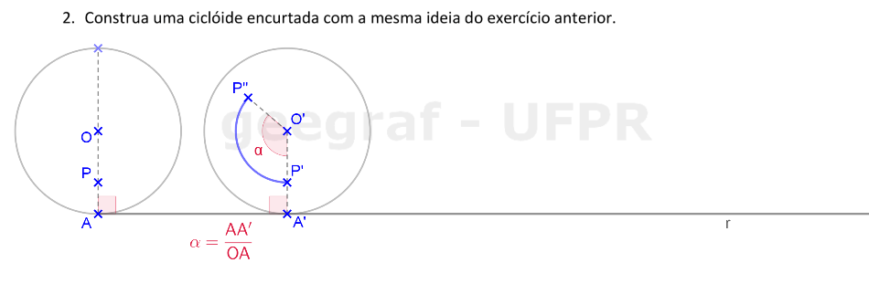
			   <figcaption>Defina a rotação do ponto <b>P'</b> feita por meio do ângulo de amplitude fixa <b>&alpha;</b> e vértice <b>O'</b></figcaption>
		   </li>
		   <li>
			   <input type="radio" id="537" name="sl">
			   <label for="537"></label>
			   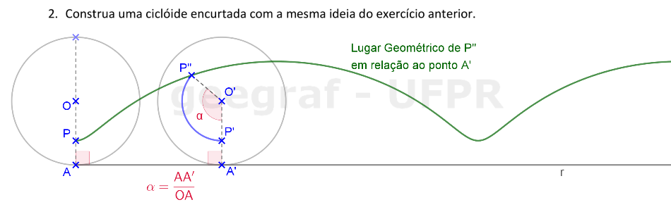
			   <figcaption>A ciclóide é o lugar geométrico da extremidade do ângulo <b>&alpha;</b>, ou seja, do ponto <b>P''</b>, em relação ao ponto <b>A'</b>.</figcaption>
		   </li>
		</ul>
		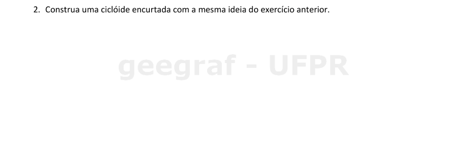
  

   
   
&#x1f4cf; &#x1f4d0; Exercício proposto 4.2

   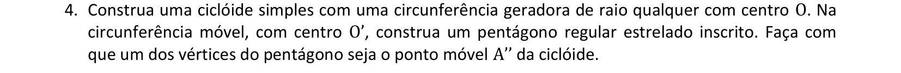
   

&#x1f4cf; &#x1f4d0; Resolução

	
Vamos construir uma ciclóide usando uma rotação, com um pentágono regular estrelado giratório.

	  <ul class="slider">
		   <li>
			   <input type="radio" id="538" name="sl">
			   <label for="538"></label>
			   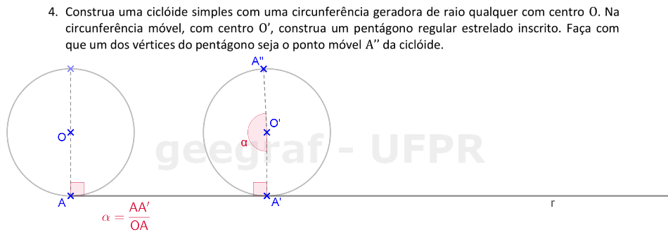
			   <figcaption>Usando os elementos mostrados nos dois exemplos anteriores, construa uma ciclóide simples com o ângulo <b>&alpha;</b> definido na circunferência de centro <b>O'</b>.</figcaption>
		   </li>
		   <li>
			   <input type="radio" id="539" name="sl">
			   <label for="539"></label>
			   
			   <figcaption>Defina o ângulo central do pentágono a partir da extremidade móvel <b>A''</b> da circunferência de centro <b>O'</b>.</figcaption>
		   </li>
		   <li>
			   <input type="radio" id="540" name="sl">
			   <label for="540"></label>
			   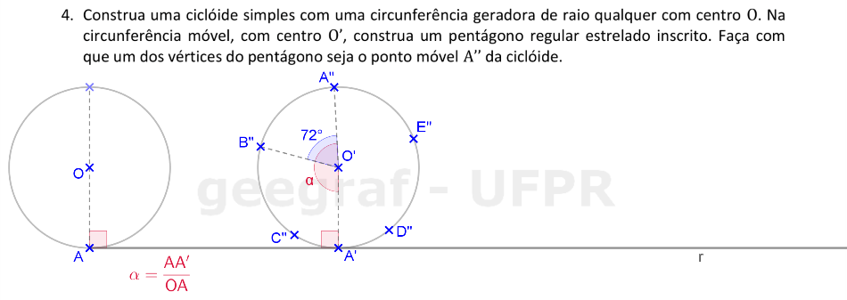
			   <figcaption>Construa os demais vértices do pentágono...</figcaption>
		   </li>
		   <li>
			   <input type="radio" id="541" name="sl">
			   <label for="541"></label>
			   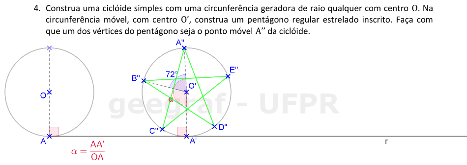
			   <figcaption>... e defina os lados do pentágono regular estrelado.</figcaption>
		   </li>
		   <li>
			   <input type="radio" id="542" name="sl">
			   <label for="542"></label>
			   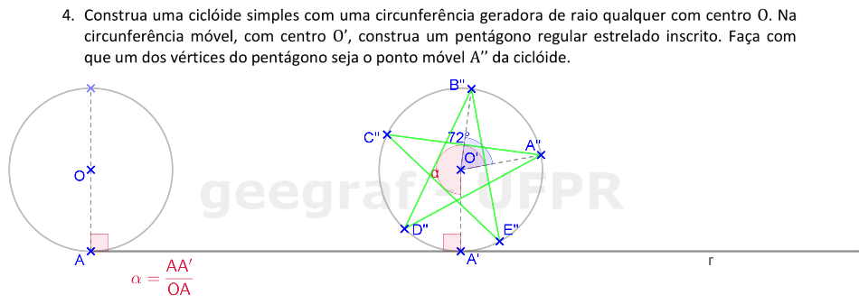
			   <figcaption>Ao movimentar a circunferência, os vértices e lados do pentágono movimentam-se junto. Experimente definir os lugares geométricos dos vértices do pentágono em relação ao ponto <b>A'</b>.</figcaption>
		   </li>
		</ul>
		
  

   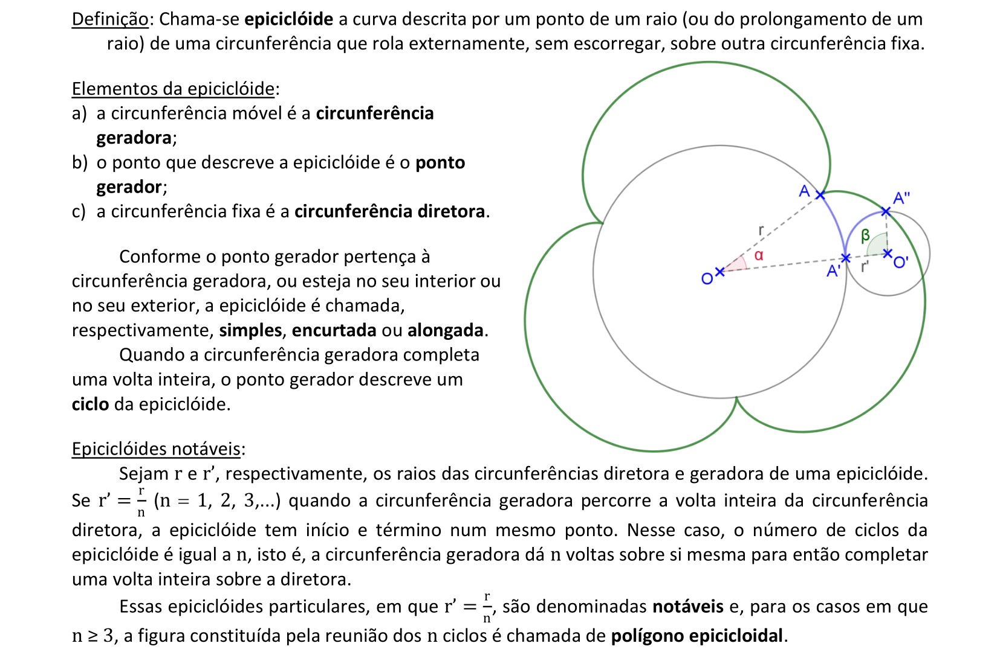
   
<a href="#modulo4" class="topo">voltar ao topo</a>

   
   

&#x1f4cf; &#x1f4d0; Resolução

	
Vamos construir uma epiciclóide usando rotações.

	  <ul class="slider">
		   <li>
			   <input type="radio" id="543" name="sl">
			   <label for="543"></label>
			   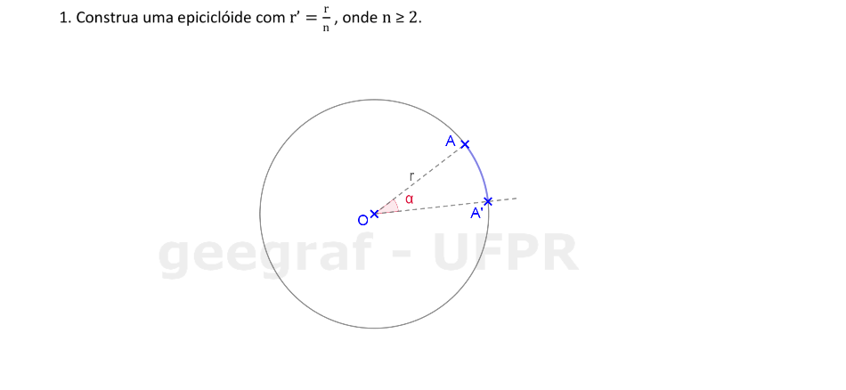
			   <figcaption>Começamos com a definição de um ângulo central qualquer <b>AÔA' = &alpha;</b> na circunferência de centro <b>O</b> e raio <b>OA = r</b>.</figcaption>
		   </li>
		   <li>
			   <input type="radio" id="544" name="sl">
			   <label for="544"></label>
			   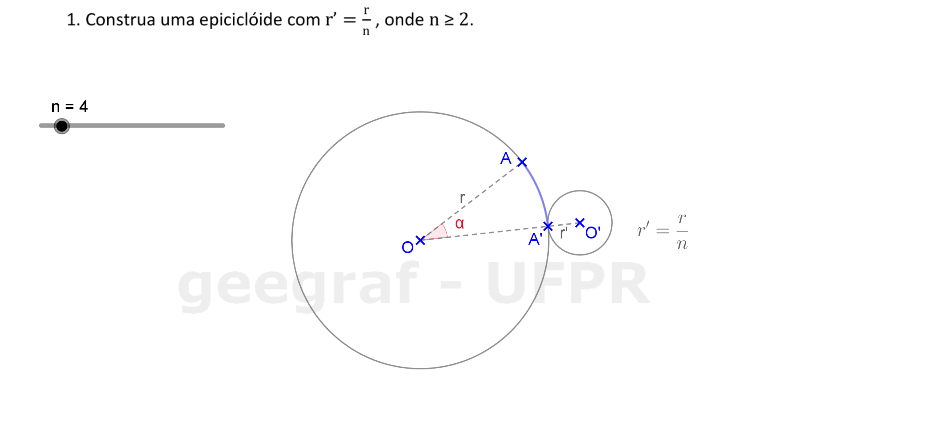
			   <figcaption>Defina o número <b>n &ge; 2</b> e a circunferência de centro <b>O'</b>, tangente externa à circunferência de centro <b>O</b> no ponto <b>A'</b>. O raio da circunferência de centro <b>O'</b> mede $\mathsf{ r' = { {r} \over {n} } = { {OA} \over {n} } }$.</figcaption>
		   </li>
		   <li>
			   <input type="radio" id="545" name="sl">
			   <label for="545"></label>
			   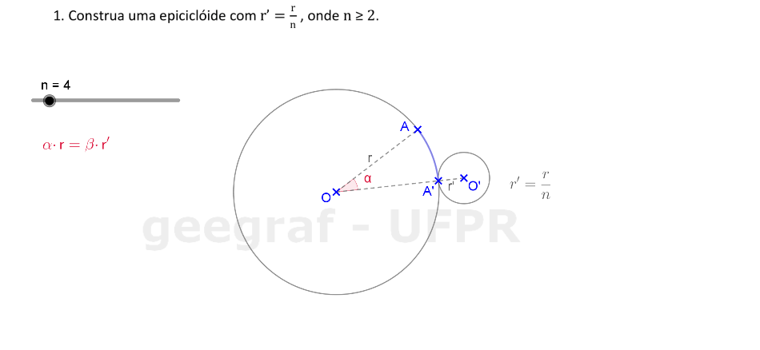
			   <figcaption>Considerando que a epiciclóide começa no ponto <b>A</b>, quando a circunferência menor rolar tangenciando a circunferência maior até o ponto <b>A'</b>, o comprimento do arco <b>AOA'</b> (com amplitude <b>&alpha;</b>) será igual ao comprimento do arco <b>A'O'A''</b> (com amplitude <b>&beta;</b>), ou seja, <b>&alpha;&middot;r = &beta;&middot;r'</b>.</figcaption>
		   </li>
		   <li>
			   <input type="radio" id="546" name="sl">
			   <label for="546"></label>
			   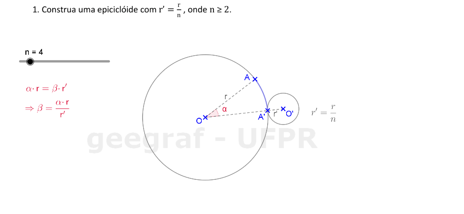
			   <figcaption>Logo, temos que $\mathsf{ \beta = { {\alpha \cdot r} \over {r'} } }$.</figcaption>
		   </li>
		   <li>
			   <input type="radio" id="547" name="sl">
			   <label for="547"></label>
			   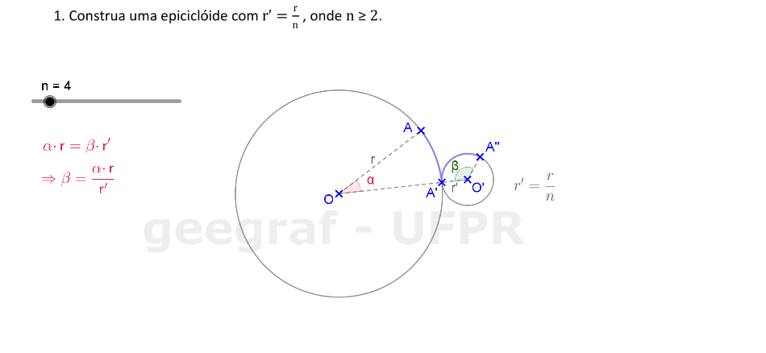
			   <figcaption>Defina o ângulo central com medida paramétrica <b>&beta;</b> na circunferência menor no sentido horário.</figcaption>
		   </li>
		   <li>
			   <input type="radio" id="548" name="sl">
			   <label for="548"></label>
			   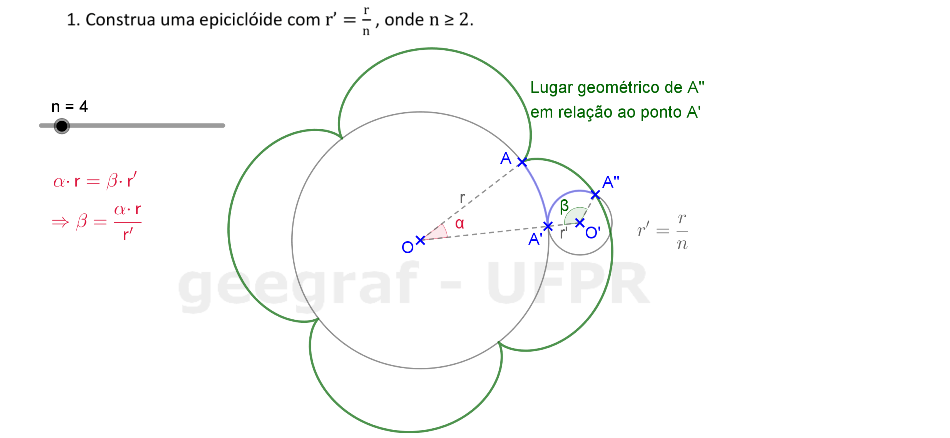
			   <figcaption>A epiciclóide é o lugar geométrico da extremidade do ângulo <b>&beta;</b>, ou seja, do ponto <b>A''</b>, em relação ao ponto <b>A'</b>.</figcaption>
		   </li>
		</ul>
		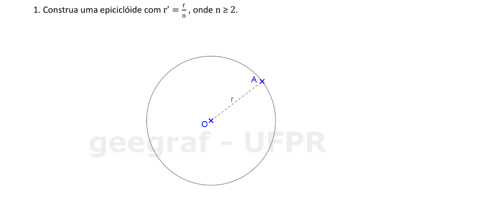
  

   
   

&#x1f4cf; &#x1f4d0; Resolução

	
Vamos construir uma epiciclóide alongada usando rotações.

	  <ul class="slider">
		   <li>
			   <input type="radio" id="549" name="sl">
			   <label for="549"></label>
			   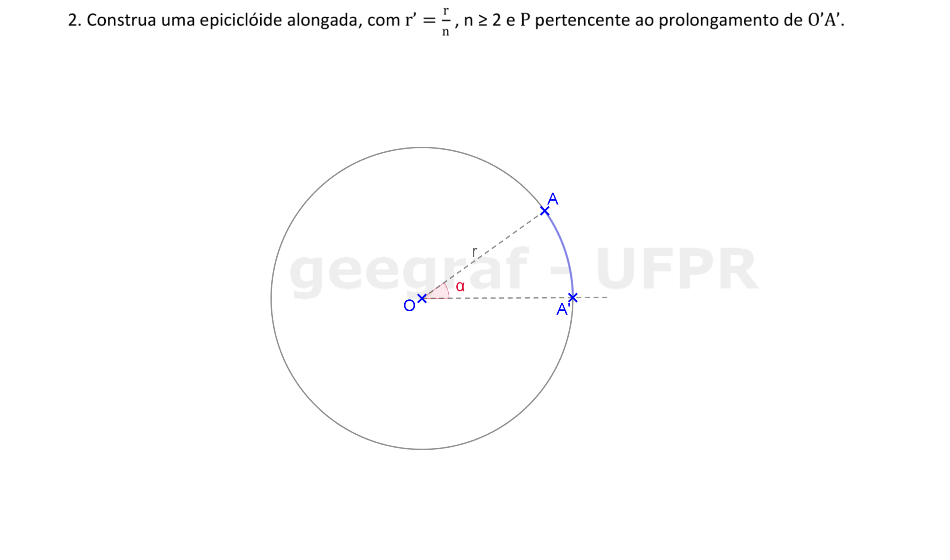
			   <figcaption>Começamos definindo um ângulo central qualquer <b>AÔA' = &alpha;</b> na circunferência de centro <b>O</b> e raio <b>OA = r</b>.</figcaption>
		   </li>
		   <li>
			   <input type="radio" id="550" name="sl">
			   <label for="550"></label>
			   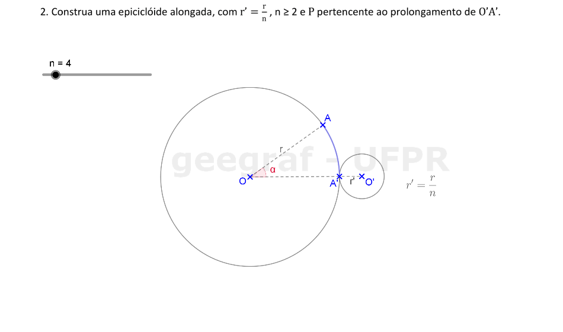
			   <figcaption>Defina o número <b>n &ge; 2</b> e a circunferência de centro <b>O'</b>, tangente à circunferência de centro <b>O</b> no ponto <b>A'</b>. O raio da circunferência de centro <b>O'</b> mede $\mathsf{ r' = { {r} \over {n} } = { {OA} \over {n} } }$.</figcaption>
		   </li>
		   <li>
			   <input type="radio" id="551" name="sl">
			   <label for="551"></label>
			   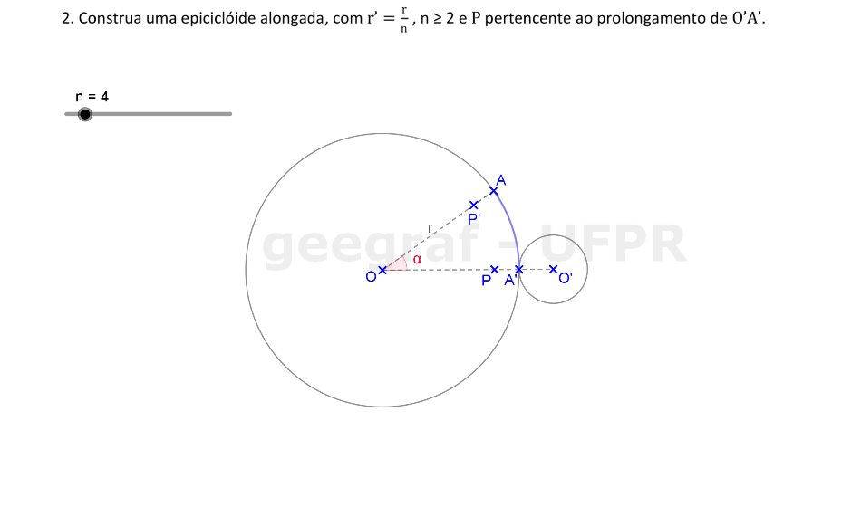
			   <figcaption>Na epiciclóide alongada, a trajetória será de um ponto <b>P</b> pertencente ao prolongamento do raio <b>O'A'</b>.</figcaption>
		   </li>
		   <li>
			   <input type="radio" id="552" name="sl">
			   <label for="552"></label>
			   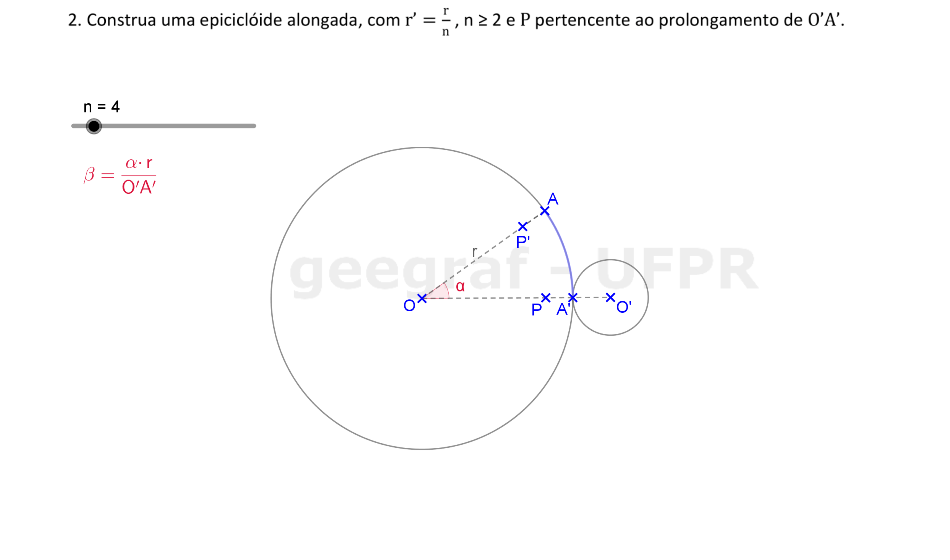
			   <figcaption>O ângulo correspondente da circunferência menor mede $\mathsf{ \beta = { {\alpha \cdot r} \over {O'A'} } }$.</figcaption>
		   </li>
		   <li>
			   <input type="radio" id="553" name="sl">
			   <label for="553"></label>
			   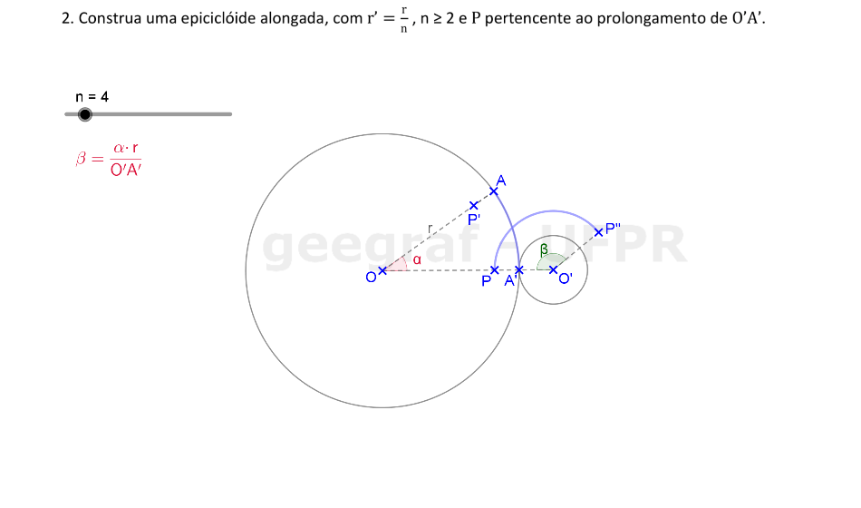
			   <figcaption>Defina o ângulo central com medida paramétrica <b>PO'P'' = &beta;</b> na circunferência menor.</figcaption>
		   </li>
		   <li>
			   <input type="radio" id="554" name="sl">
			   <label for="554"></label>
			   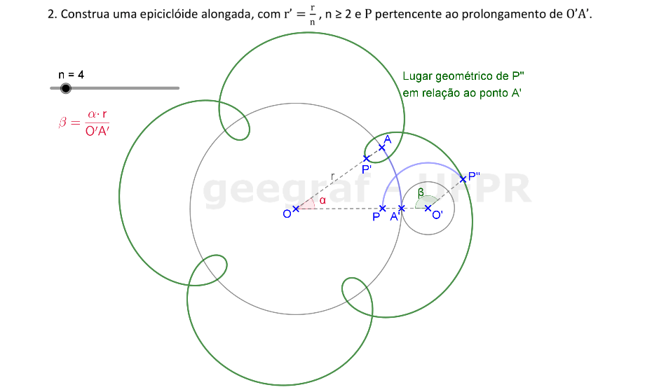
			   <figcaption>A epiciclóide alongada é o lugar geométrico da extremidade do ângulo <b>&beta;</b>, ou seja, do ponto <b>P''</b>, em relação ao ponto <b>A'</b>.</figcaption>
		   </li>
		</ul>
		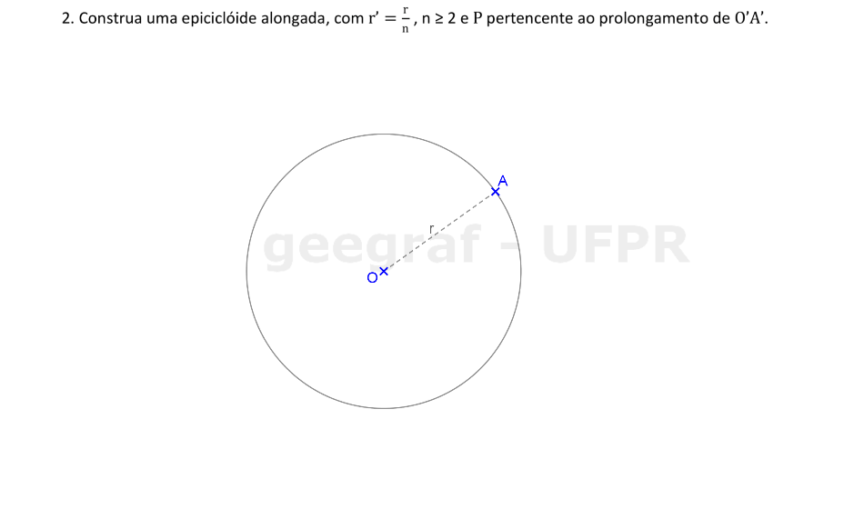
  

   
   
&#x1f4cf; &#x1f4d0; Exercício proposto 4.3

   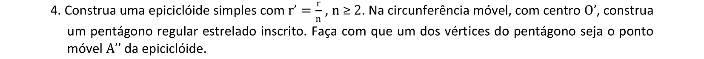
   

&#x1f4cf; &#x1f4d0; Resolução

	
Vamos construir uma epiciclóide usando rotações, com um pentágono regular estrelado giratório.

	  <ul class="slider">
		   <li>
			   <input type="radio" id="555" name="sl">
			   <label for="555"></label>
			   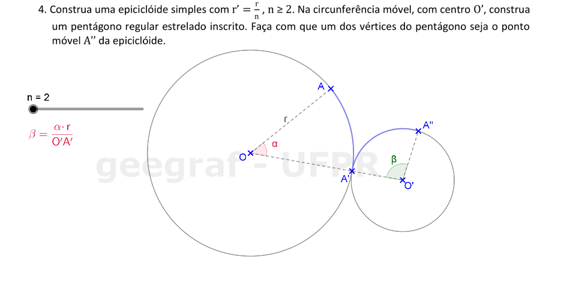
			   <figcaption>Usando os elementos mostrados nos dois exemplos anteriores, construa uma epiciclóide simples usando o ângulo central com medida <b>&beta;</b> na circunferência menor.</figcaption>
		   </li>
		   <li>
			   <input type="radio" id="556" name="sl">
			   <label for="556"></label>
			   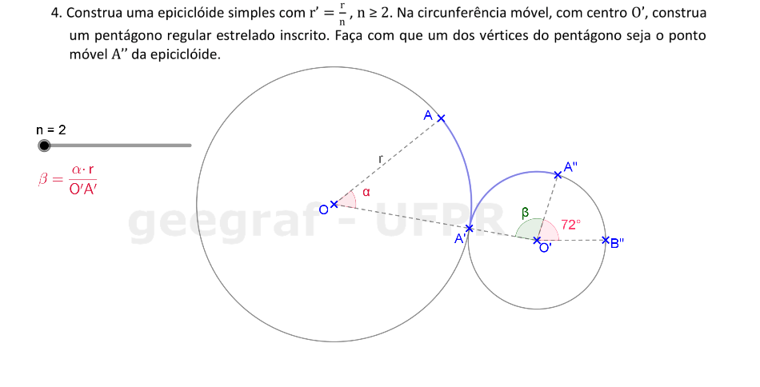
			   <figcaption>Defina o ângulo central do pentágono a partir da extremidade móvel <b>A''</b> da circunferência de centro <b>O'</b>.</figcaption>
		   </li>
		   <li>
			   <input type="radio" id="557" name="sl">
			   <label for="557"></label>
			   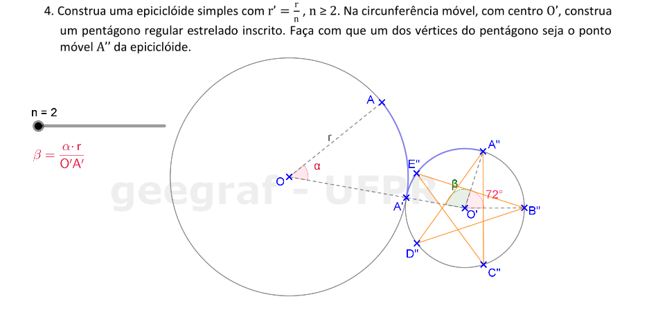
			   <figcaption>Construa os outros vértices e os lados do pentágono regular estrelado.</figcaption>
		   </li>
		   <li>
			   <input type="radio" id="558" name="sl">
			   <label for="558"></label>
			   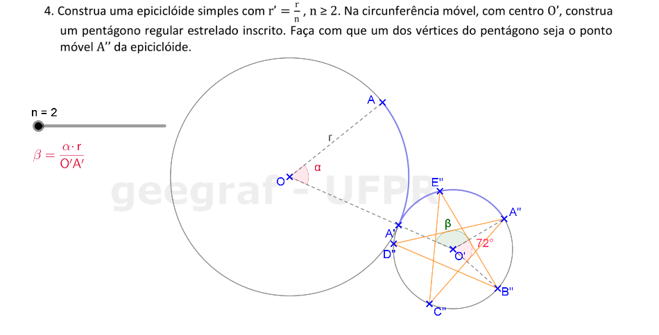
			   <figcaption>Ao movimentar a circunferência, os vértices e lados do pentágono movimentam-se junto. Experimente definir os lugares geométricos dos vértices do pentágono em relação ao ponto <b>A'</b>.</figcaption>
		   </li>
		</ul>
		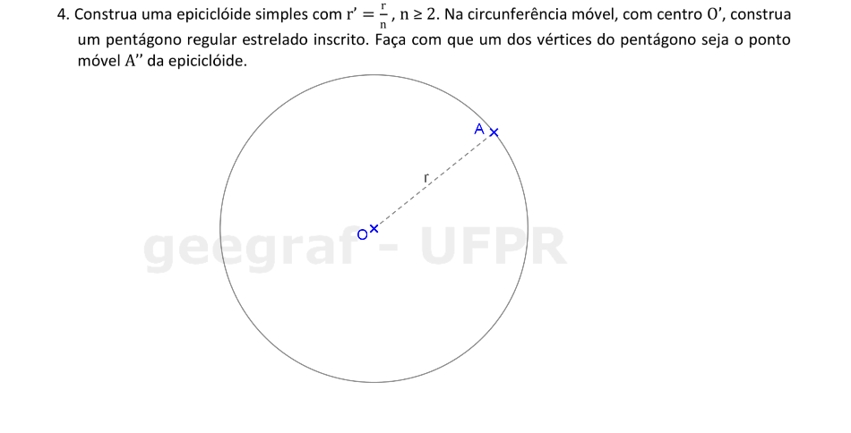
  

   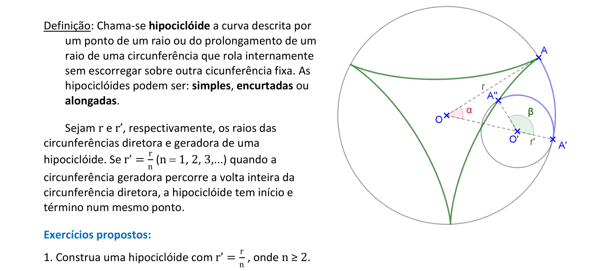
   

&#x1f4cf; &#x1f4d0; Resolução

	
Vamos construir uma hipociclóide usando rotações.

	  <ul class="slider">
		   <li>
			   <input type="radio" id="559" name="sl">
			   <label for="559"></label>
			   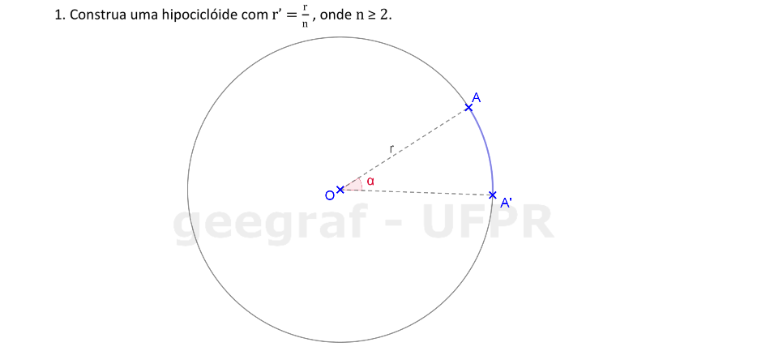
			   <figcaption>Começamos com a definição de um ângulo central qualquer <b>AÔA' = &alpha;</b> na circunferência de centro <b>O</b> e raio <b>OA = r</b>.</figcaption>
		   </li>
		   <li>
			   <input type="radio" id="560" name="sl">
			   <label for="560"></label>
			   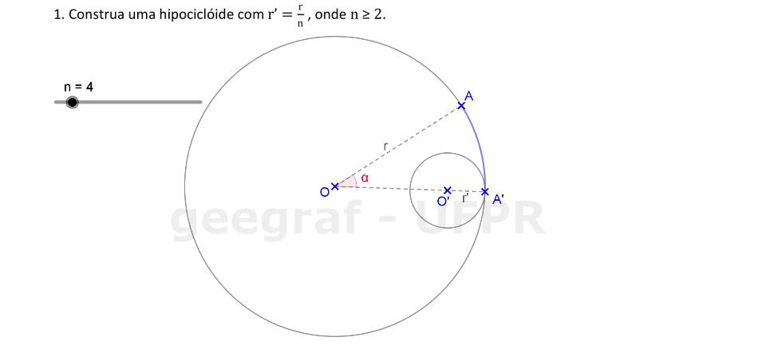
			   <figcaption>Defina o número <b>n &ge; 2</b> e a circunferência de centro <b>O'</b>, tangente interna à circunferência de centro <b>O</b> no ponto <b>A'</b>. O raio da circunferência de centro <b>O'</b> mede $\mathsf{ r' = { {r} \over {n} } = { {OA} \over {n} } }$.</figcaption>
		   </li>
		   <li>
			   <input type="radio" id="561" name="sl">
			   <label for="561"></label>
			   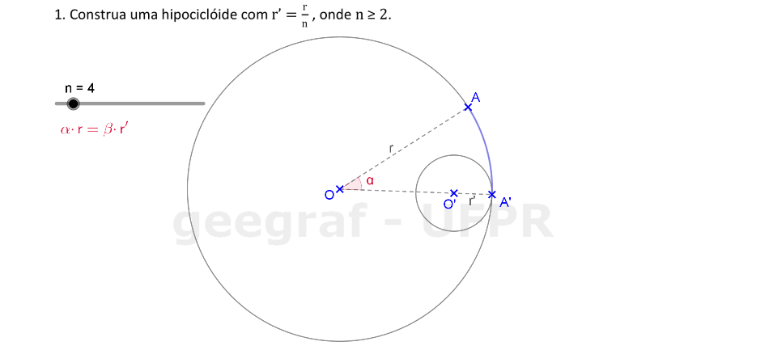
			   <figcaption>Considerando que a hipociclóide começa no ponto <b>A</b>, quando a circunferência menor rolar tangenciando a circunferência maior até o ponto <b>A'</b>, o comprimento do arco <b>AOA'</b> (com amplitude <b>&alpha;</b>) será igual ao comprimento do arco <b>A'O'A''</b> (com amplitude <b>&beta;</b>), ou seja, <b>&alpha;&middot;r = &beta;&middot;r'</b>.</figcaption>
		   </li>
		   <li>
			   <input type="radio" id="562" name="sl">
			   <label for="562"></label>
			   
			   <figcaption>Logo, temos que $\mathsf{ \beta = { {\alpha \cdot r} \over {r'} } }$.</figcaption>
		   </li>
		   <li>
			   <input type="radio" id="563" name="sl">
			   <label for="563"></label>
			   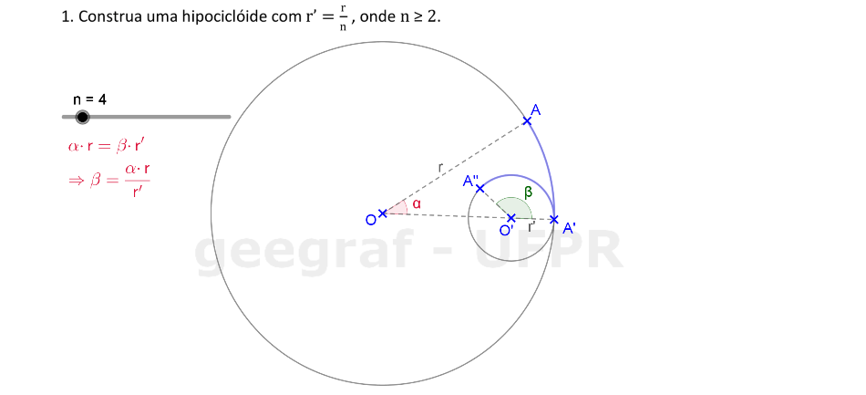
			   <figcaption>Defina o ângulo central com medida paramétrica <b>&beta;</b> na circunferência menor, no sentido anti-horário.</figcaption>
		   </li>
		   <li>
			   <input type="radio" id="564" name="sl">
			   <label for="564"></label>
			   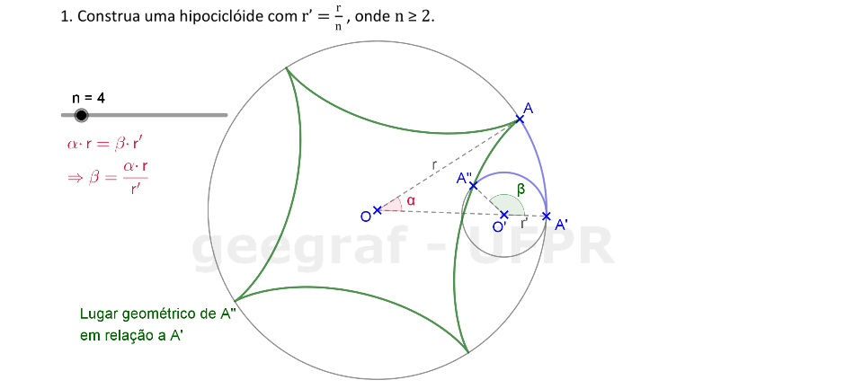
			   <figcaption>A hipociclóide é o lugar geométrico da extremidade do ângulo <b>&beta;</b>, ou seja, do ponto <b>A''</b>, em relação ao ponto <b>A'</b>.</figcaption>
		   </li>
		</ul>
		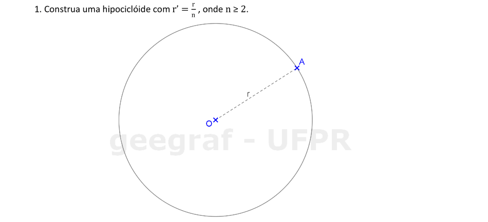
  

   
   

&#x1f4cf; &#x1f4d0; Resolução

	
Vamos construir uma hipociclóide alongada usando rotações.

	  <ul class="slider">
		   <li>
			   <input type="radio" id="565" name="sl">
			   <label for="565"></label>
			   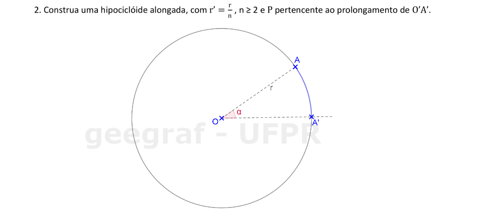
			   <figcaption>Começamos com a definição de um ângulo central qualquer <b>AÔA' = &alpha;</b> na circunferência de centro <b>O</b> e raio <b>OA = r</b>.</figcaption>
		   </li>
		   <li>
			   <input type="radio" id="566" name="sl">
			   <label for="566"></label>
			   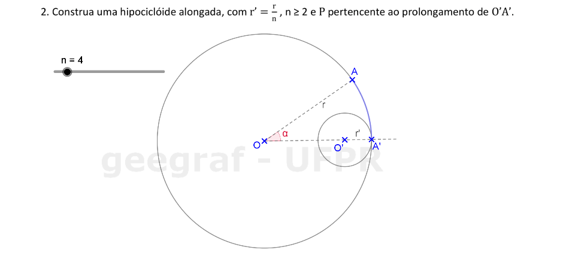
			   <figcaption>Considere o número <b>n &ge; 2</b> e a circunferência de centro <b>O'</b>, tangente à circunferência de centro <b>O</b> no ponto <b>A'</b>. O raio da circunferência de centro <b>O'</b> mede $\mathsf{ r' = { {r} \over {n} } = { {OA} \over {n} } }$.</figcaption>
		   </li>
		   <li>
			   <input type="radio" id="567" name="sl">
			   <label for="567"></label>
			   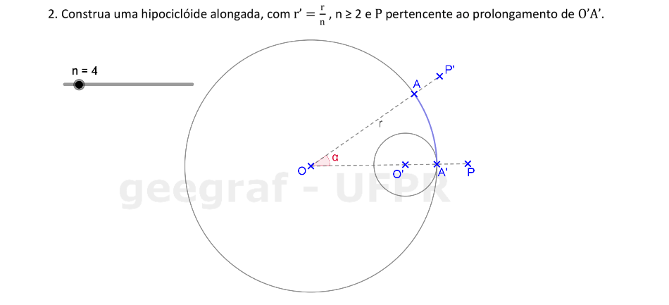
			   <figcaption>Na hipociclóide alongada, a trajetória será de um ponto <b>P</b> pertencente ao prolongamento do raio <b>O'A'</b>.</figcaption>
		   </li>
		   <li>
			   <input type="radio" id="568" name="sl">
			   <label for="568"></label>
			   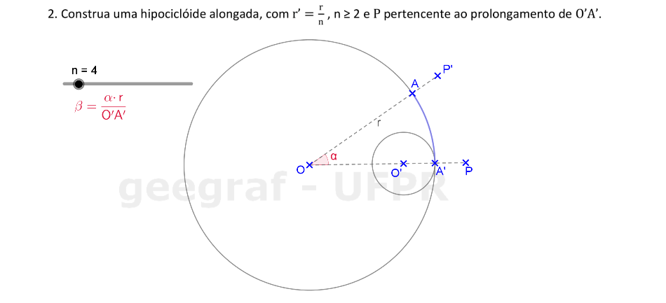
			   <figcaption>O ângulo correspondente da circunferência menor mede $\mathsf{ \beta = { {\alpha \cdot r} \over {O'A'} } }$.</figcaption>
		   </li>
		   <li>
			   <input type="radio" id="569" name="sl">
			   <label for="569"></label>
			   
			   <figcaption>Defina o ângulo central com medida paramétrica <b>PO'P'' = &beta;</b> na circunferência menor.</figcaption>
		   </li>
		   <li>
			   <input type="radio" id="570" name="sl">
			   <label for="570"></label>
			   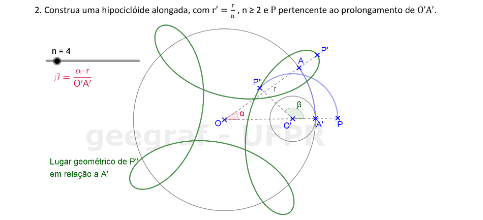
			   <figcaption>A hipociclóide alongada é o lugar geométrico da extremidade do ângulo <b>&beta;</b>, ou seja, do ponto <b>P''</b>, em relação ao ponto <b>A'</b>.</figcaption>
		   </li>
		</ul>
		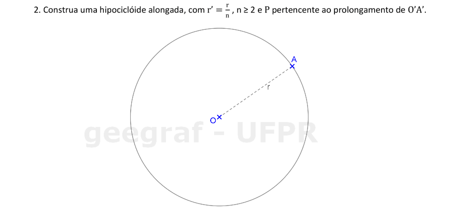
  

   
   

&#x1f4cf; &#x1f4d0; Resolução

	
Vamos construir uma hipociclóide encurtada usando rotações.

	  <ul class="slider">
		   <li>
			   <input type="radio" id="571" name="sl">
			   <label for="571"></label>
			   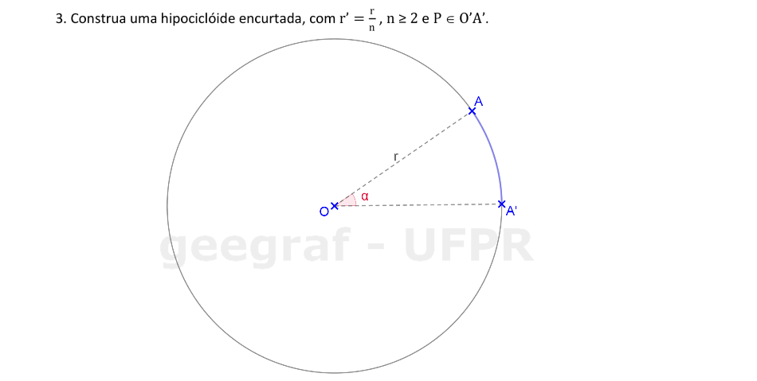
			   <figcaption>Defina um ângulo central qualquer <b>AÔA' = &alpha;</b> na circunferência de centro <b>O</b> e raio <b>OA = r</b>.</figcaption>
		   </li>
		   <li>
			   <input type="radio" id="572" name="sl">
			   <label for="572"></label>
			   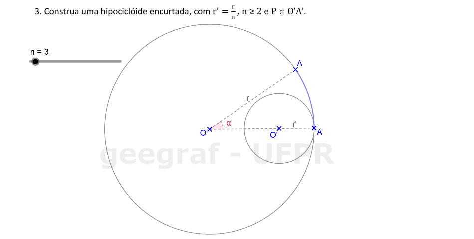
			   <figcaption>Considere o número <b>n &ge; 2</b> e a circunferência de centro <b>O'</b>, tangente à circunferência de centro <b>O</b> no ponto <b>A'</b>. O raio da circunferência de centro <b>O'</b> mede $\mathsf{ r' = { {r} \over {n} } = { {OA} \over {n} } }$.</figcaption>
		   </li>
		   <li>
			   <input type="radio" id="573" name="sl">
			   <label for="573"></label>
			   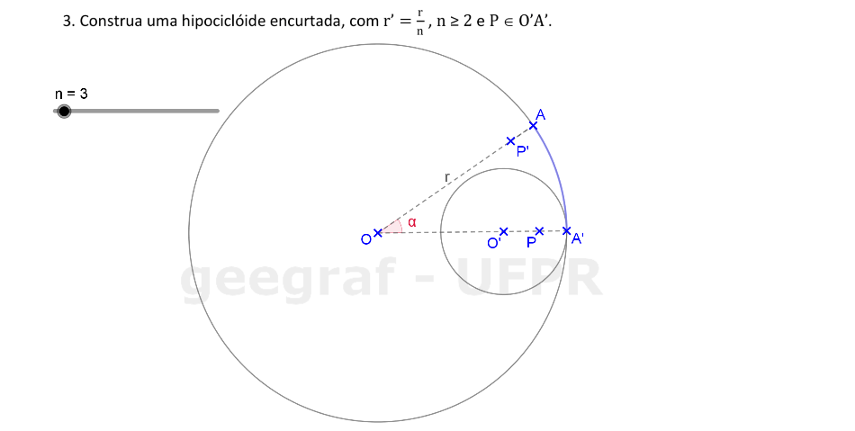
			   <figcaption>Na hipociclóide encurtada, a trajetória será de um ponto <b>P</b> pertencente ao raio <b>O'A'</b>.</figcaption>
		   </li>
		   <li>
			   <input type="radio" id="574" name="sl">
			   <label for="574"></label>
			   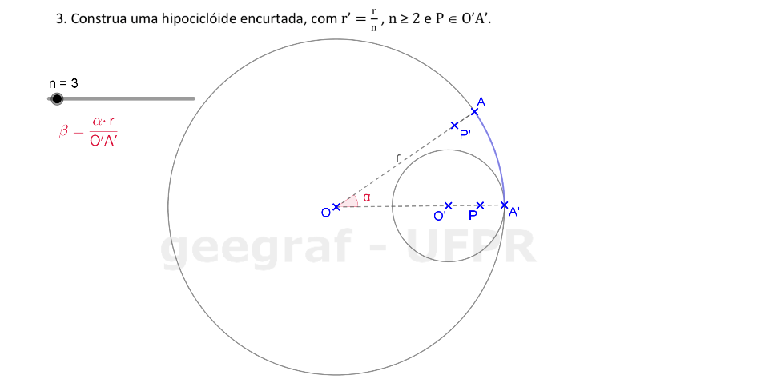
			   <figcaption>O ângulo correspondente da circunferência menor mede $\mathsf{ \beta = { {\alpha \cdot r} \over {O'A'} } }$.</figcaption>
		   </li>
		   <li>
			   <input type="radio" id="575" name="sl">
			   <label for="575"></label>
			   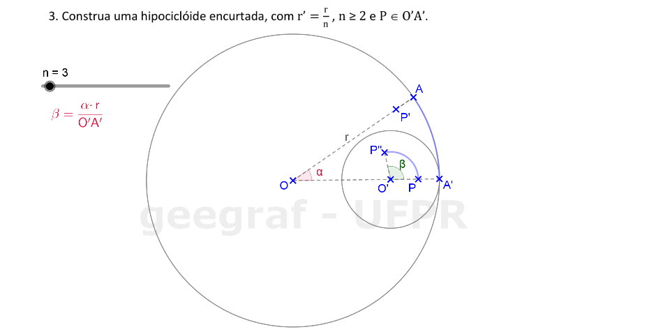
			   <figcaption>Defina o ângulo central com medida paramétrica <b>PO'P'' = &beta;</b> na circunferência menor.</figcaption>
		   </li>
		   <li>
			   <input type="radio" id="576" name="sl">
			   <label for="576"></label>
			   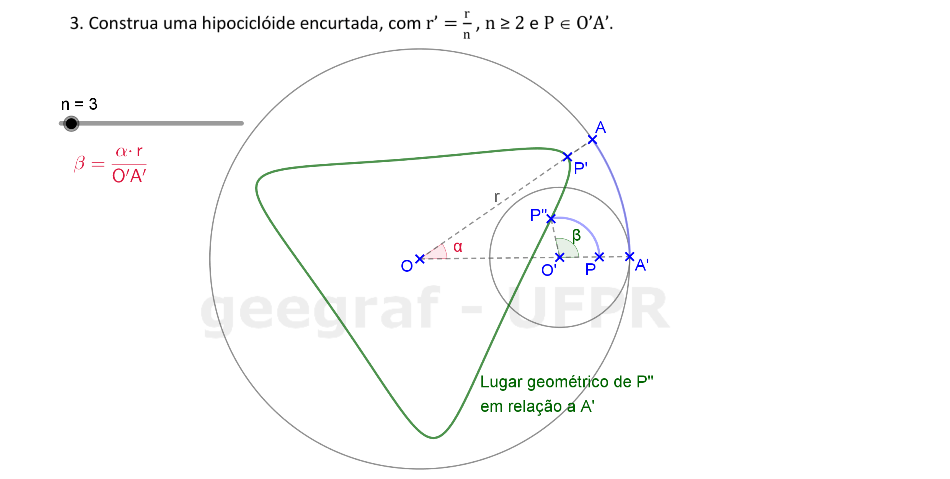
			   <figcaption>A hipociclóide encurtada é o lugar geométrico da extremidade do ângulo <b>&beta;</b>, ou seja, do ponto <b>P''</b>, em relação ao ponto <b>A'</b>.</figcaption>
		   </li>
		</ul>
		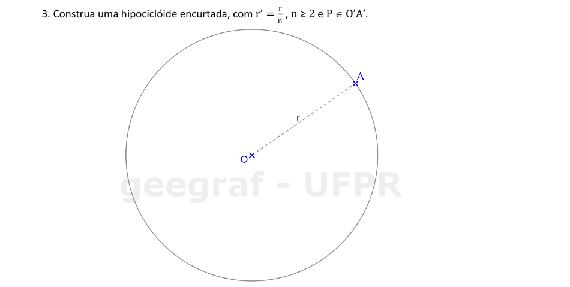
  

   
   
&#x1f4cf; &#x1f4d0; Exercício proposto 4.4

   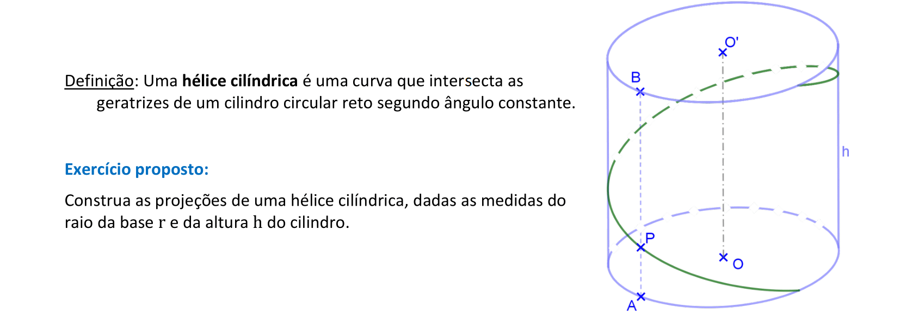
   

&#x1f4cf; &#x1f4d0; Resolução

	
Vamos construir as projeções frontal e superior de uma hélice cilíndrica usando rotações.

	  <ul class="slider">
		   <li>
			   <input type="radio" id="577" name="sl">
			   <label for="577"></label>
			   
			   <figcaption>Defina a projeção superior do cilindro: uma circunferência de centro <b>O</b> e raio <b>r = OA'</b>. Escolha um ponto <b>P</b> qualquer desta circunferência.</figcaption>
		   </li>
		   <li>
			   <input type="radio" id="578" name="sl">
			   <label for="578"></label>
			   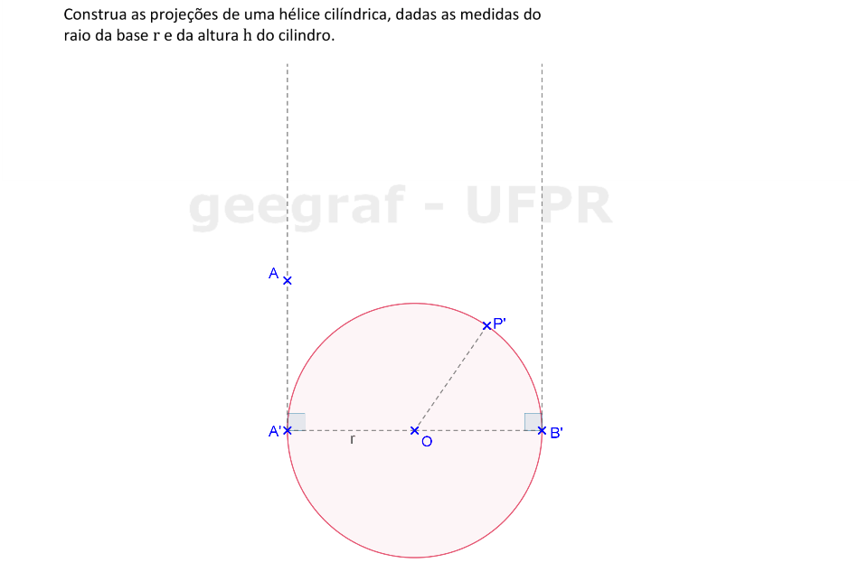
			   <figcaption>Construa as retas tangentes à circunferência nas extremidades do diâmetro <b>A'B'</b>. Escolha um ponto <b>A</b> em uma das retas construídas.</figcaption>
		   </li>
		   <li>
			   <input type="radio" id="579" name="sl">
			   <label for="579"></label>
			   
			   <figcaption>Construa o segmento <b>AB // A'B'</b>.</figcaption>
		   </li>
		   <li>
			   <input type="radio" id="580" name="sl">
			   <label for="580"></label>
			   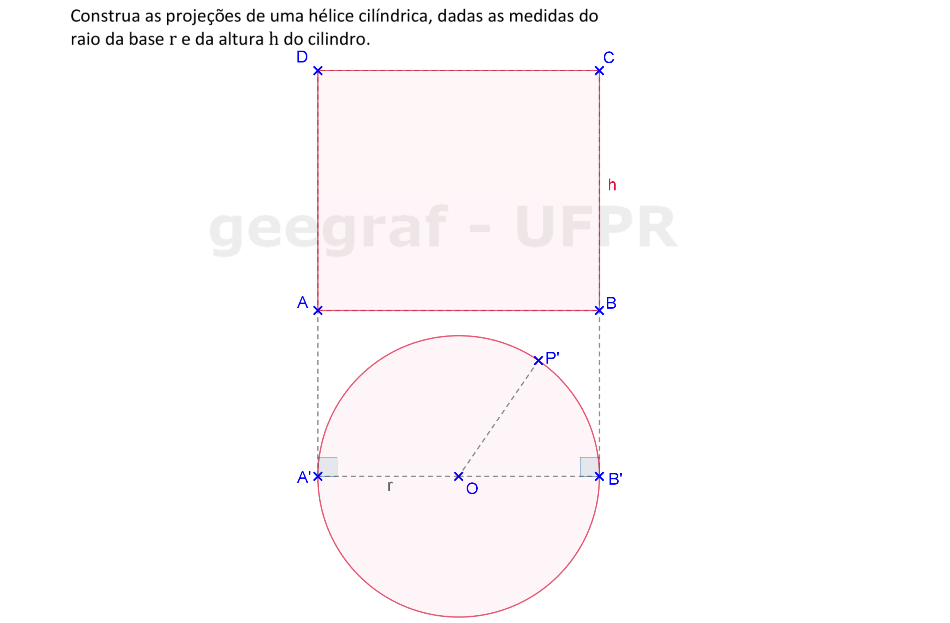
			   <figcaption>A projeção frontal do cilindro é o retângulo <b>ABCD</b> com o segmento <b>AB</b> igual ao diâmetro da base e <b>BC = h</b> com a medida da altura do cilindro.</figcaption>
		   </li>
		   <li>
			   <input type="radio" id="581" name="sl">
			   <label for="581"></label>
			   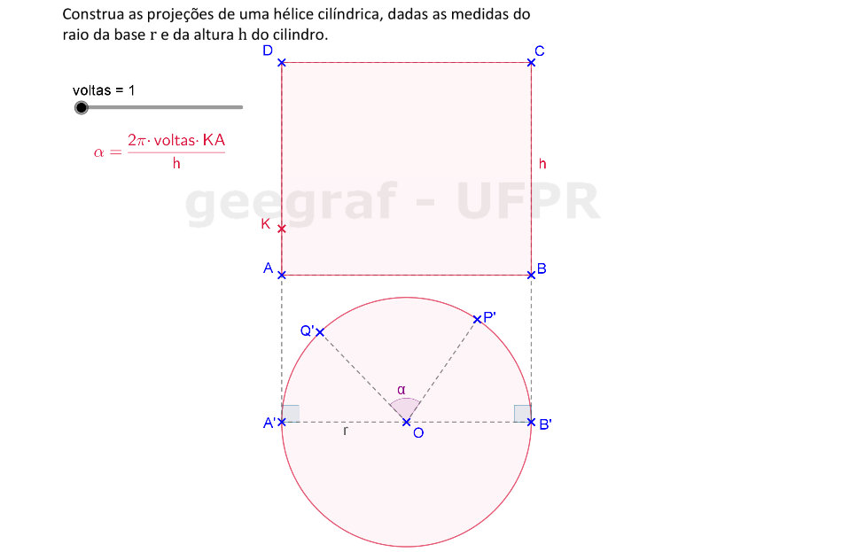
			   <figcaption>Considere um número chamado <b>voltas</b>, que será usado para controlar o número de voltas da hélice. Considere o ponto <b>K &isin; AD</b>. Usando uma regra de três, temos que o segmento <b>KA</b> corresponde à altura relativa que define a medida do ângulo central da base <b>&alpha;</b> por meio da seguinte expressão: $\mathsf{ \alpha = { {2\pi \cdot voltas \cdot KA} \over {h} } }$.</figcaption>
		   </li>
		   <li>
			   <input type="radio" id="582" name="sl">
			   <label for="582"></label>
			   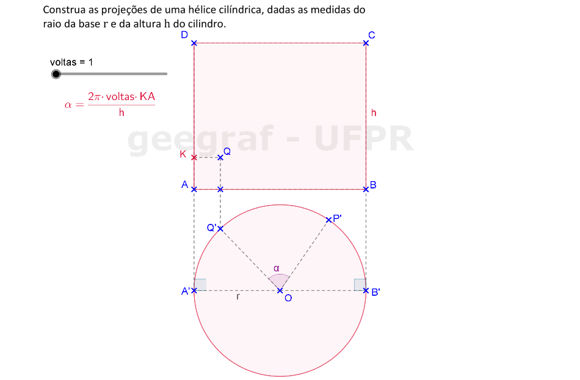
			   <figcaption>Defina o ângulo central paramétrico <b>&alpha; = P'OQ'</b> no sentido anti-horário. Construindo o segmento <b>QQ'</b> tal que <b>QQ' // AD</b> e <b>KQ // A'B'</b>, temos o ponto correspondente <b>Q'</b> da projeção superior da rotação de ângulo <b>&alpha;</b> da hélice cilíndrica, e <b>Q</b> será a projeção frontal deste mesmo ponto <b>Q'</b>.</figcaption>
		   </li>
		   <li>
			   <input type="radio" id="583" name="sl">
			   <label for="583"></label>
			   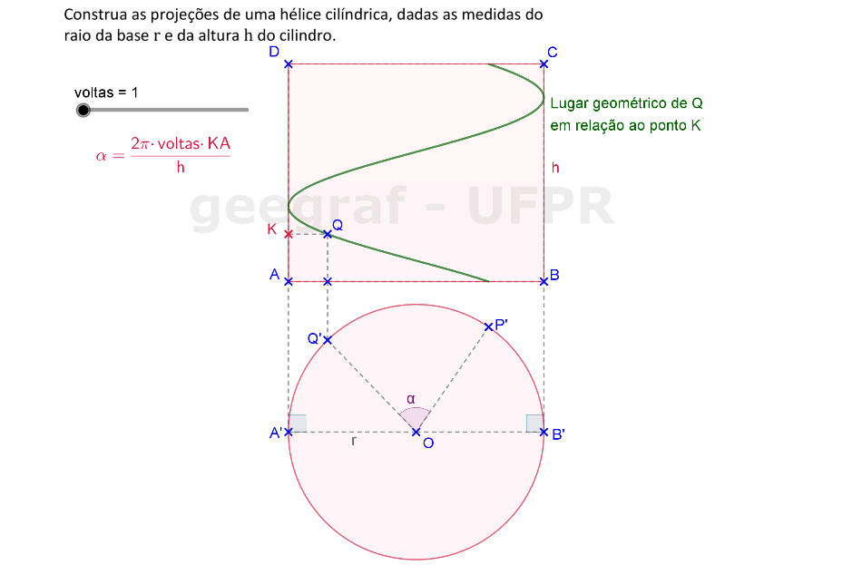
			   <figcaption>A projeção frontal da hélice cilíndrica é o lugar geométrico do ponto <b>Q</b> em relação ao ponto <b>K</b>. A projeção superior é a própria circunferência que define a base do cilindro.</figcaption>
		   </li>
		   <li>
			   <input type="radio" id="584" name="sl">
			   <label for="584"></label>
			   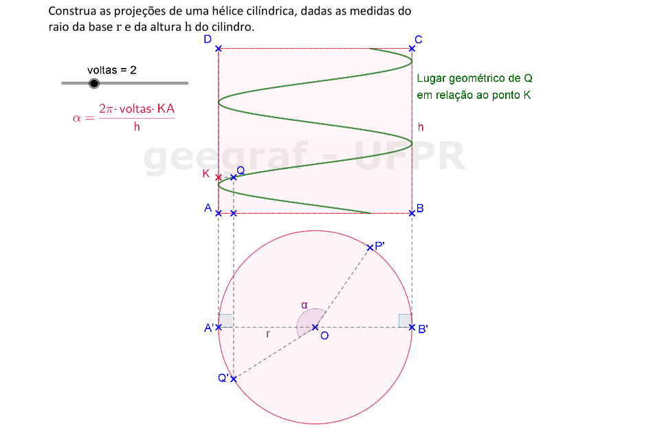
			   <figcaption>Modificando o valor do número <b>voltas</b>, temos outras hélices. Podemos modificar também a posição do ponto <b>P'</b>, que define o início das projeções da curva.</figcaption>
		   </li>
		</ul>
		
  

   
<a href="#modulo4" class="topo">voltar ao topo</a>

   
   

&#x1f4cf; &#x1f4d0; Resolução

	
Vamos construir as projeções frontal e superior de uma hélice cônica usando rotações.

	  <ul class="slider">
		   <li>
			   <input type="radio" id="585" name="sl">
			   <label for="585"></label>
			   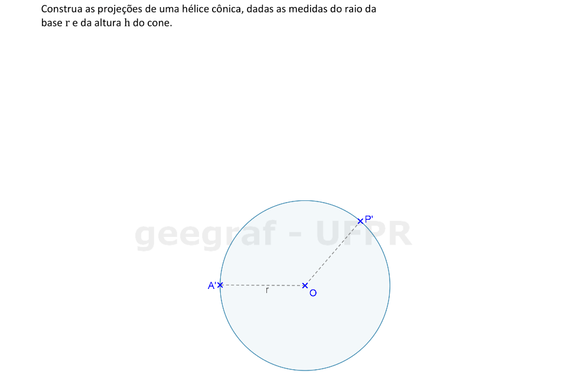
			   <figcaption>Defina a projeção superior do cone: uma circunferência de centro <b>O</b> e raio <b>r = OA'</b>. Escolha um ponto <b>P</b> qualquer desta circunferência.</figcaption>
		   </li>
		   <li>
			   <input type="radio" id="586" name="sl">
			   <label for="586"></label>
			   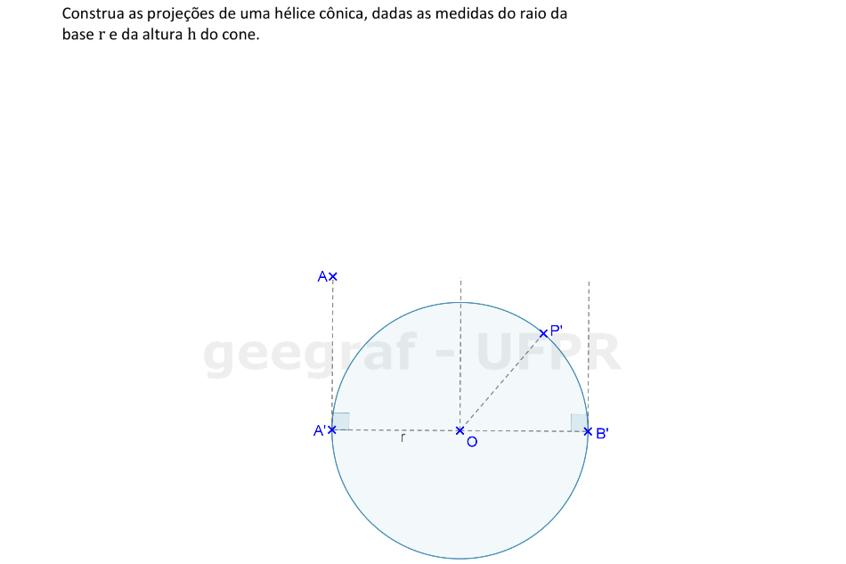
			   <figcaption>Construa as retas tangentes à circunferência nas extremidades do diâmetro <b>A'B'</b>. Escolha um ponto <b>A</b> em uma das retas construídas.</figcaption>
		   </li>
		   <li>
			   <input type="radio" id="587" name="sl">
			   <label for="587"></label>
			   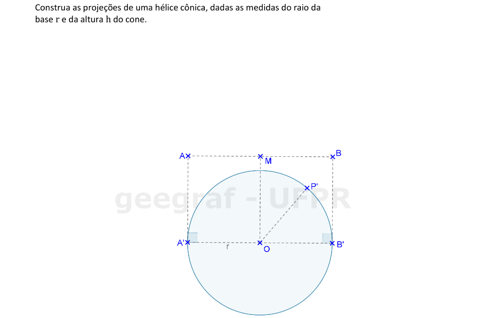
			   <figcaption>Construa o segmento <b>AB // A'B'</b>.</figcaption>
		   </li>
		   <li>
			   <input type="radio" id="588" name="sl">
			   <label for="588"></label>
			   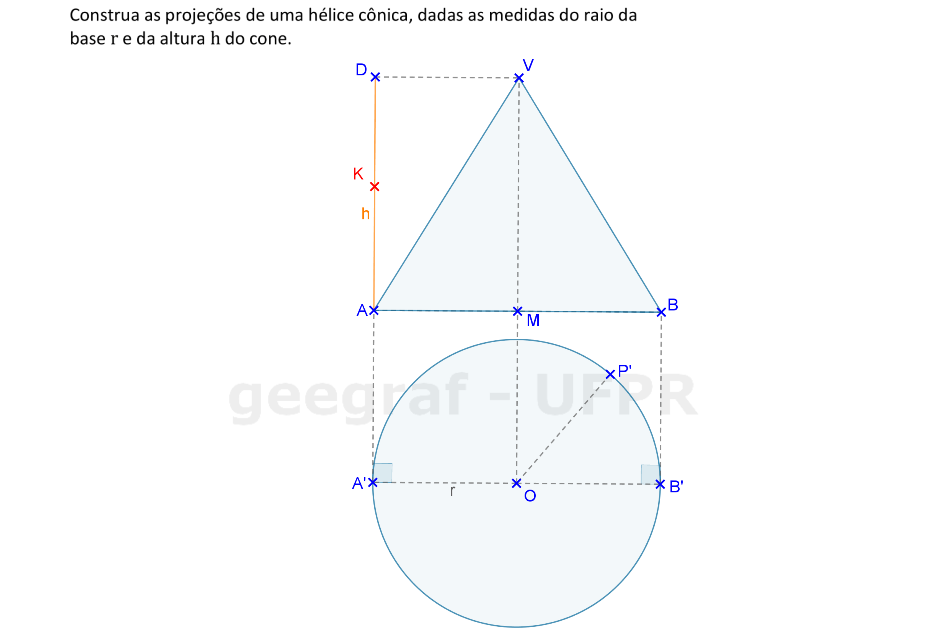
			   <figcaption>A projeção frontal do cone é o triângulo isósceles <b>VAB</b> com o segmento <b>AB</b> igual ao diâmetro da base e <b>VM = AD = h</b> com a medida da altura do cone.</figcaption>
		   </li>
		   <li>
			   <input type="radio" id="589" name="sl">
			   <label for="589"></label>
			   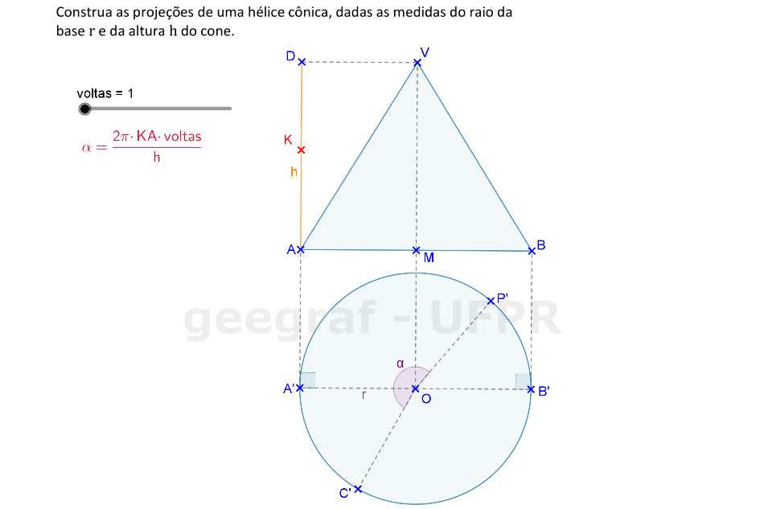
			   <figcaption>Considere um número chamado <b>voltas</b>, que será usado para controlar o número de voltas da hélice. Considere o ponto <b>K &isin; AD</b>. Usando uma regra de três, temos que o segmento <b>KA</b> corresponde à altura relativa que define a medida do ângulo central da base <b>&alpha;</b> por meio da seguinte expressão: $\mathsf{ \alpha = { {2\pi \cdot voltas \cdot KA} \over {h} } }$.</figcaption>
		   </li>
		   <li>
			   <input type="radio" id="590" name="sl">
			   <label for="590"></label>
			   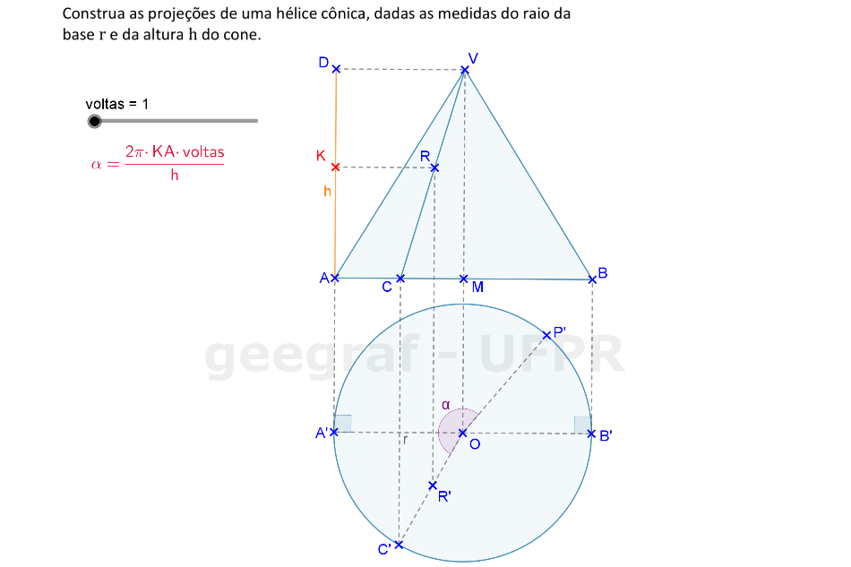
			   <figcaption>Defina o ângulo central paramétrico <b>&alpha; = P'OC'</b> no sentido anti-horário. Defina a projeção frontal de <b>C'</b> tal que <b>CC' // AD</b> e <b>C &isin; AB</b>. Logo, temos a geratriz <b>VC</b> com sua projeção superior <b>OC'</b>. Obtenha as projeções do ponto <b>R &isin; VC</b>, tal que <b>KR // AB</b>, <b>RR' // AD</b> e <b>R' &isin; OC'</b>.</figcaption>
		   </li>
		   <li>
			   <input type="radio" id="591" name="sl">
			   <label for="591"></label>
			   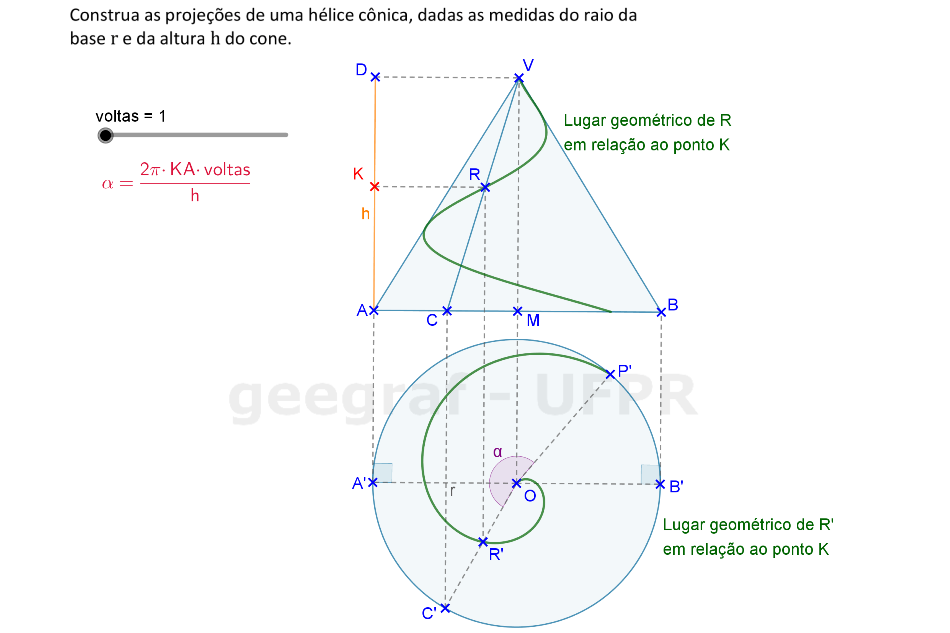
			   <figcaption>As projeções frontal e superior da hélice cônica são os lugares geométricos dos pontos <b>R</b> e <b>R'</b> em relação ao ponto <b>K</b>.</figcaption>
		   </li>
		   <li>
			   <input type="radio" id="592" name="sl">
			   <label for="592"></label>
			   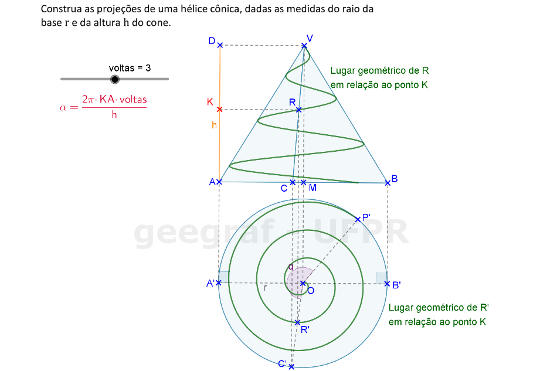
			   <figcaption>Modificando o valor do número <b>voltas</b>, temos outras hélices. Podemos modificar também a posição do ponto <b>P'</b>, que define o início das projeções da curva.</figcaption>
		   </li>
		</ul>
		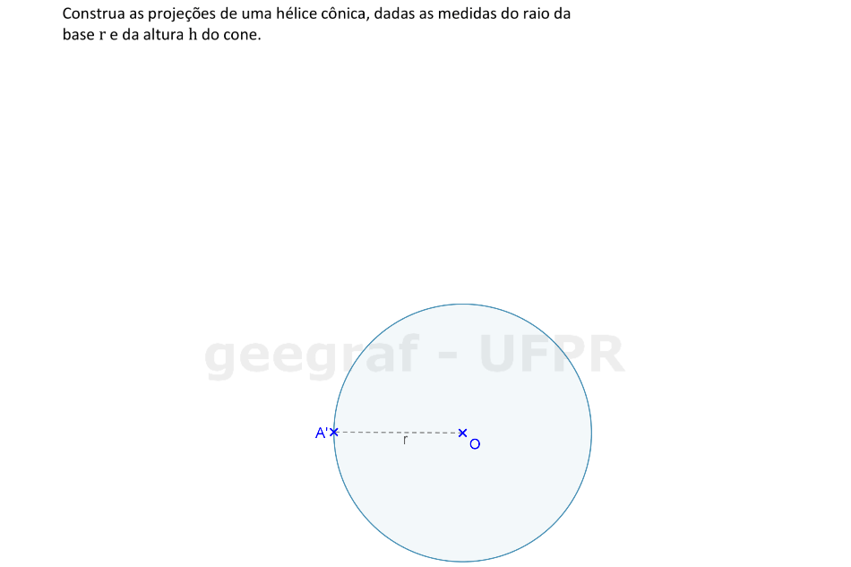
  

   
<a href="#modulo4" class="topo">voltar ao topo</a>

5. Translação, Inversão e curvas

  
Material da página 52 até a página 65.

   
   
<a href="#modulo5" class="topo">voltar ao topo</a>

   
   

&#x1f4cf; &#x1f4d0; Resolução

	
Vamos construir o trapézio <b>ABCD</b>, dadas as medidas dos lados.

	  <ul class="slider">
		   <li>
			   <input type="radio" id="593" name="sl">
			   <label for="593"></label>
			   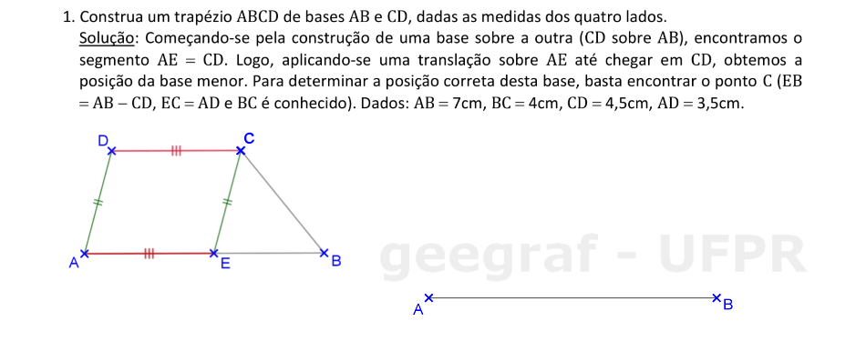
			   <figcaption>Começamos pela base maior <b>AB</b>.</figcaption>
		   </li>
		   <li>
			   <input type="radio" id="594" name="sl">
			   <label for="594"></label>
			   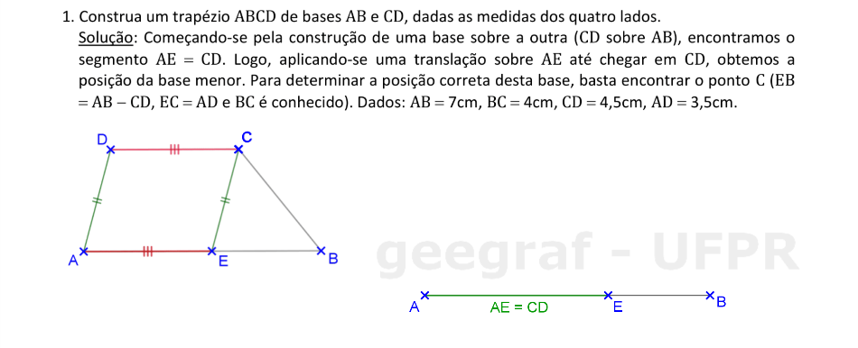
			   <figcaption>Fazendo a translação da base menor <b>CD</b> sobre a base maior com amplitude <b>AD</b>, definimos o segmento <b>AE = CD</b> sobre a base <b>AB</b>.</figcaption>
		   </li>
		   <li>
			   <input type="radio" id="595" name="sl">
			   <label for="595"></label>
			   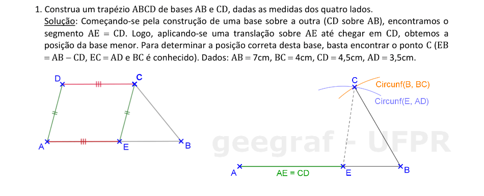
			   <figcaption>Logo, temos o paralelogramo <b>AECD</b> que define o segmento <b>EC = AD</b>. Construa as circunferências de centros em <b>E</b> e <b>B</b>, com raios <b>AD</b> e <b>BC</b>. Assim, encontramos o vértice <b>C</b>.</figcaption>
		   </li>
		   <li>
			   <input type="radio" id="596" name="sl">
			   <label for="596"></label>
			   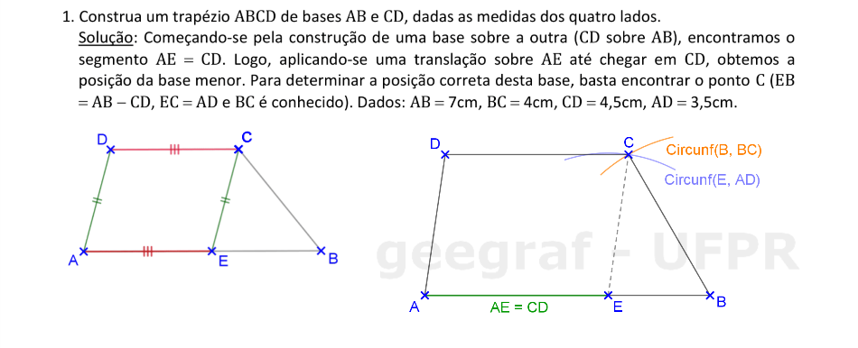
			   <figcaption>Para finalizar o trapézio, basta construir os segmentos <b>CD // AB</b> e <b>AD // EC</b>.</figcaption>
		   </li>
		</ul>
		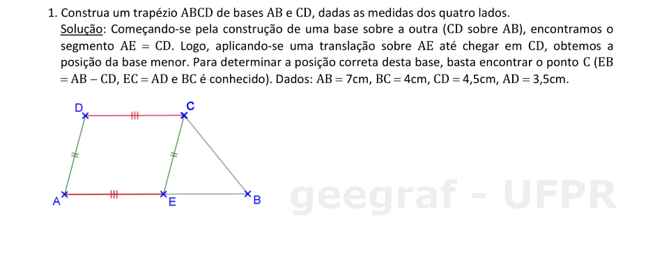
  

   
   

&#x1f4cf; &#x1f4d0; Resolução

	
Vamos construir o trapézio <b>ABCD</b>, dadas as medidas das bases e das diagonais.

	  <ul class="slider">
		   <li>
			   <input type="radio" id="597" name="sl">
			   <label for="597"></label>
			   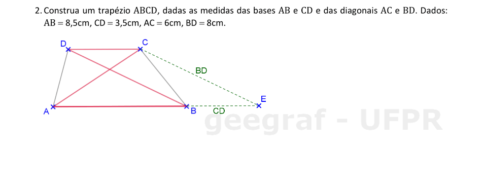
			   <figcaption>Podemos fazer a translação da base menor com amplitude igual à medida de uma diagonal: <b>BD</b>. Assim, encontramos o ponto <b>E &isin; AB</b>, tal que <b>BE = CD</b>.</figcaption>
		   </li>
		   <li>
			   <input type="radio" id="598" name="sl">
			   <label for="598"></label>
			   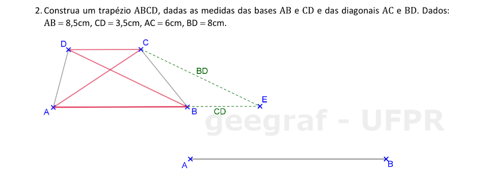
			   <figcaption>Começamos com a base maior <b>AB</b>...</figcaption>
		   </li>
		   <li>
			   <input type="radio" id="599" name="sl">
			   <label for="599"></label>
			   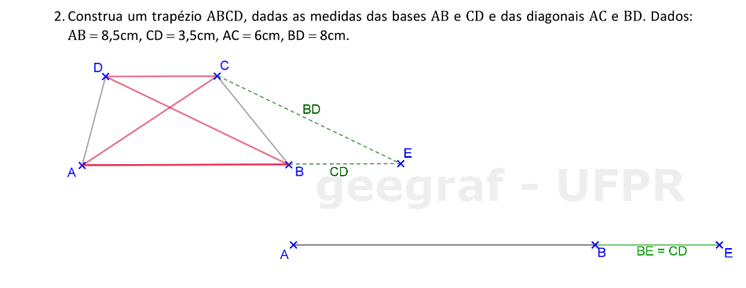
			   <figcaption>... e construímos o segmento <b>BE = CD</b>.</figcaption>
		   </li>
		   <li>
			   <input type="radio" id="600" name="sl">
			   <label for="600"></label>
			   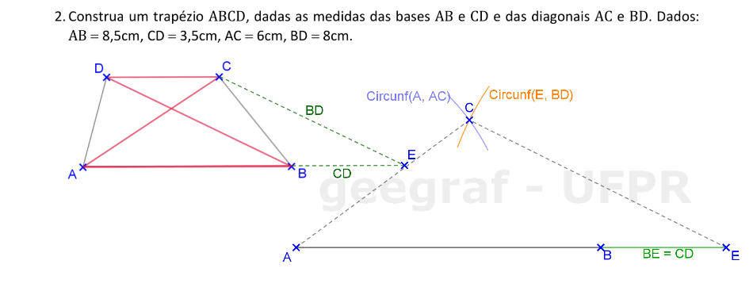
			   <figcaption>Logo, temos o paralelogramo <b>BECD</b> que define o segmento <b>EC = BD</b>. Construa as circunferências de centros em <b>E</b> e <b>A</b>, com raios <b>BD</b> e <b>AC</b>. Assim, encontramos o vértice <b>C</b>.</figcaption>
		   </li>
		   <li>
			   <input type="radio" id="601" name="sl">
			   <label for="601"></label>
			   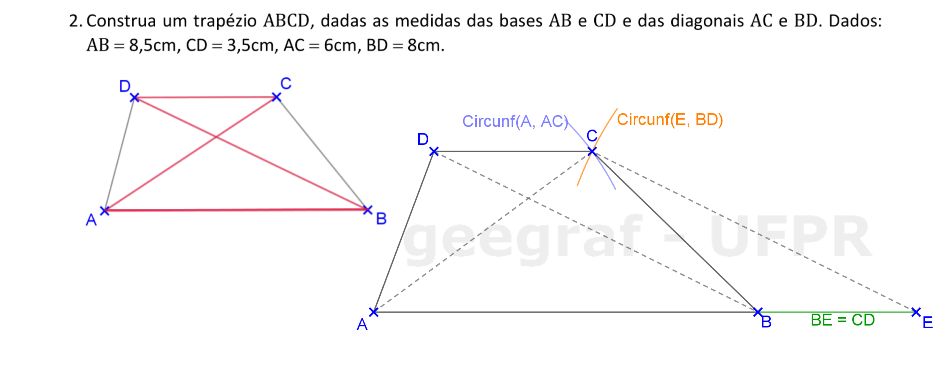
			   <figcaption>Para finalizar o trapézio, basta construir os segmentos <b>CD // AB</b> e <b>BD // EC</b>.</figcaption>
		   </li>
		</ul>
		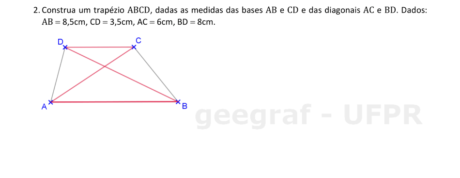
  

   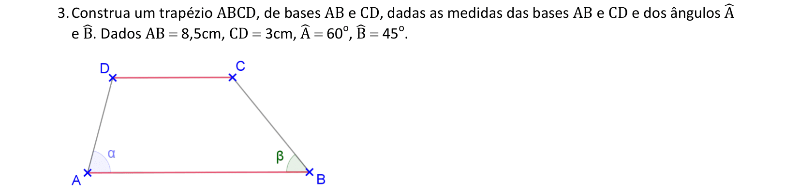
   

&#x1f4cf; &#x1f4d0; Resolução

	
Vamos construir o trapézio <b>ABCD</b>, dadas as medidas das bases e de dois ângulos.

	  <ul class="slider">
		   <li>
			   <input type="radio" id="602" name="sl">
			   <label for="602"></label>
			   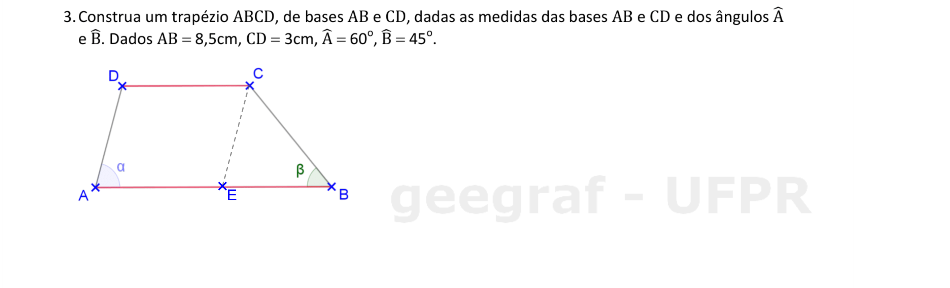
			   <figcaption>Podemos fazer a translação da base menor com amplitude igual à medida de uma diagonal: <b>AD</b>. Assim, encontramos o ponto <b>E &isin; AB</b>, tal que <b>AE = CD</b>.</figcaption>
		   </li>
		   <li>
			   <input type="radio" id="603" name="sl">
			   <label for="603"></label>
			   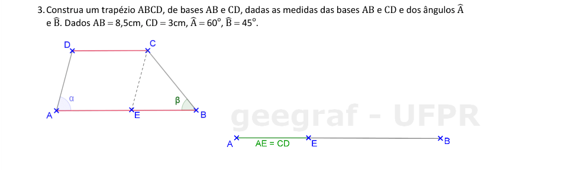
			   <figcaption>Começamos com a base maior <b>AB</b> e construímos o segmento <b>AE = CD</b>.</figcaption>
		   </li>
		   <li>
			   <input type="radio" id="604" name="sl">
			   <label for="604"></label>
			   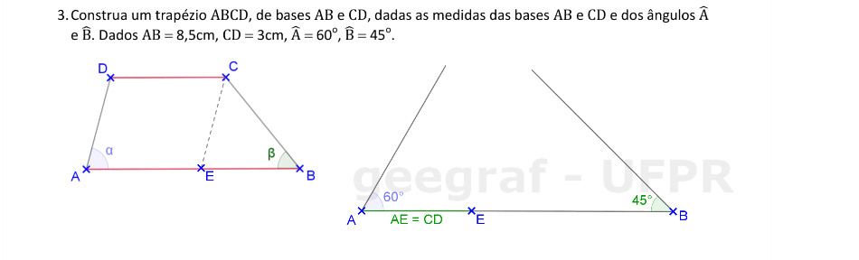
			   <figcaption>Construa os ângulos dos vértices <b>A</b> e <b>B</b>, encontrando as retas suporte das laterais do trapézio.</figcaption>
		   </li>
		   <li>
			   <input type="radio" id="605" name="sl">
			   <label for="605"></label>
			   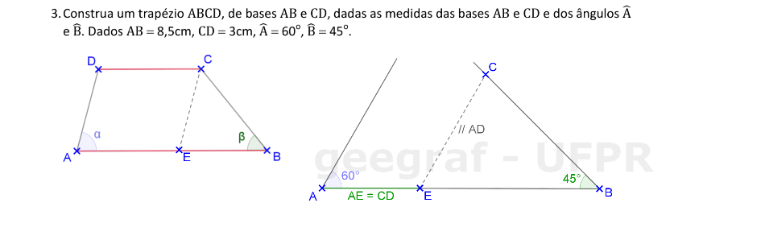
			   <figcaption>Construa a reta paralela à direção da lateral <b>AD</b> que passa por <b>E</b>. Assim, encontramos o vértice <b>C</b> na interseção da reta suporte do lado <b>BC</b>.</figcaption>
		   </li>
		   <li>
			   <input type="radio" id="606" name="sl">
			   <label for="606"></label>
			   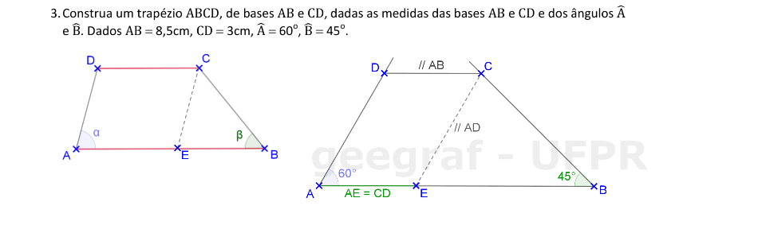
			   <figcaption>Para finalizar o trapézio, basta construir o segmento <b>CD // AB</b>.</figcaption>
		   </li>
		</ul>
		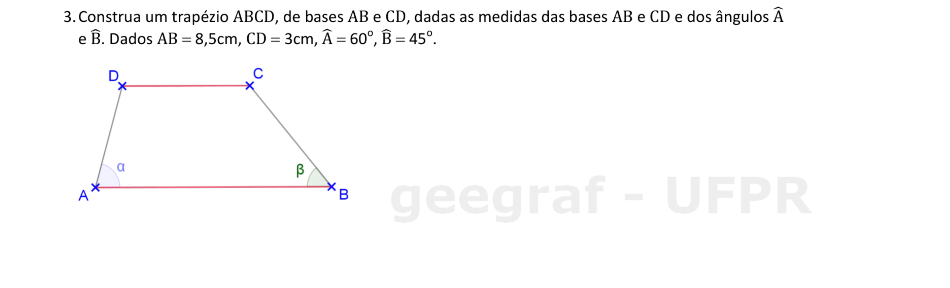
  

   
<a href="#modulo5" class="topo">voltar ao topo</a>

   
   

&#x1f4cf; &#x1f4d0; Resolução

	
Vamos usar a translação para determinar os pontos <b>P</b> e <b>Q</b> das circunferências dadas, tal que o segmento <b>PQ</b> passa por <b>C</b> e <b>PQ = 2m</b>.

	  <ul class="slider">
		   <li>
			   <input type="radio" id="607" name="sl">
			   <label for="607"></label>
			   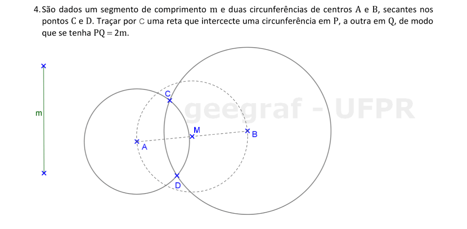
			   <figcaption>Construa o arco capaz de 90&deg; no segmento <b>AB</b>.</figcaption>
		   </li>
		   <li>
			   <input type="radio" id="608" name="sl">
			   <label for="608"></label>
			   
			   <figcaption>O segmento <b>PQ</b> deve passar pelo ponto <b>C</b>: logo, defina o segmento <b>AQ' = m</b>, tal que <b>Q'</b> esteja no arco capaz de 90&deg; mais próximo de <b>C</b>.</figcaption>
		   </li>
		   <li>
			   <input type="radio" id="609" name="sl">
			   <label for="609"></label>
			   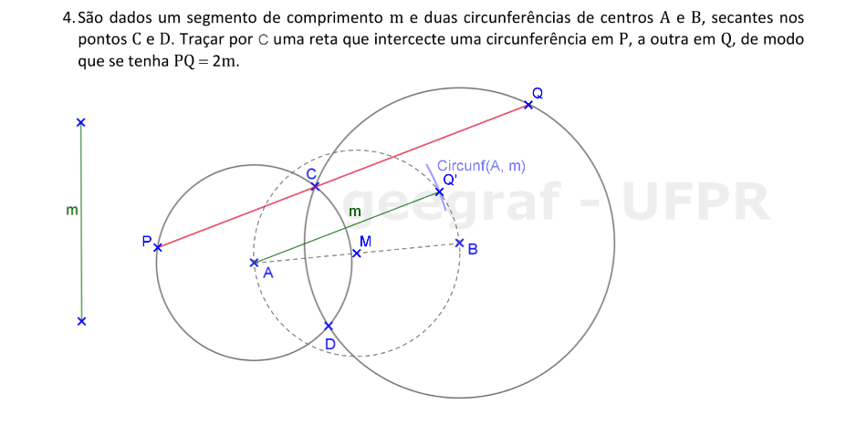
			   <figcaption>O segmento procurado <b>PQ</b> é paralelo ao segmento <b>AQ'</b> e passa por <b>C</b>.</figcaption>
		   </li>
		   <li>
			   <input type="radio" id="610" name="sl">
			   <label for="610"></label>
			   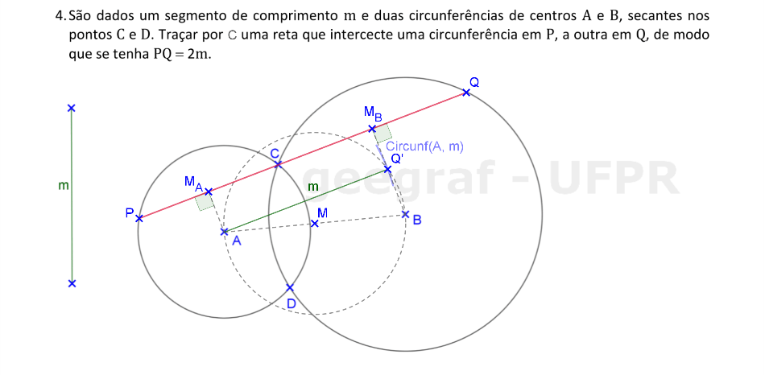
			   <figcaption>A justificativa para esta construção está na construção do arco capaz de 90&deg;, que define o segmento <b>MAMB</b> transladado de <b>AQ' = m</b>. Temos que <b>PMA = CMA</b> e <b>QMB = CMB</b>, ou seja, <b>PQ = 2m</b>.</figcaption>
		   </li>
		</ul>
		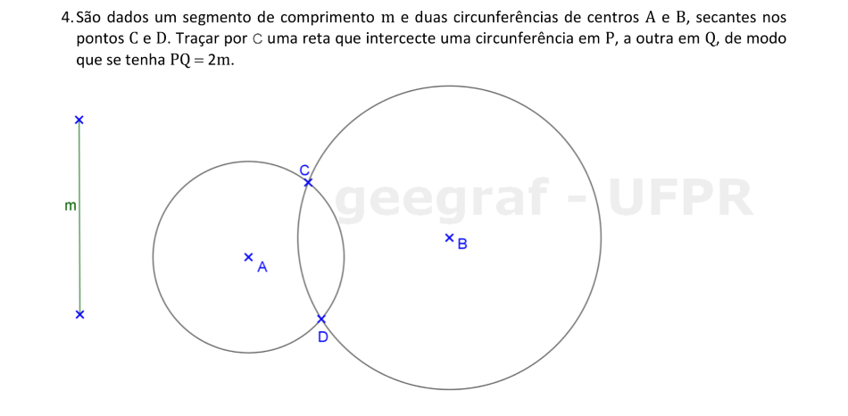
  

   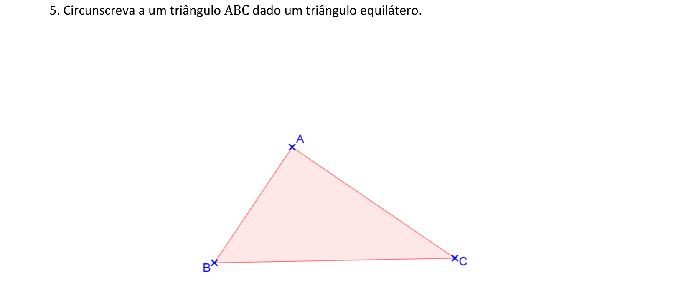
   

&#x1f4cf; &#x1f4d0; Resolução

	
Vamos usar a translação para circunscrever um triângulo equilátero no triângulo <b>&#9651;ABC</b>.

	  <ul class="slider">
		   <li>
			   <input type="radio" id="611" name="sl">
			   <label for="611"></label>
			   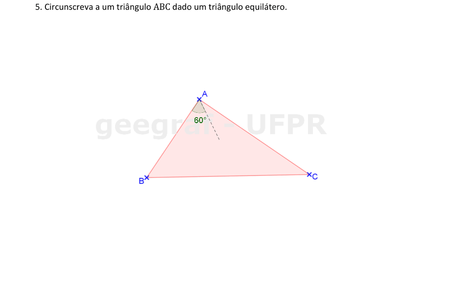
			   <figcaption>Vamos construir arcos capazes de 60&deg; em dois lados do <b>&#9651;ABC</b>. Começando pelo lado <b>AB</b>, construa o ângulo de segmento de 60&deg; com vértice <b>A</b>.</figcaption>
		   </li>
		   <li>
			   <input type="radio" id="612" name="sl">
			   <label for="612"></label>
			   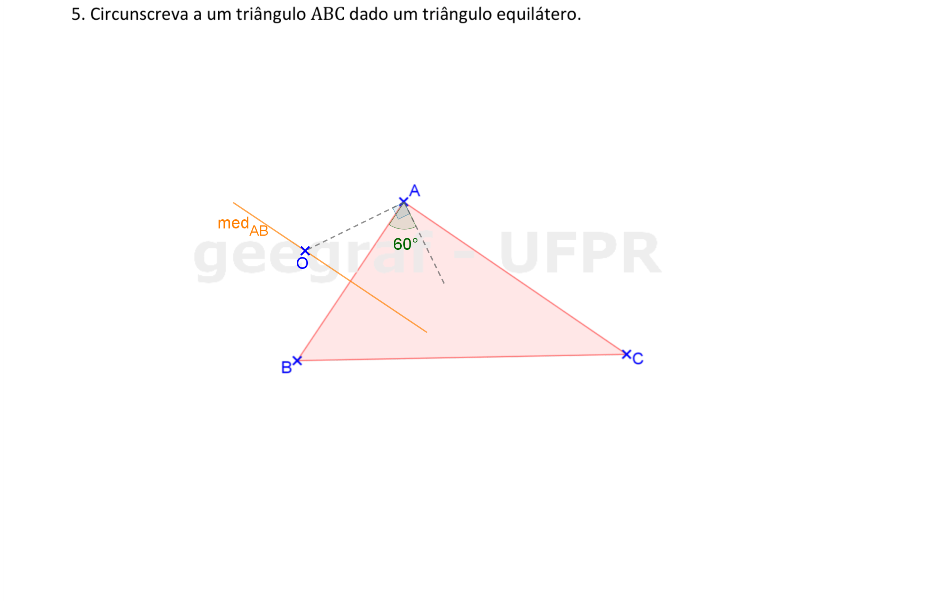
			   <figcaption>Encontre a mediatriz do lado <b>AB</b>. O centro <b>O</b> do arco capaz de 60&deg; está na interseção da mediatriz do lado <b>AB</b> com o segmento perpendicular à reta suporte do ângulo de segmento construído.</figcaption>
		   </li>
		   <li>
			   <input type="radio" id="613" name="sl">
			   <label for="613"></label>
			   
			   <figcaption>Construa o arco capaz de centro <b>O</b> e raio <b>OA = OB</b>.</figcaption>
		   </li>
		   <li>
			   <input type="radio" id="614" name="sl">
			   <label for="614"></label>
			   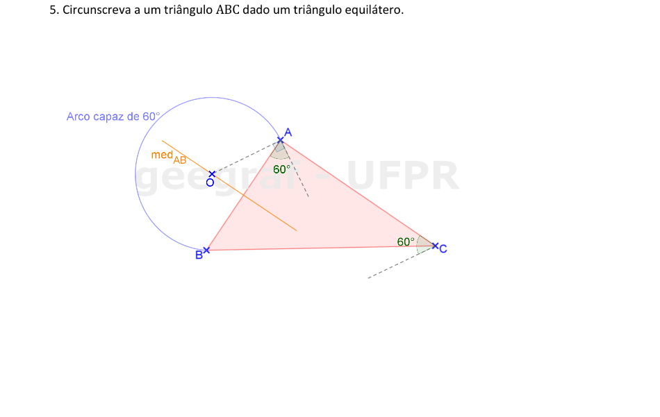
			   <figcaption>Agora vamos construir o arco capaz no lado <b>AC</b>: construa o ângulo de segmento de 60&deg; com vértice <b>C</b>.</figcaption>
		   </li>
		   <li>
			   <input type="radio" id="615" name="sl">
			   <label for="615"></label>
			   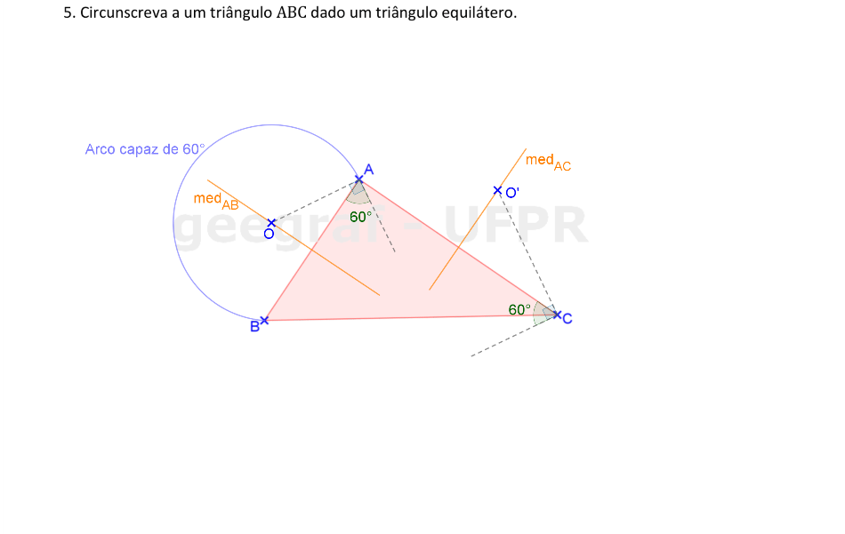
			   <figcaption>Encontre a mediatriz do lado <b>AC</b>. O centro <b>O'</b> do arco capaz de 60&deg; está na interseção da mediatriz do lado <b>AC</b> com o segmento perpendicular à reta suporte do ângulo de segmento construído.</figcaption>
		   </li>
		   <li>
			   <input type="radio" id="616" name="sl">
			   <label for="616"></label>
			   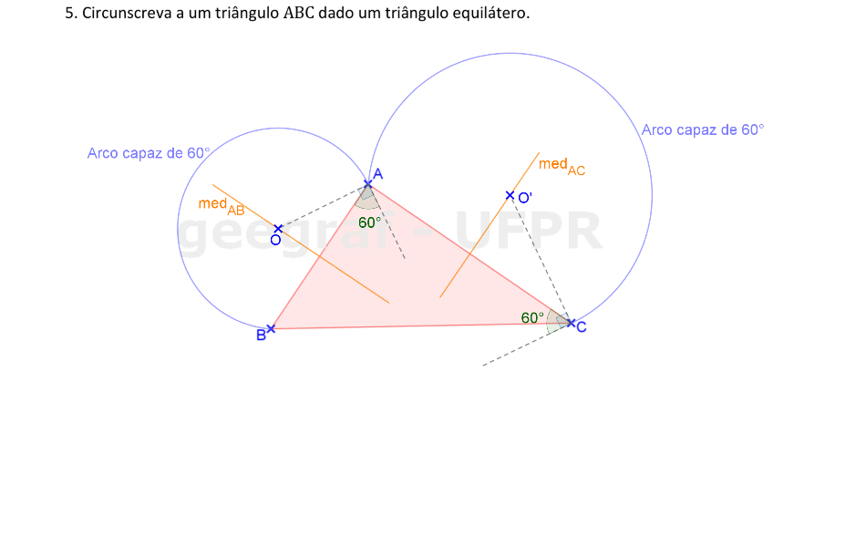
			   <figcaption>Construa o arco capaz de centro <b>O'</b> e raio <b>O'A = O'C</b>.</figcaption>
		   </li>
		   <li>
			   <input type="radio" id="617" name="sl">
			   <label for="617"></label>
			   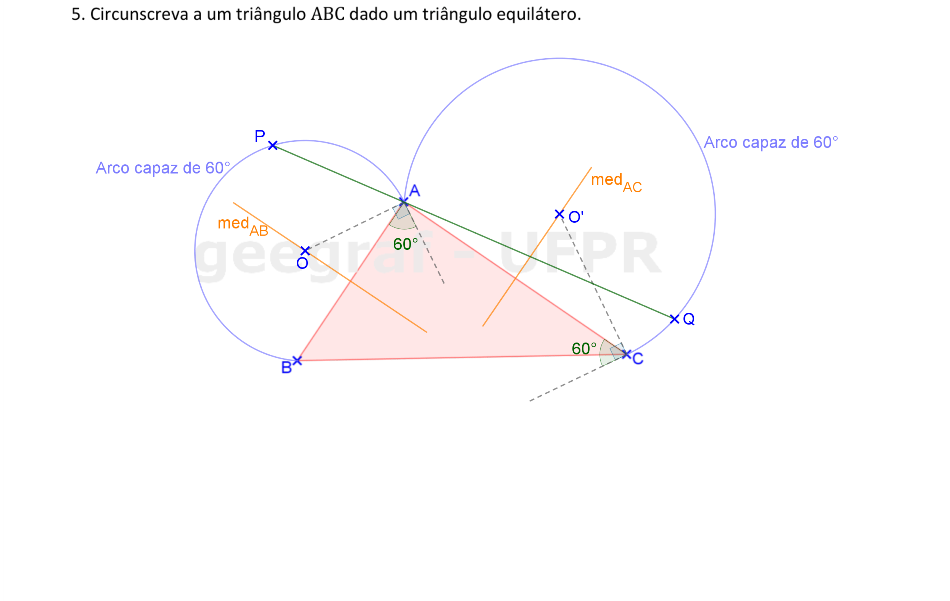
			   <figcaption>Escolha um ponto <b>P</b> de um dos arcos capazes e defina o segmento <b>PQ</b> que passa por <b>A</b> e <b>Q</b> pertence ao outro arco capaz construído. Assim, temos um dos lados de um triângulo equilátero circunscrito.</figcaption>
		   </li>
		   <li>
			   <input type="radio" id="618" name="sl">
			   <label for="618"></label>
			   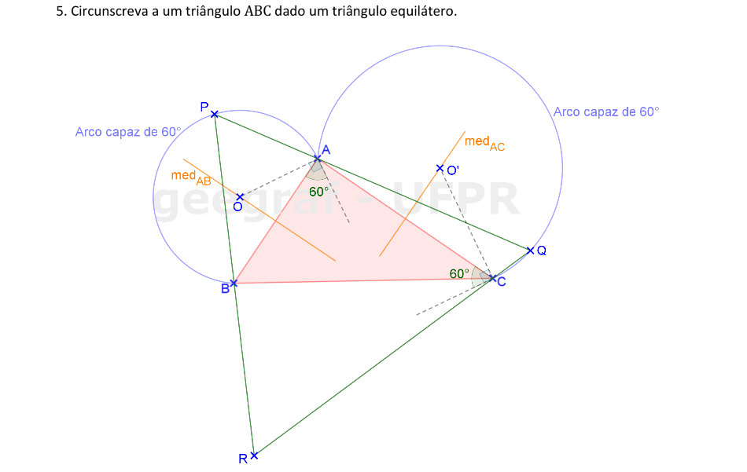
			   <figcaption>Agora basta construir os segmentos <b>PR</b> e <b>QR</b> que passam pelos vértices <b>B</b> e <b>C</b>.</figcaption>
		   </li>
		</ul>
		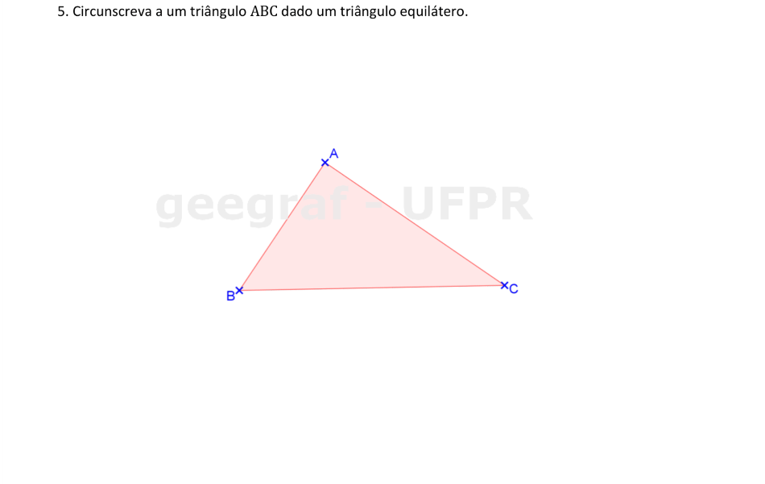
  

   
<a href="#modulo5" class="topo">voltar ao topo</a>

   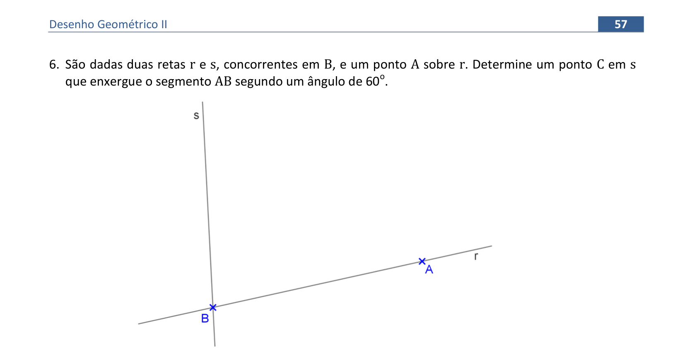
   

&#x1f4cf; &#x1f4d0; Resolução

	
Vamos usar a translação para encontrar um ponto da reta <b>s</b> que enxerga o segmento <b>AB</b> segundo ângulo de 60&deg;.

	  <ul class="slider">
		   <li>
			   <input type="radio" id="619" name="sl">
			   <label for="619"></label>
			   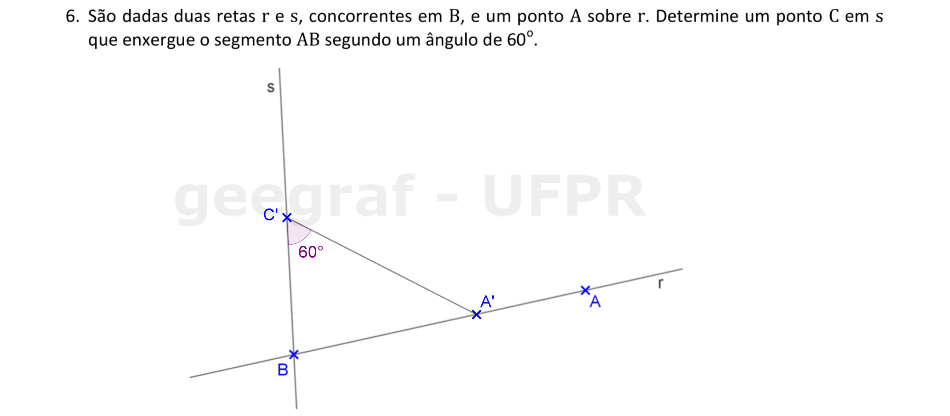
			   <figcaption>Contrua um ângulo <b>BC'A' = 60&deg;</b>. Agora precisamos fazer a translação do segmento <b>C'A'</b> até que os pontos <b>A</b> e <b>A'</b> fiquem coincidentes.</figcaption>
		   </li>
		   <li>
			   <input type="radio" id="620" name="sl">
			   <label for="620"></label>
			   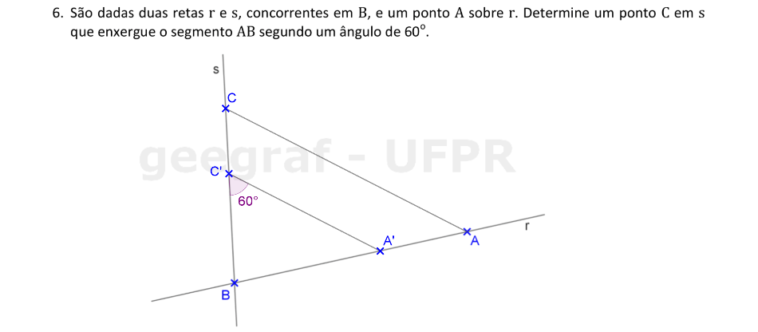
			   <figcaption>Construindo a reta paralela a <b>A'C'</b> que passa por <b>A</b>, encontramos o ponto <b>C &isin; s</b> que enxerga <b>AB</b> segundo ângulo de 60&deg;.</figcaption>
		   </li>
		</ul>
		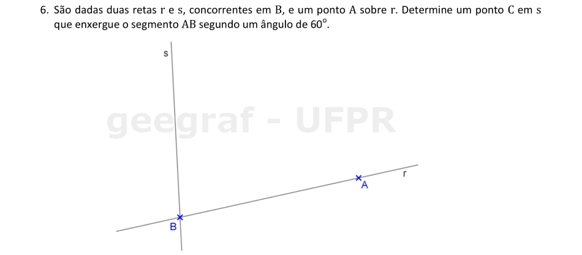
  

   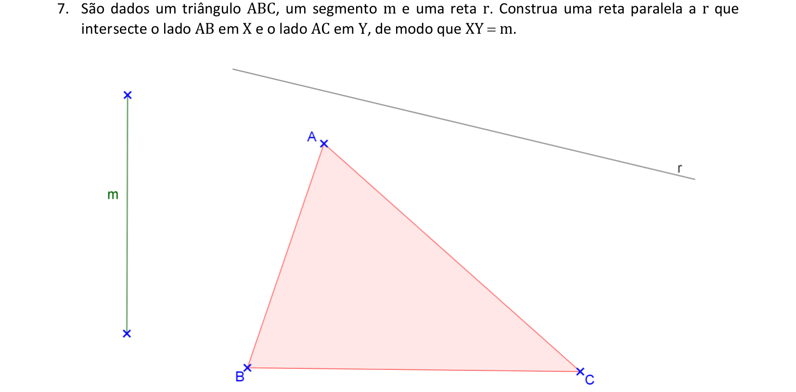
   
&#x1f4cf; &#x1f4d0; Exercício proposto 5.1

   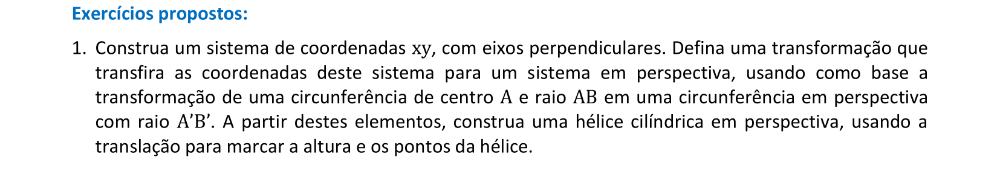
   
<a href="#modulo5" class="topo">voltar ao topo</a>

   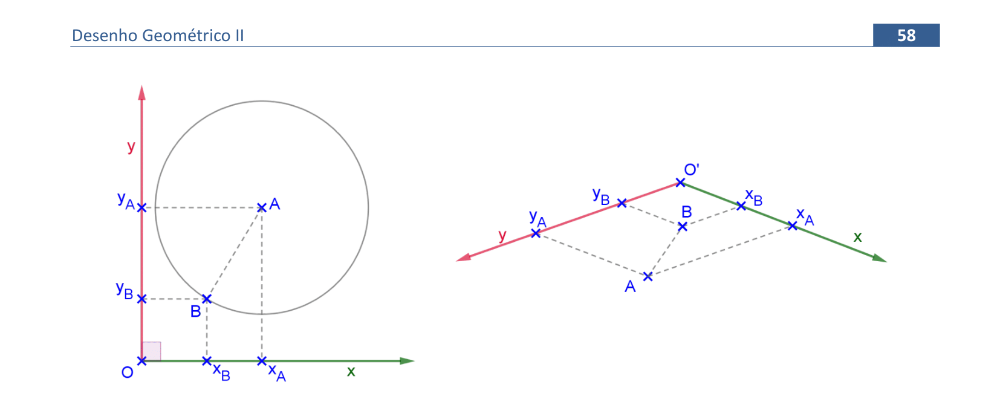
   

&#x1f4cf; &#x1f4d0; Resolução

	
Vamos construir uma hélice cilíndrica em projeções ortogonais e também em perspectiva.

	  <ul class="slider">
		   <li>
			   <input type="radio" id="621" name="sl">
			   <label for="621"></label>
			   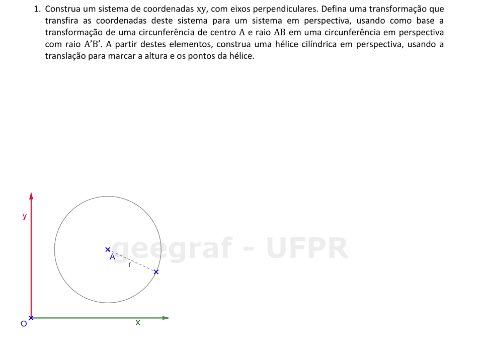
			   <figcaption>Construa uma circunferência de centro <b>A'</b> e raio <b>r</b> e os eixos perpendiculares <b>x</b> e <b>y</b> com origem do sistema de coordenadas <b>xOy</b>.</figcaption>
		   </li>
		    <li>
			   <input type="radio" id="622" name="sl">
			   <label for="622"></label>
			   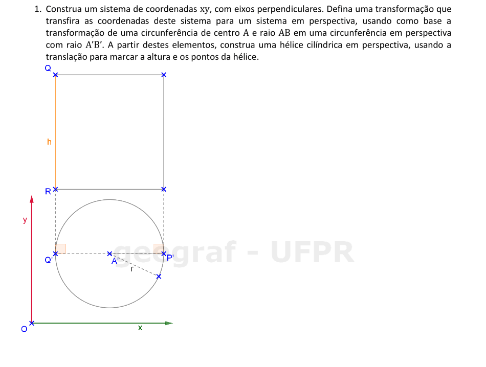
			   <figcaption>Construa a projeção frontal do cilindro: o retângulo com um lado igual ao diâmetro da circunferência da base e o outro lado igual à altura <b>h</b>. Considere as geratrizes paralelas ao eixo <b>y</b>.</figcaption>
		   </li>
		   <li>
			   <input type="radio" id="623" name="sl">
			   <label for="623"></label>
			   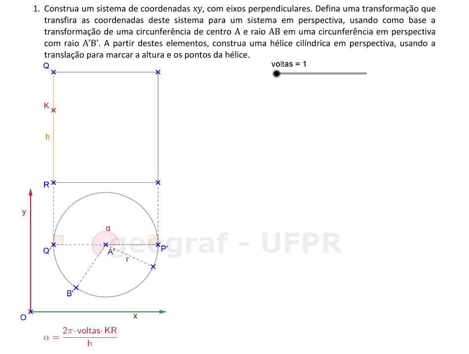
			   <figcaption>Considere um número chamado <b>voltas</b>, que será usado para controlar o número de voltas da hélice. Considere o ponto <b>K &isin; QR</b>. Usando uma regra de três, temos que o segmento <b>KR</b> corresponde à altura relativa que define a medida do ângulo central da base <b>&alpha; = P'A'B'</b> por meio da seguinte expressão: $\mathsf{ \alpha = { {2\pi \cdot voltas \cdot KR} \over {h} } }$.</figcaption>
		   </li>
		   <li>
			   <input type="radio" id="624" name="sl">
			   <label for="624"></label>
			   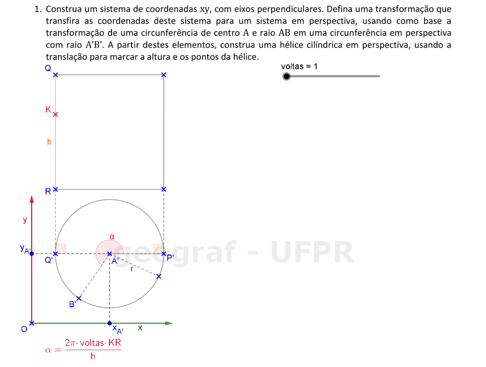
			   <figcaption>Construa os segmentos paralelos aos eixos que passam por <b>A'</b>, definindo as coordenadas deste ponto:  <b>xA'</b> e <b>yA'</b>.</figcaption>
		   </li>
		   <li>
			   <input type="radio" id="625" name="sl">
			   <label for="625"></label>
			   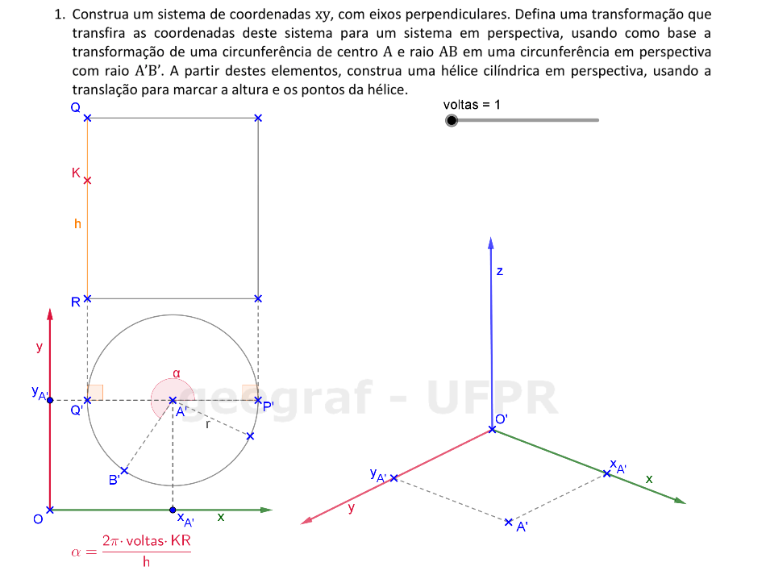
			   <figcaption>Construa os eixos em perspectiva e defina as coordenadas <b>xA'</b> e <b>yA'</b> que determinam a projeção do ponto <b>A'</b> em perspectiva, por meio dos segmentos paralelos aos eixos representados em perspectiva.</figcaption>
		   </li>
		   <li>
			   <input type="radio" id="626" name="sl">
			   <label for="626"></label>
			   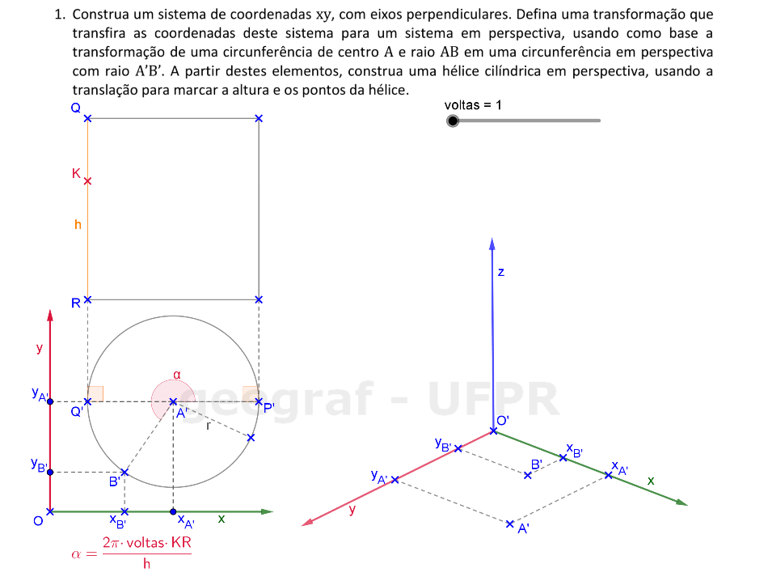
			   <figcaption>Agora obtenha as coordenadas do ponto <b>B'</b> e transfira estas medidas para os eixos em perspectiva.</figcaption>
		   </li>
		   <li>
			   <input type="radio" id="627" name="sl">
			   <label for="627"></label>
			   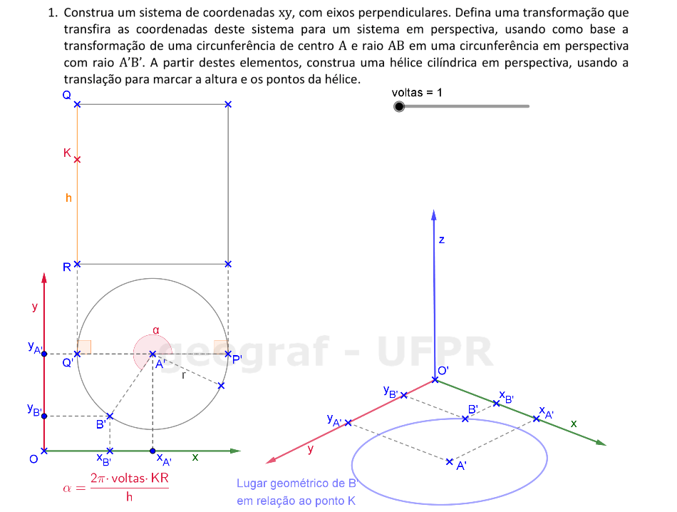
			   <figcaption>O lugar geométrico do ponto <b>B'</b> da perspectiva em relação ao ponto <b>K</b> é a projeção da circunferência da base do cilindro em perspectiva.</figcaption>
		   </li>
		   <li>
			   <input type="radio" id="628" name="sl">
			   <label for="628"></label>
			   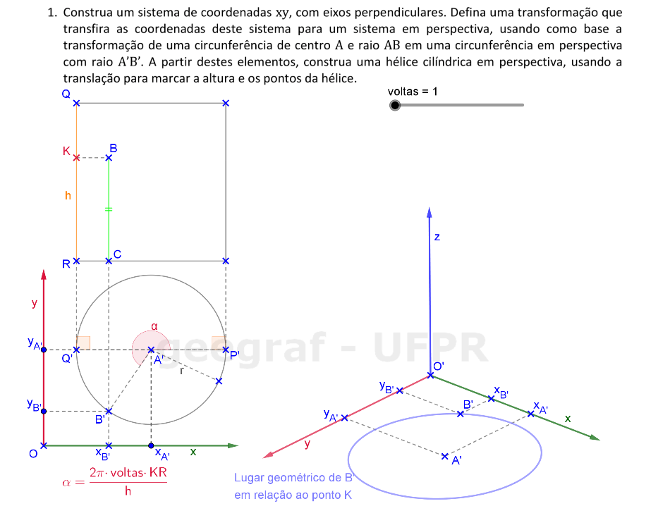
			   <figcaption>Construa o segmento correspondente de <b>B'</b> na vista frontal do cilindro, definindo o segmento <b>BC</b> tal que <b>BC // QR</b> e <b>BK // P'Q'</b>.</figcaption>
		   </li>
		   <li>
			   <input type="radio" id="629" name="sl">
			   <label for="629"></label>
			   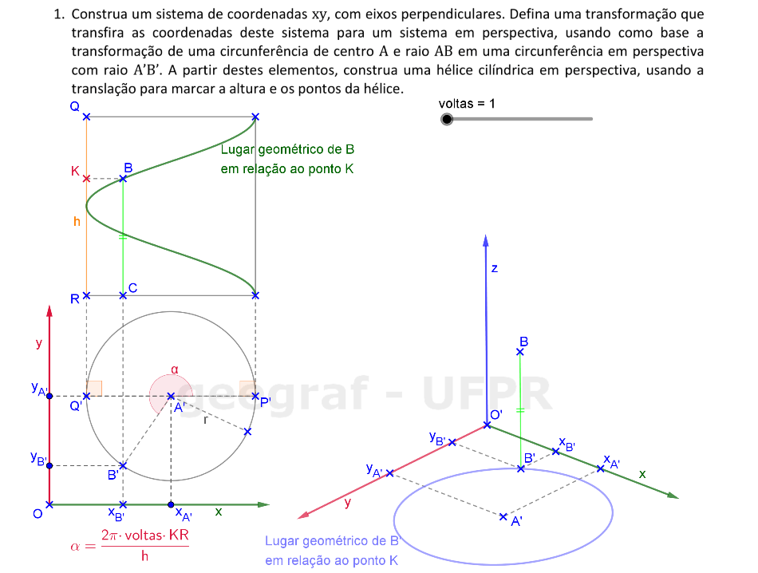
			   <figcaption>O lugar geométrico do ponto <b>B</b> em relação ao ponto <b>K</b> é a projeção frontal da hélice cilíndrica. Transfira a medida <b>BC</b> para a perspectiva, tal que <b>BB' // z</b> e <b>BB' = BC</b>.</figcaption>
		   </li>
		   <li>
			   <input type="radio" id="630" name="sl">
			   <label for="630"></label>
			   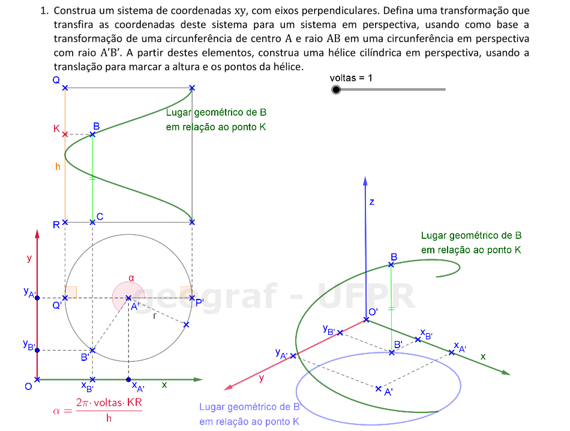
			   <figcaption>O lugar geométrico do ponto <b>B</b> na perspectiva em relação ao ponto <b>K</b> é a projeção da hélice cilíndrica na perspectiva.</figcaption>
		   </li>
		   <li>
			   <input type="radio" id="631" name="sl">
			   <label for="631"></label>
			   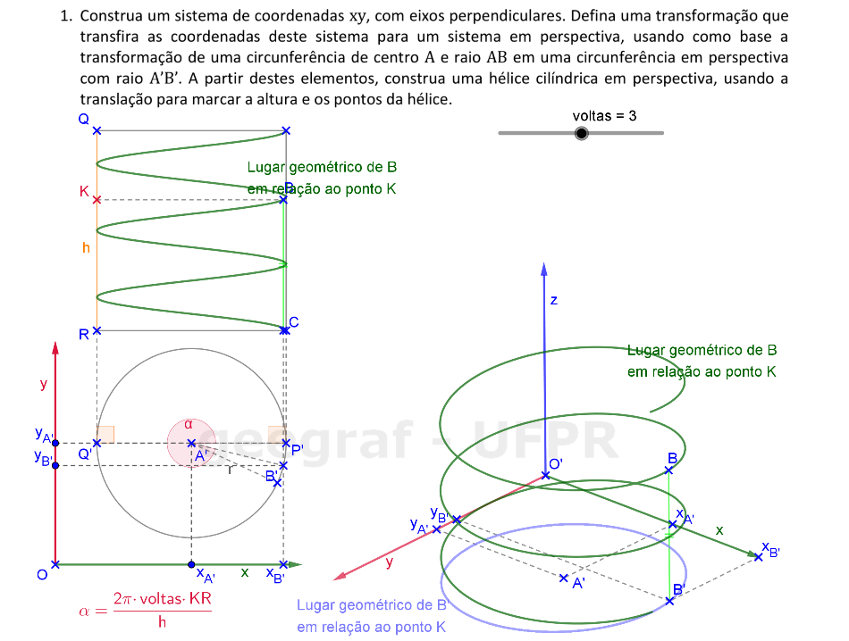
			   <figcaption>Modificando o valor do número <b>voltas</b>, temos outras hélices cilíndricas representadas em projeções e também em perspectiva.</figcaption>
		   </li>
		</ul>
		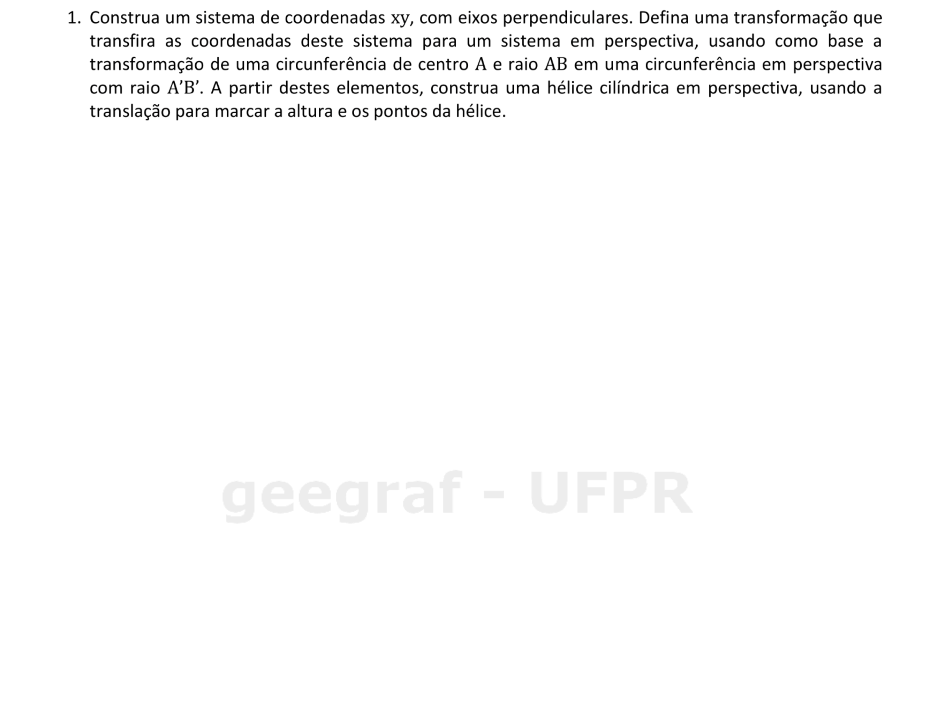
  

   
   

&#x1f4cf; &#x1f4d0; Resolução

	
Vamos construir uma hélice cônica em projeções ortogonais e também em perspectiva.

	  <ul class="slider">
		   <li>
			   <input type="radio" id="632" name="sl">
			   <label for="632"></label>
			   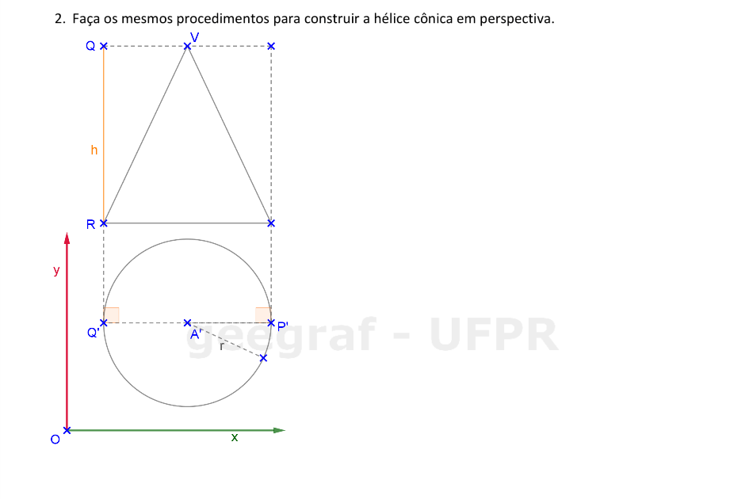
			   <figcaption>Construa uma circunferência de centro <b>A'</b> e raio <b>r</b> e os eixos perpendiculares <b>x</b> e <b>y</b> com origem do sistema de coordenadas <b>xOy</b>. Construa a projeção frontal do cone: o triângulo iscósceles com um lado igual ao diâmetro da circunferência da base e altura <b>QR = h</b>. Considere a altura do cone paralela ao eixo <b>y</b>.</figcaption>
		   </li>
		   <li>
			   <input type="radio" id="633" name="sl">
			   <label for="633"></label>
			   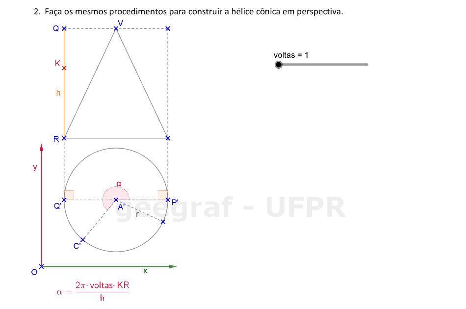
			   <figcaption>Considere um número chamado <b>voltas</b>, que será usado para controlar o número de voltas da hélice. Considere o ponto <b>K &isin; QR</b>. Usando uma regra de três, temos que o segmento <b>KR</b> corresponde à altura relativa que define a medida do ângulo central da base <b>&alpha; = P'A'C'</b> por meio da seguinte expressão: $\mathsf{ \alpha = { {2\pi \cdot voltas \cdot KR} \over {h} } }$.</figcaption>
		   </li>
		    <li>
			   <input type="radio" id="634" name="sl">
			   <label for="634"></label>
			   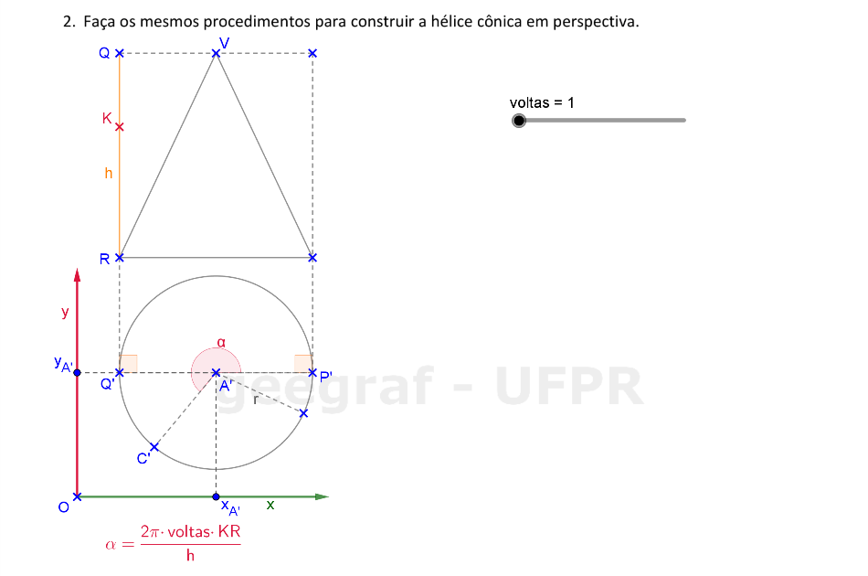
			   <figcaption>Construa os segmentos paralelos aos eixos que passam por <b>A'</b>, definindo as coordenadas deste ponto:  <b>xA'</b> e <b>yA'</b>.</figcaption>
		   </li>
		   <li>
			   <input type="radio" id="635" name="sl">
			   <label for="635"></label>
			   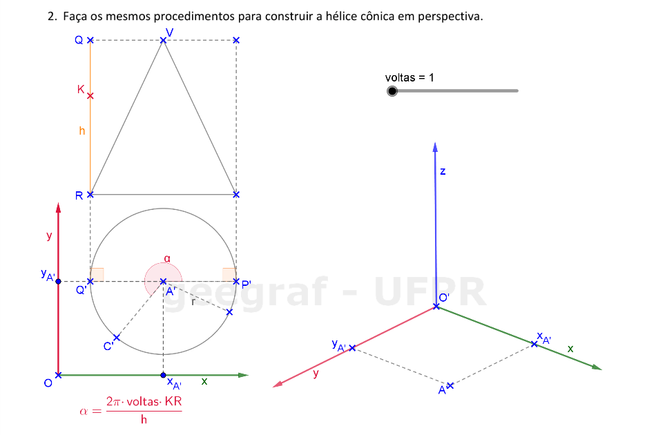
			   <figcaption>Construa os eixos em perspectiva e defina as coordenadas <b>xA'</b> e <b>yA'</b> que determinam a projeção do ponto <b>A'</b> em perspectiva, por meio dos segmentos paralelos aos eixos representados em perspectiva.</figcaption>
		   </li>
		   <li>
			   <input type="radio" id="636" name="sl">
			   <label for="636"></label>
			   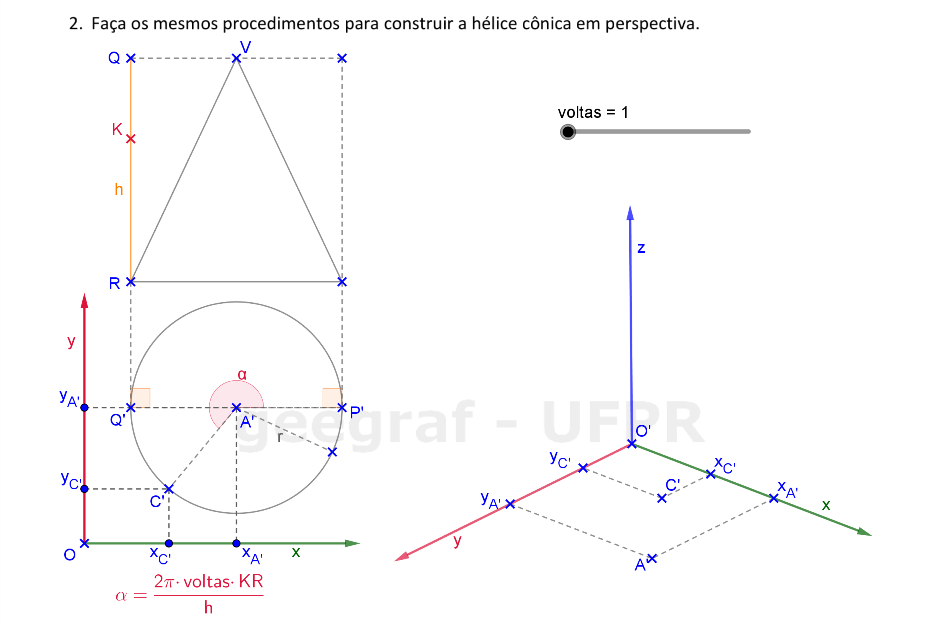
			   <figcaption>Agora obtenha as coordenadas do ponto <b>C'</b> e transfira estas medidas para os eixos em perspectiva.</figcaption>
		   </li>
		   <li>
			   <input type="radio" id="637" name="sl">
			   <label for="637"></label>
			   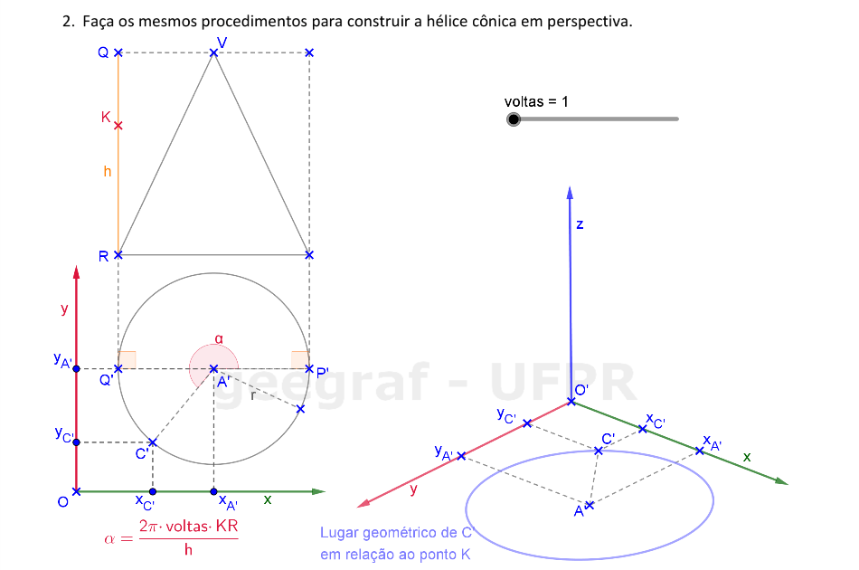
			   <figcaption>O lugar geométrico do ponto <b>C'</b> da perspectiva em relação ao ponto <b>K</b> é a projeção da circunferência da base do cone em perspectiva.</figcaption>
		   </li>
		   <li>
			   <input type="radio" id="638" name="sl">
			   <label for="638"></label>
			   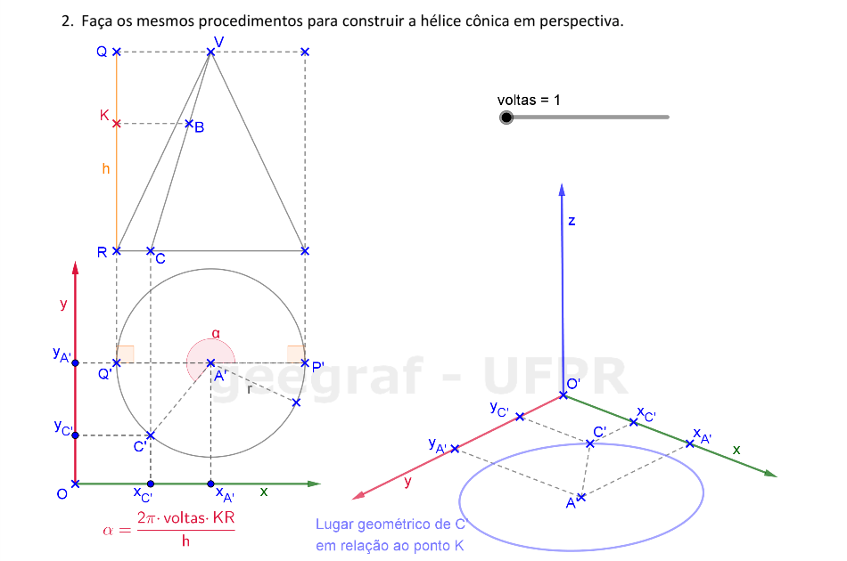
			   <figcaption>Construa a geratriz correspondente de <b>C'</b> na vista frontal do cilindro, definindo o segmento <b>VC</b> tal que <b>C</b> pertence ao segmento da base do triângulo isósceles. Defina o ponto correspondente de <b>K</b> na geratriz <b>VC</b>, tal que <b>BK // P'Q'</b>.</figcaption>
		   </li>
		   <li>
			   <input type="radio" id="639" name="sl">
			   <label for="639"></label>
			   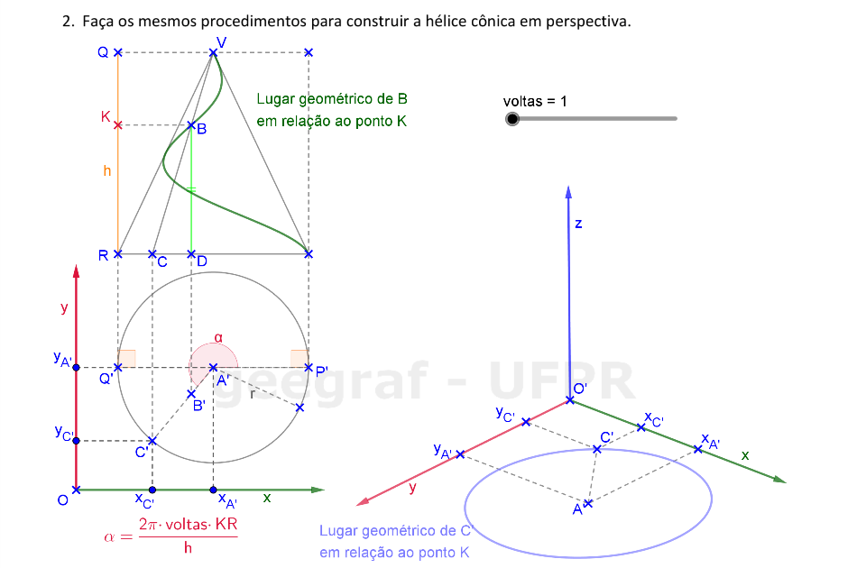
			   <figcaption>O lugar geométrico do ponto <b>B</b> em relação ao ponto <b>K</b> é a projeção frontal da hélice cônica. Obtenha a projeção superior do ponto <b>B</b> tal que <b>B' &isin; A'C'</b> e defina a medida da altura correspondente da hélice <b>BD</b>.</figcaption>
		   </li>
		   <li>
			   <input type="radio" id="640" name="sl">
			   <label for="640"></label>
			   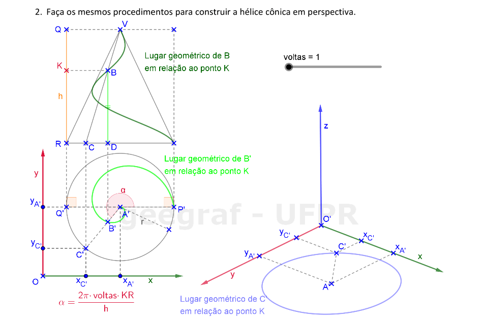
			   <figcaption>O lugar geométrico do ponto <b>B'</b> em relação ao ponto <b>K</b> é a projeção superior da hélice cônica. </figcaption>
		   </li>
		   <li>
			   <input type="radio" id="641" name="sl">
			   <label for="641"></label>
			   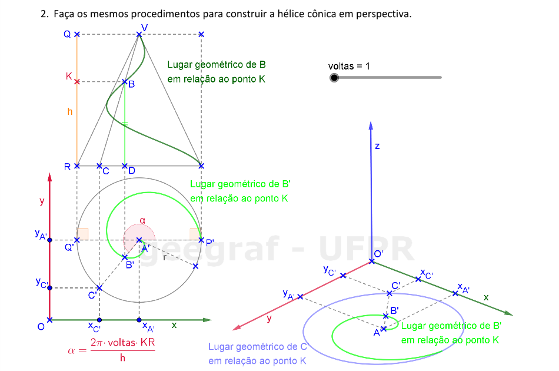
			   <figcaption>Obtenha as coordenadas do ponto <b>B'</b> na perspectiva. O lugar geométrico do ponto <b>B'</b> da perspectiva em relação ao ponto <b>K</b> é a projeção da hélice cônica em perspectiva.</figcaption>
		   </li>
		   <li>
			   <input type="radio" id="642" name="sl">
			   <label for="642"></label>
			   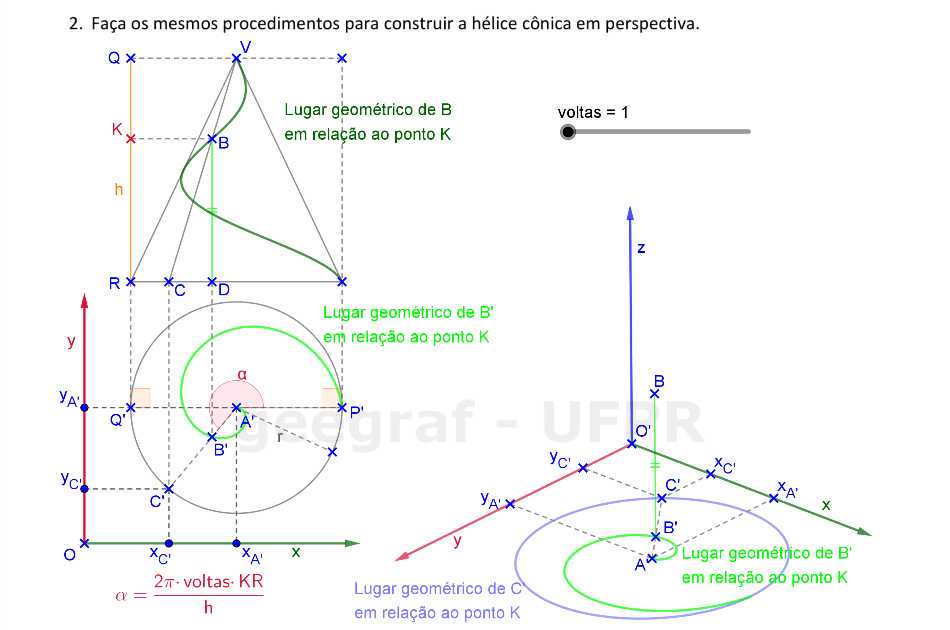
			   <figcaption>Transfira a medida <b>BD</b> para a perspectiva, tal que <b>BB' // z</b> e <b>BB' = BD</b>.</figcaption>
		   </li>
		   <li>
			   <input type="radio" id="643" name="sl">
			   <label for="643"></label>
			   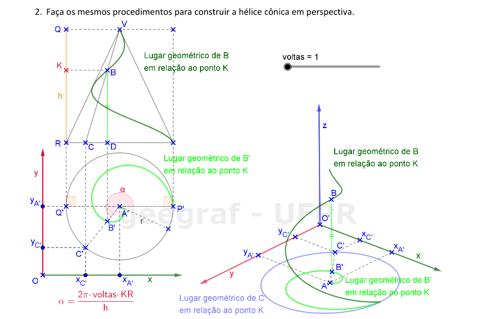
			   <figcaption>O lugar geométrico do ponto <b>B</b> na perspectiva em relação ao ponto <b>K</b> é a projeção da hélice cônica na perspectiva.</figcaption>
		   </li>
		   <li>
			   <input type="radio" id="644" name="sl">
			   <label for="644"></label>
			   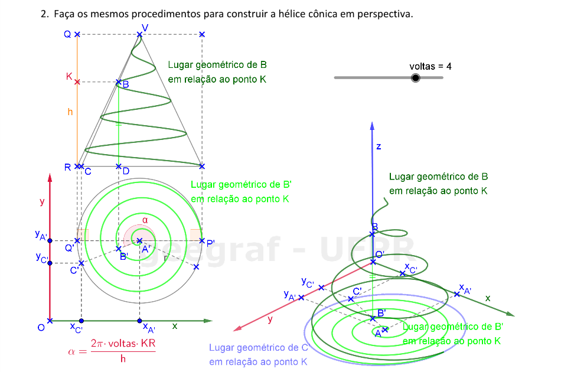
			   <figcaption>Modificando o valor do número <b>voltas</b>, temos outras hélices cônicas representadas em projeções e também em perspectiva.</figcaption>
		   </li>
		</ul>
		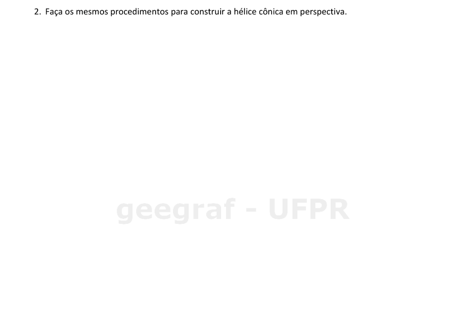
  

   
   

&#x1f4cf; &#x1f4d0; Resolução

	
Vamos construir uma hélice esférica em projeções ortogonais e também em perspectiva.

	  <ul class="slider">
		   <li>
			   <input type="radio" id="645" name="sl">
			   <label for="645"></label>
			   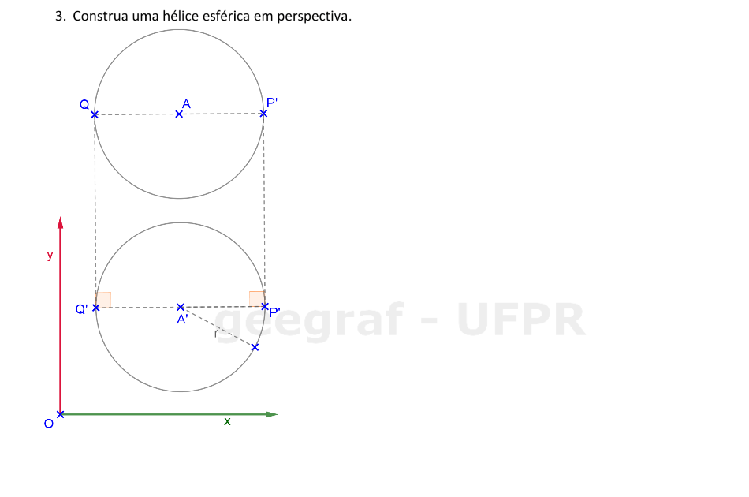
			   <figcaption>Construa uma circunferência de centro <b>A'</b> e raio <b>r</b> e os eixos perpendiculares <b>x</b> e <b>y</b> com origem do sistema de coordenadas <b>xOy</b>. Construa a projeção frontal da esfera: a circunferência de raio <b>QA = r</b>. Considere o segmento correspondente das projeções da esfera <b>QQ' // y</b>.</figcaption>
		   </li>
		   <li>
			   <input type="radio" id="646" name="sl">
			   <label for="646"></label>
			   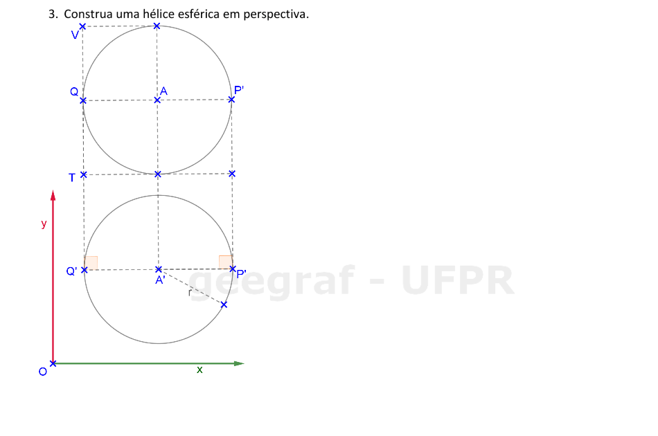
			   <figcaption>Defina o ponto limite <b>T</b> da projeção frontal a partir do diâmetro paralelo ao eixo <b>x</b>.</figcaption>
		   </li>
		    <li>
			   <input type="radio" id="647" name="sl">
			   <label for="647"></label>
			   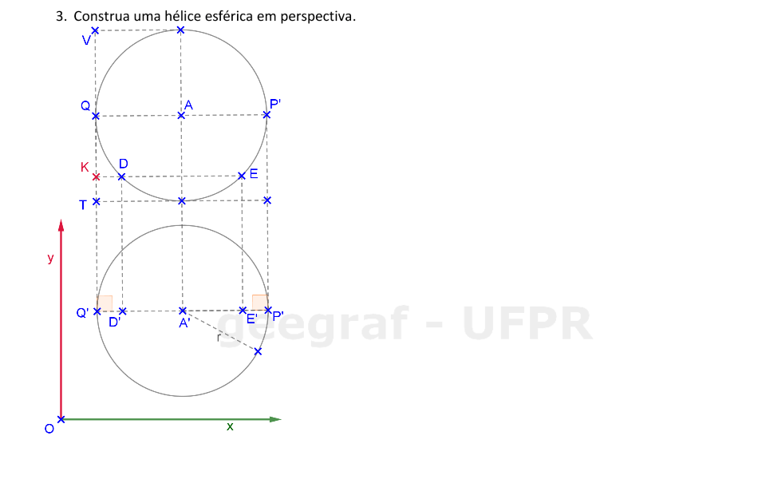
			   <figcaption>Defina o ponto <b>K &isin; QT</b>, e o ponto da projeção frontal <b>D</b> tal que <b>DE // QT</b> e <b>KD // P'Q'</b>.</figcaption>
		   </li>
		   <li>
			   <input type="radio" id="648" name="sl">
			   <label for="648"></label>
			   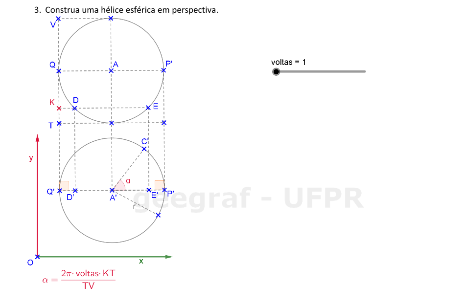
			   <figcaption>Considere um número chamado <b>voltas</b>, que será usado para controlar o número de voltas da hélice. Usando uma regra de três, temos que o segmento <b>DE</b> corresponde à altura relativa que define a medida do ângulo central da base <b>&alpha; = P'A'C'</b> por meio da seguinte expressão: $\mathsf{ \alpha = { {2\pi \cdot voltas \cdot DE} \over {r} } }$.</figcaption>
		   </li>
		   <li>
			   <input type="radio" id="649" name="sl">
			   <label for="649"></label>
			   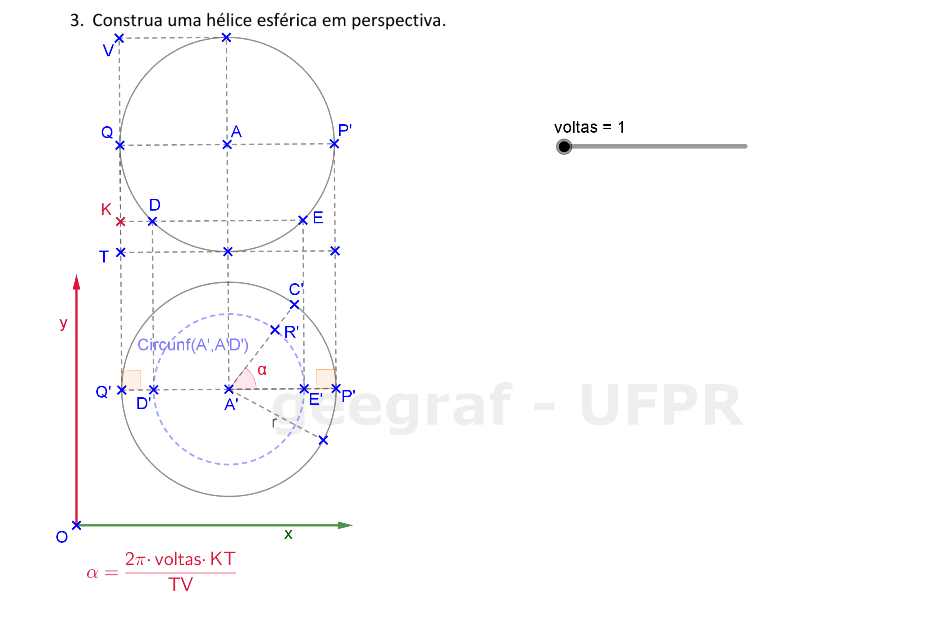
			   <figcaption>Defina a <b>Circunf(A, DF)</b>, correspondente à seção paralela ao diâmetro da esfera <b>P'Q'</b> da vista frontal. O ponto <b>R' &isin; A'C'</b> pertence à hélice esférica.</figcaption>
		   </li>
		   <li>
			   <input type="radio" id="650" name="sl">
			   <label for="650"></label>
			   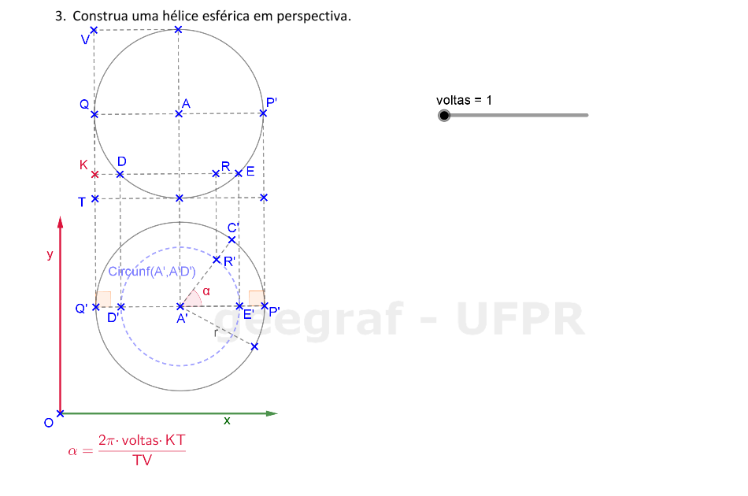
			   <figcaption>O ponto correspondente de <b>R'</b> da projeção frontal é <b>R</b> tal que <b>RR' // QT</b> e <b>R &isin; KF</b>.</figcaption>
		   </li>
		   <li>
			   <input type="radio" id="651" name="sl">
			   <label for="651"></label>
			   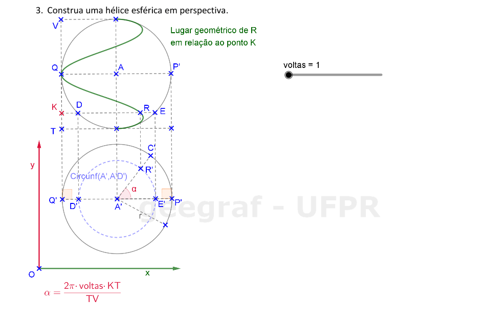
			   <figcaption>Como a esfera é simétrica em relação a qualquer seção que passa pelo centro, temos que os simétricos de <b>R</b> e de <b>R'</b> em relação a <b>PQ</b> e <b>P'Q'</b> pertencem à hélice esférica.</figcaption>
		   </li>
		   <li>
			   <input type="radio" id="652" name="sl">
			   <label for="652"></label>
			   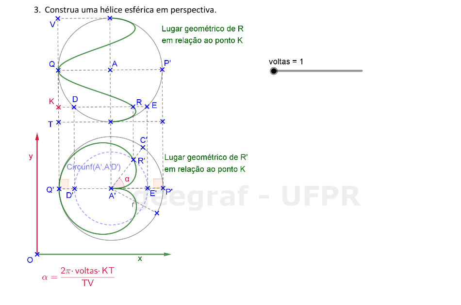
			   <figcaption>Os lugares geométricos dos pontos <b>R</b> e <b>S</b> em relação ao ponto <b>K</b> definem a projeção frontal da hélice esférica. Os lugares geométricos dos pontos <b>R'</b> e <b>S'</b> em relação ao ponto <b>K</b> definem a projeção superior da hélice esférica.</figcaption>
		   </li>
		   <li>
			   <input type="radio" id="653" name="sl">
			   <label for="653"></label>
			   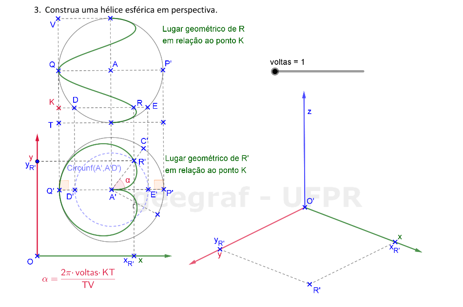
			   <figcaption>Construa os eixos em perspectiva e defina as coordenadas e projeções dos pontos <b>R'</b> e <b>S'</b>.</figcaption>
		   </li>
		   <li>
			   <input type="radio" id="654" name="sl">
			   <label for="654"></label>
			   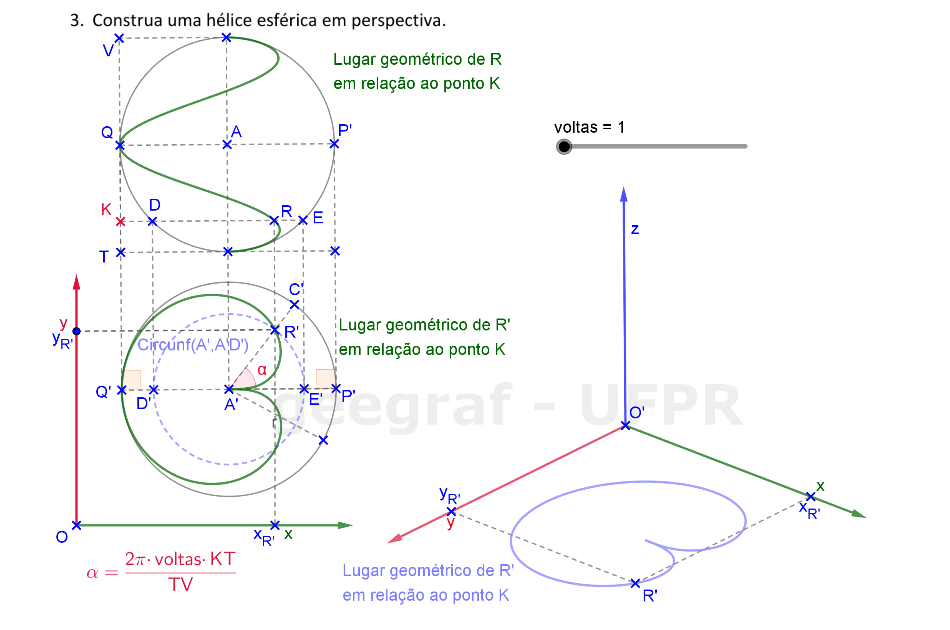
			   <figcaption>Os lugares geométricos dos pontos <b>R'</b> e <b>S'</b> da perspectiva em relação ao ponto <b>K</b> definem a projeção da hélice esférica em perspectiva.</figcaption>
		   </li>
		   <li>
			   <input type="radio" id="655" name="sl">
			   <label for="655"></label>
			   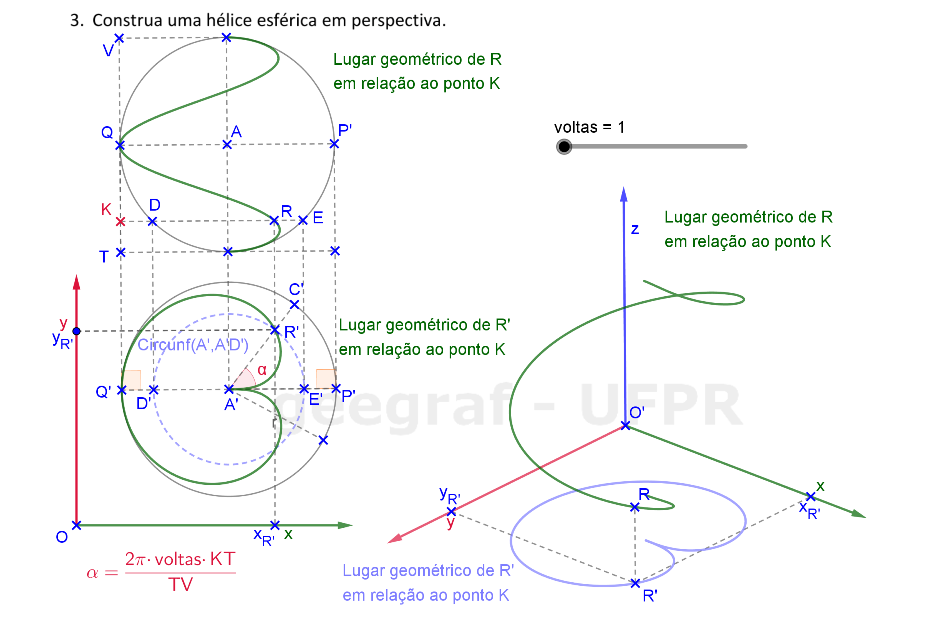
			   <figcaption>Transfira as medidas <b>UR</b> e <b>US</b> para a perspectiva, tal que <b>RR' // z</b>, <b>RR' = UR + 1</b>, <b>SS' // z</b> e <b>SS' = US + 1</b>.</figcaption>
		   </li>
		   <li>
			   <input type="radio" id="656" name="sl">
			   <label for="656"></label>
			   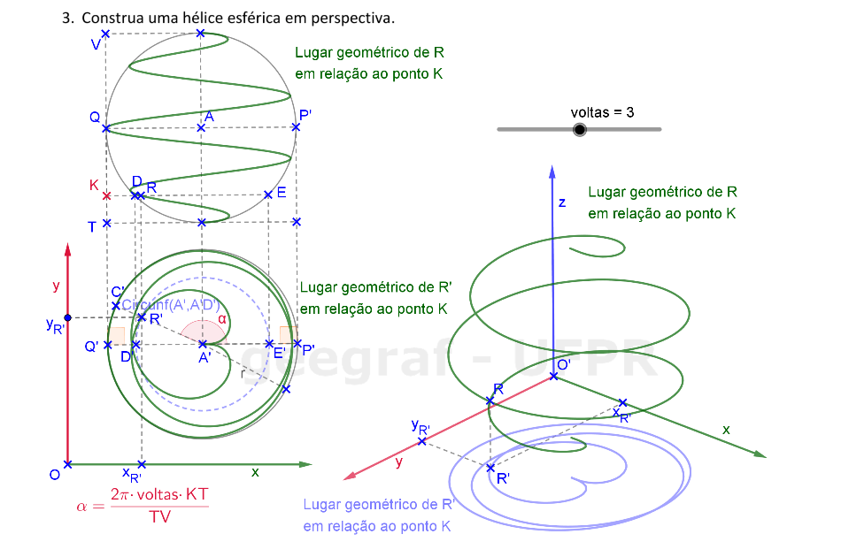
			   <figcaption>Os lugares geométricos dos pontos <b>R</b> e <b>S</b> na perspectiva em relação ao ponto <b>K</b> definem a projeção da hélice esférica na perspectiva.</figcaption>
		   </li>
		   <li>
			   <input type="radio" id="657" name="sl">
			   <label for="657"></label>
			   
			   <figcaption>Modificando o valor do número <b>voltas</b>, temos outras hélices esféricas representadas em projeções e também em perspectiva.</figcaption>
		   </li>
		</ul>
		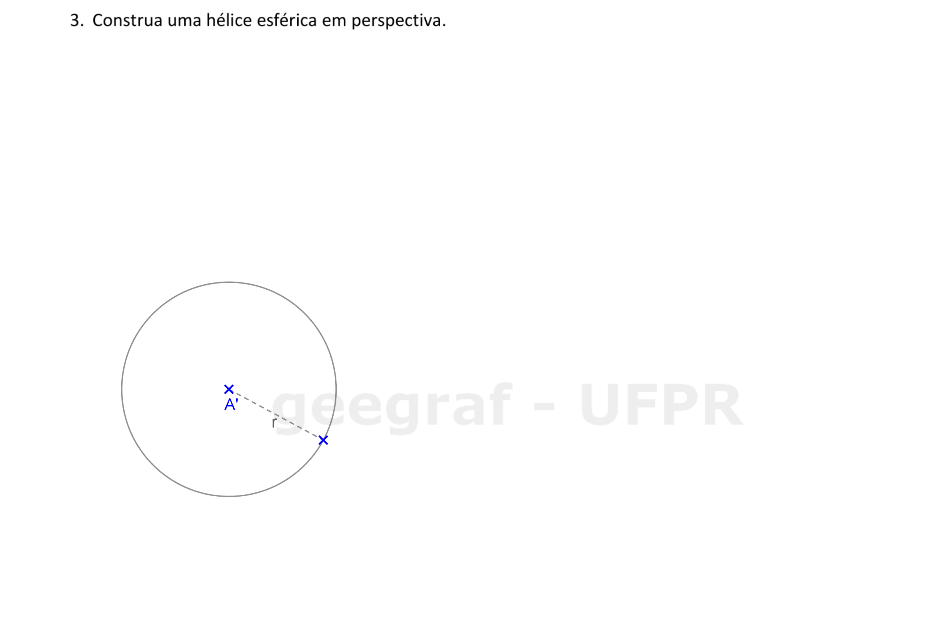
  

   
   
&#x1f4cf; &#x1f4d0; Exercício proposto 5.2

   
   

&#x1f4cf; &#x1f4d0; Resolução

	
Vamos construir uma hélice hiperbólica em projeções ortogonais e também em perspectiva. Vamos considerar a superfície de um hiperbolóide de revolução.

	  <ul class="slider">
		   <li>
			   <input type="radio" id="658" name="sl">
			   <label for="658"></label>
			   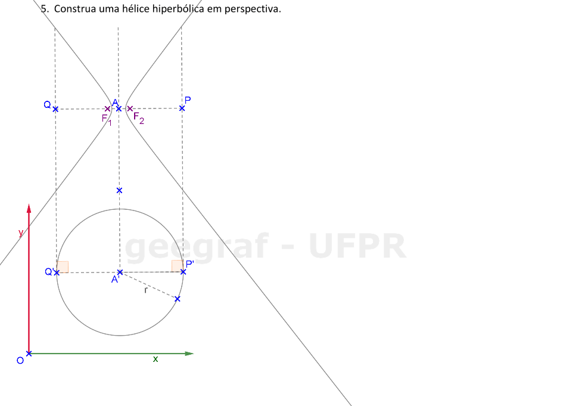
			   <figcaption>Construa uma circunferência de centro <b>A'</b> e raio <b>r</b> e os eixos perpendiculares <b>x</b> e <b>y</b> com origem do sistema de coordenadas <b>xOy</b>. Construa a projeção frontal da hipérbole com centro na mesma reta paralela ao eixo <b>y</b> que passa por <b>A'</b>. Considere o segmento <b>PQ // P'Q'</b> que passa por <b>A</b> e contém os focos da hipérbole.</figcaption>
		   </li>
		   <li>
			   <input type="radio" id="659" name="sl">
			   <label for="659"></label>
			   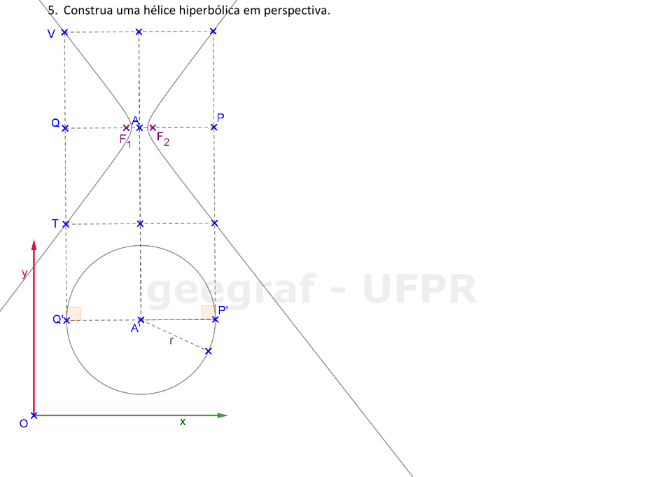
			   <figcaption>Defina o ponto limite <b>T</b> da projeção frontal a partir do diâmetro paralelo ao eixo <b>x</b>.</figcaption>
		   </li>
		    <li>
			   <input type="radio" id="660" name="sl">
			   <label for="660"></label>
			   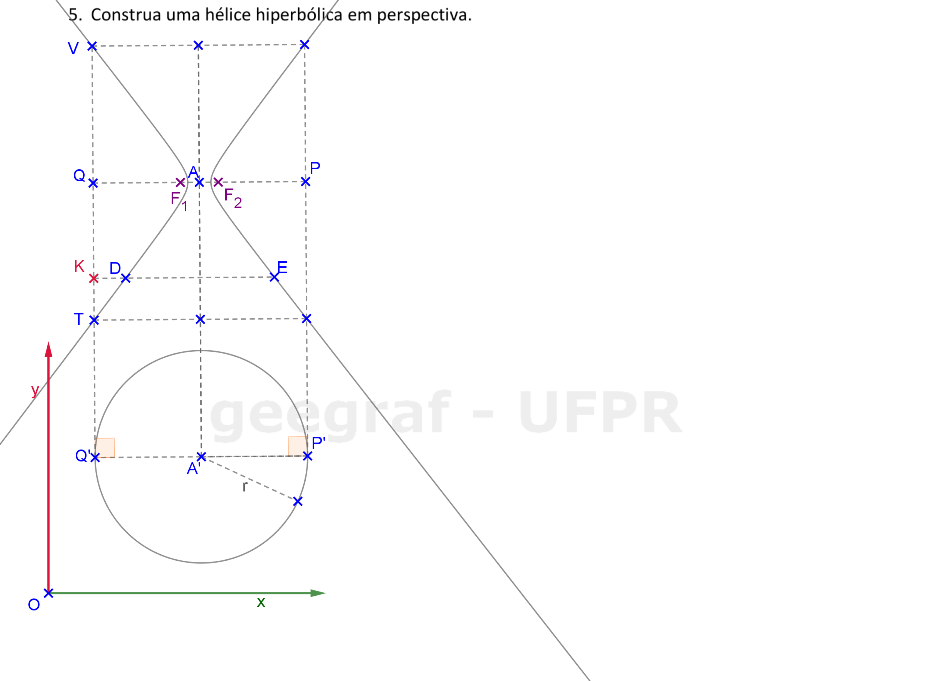
			   <figcaption>Defina o ponto <b>K &isin; QT</b>, e o ponto da projeção frontal <b>D</b> tal que <b>DE // QT</b> e <b>KD // P'Q'</b>.</figcaption>
		   </li>
		   <li>
			   <input type="radio" id="661" name="sl">
			   <label for="661"></label>
			   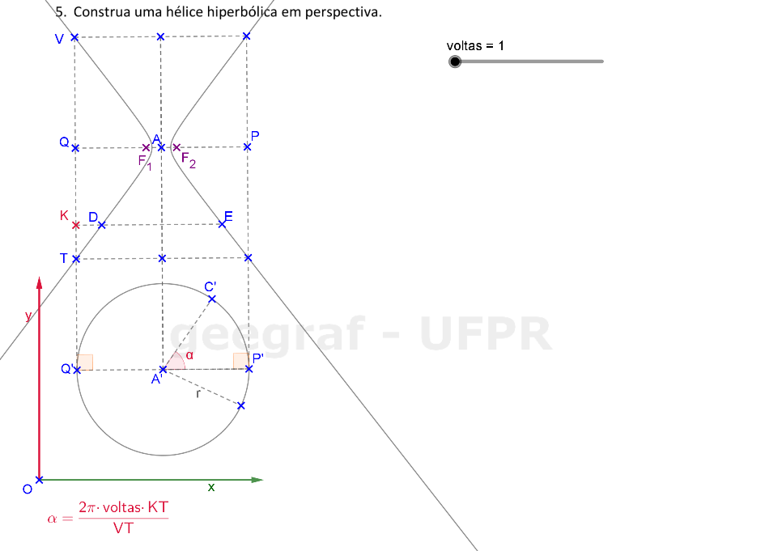
			   <figcaption>Considere um número chamado <b>voltas</b>, que será usado para controlar o número de voltas da hélice. Usando uma regra de três, temos que o segmento <b>DE</b> corresponde à altura relativa que define a medida do ângulo central da base <b>&alpha; = P'A'C'</b> por meio da seguinte expressão: $\mathsf{ \alpha = { {2\pi \cdot voltas \cdot DE} \over {r} } }$.</figcaption>
		   </li>
		   <li>
			   <input type="radio" id="662" name="sl">
			   <label for="662"></label>
			   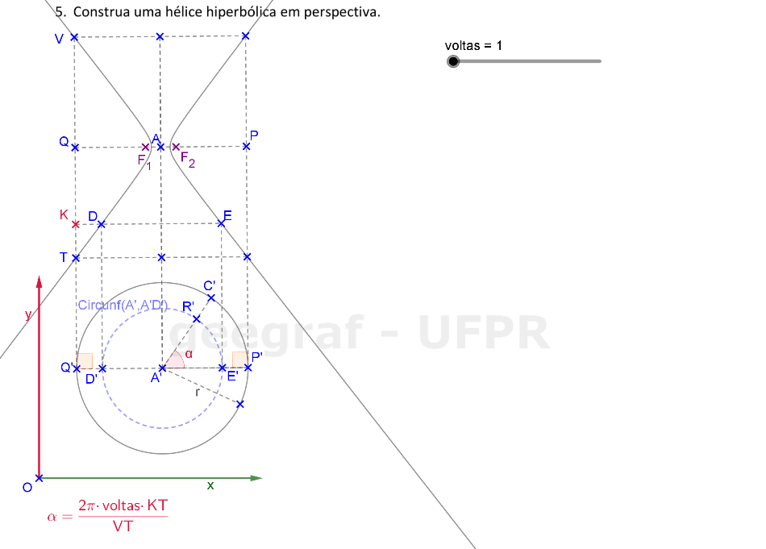
			   <figcaption>Defina a <b>Circunf(A, DF)</b>, correspondente à seção paralela ao diâmetro do hiperbolóide <b>P'Q'</b> da vista frontal. O ponto <b>R' &isin; A'C'</b> pertence à hélice hiperbólica.</figcaption>
		   </li>
		   <li>
			   <input type="radio" id="663" name="sl">
			   <label for="663"></label>
			   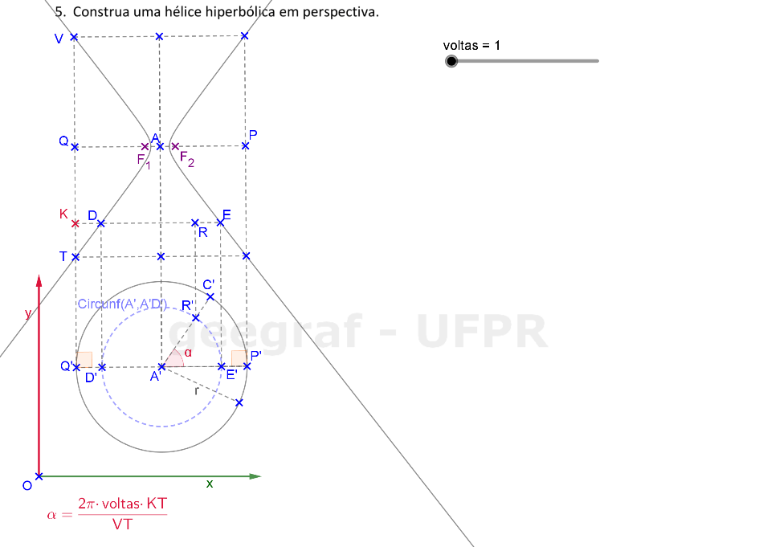
			   <figcaption>O ponto correspondente de <b>R'</b> da projeção frontal é <b>R</b> tal que <b>RR' // QT</b> e <b>R &isin; KF</b>.</figcaption>
		   </li>
		   <li>
			   <input type="radio" id="664" name="sl">
			   <label for="664"></label>
			   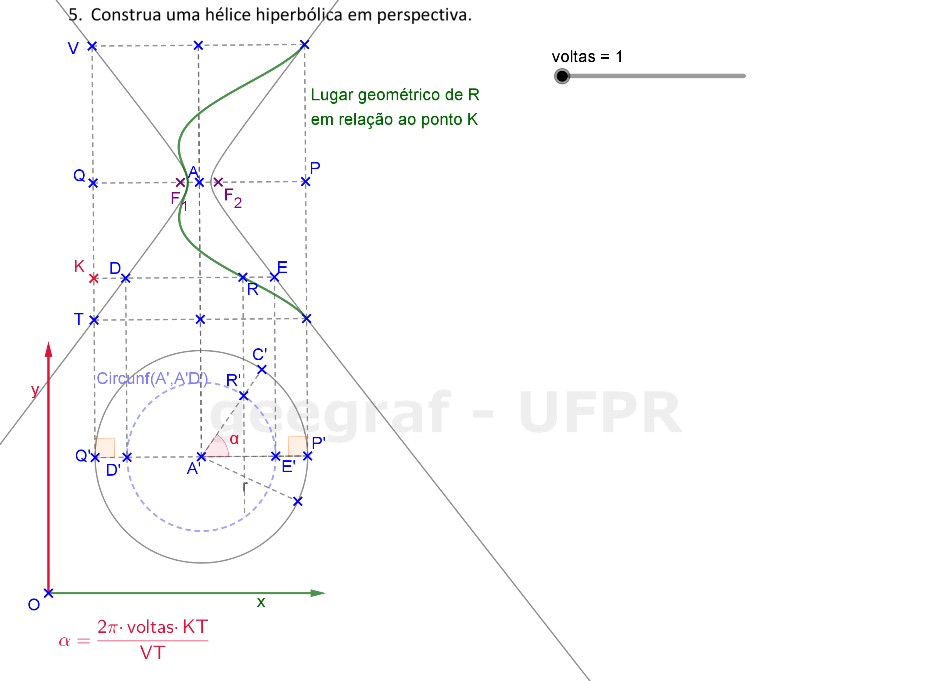
			   <figcaption>Como o hiperbolóide é simétrico em relação a qualquer seção que passa pelo centro, temos que os simétricos de <b>R</b> e de <b>R'</b> em relação a <b>PQ</b> e <b>P'Q'</b> pertencem à hélice hiperbólica.</figcaption>
		   </li>
		   <li>
			   <input type="radio" id="665" name="sl">
			   <label for="665"></label>
			   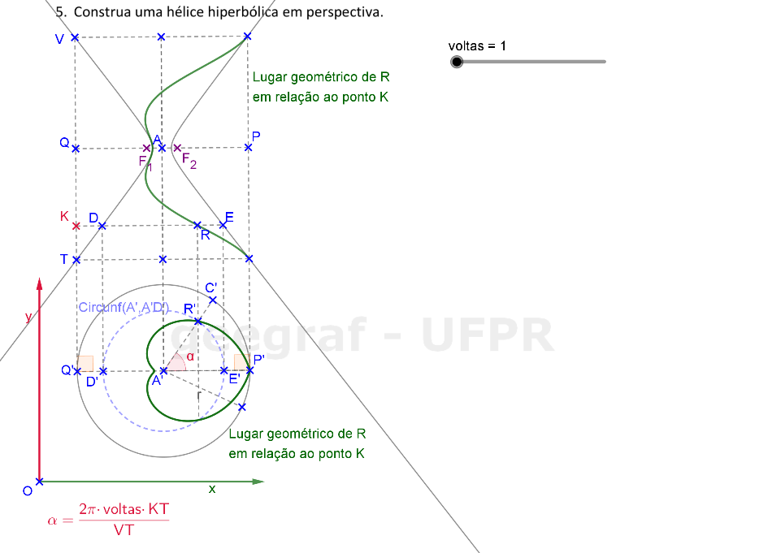
			   <figcaption>Os lugares geométricos dos pontos <b>R</b> e <b>S</b> em relação ao ponto <b>K</b> definem a projeção frontal da hélice hiperbólica. Os lugares geométricos dos pontos <b>R'</b> e <b>S'</b> em relação ao ponto <b>K</b> definem a projeção superior da hélice hiperbólica.</figcaption>
		   </li>
		   <li>
			   <input type="radio" id="666" name="sl">
			   <label for="666"></label>
			   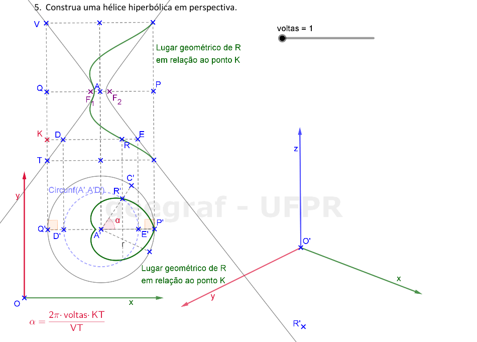
			   <figcaption>Construa os eixos em perspectiva e defina as coordenadas e projeções dos pontos <b>R'</b> e <b>S'</b>.</figcaption>
		   </li>
		   <li>
			   <input type="radio" id="667" name="sl">
			   <label for="667"></label>
			   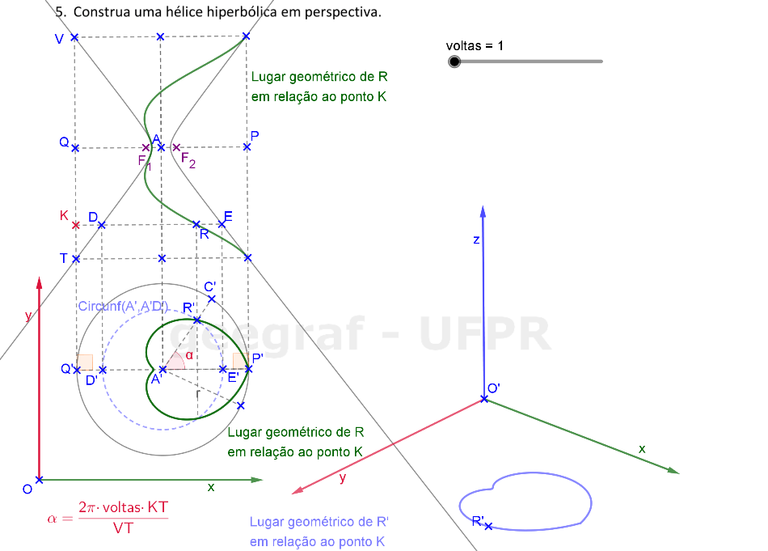
			   <figcaption>Os lugares geométricos dos pontos <b>R'</b> e <b>S'</b> da perspectiva em relação ao ponto <b>K</b> definem a projeção da hélice hiperbólica em perspectiva.</figcaption>
		   </li>
		   <li>
			   <input type="radio" id="668" name="sl">
			   <label for="668"></label>
			   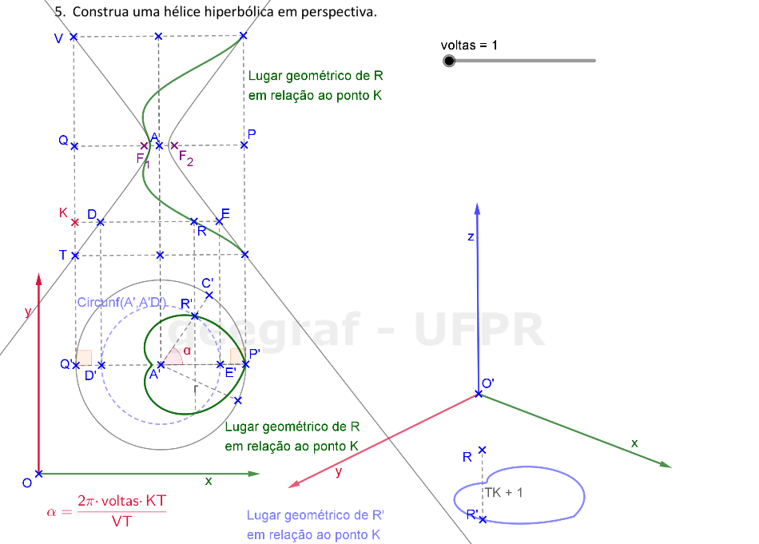
			   <figcaption>Transfira as medidas <b>UR</b> e <b>US</b> para a perspectiva, tal que <b>RR' // z</b>, <b>RR' = UR + 1</b>, <b>SS' // z</b> e <b>SS' = US + 1</b>.</figcaption>
		   </li>
		   <li>
			   <input type="radio" id="669" name="sl">
			   <label for="669"></label>
			   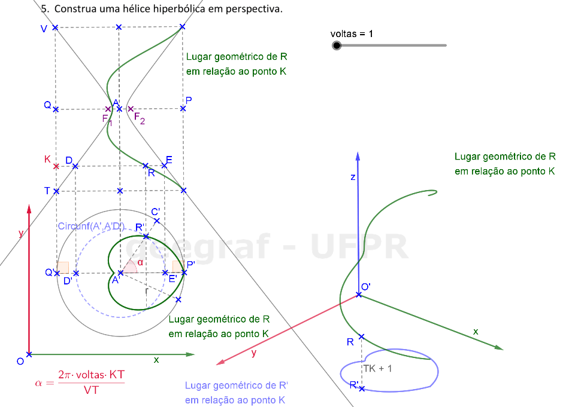
			   <figcaption>Os lugares geométricos dos pontos <b>R</b> e <b>S</b> na perspectiva em relação ao ponto <b>K</b> definem a projeção da hélice hiperbólica na perspectiva.</figcaption>
		   </li>
		   <li>
			   <input type="radio" id="670" name="sl">
			   <label for="670"></label>
			   
			   <figcaption>Modificando o valor do número <b>voltas</b>, temos outras hélices hiperbólicas representadas em projeções e também em perspectiva.</figcaption>
		   </li>
		</ul>
		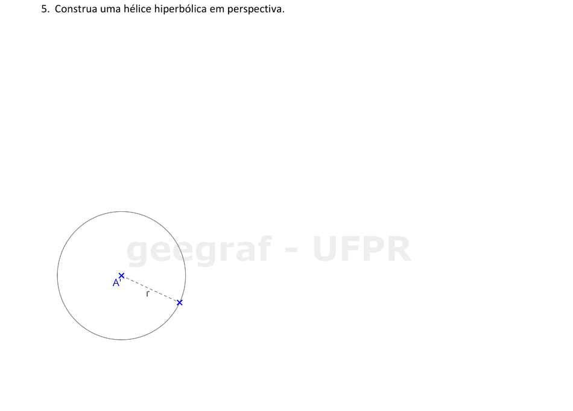
  

   
   

&#x1f4cf; &#x1f4d0; Resolução

	
Vamos construir uma hélice parabólica em projeções ortogonais e também em perspectiva. Vamos considerar a superfície de um parabolóide de revolução.

	  <ul class="slider">
		   <li>
			   <input type="radio" id="671" name="sl">
			   <label for="671"></label>
			   
			   <figcaption>Construa uma circunferência de centro <b>A'</b> e raio <b>r</b> e os eixos perpendiculares <b>x</b> e <b>y</b> com origem do sistema de coordenadas <b>xOy</b>. Construa a projeção frontal da parábola com o vértice na mesma reta paralela ao eixo <b>y</b> que passa por <b>A'</b>. Considere o segmento <b>PQ // P'Q' // &gamma;</b>.</figcaption>
		   </li>
		   <li>
			   <input type="radio" id="672" name="sl">
			   <label for="672"></label>
			   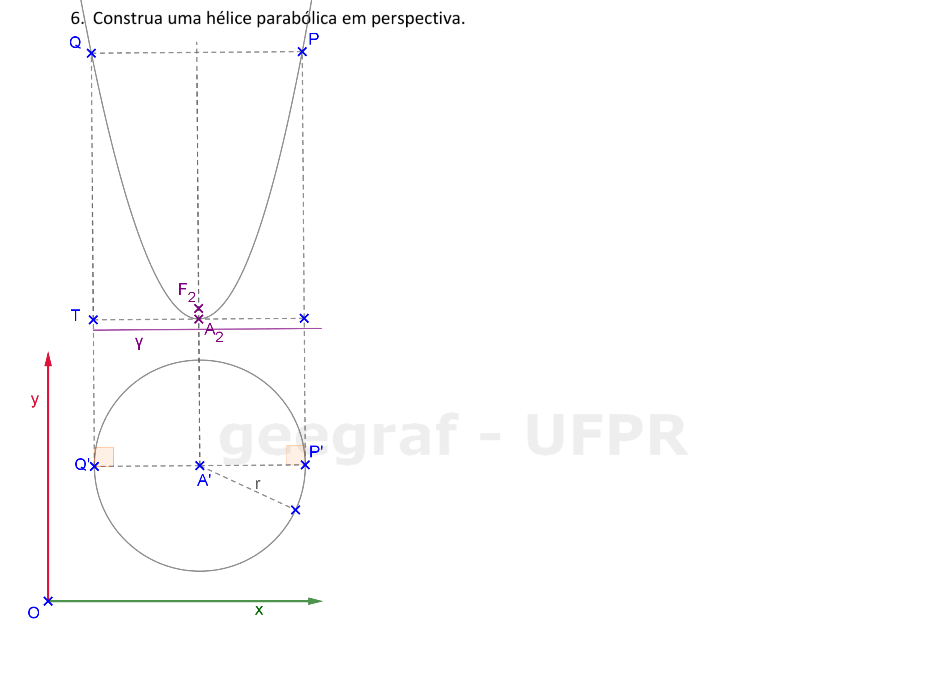
			   <figcaption>Defina o ponto limite <b>T</b> da projeção frontal que pertence à reta paralela ao eixo <b>x</b> que passa pelo vértice da parábola.</figcaption>
		   </li>
		    <li>
			   <input type="radio" id="673" name="sl">
			   <label for="673"></label>
			   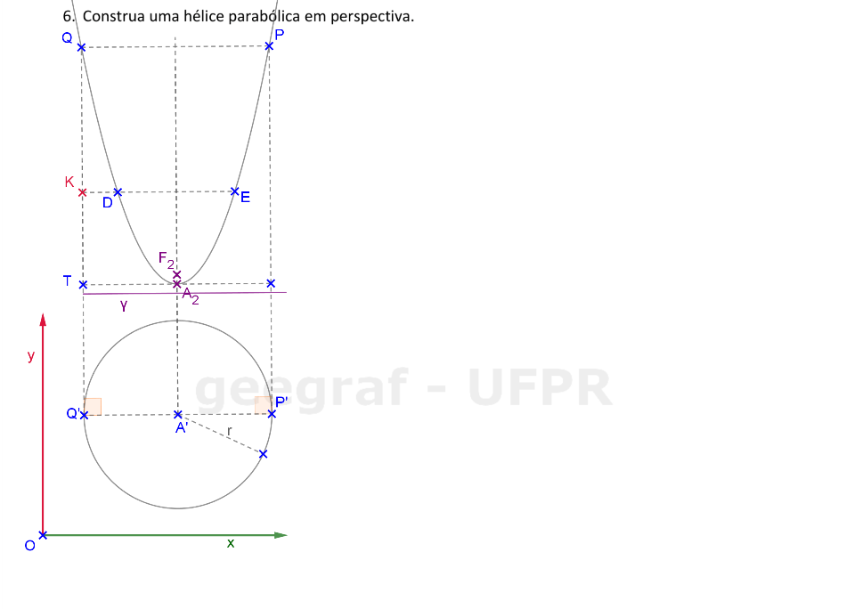
			   <figcaption>Defina o ponto <b>K &isin; QT</b>, e o ponto da projeção frontal <b>D</b> tal que <b>DE // QT</b> e <b>KD // P'Q'</b>.</figcaption>
		   </li>
		   <li>
			   <input type="radio" id="674" name="sl">
			   <label for="674"></label>
			   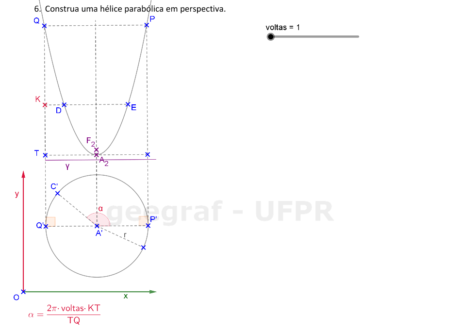
			   <figcaption>Considere um número chamado <b>voltas</b>, que será usado para controlar o número de voltas da hélice. Usando uma regra de três, temos que o segmento <b>DE</b> corresponde à altura relativa que define a medida do ângulo central da base <b>&alpha; = P'A'C'</b> por meio da seguinte expressão: $\mathsf{ \alpha = { {2\pi \cdot voltas \cdot DE} \over {r} } }$.</figcaption>
		   </li>
		   <li>
			   <input type="radio" id="675" name="sl">
			   <label for="675"></label>
			   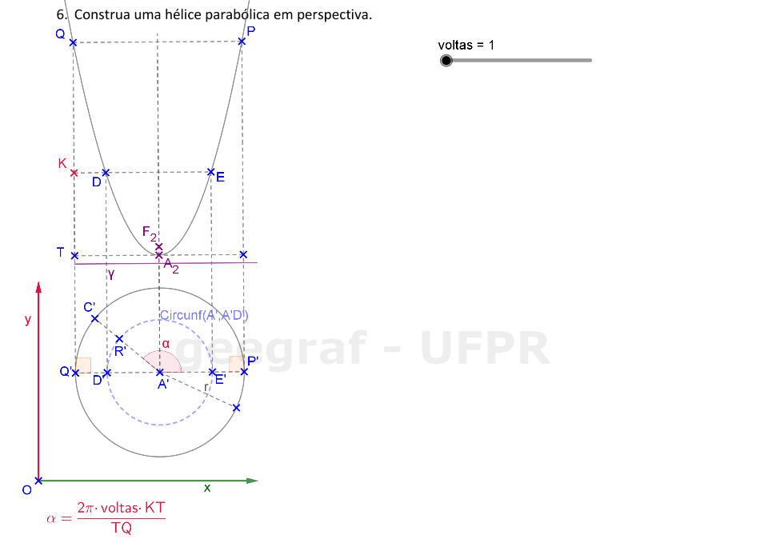
			   <figcaption>Defina a <b>Circunf(A, DF)</b>, correspondente à seção paralela ao diâmetro do parabolóide <b>P'Q'</b> da vista frontal. O ponto <b>R' &isin; A'C'</b> pertence à hélice parabólica.</figcaption>
		   </li>
		   <li>
			   <input type="radio" id="676" name="sl">
			   <label for="676"></label>
			   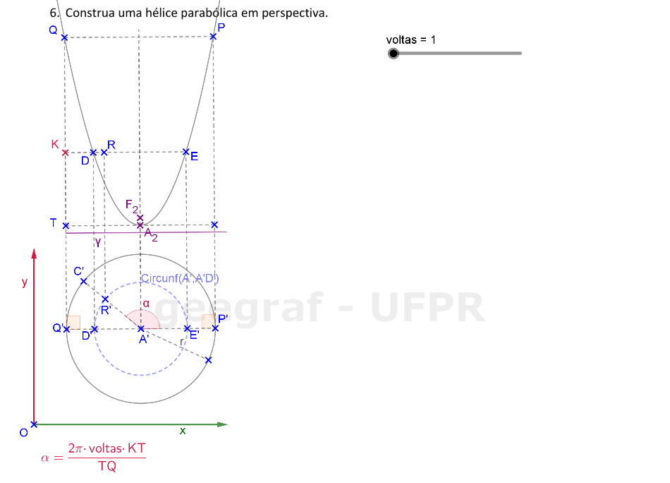
			   <figcaption>O ponto correspondente de <b>R'</b> da projeção frontal é <b>R</b> tal que <b>RR' // QT</b> e <b>R &isin; KF</b>.</figcaption>
		   </li>
		   <li>
			   <input type="radio" id="677" name="sl">
			   <label for="677"></label>
			   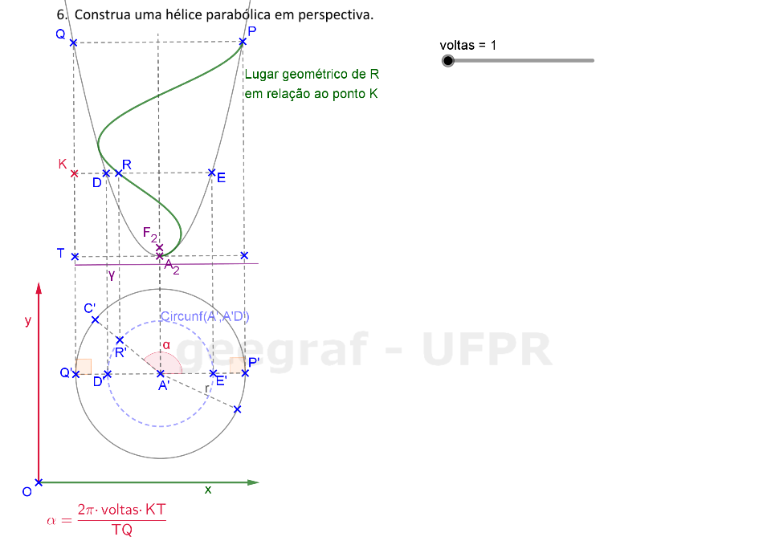
			   <figcaption>O lugar geométrico do ponto <b>R</b> em relação ao ponto <b>K</b> define a projeção frontal da hélice parabólica. O lugar geométrico do ponto <b>R'</b> em relação ao ponto <b>K</b> define a projeção superior da hélice parabólica.</figcaption>
		   </li>
		   <li>
			   <input type="radio" id="678" name="sl">
			   <label for="678"></label>
			   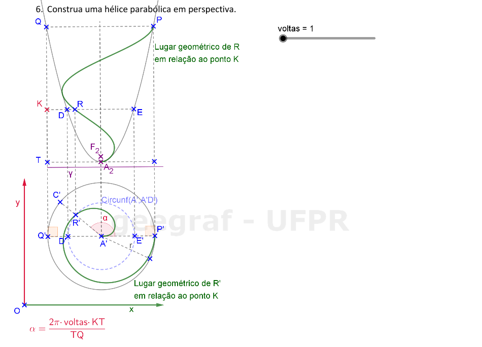
			   <figcaption>Construa os eixos em perspectiva e defina as coordenadas e a projeção do ponto <b>R'</b>.</figcaption>
		   </li>
		   <li>
			   <input type="radio" id="679" name="sl">
			   <label for="679"></label>
			   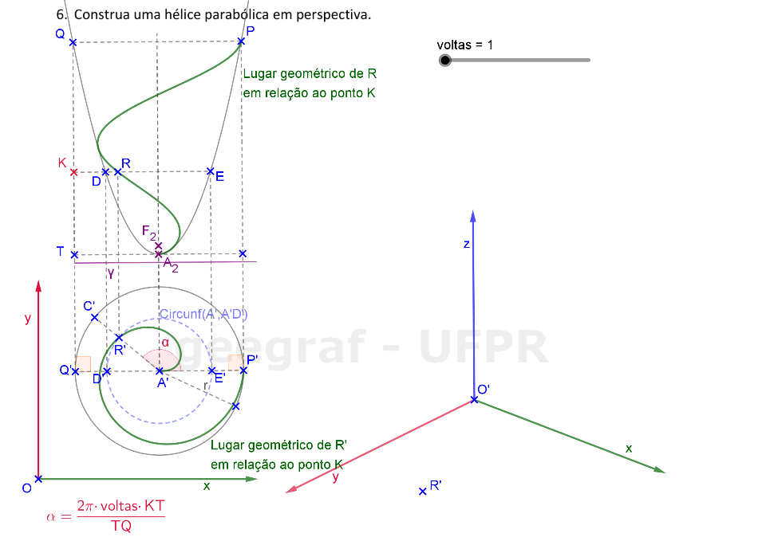
			   <figcaption>O lugar geométrico do ponto <b>R'</b> da perspectiva em relação ao ponto <b>K</b> define a projeção da hélice parabólica em perspectiva.</figcaption>
		   </li>
		   <li>
			   <input type="radio" id="680" name="sl">
			   <label for="680"></label>
			   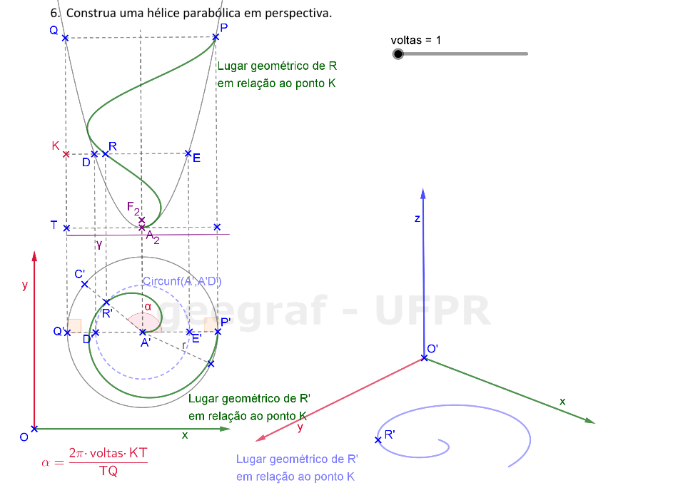
			   <figcaption>Transfira a medida <b>UR</b> para a perspectiva, tal que <b>RR' // z</b> e <b>RR' = UR + 1</b>.</figcaption>
		   </li>
		   <li>
			   <input type="radio" id="681" name="sl">
			   <label for="681"></label>
			   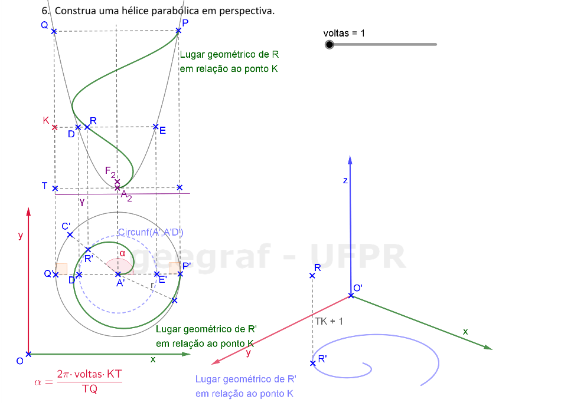
			   <figcaption>O lugar geométrico do ponto <b>R</b> na perspectiva em relação ao ponto <b>K</b> define a projeção da hélice parabólica na perspectiva.</figcaption>
		   </li>
		   <li>
			   <input type="radio" id="682" name="sl">
			   <label for="682"></label>
			   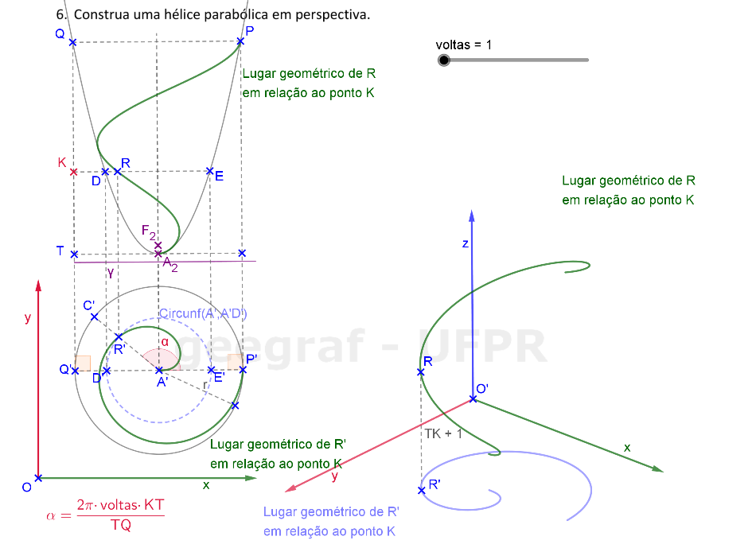
			   <figcaption>Modificando o valor do número <b>voltas</b>, temos outras hélices parabólicas representadas em projeções e também em perspectiva.</figcaption>
		   </li>
		</ul>
		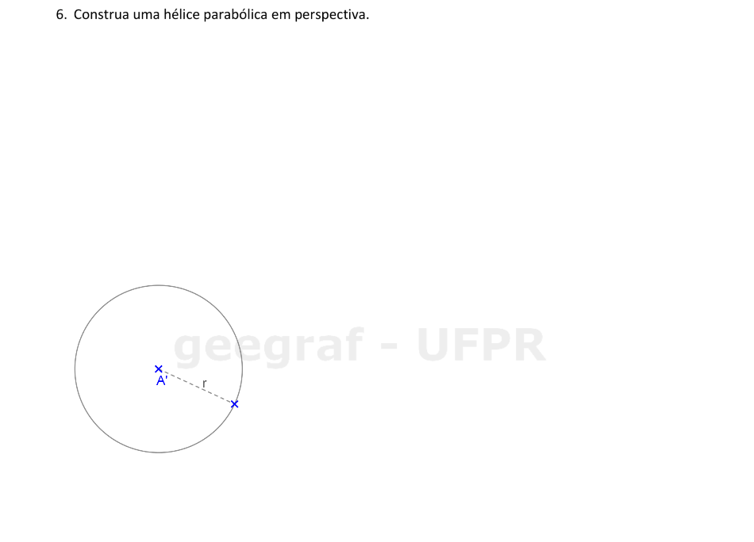
  

   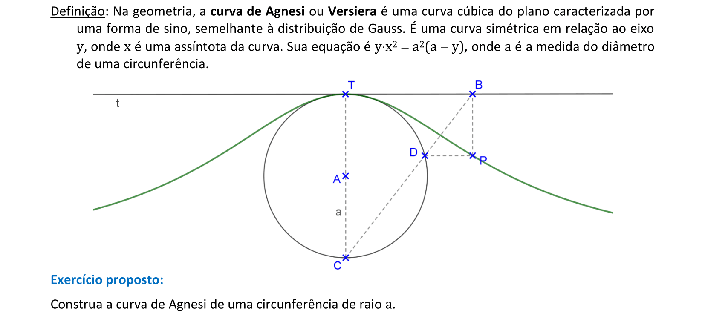
   

&#x1f4cf; &#x1f4d0; Resolução

	
Vamos construir uma curva de Agnesi a partir de uma circunferência de centro <b>A</b> e raio <b>a</b>.

	  <ul class="slider">
	  	   <li>
			   <input type="radio" id="683" name="sl">
			   <label for="683"></label>
			   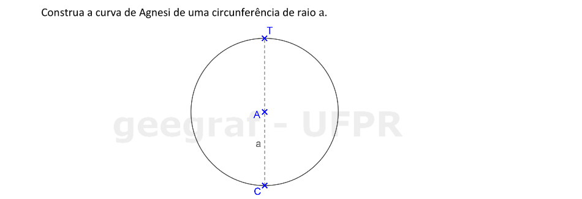
			   <figcaption>Começamos construindo um diâmetro <b>CT</b>.</figcaption>
		   </li>
		   <li>
			   <input type="radio" id="684" name="sl">
			   <label for="684"></label>
			   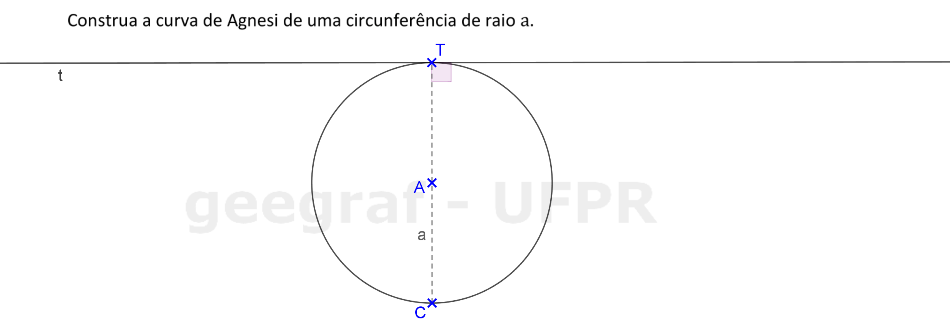
			   <figcaption>Na extremidade <b>T</b>, construa uma reta tangente <b>t</b>.</figcaption>
		   </li>
		   <li>
			   <input type="radio" id="685" name="sl">
			   <label for="685"></label>
			   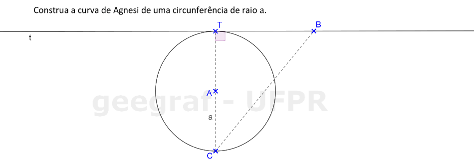
			   <figcaption>Escolha um ponto qualquer <b>B &isin; t</b> e defina o segmento <b>BC</b>.</figcaption>
		   </li>
		    <li>
			   <input type="radio" id="686" name="sl">
			   <label for="686"></label>
			   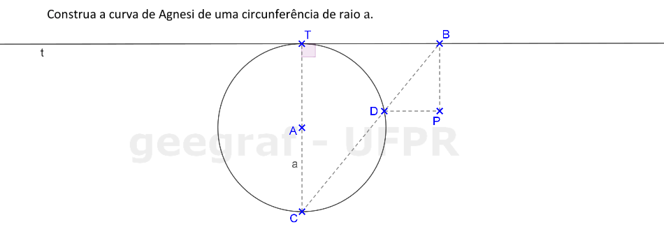
			   <figcaption>Encontre o ponto da circunferência <b>D &isin; BC</b> e o ponto <b>P</b> tal que <b>PD // t</b> e <b>PB // CT</b>.</figcaption>
		   </li>
		   <li>
			   <input type="radio" id="687" name="sl">
			   <label for="687"></label>
			   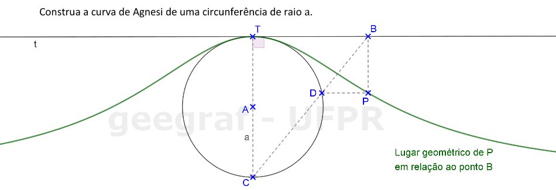
			   <figcaption>O lugar geométrico do ponto <b>P</b> em relação ao ponto <b>B</b> é a curva de Agnesi relativa à circunferência de centro <b>A</b> e raio <b>a</b>.</figcaption>
		   </li>
		</ul>
		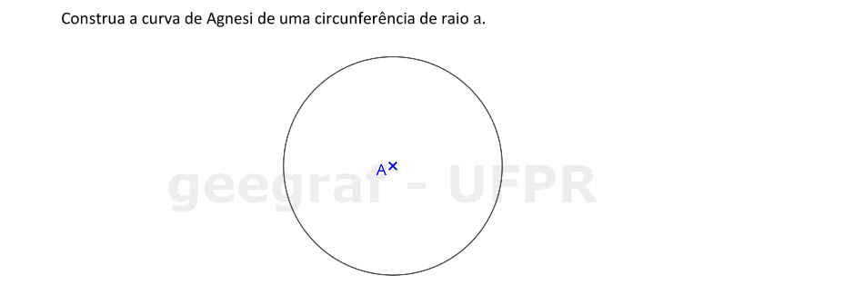
  

   
<a href="#modulo5" class="topo">voltar ao topo</a>

   
   

&#x1f4cf; &#x1f4d0; Resolução

	
Vamos construir uma curva logarítmica a partir dos eixos <b>x</b> e <b>y</b>.

	  <ul class="slider">
	  	   <li>
			   <input type="radio" id="688" name="sl">
			   <label for="688"></label>
			   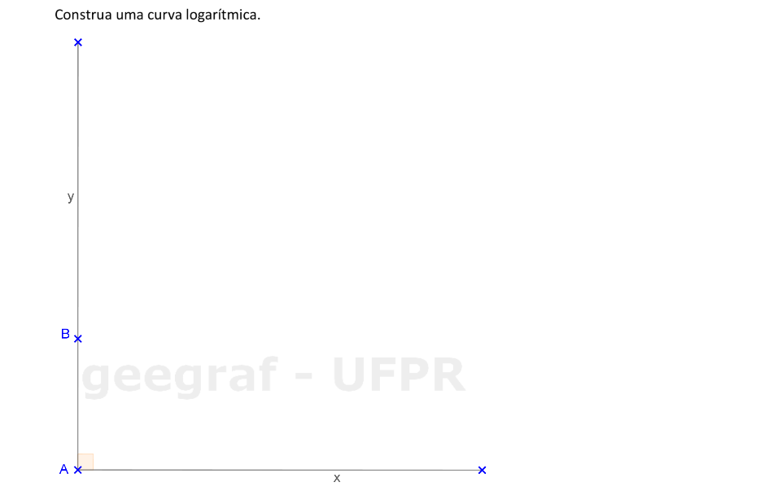
			   <figcaption>Começamos construindo um segmento <b>AB &isin; y</b> que será usado como parâmetro da curva.</figcaption>
		   </li>
		   <li>
			   <input type="radio" id="689" name="sl">
			   <label for="689"></label>
			   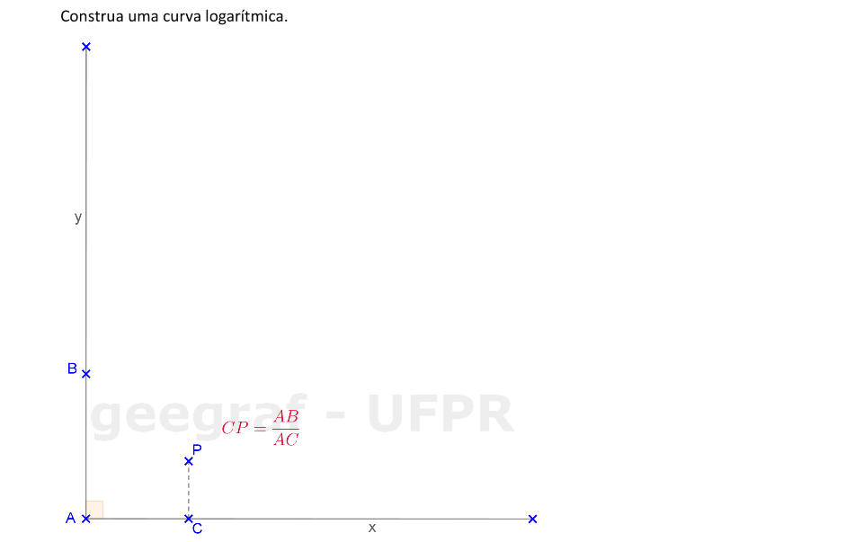
			   <figcaption>A curva logarítmica pode ser definida a partir de um ponto <b>C &isin; x</b> tal que $\mathsf{ CP = { {AB} \over {k \cdot AC} } }$.</figcaption>
		   </li>
		   <li>
			   <input type="radio" id="690" name="sl">
			   <label for="690"></label>
			   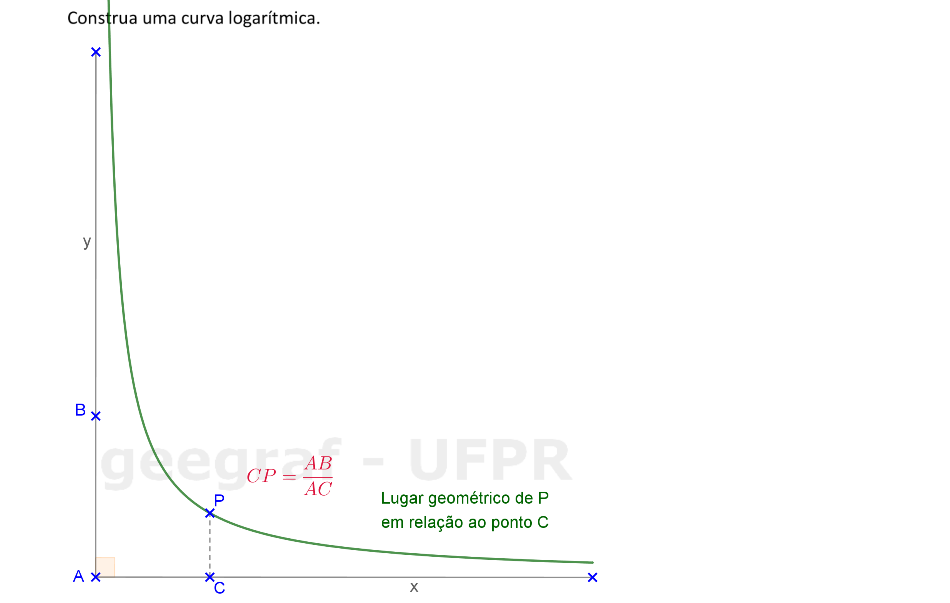
			   <figcaption>Se considerarmos <b>k = 1</b>, temos esta curva logarítmica como o lugar geométrico de <b>P</b> em relação ao ponto <b>C</b>. Escolha outros valores de <b>k</b> para construir outras curvas logarítmicas.</figcaption>
		   </li>
		</ul>
		
  

  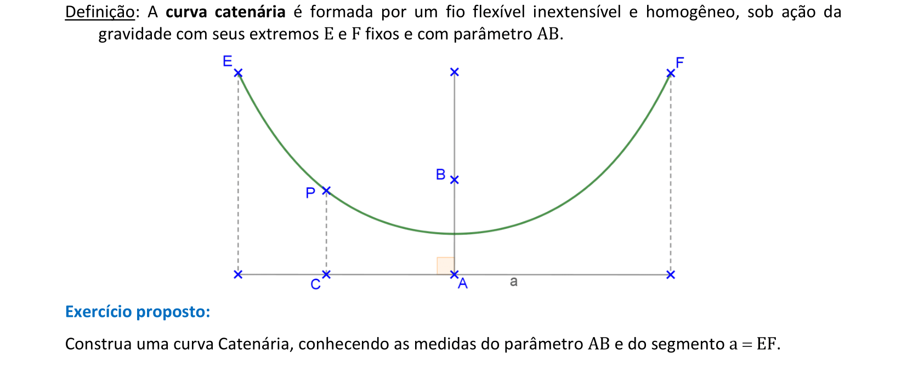
  

&#x1f4cf; &#x1f4d0; Resolução

	
Vamos construir uma curva Catenária a partir de dois segmentos perpendiculares.

	  <ul class="slider">
	  	   <li>
			   <input type="radio" id="691" name="sl">
			   <label for="691"></label>
			   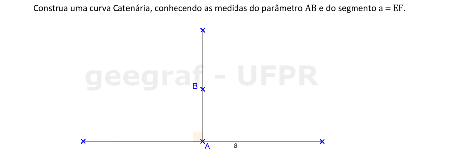
			   <figcaption>Começamos construindo um segmento <b>AB</b> que será usado como parâmetro da curva. Defina o segmento <b>a  &perp; AB</b>.</figcaption>
		   </li>
		   <li>
			   <input type="radio" id="692" name="sl">
			   <label for="692"></label>
			   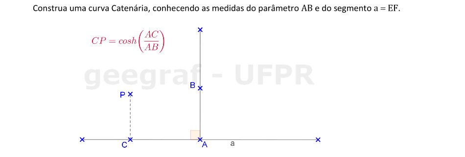
			   <figcaption>A curva Catenária pode ser definida a partir de um ponto <b>C &isin; a</b> tal que $\mathsf{ CP = cosh \left( { {AC} \over {AB} } \right) }$.</figcaption>
		   </li>
		   <li>
			   <input type="radio" id="693" name="sl">
			   <label for="693"></label>
			   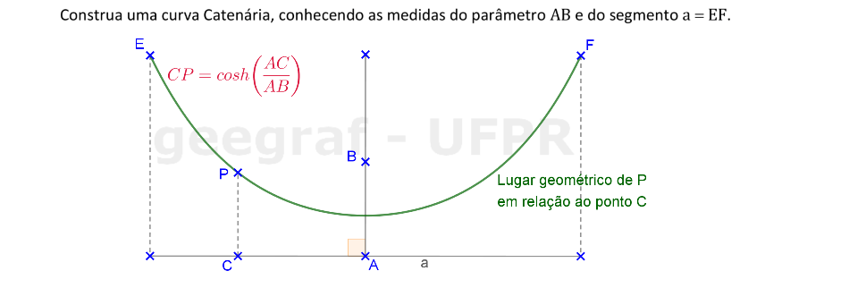
			   <figcaption>O lugar geométrico de <b>P</b> em relação ao ponto <b>C</b> é a curva Catenária com parâmetro <b>a</b>.</figcaption>
		   </li>
		</ul>
		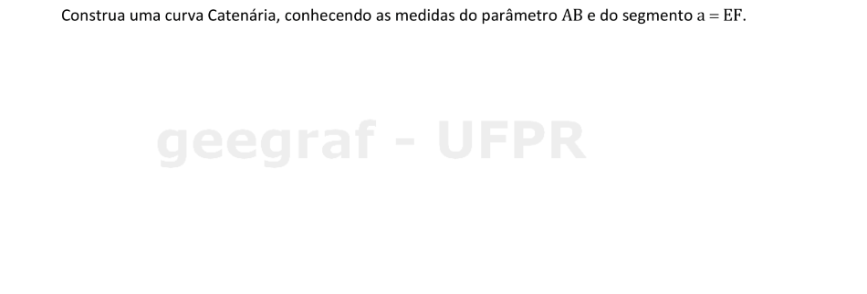
  

   
<a href="#modulo5" class="topo">voltar ao topo</a>

   
   

&#x1f4cf; &#x1f4d0; Resolução

	
Vamos construir uma curva de Cassini a partir dos segmentos <b>AA'</b> e <b>FF'</b>.

	  <ul class="slider">
	  	   <li>
			   <input type="radio" id="694" name="sl">
			   <label for="694"></label>
			   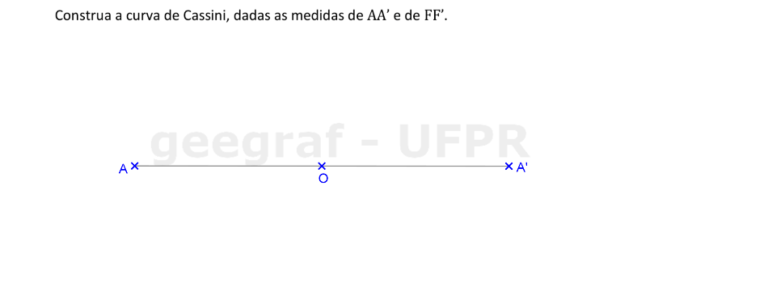
			   <figcaption>Construa o segmento <b>AA'</b> e encontre o ponto médio <b>O</b>, que será o centro da curva.</figcaption>
		   </li>
		   <li>
			   <input type="radio" id="695" name="sl">
			   <label for="695"></label>
			   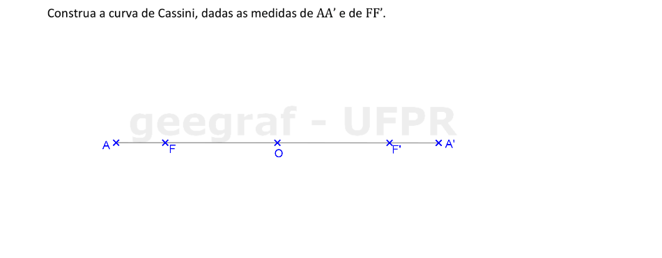
			   <figcaption>Determine os pontos <b>F</b> e <b>F'</b>, simétricos em relação ao centro <b>O</b>.</figcaption>
		   </li>
		   <li>
			   <input type="radio" id="696" name="sl">
			   <label for="696"></label>
			   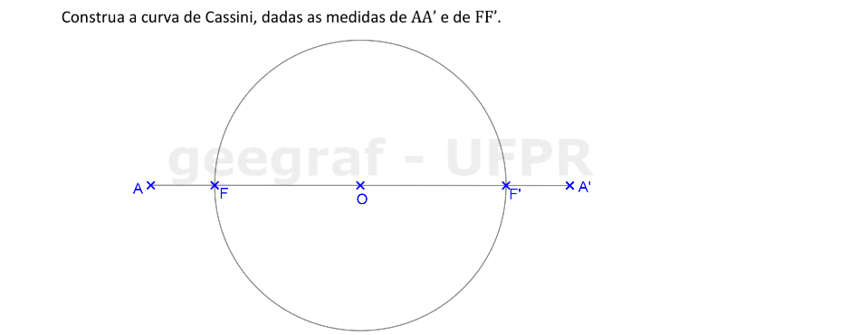
			   <figcaption>Construa a <b>Cirunf(O, OF)</b>.</figcaption>
		   </li>
		   <li>
			   <input type="radio" id="697" name="sl">
			   <label for="697"></label>
			   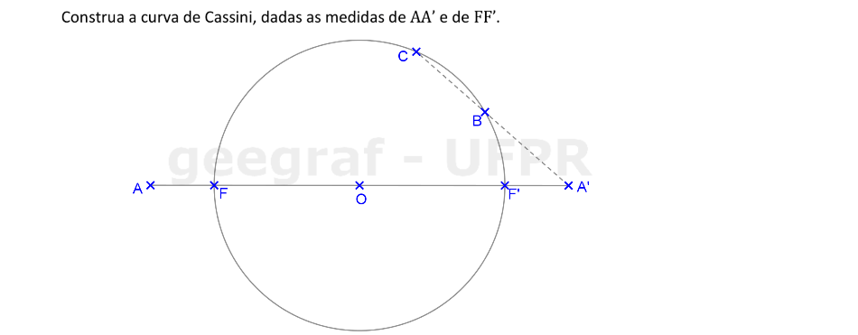
			   <figcaption>Determine um ponto <b>B</b> da circunferência e defina o segmento <b>A'C</b> tal que <b>B &isin; A'C</b>. Um ponto da curva de Cassini tem as distâncias aos focos com a potência de ponto fixa igual a <b>A'B&middot;A'C = a&sup2;</b>.</figcaption>
		   </li>
		   <li>
			   <input type="radio" id="698" name="sl">
			   <label for="698"></label>
			   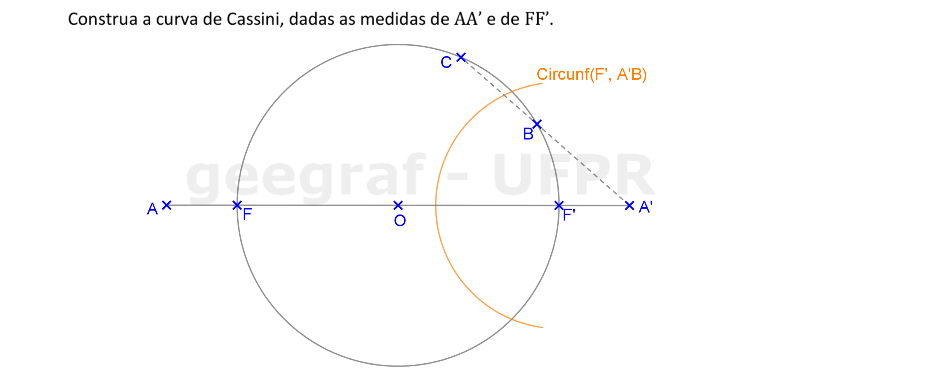
			   <figcaption>Para encontrar um ponto <b>P</b> da curva de Cassini, construa a <b>Circunf(F', A'B)</b>...</figcaption>
		   </li>
		   <li>
			   <input type="radio" id="699" name="sl">
			   <label for="699"></label>
			   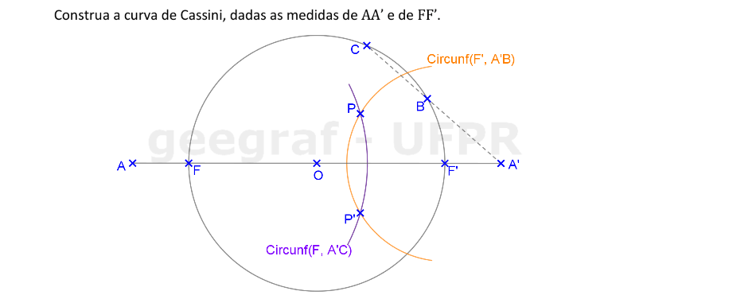
			   <figcaption>... e a <b>Circunf(F, A'C)</b>. A interseção destas duas circunferências define dois pontos da curva de Cassini, simétricos em relação ao diâmetro <b>AA'</b>.</figcaption>
		   </li>
		   <li>
			   <input type="radio" id="700" name="sl">
			   <label for="700"></label>
			   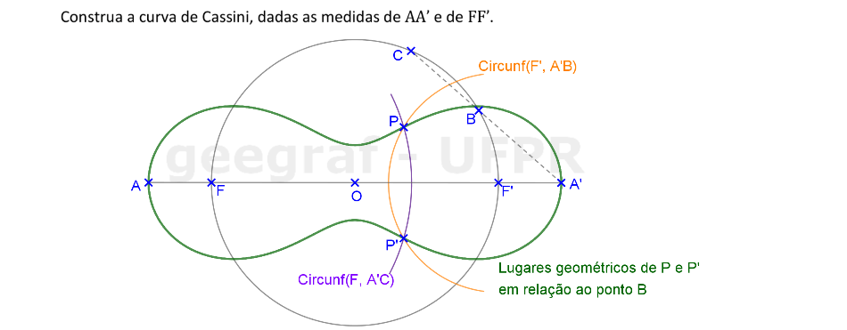
			   <figcaption>Os lugares geométricos de <b>P</b> e de <b>P'</b> em relação ao ponto <b>B</b> definem a curva de Cassini com parâmetros <b>AA'</b> e <b>FF'</b>.</figcaption>
		   </li>
		   <li>
			   <input type="radio" id="701" name="sl">
			   <label for="701"></label>
			   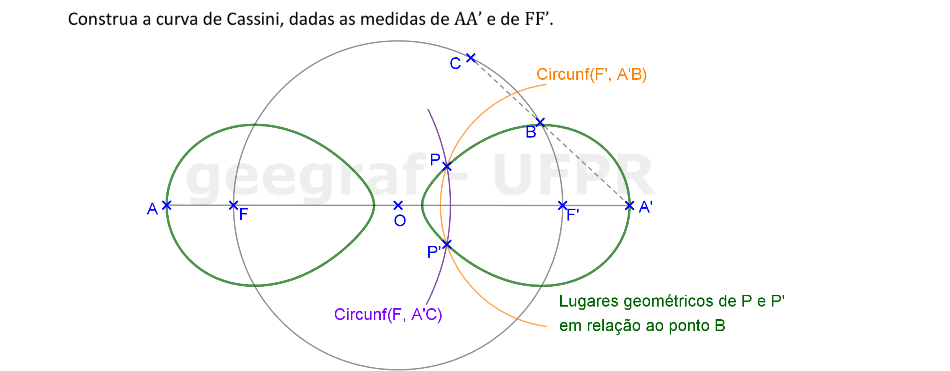
			   <figcaption>Modificando o tamanho de <b>FF'</b>, temos outros formatos da curvas de Cassini.</figcaption>
		   </li>
		   <li>
			   <input type="radio" id="702" name="sl">
			   <label for="702"></label>
			   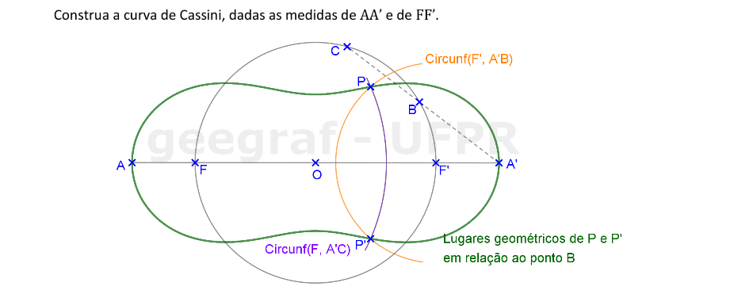
			   <figcaption>Modificando o tamanho de <b>FF'</b>, temos outros formatos da curvas de Cassini.</figcaption>
		   </li>
		</ul>
		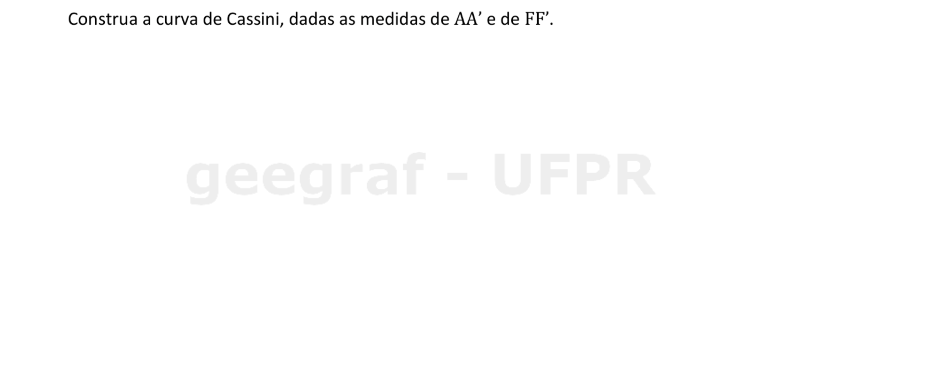
  

   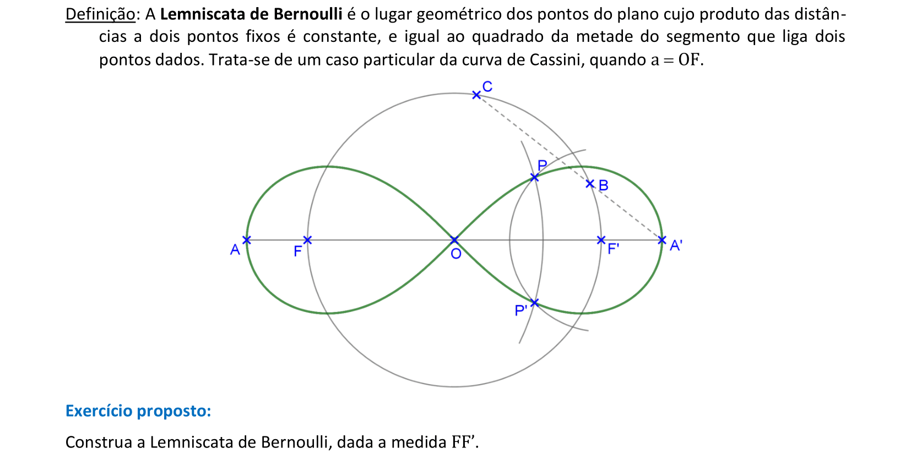
   

&#x1f4cf; &#x1f4d0; Resolução

	
Vamos construir uma curva lemniscata de Bernoulli a partir do segmento <b>FF'</b>.

	  <ul class="slider">
	  	   <li>
			   <input type="radio" id="703" name="sl">
			   <label for="703"></label>
			   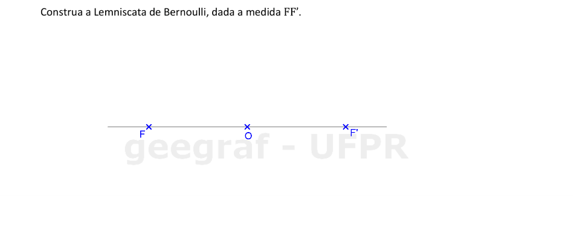
			   <figcaption>Construa o segmento <b>FF'</b> e encontre o ponto médio <b>O</b>, que será o centro da curva.</figcaption>
		   </li>
		   <li>
			   <input type="radio" id="704" name="sl">
			   <label for="704"></label>
			   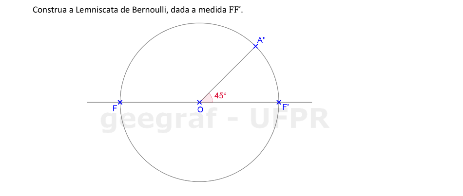
			   <figcaption>Determine o ângulo central <b>F'OA'' = 45&deg;</b>.</figcaption>
		   </li>
		   <li>
			   <input type="radio" id="705" name="sl">
			   <label for="705"></label>
			   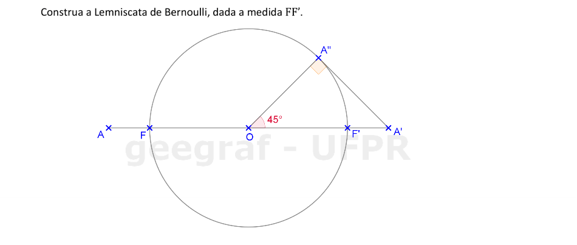
			   <figcaption>A lemniscata de Bernoulli é um caso especial da curva de Cassini, quando <b>a = OF</b>. Para determinar o ponto <b>A'</b>, basta construir o segmento <b>A''A'</b> tangente à circunferência. Logo, teremos que <b>A''A'&sup2; = a&sup2;</b>.</figcaption>
		   </li>
		   <li>
			   <input type="radio" id="706" name="sl">
			   <label for="706"></label>
			   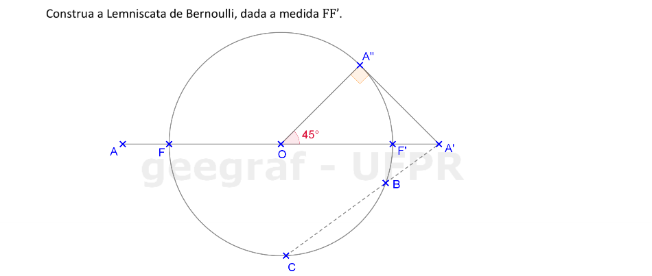
			   <figcaption>Determine um ponto <b>B</b> da circunferência e defina o segmento <b>A'C</b> tal que <b>B &isin; A'C</b>. Um ponto da lemniscata tem as distâncias aos focos com a potência de ponto fixa igual a <b>A'B&middot;A'C = a&sup2;</b>.</figcaption>
		   </li>
		   <li>
			   <input type="radio" id="707" name="sl">
			   <label for="707"></label>
			   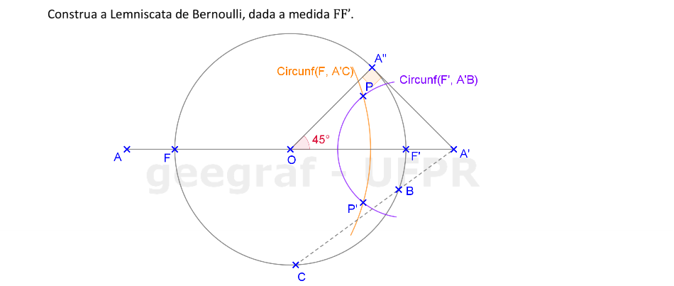
			   <figcaption>Para encontrar os pontos <b>P</b> e <b>P'</b> da lemniscata, construa as <b>Circunf(F', A'B)</b> e <b>Circunf(F, A'C)</b>.</figcaption>
		   </li>
		   <li>
			   <input type="radio" id="708" name="sl">
			   <label for="708"></label>
			   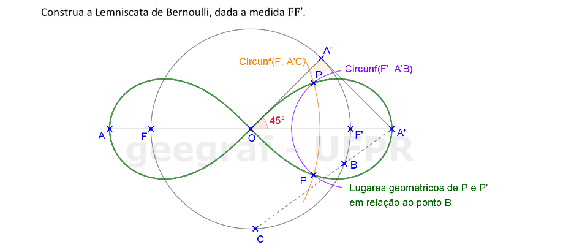
			   <figcaption>Os lugares geométricos de <b>P</b> e de <b>P'</b> em relação ao ponto <b>B</b> definem a lemniscata de Bernoulli com parâmetro <b>FF'</b>.</figcaption>
		   </li>
		</ul>
		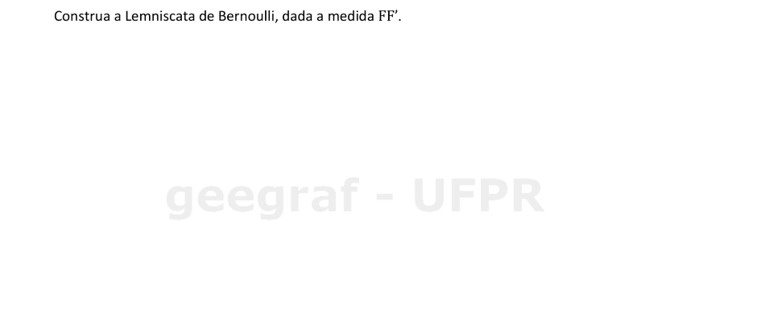
  

   
<a href="#modulo5" class="topo">voltar ao topo</a>

   
   

&#x1f4cf; &#x1f4d0; Resolução

	
Vamos construir uma quadratriz de Hippias a partir do segmento <b>AB</b>.

	  <ul class="slider">
	  	   <li>
			   <input type="radio" id="709" name="sl">
			   <label for="709"></label>
			   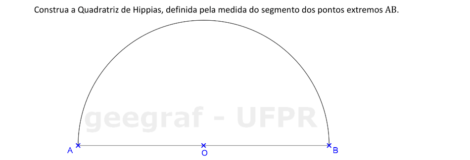
			   <figcaption>Construa a semicircunferência de diâmetro <b>AB</b>.</figcaption>
		   </li>
		   <li>
			   <input type="radio" id="710" name="sl">
			   <label for="710"></label>
			   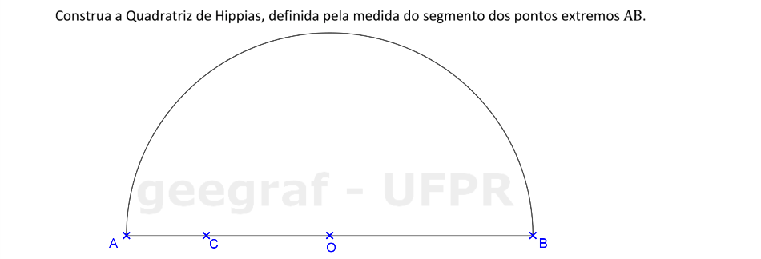
			   <figcaption>Determine um ponto <b>C &isin; AB</b>.</figcaption>
		   </li>
		   <li>
			   <input type="radio" id="711" name="sl">
			   <label for="711"></label>
			   
			   <figcaption>Defina o ângulo $\mathsf{ \alpha = { {AC \cdot \pi} \over {AB} } }$, ou seja, proporcional em relação ao ângulo de 180&deg; e ao diâmetro <b>AB</b>.</figcaption>
		   </li>
		   <li>
			   <input type="radio" id="712" name="sl">
			   <label for="712"></label>
			   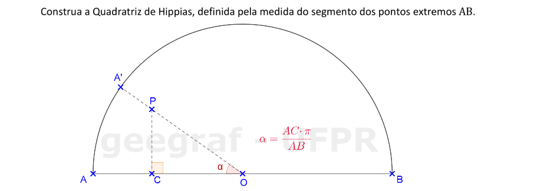
			   <figcaption>Determine um ponto <b>P</b> tal que <b>CP &perp; AB</b> e <b>P &isin; OA'</b>.</figcaption>
		   </li>
		   <li>
			   <input type="radio" id="713" name="sl">
			   <label for="713"></label>
			   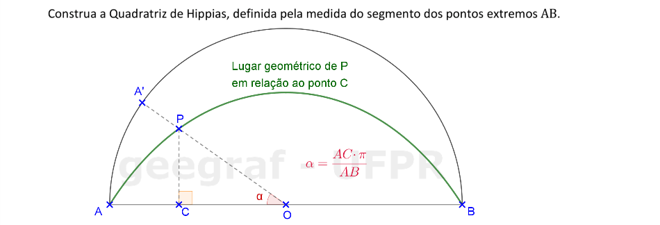
			   <figcaption>O lugar geométrico de <b>P</b> em relação ao ponto <b>C</b> define a quadratriz de Hippias com diâmetro <b>AB</b>.</figcaption>
		   </li>
		</ul>
		
  

   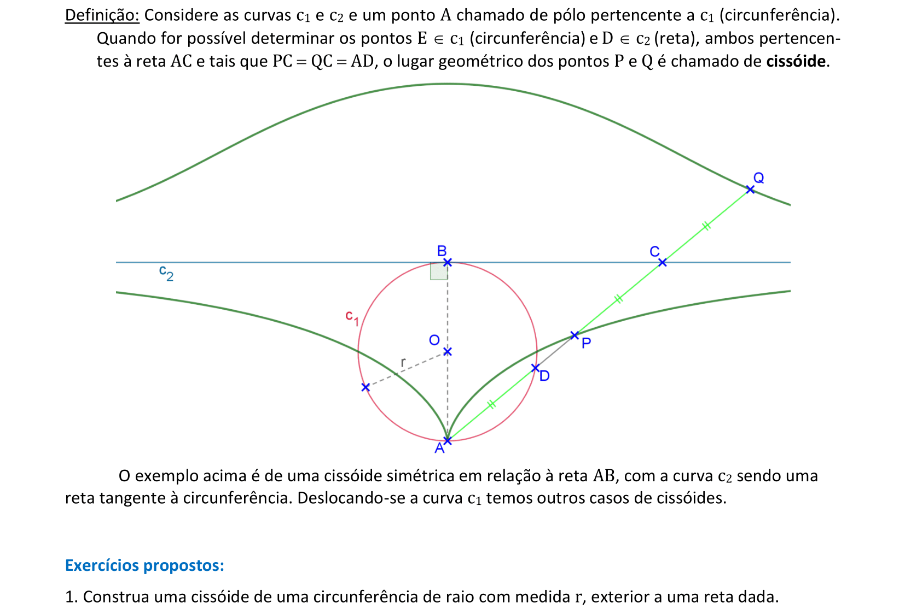
   

&#x1f4cf; &#x1f4d0; Resolução

	
Vamos construir uma cissóide de uma circunferência exterior a uma reta.

	  <ul class="slider">
	  	   <li>
			   <input type="radio" id="714" name="sl">
			   <label for="714"></label>
			   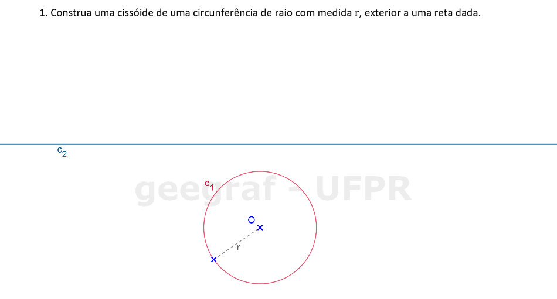
			   <figcaption>Construa uma circunferência de raio <b>r</b> (curva <b>c1</b>) e uma reta exterior a esta circunferência (curva <b>c2</b>).</figcaption>
		   </li>
		   <li>
			   <input type="radio" id="715" name="sl">
			   <label for="715"></label>
			   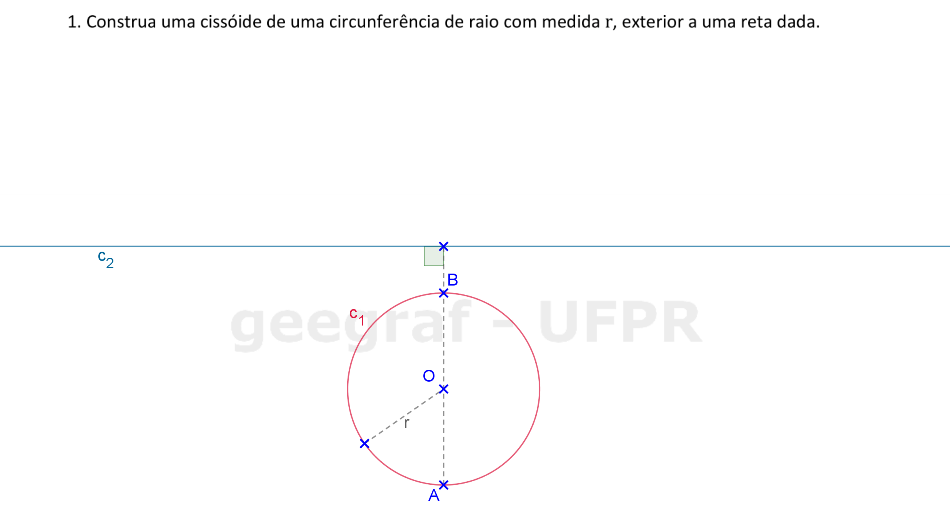
			   <figcaption>Construa o diâmetro <b>AB &perp; c2</b>.</figcaption>
		   </li>
		   <li>
			   <input type="radio" id="716" name="sl">
			   <label for="716"></label>
			   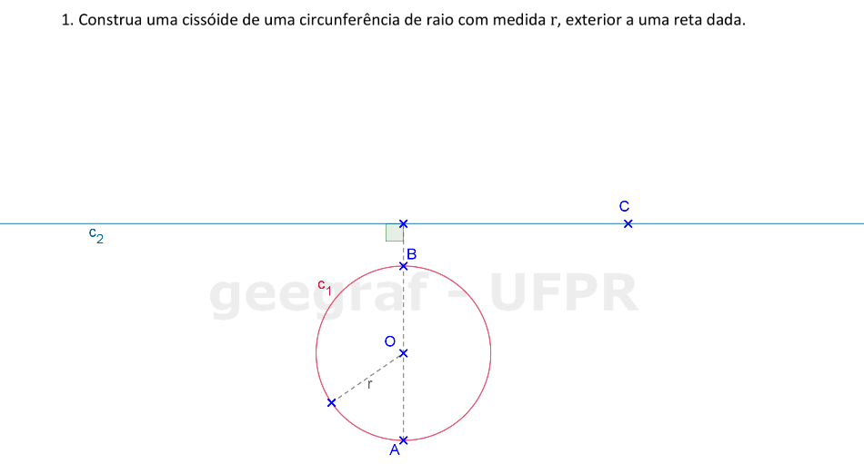
			   <figcaption>Defina o ponto <b>C &isin; c2</b>.</figcaption>
		   </li>
		   <li>
			   <input type="radio" id="717" name="sl">
			   <label for="717"></label>
			   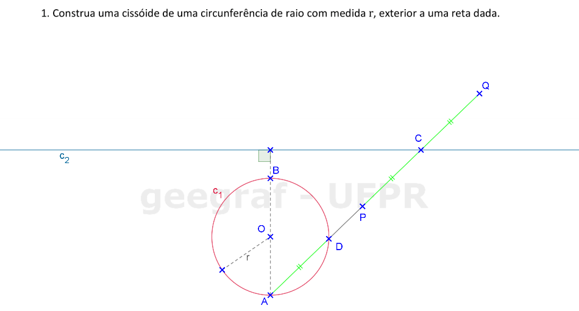
			   <figcaption>Determine os pontos <b>P &isin; AC</b> e <b>Q &isin; AC</b> tais que <b>CP = CQ = AD</b>.</figcaption>
		   </li>
		   <li>
			   <input type="radio" id="718" name="sl">
			   <label for="718"></label>
			   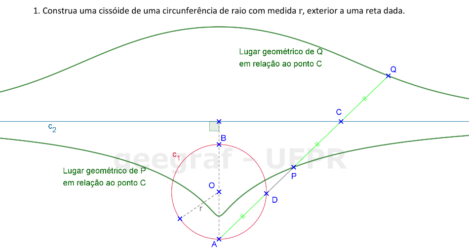
			   <figcaption>Os lugares geométricos de <b>P</b> e de <b>Q</b> em relação ao ponto <b>C</b> definem a cissóide das curvas <b>c1</b> e <b>c2</b>.</figcaption>
		   </li>
		</ul>
		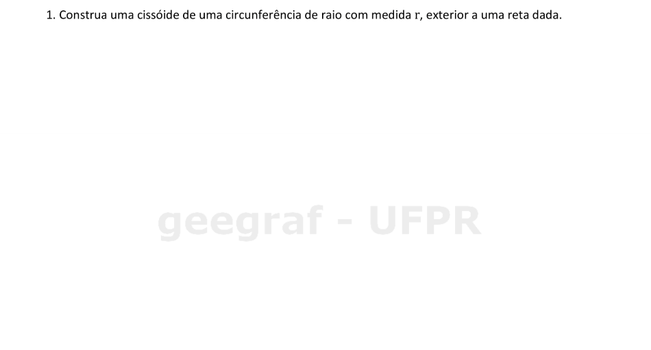
  

   
   

&#x1f4cf; &#x1f4d0; Resolução

	
Vamos construir uma cissóide de uma circunferência tangente a uma reta.

	  <ul class="slider">
	  	   <li>
			   <input type="radio" id="719" name="sl">
			   <label for="719"></label>
			   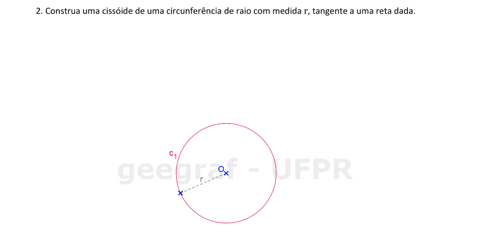
			   <figcaption>Construa uma circunferência de raio <b>r</b> (curva <b>c1</b>).</figcaption>
		   </li>
		   <li>
			   <input type="radio" id="719a" name="sl">
			   <label for="719a"></label>
			   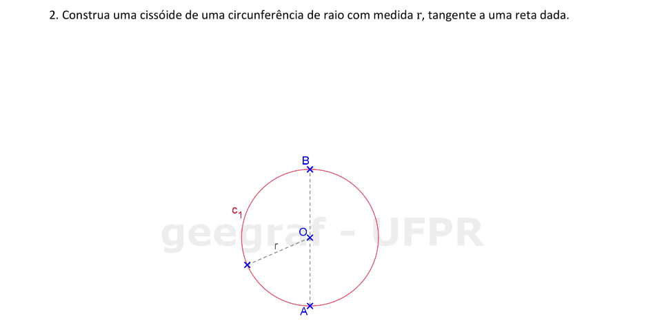
			   <figcaption>Construa o diâmetro <b>AB</b>.</figcaption>
		   </li>
		   <li>
			   <input type="radio" id="720" name="sl">
			   <label for="720"></label>
			   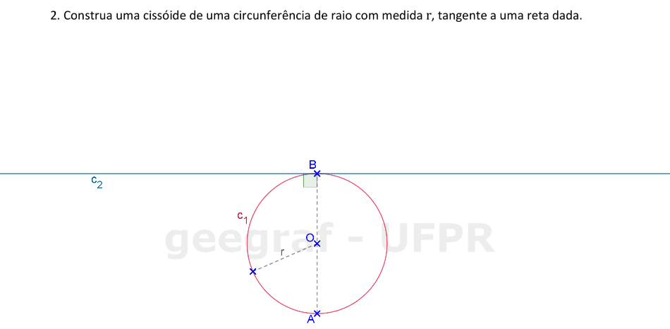
			   <figcaption>Construa a reta tangente à circunferência (curva <b>c2</b>) pela extremidade <b>B</b>.</figcaption>
		   </li>
		   <li>
			   <input type="radio" id="721" name="sl">
			   <label for="721"></label>
			   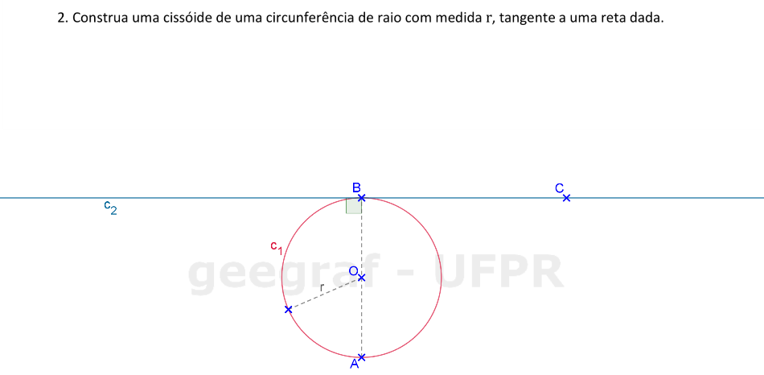
			   <figcaption>Defina o ponto <b>C &isin; c2</b>.</figcaption>
		   </li>
		   <li>
			   <input type="radio" id="722" name="sl">
			   <label for="722"></label>
			   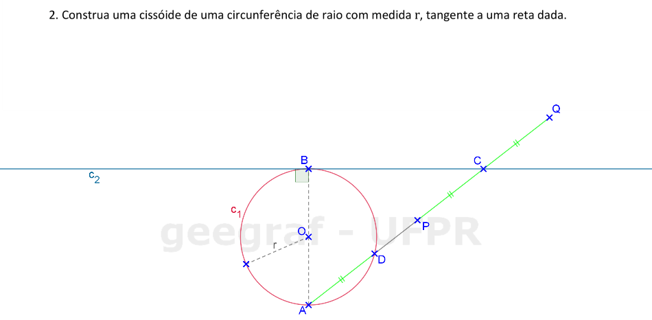
			   <figcaption>Determine os pontos <b>P &isin; AC</b> e <b>Q &isin; AC</b> tais que <b>CP = CQ = AD</b>.</figcaption>
		   </li>
		   <li>
			   <input type="radio" id="723" name="sl">
			   <label for="723"></label>
			   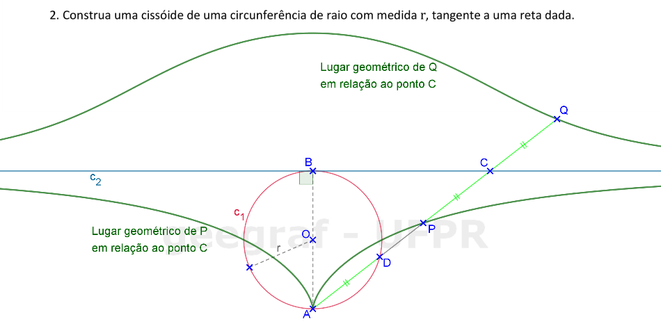
			   <figcaption>Os lugares geométricos de <b>P</b> e de <b>Q</b> em relação ao ponto <b>C</b> definem a cissóide das curvas <b>c1</b> e <b>c2</b>.</figcaption>
		   </li>
		</ul>
		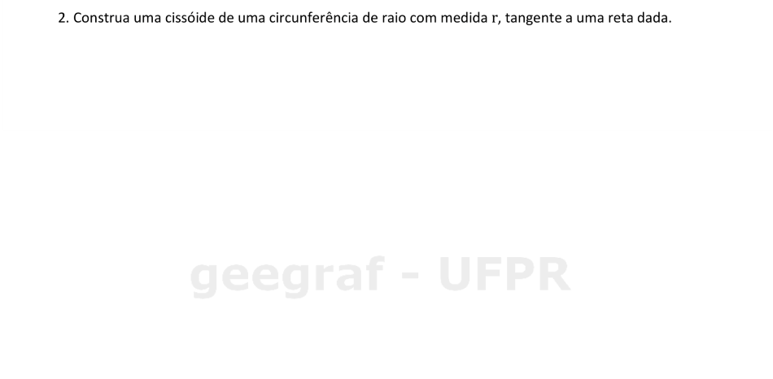
  

   
   
&#x1f4cf; &#x1f4d0; Exercício proposto 5.3

   
<a href="#modulo5" class="topo">voltar ao topo</a>

   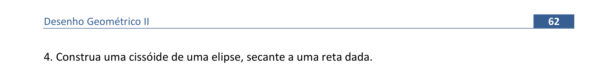
   

&#x1f4cf; &#x1f4d0; Resolução

	
Vamos construir uma cissóide de uma elipse secante a uma reta.

	  <ul class="slider">
	  	   <li>
			   <input type="radio" id="724" name="sl">
			   <label for="724"></label>
			   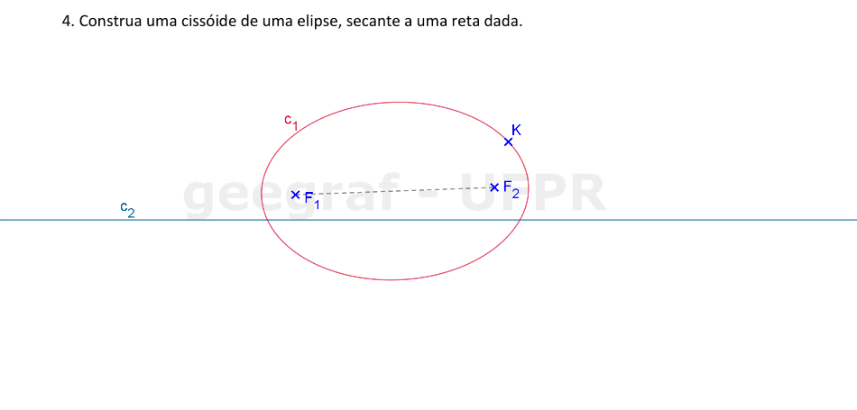
			   <figcaption>Construa uma elipse que contém um ponto <b>K</b> (curva <b>c1</b>) e uma reta secante a esta elipse (curva <b>c2</b>).</figcaption>
		   </li>
		   <li>
			   <input type="radio" id="725" name="sl">
			   <label for="725"></label>
			   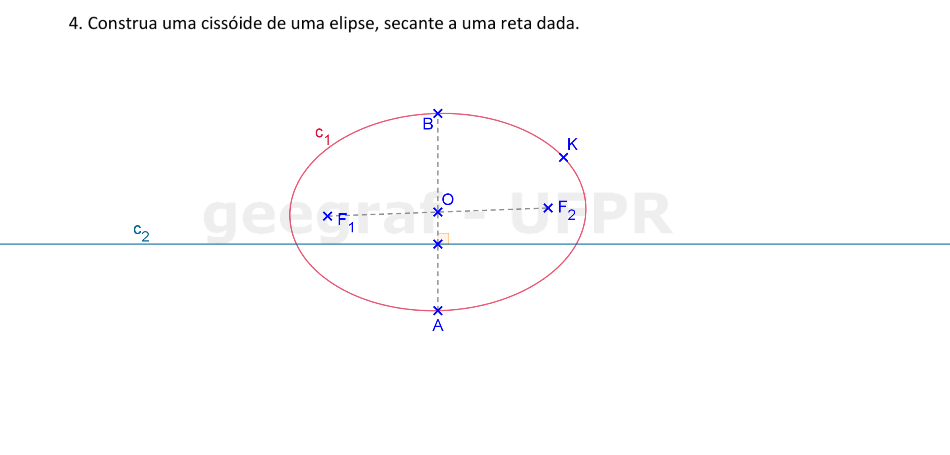
			   <figcaption>Construa o diâmetro <b>AB &perp; c2</b>.</figcaption>
		   </li>
		   <li>
			   <input type="radio" id="726" name="sl">
			   <label for="726"></label>
			   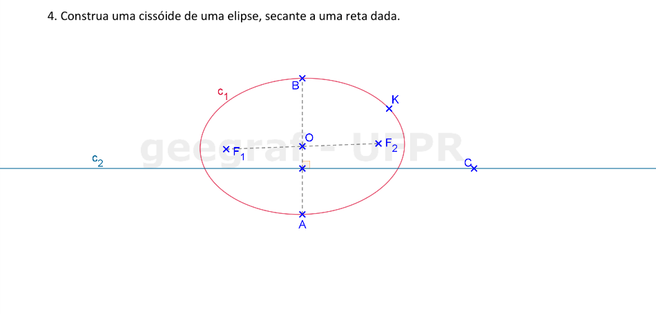
			   <figcaption>Defina o ponto <b>C &isin; c2</b>.</figcaption>
		   </li>
		   <li>
			   <input type="radio" id="727" name="sl">
			   <label for="727"></label>
			   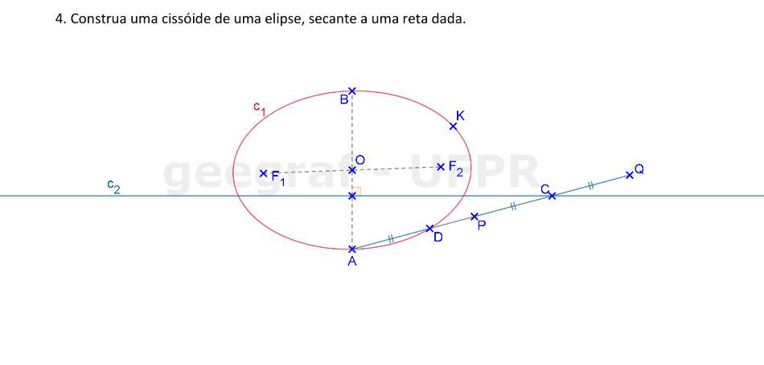
			   <figcaption>Determine os pontos <b>P &isin; AC</b> e <b>Q &isin; AC</b> tais que <b>CP = CQ = AD</b>.</figcaption>
		   </li>
		   <li>
			   <input type="radio" id="728" name="sl">
			   <label for="728"></label>
			   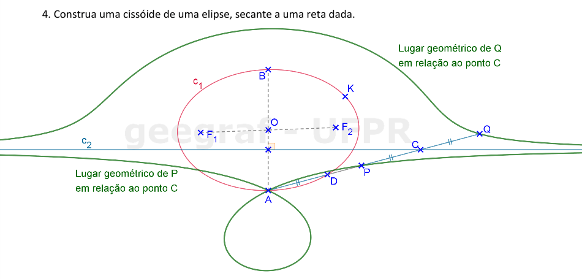
			   <figcaption>Os lugares geométricos de <b>P</b> e de <b>Q</b> em relação ao ponto <b>C</b> definem a cissóide das curvas <b>c1</b> e <b>c2</b>.</figcaption>
		   </li>
		</ul>
		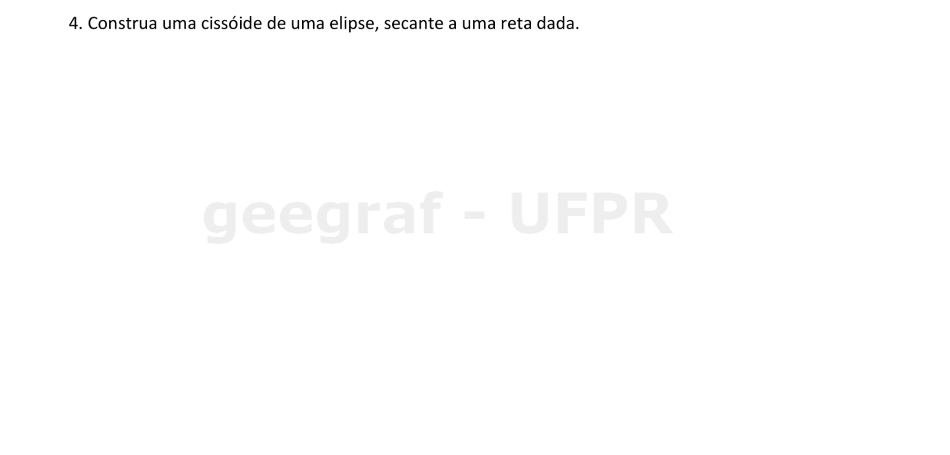
  

   
   

&#x1f4cf; &#x1f4d0; Resolução

	
Vamos construir uma cissóide de uma hipérbole secante a uma reta.

	  <ul class="slider">
	  	   <li>
			   <input type="radio" id="729" name="sl">
			   <label for="729"></label>
			   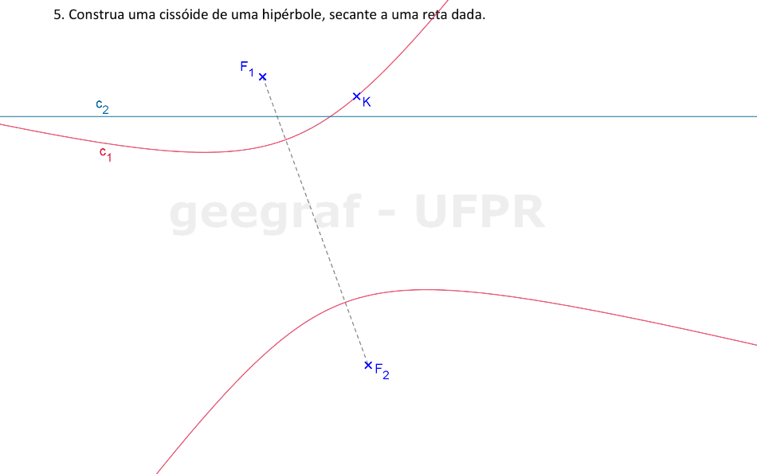
			   <figcaption>Construa uma hipérbole que contém um ponto <b>K</b> (curva <b>c1</b>) e uma reta secante a esta hipérbole (curva <b>c2</b>).</figcaption>
		   </li>
		   <li>
			   <input type="radio" id="730" name="sl">
			   <label for="730"></label>
			   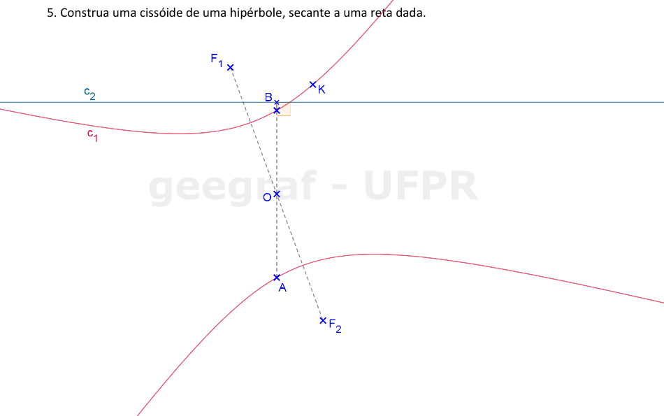
			   <figcaption>Construa o diâmetro <b>AB &perp; c2</b>.</figcaption>
		   </li>
		   <li>
			   <input type="radio" id="731" name="sl">
			   <label for="731"></label>
			   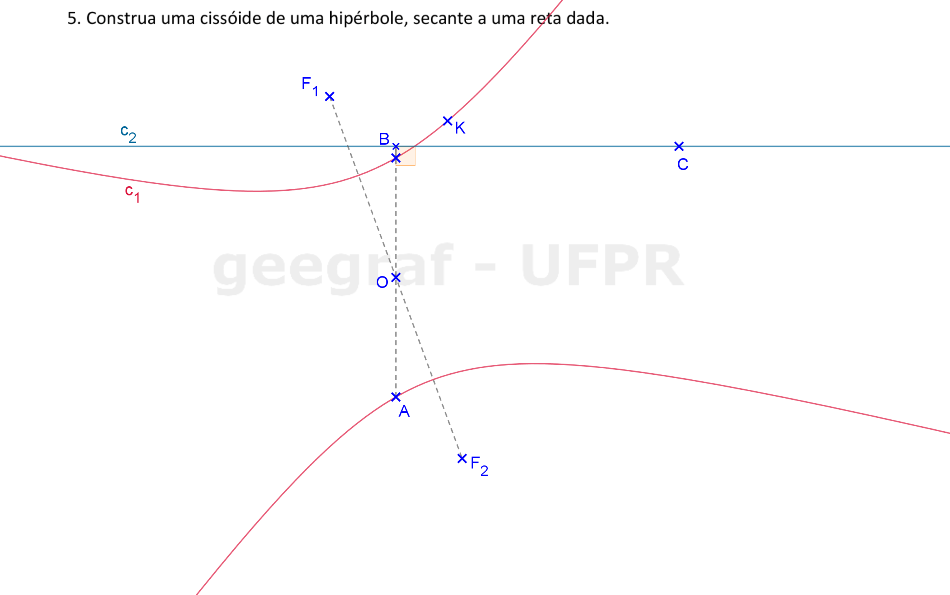
			   <figcaption>Defina o ponto <b>C &isin; c2</b>.</figcaption>
		   </li>
		   <li>
			   <input type="radio" id="732" name="sl">
			   <label for="732"></label>
			   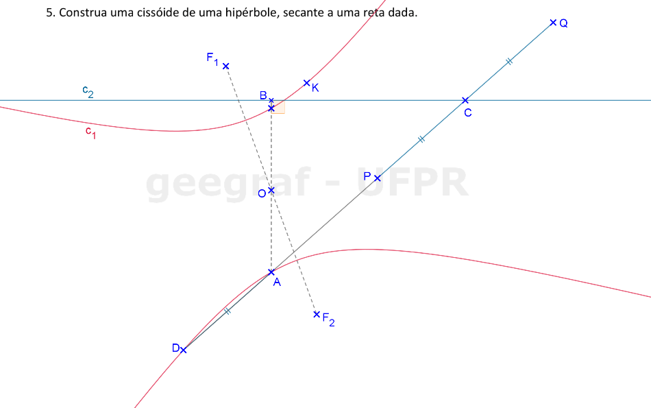
			   <figcaption>Determine os pontos <b>P &isin; AC</b> e <b>Q &isin; AC</b> tais que <b>CP = CQ = AD</b>.</figcaption>
		   </li>
		   <li>
			   <input type="radio" id="733" name="sl">
			   <label for="733"></label>
			   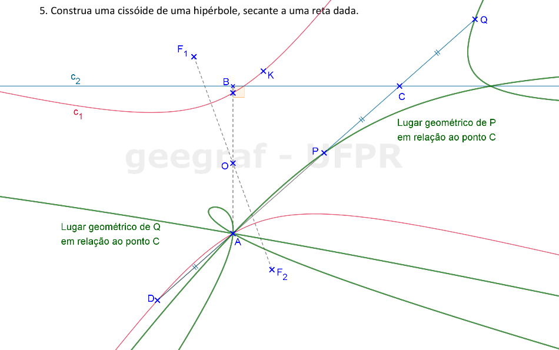
			   <figcaption>Os lugares geométricos de <b>P</b> e de <b>Q</b> em relação ao ponto <b>C</b> definem a cissóide das curvas <b>c1</b> e <b>c2</b>.</figcaption>
		   </li>
		</ul>
		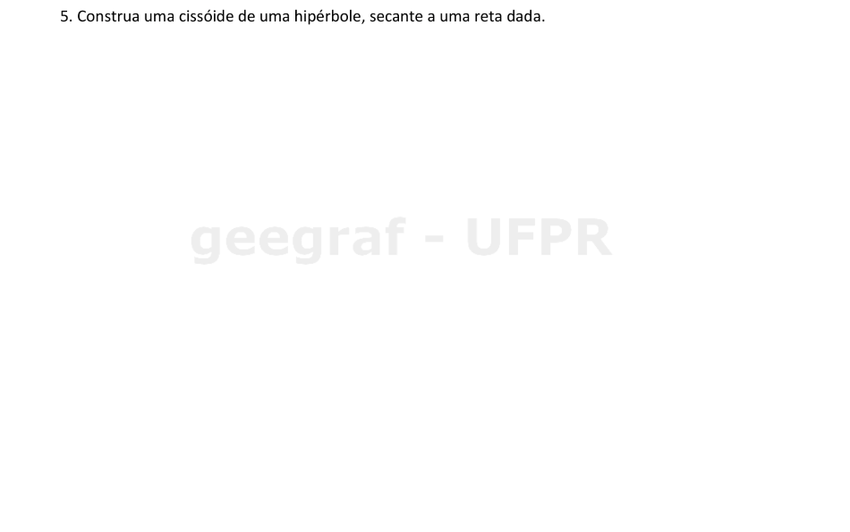
  

   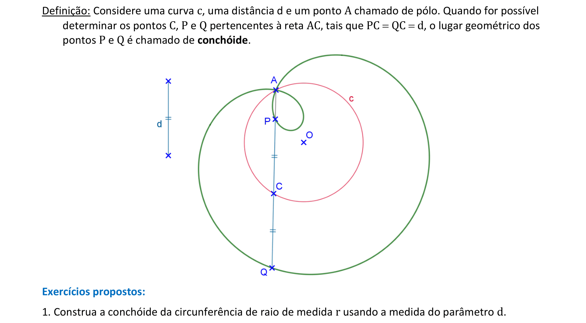
   

&#x1f4cf; &#x1f4d0; Resolução

	
Vamos construir uma conchóide de uma circunferência com parâmetro <b>d</b> e pólo <b>A</b>.

	  <ul class="slider">
	  	   <li>
			   <input type="radio" id="734" name="sl">
			   <label for="734"></label>
			   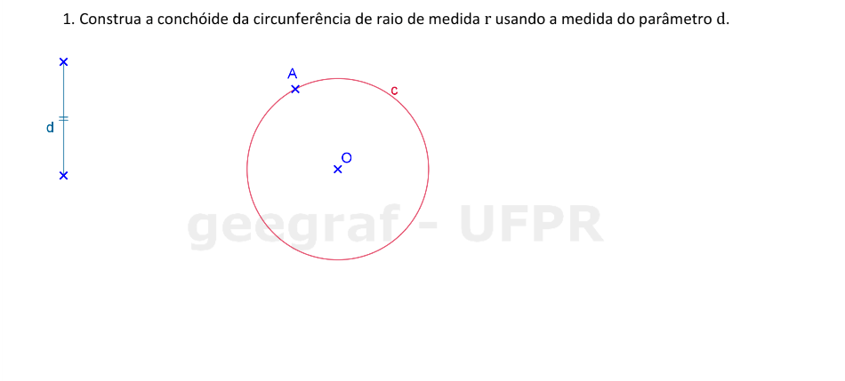
			   <figcaption>Construa uma circunferência de raio <b>OA</b> (curva <b>c</b>).</figcaption>
		   </li>
		   <li>
			   <input type="radio" id="735" name="sl">
			   <label for="735"></label>
			   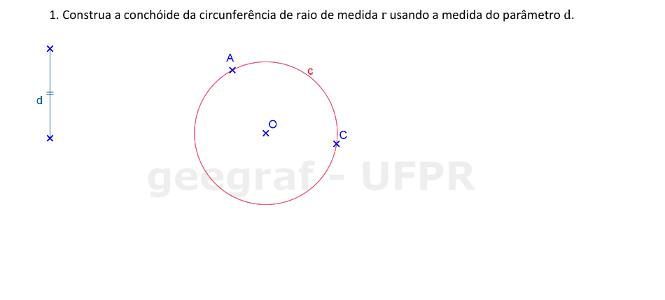
			   <figcaption>Defina o ponto <b>C &isin; c</b>.</figcaption>
		   </li>
		   <li>
			   <input type="radio" id="736" name="sl">
			   <label for="736"></label>
			   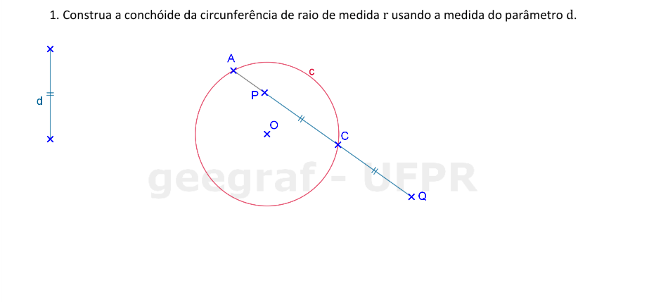
			   <figcaption>Determine os pontos <b>P &isin; AC</b> e <b>Q &isin; AC</b> tais que <b>CP = CQ = d</b>.</figcaption>
		   </li>
		   <li>
			   <input type="radio" id="737" name="sl">
			   <label for="737"></label>
			   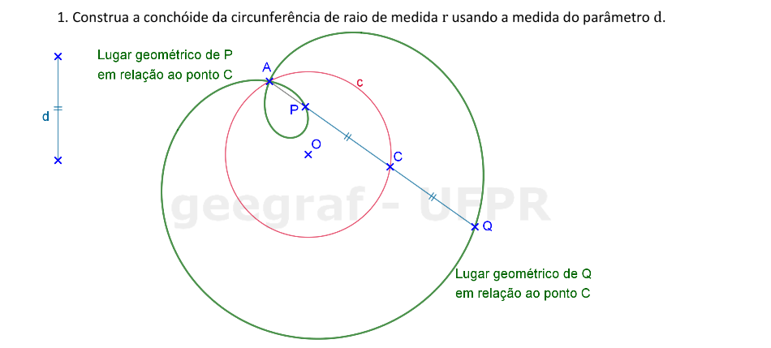
			   <figcaption>Os lugares geométricos de <b>P</b> e de <b>Q</b> em relação ao ponto <b>C</b> definem a conchóide da curva <b>c</b>.</figcaption>
		   </li>
		</ul>
		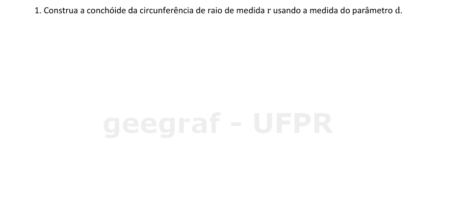
  

   
   

&#x1f4cf; &#x1f4d0; Resolução

	
Vamos construir uma conchóide de uma circunferência com parâmetro igual ao diâmetro <b>d</b> e pólo <b>A</b>.

	  <ul class="slider">
	  	   <li>
			   <input type="radio" id="738" name="sl">
			   <label for="738"></label>
			   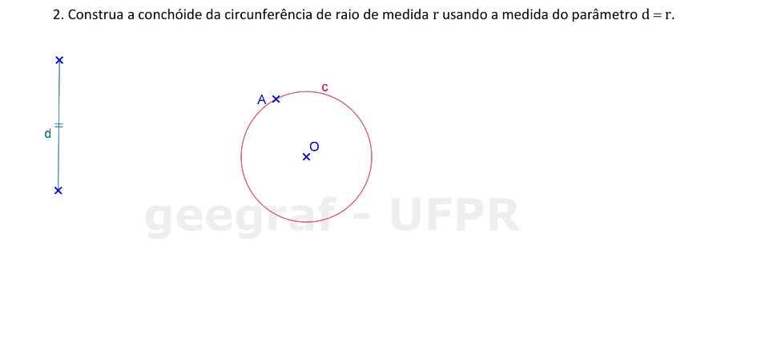
			   <figcaption>Construa uma circunferência com diâmetro <b>d</b> (curva <b>c</b>).</figcaption>
		   </li>
		   <li>
			   <input type="radio" id="739" name="sl">
			   <label for="739"></label>
			   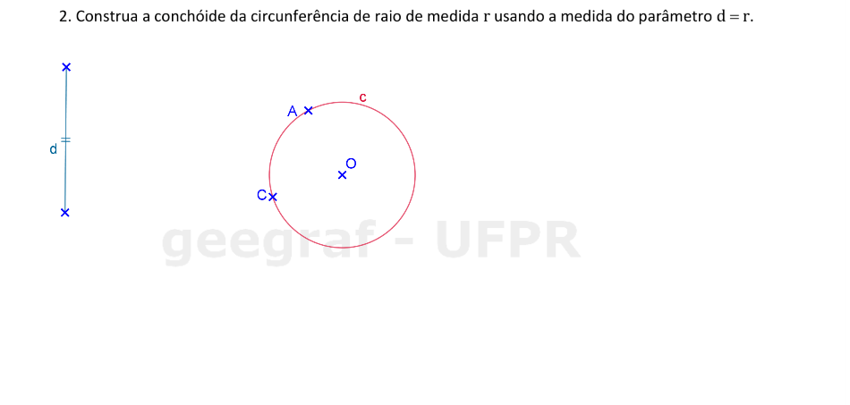
			   <figcaption>Defina o ponto <b>C &isin; c</b>.</figcaption>
		   </li>
		   <li>
			   <input type="radio" id="740" name="sl">
			   <label for="740"></label>
			   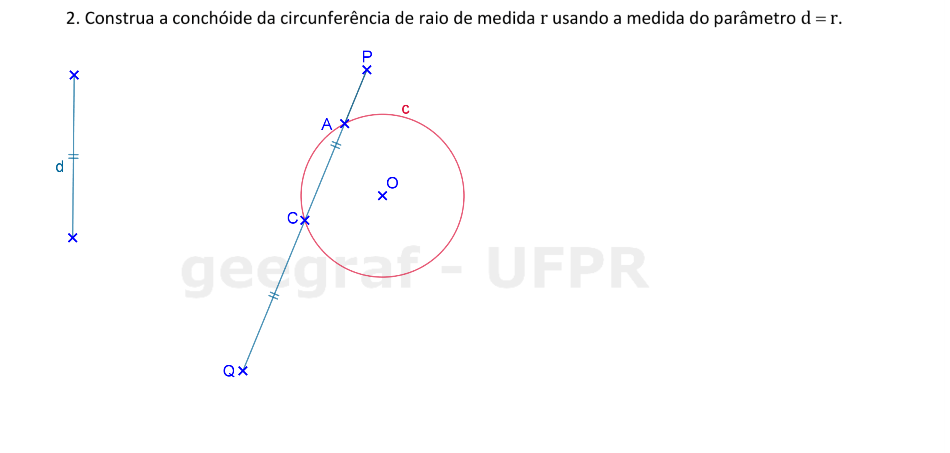
			   <figcaption>Determine os pontos <b>P &isin; AC</b> e <b>Q &isin; AC</b> tais que <b>CP = CQ = d</b>.</figcaption>
		   </li>
		   <li>
			   <input type="radio" id="741" name="sl">
			   <label for="741"></label>
			   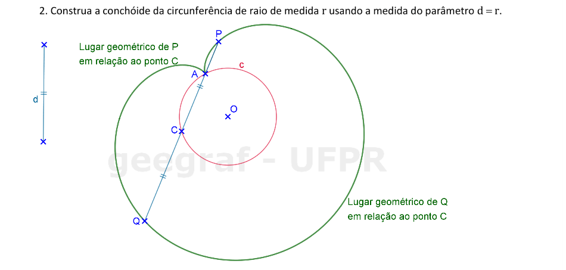
			   <figcaption>Os lugares geométricos de <b>P</b> e de <b>Q</b> em relação ao ponto <b>C</b> definem a conchóide da curva <b>c</b>. Este caso especial da conchóide chama-se cardióide.</figcaption>
		   </li>
		</ul>
		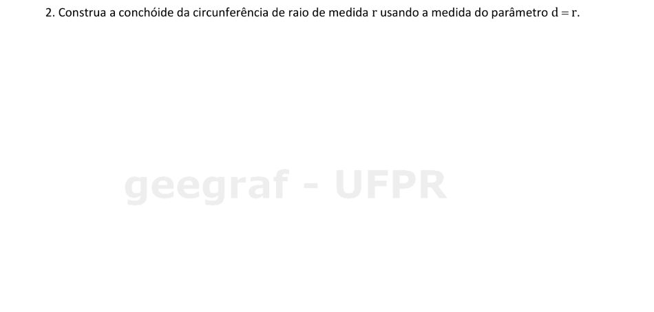
  

   
   

&#x1f4cf; &#x1f4d0; Resolução

	
Vamos construir uma conchóide de uma reta com parâmetro <b>d</b> e pólo <b>A</b>.

	  <ul class="slider">
	  	   <li>
			   <input type="radio" id="742" name="sl">
			   <label for="742"></label>
			   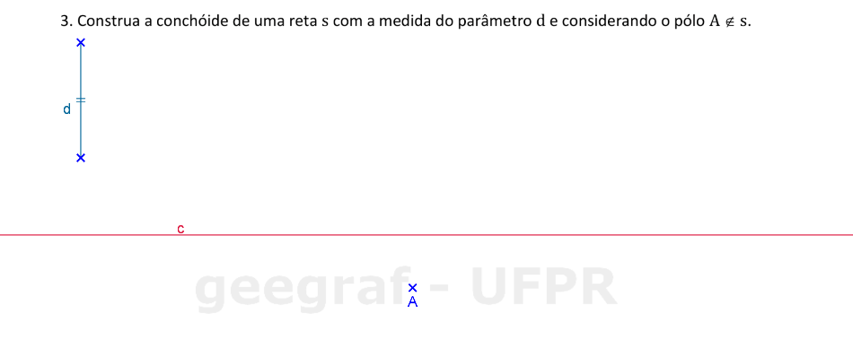
			   <figcaption>Construa uma reta (curva <b>c</b>) e determine um ponto <b>A</b> exterior à reta.</figcaption>
		   </li>
		   <li>
			   <input type="radio" id="743" name="sl">
			   <label for="743"></label>
			   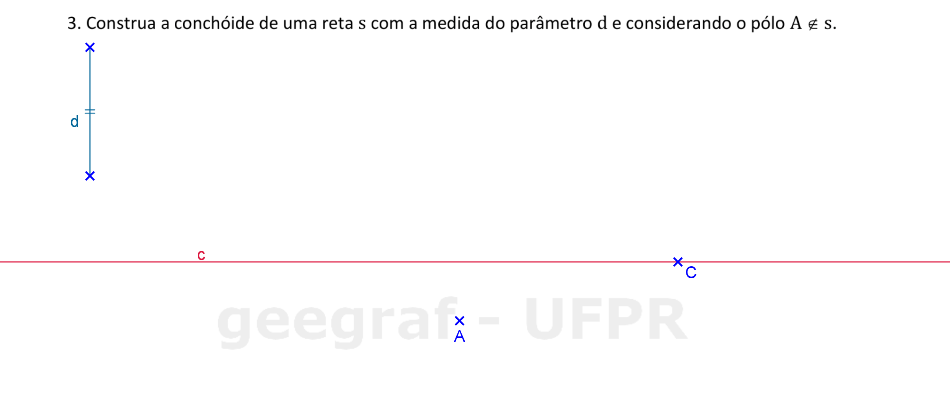
			   <figcaption>Defina o ponto <b>C &isin; c</b>.</figcaption>
		   </li>
		   <li>
			   <input type="radio" id="744" name="sl">
			   <label for="744"></label>
			   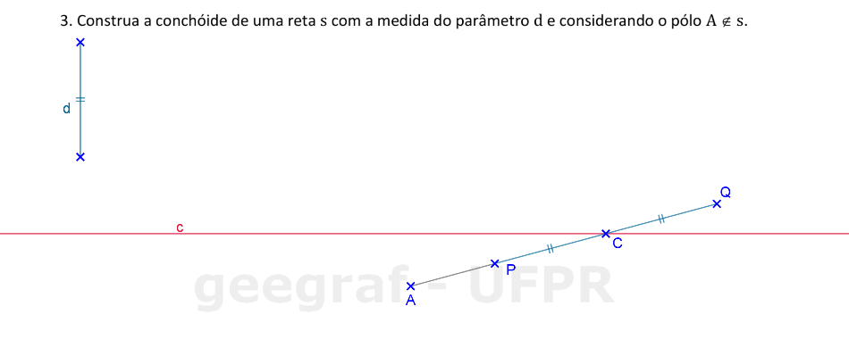
			   <figcaption>Determine os pontos <b>P &isin; AC</b> e <b>Q &isin; AC</b> tais que <b>CP = CQ = d</b>.</figcaption>
		   </li>
		   <li>
			   <input type="radio" id="745" name="sl">
			   <label for="745"></label>
			   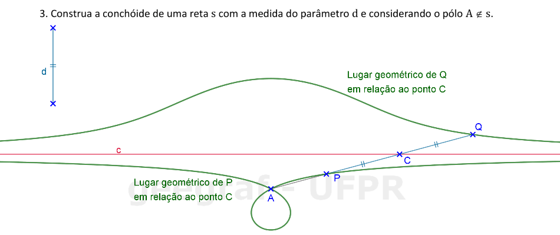
			   <figcaption>Os lugares geométricos de <b>P</b> e de <b>Q</b> em relação ao ponto <b>C</b> definem a conchóide da curva <b>c</b>.</figcaption>
		   </li>
		</ul>
		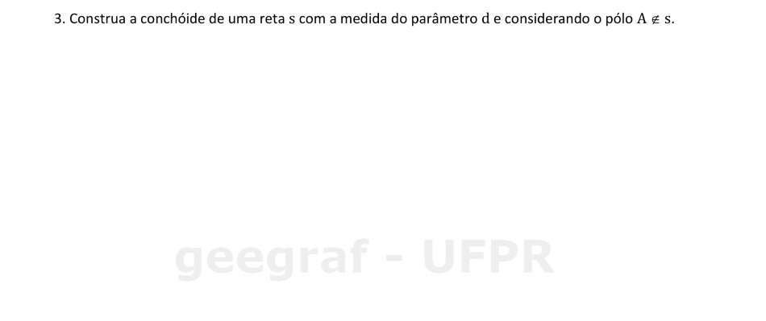
  

   
   
&#x1f4cf; &#x1f4d0; Exercício proposto 5.4

   
   

&#x1f4cf; &#x1f4d0; Resolução

	
Vamos construir uma conchóide de uma hipérbole com parâmetro <b>d</b> e pólo <b>A</b>.

	  <ul class="slider">
	  	   <li>
			   <input type="radio" id="746" name="sl">
			   <label for="746"></label>
			   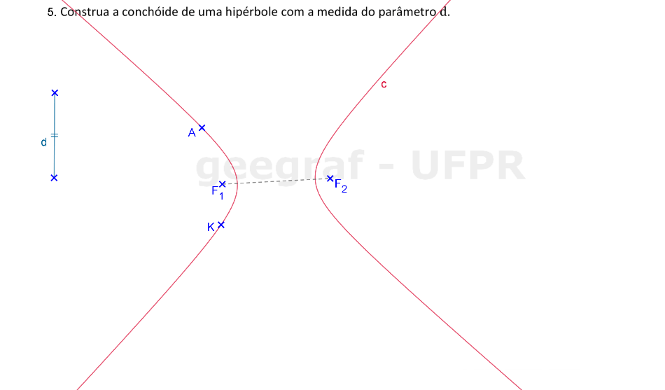
			   <figcaption>Construa uma hipérbole que contém um ponto <b>K</b> (curva <b>c</b>) e determine um ponto <b>A</b> da hipérbole.</figcaption>
		   </li>
		   <li>
			   <input type="radio" id="747" name="sl">
			   <label for="747"></label>
			   
			   <figcaption>Defina o ponto <b>C &isin; c</b>.</figcaption>
		   </li>
		   <li>
			   <input type="radio" id="748" name="sl">
			   <label for="748"></label>
			   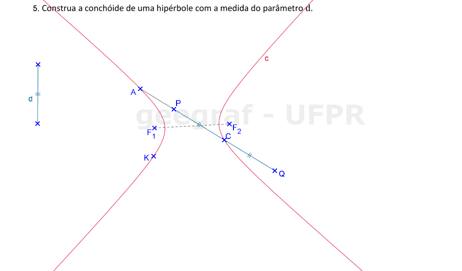
			   <figcaption>Determine os pontos <b>P &isin; AC</b> e <b>Q &isin; AC</b> tais que <b>CP = CQ = d</b>.</figcaption>
		   </li>
		   <li>
			   <input type="radio" id="749" name="sl">
			   <label for="749"></label>
			   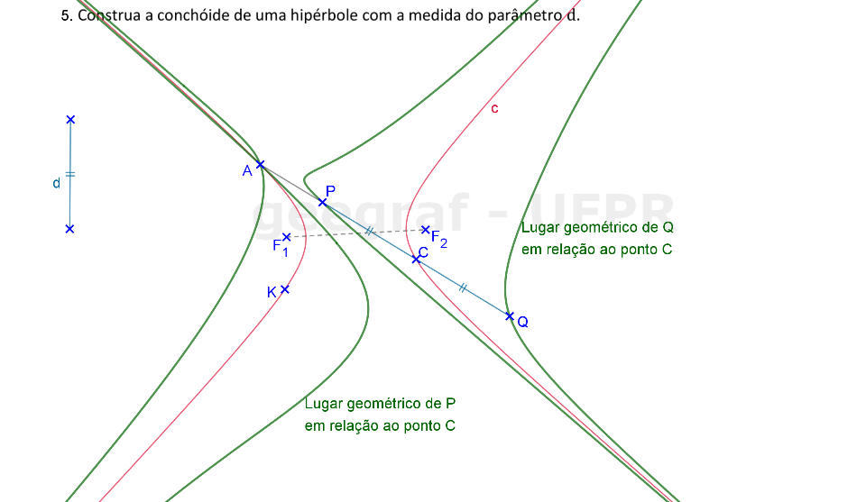
			   <figcaption>Os lugares geométricos de <b>P</b> e de <b>Q</b> em relação ao ponto <b>C</b> definem a conchóide da curva <b>c</b>.</figcaption>
		   </li>
		</ul>
		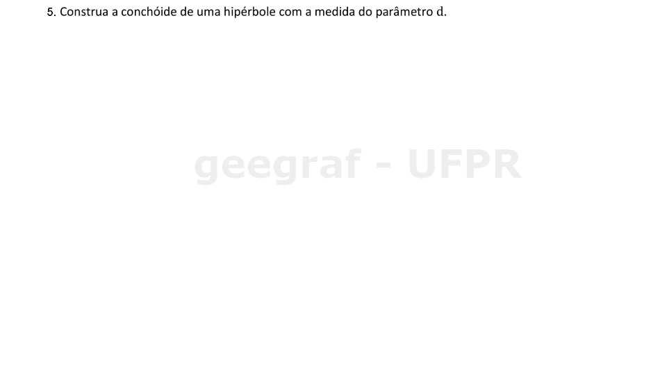
  

   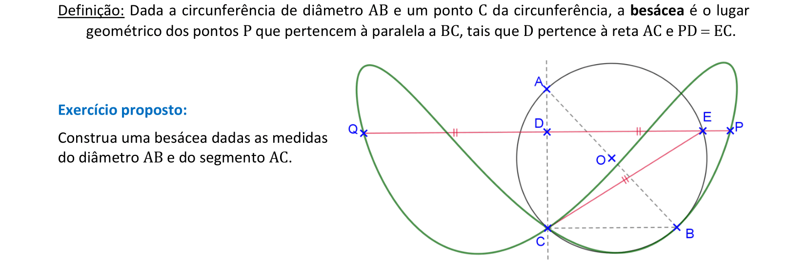
   

&#x1f4cf; &#x1f4d0; Resolução

	
Vamos construir uma besácea com parâmetros <b>AB</b> e <b>AC</b>.

	  <ul class="slider">
	  	   <li>
			   <input type="radio" id="750" name="sl">
			   <label for="750"></label>
			   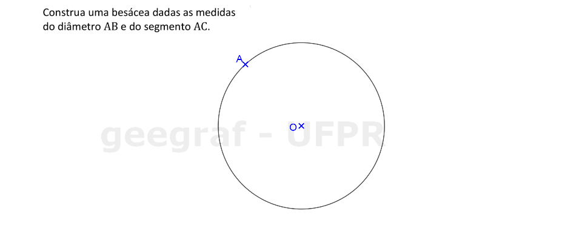
			   <figcaption>Construa uma circunferência de raio <b>OA</b>.</figcaption>
		   </li>
		   <li>
			   <input type="radio" id="751" name="sl">
			   <label for="751"></label>
			   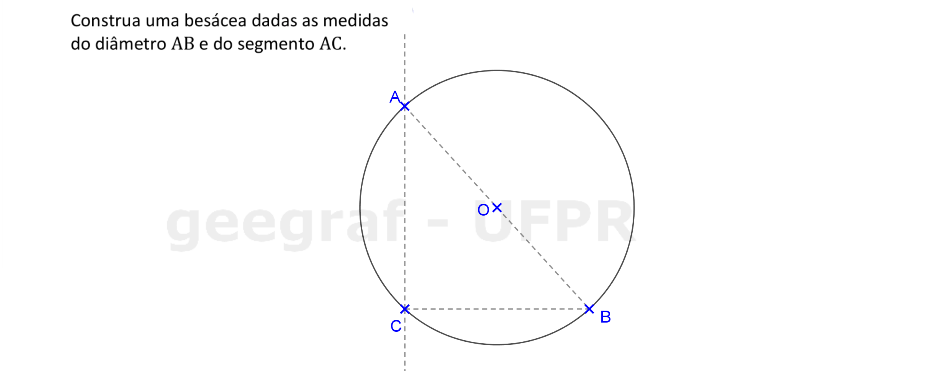
			   <figcaption>Defina o diâmetro <b>AB</b> e um ponto <b>C</b> da circunferência.</figcaption>
		   </li>
		   <li>
			   <input type="radio" id="752" name="sl">
			   <label for="752"></label>
			   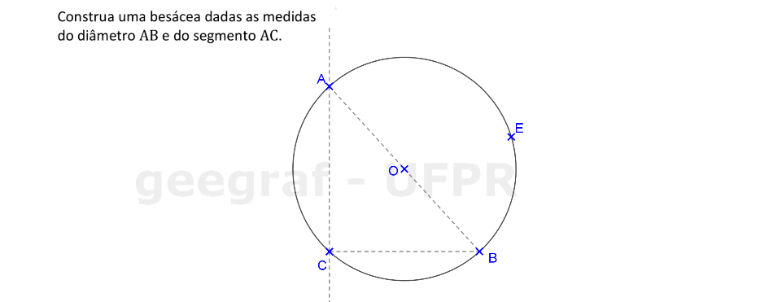
			   <figcaption>Determine um ponto <b>E</b> da circunferência.</figcaption>
		   </li>
		   <li>
			   <input type="radio" id="753" name="sl">
			   <label for="753"></label>
			   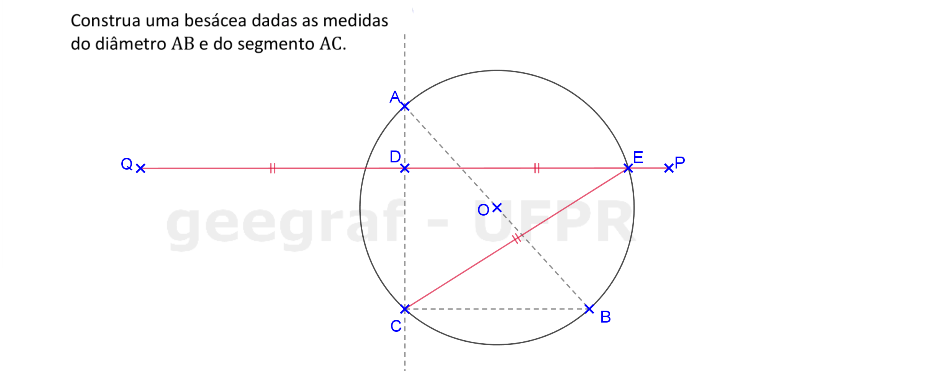
			   <figcaption>Construa a reta <b>ED // BC</b> e encontre os pontos <b>P &isin; ED</b> e <b>Q &isin; ED</b> tais que <b>PD = QD = EC</b>.</figcaption>
		   </li>
		   <li>
			   <input type="radio" id="754" name="sl">
			   <label for="754"></label>
			   
			   <figcaption>Os lugares geométricos de <b>P</b> e de <b>Q</b> em relação ao ponto <b>E</b> definem uma curva chamada besácea.</figcaption>
		   </li>
		</ul>
		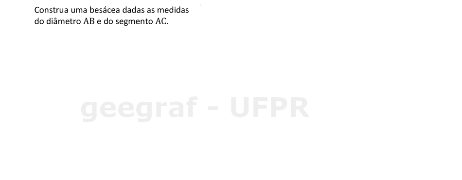
  

   
<a href="#modulo5" class="topo">voltar ao topo</a>

   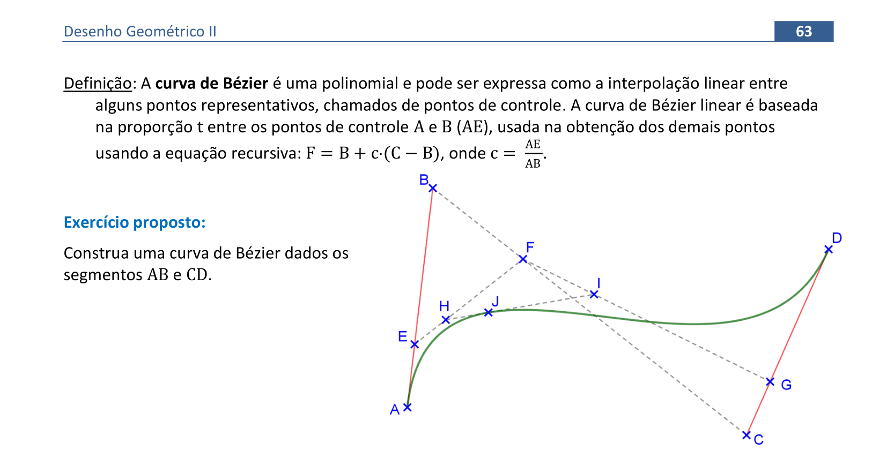
   

&#x1f4cf; &#x1f4d0; Resolução

	
Vamos construir uma curva de Bézier dados os segmentos de controle <b>AB</b> e <b>CD</b>.

	  <ul class="slider">
	  	   <li>
			   <input type="radio" id="755" name="sl">
			   <label for="755"></label>
			   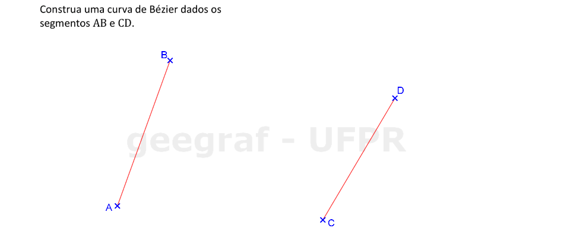
			   <figcaption>Determine os segmentos de controle <b>AB</b> e <b>CD</b>.</figcaption>
		   </li>
		   <li>
			   <input type="radio" id="756" name="sl">
			   <label for="756"></label>
			   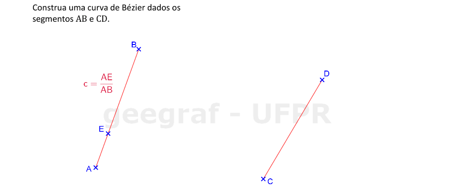
			   <figcaption>Defina um ponto <b>E &isin; AB</b> e a razão $\mathsf{ c = { {AE} \over {AB} } }$ relativa à medida <b>AB</b>. Usaremos este número para encontrar os pontos correspondentes nos outros segmentos.</figcaption>
		   </li>
		   <li>
			   <input type="radio" id="757" name="sl">
			   <label for="757"></label>
			   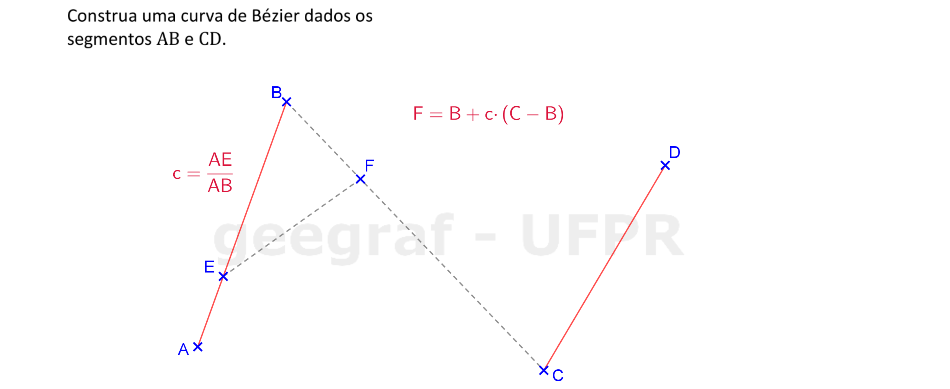
			   <figcaption>Determine o ponto <b>F &isin; BC</b> tal que <b>F = B + c&middot;(C - B)</b>. Desta forma, temos o ponto <b>F</b> com a mesma razão de distâncias do ponto <b>E</b>, porém, em relação ao segmento <b>BC</b>.</figcaption>
		   </li>
		   <li>
			   <input type="radio" id="758" name="sl">
			   <label for="758"></label>
			   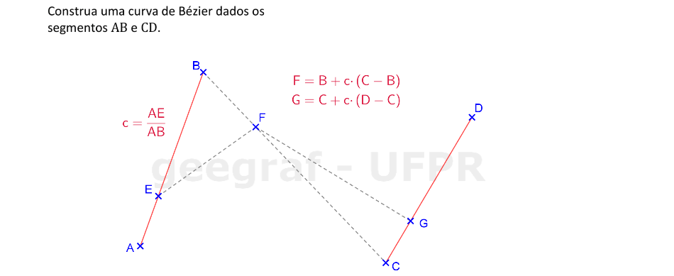
			   <figcaption>Determine o ponto <b>G &isin; CD</b> tal que <b>G = C + c&middot;(D - C)</b>.</figcaption>
		   </li>
		   <li>
			   <input type="radio" id="759" name="sl">
			   <label for="759"></label>
			   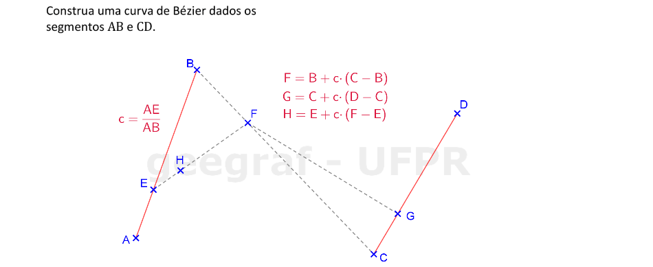
			   <figcaption>Determine o ponto <b>H &isin; EF</b> tal que <b>H = E + c&middot;(F - E)</b>.</figcaption>
		   </li>
		   <li>
			   <input type="radio" id="760" name="sl">
			   <label for="760"></label>
			   
			   <figcaption>Determine o ponto <b>I &isin; FG</b> tal que <b>I = F + c&middot;(G - F)</b>.</figcaption>
		   </li>
		   <li>
			   <input type="radio" id="761" name="sl">
			   <label for="761"></label>
			   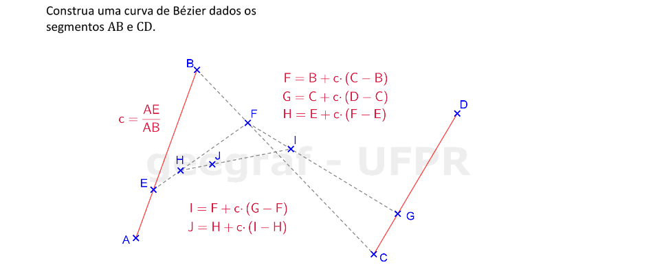
			   <figcaption>Para finalizar, determine o ponto <b>J &isin; HI</b> tal que <b>J = H + c&middot;(I - H)</b>.</figcaption>
		   </li>
		   <li>
			   <input type="radio" id="762" name="sl">
			   <label for="762"></label>
			   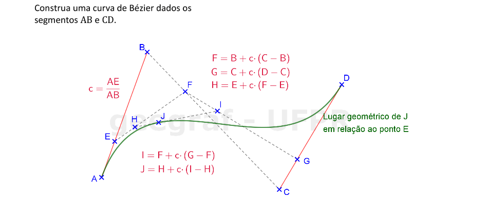
			   <figcaption>O lugar geométrico de <b>J</b> em relação ao ponto <b>E</b> define uma curva de Bézier.</figcaption>
		   </li>
		</ul>
		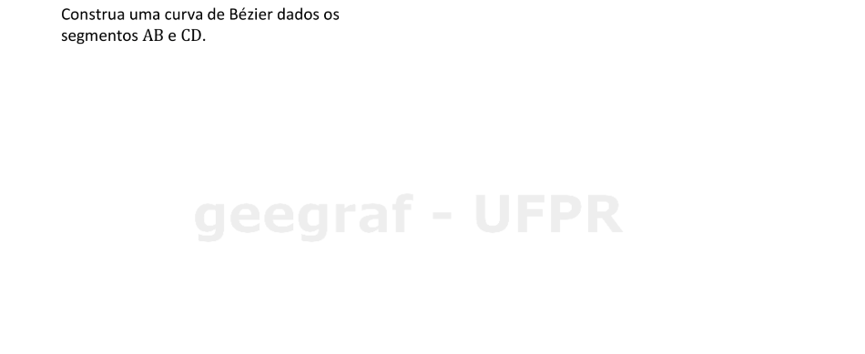
  

   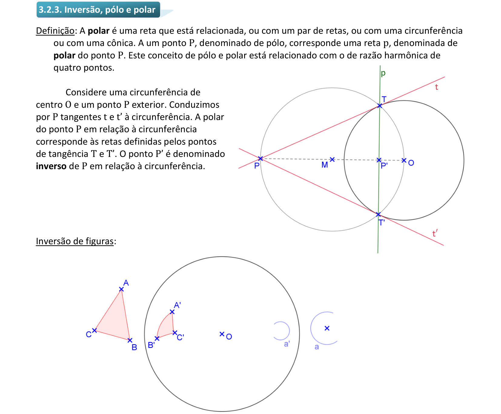
   
<a href="#modulo5" class="topo">voltar ao topo</a>

   
   

&#x1f4cf; &#x1f4d0; Resolução

	
Vamos construir uma curva aerofólio dadas as circunferências <b>&alpha;</b> e <b>&beta;</b> e a reta <b>r</b>.

	  <ul class="slider">
	  	   <li>
			   <input type="radio" id="763" name="sl">
			   <label for="763"></label>
			   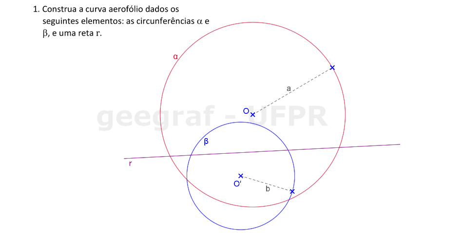
			   <figcaption>Construa as circunferências secantes <b>&alpha;</b> e <b>&beta;</b> e a reta <b>r</b>.</figcaption>
		   </li>
		   <li>
			   <input type="radio" id="764" name="sl">
			   <label for="764"></label>
			   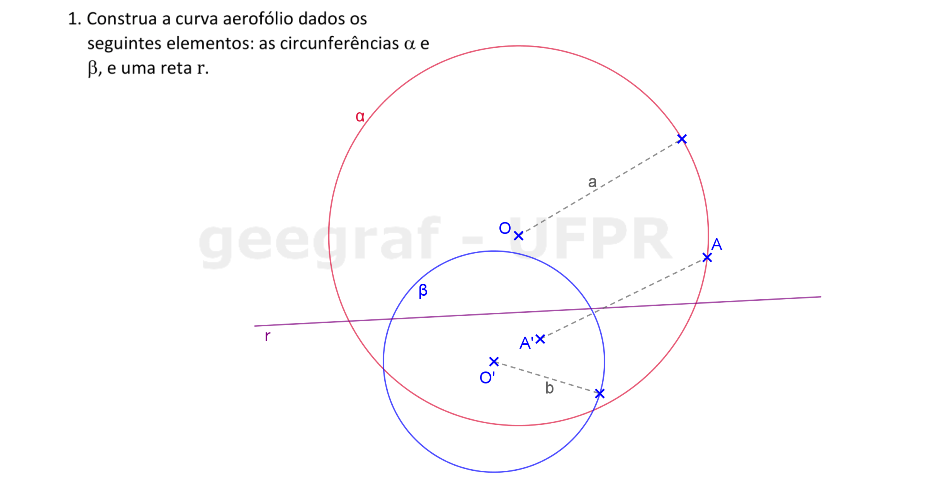
			   <figcaption>Defina um ponto <b>A &isin; &alpha;</b> e construa o inverso de <b>A</b> em relação a <b>&beta;</b>.</figcaption>
		   </li>
		   <li>
			   <input type="radio" id="765" name="sl">
			   <label for="765"></label>
			   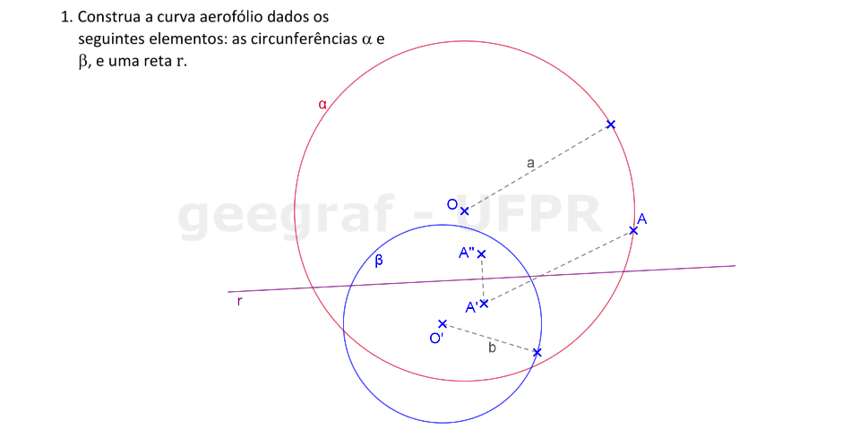
			   <figcaption>Determine o ponto <b>A''</b> simétrico de <b>A'</b> em relação à reta <b>r</b>.</figcaption>
		   </li>
		   <li>
			   <input type="radio" id="766" name="sl">
			   <label for="766"></label>
			   
			   <figcaption>Determine o ponto médio de <b>AA''</b>.</figcaption>
		   </li>
		   <li>
			   <input type="radio" id="767" name="sl">
			   <label for="767"></label>
			   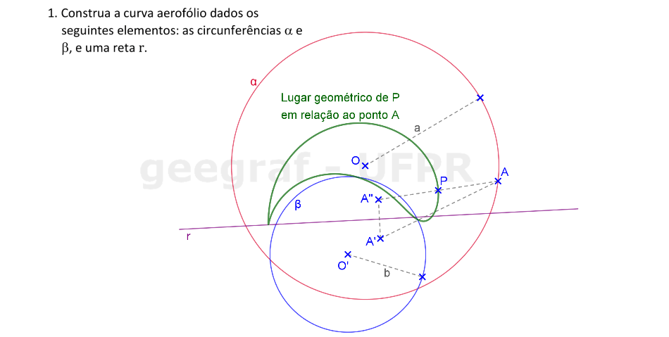
			   <figcaption>A curva aerofólio é o lugar geométrico de <b>P</b> em relação ao ponto <b>A</b>.</figcaption>
		   </li>
		</ul>
		
  

   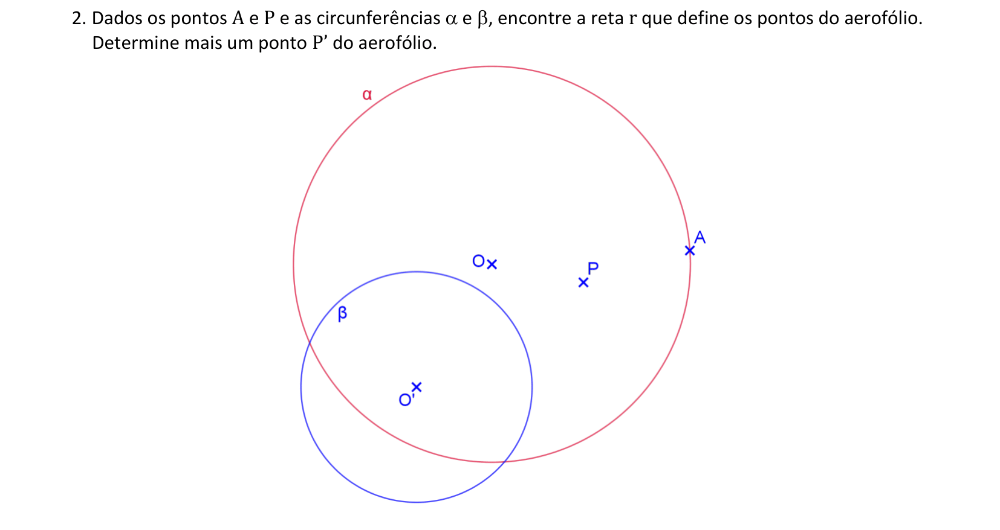
   

&#x1f4cf; &#x1f4d0; Resolução

	
Vamos determinar a reta que define uma curva aerofólio que passa por <b>P</b>, dadas as circunferências <b>&alpha;</b> e <b>&beta;</b>.

	  <ul class="slider">
		   <li>
			   <input type="radio" id="769" name="sl">
			   <label for="769"></label>
			   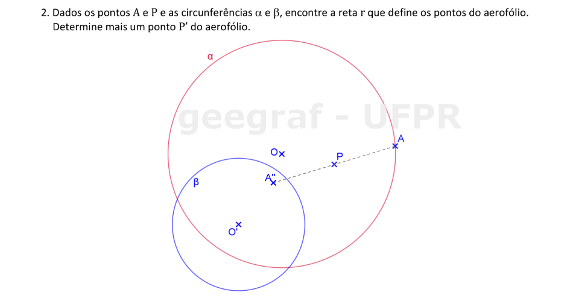
			   <figcaption>Defina o ponto simétrico de <b>A &isin; &alpha;</b> em relação ao ponto <b>P</b> (pois <b>P</b> é o ponto médio de <b>AA''</b>).</figcaption>
		   </li>
		   <li>
			   <input type="radio" id="770" name="sl">
			   <label for="770"></label>
			   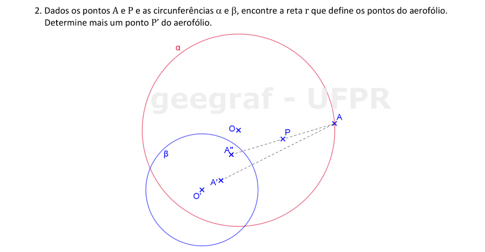
			   <figcaption>Determine o ponto <b>A'</b> inverso de <b>A</b> em relação a <b>&beta;</b>.</figcaption>
		   </li>
		   <li>
			   <input type="radio" id="771" name="sl">
			   <label for="771"></label>
			   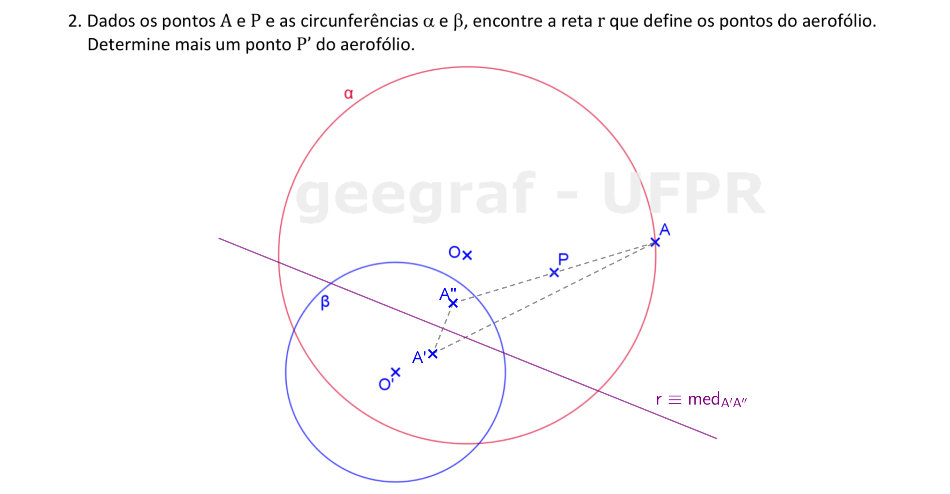
			   <figcaption>Logo, a reta procurada é mediatriz de <b>A'A'' </b> (pois <b>A'</b> e <b>A''</b> são simétricos em relação à reta <b>r</b>).</figcaption>
		   </li>
		   <li>
			   <input type="radio" id="772" name="sl">
			   <label for="772"></label>
			   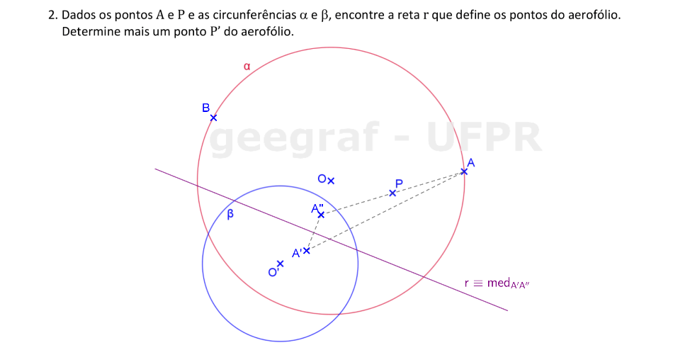
			   <figcaption>Determine um ponto <b>B &isin; &alpha;</b>.</figcaption>
		   </li>
		   <li>
			   <input type="radio" id="773" name="sl">
			   <label for="773"></label>
			   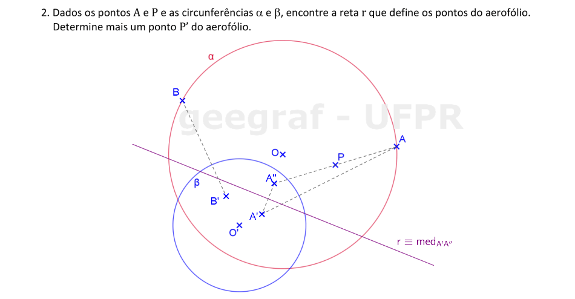
			   <figcaption>Encontre o inverso de <b>B</b> em relação a <b>&beta;</b>.</figcaption>
		   </li>
		   <li>
			   <input type="radio" id="774" name="sl">
			   <label for="774"></label>
			   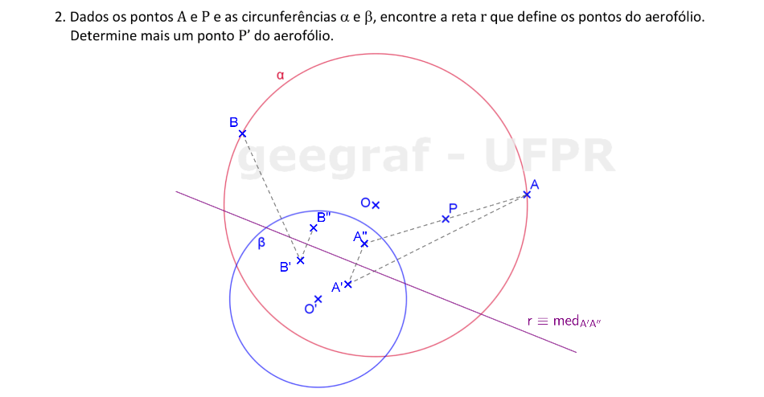
			   <figcaption>Determine o simétrico de <b>B'</b> em relação à reta <b>r</b>.</figcaption>
		   </li>
		   <li>
			   <input type="radio" id="775" name="sl">
			   <label for="775"></label>
			   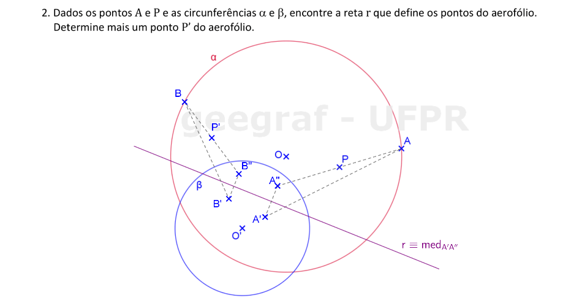
			   <figcaption>Construa o ponto médio de <b>BB''</b>.</figcaption>
		   </li>
		   <li>
			   <input type="radio" id="776" name="sl">
			   <label for="776"></label>
			   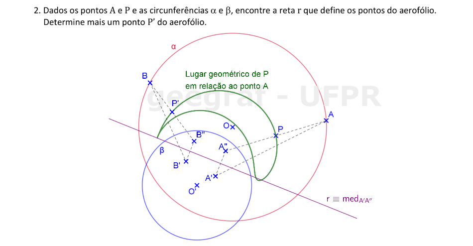
			   <figcaption>A curva aerofólio é o lugar geométrico de <b>P'</b> em relação ao ponto <b>B</b>.</figcaption>
		   </li>
		</ul>
		
  

   
<a href="#modulo5" class="topo">voltar ao topo</a>

   
   

&#x1f4cf; &#x1f4d0; Resolução

	
Vamos construir a curva bicorne usando as três definições apresentadas nesta página.

	  <ul class="slider">
		   <li>
			   <input type="radio" id="777" name="sl">
			   <label for="777"></label>
			   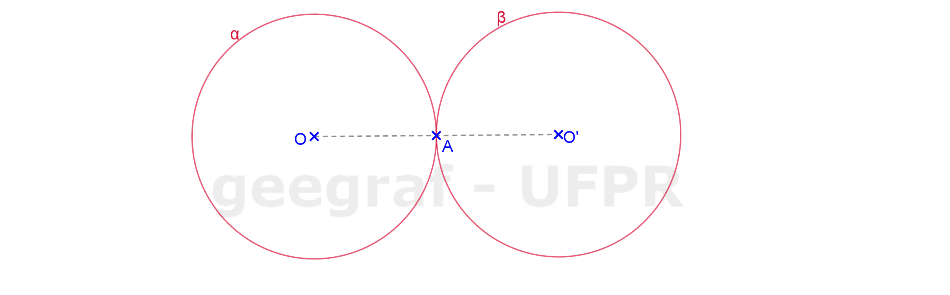
			   <figcaption><b>Definição 1</b>: Construa as circunferências com raios iguais, tangentes no ponto <b>A</b>.</figcaption>
		   </li>
		   <li>
			   <input type="radio" id="778" name="sl">
			   <label for="778"></label>
			   
			   <figcaption>Determine um ponto <b>B &isin; &beta;</b>.</figcaption>
		   </li>
		   <li>
			   <input type="radio" id="779" name="sl">
			   <label for="779"></label>
			   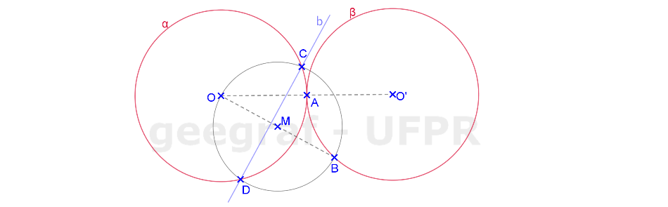
			   <figcaption>Encontre a reta polar de <b>B</b> em relação a <b>&alpha;</b>.</figcaption>
		   </li>
		   <li>
			   <input type="radio" id="780" name="sl">
			   <label for="780"></label>
			   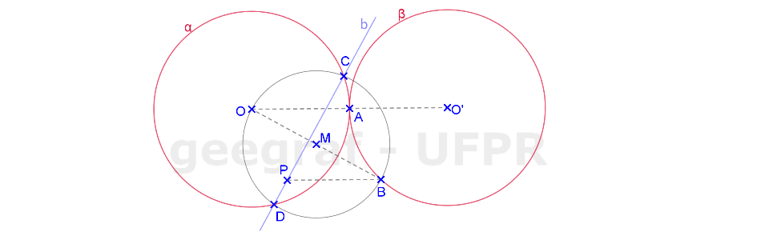
			   <figcaption>Construa o segmento <b>BP // OO'</b> tal que <b>P &isin; b</b>.</figcaption>
		   </li>
		   <li>
			   <input type="radio" id="781" name="sl">
			   <label for="781"></label>
			   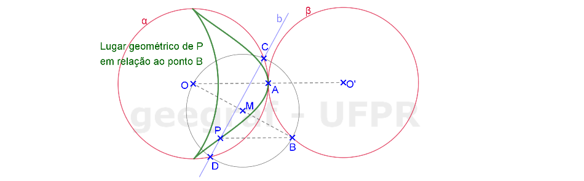
			   <figcaption>O lugar geométrico de <b>P</b> em relação ao ponto <b>B</b> é uma curva bicorne.</figcaption>
		   </li>
		   <li>
			   <input type="radio" id="782" name="sl">
			   <label for="782"></label>
			   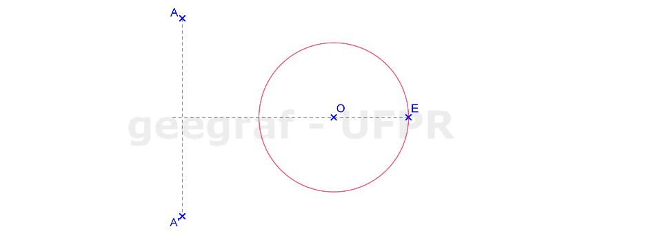
			   <figcaption><b>Definição 2</b>: Construa uma circunferência com raio <b>OE</b> e determine os pontos <b>A</b> e <b>A'</b> simétricos em relação a <b>OE</b>.</figcaption>
		   </li>
		   <li>
			   <input type="radio" id="783" name="sl">
			   <label for="783"></label>
			   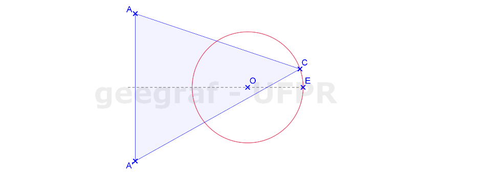
			   <figcaption>Determine um ponto <b>C</b> da circunferência e construa o triângulo <b>&#9651;AA'C</b>.</figcaption>
		   </li>
		   <li>
			   <input type="radio" id="784" name="sl">
			   <label for="784"></label>
			   
			   <figcaption>Construa o ortocentro <b>H</b> do triângulo <b>&#9651;AA'C</b>.</figcaption>
		   </li>
		   <li>
			   <input type="radio" id="785" name="sl">
			   <label for="785"></label>
			   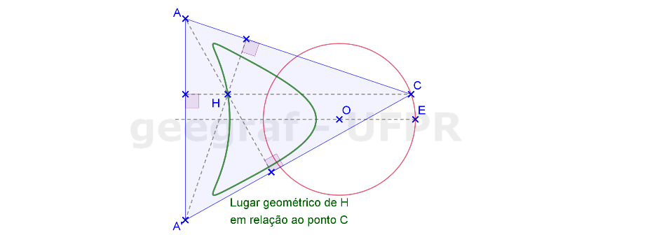
			   <figcaption>O lugar geométrico de <b>H</b> em relação ao ponto <b>C</b> é uma curva bicorne.</figcaption>
		   </li>
		   <li>
			   <input type="radio" id="786" name="sl">
			   <label for="786"></label>
			   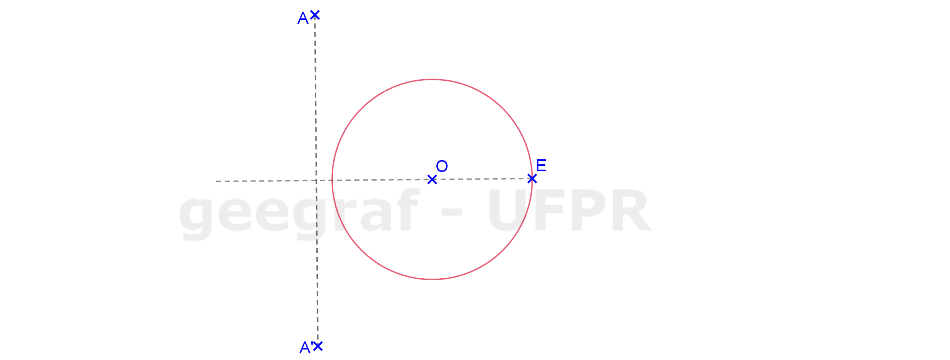
			   <figcaption><b>Definição 3</b>: Construa uma circunferência com raio <b>OE</b> e determine os pontos <b>A</b> e <b>A'</b> simétricos em relação a <b>OE</b>.</figcaption>
		   </li>
		   <li>
			   <input type="radio" id="787" name="sl">
			   <label for="787"></label>
			   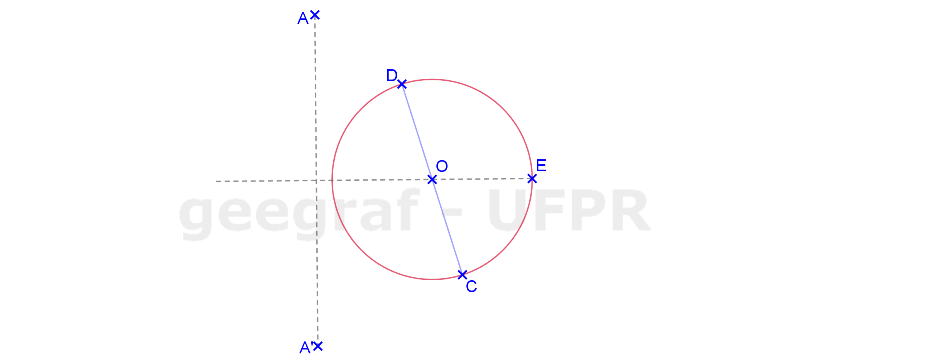
			   <figcaption>Determine um ponto <b>C</b> da circunferência e construa o diâmetro <b>CD</b>.</figcaption>
		   </li>
		   <li>
			   <input type="radio" id="788" name="sl">
			   <label for="788"></label>
			   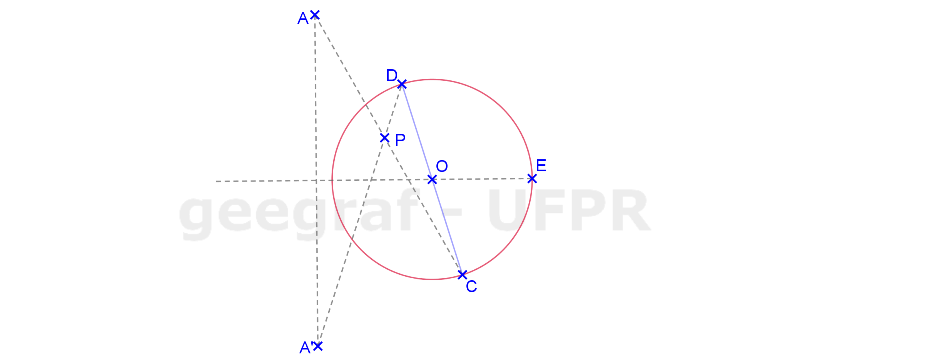
			   <figcaption>Determine o ponto <b>P &equiv; AC &cap; A'D</b>.</figcaption>
		   </li>
		   <li>
			   <input type="radio" id="789" name="sl">
			   <label for="789"></label>
			   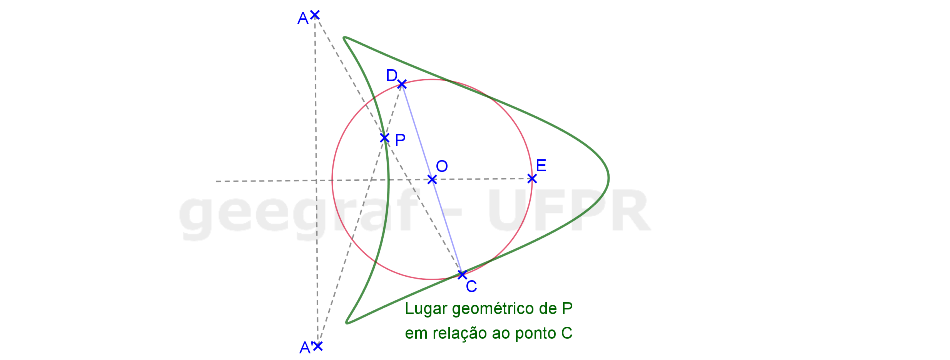
			   <figcaption>O lugar geométrico de <b>P</b> em relação ao ponto <b>C</b> é uma curva bicorne.</figcaption>
		   </li>
		</ul>
		
  

   
<a href="#modulo5" class="topo">voltar ao topo</a>

   
   

&#x1f4cf; &#x1f4d0; Resolução

	
Vamos construir a curva lemniscata de Gerono usando as três definições apresentadas nesta página.

	  <ul class="slider">
		   <li>
			   <input type="radio" id="791" name="sl">
			   <label for="791"></label>
			   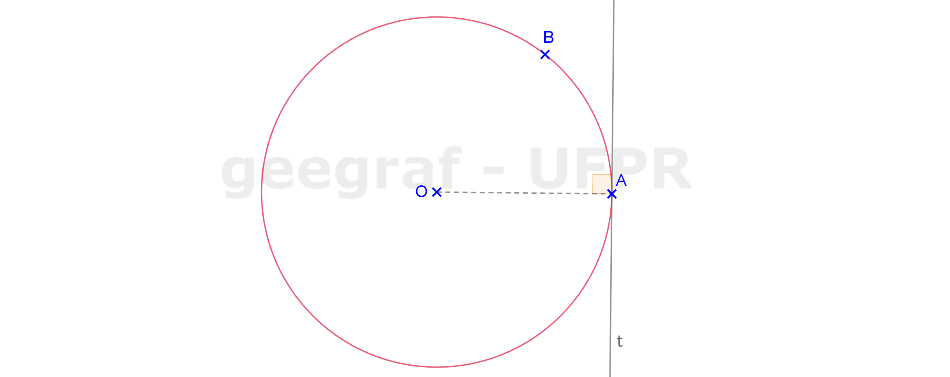
			   <figcaption><b>Definição 1</b>: Determine uma circunferência de raio <b>OA</b>, um ponto <b>B</b> desta circunferência e a reta tangente <b>t</b> que passa por <b>A</b>.</figcaption>
		   </li>
		   <li>
			   <input type="radio" id="792" name="sl">
			   <label for="792"></label>
			   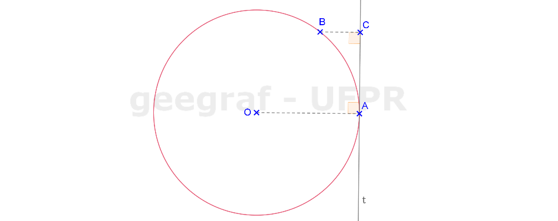
			   <figcaption>Determine o segmento <b>BC &perp; t</b>.</figcaption>
		   </li>
		   <li>
			   <input type="radio" id="793" name="sl">
			   <label for="793"></label>
			   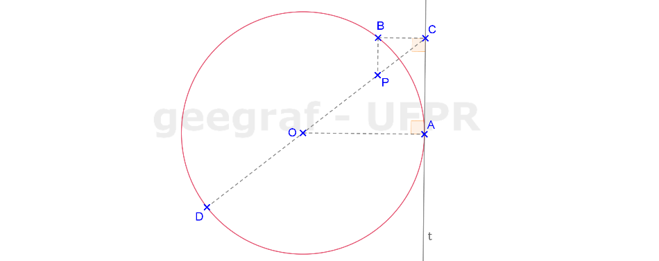
			   <figcaption>Construa o segmento <b>CD</b> que passa pelo centro <b>O</b>. Determine <b>P &isin; CD</b> tal que <b>BP // t</b>.</figcaption>
		   </li>
		   <li>
			   <input type="radio" id="794" name="sl">
			   <label for="794"></label>
			   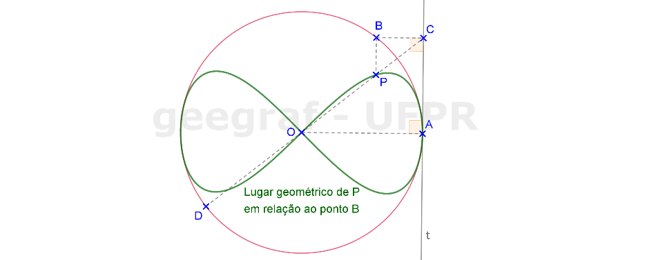
			   <figcaption>O lugar geométrico de <b>P</b> em relação ao ponto <b>B</b> é uma lemniscata de Gerono.</figcaption>
		   </li>
		   <li>
			   <input type="radio" id="795" name="sl">
			   <label for="795"></label>
			   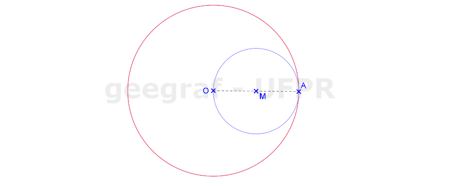
			   <figcaption><b>Definição 2</b>: Construa uma circunferência com raio <b>OA</b> e a circunferência tangente de diâmetro <b>OA</b>.</figcaption>
		   </li>
		   <li>
			   <input type="radio" id="796" name="sl">
			   <label for="796"></label>
			   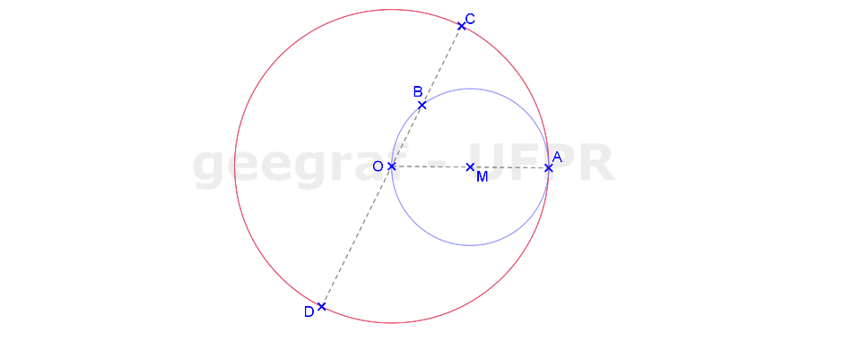
			   <figcaption>Determine um ponto <b>B</b> da circunferência menor e construa o diâmetro da circunferência maior <b>CD</b> que passa por <b>B</b>.</figcaption>
		   </li>
		   <li>
			   <input type="radio" id="797" name="sl">
			   <label for="797"></label>
			   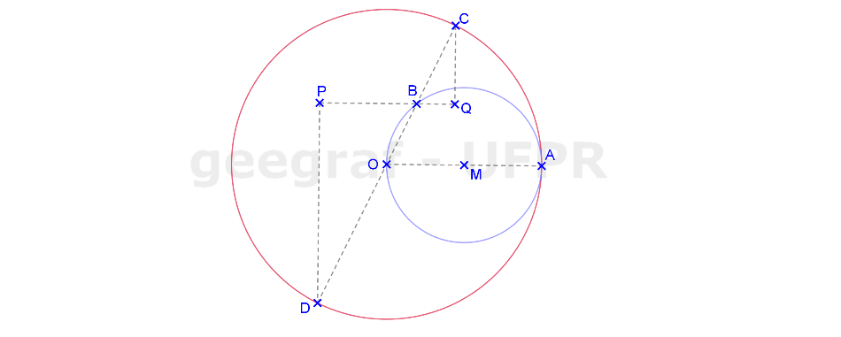
			   <figcaption>Construa os segmentos <b>CQ // PD</b> tais que <b>CQ &perp; OA</b> e <b>B &isin; PQ</b>.</figcaption>
		   </li>
		   <li>
			   <input type="radio" id="798" name="sl">
			   <label for="798"></label>
			   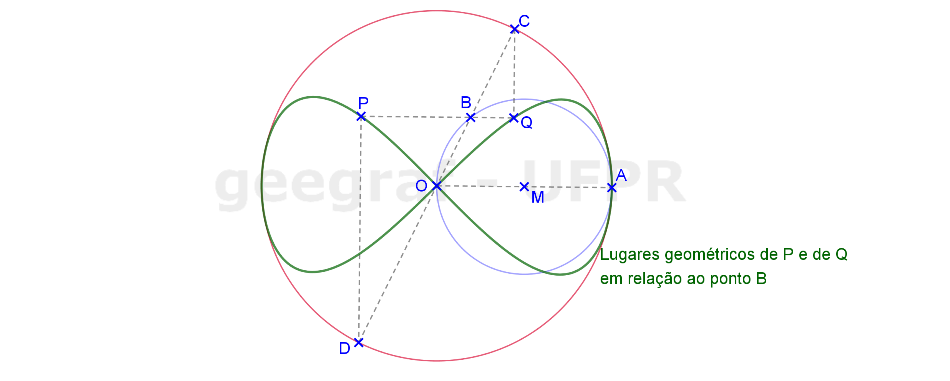
			   <figcaption>Os lugares geométricos de <b>P</b> e de <b>Q</b> em relação ao ponto <b>B</b> determinam uma lemniscata de Gerono.</figcaption>
		   </li>
		   <li>
			   <input type="radio" id="799" name="sl">
			   <label for="799"></label>
			   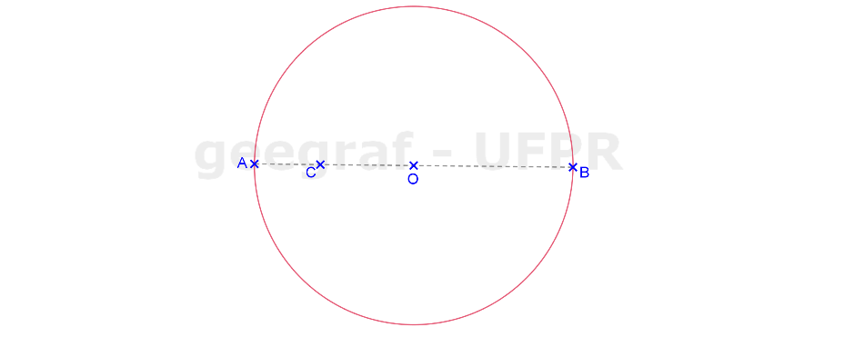
			   <figcaption><b>Definição 3</b>: Construa uma circunferência com diâmetro <b>AB</b> e determine um ponto <b>C &isin; AB</b>.</figcaption>
		   </li>
		   <li>
			   <input type="radio" id="801" name="sl">
			   <label for="801"></label>
			   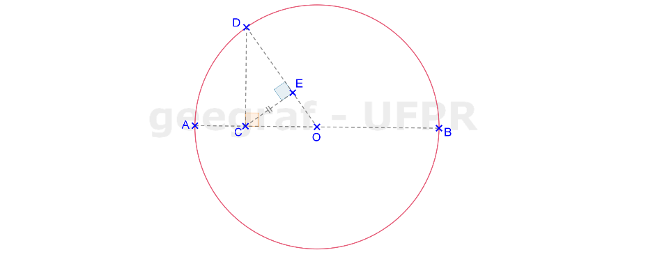
			   <figcaption>Construa os segmentos <b>CD &perp; AB</b> e <b>CE &perp; OD</b>.</figcaption>
		   </li>
		   <li>
			   <input type="radio" id="802" name="sl">
			   <label for="802"></label>
			   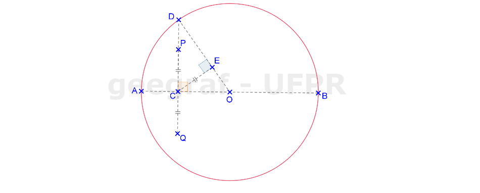
			   <figcaption>Determine os pontos <b>P</b> e <b>Q</b> pertencentes à reta <b>CD</b> tais que <b>CP = CQ = CE</b>.</figcaption>
		   </li>
		   <li>
			   <input type="radio" id="803" name="sl">
			   <label for="803"></label>
			   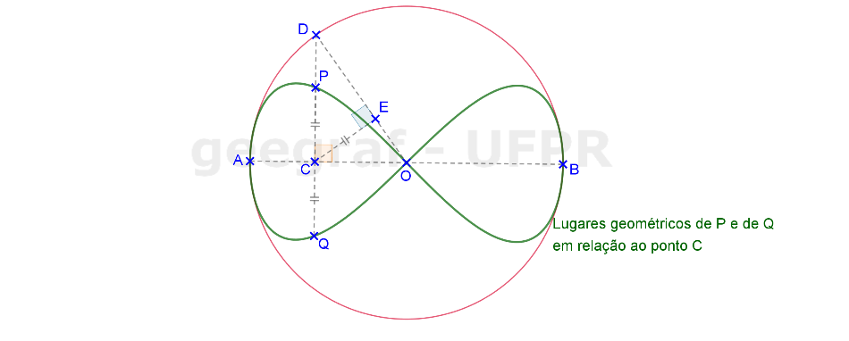
			   <figcaption>Os lugares geométricos de <b>P</b> e de <b>Q</b> em relação ao ponto <b>C</b> determinam uma lemniscata de Gerono.</figcaption>
		   </li>
		</ul>
		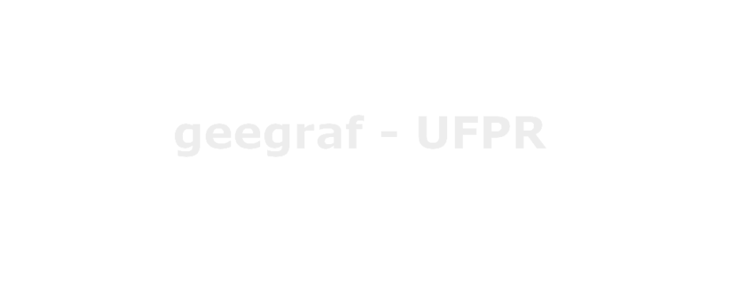
  

   
<a href="#modulo5" class="topo">voltar ao topo</a>

   
   

&#x1f4cf; &#x1f4d0; Resolução

	
Vamos construir uma curva kappa, dados o ponto <b>O</b> e a reta <b>s</b>.

	  <ul class="slider">
		   <li>
			   <input type="radio" id="800" name="sl">
			   <label for="800"></label>
			   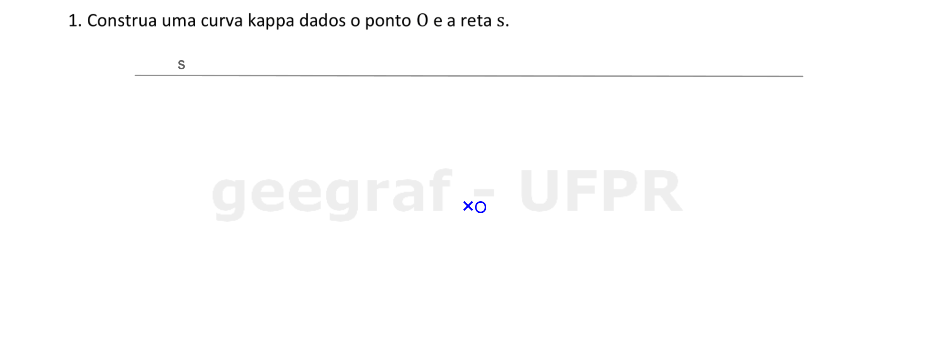
			   <figcaption>Determine uma reta <b>s</b> e um ponto <b>O</b>.</figcaption>
		   </li>
		   <li>
			   <input type="radio" id="804" name="sl">
			   <label for="804"></label>
			   
			   <figcaption>Encontre o ponto <b>A &isin; s</b> tal que <b>AO &perp; s</b>.</figcaption>
		   </li>
		   <li>
			   <input type="radio" id="805" name="sl">
			   <label for="805"></label>
			   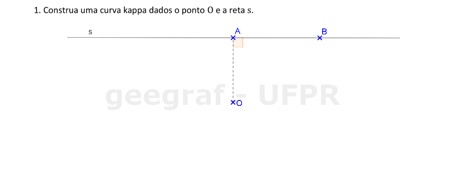
			   <figcaption>Determine um ponto <b>B &isin; s</b>.</figcaption>
		   </li>
		   <li>
			   <input type="radio" id="806" name="sl">
			   <label for="806"></label>
			   
			   <figcaption>Construa a reta <b>OB</b> e determine a medida <b>AB</b>.</figcaption>
		   </li>
		   <li>
			   <input type="radio" id="807" name="sl">
			   <label for="807"></label>
			   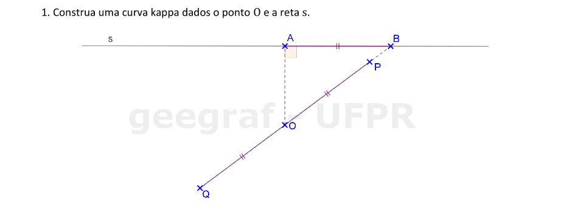
			   <figcaption>Encontre os pontos <b>P &isin; OB</b> e <b>Q &isin; OB</b> tais que <b>OP = OQ = AB</b>.</figcaption>
		   </li>
		   <li>
			   <input type="radio" id="808" name="sl">
			   <label for="808"></label>
			   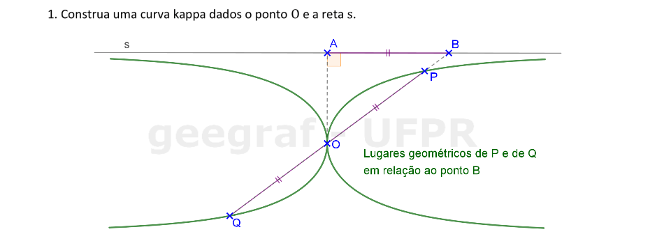
			   <figcaption>Os lugares geométricos de <b>P</b> e de <b>Q</b> em relação ao ponto <b>B</b> determinam uma curva kappa.</figcaption>
		   </li>
		</ul>
		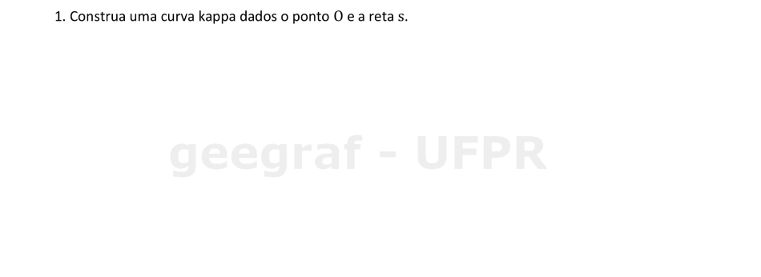
  

   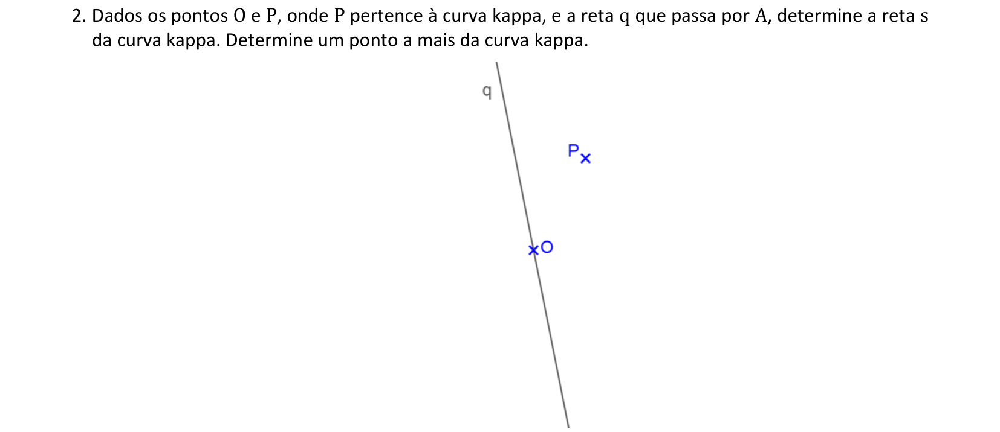
   

&#x1f4cf; &#x1f4d0; Resolução

	
Vamos construir a reta <b>s</b> da curva kappa, dados o ponto <b>P</b> da curva, a reta que contém o ponto <b>A</b> e o ponto <b>O</b>.

	  <ul class="slider">
		   <li>
			   <input type="radio" id="809" name="sl">
			   <label for="809"></label>
			   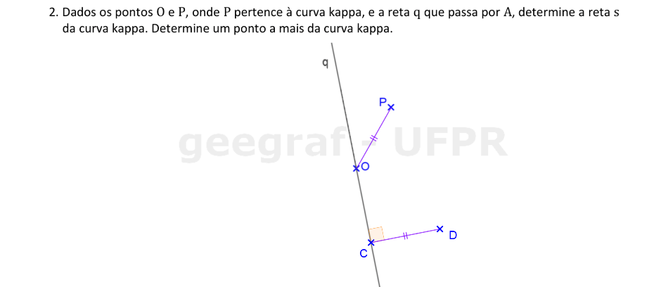
			   <figcaption>Determine a distância <b>OP</b> e escolha um ponto <b>C &isin; q</b> para construir <b>CD &perp; q</b>. Esta é a distância do ponto <b>A</b> até o ponto <b>B</b> que define o ponto dado <b>P</b>.</figcaption>
		   </li>
		   <li>
			   <input type="radio" id="810" name="sl">
			   <label for="810"></label>
			   
			   <figcaption>Construa a reta <b>BD // q</b>, definindo o ponto <b>B</b> no prolongamento de <b>OP</b>.</figcaption>
		   </li>
		   <li>
			   <input type="radio" id="811" name="sl">
			   <label for="811"></label>
			   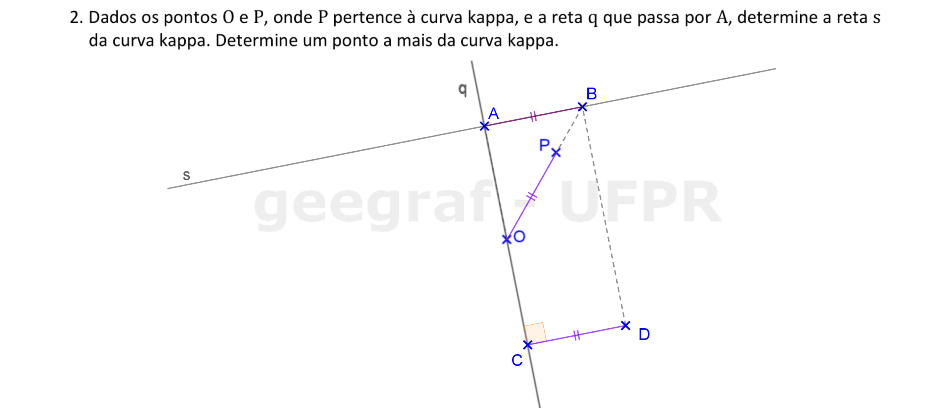
			   <figcaption>Logo, a reta <b>s</b> será perpendicular à reta <b>q</b> e passará no ponto <b>B</b>.</figcaption>
		   </li>
		   <li>
			   <input type="radio" id="812" name="sl">
			   <label for="812"></label>
			   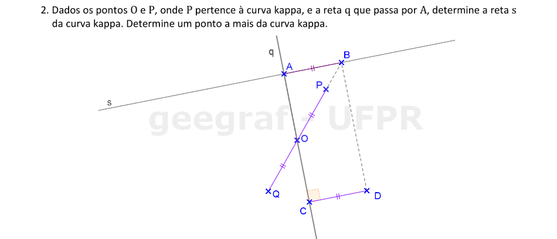
			   <figcaption>O simétrico de <b>P</b> em relação ao ponto <b>O</b> pertence à curva kappa.</figcaption>
		   </li>
		   <li>
			   <input type="radio" id="813" name="sl">
			   <label for="813"></label>
			   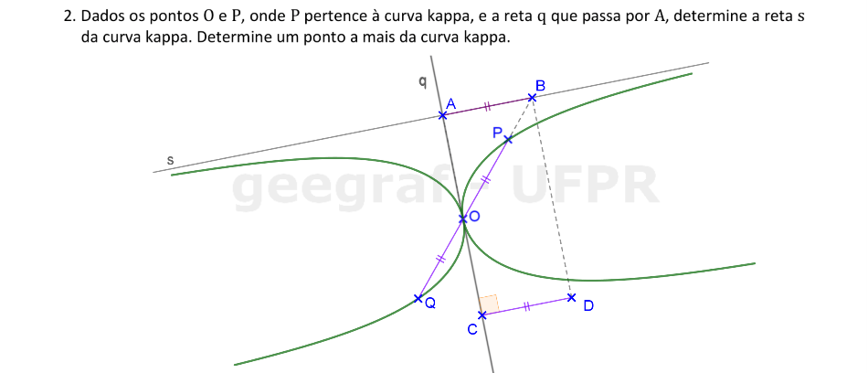
			   <figcaption>Os lugares geométricos de <b>P</b> e de <b>Q</b> em relação ao ponto <b>B</b> determinam uma curva kappa.</figcaption>
		   </li>
		</ul>
		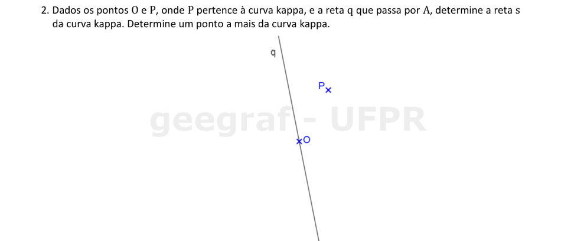
  

   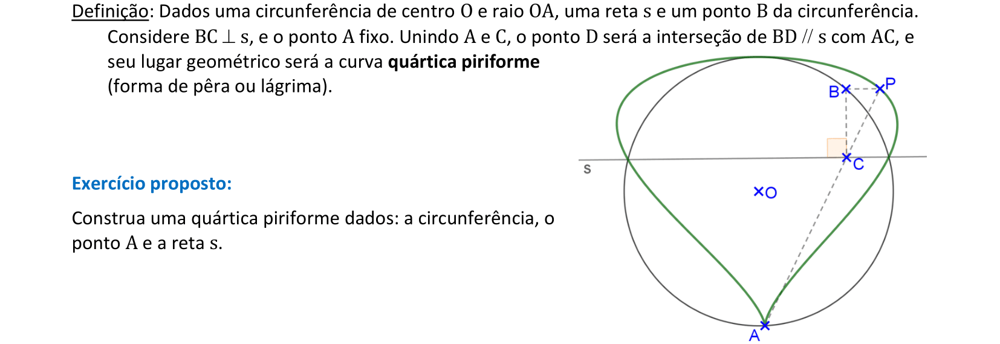
   

&#x1f4cf; &#x1f4d0; Resolução

	
Vamos construir a curva quártica piriforme dados a circunferência, o ponto <b>A</b> e a reta <b>s</b>.

	  <ul class="slider">
		   <li>
			   <input type="radio" id="814" name="sl">
			   <label for="814"></label>
			   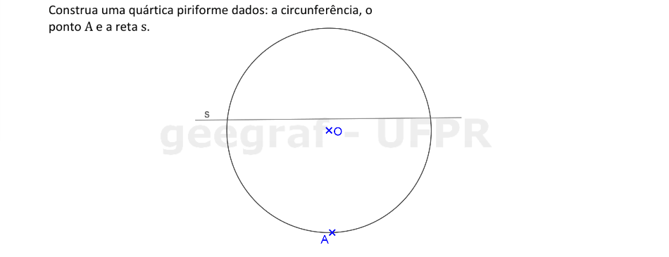
			   <figcaption>Determine circunferência de raio <b>OA</b> e a reta secante <b>s</b>.</figcaption>
		   </li>
		   <li>
			   <input type="radio" id="815" name="sl">
			   <label for="815"></label>
			   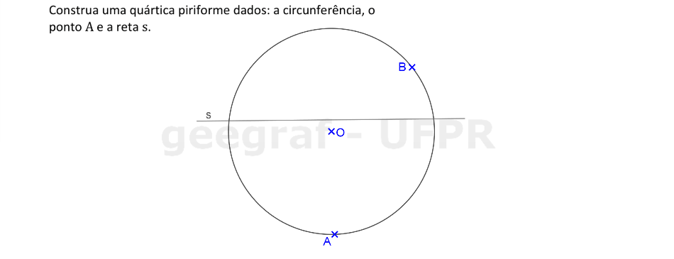
			   <figcaption>Escolha um ponto <b>B</b> pertencente à circunferência.</figcaption>
		   </li>
		   <li>
			   <input type="radio" id="816" name="sl">
			   <label for="816"></label>
			   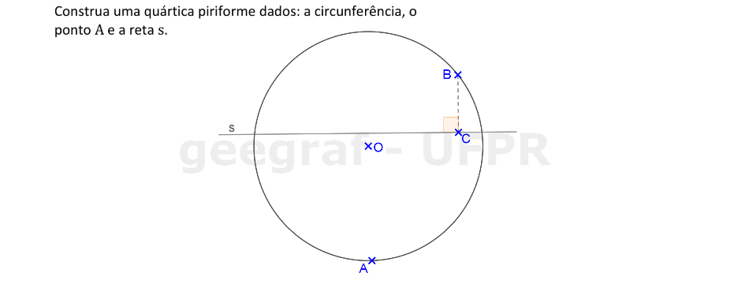
			   <figcaption>Construa o segmento <b>BC &perp; s</b> tal que <b>C &isin; s</b>.</figcaption>
		   </li>
		   <li>
			   <input type="radio" id="817" name="sl">
			   <label for="817"></label>
			   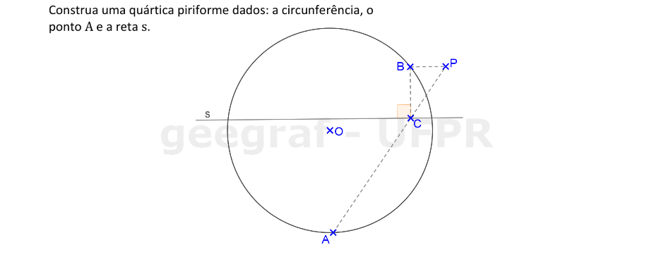
			   <figcaption>Construa a reta <b>AC</b> e encontre o ponto <b>P &isin; AC</b> tal que <b>BP // s</b>.</figcaption>
		   </li>
		   <li>
			   <input type="radio" id="818" name="sl">
			   <label for="818"></label>
			   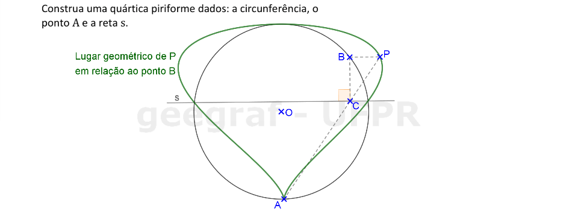
			   <figcaption>O lugar geométrico de <b>P</b> em relação ao ponto <b>B</b> determina uma curva quártica piriforme.</figcaption>
		   </li>
		</ul>
		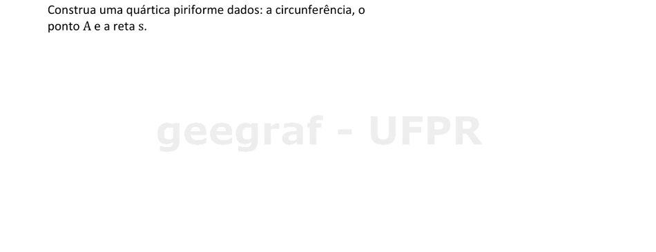
  

   
<a href="#modulo5" class="topo">voltar ao topo</a>

6. Curvas paramétricas

  
Material da página 66 até a página 77.

   
   

&#x1f4cf; &#x1f4d0; Resolução

	
Vamos construir a curva torpedo dados a circunferência e o ponto fixo <b>A</b>.

	  <ul class="slider">
		   <li>
			   <input type="radio" id="819" name="sl">
			   <label for="819"></label>
			   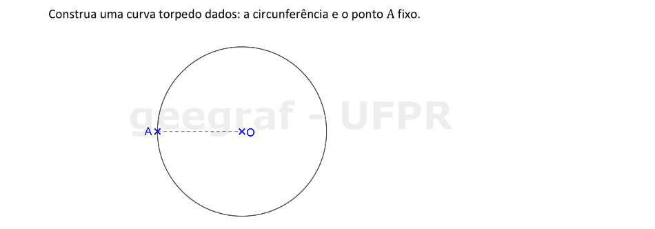
			   <figcaption>Construa a circunferência de raio <b>OA</b>.</figcaption>
		   </li>
		   <li>
			   <input type="radio" id="820" name="sl">
			   <label for="820"></label>
			   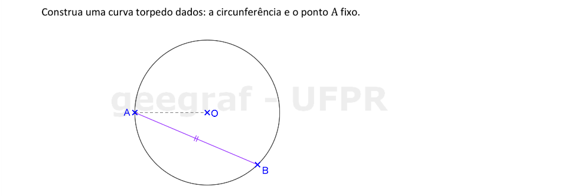
			   <figcaption>Escolha um ponto <b>B</b> pertencente à circunferência e determine a distância <b>AB</b>.</figcaption>
		   </li>
		   <li>
			   <input type="radio" id="821" name="sl">
			   <label for="821"></label>
			   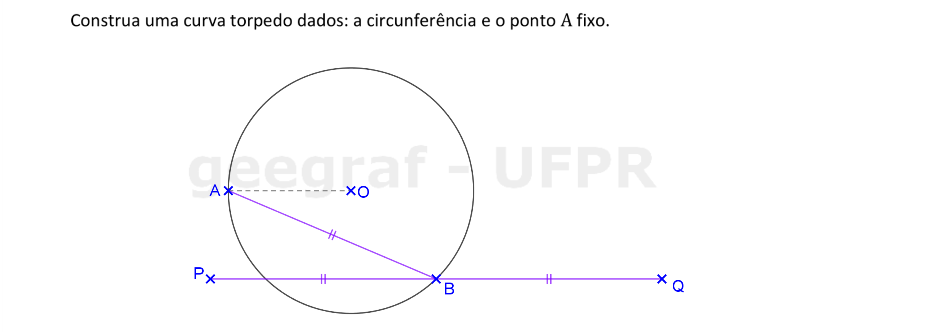
			   <figcaption>Construa os segmentos <b>BQ // OA</b> e <b>BP // OA</b> tais que <b>BP = BQ = AB</b>.</figcaption>
		   </li>
		   <li>
			   <input type="radio" id="822" name="sl">
			   <label for="822"></label>
			   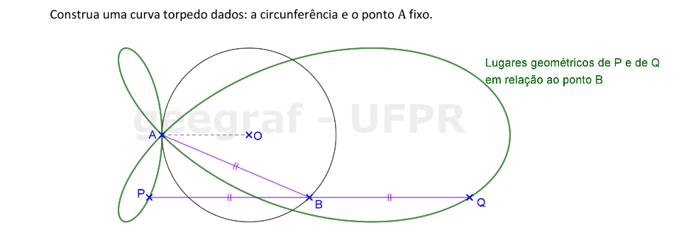
			   <figcaption>Os lugares geométricos de <b>P</b> e de <b>Q</b> em relação ao ponto <b>B</b> determinam uma curva torpedo.</figcaption>
		   </li>
		</ul>
		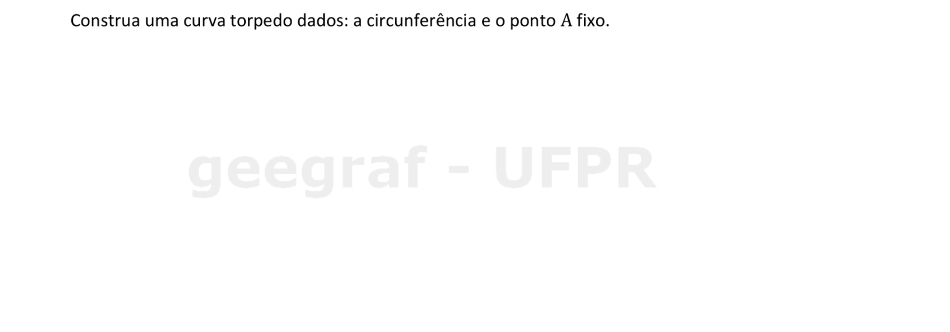
  

   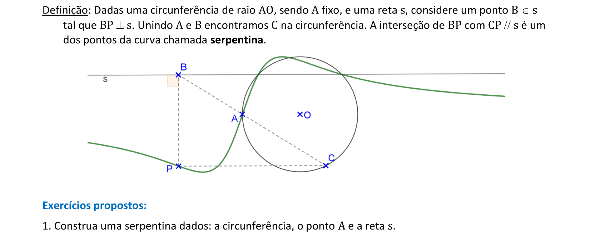
   

&#x1f4cf; &#x1f4d0; Resolução

	
Vamos construir a curva serpentina dados a circunferência, o ponto <b>A</b> e a reta <b>s</b>.

	  <ul class="slider">
		   <li>
			   <input type="radio" id="823" name="sl">
			   <label for="823"></label>
			   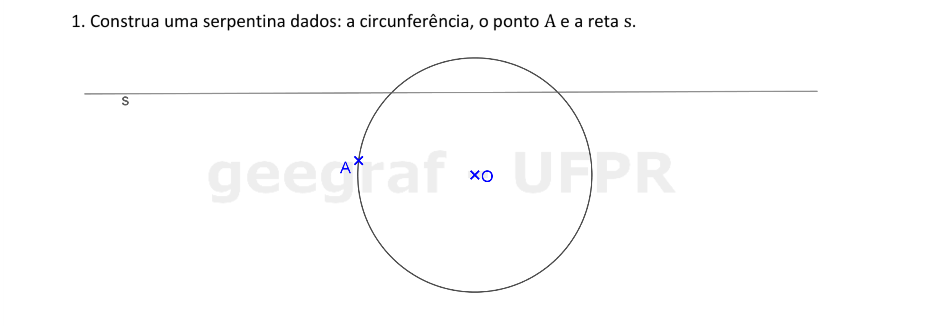
			   <figcaption>Construa a circunferência de raio <b>OA</b> e a reta secante <b>s</b>.</figcaption>
		   </li>
		   <li>
			   <input type="radio" id="824" name="sl">
			   <label for="824"></label>
			   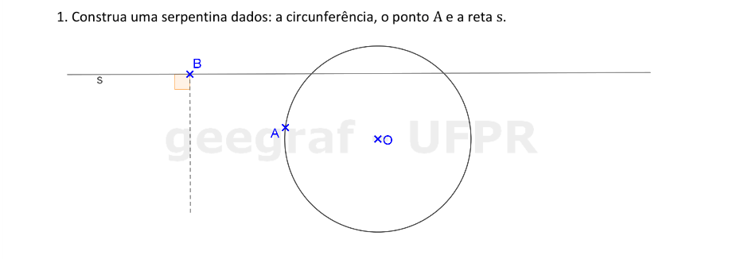
			   <figcaption>Escolha um ponto <b>B</b> pertencente à reta <b>s</b> e construa a reta perpendicular a <b>s</b> que passa por <b>B</b>.</figcaption>
		   </li>
		   <li>
			   <input type="radio" id="825" name="sl">
			   <label for="825"></label>
			   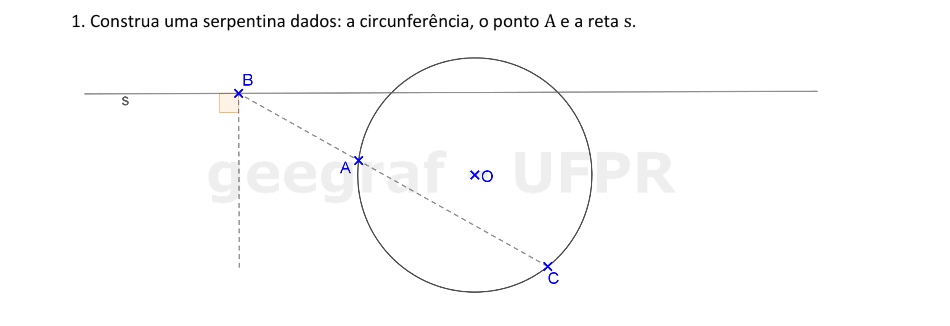
			   <figcaption>Encontre o ponto de interseção da reta <b>AB</b> com a circunferência.</figcaption>
		   </li>
		   <li>
			   <input type="radio" id="826" name="sl">
			   <label for="826"></label>
			   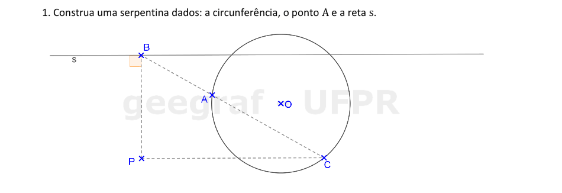
			   <figcaption>Construa o segmento <b>CP // s</b> tal que <b>BP &perp; s</b>.</figcaption>
		   </li>
		   <li>
			   <input type="radio" id="827" name="sl">
			   <label for="827"></label>
			   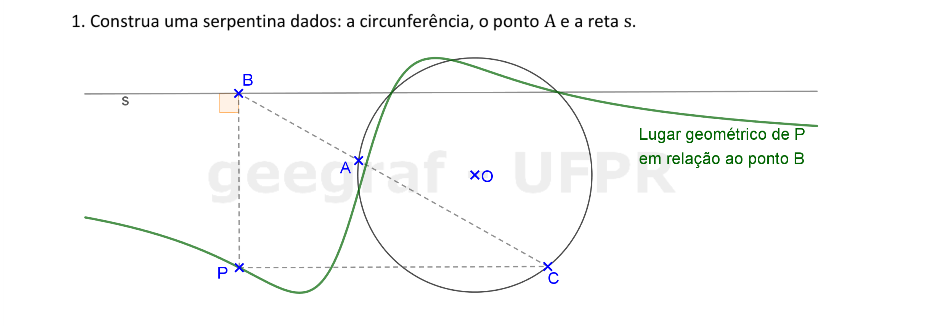
			   <figcaption>O lugar geométrico de <b>P</b> em relação ao ponto <b>B</b> determina uma curva serpentina.</figcaption>
		   </li>
		</ul>
		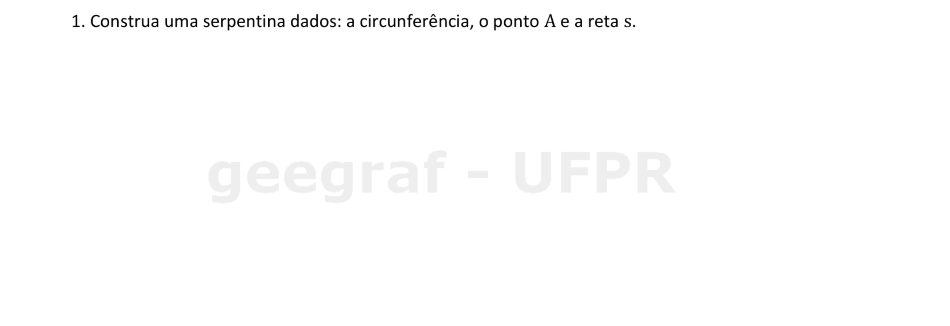
  

   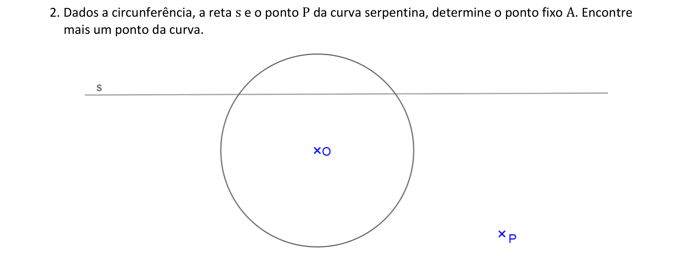
   

&#x1f4cf; &#x1f4d0; Resolução

	
Vamos encontrar o ponto fixo que determine a curva serpentina, dados a circunferência, o ponto da curva <b>P</b> e a reta <b>s</b>.

	  <ul class="slider">
		   <li>
			   <input type="radio" id="828" name="sl">
			   <label for="828"></label>
			   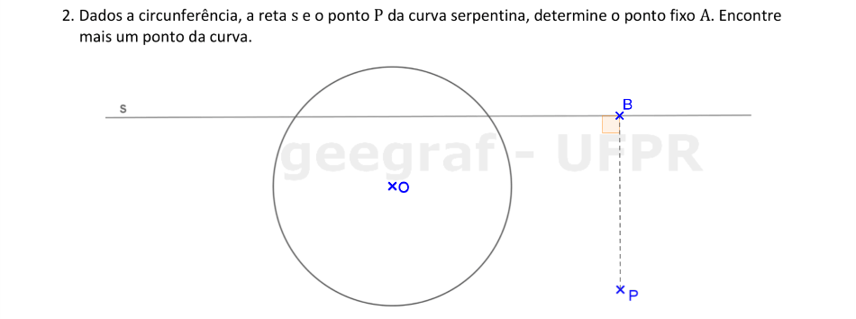
			   <figcaption>Construa o segmento <b>BP &perp; s</b>.</figcaption>
		   </li>
		   <li>
			   <input type="radio" id="829" name="sl">
			   <label for="829"></label>
			   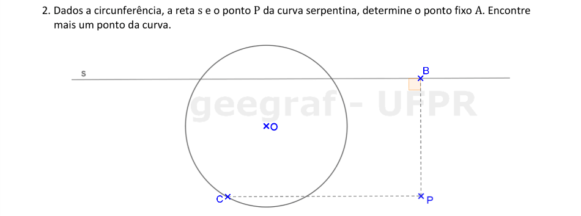
			   <figcaption>Determine o segmento <b>CP // s</b>, onde <b>C</b> pertence à circunferência.</figcaption>
		   </li>
		   <li>
			   <input type="radio" id="830" name="sl">
			   <label for="830"></label>
			   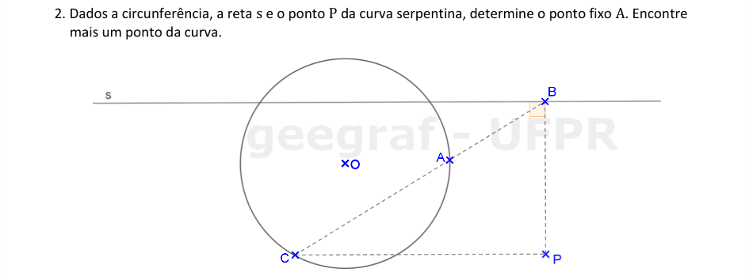
			   <figcaption>Determine o segmento <b>BC</b>: o ponto fixo da curva está na interseção de <b>BC</b> com a circunferência.</figcaption>
		   </li>
		   <li>
			   <input type="radio" id="831" name="sl">
			   <label for="831"></label>
			   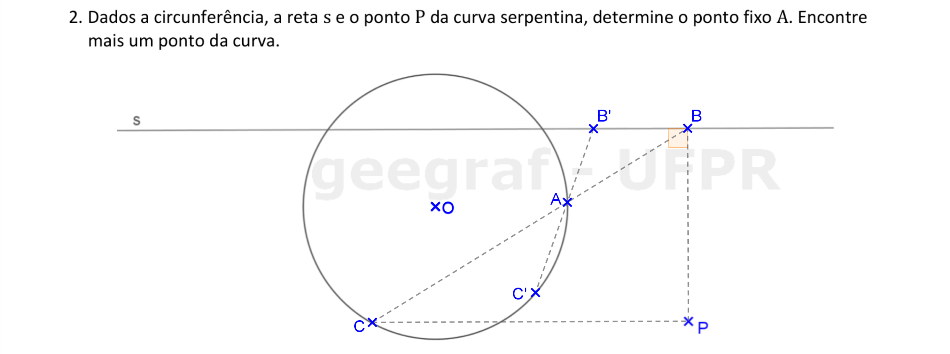
			   <figcaption>Para encontrar mais um ponto da curva, escolha um ponto <b>B' &isin; s</b> e defina o segmento <b>B'C'</b> que contém o ponto fixo <b>A</b>.</figcaption>
		   </li>
		   <li>
			   <input type="radio" id="832" name="sl">
			   <label for="832"></label>
			   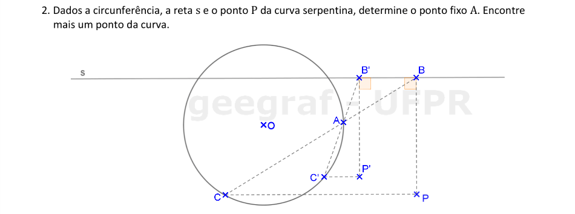
			   <figcaption>Construa o segmento <b>C'P' // s</b> tal que <b>B'P' &perp; s</b></figcaption>
		   </li>
		   <li>
			   <input type="radio" id="833" name="sl">
			   <label for="833"></label>
			   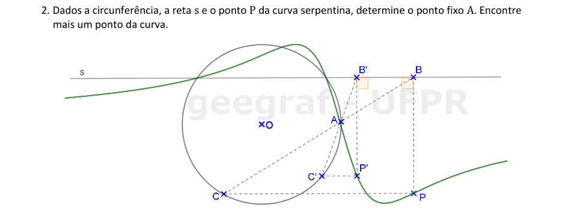
			   <figcaption>O lugar geométrico de <b>P'</b> em relação ao ponto <b>B'</b> determina uma curva serpentina.</figcaption>
		   </li>
		</ul>
		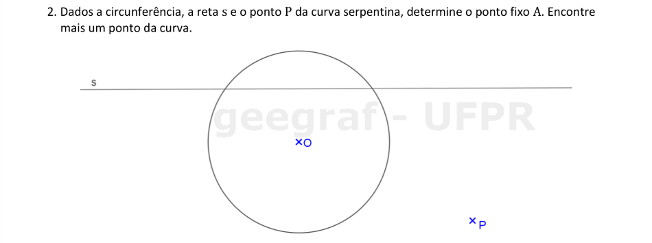
  

   
<a href="#modulo6" class="topo">voltar ao topo</a>

   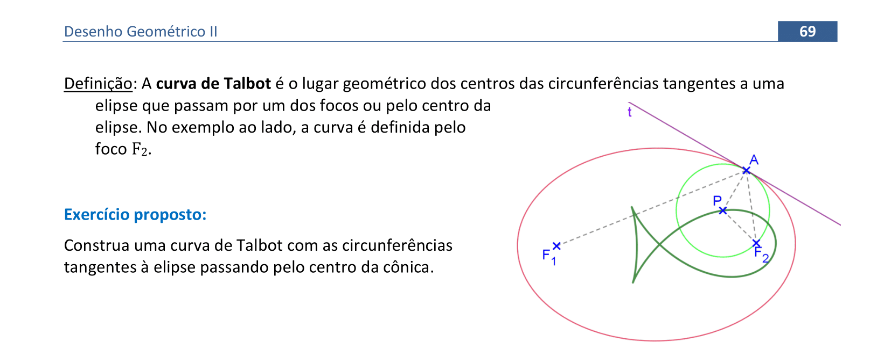
   

&#x1f4cf; &#x1f4d0; Resolução

	
Vamos construir uma curva de Talbot com as circunferências tangentes à elipse passando pelo centro da elipse.

	  <ul class="slider">
		   <li>
			   <input type="radio" id="834" name="sl">
			   <label for="834"></label>
			   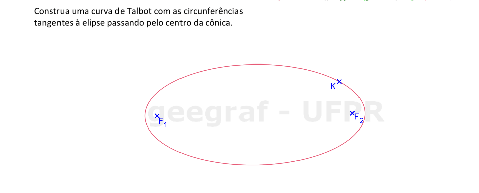
			   <figcaption>Construa uma elipse que contém um ponto <b>K</b>.</figcaption>
		   </li>
		   <li>
			   <input type="radio" id="835" name="sl">
			   <label for="835"></label>
			   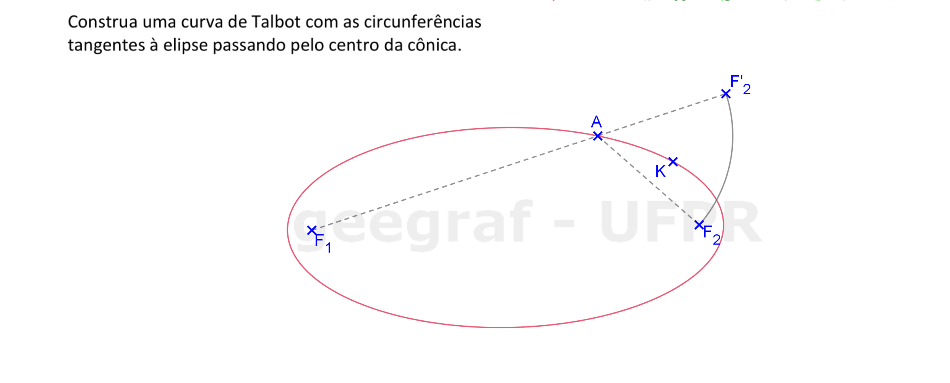
			   <figcaption>Escolha um ponto da elipse <b>A</b>, e obtenha o simétrico do foco <b>F2</b> em relação à reta tangente: <b>AF'2 = AF2</b>.</figcaption>
		   </li>
		   <li>
			   <input type="radio" id="836" name="sl">
			   <label for="836"></label>
			   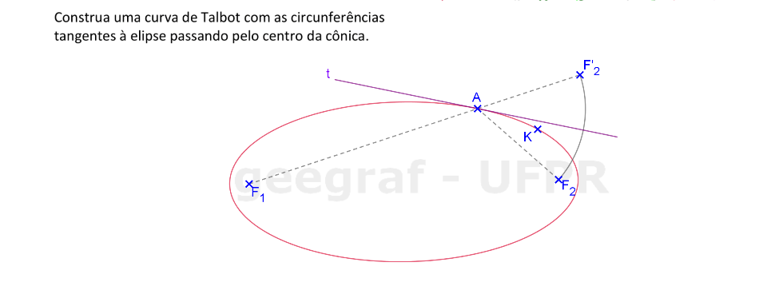
			   <figcaption>A reta tangente <b>t</b> é a mediatriz do segmento <b>F2F'2</b>.</figcaption>
		   </li>
		   <li>
			   <input type="radio" id="837" name="sl">
			   <label for="837"></label>
			   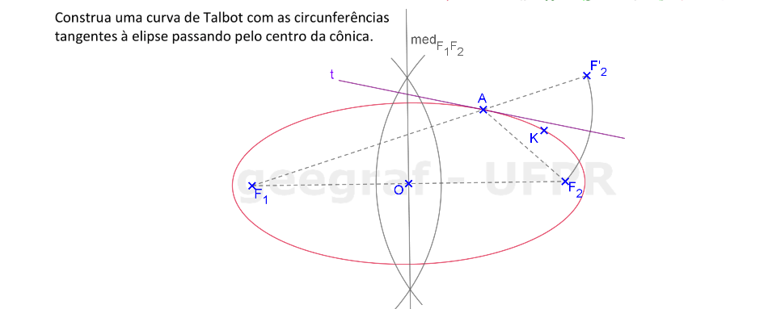
			   <figcaption>Encontre o centro da cônica construindo a mediatriz do segmento que define os focos.</figcaption>
		   </li>
		   <li>
			   <input type="radio" id="838" name="sl">
			   <label for="838"></label>
			   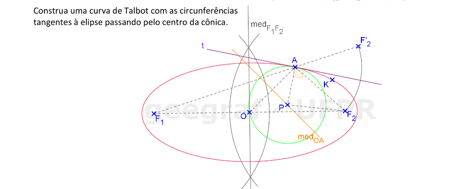
			   <figcaption>A circunferência tangente à elipse no ponto <b>A</b> tem o centro na mediatriz de <b>OA</b> (porque passa pelo centro da cônica). Como a circunferência fica tangente à elipse no ponto <b>A</b>, o centro pertence à reta <b>AP &perp; t</b>.</figcaption>
		   </li>
		   <li>
			   <input type="radio" id="839" name="sl">
			   <label for="839"></label>
			   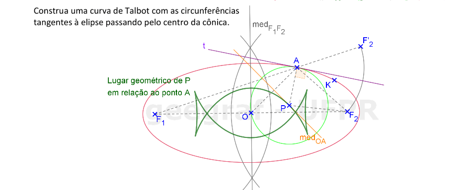
			   <figcaption>O lugar geométrico de <b>P</b> em relação ao ponto <b>A</b> determina uma curva de Talbot. Construa uma curva de Talbot que passa pelo foco <b>F1</b> ao invés de passar pelo centro da cônica.</figcaption>
		   </li>
		</ul>
		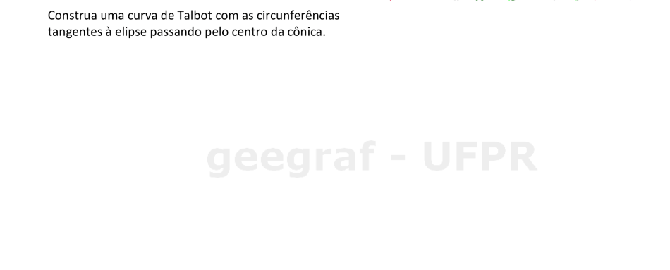
  

   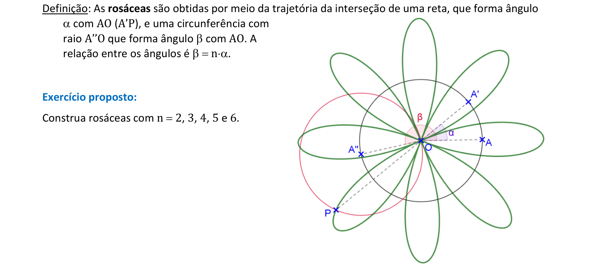
   

&#x1f4cf; &#x1f4d0; Resolução

	
Vamos construir curvas rosáceas com <b>n</b> = 2, 3, 4, 5 e 6.

	  <ul class="slider">
		   <li>
			   <input type="radio" id="840" name="sl">
			   <label for="840"></label>
			   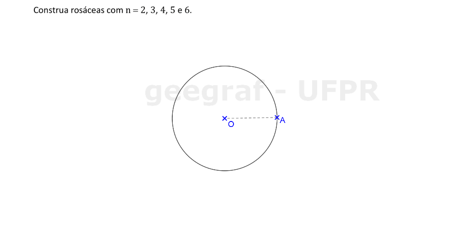
			   <figcaption>Construa uma circunferência de raio <b>OA</b>.</figcaption>
		   </li>
		   <li>
			   <input type="radio" id="841" name="sl">
			   <label for="841"></label>
			   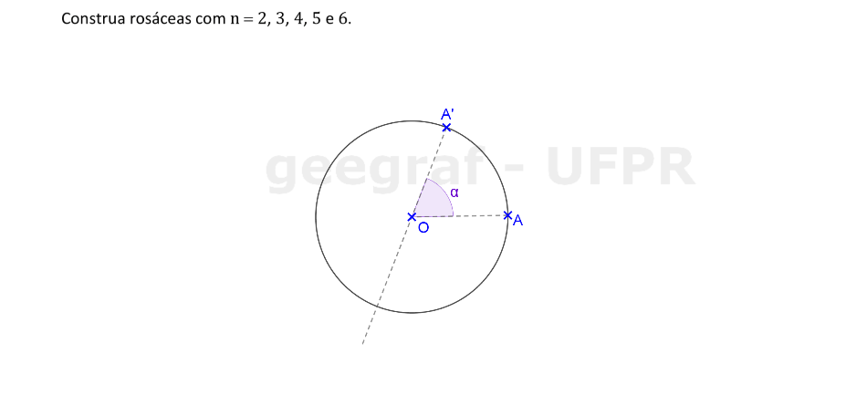
			   <figcaption>Escolha um ponto da circunferência <b>A'</b> e defina o ângulo <b>AOA' = &alpha;</b>.</figcaption>
		   </li>
		   <li>
			   <input type="radio" id="842" name="sl">
			   <label for="842"></label>
			   
			   <figcaption>Defina um número <b>n</b> e o ângulo <b>&beta; = n&middot;&alpha; = AOA''</b>.</figcaption>
		   </li>
		   <li>
			   <input type="radio" id="843" name="sl">
			   <label for="843"></label>
			   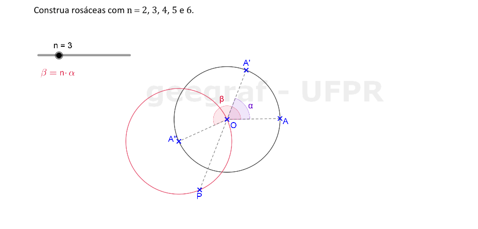
			   <figcaption>Construa a <b>Circunf(A'', A''O)</b> e determine o ponto <b>P</b> nesta circunferência tal que <b>P &isin; A'O</b>.</figcaption>
		   </li>
		   <li>
			   <input type="radio" id="844" name="sl">
			   <label for="844"></label>
			   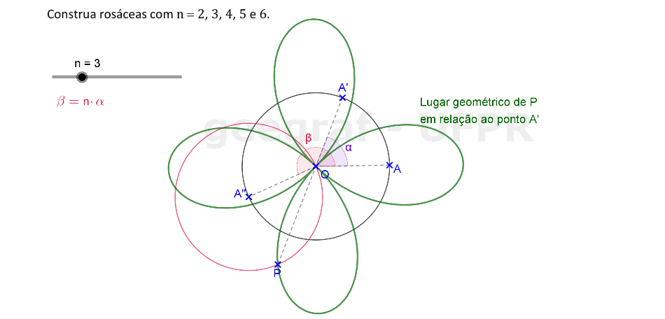
			   <figcaption>O lugar geométrico de <b>P</b> em relação ao ponto <b>A'</b> determina uma rosácea com <b>n = 3</b>: uma curva com 4 "pétalas".</figcaption>
		   </li>
		   <li>
			   <input type="radio" id="845" name="sl">
			   <label for="845"></label>
			   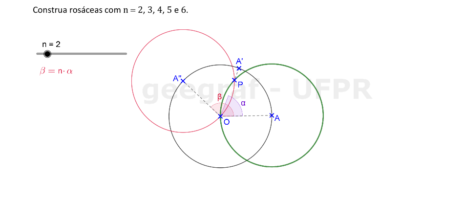
			   <figcaption>Quando <b>n = 2</b>, a rosácea coincide com uma circunferência com raio <b>OA</b> e centro em <b>A</b>.</figcaption>
		   </li>
		   <li>
			   <input type="radio" id="846" name="sl">
			   <label for="846"></label>
			   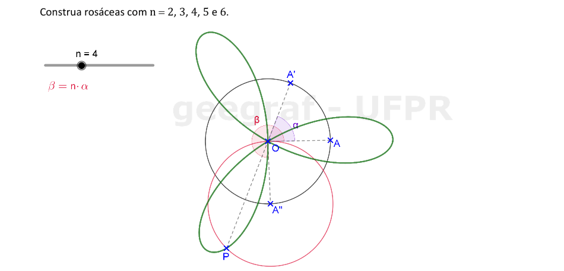
			   <figcaption>Quando <b>n = 4</b>, a rosácea contém 3 "pétalas".</figcaption>
		   </li>
		   <li>
			   <input type="radio" id="847" name="sl">
			   <label for="847"></label>
			   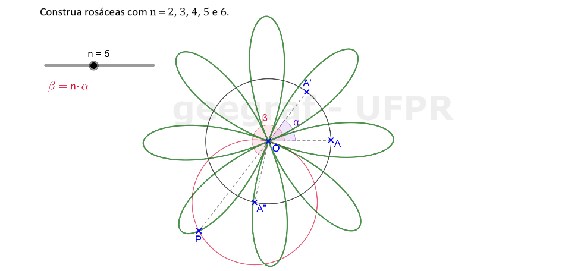
			   <figcaption>Quando <b>n = 5</b>, a rosácea contém 8 "pétalas".</figcaption>
		   </li>
		   <li>
			   <input type="radio" id="848" name="sl">
			   <label for="848"></label>
			   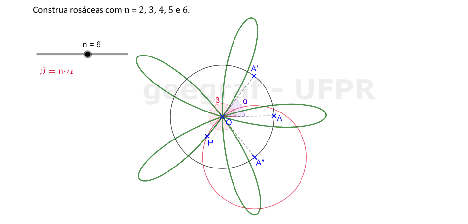
			   <figcaption>E quando <b>n = 6</b>, a rosácea contém 5 "pétalas".</figcaption>
		   </li>
		</ul>
		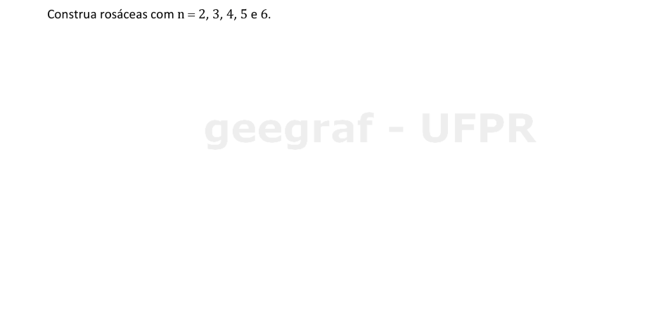
  

   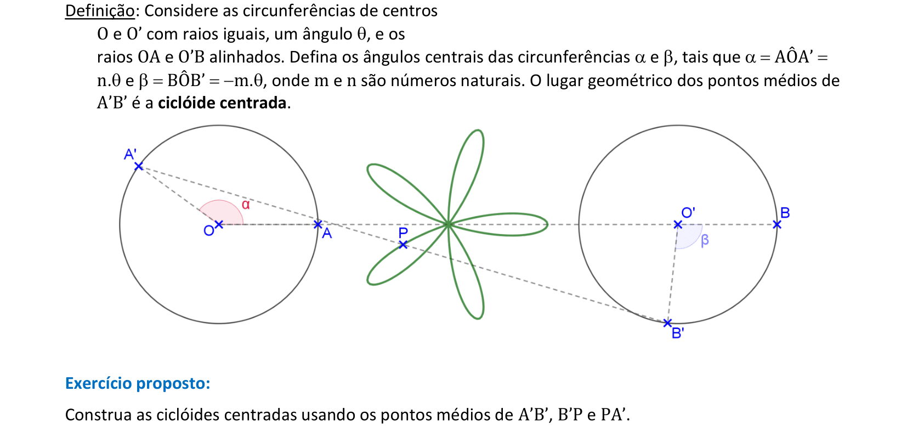
   

&#x1f4cf; &#x1f4d0; Resolução

	
Vamos construir as ciclóides centradas usando os pontos médios dos segmentos <b>A'B'</b>, <b>B'P</b> e <b>PA'</b>.

	  <ul class="slider">
		   <li>
			   <input type="radio" id="849" name="sl">
			   <label for="849"></label>
			   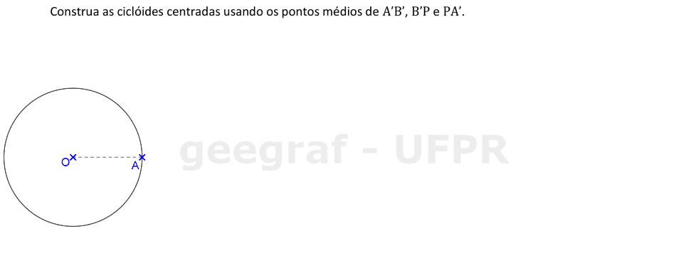
			   <figcaption>Construa uma circunferência de raio <b>OA</b>.</figcaption>
		   </li>
		   <li>
			   <input type="radio" id="851" name="sl">
			   <label for="851"></label>
			   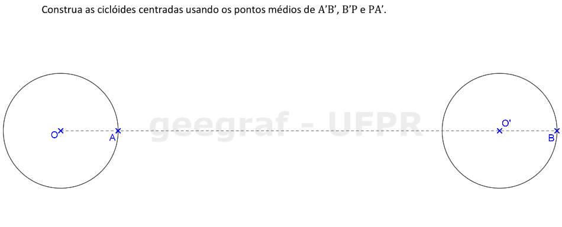
			   <figcaption>Construa uma circunferência de raio <b>O'B = OA</b>, onde os pontos <b>O</b>, <b>A</b>, <b>O'</b> e <b>B</b> estão alinhados.</figcaption>
		   </li>
		   <li>
			   <input type="radio" id="852" name="sl">
			   <label for="852"></label>
			   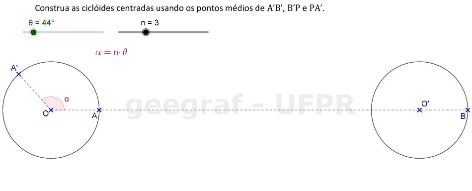
			   <figcaption>Defina um número <b>n</b>, o ângulo <b>&theta;</b> e o ângulo <b>&alpha; = n&middot;&theta; = AOA'</b>.</figcaption>
		   </li>
		   <li>
			   <input type="radio" id="853" name="sl">
			   <label for="853"></label>
			   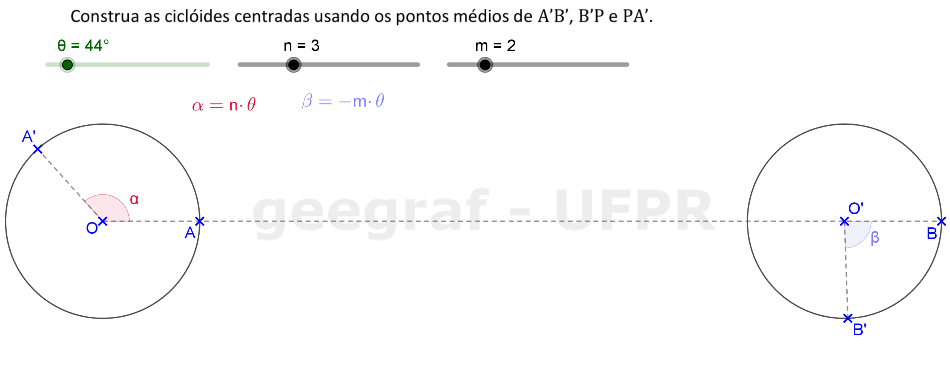
			   <figcaption>Defina o número <b>m</b> e o ângulo <b>&beta; = -m&middot;&theta; = BO'B'</b>.</figcaption>
		   </li>
		   <li>
			   <input type="radio" id="854" name="sl">
			   <label for="854"></label>
			   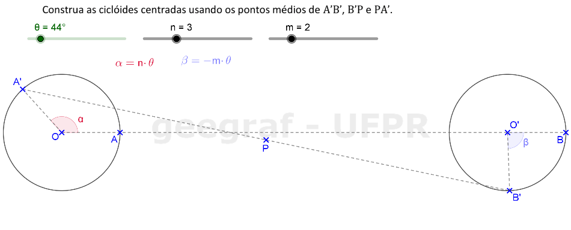
			   <figcaption>Encontre o ponto médio de <b>A'B'</b>.</figcaption>
		   </li>
		   <li>
			   <input type="radio" id="855" name="sl">
			   <label for="855"></label>
			   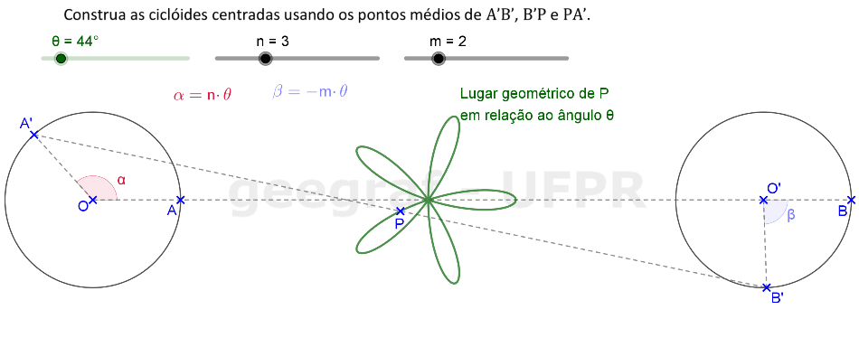
			   <figcaption>O lugar geométrico de <b>P</b> em relação ao ângulo <b>&theta;</b> determina uma ciclóide centrada com <b>m = 2</b> e <b>n = 3</b>.</figcaption>
		   </li>
		   <li>
			   <input type="radio" id="856" name="sl">
			   <label for="856"></label>
			   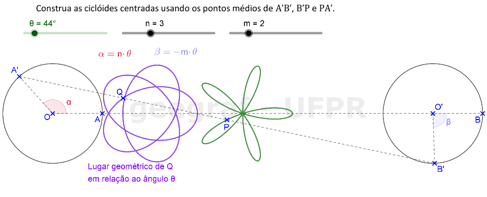
			   <figcaption>Encontre o ponto médio de <b>A'P</b>. O lugar geométrico de <b>Q</b> em relação ao ângulo <b>&theta;</b> determina outra ciclóide centrada.</figcaption>
		   </li>
		   <li>
			   <input type="radio" id="857" name="sl">
			   <label for="857"></label>
			   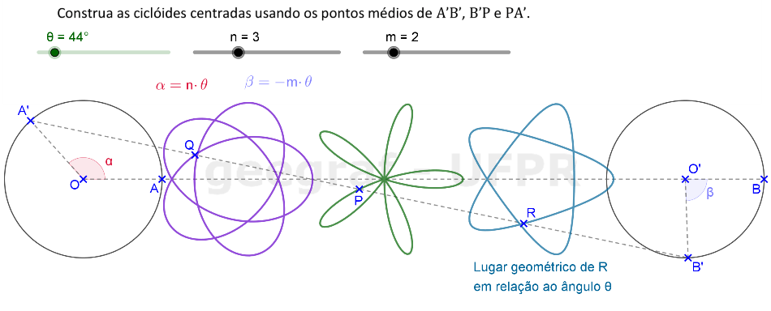
			   <figcaption>Encontre o ponto médio de <b>B'P</b>. O lugar geométrico de <b>R</b> em relação ao ângulo <b>&theta;</b> determina outra ciclóide centrada.</figcaption>
		   </li>
		   <li>
			   <input type="radio" id="850" name="sl">
			   <label for="850"></label>
			   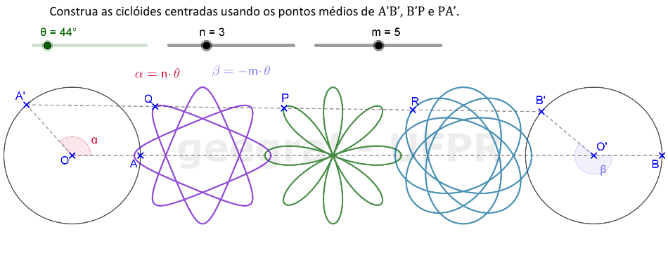
			   <figcaption>Modifique os valores de <b>m</b> e de <b>n</b> para obter novas curvas. Neste exemplo, temos <b>m = 5</b> e <b>n = 3</b>.</figcaption>
		   </li>
		   <li>
			   <input type="radio" id="858" name="sl">
			   <label for="858"></label>
			   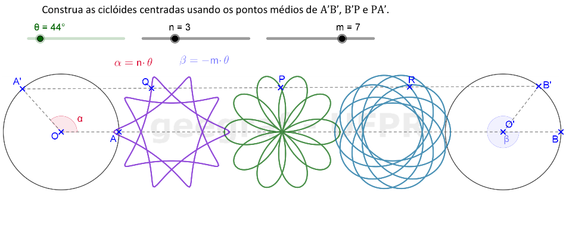
			   <figcaption>Neste exemplo, temos <b>m = 7</b> e <b>n = 3</b>.</figcaption>
		   </li>
		</ul>
		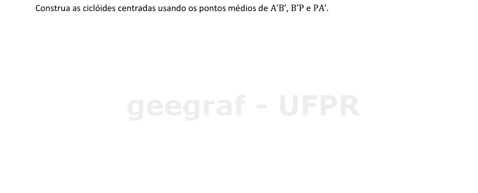
  

   
<a href="#modulo6" class="topo">voltar ao topo</a>

   
   

&#x1f4cf; &#x1f4d0; Resolução

	
Vamos construir a curva bifolium usando as 3 definições mostradas nesta página.

	  <ul class="slider">
		   <li>
			   <input type="radio" id="859" name="sl">
			   <label for="859"></label>
			   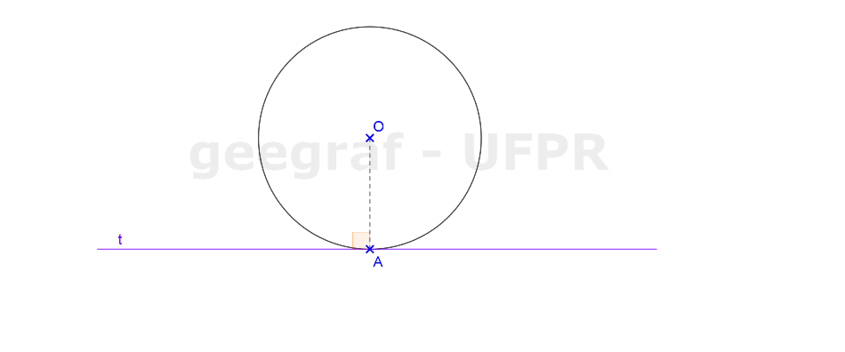
			   <figcaption><b>Definição 1</b>: Construa uma circunferência de raio <b>OA</b> e a reta tangente <b>t</b> que passa por <b>A</b>.</figcaption>
		   </li>
		   <li>
			   <input type="radio" id="861" name="sl">
			   <label for="861"></label>
			   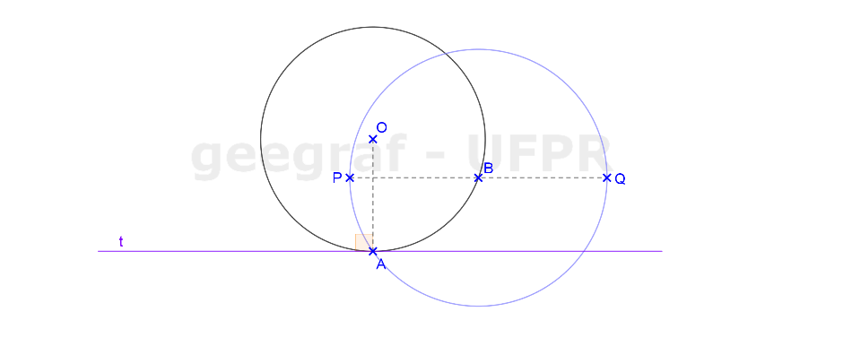
			   <figcaption>Escolha um ponto <b>B</b> da circunferência e construa a <b>Circunf(B, AB)</b>. Determine o diâmetro <b>PQ // t</b>.</figcaption>
		   </li>
		   <li>
			   <input type="radio" id="862" name="sl">
			   <label for="862"></label>
			   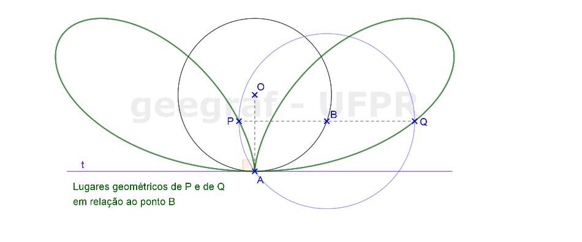
			   <figcaption>Os lugares geométricos de <b>P</b> e de <b>Q</b> em relação ao ponto <b>B</b> definem uma curva bifolium.</figcaption>
		   </li>
		   <li>
			   <input type="radio" id="863" name="sl">
			   <label for="863"></label>
			   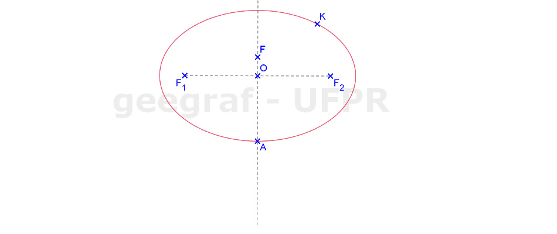
			   <figcaption><b>Definição 2</b>: Construa uma elipse que contém um ponto <b>K</b> e a reta <b>AF</b> que passa pelo centro da cônica.</figcaption>
		   </li>
		   <li>
			   <input type="radio" id="864" name="sl">
			   <label for="864"></label>
			   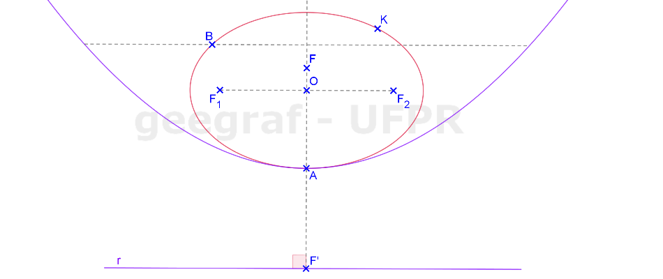
			   <figcaption>Construa uma parábola com vértice <b>A</b> e com a diretriz <b>r</b> que passa pelo simétrico de <b>F</b> em relação ao ponto <b>A</b>. Escolha um ponto <b>B</b> da elipse e construa uma reta paralela a <b>r</b> que passa por <b>B</b>.</figcaption>
		   </li>
		   <li>
			   <input type="radio" id="866" name="sl">
			   <label for="866"></label>
			   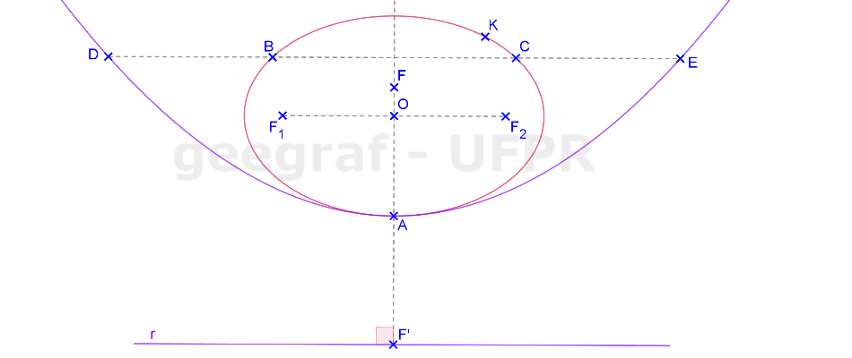
			   <figcaption>Encontre os pontos de interseção das cônicas que pertencem à reta que passa por <b>B</b>: <b>D</b>, <b>C</b> e <b>E</b>.</figcaption>
		   </li>
		   <li>
			   <input type="radio" id="867" name="sl">
			   <label for="867"></label>
			   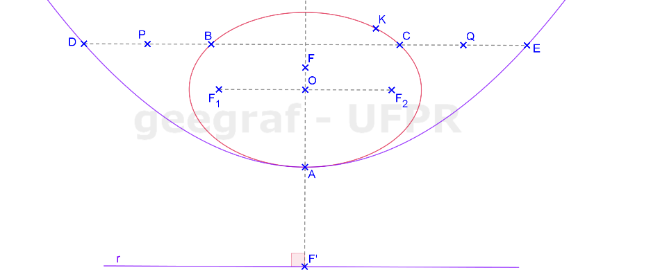
			   <figcaption>Encontre os pontos médios de <b>BD</b> e de <b>CE</b>.</figcaption>
		   </li>
		   <li>
			   <input type="radio" id="860" name="sl">
			   <label for="860"></label>
			   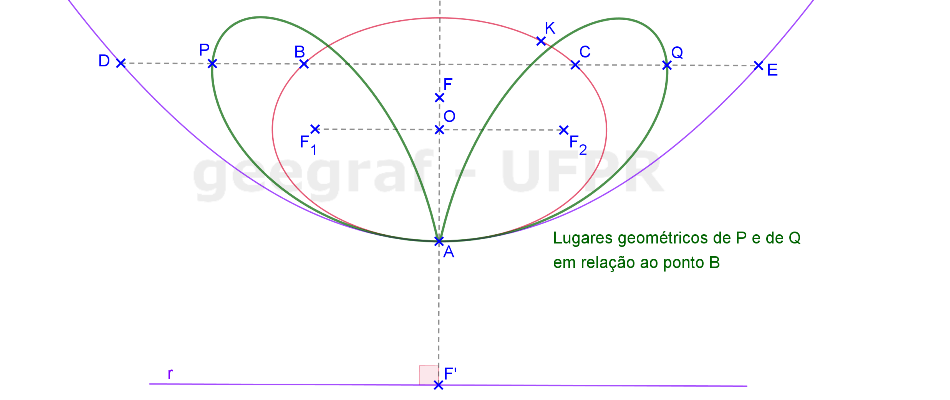
			   <figcaption>Os lugares geométricos de <b>P</b> e de <b>Q</b> em relação ao ponto <b>B</b> determinam uma curva bifolium.</figcaption>
		   </li>
		   <li>
			   <input type="radio" id="868" name="sl">
			   <label for="868"></label>
			   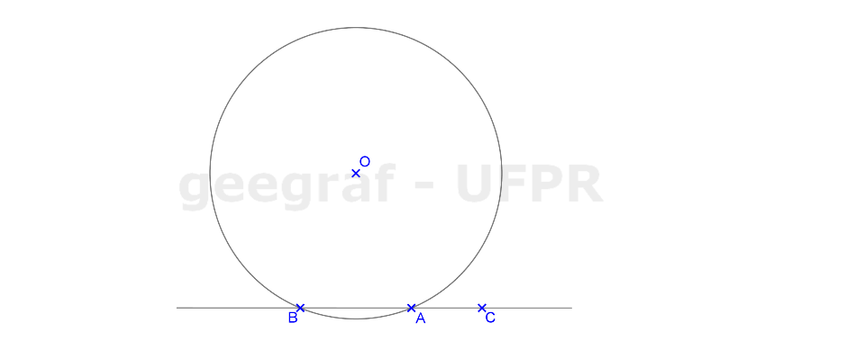
			   <figcaption><b>Definição 3</b>: Construa uma circunferência com raio <b>OA</b>, e escolha um ponto <b>B</b> da circunferência. Defina a reta <b>AB</b> e escolha um ponto <b>C &isin; AB</b>.</figcaption>
		   </li>
		   <li>
			   <input type="radio" id="869" name="sl">
			   <label for="869"></label>
			   
			   <figcaption>Construa o segmento <b>CD &perp; AB</b> e encontre a interseção deste segmento com a circunferência.</figcaption>
		   </li>
		   <li>
			   <input type="radio" id="870" name="sl">
			   <label for="870"></label>
			   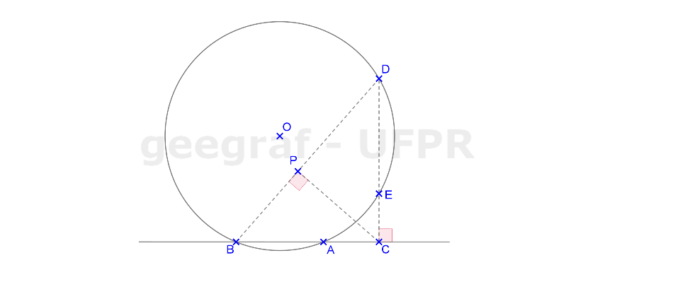
			   <figcaption>Defina o segmento <b>BD</b> e construa <b>PC &perp; BD</b>.</figcaption>
		   </li>
		   <li>
			   <input type="radio" id="871" name="sl">
			   <label for="871"></label>
			   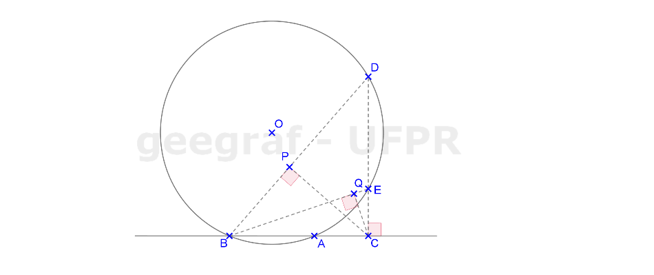
			   <figcaption>Defina o segmento <b>BE</b> e construa <b>QC &perp; BE</b>.</figcaption>
		   </li>
		   <li>
			   <input type="radio" id="872" name="sl">
			   <label for="872"></label>
			   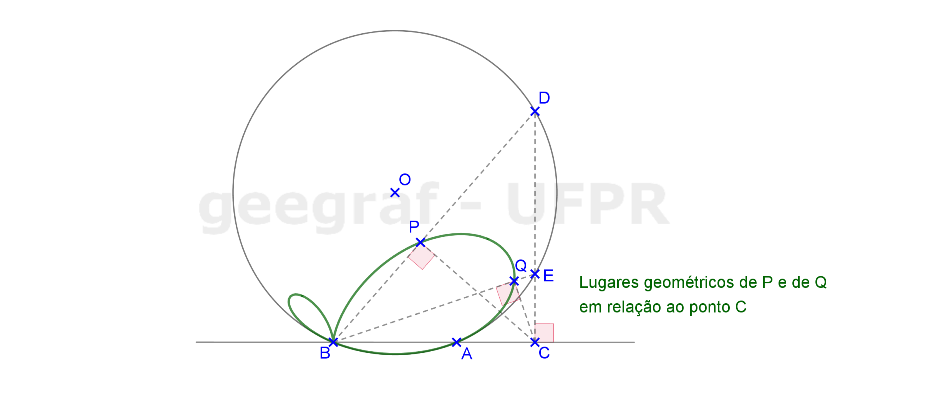
			   <figcaption>Os lugares geométricos de <b>P</b> e de <b>Q</b> em relação ao ponto <b>C</b> determinam uma curva bifolium.</figcaption>
		   </li>
		</ul>
		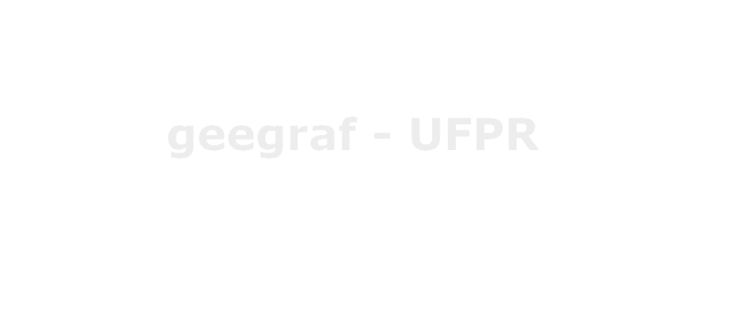
  

   
<a href="#modulo6" class="topo">voltar ao topo</a>

   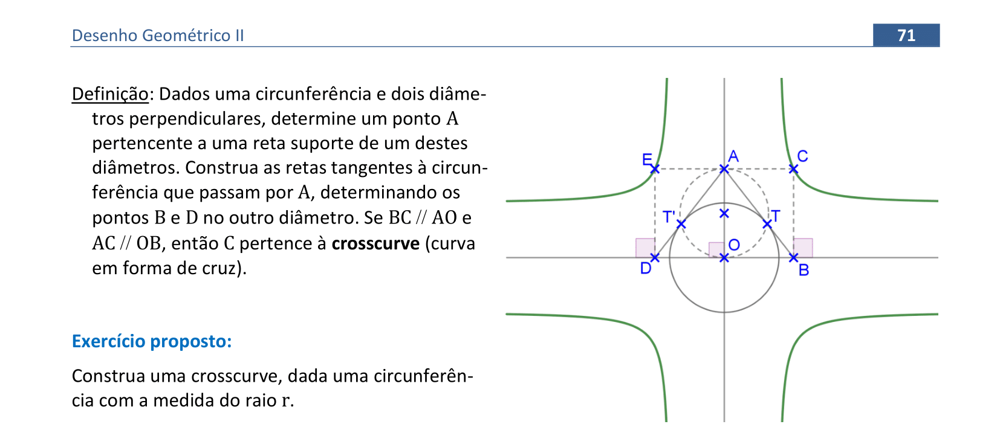
   

&#x1f4cf; &#x1f4d0; Resolução

	
Vamos construir uma crosscurve a partir de uma circunferência.

	  <ul class="slider">
		   <li>
			   <input type="radio" id="873" name="sl">
			   <label for="873"></label>
			   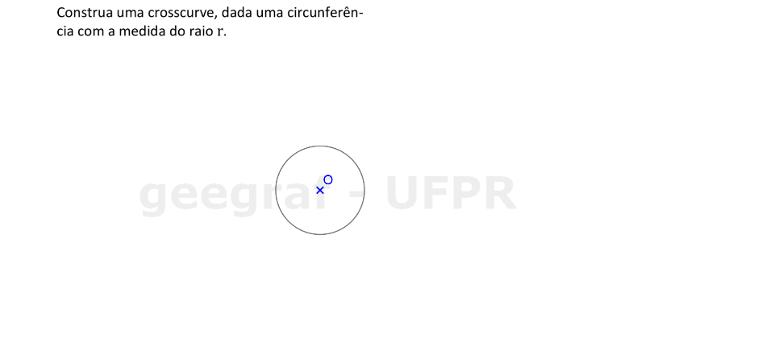
			   <figcaption>Construa uma circunferência de raio <b>r</b>.</figcaption>
		   </li>
		   <li>
			   <input type="radio" id="874" name="sl">
			   <label for="874"></label>
			   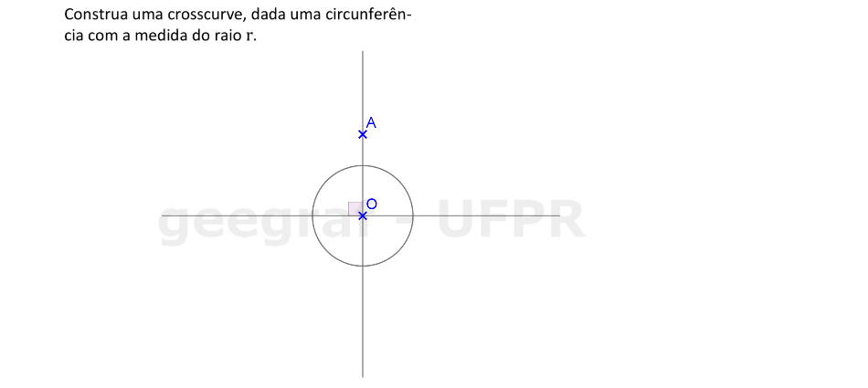
			   <figcaption>Construa os segmentos perpendiculares que passam pelo centro <b>O</b> da circunferência. Escolha um ponto <b>A</b> de um dos segmentos.</figcaption>
		   </li>
		   <li>
			   <input type="radio" id="875" name="sl">
			   <label for="875"></label>
			   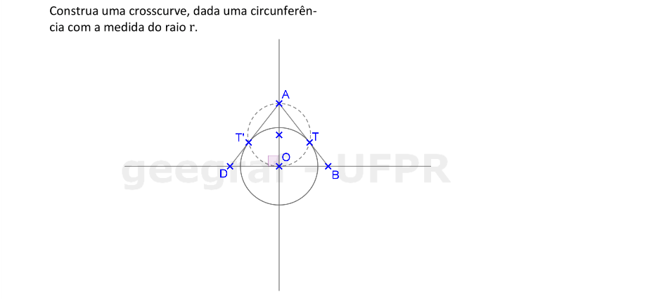
			   <figcaption>Construa os segmentos <b>AD</b> e <b>AB</b> tangentes à circunferência, onde <b>B</b> e <b>D</b> pertencem ao segmento perpendicular ao segmento que contém <b>A</b>.</figcaption>
		   </li>
		   <li>
			   <input type="radio" id="876" name="sl">
			   <label for="876"></label>
			   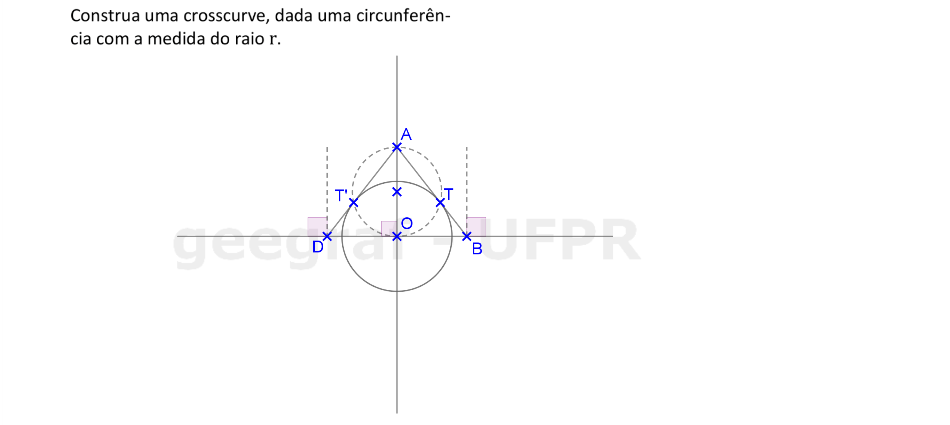
			   <figcaption>Construa as retas perpendiculares a <b>BD</b> que passam por <b>B</b> e por <b>D</b>.</figcaption>
		   </li>
		   <li>
			   <input type="radio" id="877" name="sl">
			   <label for="877"></label>
			   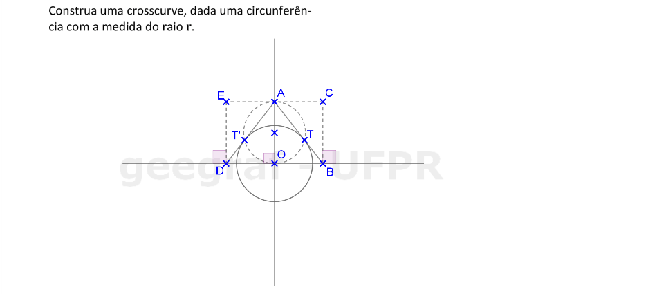
			   <figcaption>Construa a reta paralela a <b>BD</b> e encontre os pontos <b>C</b> e <b>E</b> nesta reta tais que <b>DE &perp; OD</b> e <b>BC &perp; OD</b>.</figcaption>
		   </li>
		   <li>
			   <input type="radio" id="878" name="sl">
			   <label for="878"></label>
			   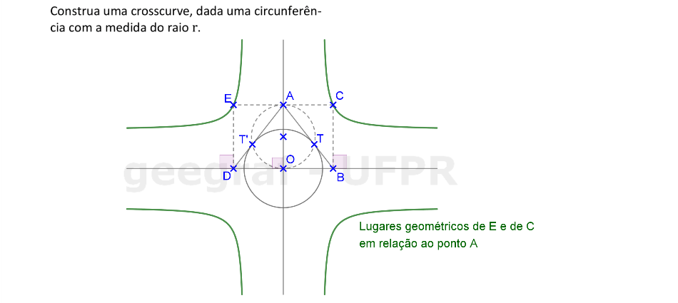
			   <figcaption>Os lugares geométricos de <b>E</b> e de <b>C</b> em relação ao ponto <b>A</b> determinam uma crosscurve.</figcaption>
		   </li>
		</ul>
		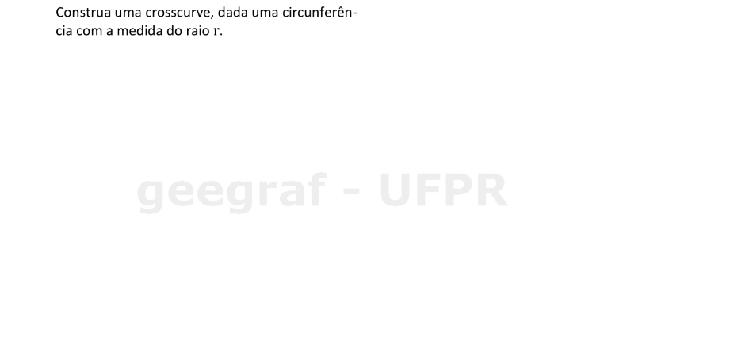
  

   
   

&#x1f4cf; &#x1f4d0; Resolução

	
Vamos construir uma curva de Watt a partir das circunferências com raios de medida <b>r</b> e uma distância <b>d</b>.

	  <ul class="slider">
		   <li>
			   <input type="radio" id="879" name="sl">
			   <label for="879"></label>
			   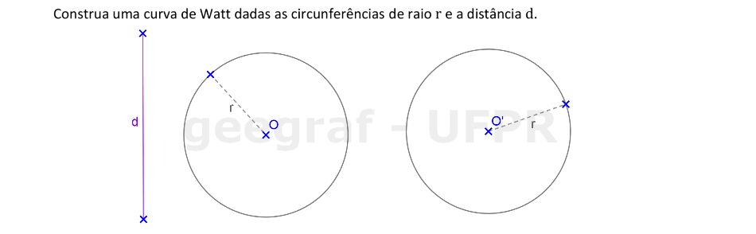
			   <figcaption>Construa as circunferências com raios iguais a <b>r</b> e defina uma distância <b>d</b>.</figcaption>
		   </li>
		   <li>
			   <input type="radio" id="880" name="sl">
			   <label for="880"></label>
			   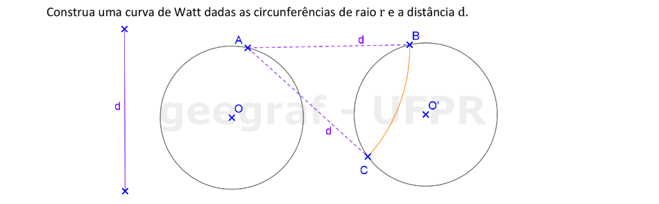
			   <figcaption>Escolha um ponto <b>A</b> da circunferência de centro <b>O</b> e encontre os pontos <b>B</b> e <b>C</b> da circunferência de centro <b>O'</b> tais que <b>AB = AC = d</b>.</figcaption>
		   </li>
		   <li>
			   <input type="radio" id="881" name="sl">
			   <label for="881"></label>
			   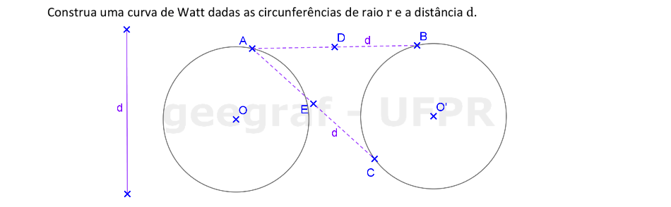
			   <figcaption>Determine os pontos médios de <b>AB</b> e de <b>AC</b>.</figcaption>
		   </li>
		   <li>
			   <input type="radio" id="882" name="sl">
			   <label for="882"></label>
			   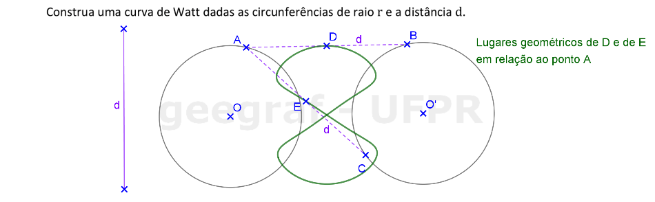
			   <figcaption>Os lugares geométricos de <b>D</b> e de <b>E</b> em relação ao ponto <b>A</b> determinam uma curva de Watt.</figcaption>
		   </li>
		</ul>
		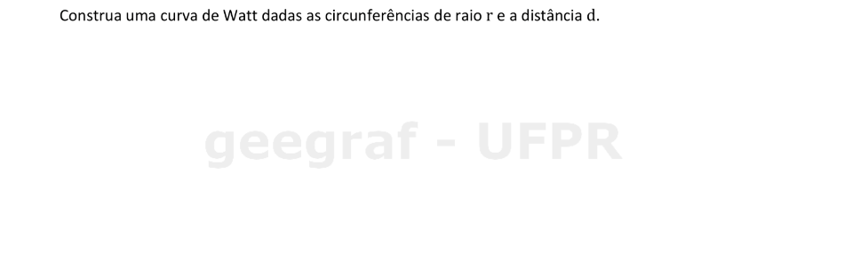
  

   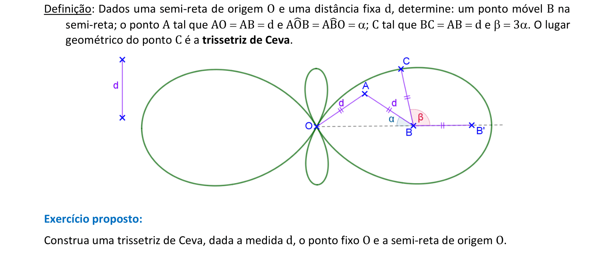
   

&#x1f4cf; &#x1f4d0; Resolução

	
Vamos construir uma trissetriz de Ceva a partir de um ponto fixo <b>O</b> e uma distância <b>d</b> e a semi-reta de origem <b>O</b>.

	  <ul class="slider">
		   <li>
			   <input type="radio" id="883" name="sl">
			   <label for="883"></label>
			   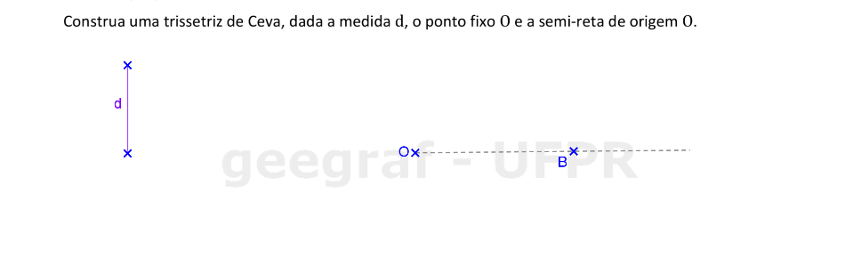
			   <figcaption>Construa a semi-reta de origem <b>O</b>, escolha um ponto <b>B</b> desta semi-reta e defina uma distância <b>d</b>.</figcaption>
		   </li>
		   <li>
			   <input type="radio" id="884" name="sl">
			   <label for="884"></label>
			   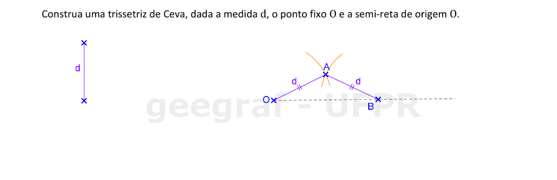
			   <figcaption>Encontre um ponto <b>A</b> tal que <b>OA = AB = d</b>.</figcaption>
		   </li>
		   <li>
			   <input type="radio" id="885" name="sl">
			   <label for="885"></label>
			   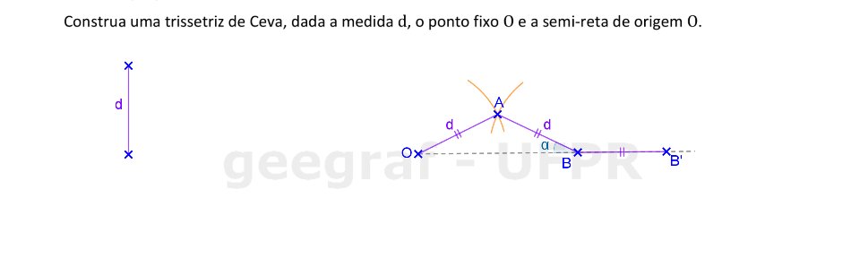
			   <figcaption>Encontre o ponto <b>B'</b> da semi-reta tal que <b>BB' = d</b>. Defina o ângulo <b>&alpha; = OBA</b>.</figcaption>
		   </li>
		   <li>
			   <input type="radio" id="886" name="sl">
			   <label for="886"></label>
			   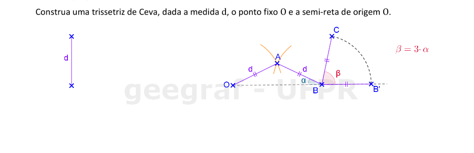
			   <figcaption>Determine o ângulo <b>&beta; = 3&middot;&alpha; = B'BC</b>.</figcaption>
		   </li>
		   <li>
			   <input type="radio" id="887" name="sl">
			   <label for="887"></label>
			   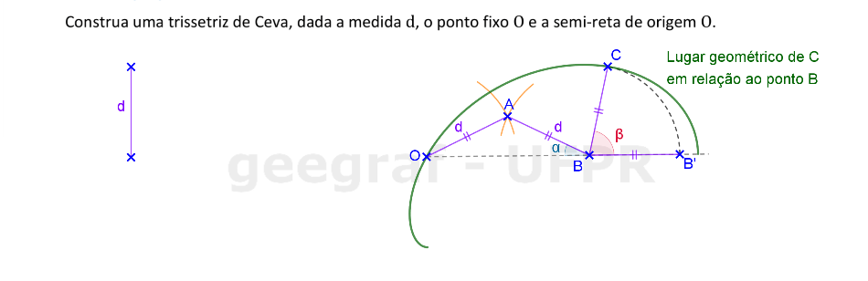
			   <figcaption>O lugar geométrico de <b>C</b> em relação ao ponto <b>B</b> determina uma parte da trissetriz de Ceva.</figcaption>
		   </li>
		   <li>
			   <input type="radio" id="888" name="sl">
			   <label for="888"></label>
			   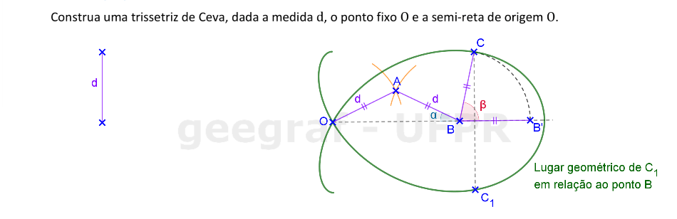
			   <figcaption>Encontre o simétrico de <b>C</b> em relação à semi-reta <b>OB</b>. O lugar geométrico de <b>C1</b> em relação ao ponto <b>B</b> determina outra parte da trissetriz de Ceva.</figcaption>
		   </li>
		   <li>
			   <input type="radio" id="889" name="sl">
			   <label for="889"></label>
			   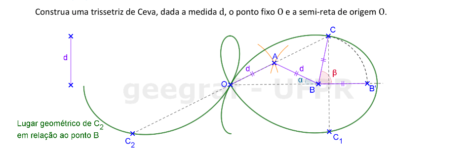
			   <figcaption>Encontre o simétrico de <b>C</b> em relação ao ponto <b>O</b>. O lugar geométrico de <b>C2</b> em relação ao ponto <b>B</b> determina outra parte da trissetriz de Ceva.</figcaption>
		   </li>
		   <li>
			   <input type="radio" id="890" name="sl">
			   <label for="890"></label>
			   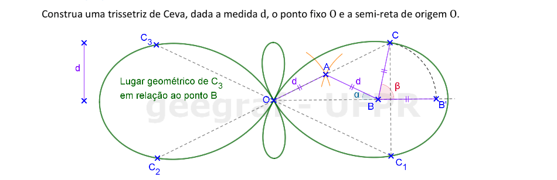
			   <figcaption>Finalmente, encontre o simétrico de <b>C1</b> em relação ao ponto <b>O</b>. O lugar geométrico de <b>C3</b> em relação ao ponto <b>B</b> determina outra parte da trissetriz de Ceva.</figcaption>
		   </li>
		</ul>
		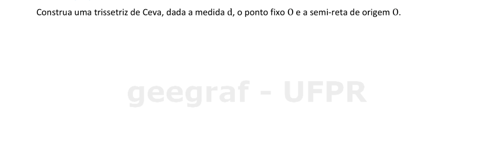
  

   
<a href="#modulo6" class="topo">voltar ao topo</a>

   
   

&#x1f4cf; &#x1f4d0; Resolução

	
Vamos construir uma oval de Hügelschäffer a partir das circunferências <b>&alpha;</b> e <b>&beta;</b>.

	  <ul class="slider">
		   <li>
			   <input type="radio" id="891" name="sl">
			   <label for="891"></label>
			   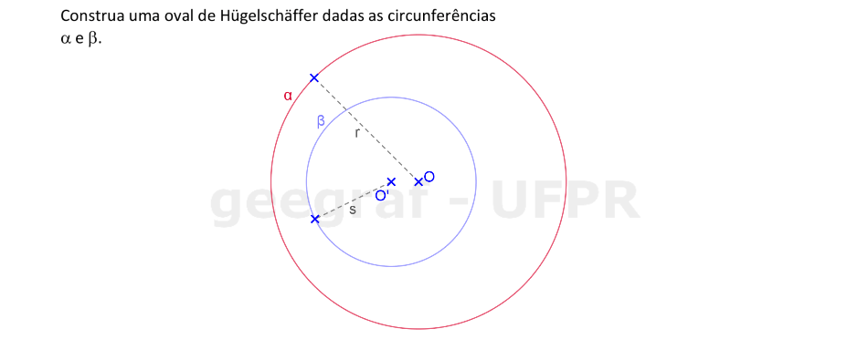
			   <figcaption>Construa as circunferências de centros <b>O</b> e <b>O'</b>, com raios de medidas <b>r</b> e <b>s</b>.</figcaption>
		   </li>
		   <li>
			   <input type="radio" id="892" name="sl">
			   <label for="892"></label>
			   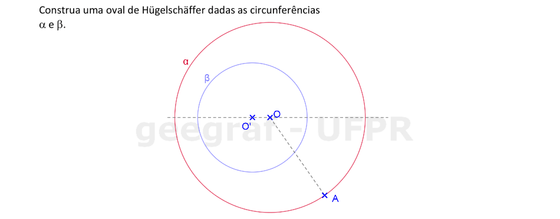
			   <figcaption>Determine a reta <b>OO'</b> e escolha um ponto <b>A &isin; &alpha;</b>.</figcaption>
		   </li>
		   <li>
			   <input type="radio" id="893" name="sl">
			   <label for="893"></label>
			   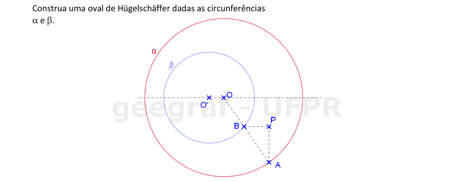
			   <figcaption>Encontre o ponto <b>P</b> tal que <b>PB // OO'</b> e <b>PA &perp; OO'</b>.</figcaption>
		   </li>
		   <li>
			   <input type="radio" id="894" name="sl">
			   <label for="894"></label>
			   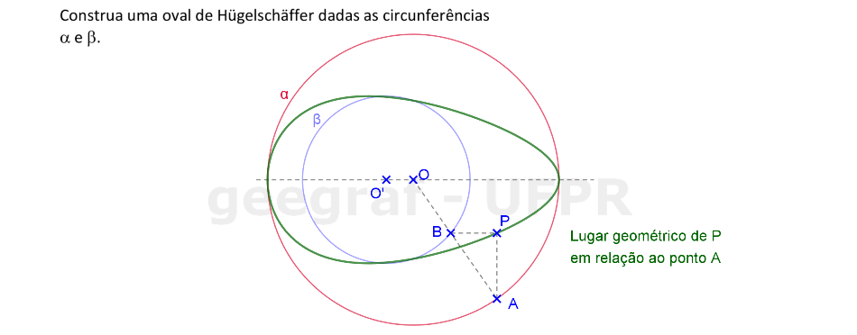
			   <figcaption>O lugar geométrico de <b>P</b> em relação ao ponto <b>A</b> define uma oval de Hügelschäffer.</figcaption>
		   </li>
		</ul>
		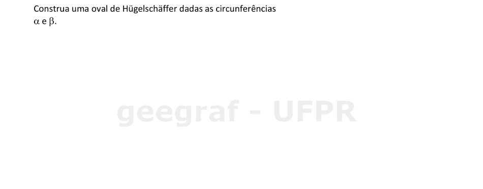
  

   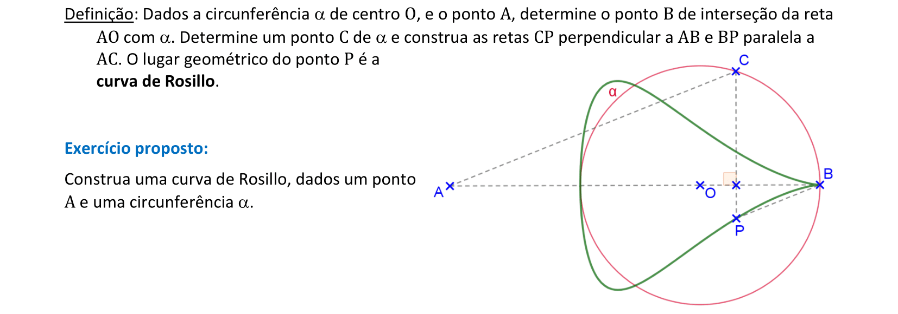
   

&#x1f4cf; &#x1f4d0; Resolução

	
Vamos construir uma curva de Rosillo a partir da circunferência <b>&alpha;</b> e de um ponto <b>A</b>.

	  <ul class="slider">
		   <li>
			   <input type="radio" id="895" name="sl">
			   <label for="895"></label>
			   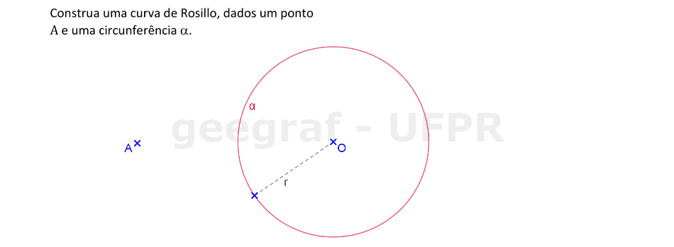
			   <figcaption>Construa a circunferência de centro <b>O</b> e raio <b>r</b> e defina o ponto <b>A</b> exterior à circunferência.</figcaption>
		   </li>
		   <li>
			   <input type="radio" id="896" name="sl">
			   <label for="896"></label>
			   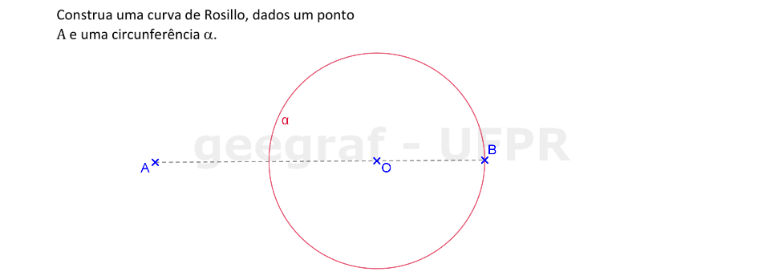
			   <figcaption>Determine a reta <b>AO</b> e encontre o ponto <b>B</b> de interseção desta reta com a circunferência.</figcaption>
		   </li>
		   <li>
			   <input type="radio" id="897" name="sl">
			   <label for="897"></label>
			   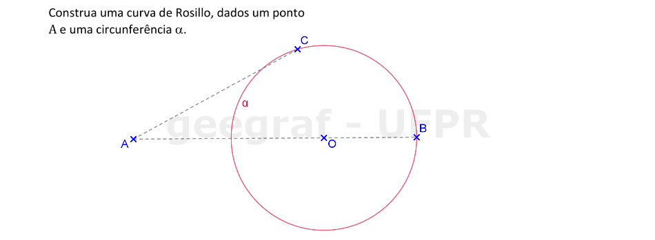
			   <figcaption>Escolha um ponto <b>C &isin; &alpha;</b> e determine o segmento <b>AC</b>.</figcaption>
		   </li>
		   <li>
			   <input type="radio" id="898" name="sl">
			   <label for="898"></label>
			   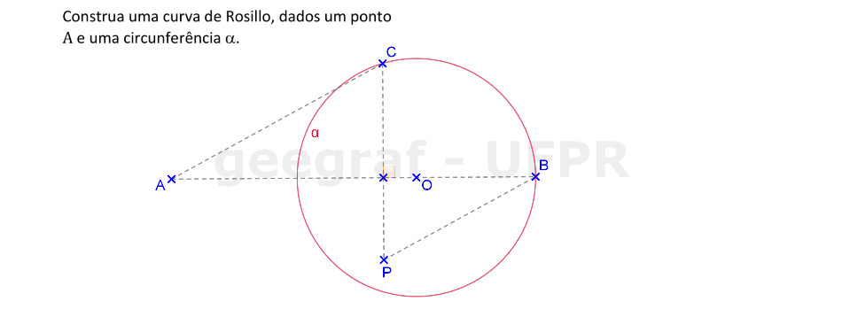
			   <figcaption>Construa o segmento <b>PC</b> tal que <b>PB // AC</b> e <b>PC &perp; AO</b>.</figcaption>
		   </li>
		   <li>
			   <input type="radio" id="899" name="sl">
			   <label for="899"></label>
			   
			   <figcaption>O lugar geométrico de <b>P</b> em relação ao ponto <b>C</b> define uma curva de Rosillo.</figcaption>
		   </li>
		</ul>
		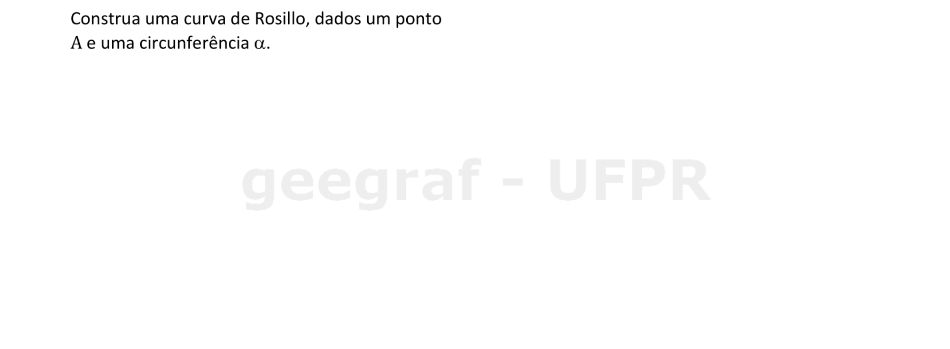
  

   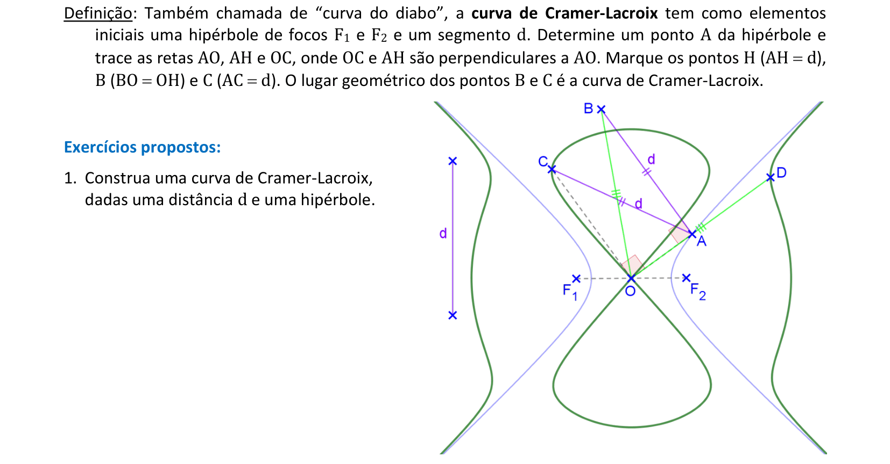
   

&#x1f4cf; &#x1f4d0; Resolução

	
Vamos construir uma curva de Cramer-Lacroix a partir de uma hipérbole e de uma distância <b>d</b>.

	  <ul class="slider">
		   <li>
			   <input type="radio" id="900" name="sl">
			   <label for="900"></label>
			   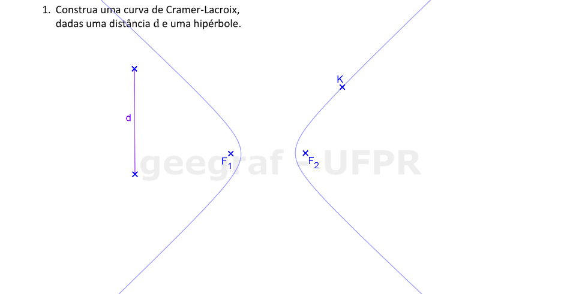
			   <figcaption>Construa uma hipérbole que passa por um ponto <b>K</b> e defina o segmento de medida <b>d</b>.</figcaption>
		   </li>
		   <li>
			   <input type="radio" id="901" name="sl">
			   <label for="901"></label>
			   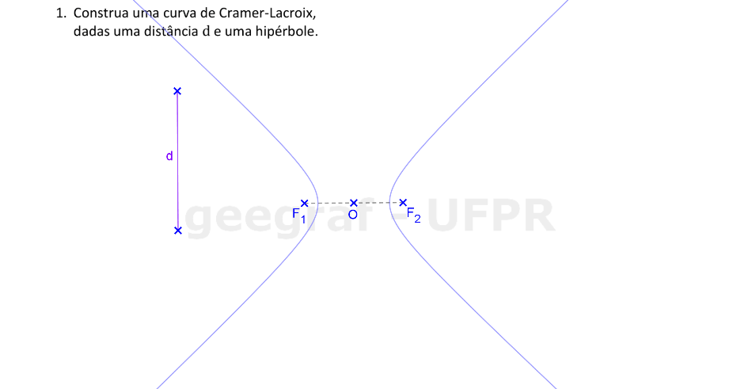
			   <figcaption>Encontre o centro <b>O</b> da hipérbole.</figcaption>
		   </li>
		   <li>
			   <input type="radio" id="902" name="sl">
			   <label for="902"></label>
			   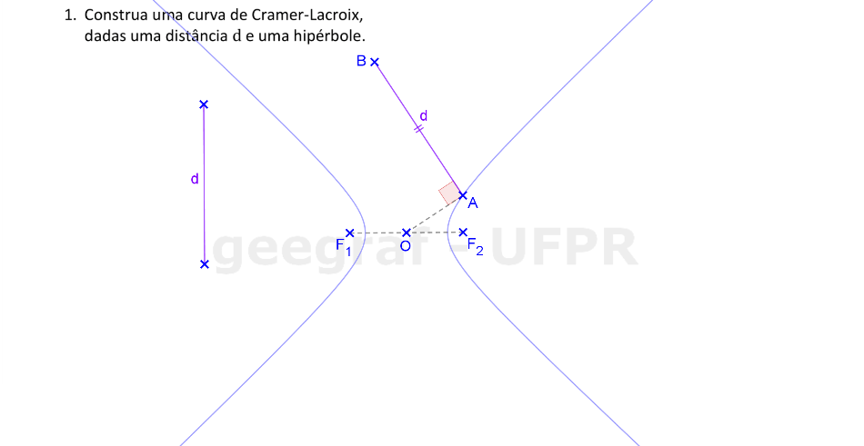
			   <figcaption>Escolha um ponto <b>A</b> da hipérbole e defina o segmento <b>AB = d</b> tal que <b>AB &perp; OA</b>.</figcaption>
		   </li>
		   <li>
			   <input type="radio" id="903" name="sl">
			   <label for="903"></label>
			   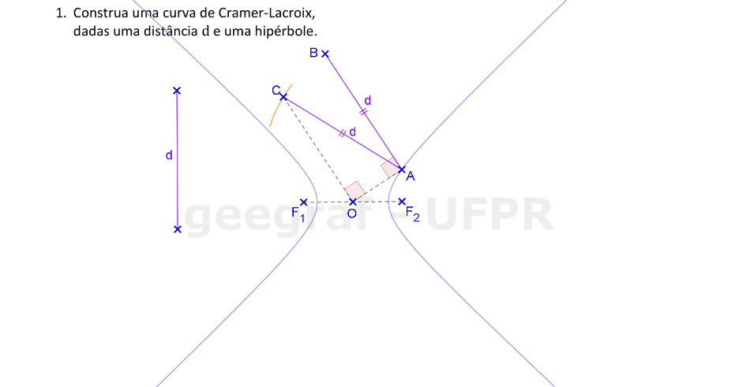
			   <figcaption>Construa o segmento <b>OC &perp; OA</b> tal que <b>AC = d</b>.</figcaption>
		   </li>
		   <li>
			   <input type="radio" id="904" name="sl">
			   <label for="904"></label>
			   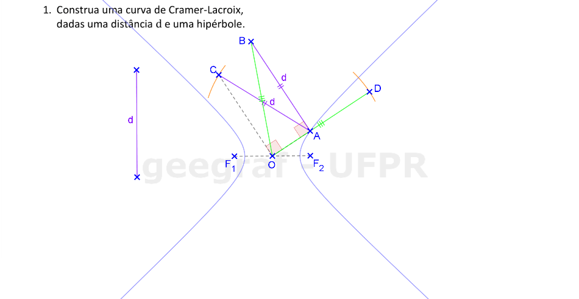
			   <figcaption>Defina o segmento <b>BO</b>, e encontre o ponto <b>D &isin; OA</b> tal que <b>DO = BO</b>.</figcaption>
		   </li>
		   <li>
			   <input type="radio" id="905" name="sl">
			   <label for="905"></label>
			   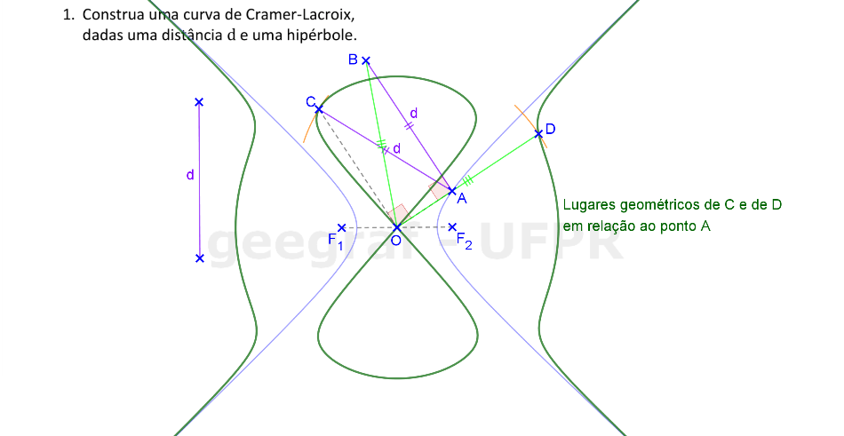
			   <figcaption>Os lugares geométricos de <b>C</b> e de <b>D</b> em relação ao ponto <b>A</b> definem uma curva de Cramer-Lacroix.</figcaption>
		   </li>
		</ul>
		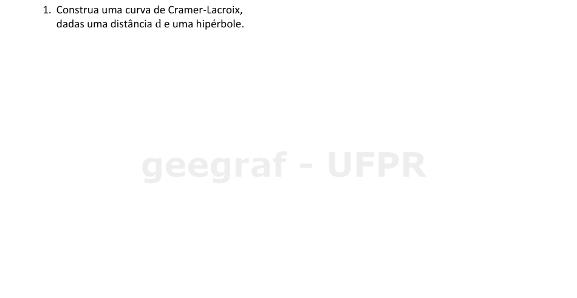
  

   
   
&#x1f4cf; &#x1f4d0; Exercício proposto 6.1

   
<a href="#modulo6" class="topo">voltar ao topo</a>

   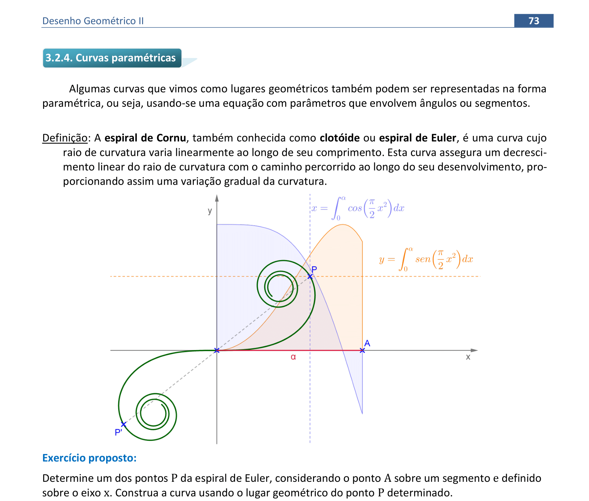
   

&#x1f4cf; &#x1f4d0; Resolução

	
Vamos construir uma espiral de Euler a partir de um ponto <b>A</b> sobre o eixo <b>x</b>.

	  <ul class="slider">
		   <li>
			   <input type="radio" id="906" name="sl">
			   <label for="906"></label>
			   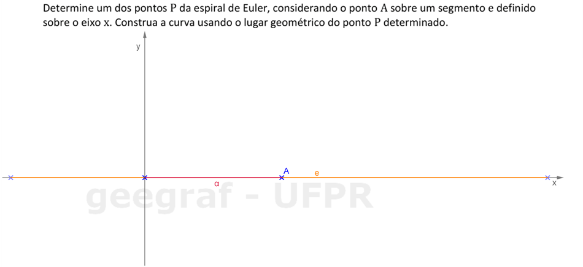
			   <figcaption>Considere o sistema de coordenadas com os eixos <b>x</b> e <b>y</b>. Defina um segmento de medida <b>e</b> sobre o eixo <b>x</b> e um ponto <b>A &isin; e</b>. Determine a medida do segmento <b>&alpha;</b>, com uma extremidade na origem do sistema de coordenadas e a outra extremidade <b>A</b>.</figcaption>
		   </li>
		   <li>
			   <input type="radio" id="907" name="sl">
			   <label for="907"></label>
			   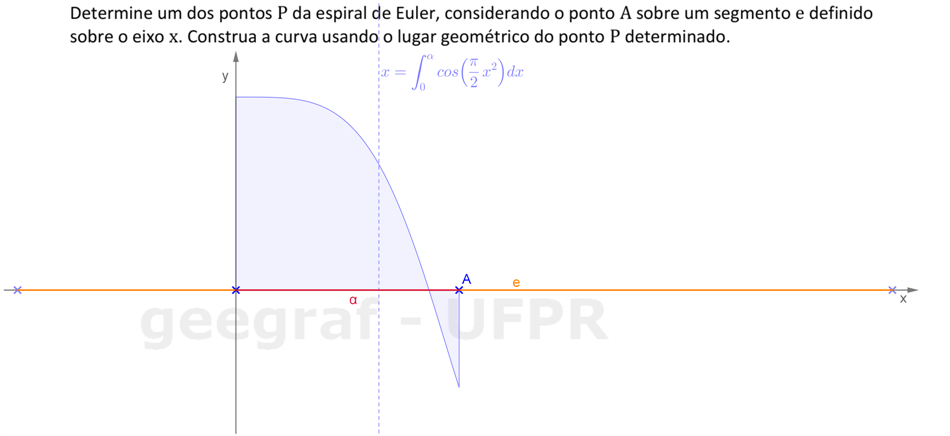
			   <figcaption>Defina a reta com equação $\mathsf{ x = { \int_{0}^{\alpha} cos \left( {\pi} \over {2} x^2 \right) \,dx } }$.</figcaption>
		   </li>
		   <li>
			   <input type="radio" id="908" name="sl">
			   <label for="908"></label>
			   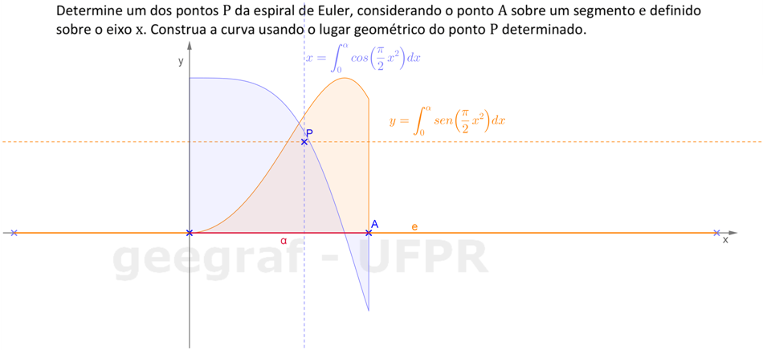
			   <figcaption>Defina a reta com equação $\mathsf{ y = { \int_{0}^{\alpha} sen \left( {\pi} \over {2} x^2 \right) \,dx } }$. Encontre o ponto <b>P</b> de interseção das retas construídas.</figcaption>
		   </li>
		   <li>
			   <input type="radio" id="909" name="sl">
			   <label for="909"></label>
			   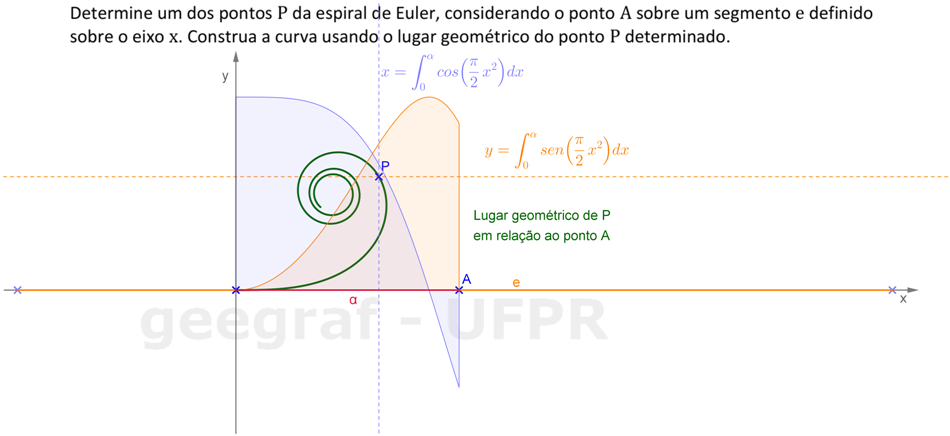
			   <figcaption>O lugar geométrico de <b>P</b> em relação ao ponto <b>A</b> define a parte de coordenadas positivas da espiral de Euler.</figcaption>
		   </li>
		   <li>
			   <input type="radio" id="910" name="sl">
			   <label for="910"></label>
			   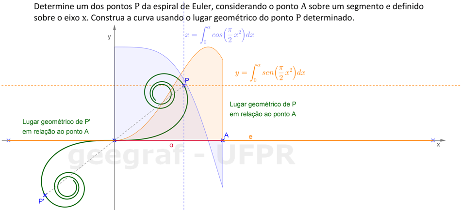
			   <figcaption>Encontre o simétrico do ponto <b>P</b> em relação à origem do sistema de coordenadas. O lugar geométrico de <b>P'</b> em relação ao ponto <b>A</b> define a parte de coordenadas negativas da espiral de Euler.</figcaption>
		   </li>
		</ul>
		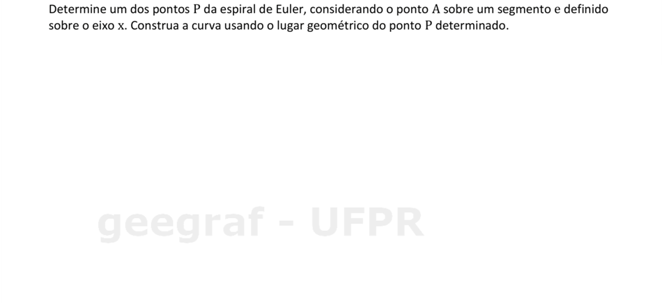
  

   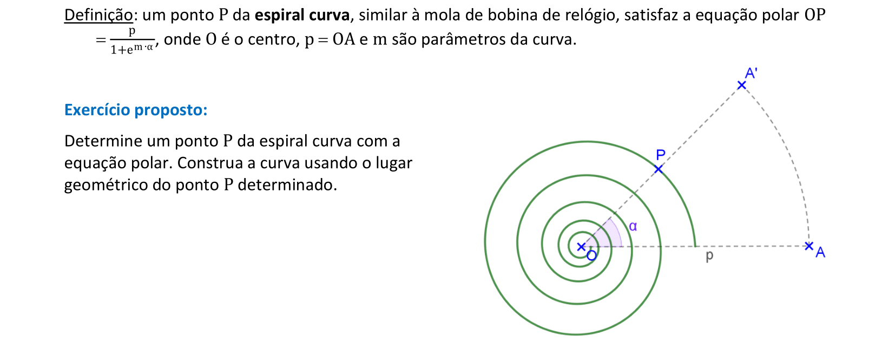
   
&#x1f4cf; &#x1f4d0; Exercício proposto 6.1

   
<a href="#modulo6" class="topo">voltar ao topo</a>

   
   

&#x1f4cf; &#x1f4d0; Resolução

	
Vamos construir uma espiral curva usando sua equação com coordenadas polares.

	  <ul class="slider">
		   <li>
			   <input type="radio" id="911" name="sl">
			   <label for="911"></label>
			   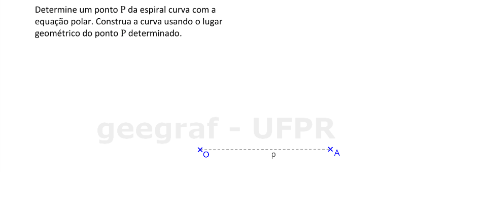
			   <figcaption>Defina o parâmetro <b>OA = p</b>.</figcaption>
		   </li>
		   <li>
			   <input type="radio" id="912" name="sl">
			   <label for="912"></label>
			   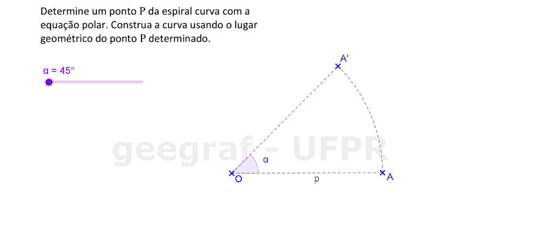
			   <figcaption>Defina o ângulo <b>&alpha;</b> e construa <b>AOA' = &alpha;</b>.</figcaption>
		   </li>
		   <li>
			   <input type="radio" id="913" name="sl">
			   <label for="913"></label>
			   
			   <figcaption>Construa a circunferência com centro <b>O</b> e raio $\mathsf{ {p} \over {1 + e ^{m \cdot \alpha}} }$. Encontre a interseção desta circunferência com o segmento <b>OA'</b>.</figcaption>
		   </li>
		   <li>
			   <input type="radio" id="914" name="sl">
			   <label for="914"></label>
			   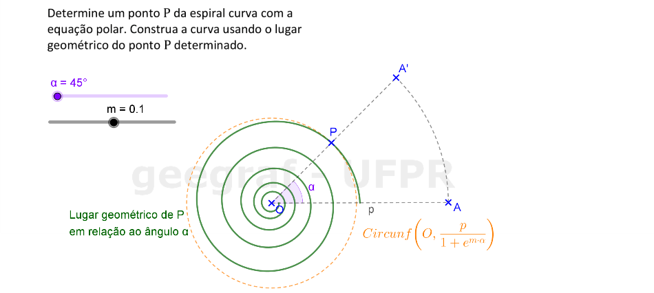
			   <figcaption>O lugar geométrico de <b>P</b> em relação ao ângulo <b>&alpha;</b> define uma espiral curva de parâmetro <b>p</b>.</figcaption>
		   </li>
		</ul>
		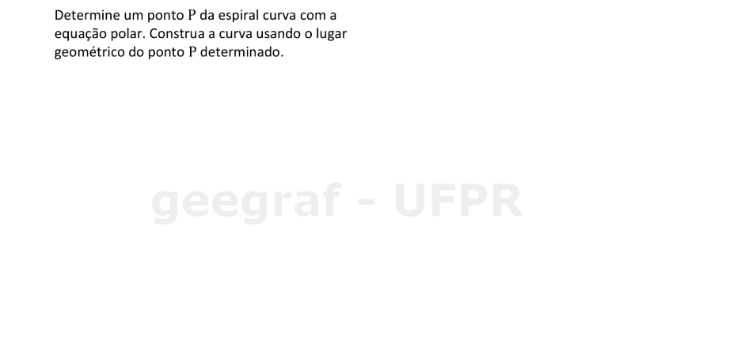
  

   
<a href="#modulo6" class="topo">voltar ao topo</a>

   
   
<a href="#modulo6" class="topo">voltar ao topo</a>

   
   
<a href="#modulo6" class="topo">voltar ao topo</a>

   
   
<a href="#modulo6" class="topo">voltar ao topo</a>

   
   
<a href="#modulo6" class="topo">voltar ao topo</a>

   
   
<a href="#modulo6" class="topo">voltar ao topo</a>

   
   
<a href="#modulo6" class="topo">voltar ao topo</a>

<h4>página desenvolvida por:</h4> 

Paulo Henrique Siqueira
  

<b>contato:</b> paulohscwb@gmail.com 

<h4>O desenvolvimento deste material de construções geométricas faz parte do Grupo de Estudos em Expressão Gráfica (GEEGRAF) da Universidade Federal do Paraná (UFPR)</h4>  

 Desenho Geométrico 2 de <a xmlns:cc="http://creativecommons.org/ns#" href="https://paulohscwb.github.io/desenho-geometrico2/" property="cc:attributionName" rel="cc:attributionURL">Paulo Henrique Siqueira</a> está licenciado com uma Licença <a rel="license" href="http://creativecommons.org/licenses/by-nc-nd/4.0/">Creative Commons Atribuição-NãoComercial-SemDerivações 4.0 Internacional</a>.

<h4>Como citar este trabalho:</h4> 

Siqueira, P.H., "Desenho Geométrico 2". Disponível em: <https://paulohscwb.github.io/desenho-geometrico2/>, Dezembro de 2022.

<h4>Referências:</h4>
<ol>
	<li>Carvalho, B.A. Desenho Geométrico. Imperial Novo Milênio, 2008.</li>
	<li>Rezende, E.Q.F.; Queiroz, M.L.B. Geometria Euclidiana plana e construções geométricas. Editora da Unicamp, 2008.</li>
	<li>Marmo, C.M.B. Curso de Desenho, vol. 1 a 4. Editora Moderna, 1967.</li>
	<li>Braga, T.B. Desenho Linear Geométrico. Editora Cone, 1997.</li>
	<li>Braga, T.B. Problemas de Desenho Linear Geométrico. Cultura Brasileira, 1962.</li>
	<li>Candido Gomes, M.E. Desenho Geométrico. Editora I.T.E.C., 1950.</li>
	<li>Giovanny, J.R. Desenho Geométrico, vol.4. Editora FTD, 1996.</li>
	<li>Putnoki, J.C. Elementos de Geometria e Desenho Geométrico. v. 1-3. Scipione, 1993.</li>
	<li>Siqueira, P.H.; Costa, D.M.B. Apostila de Desenho Geométrico 2. UFPR, 2022.</li>
<ol>
