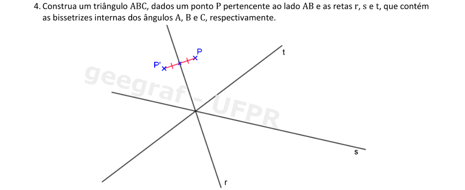
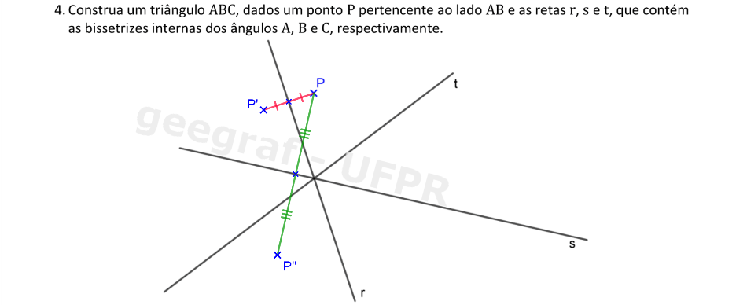
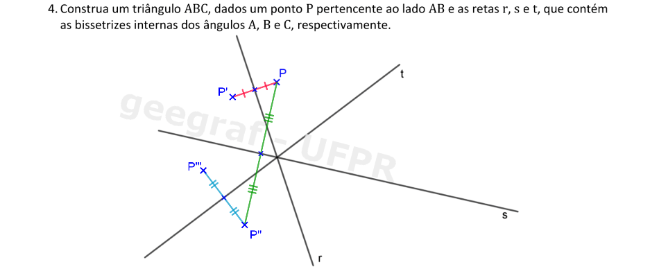
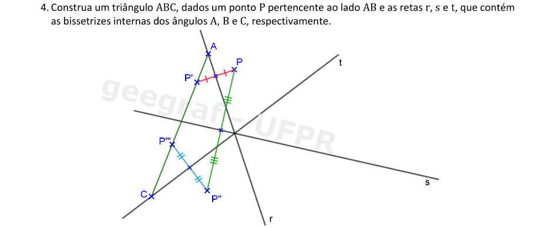
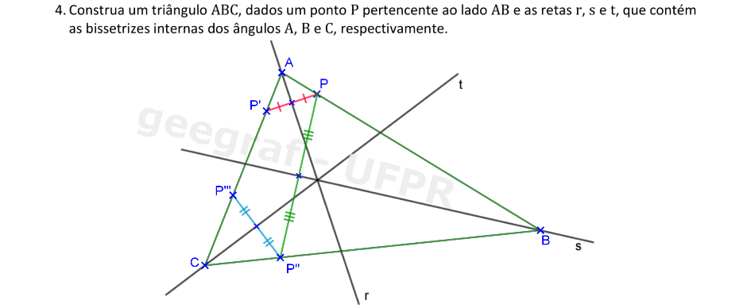
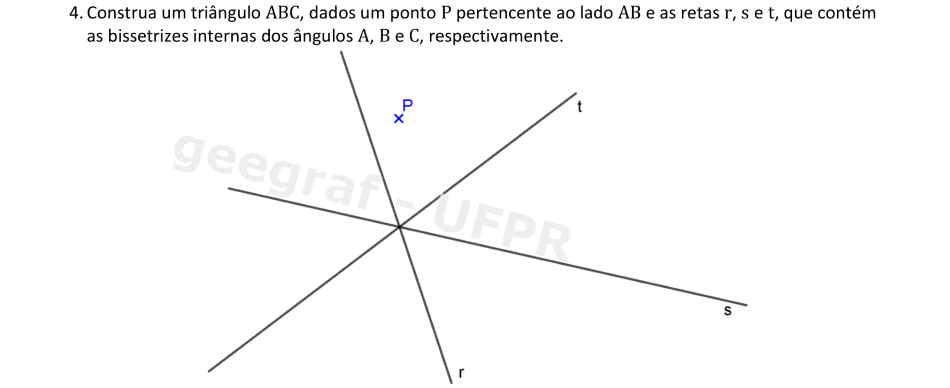
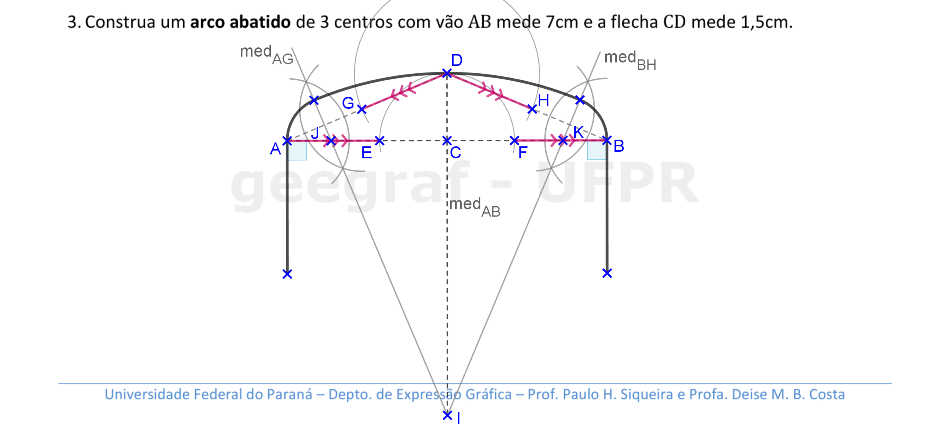

<link rel="stylesheet" href="../../imagens/style.css">

<h2 id="inicio">Exercícios Propostos do Módulo 1</h2>
<h3>Circunferência, Mediatriz, Retas Paralelas e Bissetriz</h3> 
  

Exercício Proposto 1.1: exercício 4 da pág. 2

  
  

&#x1f4cf; &#x1f4d0; Resolução

	
Em um triângulo, a bissetriz de um ângulo serve como eixo de simetria para os pontos dos lados adjacentes a este ângulo.

	  <ul class="slider">
		  <li>
			   <input type="radio" id="001p" name="sl">
			   <label for="001p"></label>
			   
			   <figcaption>A reta <b>r</b> é um eixo de simetria dos pontos <b>P</b> e <b>P'</b> que pertencem aos lados <b>AB</b> e <b>AC</b>. Construa o simétrico de <b>P</b> em relação à reta <b>r</b>.</figcaption>
		   </li>
		   <li>
			   <input type="radio" id="002p" name="sl">
			   <label for="002p"></label>
			   
			   <figcaption>A reta <b>s</b> é um eixo de simetria dos pontos <b>P</b> e <b>P''</b> que pertencem aos lados <b>AB</b> e <b>BC</b>. Construa o simétrico de <b>P</b> em relação à reta <b>s</b>.</figcaption>
		   </li>
		   <li>
			   <input type="radio" id="003p" name="sl">
			   <label for="003p"></label>
			   
			   <figcaption>A reta <b>t</b> é um eixo de simetria dos pontos <b>P'</b> e <b>P'''</b> que pertencem aos lados <b>BC</b> e <b>AC</b>. Construa o simétrico de <b>P''</b> em relação à reta <b>t</b>.</figcaption>
		   </li>
		   <li>
			   <input type="radio" id="004p" name="sl">
			   <label for="004p"></label>
			   
			   <figcaption>A reta <b>P'P'''</b> determina os vértices <b>A</b> e <b>C</b> nas retas <b>r</b> e <b>t</b>.</figcaption>
		   </li>
		   <li>
			   <input type="radio" id="005p" name="sl">
			   <label for="005p"></label>
			   
			   <figcaption>As retas <b>AP</b> e <b>CP''</b> determinam o vértice <b>B</b>.</figcaption>
		   </li>
		</ul>
		
  

  

Exercício Proposto 1.2: exercício 8 da pág. 4

  
  

&#x1f4cf; &#x1f4d0; Resolução

	
Neste problema, vamos usar o conceito dos ângulos de incidência e reflexão nas tabelas da mesa de bilhar.

	  <ul class="slider">
		  <li>
			   <input type="radio" id="006p" name="sl">
			   <label for="006p"></label>
			   
			   <figcaption>Se construirmos o simétrico de <b>Q</b> em relação à ultima tabela <b>CD</b>, teremos o ângulo de incidência igual ao ângulo de reflexão nesta tabela.</figcaption>
		   </li>
		   <li>
			   <input type="radio" id="007p" name="sl">
			   <label for="007p"></label>
			   
			   <figcaption>Usando o mesmo raciocínio, se construirmos o simétrico de <b>Q'</b> em relação à segunda tabela <b>BC</b>, teremos o ângulo de incidência igual ao ângulo de reflexão nesta tabela.</figcaption>
		   </li>
		   <li>
			   <input type="radio" id="008p" name="sl">
			   <label for="008p"></label>
			   
			   <figcaption>Se construirmos o simétrico de <b>Q''</b> em relação à primeira tabela <b>AB</b>, teremos o ângulo de incidência igual ao ângulo de reflexão nesta tabela.</figcaption>
		   </li>
		   <li>
			   <input type="radio" id="009p" name="sl">
			   <label for="009p"></label>
			   
			   <figcaption>Unindo os pontos <b>P</b> e <b>Q'''</b>, temos o ponto <b>X1</b> da trajetória que a bola fará ao sair da posição <b>P</b> com tabela <b>AB</b>.</figcaption>
		   </li>
		   <li>
			   <input type="radio" id="010p" name="sl">
			   <label for="010p"></label>
			   
			   <figcaption>Unindo os pontos <b>X1</b> e <b>Q''</b>, temos o ponto <b>X2</b> da trajetória que a bola fará ao sair da posição <b>X1</b> com tabela <b>BC</b>.</figcaption>
		   </li>
		   <li>
			   <input type="radio" id="011p" name="sl">
			   <label for="011p"></label>
			   
			   <figcaption>Unindo os pontos <b>X2</b> com <b>Q'</b> temos o ponto <b>X3</b> da trajetória que a bola fará ao sair da posição <b>X2</b> com tabela <b>CD</b>. Como o ângulo de incidência é igual ao ângulo de reflexão de cada tabela, a bola que estava na posição <b>P</b> atinge a bola que está na posição <b>Q</b> depois de fazer as tabelas <b>AB</b>, <b>BC</b> e <b>CD</b> solicitadas.</figcaption>
		   </li>
		</ul>
		
  

  

Exercício Proposto 1.3: exercício 3 da pág. 6

  
  

&#x1f4cf; &#x1f4d0; Solução

	
Usando as construções similares ao exercício 2, podemos construir o arco abatido com a flecha de 1,5cm.

	
	<figcaption>Neste arco, temos que a medida da flecha fica bem menor do que o vão do arco.</figcaption>
  

