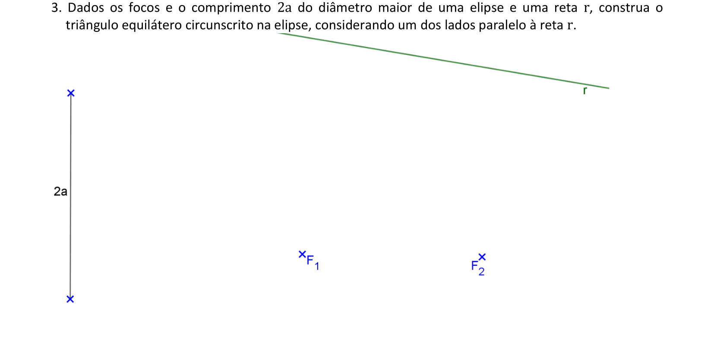

<link rel="stylesheet" href="../../imagens/style.css">

<h2 id="inicio">Exercícios Propostos do Módulo 2</h2>
<h3>Espirais e elipses</h3> 
  

Exercício Proposto 2.1: exercício 3 da pág. 21

  
  

&#x1f4cf; &#x1f4d0; Resolução

	
Vamos construir um triângulo equilátero circunscrito em uma elipse. São dados os focos, a distância <b>2a</b> da cônica e a direção <b>r</b> de um dos lados do triângulo.

	  <ul class="slider">
		  <li>
			   <input type="radio" id="001p" name="sl">
			   <label for="001p"></label>
			   
			   <figcaption>Vamos iniciar encontrando a circunferência diretriz <b>&gamma;1</b>, com centro em <b>F1</b> e raio <b>2a</b>. Construindo o segmento <b>PF2 &perp; r</b>, determinamos o ponto <b>F'2</b> na circunferência diretriz.</figcaption>
		   </li>
		   <li>
			   <input type="radio" id="002p" name="sl">
			   <label for="002p"></label>
			   
			   <figcaption>Uma das retas tangentes é a mediatriz de <b>F2F'2</b>.</figcaption>
		   </li>
		   <li>
			   <input type="radio" id="003p" name="sl">
			   <label for="003p"></label>
			   
			   <figcaption>Escolha um ponto <b>Q &isin; t</b> e construa um ângulo de 60&deg; a partir de <b>t</b>. Esta será a direção do segundo lado do triângulo equilátero.</figcaption>
		   </li>
		   <li>
			   <input type="radio" id="004p" name="sl">
			   <label for="004p"></label>
			   
			   <figcaption>Construindo o segmento <b>F''2F2</b> perpendicular à direção do segundo lado do triângulo equilátero...</figcaption>
		   </li>
		   <li>
			   <input type="radio" id="005p" name="sl">
			   <label for="005p"></label>
			   
			   <figcaption>... temos a posição da segunda reta tangente <b>t'</b>, mediatriz de <b>F2F''2</b>.</figcaption>
		   </li>
		   <li>
			   <input type="radio" id="006p" name="sl">
			   <label for="006p"></label>
			   
			   <figcaption>Escolha um ponto <b>R &isin; t'</b> e construa um ângulo de 60&deg; a partir de <b>t'</b>. Esta será a direção do terceiro lado do triângulo equilátero.</figcaption>
		   </li>
		   <li>
			   <input type="radio" id="007p" name="sl">
			   <label for="007p"></label>
			   
			   <figcaption>Construindo o segmento <b>F'''2F2</b> perpendicular à direção do terceiro lado do triângulo equilátero...</figcaption>
		   </li>
		   <li>
			   <input type="radio" id="008p" name="sl">
			   <label for="008p"></label>
			   
			   <figcaption>... temos a posição da terceira reta tangente <b>t''</b>, mediatriz de <b>F2F'''2</b>.</figcaption>
		   </li>
		   <li>
			   <input type="radio" id="009p" name="sl">
			   <label for="009p"></label>
			   
			   <figcaption>O triângulo equilátero <b>&#9651;ABC</b> fica circunscrito na elipse.</figcaption>
		   </li>
		</ul>
		
  

  

Exercício Proposto 2.2: exercício 3 da pág. 23

  
  

&#x1f4cf; &#x1f4d0; Resolução

	
Vamos construir os elementos principais de uma elipse dada por dois vértices e uma reta tangente.

	  <ul class="slider">
		  <li>
			   <input type="radio" id="010p" name="sl">
			   <label for="010p"></label>
			   
			   <figcaption>Vamos iniciar encontrando o segmento o centro da elipse, construindo a mediatriz de <b>A1A2</b>.</figcaption>
		   </li>
		   <li>
			   <input type="radio" id="011p" name="sl">
			   <label for="011p"></label>
			   
			   <figcaption>Construindo a circunferência principal, com centro <b>O</b> e raio <b>OA1 = OA2</b>, encontramos pos pontos <b>L</b> e <b>L'</b> na reta tangente <b>t</b>.</figcaption>
		   </li>
		   <li>
			   <input type="radio" id="012p" name="sl">
			   <label for="012p"></label>
			   
			   <figcaption>Como <b>L</b> e <b>L'</b> são os pés das perpendiculares às retas tangentes que passam pelos focos da elipse, quando construirmos as retas perpendiculares à reta <b>t</b> que passam por <b>L</b> e <b>L'</b>, determinamos os focos da elipse na reta <b>A1A2</b>.</figcaption>
		   </li>
		   <li>
			   <input type="radio" id="013p" name="sl">
			   <label for="013p"></label>
			   
			   <figcaption>Determine os vértices <b>B1</b> e <b>B2</b>, na mediatriz de <b>A1A2 </b>, tais que <b>B1F2 = B2F2 = a</b>.</figcaption>
		   </li>
		   <li>
			   <input type="radio" id="014p" name="sl">
			   <label for="014p"></label>
			   
			   <figcaption>Unindo o foco <b>F2</b> com o ponto <b>F'1</b>, simétrico de <b>F1</b> em relação à reta tangente, determinamos o ponto de tangência <b>T</b>.</figcaption>
		   </li>
		   <li>
			   <input type="radio" id="015p" name="sl">
			   <label for="015p"></label>
			   
			   <figcaption>Para finalizar, basta construir a elipse à mão livre.</figcaption>
		   </li>
		</ul>
		
  

  

Exercício Proposto 2.3: exercício 3 da pág. 25

  
  

&#x1f4cf; &#x1f4d0; Resolução

	
Vamos construir os elementos principais de uma elipse dada pelo diâmetro <b>2b</b> e pela excentricidade.

	  <ul class="slider">
		  <li>
			   <input type="radio" id="016p" name="sl">
			   <label for="016p"></label>
			   
			   <figcaption>Vamos iniciar encontrando o segmento <b>2b</b> e a <b>medB1B2</b>.</figcaption>
		   </li>
		   <li>
			   <input type="radio" id="017p" name="sl">
			   <label for="017p"></label>
			   
			   <figcaption>Usando o teorema de Tales, determinamos a proporção da excentricidade $\mathsf{ {c \over a} = {1 \over 3}}$ fazendo $\mathsf{ {O1 \over O3} = {1 \over 3}}$. Logo, encontramos um ponto vértice <b>B'1 &isin; OB1</b>.</figcaption>
		   </li>
		   <li>
			   <input type="radio" id="018p" name="sl">
			   <label for="018p"></label>
			   
			   <figcaption>Construindo o segmento paralelo a <b>1B'1</b> que passa por <b>B1</b>, encontramos o foco <b>F1</b> na mediatriz de <b>B1B2</b>.</figcaption>
		   </li>
		   <li>
			   <input type="radio" id="019p" name="sl">
			   <label for="019p"></label>
			   
			   <figcaption>Encontre o simétrico de <b>F1</b> em relação ao centro da elipse.</figcaption>
		   </li>
		   <li>
			   <input type="radio" id="020p" name="sl">
			   <label for="020p"></label>
			   
			   <figcaption>A <b>Circunf(O1, a)</b> determina os vértices <b>A1</b> e <b>A2</b> na mediatriz de <b>B1B2</b>.</figcaption>
		   </li>
		   <li>
			   <input type="radio" id="021p" name="sl">
			   <label for="021p"></label>
			   
			   <figcaption>Para finalizar, basta construir a elipse à mão livre.</figcaption>
		   </li>
		</ul>
		
  

