<link rel="stylesheet" href="../../imagens/style.css">

<h2 id="inicio">Exercícios Propostos do Módulo 3</h2>
<h3>Hipérboles e parábolas</h3> 
  

Exercício Proposto 3.1: exercício 3 da pág. 27

  
  

&#x1f4cf; &#x1f4d0; Resolução

	
Vamos construir os elementos principais de uma hipérbole dada pelo diâmetro <b>2b</b> e pela excentricidade.

	  <ul class="slider">
		  <li>
			   <input type="radio" id="001p" name="sl">
			   <label for="001p"></label>
			   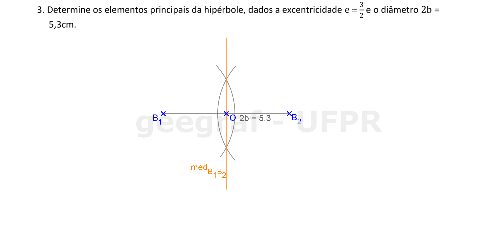
			   <figcaption>Vamos iniciar encontrando o segmento <b>2b</b> e a <b>medB1B2</b>.</figcaption>
		   </li>
		   <li>
			   <input type="radio" id="002p" name="sl">
			   <label for="002p"></label>
			   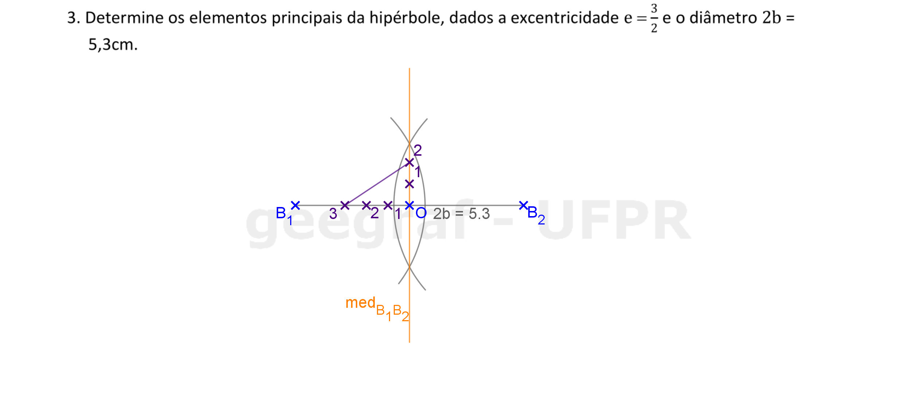
			   <figcaption>Usando o teorema de Tales, determinamos a proporção da excentricidade $\mathsf{ {c \over a} = {3 \over 2}}$ fazendo $\mathsf{ {O3 \over O2} = {3 \over 2}}$.</figcaption>
		   </li>
		   <li>
			   <input type="radio" id="003p" name="sl">
			   <label for="003p"></label>
			   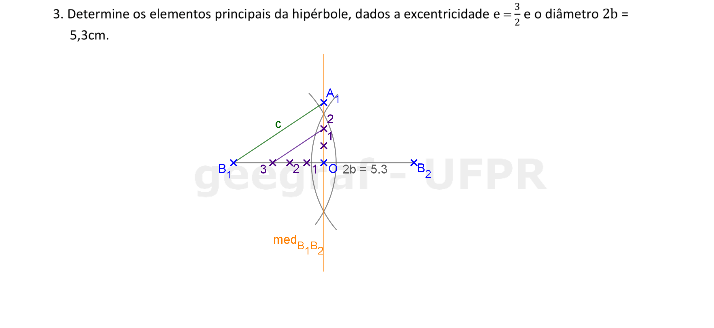
			   <figcaption>Construindo o segmento paralelo a <b>23</b> que passa por <b>B1</b>, encontramos o vértice <b>A1</b> na mediatriz de <b>B1B2</b>.</figcaption>
		   </li>
		   <li>
			   <input type="radio" id="004p" name="sl">
			   <label for="004p"></label>
			   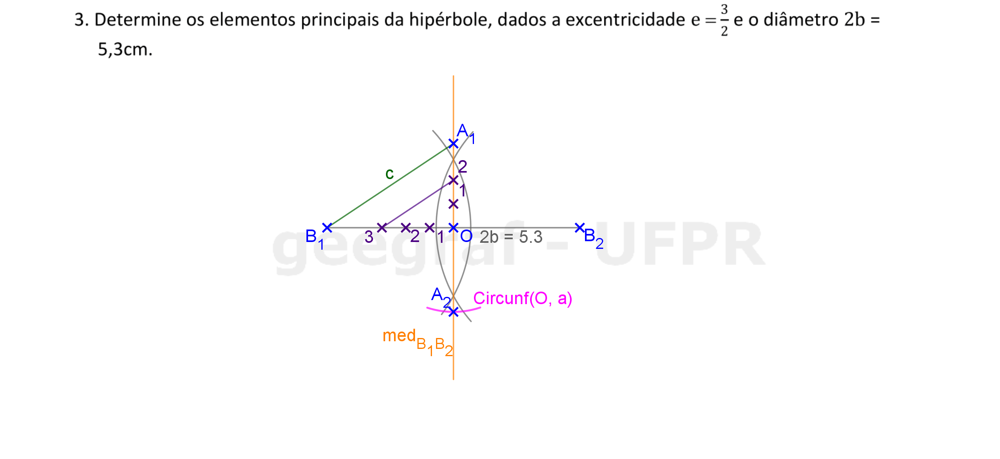
			   <figcaption>Encontre o simétrico de <b>A1</b> em relação ao centro da elipse.</figcaption>
		   </li>
		   <li>
			   <input type="radio" id="005p" name="sl">
			   <label for="005p"></label>
			   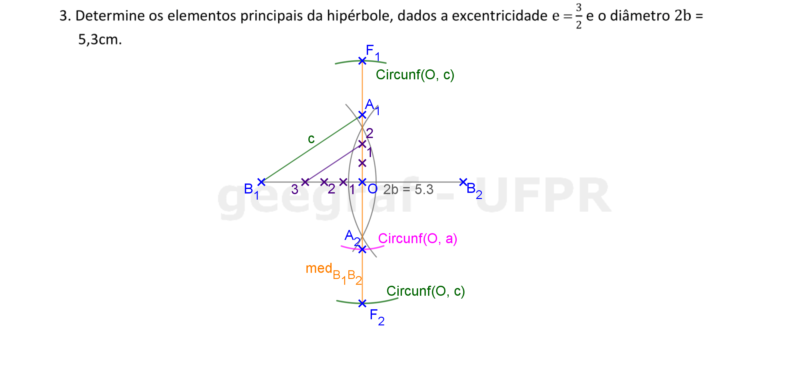
			   <figcaption>A <b>Circunf(O1, c)</b> determina os focos <b>F1</b> e <b>F2</b> na mediatriz de <b>B1B2</b>.</figcaption>
		   </li>
		   <li>
			   <input type="radio" id="006p" name="sl">
			   <label for="006p"></label>
			   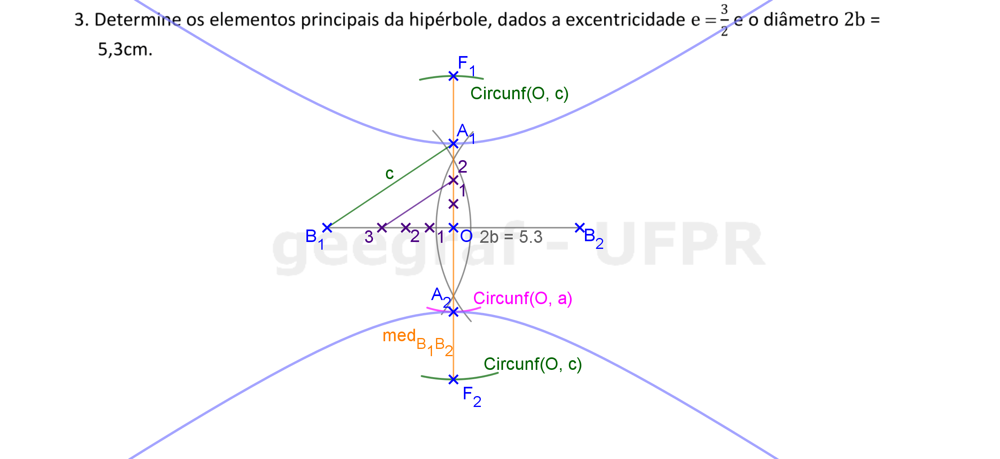
			   <figcaption>Para finalizar, construa a hipérbole à mão livre.</figcaption>
		   </li>
		</ul>
		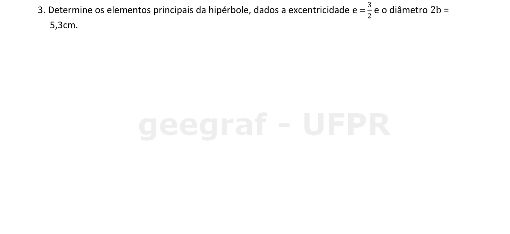
  

  

Exercício Proposto 3.2: exercício 5 da pág. 36

  
  

&#x1f4cf; &#x1f4d0; Resolução

	
Vamos construir os elementos principais de uma hipérbole dada por um foco, uma assíntota e o eixo real.

	  <ul class="slider">
		  <li>
			   <input type="radio" id="010p" name="sl">
			   <label for="010p"></label>
			   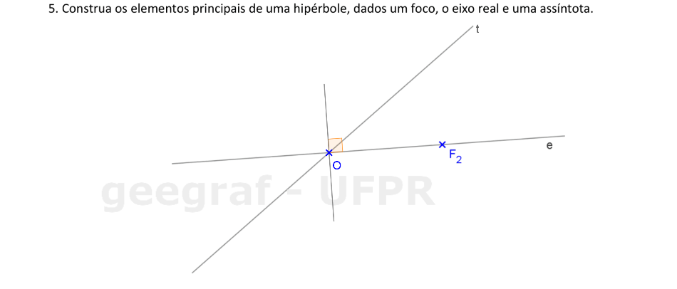
			   <figcaption>A interseção do eixo real com a assíntota é o centro da hipérbole. Construa a reta perpendicular ao eixo real que passa pelo centro.</figcaption>
		   </li>
		   <li>
			   <input type="radio" id="011p" name="sl">
			   <label for="011p"></label>
			   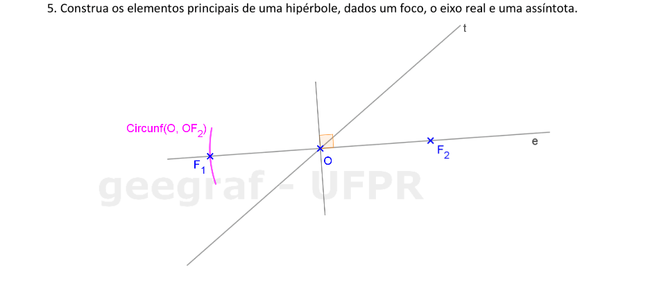
			   <figcaption>Encontre o foco <b>F1</b>: simétrico de <b>F2</b> em relação ao centro da hipérbole.</figcaption>
		   </li>
		   <li>
			   <input type="radio" id="012p" name="sl">
			   <label for="012p"></label>
			   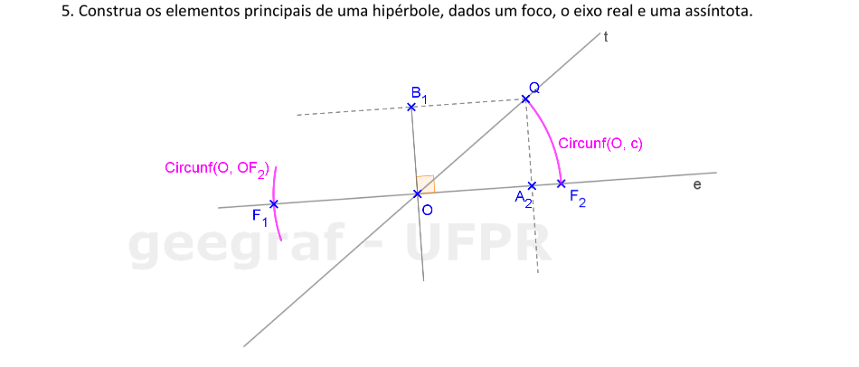
			   <figcaption>Construindo o arco com centro em <b>O</b> e raio <b>c</b>, encontramos na assíntota um dos vértices do retângulo que determina as assíntotas. A reta paralela ao eixo real que passa por <b>Q</b> determina o ponto <b>B1</b>. A reta perpendicular ao eixo real que passa por <b>Q</b> determina o ponto <b>A2</b>.</figcaption>
		   </li>
		   <li>
			   <input type="radio" id="013p" name="sl">
			   <label for="013p"></label>
			   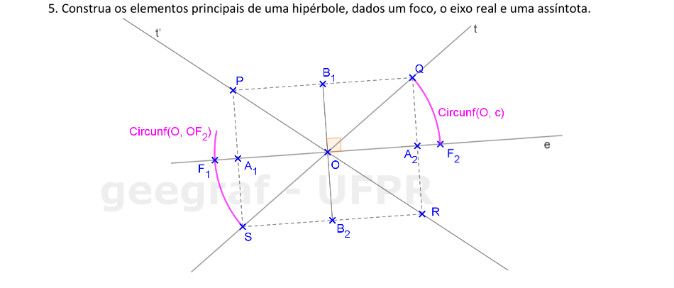
			   <figcaption>Determine os simétricos de <b>B1</b> e de <b>A2</b> em relação ao centro <b>O</b> e defina a outra assíntota da hipérbole.</figcaption>
		   </li>
		   <li>
			   <input type="radio" id="014p" name="sl">
			   <label for="014p"></label>
			   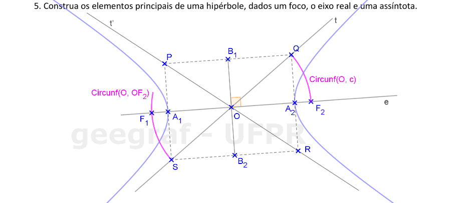
			   <figcaption>Para finalizar, basta construir a hipérbole à mão livre.</figcaption>
		   </li>
		</ul>
		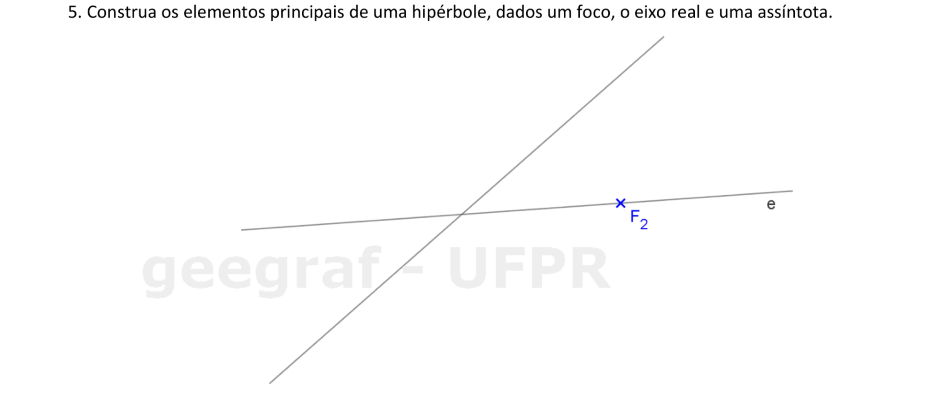
  

  

Exercício Proposto 2.3: exercício 3 da pág. 25

  
  

&#x1f4cf; &#x1f4d0; Resolução

	
Vamos construir a reta tangente à parábola paralela à reta <b>r</b>.

	  <ul class="slider">
		  <li>
			   <input type="radio" id="016p" name="sl">
			   <label for="016p"></label>
			   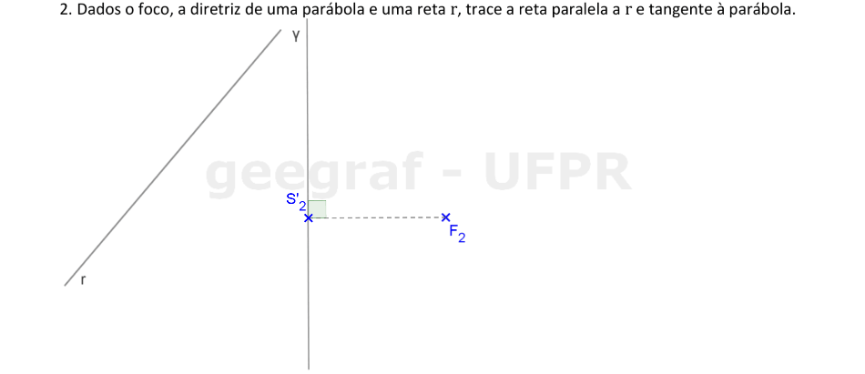
			   <figcaption>A reta <b>F2S'2 &perp; &gamma;</b> determina o eixo da parábola.</figcaption>
		   </li>
		   <li>
			   <input type="radio" id="017p" name="sl">
			   <label for="017p"></label>
			   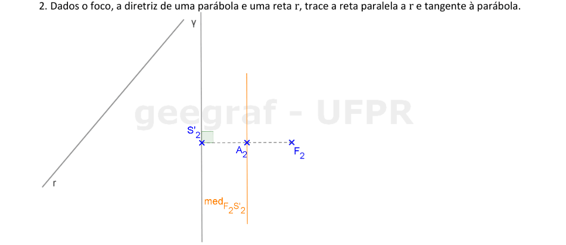
			   <figcaption>Encontre a mediatriz de <b>F2S'2</b> para achar o vértice da parábola.</figcaption>
		   </li>
		   <li>
			   <input type="radio" id="018p" name="sl">
			   <label for="018p"></label>
			   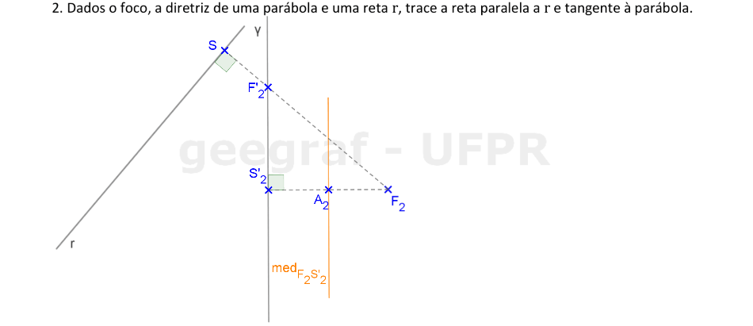
			   <figcaption>A reta <b>SF2 &perp; &gamma;</b> determina na diretriz o simétrico do foco em relação à reta tangente à parábola paralela a <b>r</b>.</figcaption>
		   </li>
		   <li>
			   <input type="radio" id="019p" name="sl">
			   <label for="019p"></label>
			   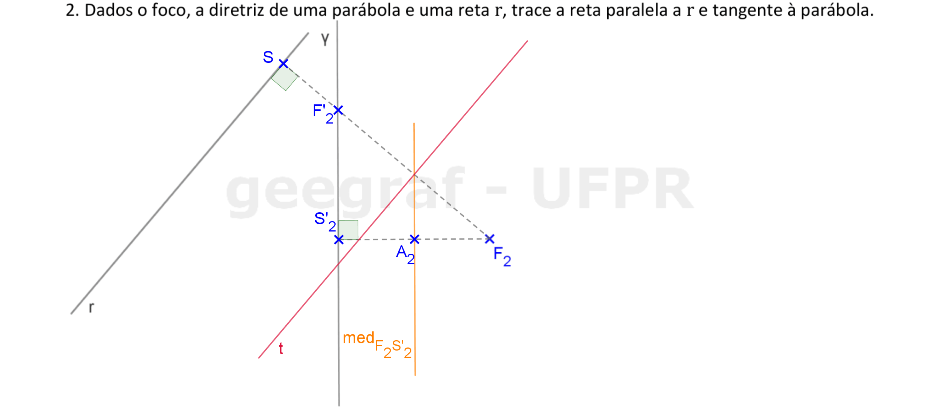
			   <figcaption>Construa a mediatriz de <b>F2F'2</b> para determinar a reta tangente à parábola paralela a <b>r</b>.</figcaption>
		   </li>
		   <li>
			   <input type="radio" id="020p" name="sl">
			   <label for="020p"></label>
			   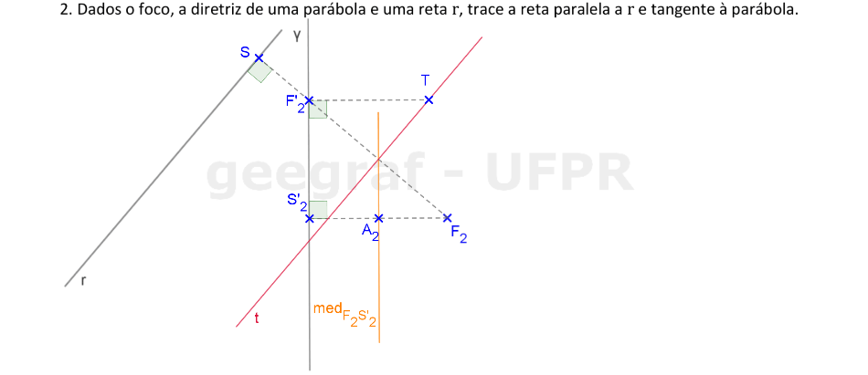
			   <figcaption>Construa a reta paralela ao eixo que passa por <b>F'2</b>. A interseção desta reta com a reta tangente <b>t</b> é o ponto de tangência.</figcaption>
		   </li>
		   <li>
			   <input type="radio" id="021p" name="sl">
			   <label for="021p"></label>
			   
			   <figcaption>Para concluir, basta construir a parábola à mão livre.</figcaption>
		   </li>
		</ul>
		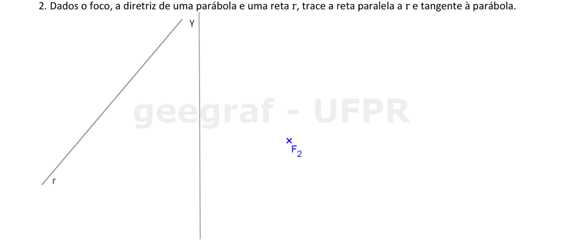
  

