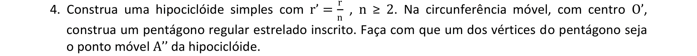

<link rel="stylesheet" href="../../imagens/style.css">

<h2 id="inicio">Exercícios Propostos do Módulo 4</h2>
<h3>Homotetia, Rotação e curvas</h3> 
  

Exercício Proposto 4.1: exercício 9 da pág. 46

  
  

&#x1f4cf; &#x1f4d0; Resolução

	
Usaremos a Homotetia para construir um retângulo inscrito no semicírculo dado.

	  <ul class="slider">
		  <li>
			   <input type="radio" id="001p" name="sl">
			   <label for="001p"></label>
			   
			   <figcaption>Vamos iniciar encontrando o segmento <b>O3 = 3&middot;O1</b> e a reta perpendicular ao diâmetro que passa pelo centro <b>O</b>.</figcaption>
		   </li>
		   <li>
			   <input type="radio" id="002p" name="sl">
			   <label for="002p"></label>
			   
			   <figcaption>Defina o segmento <b>O2 = 2\middotO1</b>. Desta forma, temos o retângulo semelhante à solução inscrita que vamos construir: <b>O2X'3</b>.</figcaption>
		   </li>
		   <li>
			   <input type="radio" id="003p" name="sl">
			   <label for="003p"></label>
			   
			   <figcaption>Usando o centro de homotetia <b>H &equiv; O</b>, defina o ponto <b>X</b> no arco do semicírculo.</figcaption>
		   </li>
		   <li>
			   <input type="radio" id="004p" name="sl">
			   <label for="004p"></label>
			   
			   <figcaption>Construa o segmento <b>XY // O2</b>...</figcaption>
		   </li>
		   <li>
			   <input type="radio" id="005p" name="sl">
			   <label for="005p"></label>
			   
			   <figcaption>... <b>XW // AB</b>...</figcaption>
		   </li>
		   <li>
			   <input type="radio" id="006p" name="sl">
			   <label for="006p"></label>
			   
			   <figcaption>... e <b>WZ // O2</b>. Desta forma, o retângulo <b>XYZW</b> fica inscrito no semicírculo, com o lado <b>YZ = 3&middot;XY</b>.</figcaption>
		   </li>
		</ul>
		
  

  

Exercício Proposto 4.2: exercício 3 da pág. 50

  
  

&#x1f4cf; &#x1f4d0; Resolução

	
Vamos construir uma ciclóide alongada usando uma rotação.

	  <ul class="slider">
		  <li>
			   <input type="radio" id="010p" name="sl">
			   <label for="010p"></label>
			   
			   <figcaption>Construa uma circunferência de centro <b>O</b> e raio <b>OA</b>. Trace a reta <b>r</b> tangente a esta circunferência pelo ponto <b>A</b>.</figcaption>
		   </li>
		   <li>
			   <input type="radio" id="011p" name="sl">
			   <label for="011p"></label>
			   
			   <figcaption>Usando um ponto qualquer <b>A' &isin; r</b>, construa a circunferência com raio <b>O'A' = OA</b> tangente à reta <b>r</b>. Defina os pontos <b>P</b> e <b>P'</b> pertencentes aos prolongamentos dos raios <b>OA</b> e <b>O'A'</b>.</figcaption>
		   </li>
		   <li>
			   <input type="radio" id="012p" name="sl">
			   <label for="012p"></label>
			   
			   <figcaption>Defina o ângulo $\mathsf{ \alpha = { {AA'} \over {OA} } }$ .</figcaption>
		   </li>
		   <li>
			   <input type="radio" id="013p" name="sl">
			   <label for="013p"></label>
			   
			   <figcaption>Defina a rotação do ponto <b>P'</b> feita por meio do ângulo de amplitude fixa <b>&alpha;</b> e vértice <b>O'</b></figcaption>
		   </li>
		   <li>
			   <input type="radio" id="014p" name="sl">
			   <label for="014p"></label>
			   
			   <figcaption>A ciclóide alongada é o lugar geométrico da extremidade do ângulo <b>&alpha;</b>, ou seja, do ponto <b>P''</b>, em relação ao ponto <b>A'</b>.</figcaption>
		   </li>
		</ul>
		
  

  

Exercício Proposto 4.3: exercício 3 da pág. 51

  
  

&#x1f4cf; &#x1f4d0; Resolução

	
Vamos construir uma epiciclóide encurtada usando rotações.

	  <ul class="slider">
		  <li>
			   <input type="radio" id="015p" name="sl">
			   <label for="015p"></label>
			   
			   <figcaption>Começamos definindo um ângulo central qualquer <b>AÔA' = &alpha;</b> na circunferência de centro <b>O</b> e raio <b>OA = r</b>.</figcaption>
		   </li>
		   <li>
			   <input type="radio" id="016p" name="sl">
			   <label for="016p"></label>
			   
			   <figcaption>Defina o número <b>n &ge; 2</b> e a circunferência de centro <b>O'</b>, tangente à circunferência de centro <b>O</b> no ponto <b>A'</b>. O raio da circunferência de centro <b>O'</b> mede $\mathsf{ r' = { {r} \over {n} } = { {OA} \over {n} } }$.</figcaption>
		   </li>
		   <li>
			   <input type="radio" id="017p" name="sl">
			   <label for="017p"></label>
			   
			   <figcaption>Na epiciclóide encurtada, a trajetória será de um ponto <b>P</b> pertencente ao raio <b>O'A'</b>.</figcaption>
		   </li>
		   <li>
			   <input type="radio" id="018p" name="sl">
			   <label for="018p"></label>
			   
			   <figcaption>O ângulo correspondente da circunferência menor mede $\mathsf{ \beta = { {\alpha \cdot r} \over {O'A'} } }$.</figcaption>
		   </li>
		   <li>
			   <input type="radio" id="019p" name="sl">
			   <label for="019p"></label>
			   
			   <figcaption>Defina o ângulo central com medida paramétrica <b>PO'P'' = &beta;</b> na circunferência menor.</figcaption>
		   </li>
		   <li>
			   <input type="radio" id="020p" name="sl">
			   <label for="020p"></label>
			   
			   <figcaption>A epiciclóide encurtada é o lugar geométrico da extremidade do ângulo <b>&beta;</b>, ou seja, do ponto <b>P''</b>, em relação ao ponto <b>A'</b>.</figcaption>
		   </li>
		</ul>
		
  

  

Exercício Proposto 4.4: exercício 4 da pág. 51

  
  

&#x1f4cf; &#x1f4d0; Resolução

	
Vamos construir uma hipociclóide usando rotações, com um pentágono regular estrelado giratório.

	  <ul class="slider">
		  <li>
			   <input type="radio" id="021p" name="sl">
			   <label for="021p"></label>
			   
			   <figcaption>Usando os elementos mostrados nos dois exemplos anteriores, construa uma hipociclóide simples usando o ângulo central com medida <b>&beta;</b> na circunferência menor.</figcaption>
		   </li>
		   <li>
			   <input type="radio" id="022p" name="sl">
			   <label for="022p"></label>
			   
			   <figcaption>Defina o ângulo central do pentágono a partir da extremidade móvel <b>A''</b> da circunferência de centro <b>O'</b>.</figcaption>
		   </li>
		   <li>
			   <input type="radio" id="023p" name="sl">
			   <label for="023p"></label>
			   
			   <figcaption>Construa os outros vértices e os lados do pentágono regular estrelado.</figcaption>
		   </li>
		   <li>
			   <input type="radio" id="024p" name="sl">
			   <label for="024p"></label>
			   
			   <figcaption>Ao movimentar a circunferência, os vértices e lados do pentágono movimentam-se junto. Experimente definir os lugares geométricos dos vértices do pentágono em relação ao ponto <b>A'</b>.</figcaption>
		   </li>
		</ul>
		
  

