<link rel="stylesheet" href="../../imagens/style.css">

<h2 id="inicio">Exercícios Propostos do Módulo 5</h2>
<h3>Homotetia, Rotação e curvas</h3> 
  

Exercício Proposto 5.1: exercício 7 da pág. 55

  
  

&#x1f4cf; &#x1f4d0; Resolução

	
Vamos usar a translação para encontrar os pontos <b>X</b> e <b>Y</b> dos lados <b>AB</b> e <b>AC</b> do triângulo tais que <b>XY // r</b> e <b>XY = m</b>.

	  <ul class="slider">
		  <li>
			   <input type="radio" id="001p" name="sl">
			   <label for="001p"></label>
			   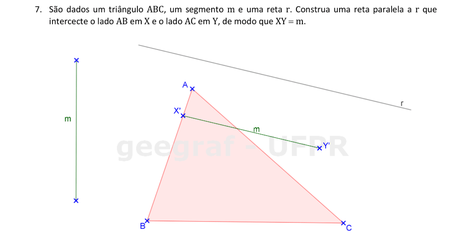
			   <figcaption>Escolha um ponto <b>X' &isin; AB</b> e construa o segmento <b>X'Y' // r</b> tal que <b>X'Y' = m</b>.</figcaption>
		   </li>
		   <li>
			   <input type="radio" id="002p" name="sl">
			   <label for="002p"></label>
			   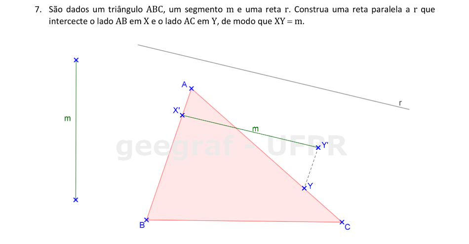
			   <figcaption>Construindo a reta paralela a <b>AB</b> que passa por <b>Y'</b>, encontramos o ponto <b>Y &isin; AC</b>, ou seja, temos a translação do segmento <b>X'Y'</b> na direção <b>AB</b>.</figcaption>
		   </li>
		   <li>
			   <input type="radio" id="003p" name="sl">
			   <label for="003p"></label>
			   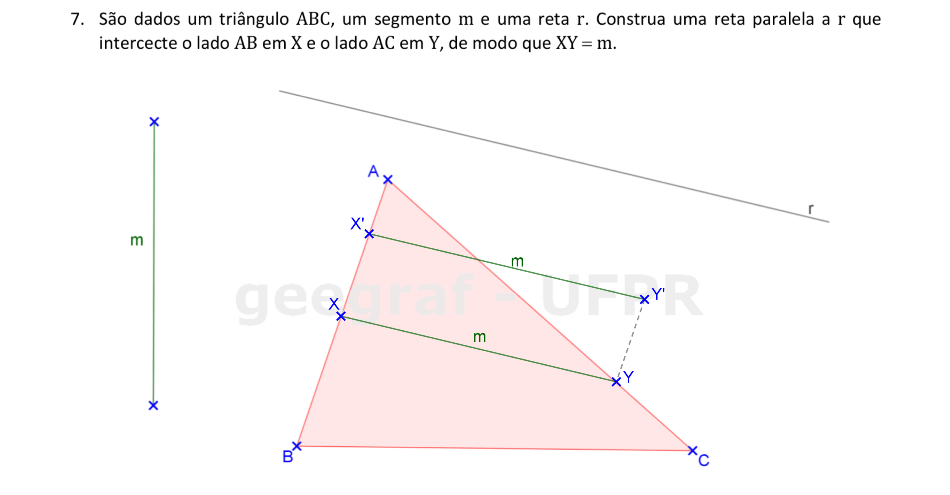
			   <figcaption>Construindo a reta paralela a <b>X'Y'</b> que passa por <b>Y</b>, encontramos o ponto <b>X &isin; AB</b>.</figcaption>
		   </li>
		</ul>
		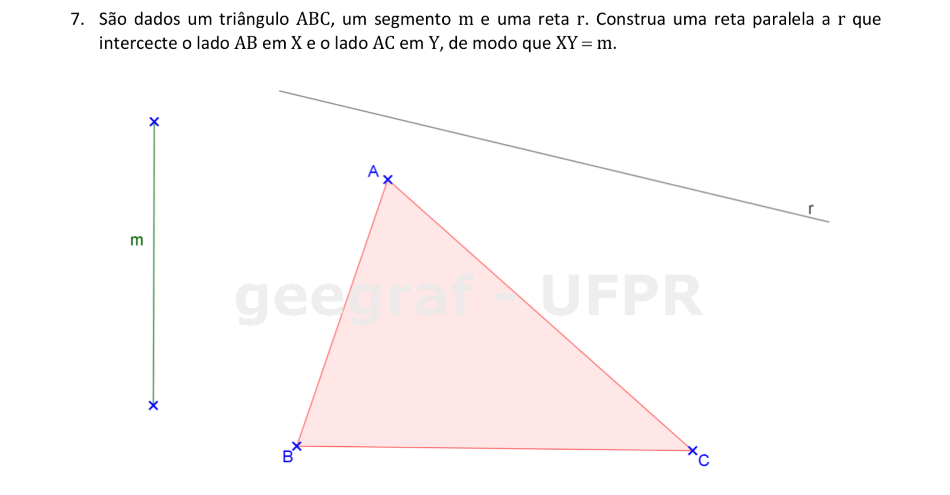
  

  

Exercício Proposto 5.2: exercício 4 da pág. 56

  
  

&#x1f4cf; &#x1f4d0; Resolução

	
Vamos construir uma hélice elíptica em projeções ortogonais e também em perspectiva. Vamos considerar a superfície de um elipsóide de revolução.

	  <ul class="slider">
		  <li>
			   <input type="radio" id="004p" name="sl">
			   <label for="004p"></label>
			   
			   <figcaption>Construa uma circunferência de centro <b>A'</b> e raio <b>r</b> e os eixos perpendiculares <b>x</b> e <b>y</b> com origem do sistema de coordenadas <b>xOy</b>. Construa a projeção frontal da elipse com centro na mesma reta paralela ao eixo <b>y</b> que passa por <b>A'</b>. Considere o segmento <b>PQ // P'Q'</b> que passa por <b>A</b> e contém os vértices do diâmetro menor da elipse.</figcaption>
		   </li>
		   <li>
			   <input type="radio" id="005p" name="sl">
			   <label for="005p"></label>
			   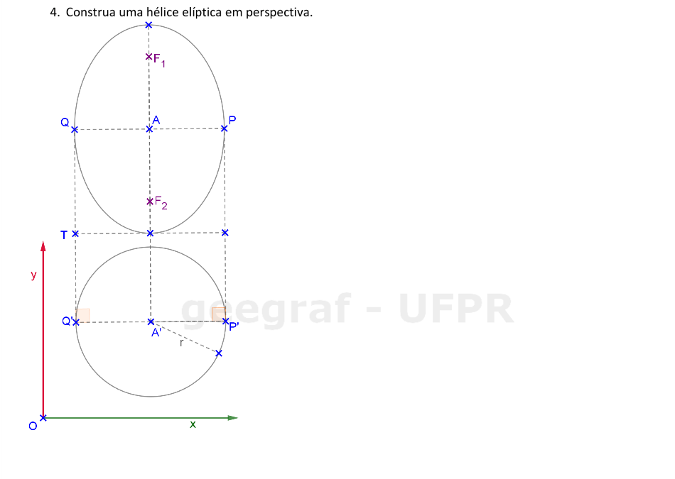
			   <figcaption>Defina o ponto limite <b>T</b> da projeção frontal a partir do diâmetro paralelo ao eixo <b>y</b>.</figcaption>
		   </li>
		   <li>
			   <input type="radio" id="006p" name="sl">
			   <label for="006p"></label>
			   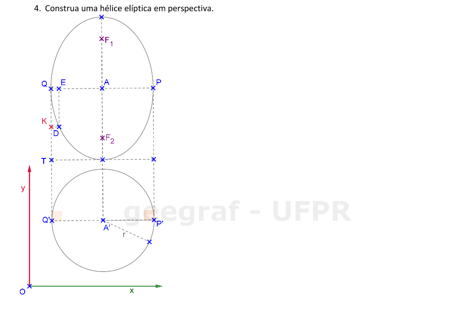
			   <figcaption>Defina o ponto <b>K &isin; QT</b>, e o ponto da projeção frontal <b>D</b> tal que <b>DE // QT</b> e <b>KD // P'Q'</b>.</figcaption>
		   </li>
		   <li>
			   <input type="radio" id="007p" name="sl">
			   <label for="007p"></label>
			   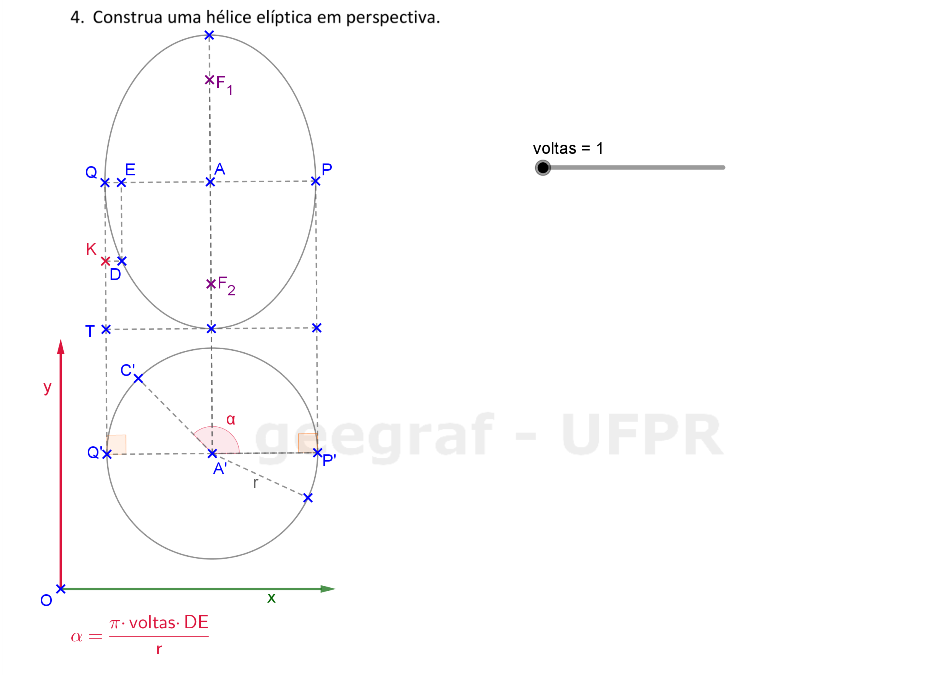
			   <figcaption>Considere um número chamado <b>voltas</b>, que será usado para controlar o número de voltas da hélice. Usando uma regra de três, temos que o segmento <b>DE</b> corresponde à altura relativa que define a medida do ângulo central da base <b>&alpha; = P'A'C'</b> por meio da seguinte expressão: $\mathsf{ \alpha = { {2\pi \cdot voltas \cdot DE} \over {r} } }$.</figcaption>
		   </li>
		   <li>
			   <input type="radio" id="008p" name="sl">
			   <label for="008p"></label>
			   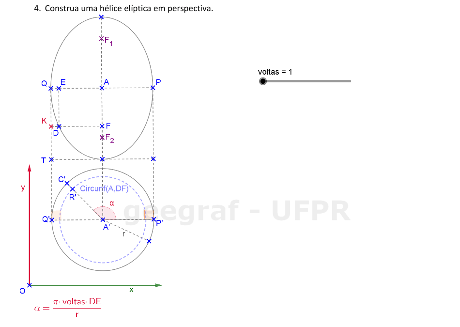
			   <figcaption>Construa a <b>Circunf(A, DF)</b>, correspondente à seção paralela ao diâmetro do elipsóide <b>P'Q'</b> da vista frontal. O ponto <b>R' &isin; A'C'</b> pertence à hélice elíptica.</figcaption>
		   </li>
		   <li>
			   <input type="radio" id="009p" name="sl">
			   <label for="009p"></label>
			   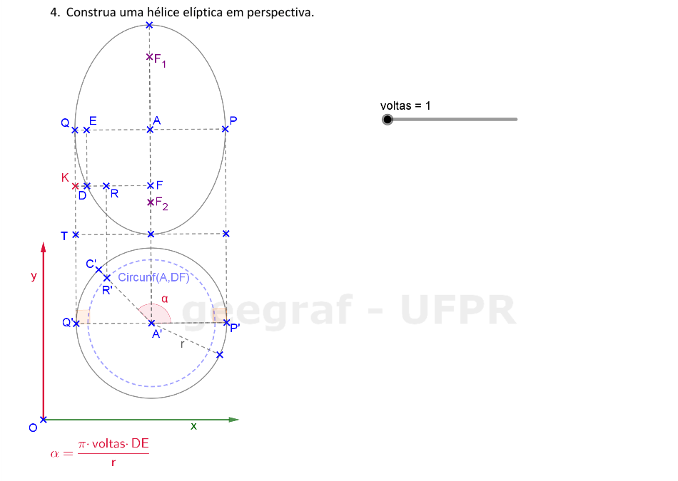
			   <figcaption>O ponto correspondente de <b>R'</b> da projeção frontal é <b>R</b> tal que <b>RR' // QT</b> e <b>R &isin; KF</b>.</figcaption>
		   </li>
		   <li>
			   <input type="radio" id="010p" name="sl">
			   <label for="010p"></label>
			   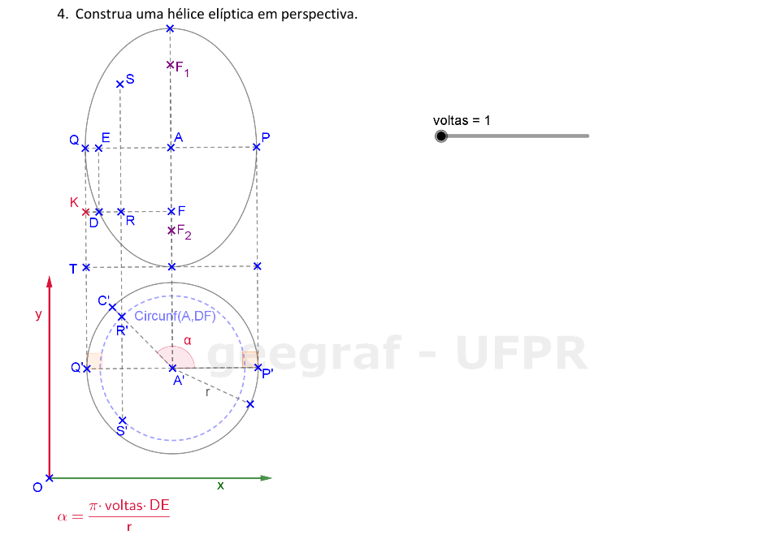
			   <figcaption>Como o elipsóide é simétrico em relação a qualquer seção que passa pelo centro, temos que os simétricos de <b>R</b> e de <b>R'</b> em relação a <b>PQ</b> e <b>P'Q'</b> pertencem à hélice elíptica.</figcaption>
		   </li>
		   <li>
			   <input type="radio" id="011p" name="sl">
			   <label for="011p"></label>
			   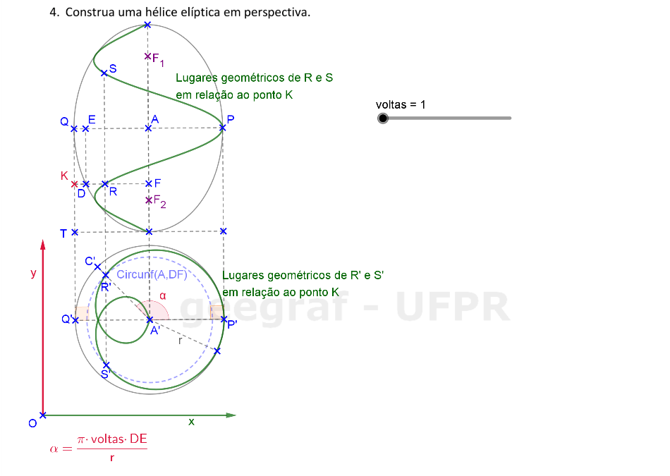
			   <figcaption>Os lugares geométricos dos pontos <b>R</b> e <b>S</b> em relação ao ponto <b>K</b> definem a projeção frontal da hélice elíptica. Os lugares geométricos dos pontos <b>R'</b> e <b>S'</b> em relação ao ponto <b>K</b> definem a projeção superior da hélice elíptica.</figcaption>
		   </li>
		   <li>
			   <input type="radio" id="012p" name="sl">
			   <label for="012p"></label>
			   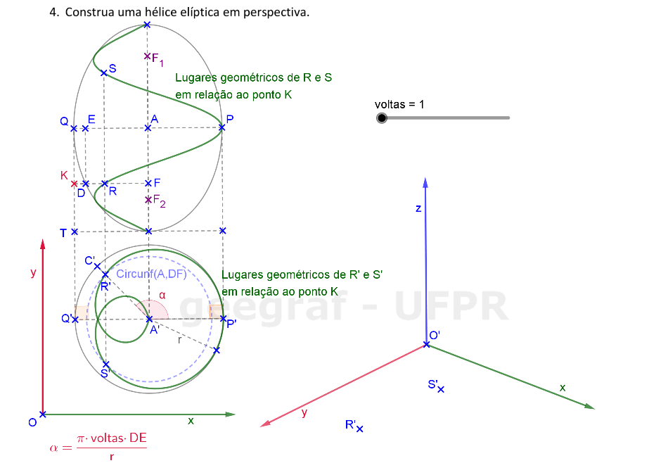
			   <figcaption>Construa os eixos em perspectiva e defina as coordenadas e projeções dos pontos <b>R'</b> e <b>S'</b>.</figcaption>
		   </li>
		   <li>
			   <input type="radio" id="013p" name="sl">
			   <label for="013p"></label>
			   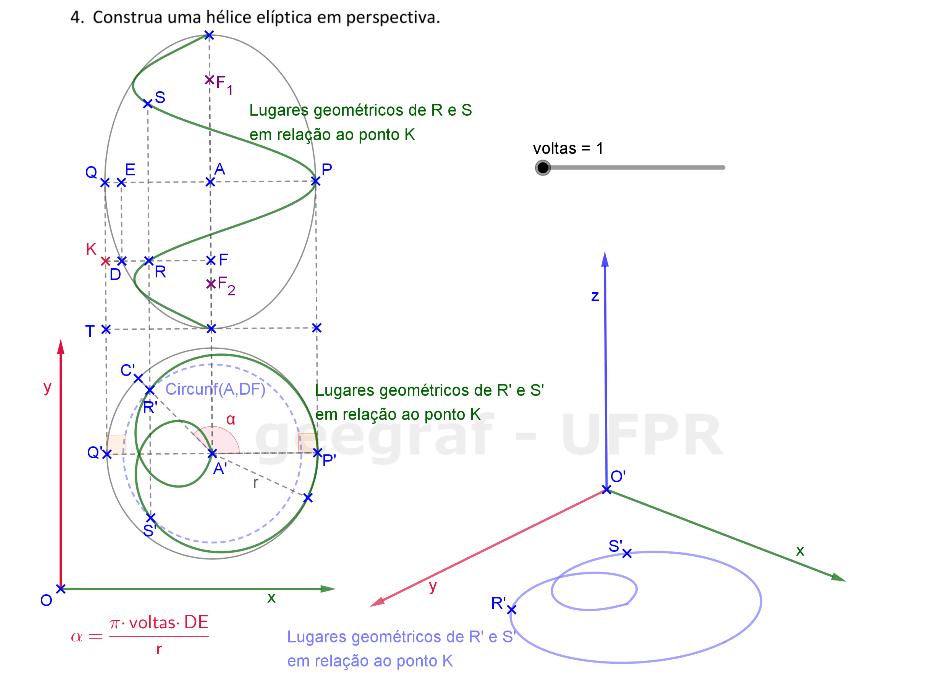
			   <figcaption>Os lugares geométricos dos pontos <b>R'</b> e <b>S'</b> da perspectiva em relação ao ponto <b>K</b> definem a projeção da hélice elíptica em perspectiva.</figcaption>
		   </li>
		   <li>
			   <input type="radio" id="014p" name="sl">
			   <label for="014p"></label>
			   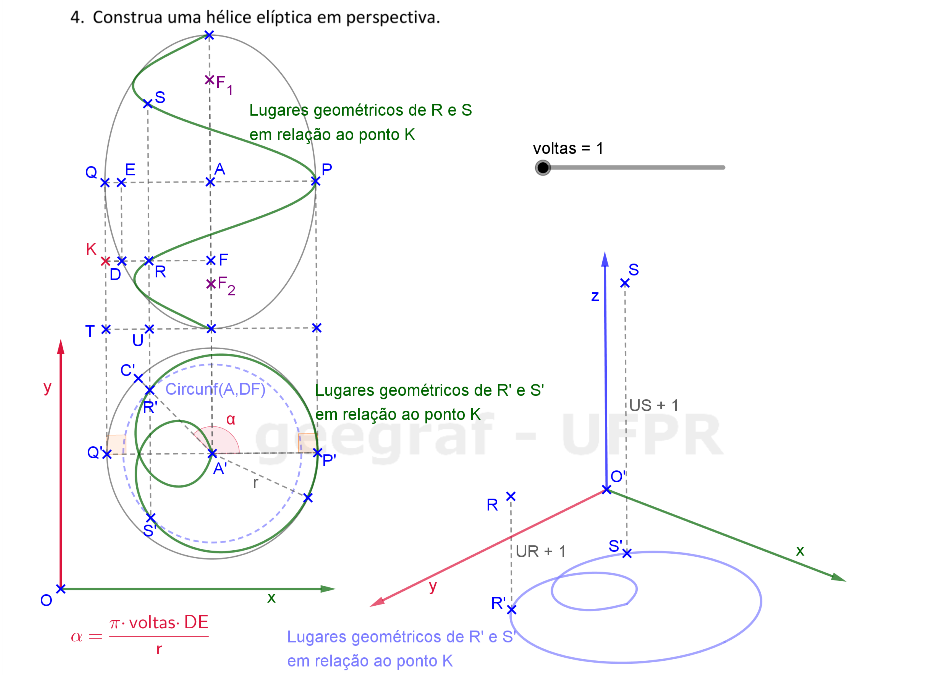
			   <figcaption>Transfira as medidas <b>UR</b> e <b>US</b> para a perspectiva, tal que <b>RR' // z</b>, <b>RR' = UR + 1</b>, <b>SS' // z</b> e <b>SS' = US + 1</b>.</figcaption>
		   </li>
		   <li>
			   <input type="radio" id="015p" name="sl">
			   <label for="015p"></label>
			   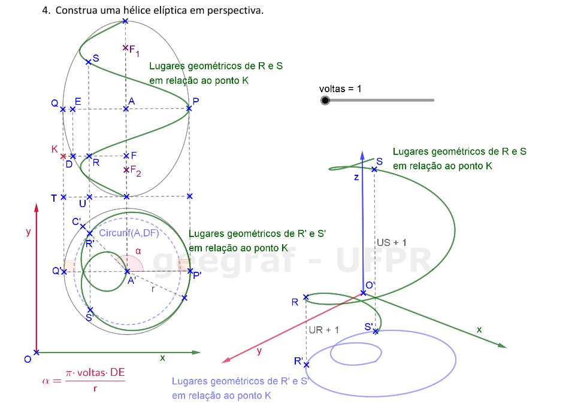
			   <figcaption>Os lugares geométricos dos pontos <b>R</b> e <b>S</b> na perspectiva em relação ao ponto <b>K</b> definem a projeção da hélice elíptica na perspectiva.</figcaption>
		   </li>
		   <li>
			   <input type="radio" id="016p" name="sl">
			   <label for="016p"></label>
			   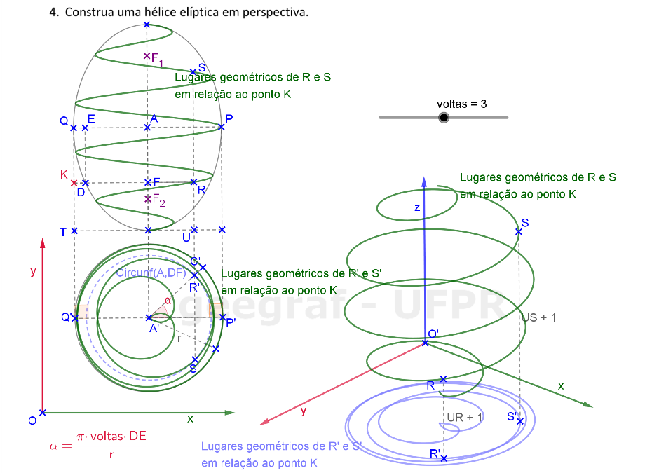
			   <figcaption>Modificando o valor do número <b>voltas</b>, temos outras hélices elípticas representadas em projeções e também em perspectiva.</figcaption>
		   </li>
		</ul>
		
  

  

Exercício Proposto 5.3: exercício 3 da pág. 59

  
  

&#x1f4cf; &#x1f4d0; Resolução

	
Vamos construir uma cissóide de uma circunferência secante a uma reta.

	  <ul class="slider">
		  <li>
			   <input type="radio" id="017p" name="sl">
			   <label for="017p"></label>
			   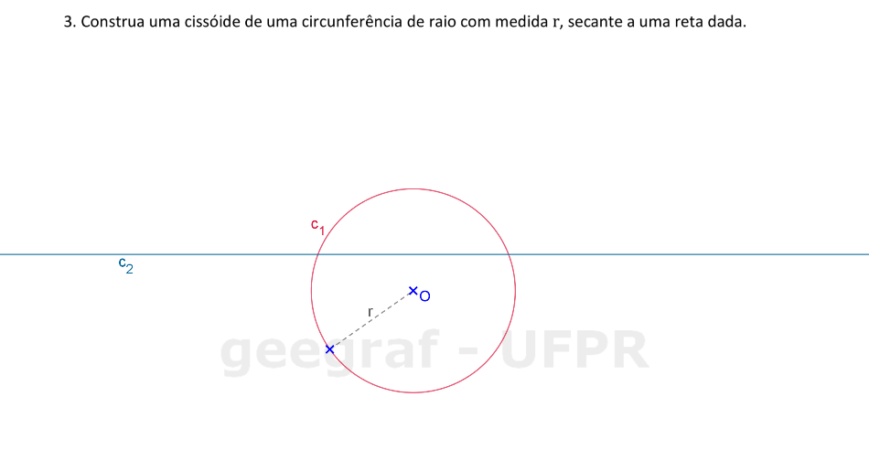
			   <figcaption>Construa uma circunferência de raio <b>r</b> (curva <b>c1</b>) e um reta secante à circunferência (curva <b>c2</b>).</figcaption>
		   </li>
		   <li>
			   <input type="radio" id="018p" name="sl">
			   <label for="018p"></label>
			   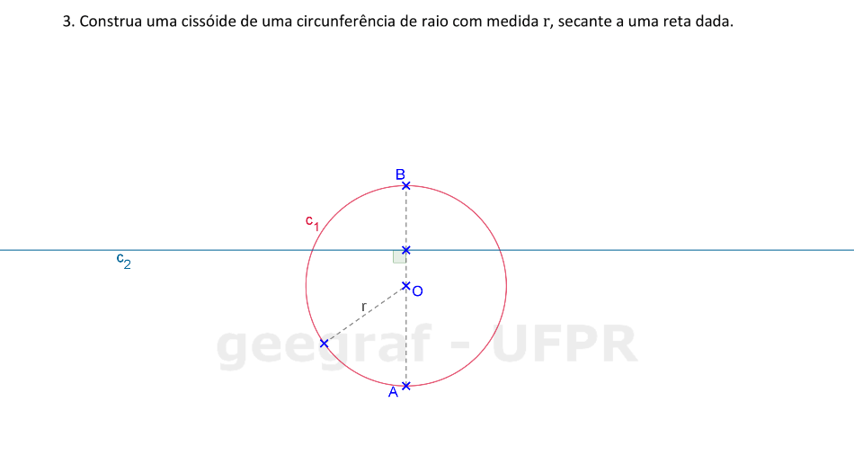
			   <figcaption>Construa o diâmetro <b>AB &perp; c2</b>.</figcaption>
		   </li>
		   <li>
			   <input type="radio" id="019p" name="sl">
			   <label for="019p"></label>
			   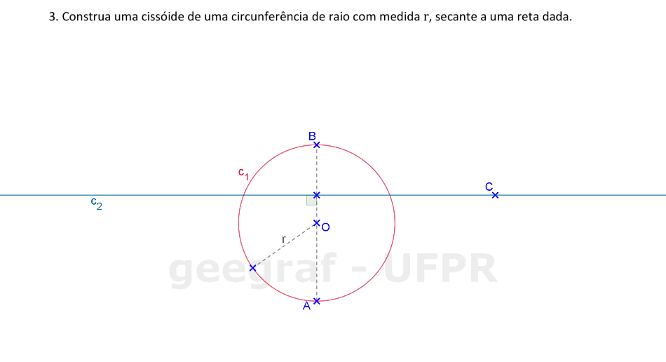
			   <figcaption>Defina o ponto <b>C &isin; c2</b>.</figcaption>
		   </li>
		   <li>
			   <input type="radio" id="020p" name="sl">
			   <label for="020p"></label>
			   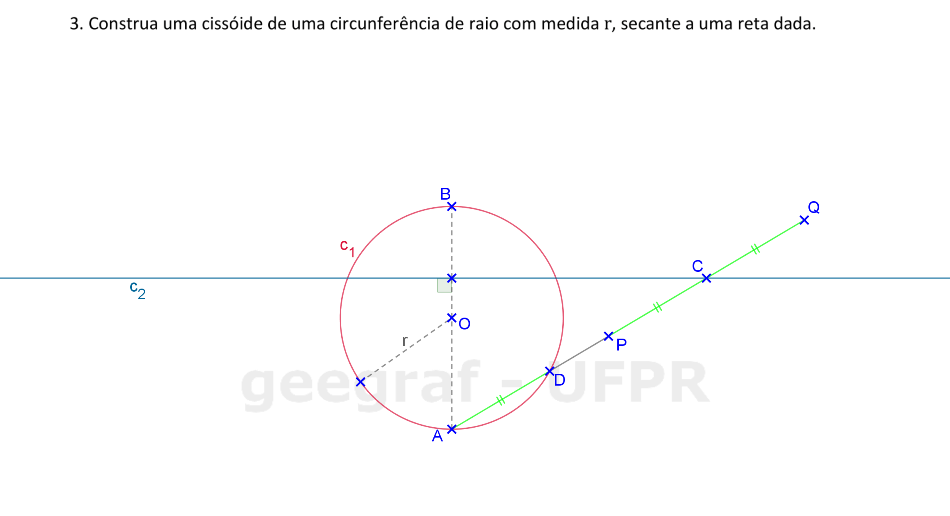
			   <figcaption>Determine os pontos <b>P &isin; AC</b> e <b>Q &isin; AC</b> tais que <b>CP = CQ = AD</b>.</figcaption>
		   </li>
		   <li>
			   <input type="radio" id="021p" name="sl">
			   <label for="021p"></label>
			   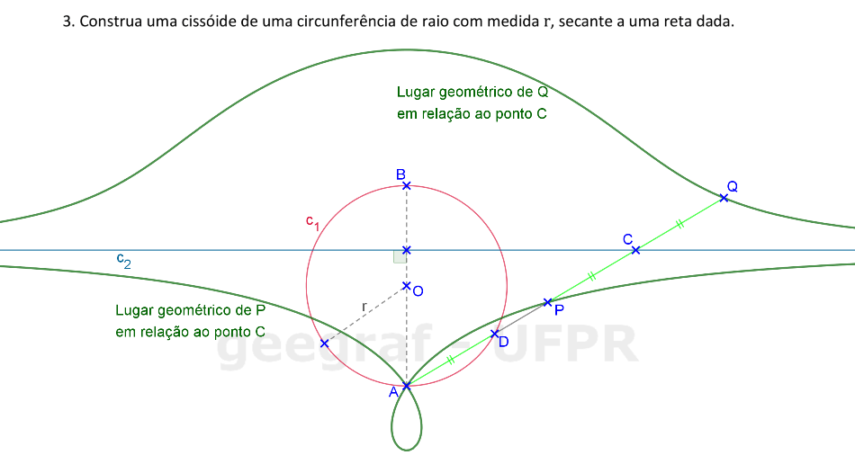
			   <figcaption>Os lugares geométricos de <b>P</b> e de <b>Q</b> em relação ao ponto <b>C</b> definem a cissóide das curvas <b>c1</b> e <b>c2</b>.</figcaption>
		   </li>
		</ul>
		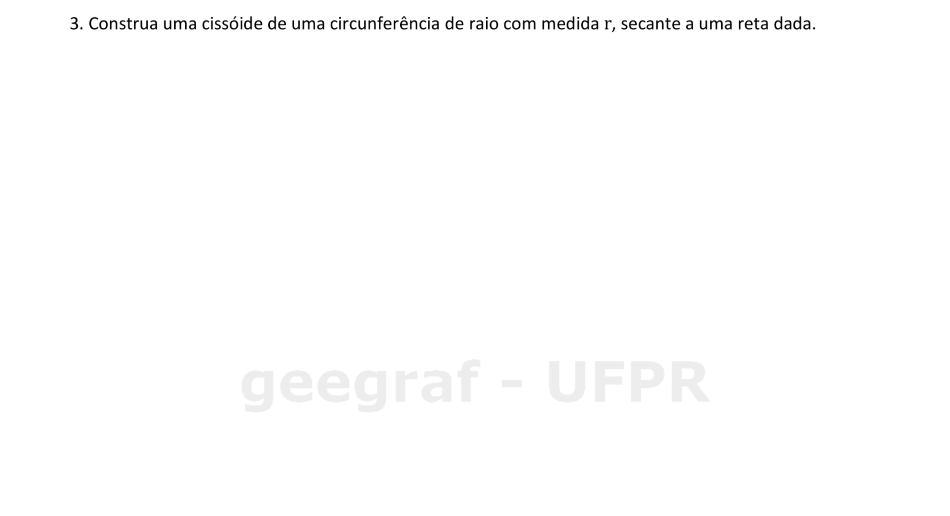
  

  

Exercício Proposto 5.4: exercício 4 da pág. 60

  
  

&#x1f4cf; &#x1f4d0; Resolução

	
Vamos construir uma conchóide de uma elipse com parâmetro <b>d</b> e pólo <b>A</b>.

	  <ul class="slider">
		  <li>
			   <input type="radio" id="025p" name="sl">
			   <label for="025p"></label>
			   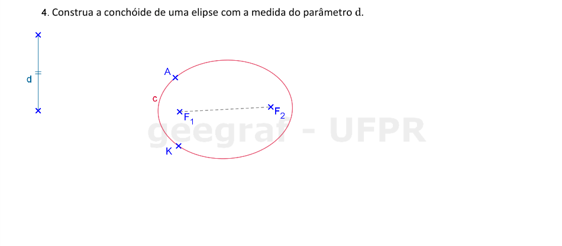
			   <figcaption>Construa uma elipse que contém um ponto <b>K</b> (curva <b>c</b>) e determine um ponto <b>A</b> da elipse. </figcaption>
		   </li>
		   <li>
			   <input type="radio" id="022p" name="sl">
			   <label for="022p"></label>
			   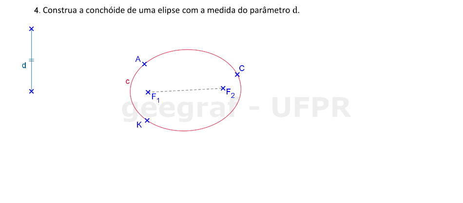
			   <figcaption>Escolha um ponto <b>C &isin; c</b>.</figcaption>
		   </li>
		   <li>
			   <input type="radio" id="023p" name="sl">
			   <label for="023p"></label>
			   
			   <figcaption>Determine os pontos <b>P &isin; AC</b> e <b>Q &isin; AC</b> tais que <b>CP = CQ = d</b>.</figcaption>
		   </li>
		   <li>
			   <input type="radio" id="024p" name="sl">
			   <label for="024p"></label>
			   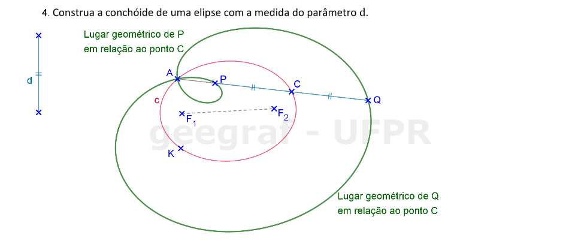
			   <figcaption>Os lugares geométricos de <b>P</b> e de <b>Q</b> em relação ao ponto <b>C</b> definem a conchóide da elipse <b>c</b>.</figcaption>
		   </li>
		</ul>
		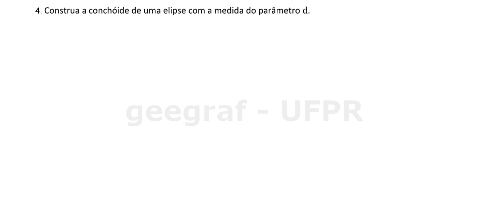
  

