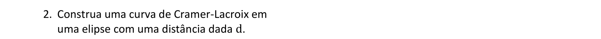

<link rel="stylesheet" href="../../imagens/style.css">

<h2 id="inicio">Exercícios Propostos do Módulo 6</h2>
<h3>Homotetia, Rotação e curvas</h3> 
  

Exercício Proposto 6.1: exercício 2 da pág. 70

  
  

&#x1f4cf; &#x1f4d0; Resolução

	
Vamos construir uma curva de Cramer-Lacroix a partir de uma elipse e de uma distância <b>d</b>.

	  <ul class="slider">
		  <li>
			   <input type="radio" id="001p" name="sl">
			   <label for="001p"></label>
			   
			   <figcaption>Construa uma elipse que passa por um ponto <b>K</b> e defina o segmento de medida <b>d</b>.</figcaption>
		   </li>
		   <li>
			   <input type="radio" id="002p" name="sl">
			   <label for="002p"></label>
			   
			   <figcaption>Encontre o centro <b>O</b> da elipse.</figcaption>
		   </li>
		   <li>
			   <input type="radio" id="003p" name="sl">
			   <label for="003p"></label>
			   
			   <figcaption>Escolha um ponto <b>A</b> da elipse e defina o segmento <b>AB = d</b> tal que <b>AB &perp; OA</b>.</figcaption>
		   </li>
		   <li>
			   <input type="radio" id="004p" name="sl">
			   <label for="004p"></label>
			   
			   <figcaption>Construa o segmento <b>OC &perp; OA</b> tal que <b>AC = d</b>.</figcaption>
		   </li>
		   <li>
			   <input type="radio" id="006p" name="sl">
			   <label for="006p"></label>
			   
			   <figcaption>Defina o segmento <b>BO</b>, e encontre o ponto <b>D &isin; OA</b> tal que <b>DO = BO</b>.</figcaption>
		   </li>
		   <li>
			   <input type="radio" id="007p" name="sl">
			   <label for="007p"></label>
			   
			   <figcaption>Os lugares geométricos de <b>C</b> e de <b>D</b> em relação ao ponto <b>A</b> definem uma curva de Cramer-Lacroix.</figcaption>
		   </li>
		</ul>
		
  

  

Exercício Proposto 6.2: pág. 76

  
  

&#x1f4cf; &#x1f4d0; Resolução

	
Vamos construir curvas ornamentais usando suas equações com coordenadas polares. Defina o parâmetro <b>OA = p</b> da curva, escolha um ponto <b>A'</b> da circunferência e defina um ângulo <b>&alpha; = AOA'</b>. Construa a circunferência com centro em <b>O</b> e raio com medida com a medida indicada da equação polar em função do ângulo <b>&alpha;</b>.

	  <ul class="slider">
		  <li>
			   <input type="radio" id="008p" name="sl">
			   <label for="008p"></label>
			   
			   <figcaption>Os lugares geométricos de <b>P</b> e de <b>P'</b> em relação ao ponto <b>A'</b> definem uma curva ornamental com parâmetro <b>p</b>.</figcaption>
		   </li>
		   <li>
			   <input type="radio" id="009p" name="sl">
			   <label for="009p"></label>
			   
			   <figcaption>Defina o número <b>n</b>. O lugar geométrico de <b>P</b> em relação ao ponto <b>A'</b> define uma curva ornamental com parâmetro <b>p</b>.</figcaption>
		   </li>
		   <li>
			   <input type="radio" id="011p" name="sl">
			   <label for="011p"></label>
			   
			   <figcaption>Encontre o simétrico de <b>P</b> em relação a um raio da circunferência. Os lugares geométricos de <b>P</b> e de <b>P'</b> em relação ao ponto <b>A'</b> definem uma curva ornamental com parâmetro <b>p</b>.</figcaption>
		   </li>
		   <li>
			   <input type="radio" id="010p" name="sl">
			   <label for="010p"></label>
			   
			   <figcaption>Encontre o simétrico de <b>P</b> em relação a uma corda da circunferência. Os lugares geométricos de <b>P</b> e de <b>P'</b> em relação ao ponto <b>A'</b> definem uma curva ornamental com parâmetro <b>p</b>.</figcaption>
		   </li>
		</ul>
		
  

  

Exercício Proposto 6.3: pág. 77

  
  

&#x1f4cf; &#x1f4d0; Resolução

	
Vamos construir curvas ornamentais usando suas equações com coordenadas polares. Defina o parâmetro <b>OA = p</b> da curva, escolha um ponto <b>A'</b> da circunferência e defina um ângulo <b>&alpha; = AOA'</b>. Construa a circunferência com centro em <b>O</b> e raio com medida com a medida indicada da equação polar em função do ângulo <b>&alpha;</b>.

	  <ul class="slider">
		  <li>
			   <input type="radio" id="025p" name="sl">
			   <label for="025p"></label>
			   
			   <figcaption><b>1</b>. Defina o número <b>n</b>. O lugar geométrico de <b>P</b> em relação ao ponto <b>A'</b> define uma curva ornamental com parâmetro <b>p</b>.</figcaption>
		   </li>
		   <li>
			   <input type="radio" id="022p" name="sl">
			   <label for="022p"></label>
			   
			   <figcaption><b>2</b>. O lugar geométrico de <b>P</b> em relação ao ponto <b>A'</b> define uma curva lemniscata com parâmetro <b>p</b>.</figcaption>
		   </li>
		   <li>
			   <input type="radio" id="023p" name="sl">
			   <label for="023p"></label>
			   
			   <figcaption><b>3</b>. O lugar geométrico de <b>P</b> em relação ao ponto <b>A'</b> define uma curva ornamental com parâmetro <b>p</b>.</figcaption>
		   </li>
		   <li>
			   <input type="radio" id="021p" name="sl">
			   <label for="021p"></label>
			   
			   <figcaption><b>4</b>. O lugar geométrico de <b>P</b> em relação ao ponto <b>A'</b> define uma curva ornamental com parâmetro <b>p</b>.</figcaption>
		   </li>
		   <li>
			   <input type="radio" id="024p" name="sl">
			   <label for="024p"></label>
			   
			   <figcaption><b>5</b>. O lugar geométrico de <b>P</b> em relação ao ponto <b>A'</b> define uma curva ornamental com parâmetro <b>p</b>.</figcaption>
		   </li>
		   <li>
			   <input type="radio" id="026p" name="sl">
			   <label for="026p"></label>
			   
			   <figcaption><b>6</b>. Escolha um ângulo central <b>&beta;</b>. O lugar geométrico de <b>P</b> em relação ao ponto <b>A'</b> define uma espiral com parâmetro <b>p</b>.</figcaption>
		   </li>
		   <li>
			   <input type="radio" id="027p" name="sl">
			   <label for="027p"></label>
			   
			   <figcaption><b>7</b>. O lugar geométrico de <b>P</b> em relação ao ponto <b>A'</b> define uma curva torpedo com parâmetro <b>p</b>.</figcaption>
		   </li>
		   <li>
			   <input type="radio" id="028p" name="sl">
			   <label for="028p"></label>
			   
			   <figcaption><b>8</b>. O lugar geométrico de <b>P</b> em relação ao ponto <b>A'</b> define uma curva torpedo com parâmetro <b>p</b>.</figcaption>
		   </li>
		   <li>
			   <input type="radio" id="029p" name="sl">
			   <label for="029p"></label>
			   
			   <figcaption><b>9</b>. O lugar geométrico de <b>P</b> em relação ao ponto <b>A'</b> define uma curva ornamental com parâmetro <b>p</b>.</figcaption>
		   </li>
		</ul>
		
  

